<properties
    pageTitle="DocumentDB Explorer dokumentu, aby wyświetlić JSON | Microsoft Azure"
    description="Informacje na temat DocumentDB Eksploracja dokumentów, narzędzie Azure Portal, aby wyświetlić JSON, edytowanie, tworzenie i przekazywanie dokumentów JSON z DocumentDB, dokumentu NoSQL bazy danych."
        keywords="Wyświetlanie json"
    services="documentdb"
    authors="kirillg"
    manager="jhubbard"
    editor="monicar"
    documentationCenter=""/>

<tags
    ms.service="documentdb"
    ms.workload="data-services"
    ms.tgt_pltfrm="na"
    ms.devlang="na"
    ms.topic="article"
    ms.date="08/30/2016"
    ms.author="kirillg"/>

# Wyświetlanie, edytowanie, tworzenie i przekazywanie dokumentów JSON za pomocą Eksploratora dokumentu DocumentDB

Ten artykuł zawiera omówienie Eksploratora dokumentu [Microsoft Azure DocumentDB](https://azure.microsoft.com/services/documentdb/) , narzędzie portal Azure umożliwia wyświetlanie, edytowanie, tworzenie, przekazywanie i filtrować dokumenty JSON z DocumentDB. 

Uwaga Eksploratora dokumentu nie jest włączona dla kont DocumentDB z obsługą protokołu MongoDB. Ta strona zostanie zaktualizowana, gdy ta funkcja jest włączona.

## Uruchom Eksploratora dokumentu

1. W portalu Azure w Jumpbar kliknij przycisk **DocumentDB (NoSQL)**. Jeśli **DocumentDB (NoSQL)** nie jest widoczne, kliknij przycisk **Więcej usług** , a następnie kliknij pozycję **DocumentDB (NoSQL)**.

2. Wybierz nazwę konta. 

3. W menu zasobów kliknij pozycję **Eksplorator dokumentu**. 
 
    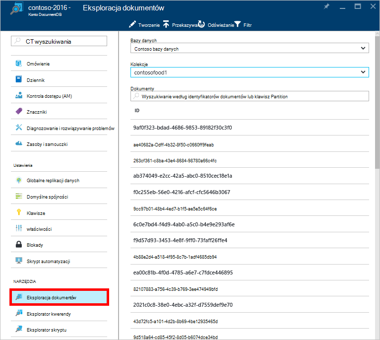

    W karta **Eksploratora dokumentu** list rozwijanych **baz danych** i **zbiorów** wstępnie są wyświetlane w zależności od kontekstu, w którym jest uruchomiona Eksploratora dokumentu. 

## Tworzenie dokumentu

1. [Uruchom Eksploratora dokumentu](#launch-document-explorer).

2. W karta **Eksploratora dokumentu** kliknij przycisk **Utwórz dokument**. 

    Fragment JSON minimalnego jest dostępna w karta **dokumentu** .

    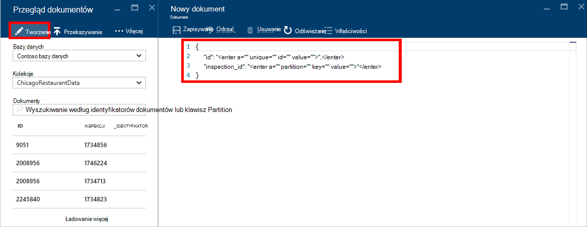

2. W karta **dokumentu** wpisz lub Wklej zawartość dokumentu JSON, który chcesz utworzyć, a następnie kliknij **Zapisz** przekazać dokument do bazy danych i kolekcji określonej w karta **Eksploratora dokumentu** .

    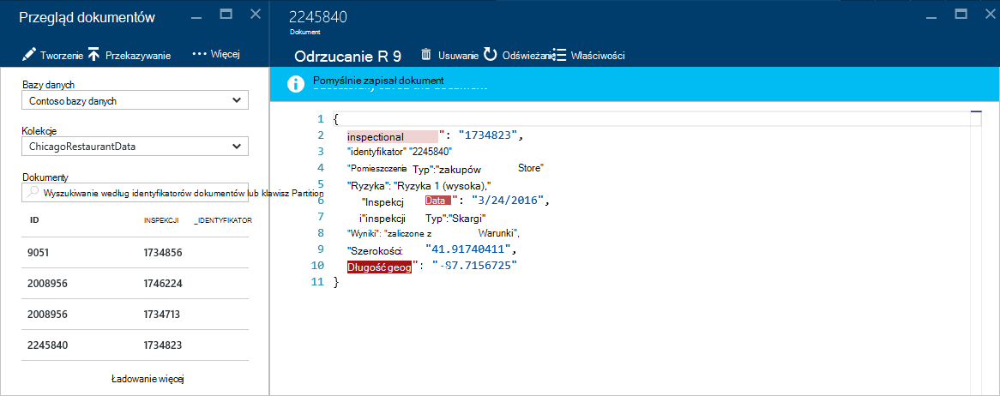

    > [AZURE.NOTE] Jeśli nie zostanie określona właściwość "identyfikator", następnie Eksploracja dokumentów automatycznie dodaje właściwość id i generuje jako wartość identyfikator GUID.

    Jeśli masz już pliki danych z JSON, MongoDB, SQL Server, plików CSV, Magazyn tabel platformy Azure, Amazon DynamoDB, HBase, lub z innych zbiorów DocumentDB umożliwia DocumentDB i [Narzędzia do migracji danych](documentdb-import-data.md) szybko zaimportować dane.

## Edytowanie dokumentu

1. [Uruchom Eksploratora dokumentu](#launch-document-explorer).

2. Aby edytowanie istniejącego dokumentu, wybierz ją karta **Eksploracja dokumentów** , edytowanie dokumentu w karta **dokumentu** , a następnie kliknij przycisk **Zapisz**.

    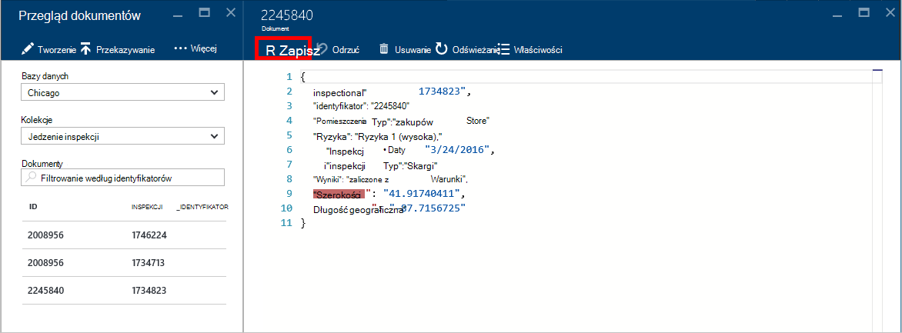

    Jeśli edytujesz dokument i zdecydować, czy chcesz odrzucić wprowadzone zmiany, po prostu kliknij **pozycję Odrzuć,** karta **dokumentu** , potwierdzenie Odrzuć i załadowaniu poprzedniego stanu dokumentu.

    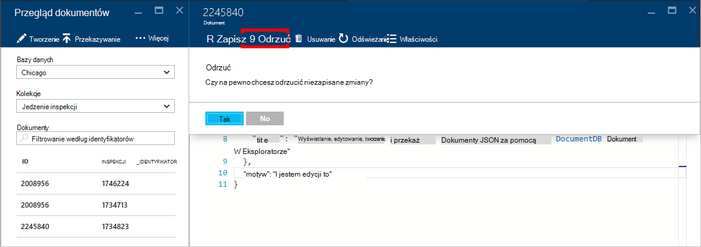

## Usuwanie dokumentu

1. [Uruchom Eksploratora dokumentu](#launch-document-explorer).

2. Zaznacz dokument w **Eksploratorze dokumentu**, kliknij przycisk **Usuń**, a następnie Potwierdź usunięcie. Po potwierdzeniu, dokument jest od razu usuwane z listy Eksploratora dokumentu.

    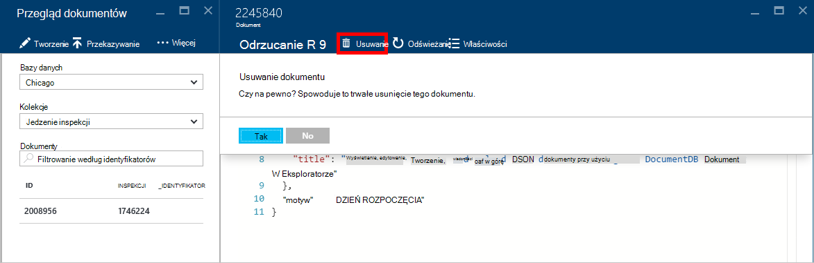

## Praca z dokumentami JSON

Eksploracja dokumentów sprawdza, że wszelkie nowe lub zmodyfikowane dokument zawiera prawidłowy JSON.  Możesz nawet Wyświetl błędy JSON przez umieszczenie wskaźnika myszy na niepoprawne sekcji, aby uzyskać szczegółowe informacje o błędzie sprawdzania poprawności.

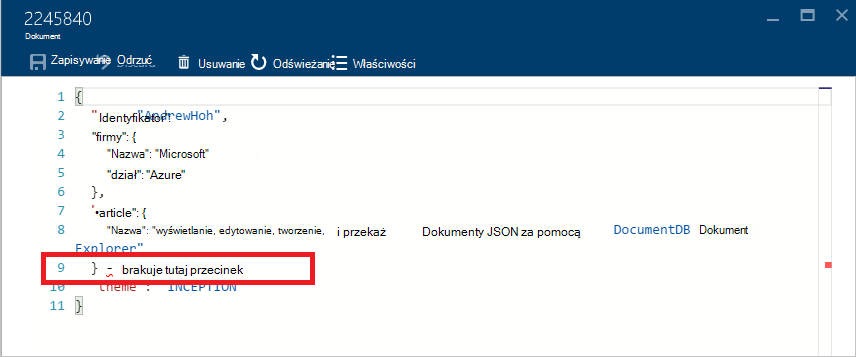

Ponadto Eksplorator dokumentu uniemożliwia zapisanie dokumentu z nieprawidłową zawartość JSON.

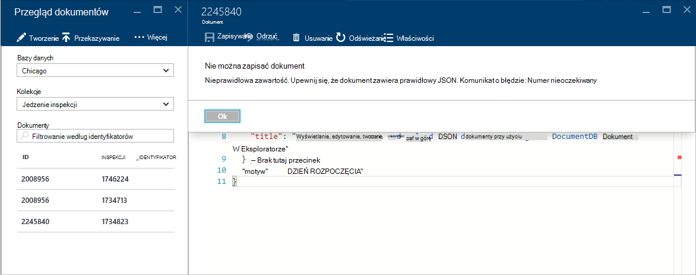

Na koniec dokumentu Eksploratora pozwala łatwo wyświetlać właściwości systemu załadowany dokumentu przez kliknięcie polecenia **Właściwości** .

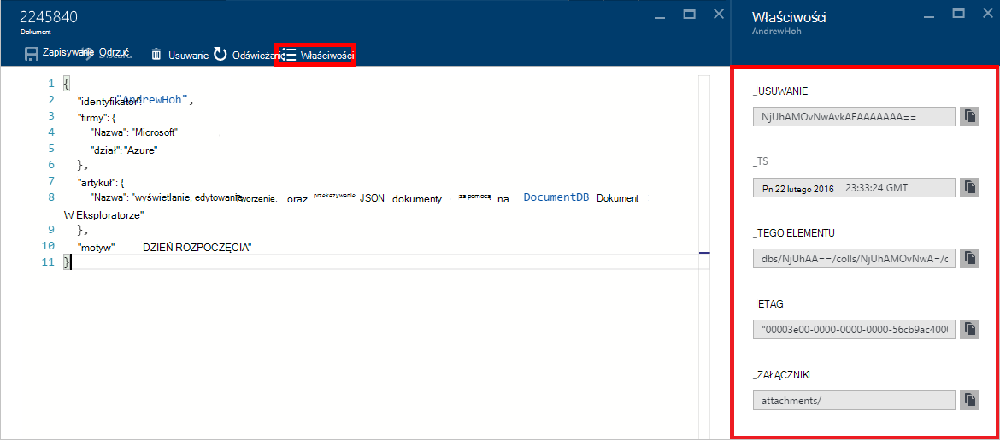

> [AZURE.NOTE] Właściwość sygnatury czasowej (_ts) wewnętrznie jest reprezentowana przez godzinę epoch, ale Eksplorator dokumentu jest wyświetlana wartość ludzi czytelnym formacie GMT.

## Filtrowanie dokumentów
Eksplorator dokumentu obsługuje wiele opcji nawigacji i ustawienia zaawansowane.

Domyślnie Eksploracja dokumentów ładuje w górę do 100 pierwszych dokumentów w wybranej kolekcji według daty od ich utworzenia od najwcześniejszych do najpóźniejszych.  Wybierając opcję **Załaduj więcej** u dołu karta Eksploratora dokumentu można załadować dodatkowe dokumenty (partiami 100). Możesz wybrać, które dokumenty, aby załadować za pośrednictwem polecenia **Filtruj** .

1. [Uruchom Eksploratora dokumentu](#launch-document-explorer).

2. W górnej części karta **Eksploratora dokumentu** kliknij pozycję **Filtr**.  

    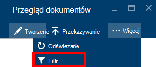
  
3.  Ustawienia filtru są wyświetlane poniżej paska poleceń. W obszarze Ustawienia filtru dostarcza klauzulę WHERE i/lub klauzula ORDER BY, a następnie kliknij **Filtr**.

    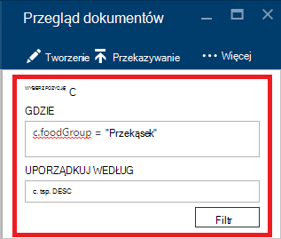

    Eksplorator dokumentu automatycznie odświeża wyniki z dokumentami pasującego do kwerendy filtru. Przeczytaj więcej na temat gramatyki DocumentDB SQL [zapytania SQL i składnia SQL](documentdb-sql-query.md) artykule lub wydrukować kopię [zapytania SQL cheat arkusza](documentdb-sql-query-cheat-sheet.md).

    Pola listy rozwijanej **bazy danych** i **zbioru** można łatwo zmienić kolekcji, z którego dokumenty są obecnie wyświetlany bez konieczności Zamknij i ponownie uruchom Eksploratora dokumentu.  

    Eksploracja dokumentów umożliwia filtrowanie według ich właściwości identyfikator załadowany zestaw dokumentów.  Wystarczy wpisać w oknie dokumenty Filtruj według pola identyfikator.

    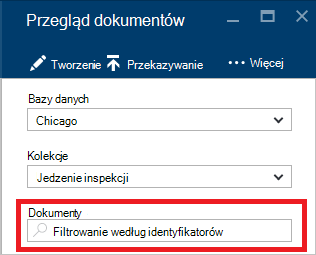

    Wyniki są wyświetlane w Eksploratorze dokumentu listy są filtrowane zgodnie z podanymi kryteriami.

    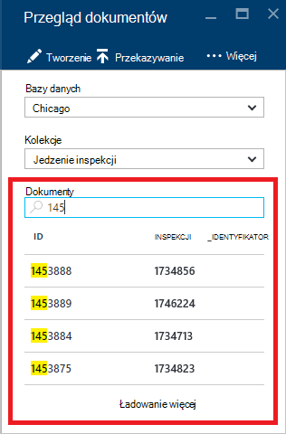

    > [AZURE.IMPORTANT] Eksploracja dokumentów filtr funkcji tylko filtry z ***obecnie*** załadować zestaw dokumentów i wykonuje zapytanie zaznaczonej kolekcji.

4. Aby odświeżyć listę dokumenty ładowane przez Eksploratora dokumentu, kliknij przycisk **Odśwież** w górnej części karta.

    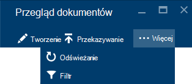

## Zbiorcze Dodawanie dokumentów

Eksploracja dokumentów obsługuje spożyciu zbiorcze jeden lub więcej istniejących JSON dokumentów, do 100 plików JSON dla operacji przekazywania.  

1. [Uruchom Eksploratora dokumentu](#launch-document-explorer).

2. Aby rozpocząć proces przekazywania, kliknij pozycję **Przekaż dokument**.

    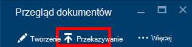

    Zostanie wyświetlona karta **Przekaż dokument** . 

2. Kliknij przycisk Przeglądaj, aby otworzyć okno Eksploratora plików, wybierz jeden lub więcej dokumentów JSON, aby przekazać, a następnie kliknij **Otwórz**.

    

    > [AZURE.NOTE] Eksploracja dokumentów obecnie dokumentów do 100 JSON dla poszczególnych przekazywania operacji.

3. Po zakończeniu zaznaczenie kliknij przycisk **Przekaż** .  Dokumenty są automatycznie dodawane do siatki dokumentu Eksploratora i przekaż wyniki są wyświetlane w trakcie operacji. Błędy importu są zgłaszane dla poszczególnych plików.

    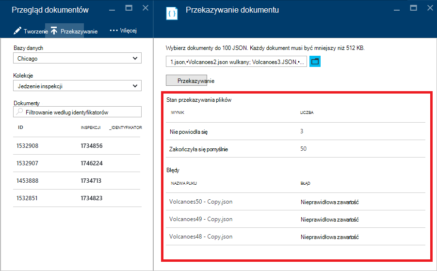

4. Po zakończeniu operacji można wybrać do innego 100 dokumentów do przekazania.

## Praca z dokumentami JSON spoza portalu

Eksploracja dokumentów w portalu Azure jest tylko jeden sposób, aby pracować z dokumentami w DocumentDB. Można również pracować z dokumentami przy użyciu [Interfejsu API usługi REST](https://msdn.microsoft.com/library/azure/mt489082.aspx) lub [klienta SDK](documentdb-sdk-dotnet.md). Na przykład kod, zobacz [Przykłady dokumentu .NET SDK](documentdb-dotnet-samples.md#document-examples) i [Przykłady dokumentu Node.js SDK](documentdb-nodejs-samples.md#document-examples).

Jeśli potrzebujesz zaimportować lub migrowanie plików z innego źródła (JSON plików, MongoDB, SQL Server, CSV pliki, tabeli Azure miejsca do magazynowania, Amazon DynamoDB lub HBase), możesz szybko importowanie danych do DocumentDB za pomocą DocumentDB [Narzędzia do migracji danych](documentdb-import-data.md) .

## Rozwiązywanie problemów

**Symptom**: Eksploracja dokumentów zwraca **nie znaleziono dokumentów**.

**Rozwiązanie**: Upewnij się, wybrano poprawne subskrypcji, bazy danych i zbioru, w którym wstawiono dokumenty. Ponadto sprawdź, czy działają w przydziałami przepustowość. Jeśli pracujesz w swojej maksymalna przepustowość poziomu i uzyskiwania ograniczenie, dolnym użycie aplikacji do pracy w obszarze przydział maksymalnej przepustowości dla zbioru.

**Wyjaśnienie**: portalu to aplikacja podobne do innych, nawiązywanie połączeń do bazy danych DocumentDB i kolekcji. Jeśli wezwaniach są obecnie jest ograniczenie z powodu wywołań z innej aplikacji, portalu może również być ograniczenie, powoduje zasoby nie były wyświetlane w portalu. Aby rozwiązać ten problem, adres przyczyny zastosowania wysokiej wydajności, a następnie Odśwież karta portalu. Informacje na temat do pomiaru i dolnym użycia przepustowości można znaleźć w sekcji [przepustowość](documentdb-performance-tips.md#throughput) artykułu [porad dotyczących wydajności](documentdb-performance-tips.md) .

## Następne kroki

Aby dowiedzieć się więcej na temat gramatyki DocumentDB SQL obsługiwane w Eksploratorze dokumentu, zobacz artykuł [zapytania SQL i składni języka SQL](documentdb-sql-query.md) lub wydrukować [Arkusz cheat zapytania SQL](documentdb-sql-query-cheat-sheet.md).

[Ścieżka nauki](https://azure.microsoft.com/documentation/learning-paths/documentdb/) jest również przydatne zasób pomagają, jak możesz dowiedzieć się więcej o DocumentDB. 
