<properties
    pageTitle="DocumentDB skrypt Eksploratorze edytora kodu JavaScript | Microsoft Azure"
    description="Informacje o DocumentDB skryptu Eksploratora, Azure Portal narzędzie do zarządzania artefakty programowania po stronie serwera DocumentDB tym procedur składowanych, wyzwalaczami i funkcji zdefiniowanych przez użytkownika."
    keywords="Edytor języka JavaScript"
    services="documentdb"
    authors="kirillg"
    manager="jhubbard"
    editor="monicar"
    documentationCenter=""/>

<tags
    ms.service="documentdb"
    ms.workload="data-services"
    ms.tgt_pltfrm="na"
    ms.devlang="na"
    ms.topic="article"
    ms.date="08/30/2016"
    ms.author="kirillg"/>

# Tworzenie i uruchamianie procedur składowanych, wyzwalaczy i funkcji zdefiniowanych przez użytkownika, przy użyciu Eksploratora skrypt DocumentDB

Ten artykuł zawiera omówienie Eksploratora skrypt [Microsoft Azure DocumentDB](https://azure.microsoft.com/services/documentdb/) , czyli edytora kodu JavaScript w portalu Azure, który umożliwia wyświetlanie i wykonywanie artefakty programowania po stronie serwera DocumentDB tym procedur składowanych, wyzwalaczami i funkcji zdefiniowanych przez użytkownika. Dowiedz się więcej o DocumentDB programowania po stronie serwera w artykule [procedury przechowywane, wyzwalacze bazy danych i funkcji zdefiniowanych przez użytkownika](documentdb-programming.md) .

## Uruchamianie skryptu Eksploratora

1. W portalu Azure w Jumpbar kliknij przycisk **DocumentDB (NoSQL)**. Jeśli **DocumentDB konta** nie jest widoczne, kliknij przycisk **Więcej usług** , a następnie kliknij pozycję **DocumentDB (NoSQL)**.

2. W menu zasobów kliknij pozycję **Eksplorator skrypt**.

    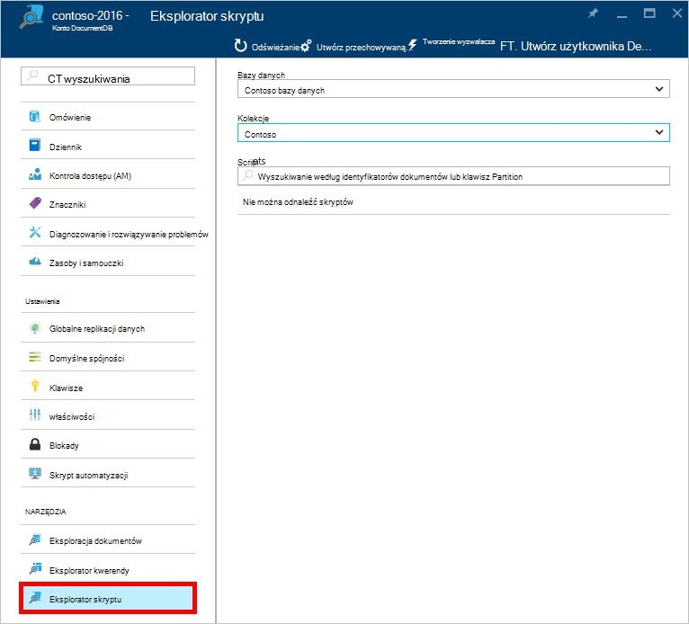
 
    Pola listy rozwijanej **bazy danych** i **zbioru** wstępnie są wyświetlane w zależności od kontekstu, w którym uruchamianie skryptu Eksploratora.  Na przykład jeśli uruchamiania z kart bazy danych, następnie bieżąca baza danych jest wstępnie wypełnione.  Jeśli uruchamianie z kart zbioru bieżącej kolekcji jest wstępnie wypełnione.

4.  Pola listy rozwijanej **bazy danych** i **zbioru** umożliwia łatwe zmienianie zbioru, z której skryptów są obecnie wyświetlany bez konieczności Zamknij i ponownie uruchom Eksploratora skrypt.  

5. Skrypt Eksploratora umożliwia filtrowanie załadowany zestawu skryptów według ich właściwości identyfikator.  Wystarczy wpisać w polu Filtr i wyniki na liście Eksploratora skrypt są filtrowane w oparciu o podane kryteria.

    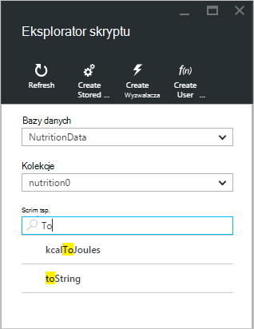

    > [AZURE.IMPORTANT] Eksplorator skrypt filtrowanie funkcji filtry tylko z zestawu ***obecnie*** załadowane skryptów i nie automatyczne odświeżanie zaznaczonej zbioru.

5. Aby odświeżyć listę skrypty załadowane przez Eksploratora skrypt, wystarczy kliknąć polecenie **Odśwież** w górnej części karta.

    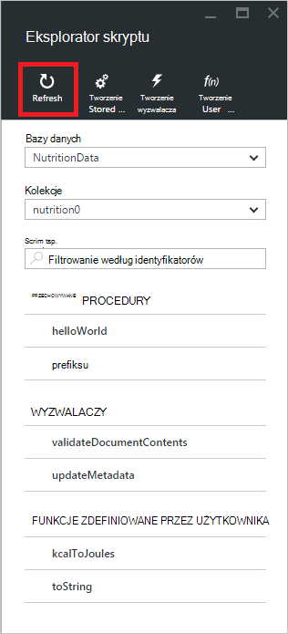

## Tworzenie, wyświetlanie i edytowanie procedur składowanych, wyzwalaczami i funkcji zdefiniowanych przez użytkownika

Eksplorator skryptu pozwala łatwo wykonywać OBSŁUGIWAŁ operacje na artefakty programowania po stronie serwera DocumentDB.  

- Aby utworzyć skrypt, po prostu kliknij stosowanego Tworzenie polecenia w Eksploratorze skrypt, podaj identyfikator, wprowadź zawartość skrypt i kliknij przycisk **Zapisz**.

    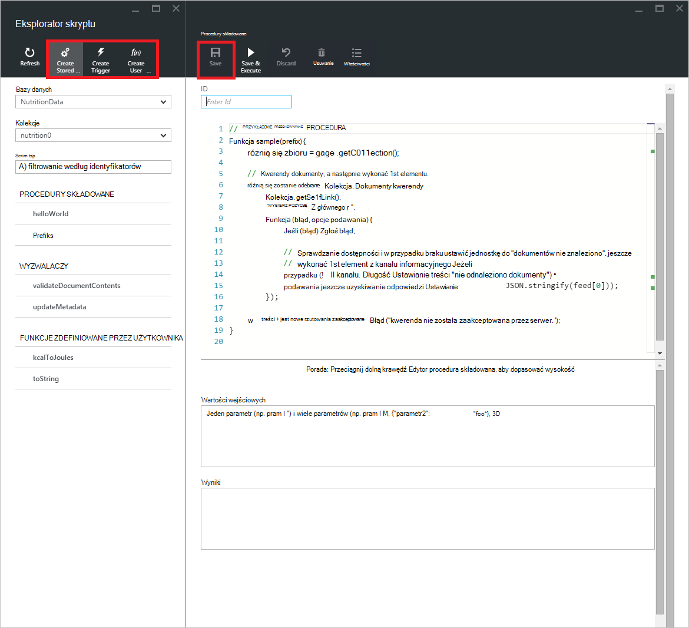

- Podczas tworzenia wyzwalacza, należy również określić operację wyzwalacza typu i wyzwalacz

    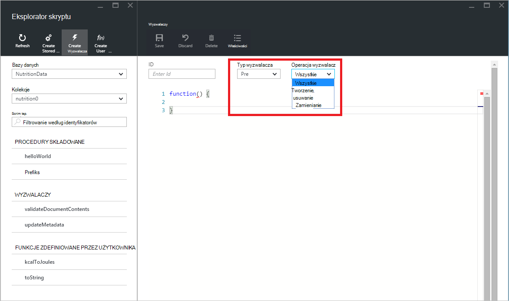

- Aby wyświetlić skrypt, po prostu kliknij skrypt, w którym Cię.

    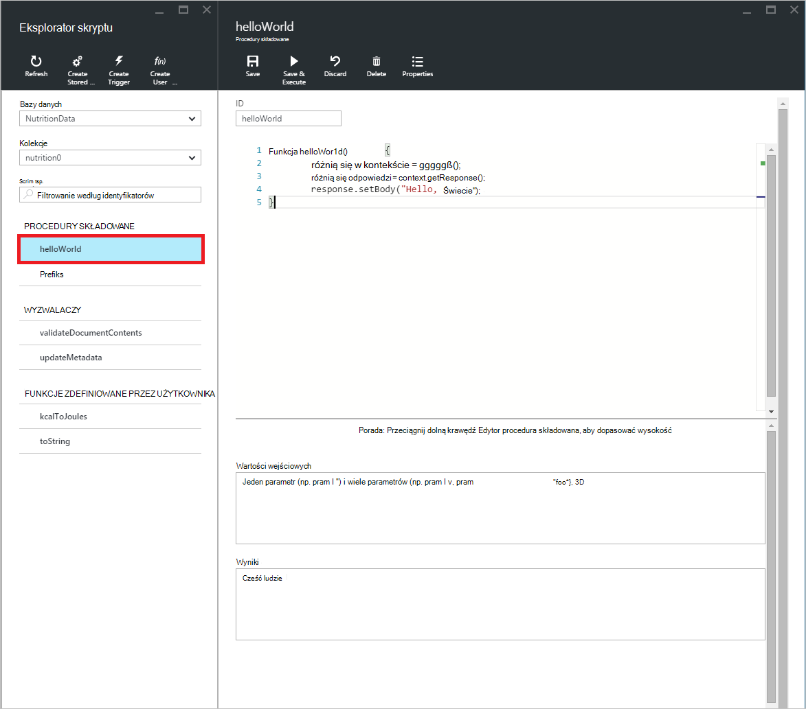

- Aby edytować skrypt, wprowadź odpowiednie zmiany w JavaScript edytora i kliknij przycisk **Zapisz**.

    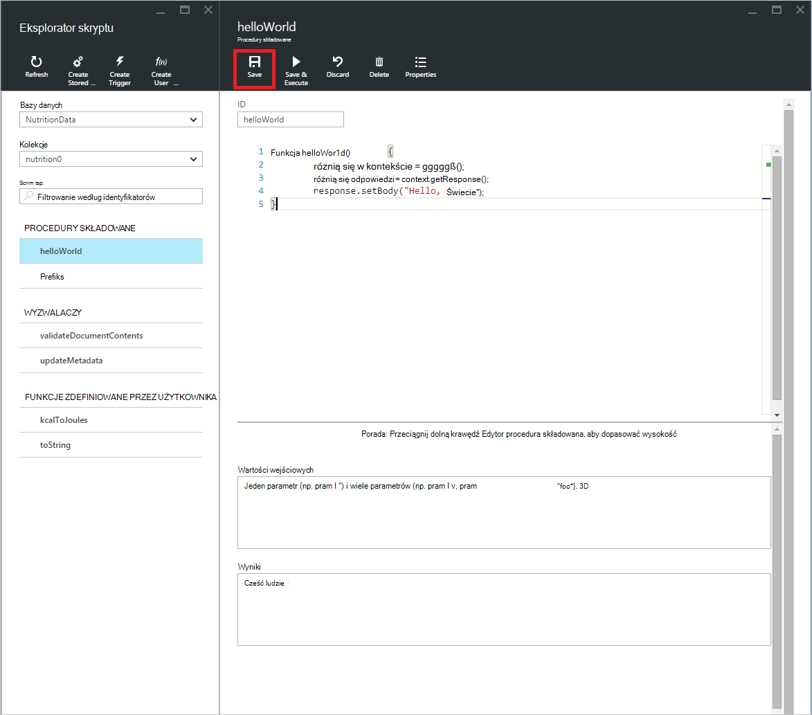

- Aby odrzucić oczekujących zmian do skryptu, po prostu kliknij polecenie **Odrzuć** .

    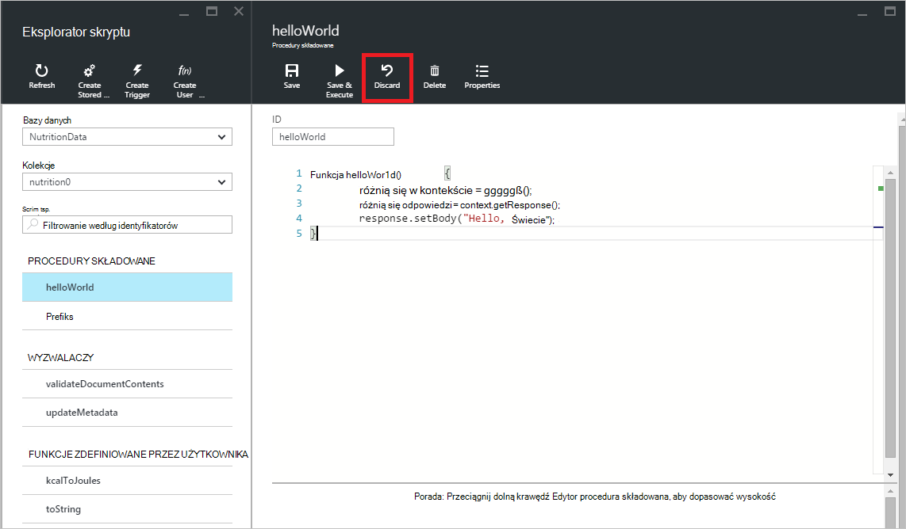

- Skrypt Eksploratora umożliwia łatwe wyświetlanie właściwości systemu załadowany skryptu, klikając polecenie **Właściwości** .

    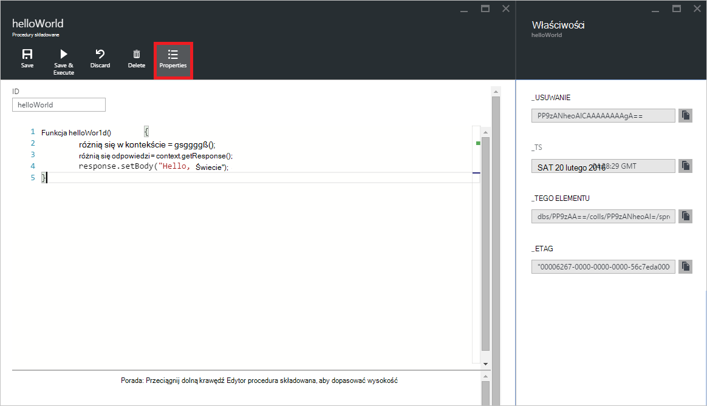

    > [AZURE.NOTE] Właściwość sygnatury czasowej (_ts) wewnętrznie jest reprezentowana przez godzinę epoch, ale Eksploratora skrypt wyświetla wartość w ludzi czytelnym formacie GMT.

- Aby usunąć skrypt, zaznacz je w Eksploratorze skryptu i kliknij polecenie **Usuń** .

    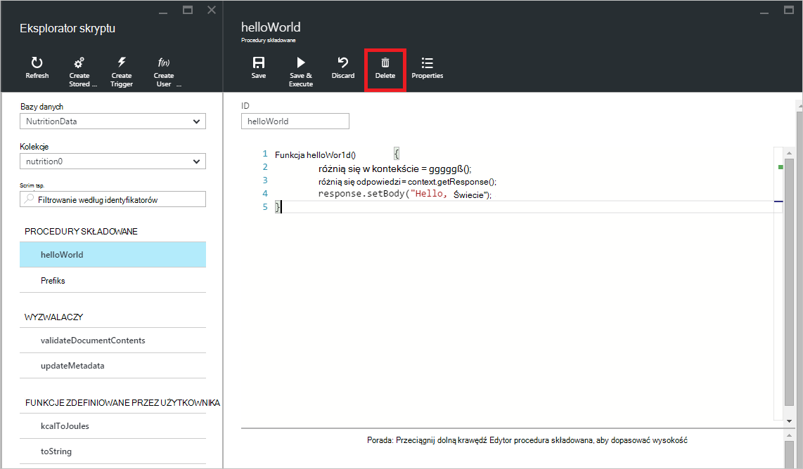

- Potwierdzenie akcji usuwania, klikając pozycję **Tak** lub anulować akcję usuwania, klikając pozycję **Brak**.

    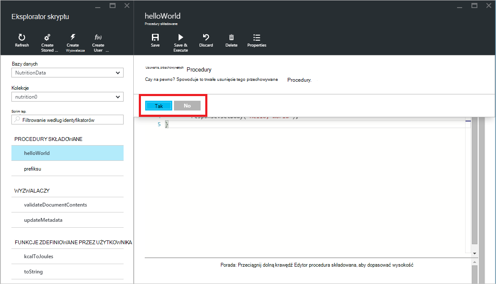

## Wykonaj procedurę przechowywaną

> [AZURE.WARNING] Wykonanie procedur składowanych w Eksploratorze skryptu nie jest jeszcze obsługiwane dla zbiorów partycją po stronie serwera. Aby uzyskać więcej informacji odwiedź stronę [partycjonowanie i skalowanie w DocumentDB](documentdb-partition-data.md).

Eksplorator skryptu pozwala na wykonanie procedur składowanych po stronie serwera z portalu Azure.

- Podczas otwierania nowego karta procedury tworzenie przechowywane, zapewnia się już skrypt domyślny (*Prefiks*). Aby uruchomić skrypt *Prefiks* lub własnego skryptu, Dodaj *identyfikator* i *danych wejściowych*. Dla procedur składowanych, które przyjmują wielu parametrów wszystkie dane wejściowe musi być znajdujące się wewnątrz tablicy ( *["foo", "pasek"]*).

    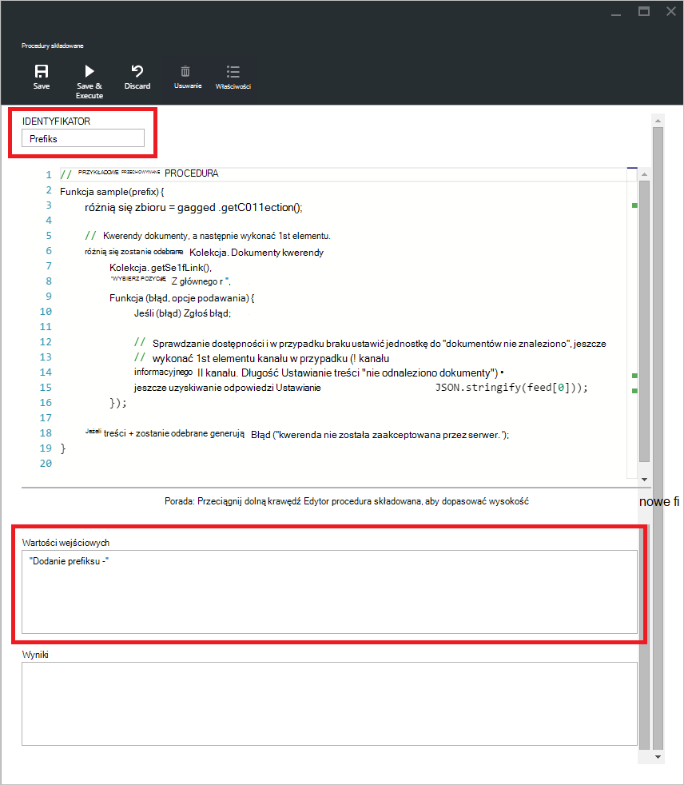

- Aby wykonać procedury składowanej, po prostu kliknij polecenie **Zapisz i wykonać** w okienku Edytor skryptów.

    > [AZURE.NOTE] Polecenie **Zapisz i wykonywanie** zapisze procedura składowana przed wykonaniem, co oznacza, że powoduje zastąpienie wcześniej zapisanej wersji procedury składowanej.

- Procedura składowana pomyślnego wykonania będą mieć stan *pomyślnie zapisane i wykonać procedury składowanej* i zwracane wyniki są umieszczane w okienku *wyników* .

    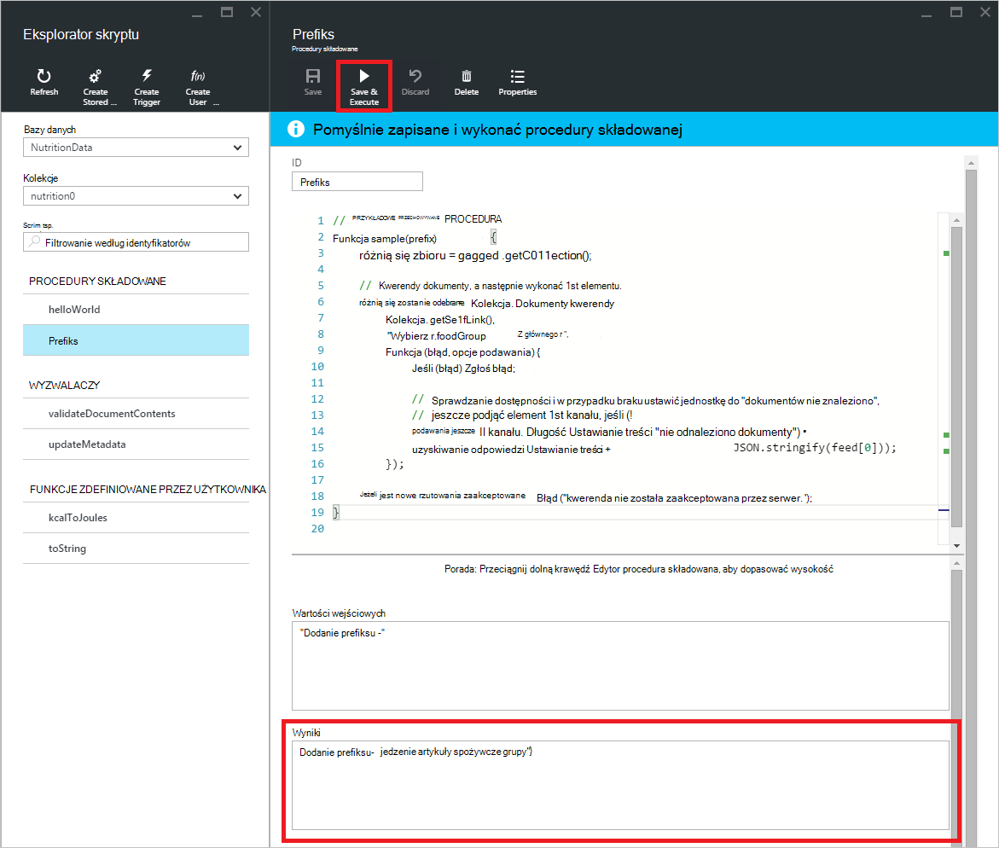

- Jeśli wykonanie wystąpi błąd, błąd zostanie umieszczony w okienku *wyników* .

    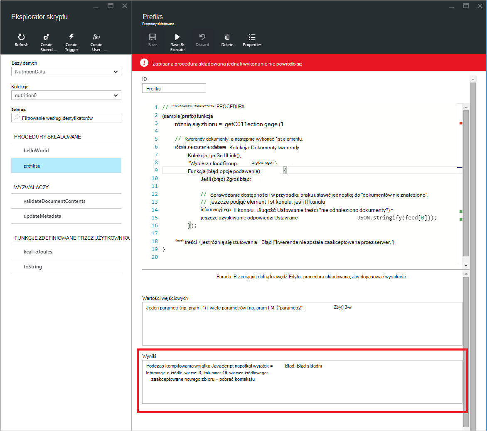

## Praca z skryptów spoza portalu

Eksplorator skrypt w portalu Azure jest tylko jeden sposób, aby pracować z procedur składowanych, wyzwalaczami i funkcji zdefiniowanych przez użytkownika w DocumentDB. Możesz również we współpracy z skryptów za pomocą interfejsu API usługi REST i [klienta SDK](documentdb-sdk-dotnet.md). W dokumentacji interfejsu API usługi REST zawiera przykłady dotyczące pracy z [za pomocą usługi REST procedur składowanych](https://msdn.microsoft.com/library/azure/mt489092.aspx), [za pomocą usługi REST funkcje zdefiniowane przez użytkownika](https://msdn.microsoft.com/library/azure/dn781481.aspx)i [wyzwalaczy za pomocą usługi REST](https://msdn.microsoft.com/library/azure/mt489116.aspx). Przykłady są również dostępne przedstawiający sposób [pracy z skryptów za pomocą C#](documentdb-dotnet-samples.md#server-side-programming-examples) i [Praca z skryptów za pomocą Node.js](documentdb-nodejs-samples.md#server-side-programming-examples).

## Następne kroki

Dowiedz się więcej na temat programowania po stronie serwera DocumentDB w artykule [procedury przechowywane, wyzwalacze bazy danych i funkcji zdefiniowanych przez użytkownika](documentdb-programming.md) .

[Ścieżka nauki](https://azure.microsoft.com/documentation/learning-paths/documentdb/) jest również przydatne zasób pomagają, jak możesz dowiedzieć się więcej o DocumentDB.  
