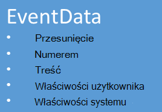

<properties 
    pageTitle="Omówienie koncentratory Azure zdarzenia | Microsoft Azure"
    description="Wprowadzenie i omówienie koncentratory zdarzenia Azure."
    services="event-hubs"
    documentationCenter="na"
    authors="sethmanheim"
    manager="timlt"
    editor="" />
<tags 
    ms.service="event-hubs"
    ms.devlang="na"
    ms.topic="get-started-article"
    ms.tgt_pltfrm="na"
    ms.workload="na"
    ms.date="08/16/2016"
    ms.author="sethm" />

# Omówienie Azure koncentratory zdarzenia

Wiele rozwiązań nowoczesny zamierzają zapewniają środowiska pracy adaptacyjne klienta lub ulepszyć produkty za pośrednictwem ciągły opinii i telemetrycznego automatyczną. Największym wyzwaniem dotyczących bezpieczeństwa i niezawodności przetwarzania bardzo dużych ilości danych z wielu wydawców równoczesne występują takich rozwiązań. Microsoft Azure zdarzenia koncentratory to usługa zarządzanych platformy, która stanowi podstawę do pobrania danych na dużą skalę w szerokiej różnych scenariuszach. Przykładowe scenariusze tego typu to zachowanie śledzenia w aplikacji dla urządzeń przenośnych, informacje o ruchu z farmy serwerów sieci web, przechwytywanie wydarzenie w gry w gry konsoli lub telemetrycznego dane zebrane z urządzenia przemysłowe podłączone pojazdy. Typowe roli odtwarzanego koncentratory zdarzenia w architekturze rozwiązanie jest działa jako "wierzch drzwi" dla potoku zdarzenia często nazywane *ingestor zdarzenia*. Ingestor zdarzenie jest składnik lub usługa, która znajduje się między wydawców zdarzeń i odbiorców zdarzeń rozdzielenie produkcji strumienia zdarzenia ze zużycia te zdarzenia.

Azure koncentratory zdarzenia to zdarzenie przetwarzania usługa, która zapewnia zdarzeń i telemetrycznego wchodzącego w chmurze na ogromną skalę krótki czas oczekiwania i wysoka niezawodność. Ta usługa używany z innymi usługami podrzędne, jest szczególnie przydatne w oprzyrządowania aplikacji, przetwarzanie obsługi lub przepływu pracy użytkownika i scenariusze Internet czynności (IoT). Koncentratory zdarzenia zawiera strumienia wiadomości, obsługa funkcji i, jeśli koncentratora zdarzenie jest podobne do kolejek i tematy jednostką, ma właściwości, które są znacznie różni się od tradycyjnych enterprise wiadomości. Scenariusze wiadomości przedsiębiorstwa często wymagają zaawansowane funkcje, takie jak sekwencji, czcionki wiadomości, obsługę transakcji i gwarancje silnych dostarczenia, natomiast dominującej znaczenie dla pobrania zdarzenie jest wysokiej wydajności i przetwarzania elastyczność dla zdarzenia strumieni. W związku z tym możliwości koncentratory zdarzenia różnią się w tematach Bus usługi są one zdecydowanie obciążona kierunku wysokiej wydajności i przetwarzanie scenariusze zdarzenia. Jako takie koncentratory zdarzenia wykonania niektórych funkcji wiadomości, które są dostępne dla tematów. Jeśli potrzebujesz tych funkcji, tematy pozostaną optymalny wybór.

Centrum zdarzenie jest tworzony na poziomie nazw koncentratory zdarzenia, podobnie jak kolejki Bus usługi i tematy. Koncentratory zdarzeń używa AMQP i HTTP jako podstawowego interfejsy API. Poniższy diagram przedstawia relacje między koncentratory zdarzeń i Bus usługi.

## Omówienie

Koncentratory zdarzenia zawiera wiadomości streaming za pośrednictwem deseń podzielone na partycje dla klientów indywidualnych. Kolejki i tematy za pomocą modelu [Uczestniczących w zawodach dla klientów indywidualnych](https://msdn.microsoft.com/library/dn568101.aspx) , w którym każdy użytkownik będzie próbował odczytać z tej samej kolejki lub zasobu. Ten konkurencji dla zasobów ostatecznie wyników w zakresie złożoności i limity skali strumienia wniosków. Koncentratory zdarzeń używa wzorzec podzielone na partycje dla klientów indywidualnych, w której każdy użytkownik odczytuje tylko określonego podzbioru lub podziału strumienia wiadomości. Ten wzorzec umożliwia poziomy skali przetwarzanie zdarzenia, a także inne ograniczony strumienia funkcje, które są niedostępne w kolejkach i tematy.

### Partycje

Partycją jest uporządkowana sekwencja zdarzeń odbywa się w Centrum zdarzenia. Po odebraniu nowsze zdarzenia, są one dodawane do końca tej kolejności. Partycją można traktować jako "Dziennik transakcji".

Partycje zachować dane raz skonfigurowanej przechowywania jest ustawiona na poziomie Centrum zdarzenia. To ustawienie jest stosowane przez wszystkie partycje zdarzeń Centrum. Zdarzenia wygaśnie w czasie; wyraźnie nie można ich usuwać. Centrum zdarzenia zawiera wiele partycje. Każdy partition niezależny i zawiera własnej sekwencji danych. W wyniku partycje często Powiększ różne stopy.

Liczba partycje określono w czasie tworzenia Centrum zdarzeń i musi należeć do przedziału 2 i 32 (wartość domyślna to 4). Partycje są mechanizmu organizacji danych i bardziej dotyczą stopień równoległości podrzędne wymagane przez inne programy niż do przepustowości koncentratorów zdarzenia. Dzięki temu wybór liczby partycje w Centrum zdarzeń bezpośrednio związane z numerem równoczesne czytników, których oczekujesz mają. Po utworzeniu Centrum zdarzeń statystykę partition nie jest zmienny; należy rozważyć ten numer, pod względem długoterminowe oczekiwanych Skala. Można zwiększyć limit 32 partition, kontaktując się z zespołu Bus usługi.

Mimo że partycje są oznaczone i mogą być wysyłane bezpośrednio do, najlepiej uniknąć wysyłanie danych do określonych partycje. Zamiast tego możesz użyć wyższy poziom konstrukcji wprowadzone w sekcji [zdarzeń w programie publisher](#event-publisher) i [Zasad wydawcy](#capacity-and-security) .

W kontekście koncentratory zdarzenia wiadomości są określane jako *dane zdarzenie*. Dane zdarzenia zawierają treści wydarzenia, zdefiniowane przez użytkownika zbioru właściwości i różne metadane dotyczące zdarzenia, takie jak jego przesunięcie w partycją i jego numer w sekwencji strumienia. Partycje są wypełnione sekwencji danych zdarzenia.

## Zdarzenie programu publisher

Osobę wysyła zdarzenia lub dane do koncentratora zdarzenie jest *zdarzeń w programie publisher*. Wydawców zdarzeń można opublikować zdarzeń przy użyciu protokołu HTTPS lub AMQP 1.0. Wydawców zdarzeń za pomocą tokenu podpisu udostępnionych programu Access (SA) identyfikują do koncentratora zdarzeń i można mieć unikatową tożsamość lub typowych tokenu skojarzeń zabezpieczeń, w zależności od potrzeb scenariusza.

Aby uzyskać więcej informacji na temat pracy z skojarzeń zabezpieczeń zobacz [Udostępnione Uwierzytelnianie podpisu programu Access przy użyciu usługi Bus](../service-bus-messaging/service-bus-shared-access-signature-authentication.md).

### Typowe zadania programu publisher

W tej sekcji opisano typowe zadania dla wydawców zdarzeń.

#### Uzyskiwanie tokenu skojarzenia zabezpieczeń

Udostępnione dostępu podpisu () jest mechanizm uwierzytelniania dla koncentratorów zdarzenia. Usługa Bus udostępnia zasady skojarzeń zabezpieczeń na poziomie Centrum zdarzeń i nazw. Token skojarzeń zabezpieczeń jest generowany na podstawie klucza skojarzeń zabezpieczeń i jest mieszania Agent kondycji systemu zakodowany w adresie URL, w określonym formacie. Przy użyciu nazwy klucza (zasady) i token, Bus usługi można odtworzyć skrótu i dlatego uwierzytelnienia nadawcy. Zazwyczaj tokeny skojarzeń zabezpieczeń dla wydawców zdarzeń są tworzone tylko **Wysyłanie** uprawnień na określonym Centrum zdarzenia. Ten mechanizm skojarzeń zabezpieczeń token adres URL jest podstawa identyfikacji programu publisher wprowadzone w zasad wydawcy. Aby uzyskać więcej informacji na temat pracy z skojarzeń zabezpieczeń zobacz [Udostępnione Uwierzytelnianie podpisu programu Access przy użyciu usługi Bus](../service-bus-messaging/service-bus-shared-access-signature-authentication.md).

#### Publikowanie zdarzenia

Możesz opublikować wydarzenia za pośrednictwem AMQP 1.0 lub HTTPS. Bus usługi przewiduje klasy [EventHubClient](https://msdn.microsoft.com/library/microsoft.servicebus.messaging.eventhubclient.aspx) publikowania zdarzeń do koncentratora zdarzenia od klientów .NET. Dla innych programów i platform możesz użyć dowolnego klienta AMQP 1.0, takie jak [Apache Qpid](http://qpid.apache.org/). Można opublikować zdarzeń pojedynczo lub przetwarzany wsadowo. Pojedynczy publikacji (wystąpienia zdarzenia danych) ma limit 256 KB, niezależnie od tego, czy jest jednym wydarzenie lub serię. Zdarzenia publikowania większych niż powoduje błąd. To najważniejsze wskazówki dotyczące wydawcy nie partycje w Centrum zdarzeń i określić tylko *partition klucz* (wprowadzona w następnej sekcji), lub tożsamości przez ich token skojarzeń zabezpieczeń.

Wybór AMQP lub HTTPS jest specyficzne dla tego scenariusza zastosowania. AMQP wymaga ustanowienia socket trwałych dwukierunkowe, oprócz transportu zabezpieczeń na poziomie (TLS) lub SSL/TLS. Może być kosztów operacja pod względem ruchu sieciowego, ale tylko odbywa się na początku sesji AMQP. Protokół HTTPS zawiera niższe koszty początkowej, ale wymaga SSL dodatkowe obciążenie dla każdego żądania. Dla wydawców często publikowanie zdarzenia AMQP oferuje znaczące oszczędności wydajność, opóźnienia i przepustowość.

### Klucz partition

Klucz partition to wartość, która służy do mapowania przychodzące dane zdarzenie na określonym partycje na potrzeby organizacji danych. Klucz partycją jest przekazywana do koncentratora zdarzenia wartość dostarczane nadawcy. Jest przetwarzana przy użyciu statycznego funkcji mieszania, której wynikiem tworzy przydziału partycją. Jeśli nie określisz klucz partition podczas publikowania zdarzenia, przydział okrężnego jest używana. Klawiszy partition wydawcy zdarzenie jest tylko pamiętać o jego klucza partition nie partition, do której zostały opublikowane zdarzenia. Ten oddzielenia od produkcji klucz i partycją uwalniają nadawcy z znajomości zbyt dużo o podrzędne przetwarzania i przechowywania zdarzeń. Klucze partition są ważne do organizowania danych do przetwarzania podrzędne, ale istotnie niezwiązane partycje się. Na urządzeniu lub użytkownikowi unikatowych tożsamości stanowi klucz dobre partycją, ale inne atrybuty, takie jak Geografia można także umożliwia grupowanie powiązanych zdarzeniach w jedną partycją. Poniższa ilustracja przedstawia przypiąć do partycje za pomocą klawiszy partition nadawców zdarzenia.

Koncentratory zdarzenia zapewnia dostarczenie wszelkich zdarzeń udostępniania tej samej wartości klucza partition w kolejności i partycją. Należy pamiętać, że jeśli klucze partition są używane w przypadku programu publisher zasad opisane w następnej sekcji, następnie tożsamość wydawcy i wartości klucza partition muszą być zgodne. W przeciwnym razie wystąpi błąd.

### Odbiorca zdarzeń

Każdy podmiot, który odczytuje dane zdarzeń z Centrum zdarzenie jest odbiorca zdarzeń. W tym artykule wszystkich odbiorców zdarzeń strumienia zdarzeń za pośrednictwem partycje w grupie dla klientów indywidualnych. Każdy partition powinien mieć tylko jeden czytnik aktywne naraz. Wszystkie zdarzenia koncentratory konsumentów połączenia za pomocą sesji AMQP 1.0 zdarzenia są dostarczane, udostępnianymi. Klient nie musi informacji o dostępności danych.

#### Grupy konsumentów

Publikuj i Subskrybuj mechanizmu koncentratory zdarzenie jest włączona przez grupy dla klientów indywidualnych. Grupa dla klientów indywidualnych jest widok całego Centrum zdarzeń (stan, położenie lub przesunięcie). Włącz grupy dla klientów indywidualnych wiele dużo aplikacji do wszystkich mieć osobny widok strumienia zdarzenia, a odczytać strumienia niezależne w swoim własnym tempie i z własnych przesunięciem. W strumieniu architektury przetwarzania każdego aplikacji jest równa grupę dla klientów indywidualnych. Jeśli chcesz zapisać dane zdarzenie długotrwałego przechowywania tej aplikacji writer miejsca do magazynowania jest grupą dla klientów indywidualnych. Przetwarzanie złożonych zdarzenie jest wykonywane według grupy osobnego, dla klientów indywidualnych. Dostępne są tylko partycje za pośrednictwem grupy dla klientów indywidualnych. W Centrum zdarzenia zawsze jest domyślna grupa dla klientów indywidualnych, a można utworzyć maksymalnie 20 grup dla klientów indywidualnych dla standardowego poziomu Centrum wydarzenie.

Poniżej przedstawiono przykłady Konwencja URI grupy dla klientów indywidualnych:

    //<my namespace>.servicebus.windows.net/<event hub name>/<Consumer Group #1>
    //<my namespace>.servicebus.windows.net/<event hub name>/<Consumer Group #2>

Poniższa ilustracja przedstawia odbiorców zdarzeń w grupach dla klientów indywidualnych.

#### Strumienia przesunięcia

Przesunięcie jest położenie zdarzenie w partycją. Przesunięcie można traktować jako kursora po stronie klienta. Przesunięcie jest bajt numerowanie zdarzenia. Dzięki temu odbiorca zdarzeń (czytnik) określ punktu zdarzeń strumienia z którego chcesz rozpocząć czytania zdarzeń. Przesunięcie można określić jako sygnatura czasowa lub wartość przesunięcia. Odbiorcy są odpowiedzialne za przechowywanie ich wartości przesunięcia poza usługę koncentratory zdarzenia.

W ramach partycją każde zdarzenie zawiera przesunięcie. Ten przesunięcie jest używany przez konsumentów pokazuje położenie w sekwencji zdarzeń dla danego partycją. Przesunięcia można przekazać do koncentratora zdarzenia jako albo liczbą lub wartość sygnatury czasowej podczas łączenia czytnika.

#### Punkt kontrolny

*Punkt kontrolny* to proces, za pomocą której czytników znaku lub przekazać ich pozycji w sekwencji zdarzeń partycją. Punkt kontrolny spoczywa konsumenta i występuje na podstawie-partition w obrębie grupy dla klientów indywidualnych. Oznacza to, że dla każdej grupy dla klientów indywidualnych, każdego czytnika partition należy zachować informacje o bieżącej pozycji zdarzeń strumienia i udzieli usługę po uważa strumienia danych wykonane. Jeśli czytnika odłącza od partycją, gdy go ponownie połączy rozpoczyna odczyt na punkt kontrolny, przesłania wcześniej czytników ostatni z niej w tej grupie dla klientów indywidualnych. Gdy czytnik łączy, przekazuje ten przesunięcie do Centrum zdarzeń, aby określić lokalizację, w której rozpocząć czytanie. W ten sposób można punkt kontrolny na zdarzenia obu Oznacz jako "kompletne" przez zastosowań i zapewniania elastyczności wypadku trybie awaryjnym między czytników uruchomione na różnych komputerach. Ponieważ zachowuje dane zdarzenie interwału przechowywania określone na godzinę utworzenia Centrum zdarzenia, jest można przywrócić starsze dane, określając dolnym przesunięcie z tego procesu punkt kontrolny. Za pomocą tego mechanizmu punkt kontrolny umożliwia zarówno elastyczność pracy awaryjnej i powtarzania strumienia zdarzenia kontroli.

#### Typowe zadania dla klientów indywidualnych

W tej sekcji opisano typowe zadania dla odbiorców zdarzeń koncentratory wydarzenie lub czytelników. Wszystkie zdarzenia koncentratory konsumentów połączenia za pomocą AMQP 1.0. AMQP 1.0 jest sesji i pamiętać o stanie dwukierunkowy kanału komunikacji. Każdy partition ma sesję łącza AMQP 1.0 ułatwiający transportu zdarzeń rozdzielone przez partycją.

##### Nawiązywanie połączenia z partycją

Aby można było korzystać wydarzenia z koncentratora zdarzenia, dla klientów indywidualnych należy połączyć partycją. Jak już wspomniano, zawsze dostęp partycje za pośrednictwem grupy dla klientów indywidualnych. W ramach modelu podzielone na partycje dla klientów indywidualnych tylko czytnika pojedynczy powinna być aktywna na partycją w dowolnym momencie w obrębie grupy dla klientów indywidualnych. Typowe rozwiązaniem jest podczas nawiązywania połączenia bezpośrednio do partycje korzystania z mechanizmu leasingu w celu koordynowanie czytnika połączenia z określonym partycje. Dzięki temu jest możliwe dla każdej w grupie dla klientów indywidualnych, aby mieć tylko jedną reader aktywna. Zarządzanie miejsce w sekwencji dla czytnika jest ważne zadania, które zapewnia punkt kontrolny. Ta funkcja jest uproszczone przy użyciu klasy [EventProcessorHost](https://msdn.microsoft.com/library/microsoft.servicebus.messaging.eventprocessorhost.aspx) dla klientów .NET. [EventProcessorHost](https://msdn.microsoft.com/library/microsoft.servicebus.messaging.eventprocessorhost.aspx) jest agenta inteligentnego dla klientów indywidualnych a zostało opisane w następnej sekcji.

##### Przeczytaj zdarzenia

Po sesji AMQP 1.0 i łączenie zostanie otwarty dla określonych partition, zdarzenia są dostarczane do klienta AMQP 1.0 przez usługę koncentratory zdarzenia. Ten mechanizm dostarczania umożliwia wyższą przepustowość i opóźnienie niższej niż opartych na pobieraj mechanizmy, takie jak HTTP GET. Zdarzenia są wysyłane do klienta, każdego wystąpienia danych zdarzenia zawiera ważne metadane, takie jak numer przesunięcie i sekwencji są używane w celu ułatwienia punkty kontrolne sekwencji zdarzeń.

To obowiązek Zarządzanie tym przesunięcie w ten sposób, że najważniejsze umożliwia zarządzanie postępu w przetwarzania strumienia.

## Wydajność i zabezpieczenia

Koncentratory zdarzenie jest wysoce Skalowalna architektura równoległe dla wchodzącego strumienia. Jako takie istnieje kilka kluczowych aspektów brać pod uwagę podczas zmiany rozmiaru i skalowanie rozwiązaniem opartym na koncentratory zdarzenia. Pierwszy decyduje zdolności nosi nazwę *jednostki przepustowość*opisane w następnej sekcji.

### Jednostki przepustowość

Przepustowości koncentratorów zdarzenie steruje przepustowość jednostki. Jednostki przepustowość wstępnie zakupionych jednostek pojemności. Jednostka pojedynczy przepustowość jest następująca:

- Ingress: Maksymalnie 1 MB na drugim lub 1000 zdarzeń na sekundę.

- Wyjściowe: Maksymalnie 2 MB na sekundę.

Ingress jest ograniczenie do ilość wydajności pracy dostarczony przez liczbę przepustowość liczby zakupionych. Przesyłanie danych nad tym wynikami kwota w wyjątku "Przekroczono przydział". Ta wartość jest albo 1 MB na drugim lub 1000 zdarzeń na sekundę, w zależności od przypada wcześniej. Wyjściowe nie daje ograniczania wyjątków, ale jest ograniczone do ilości transfer danych zgodnie z jednostki kupowane przepustowość: 2 MB na sekundę na jednostkę przepustowość. Jeśli zostanie wyświetlony publikowania wyjątkami stawek lub oczekuje Zobacz wyższą wyjściowym, należy sprawdzić liczbę jednostek przepustowość zakupionych nazw, w którym został utworzony Centrum zdarzenia. Uzyskanie większej liczby jednostek przepustowość, możesz dostosować ustawienia na stronie **nazw** na karcie **Skala** w [portal Azure klasyczny][]. Możesz również zmienić to ustawienie, za pomocą interfejsów API platformy Azure.

Partycje są koncepcja organizacji danych, przepustowość jednostki są wyłącznie koncepcja wydajność. Jednostki przepustowość są wcześniej zakupionego i są wystawiona na godzinę. Po zakupiony, przepustowość jednostki są wystawiona przez co najmniej jedną godzinę. Maksymalnie 20 przepustowość jednostki można kupić nazw koncentratory zdarzenia, a nie istnieje ograniczenie konto Azure jednostek przepustowość 20. Jednostki te przepustowość są udostępniane wszystkich koncentratorach wydarzenie w danym obszarze nazw.

Jednostki przepustowość zainicjowano obsługę administracyjną w konkretnej sytuacji i mogą nie być dostępna do zakupu bezpośredniego. Jeśli jest wymagane pojemności określone, zaleca się zakupu tych jednostek przepustowość wyprzedzeniem. Jeśli potrzebujesz więcej niż 20 jednostek przepustowość, można skontaktować się Azure pomocy technicznej, aby kupić więcej jednostek przepustowość na podstawie zobowiązania w blokach 20, aż do pierwszej jednostki przepustowość 100. Ponadto możesz kupić bloków 100 sztuk przepustowość.

Zaleca się, że saldo je starannie jednostki przepustowość i partycje uzyskania optymalnych skali koncentratory wydarzenie. Jedną partycją ma skalę maksymalną przepustowość jednej jednostki. Liczba jednostek przepustowość powinna być mniejsza niż lub równa argumentowi liczbę partycje w Centrum wydarzenie.

Aby uzyskać szczegółowe informacje o cenach, zobacz [Ceny koncentratory zdarzenia](https://azure.microsoft.com/pricing/details/event-hubs/).

### Zasady programu Publisher

Koncentratory zdarzenia umożliwia kontrolę nad wydawców zdarzeń za pomocą *zasad programu publisher*. Zasady programu Publisher to zestaw funkcji wykonywania ułatwiające dużej liczby wydawców niezależnych zdarzeń. Zasady programu publisher każdego wydawcy używa Unikatowy identyfikator podczas publikowania zdarzeń do koncentratora wydarzenia przy użyciu mechanizmu następujące czynności:

    //<my namespace>.servicebus.windows.net/<event hub name>/publishers/<my publisher name>

Nie trzeba tworzyć nazwy programu publisher wyprzedzeniem, ale muszą one odpowiadać token skojarzeń zabezpieczeń używane podczas publikowania zdarzenia, w celu zapewnienia tożsamości niezależnych programu publisher. Aby uzyskać więcej informacji na temat skojarzeń zabezpieczeń zobacz [Udostępnione Uwierzytelnianie podpisu programu Access z Bus usługi](../service-bus-messaging/service-bus-shared-access-signature-authentication.md). Korzystając z zasad programu publisher, wartość **PartitionKey** jest ustawiona na nazwę wydawcy. Aby działał poprawnie, musi być zgodna tych wartości.

## Podsumowanie

Azure koncentratory zdarzenia zawiera zdarzenie wyraźny i telemetrycznego przetwarzania usługa, która może być używany do monitorowania w dowolnym skali typowych aplikacji i użytkownika przepływu. Możliwość wyświetlania publikowanie Subskrybuj możliwości z krótki czas oczekiwania i na ogromną skalę zdarzenia Koncentratory służą jako "w ziemi" duży danych. Oparte na programie publisher tożsamości i listy odwołań te funkcje są rozwijane do typowych scenariuszy Internet rzeczy. Aby uzyskać więcej informacji na temat tworzenia aplikacji koncentratory zdarzenia zobacz [Podręcznik programowania koncentratory zdarzenia](event-hubs-programming-guide.md).

## Następne kroki

Teraz, gdy znasz pojęcia koncentratory wydarzenia na można przenosić do następujących scenariuszy:

- Rozpoczynanie pracy z [samouczka koncentratory zdarzenia].
- Ukończono [przykładowej aplikacji, która korzysta z koncentratorów zdarzenia].

[Portal Azure klasyczny]: http://manage.windowsazure.com
[Samouczek koncentratory zdarzenia]: event-hubs-csharp-ephcs-getstarted.md
[Przykładowa aplikacja korzystającego z koncentratorów zdarzenia]: https://code.msdn.microsoft.com/windowsazure/Service-Bus-Event-Hub-286fd097
