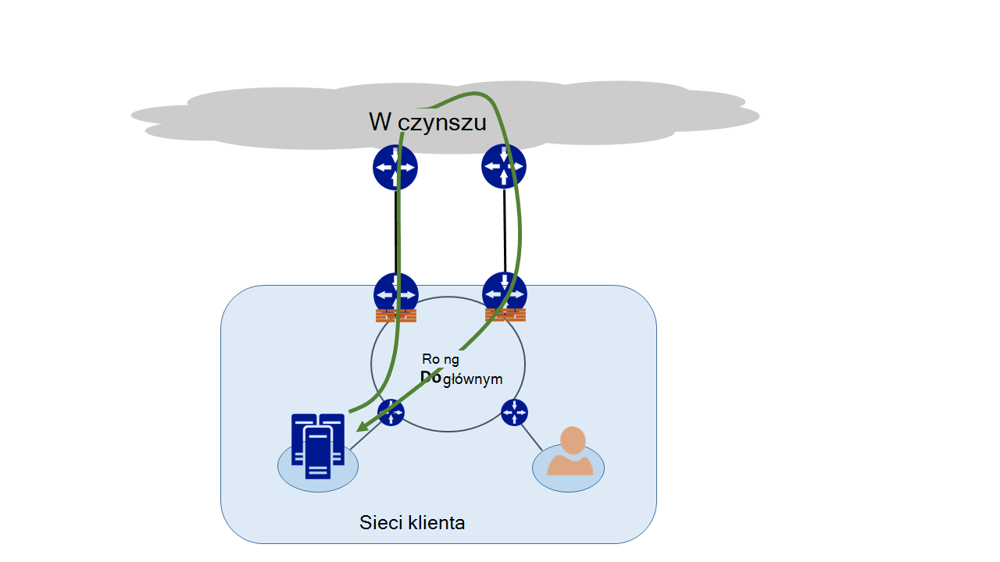
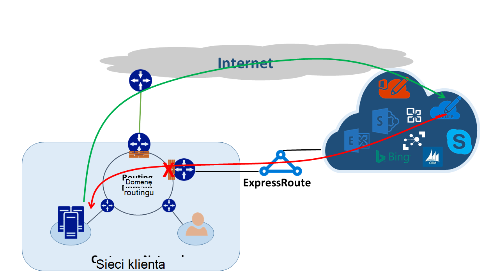
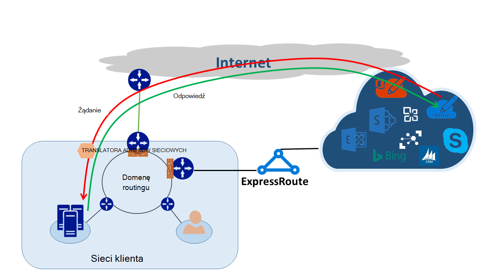

<properties
   pageTitle="Kierowanie asymetrycznym | Microsoft Azure"
   description="W tym artykule opisano problemy, które klienta może być buźkę asymetrycznym routingu w sieci, który ma wiele łączy do miejsca docelowego."
   documentationCenter="na"
   services="expressroute"
   authors="osamazia"
   manager="carmonm"
   editor=""/>
<tags
   ms.service="expressroute"
   ms.devlang="na"
   ms.topic="get-started-article"
   ms.tgt_pltfrm="na"
   ms.workload="infrastructure-services"
   ms.date="10/10/2016"
   ms.author="osamazia"/>

# Kierowanie asymetrycznym z wielu ścieżek sieciowych

W tym artykule wyjaśniono, jak przekazywanie i zwracać ruch sieciowy może zająć sposoby, w przypadku wielu ścieżek między sieci źródłowej i docelowej.

Należy zrozumieć dwa pojęcia, aby poznać asymetrycznym routing. Jedna jest efekt wielu ścieżek sieciowych. Jest drugi, jak urządzeń, takich jak zapora, zachować stan. Typy urządzeń są nazywane stanowe urządzenia. Kombinacja tych dwóch czynników tworzy scenariuszy w sieci, w której ruch jest przenoszony przez urządzenie stanowe, ponieważ stanowe urządzenia nie wykrywa, że ruch pochodzi z urządzenia.

## Wiele ścieżek sieciowych

Gdy sieć zawiera tylko jedno łącze z Internetem z usługodawcą internetowym, cały ruch do i z Internetu przechodzi tę samą ścieżkę. Często firmy zakupu wielu obwody jako zbędne ścieżki, aby poprawić czas pracy sieci. W takim przypadku jest możliwe, że ruch zbliża się spoza sieci z Internetem, pokazując jedno łącze i zwrotu ruch udaje się za pomocą różnych łącza. Jest to znany jako routing asymetrycznym. W routingu asymetrycznym odwrotnej ruch sieciowy trwa inną ścieżkę z oryginalnym przepływu.

Mimo że przede wszystkim występuje w Internecie, asymetrycznym routingu również dotyczy kombinacje wielu ścieżek. Dotyczy, na przykład zarówno ścieżki internetowe i prywatnych ścieżkę, która przejdź do tego samego miejsca docelowego, a także do wielu ścieżek prywatnych, które przejdź do tego samego miejsca docelowego.

Każdy router na sposób ze źródła do miejsca docelowego, oblicza najlepsze ścieżkę do miejsca docelowego. Oznaczanie routera najlepszych możliwych ścieżek jest oparty na dwa główne czynniki:

-   Routing między sieciami zewnętrznymi jest oparty na protokołu routingu, obramowanie Gateway Protocol (BGP). BGP pobiera reklam sąsiadów i uruchamia je na kolejnych czynności, aby określić najlepsze ścieżkę do zamierzonego miejsca docelowego. Ścieżka zalecane jest przechowywana w swojej tabeli routingu.
-   Długość maski podsieci skojarzone z trasę wpływa ścieżek routingu. Jeśli router odbiera wiele anonsów dla tego samego adresu IP, ale przy użyciu różnych masek podsieci, router preferowany anons za pomocą dłużej maski podsieci, ponieważ uwzględniono trasę bardziej szczegółowe.

## Stanowe urządzeń

Routery Spójrz na nagłówku IP pakietu do celów routingu. Niektóre urządzenia sprawdź trudniejsze wewnątrz pakietu. Zazwyczaj te urządzenia przeglądać Layer4 (Transmission Control Protocol lub TCP; lub User Datagram Protocol lub UDP), a nawet Layer7 nagłówki (warstwy aplikacji). Następujących rodzajów urządzeń lub są one urządzeń zabezpieczeń urządzeń optymalizacji przepustowości. 

Zapora to typowy przykład stanowe urządzenia. Zapora pozwala lub nie pakiet za pośrednictwem jego interfejsów opartych na różnych pól, takich jak protokół, port TCP/UDP i nagłówki adresu URL. Ten poziom inspekcję pakietów umieszcza przy dużym przetwarzania obciążenia na tym urządzeniu. Aby zwiększyć wydajność, zapory sprawdza pierwszy pakiet przepływu. Jeśli umożliwia pakietu kontynuować przechowywana przepływu informacji w tabeli stan. Wszystkie kolejne pakiety związane z tego przepływu są dozwolone oparta na oznaczaniu początkowej. Pakiet, który jest częścią istniejącego przepływu może zostać obciążony zapory. Jeśli Zapora zawiera informacje o jej nie poprzedniego stanu, zapory pomija pakiet.

## Asymetrycznym routingu z ExpressRoute

Po podłączeniu do firmy Microsoft przez Azure ExpressRoute zmiany sieci następująco:

-   Masz wiele łączy do firmy Microsoft. Jedno łącze jest istniejące połączenie z Internetem, a drugi jest za pośrednictwem ExpressRoute. Niektóre ruch do firmy Microsoft mogą przejść za pośrednictwem Internetu, ale wróci za pośrednictwem ExpressRoute lub odwrotnie.
-   Pojawi się bardziej szczegółowych adresów IP przy użyciu ExpressRoute. Aby ruchu z sieci do firmy Microsoft dla usług oferowanych przez ExpressRoute, routery zawsze Preferuj ExpressRoute.

Aby uzyskać efekt, który ma tych dwóch zmian w sieci, przypatrzmy się kilka scenariuszy. Na przykład masz tylko jeden obwód z Internetem i używać wszystkich usług firmy Microsoft przez Internet. Ruch w Twojej sieci do firmy Microsoft i z powrotem przechodzi do tego samego łącza internetowe i przekazuje za pośrednictwem zapory. Zapory rekordów przepływu widzi ją pierwszy pakiet i pakietów zwrotu są dozwolone, ponieważ przepływ istnieje w tabeli stanu.

Następnie należy włączyć ExpressRoute i korzystania z usług oferowanych przez firmę Microsoft na ExpressRoute. Wszystkie inne usługi firmy Microsoft są używane w Internecie. Należy wdrożyć osobnych zapory do krawędzi podłączonego do ExpressRoute. Microsoft anonsuje więcej prefiksów z siecią przez ExpressRoute dla określonych usług. Usługi infrastruktury routingu wybiera ExpressRoute jako preferowaną ścieżką dla tych prefiksów. Jeśli są nie reklamę publicznej adresów IP do firmy Microsoft przez ExpressRoute, Microsoft komunikuje się z usługi publicznych adresów IP przez Internet. ExpressRoute używa przekazywania ruchu z sieci do firmy Microsoft i odwrotnej ruch od firmy Microsoft korzysta z Internetu. Gdy zapory przy krawędzi wykryje pakiet odpowiedzi dla przepływu, który nie znajduje się w tabeli stanu, pomija zwrotu ruch.

Jeśli chcesz użyć tej samej puli translatora adresów sieciowych adres dla ExpressRoute Internet, zobaczysz podobne problemy z klientami w sieci prywatnych adresów IP. Żądania usługi, takie jak Windows Update przejść za pośrednictwem Internetu, ponieważ adresów IP dla tych usług nie są ogłaszane za pośrednictwem ExpressRoute. Jednak dane zwrotu wróci za pośrednictwem ExpressRoute. Jeśli Microsoft otrzymuje adres IP z tej samej maski podsieci z Internetem i ExpressRoute, preferowany ExpressRoute przez Internet. Jeśli zapora lub innego urządzenia stanowe, który znajduje się na krawędzi swojej sieci i przeciwległych ExpressRoute nie ma poprzednich informacji o procesie, pomija pakietów, które należą do tego przepływu.

## Asymetrycznym rozwiązań

Istnieją dwie opcje głównym, aby rozwiązać ten problem routingu asymetrycznym. Jeden jest za pośrednictwem routingu, a drugi jest przy użyciu oparte na źródle translatora adresów Sieciowych (SNAT).

### Routing

Upewnij się, że usługi publiczne adresy IP są ogłaszane na odpowiednie rozległa (łącza sieci WAN). Na przykład jeśli chcesz się połączyć z Internetem dla uwierzytelniania ruchu i ExpressRoute dla ruchu poczty, nie należy ogłaszanie publicznych adresów IP usługi Active Directory Federation Services (AD FS) na ExpressRoute. Podobnie, upewnij się nie poddawać lokalnego serwera usług AD FS na adresy IP, otrzymywanych przez ExpressRoute routera. Trasy odbierane przez ExpressRoute są bardziej szczegółowych, aby wprowadzać preferowaną ścieżką ruchu uwierzytelniania ExpressRoute do firmy Microsoft. Ta opcja powoduje routingu asymetrycznym.

Jeśli chcesz zastosować ExpressRoute dla uwierzytelniania, upewnij się, że są reklamę publicznych adresów IP usług AD FS nad ExpressRoute bez translatora adresów sieciowych. Dzięki temu danych, które pochodzą od firmy Microsoft i przechodzi do lokalnego serwera usług AD FS omówiono ExpressRoute. Ruch zwrotu z klienta do firmy Microsoft używa ExpressRoute, ponieważ jest preferowanej trasie w Internecie.

### Oparte na źródle translatora adresów Sieciowych

Innym sposobem rozwiązywania problemów dotyczących routingu asymetrycznym jest przy użyciu SNAT. Na przykład możesz mieć nie ogłaszane publiczny adres IP lokalnego serwera Simple Mail Transfer Protocol (SMTP) na ExpressRoute ponieważ ma być używany dla tego typu komunikacji z Internetem. Żądanie, które pochodzą z firmą Microsoft, a następnie przechodzi do lokalnego serwera SMTP przechodzi Internet. Możesz SNAT przychodzące żądanie wewnętrzny adres IP. Ruch odwrotnej z serwera SMTP przejście do krawędzi zapory (za pomocą której NAT) zamiast za pośrednictwem ExpressRoute. Ruch zwrotu powrót przez Internet.

## Asymetrycznym wykrywania routingu

Traceroute jest najlepszy sposób, aby upewnić się, że ruch w tej sieci jest przechodzenie oczekiwana ścieżka. Jeśli oczekujesz ruchu z lokalnego serwera SMTP do firmy Microsoft w celu wykonania ścieżki internetowe oczekiwanych traceroute jest z serwera SMTP do usługi Office 365. Wynik sprawdza ruch faktycznie opuszcza sieć w Internecie, a nie w kierunku ExpressRoute.
