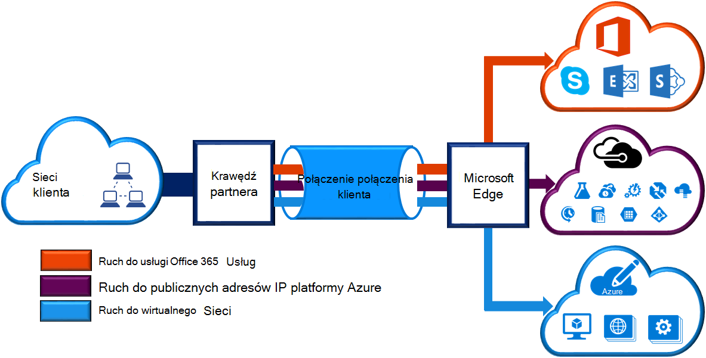
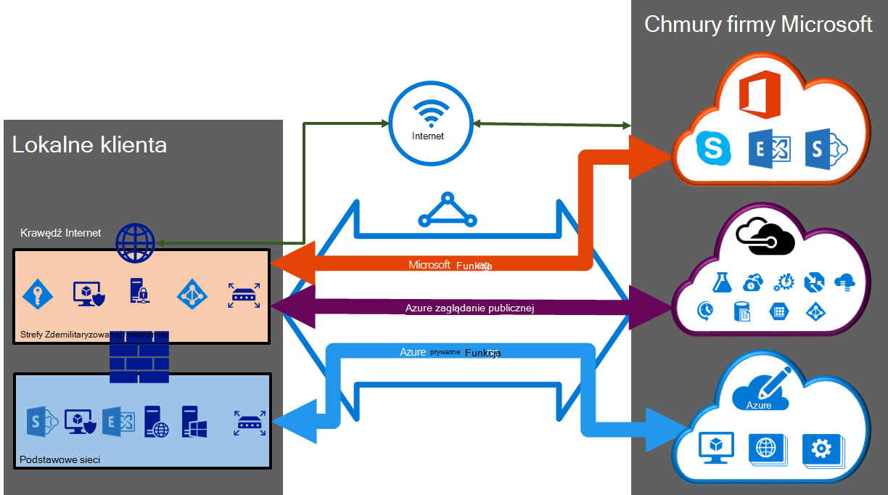

<properties 
   pageTitle="ExpressRoute obwody elektryczne i układy domen routingu | Microsoft Azure"
   description="Ta strona zawiera omówienie ExpressRoute obwody elektryczne i układy domen routingu."
   documentationCenter="na"
   services="expressroute"
   authors="cherylmc"
   manager="carmonm"
   editor=""/>
<tags 
   ms.service="expressroute"
   ms.devlang="na"
   ms.topic="article" 
   ms.tgt_pltfrm="na"
   ms.workload="infrastructure-services" 
   ms.date="10/10/2016"
   ms.author="cherylmc"/>

# ExpressRoute obwody elektryczne i układy domen routingu

 Należy zamówić *elektrycznego ExpressRoute* nawiązać infrastruktury lokalnego do firmy Microsoft przez dostawcę łączności. Na poniższym rysunku znajdują się logiczną reprezentacją łączność między WAN i usługi firmy Microsoft.

## Obwody ExpressRoute

*Obwód ExpressRoute* reprezentuje logiczne połączenie między lokalnego infrastruktury i usług w chmurze firmy Microsoft przez dostawcę łączności. Kolejność możesz wielu obwodów ExpressRoute. Każdy obwód mogą znajdować się w takich samych lub różnych regionów i mogą być połączone z ich lokalnej za pośrednictwem dostawcy różnych łączności. 

Obwody ExpressRoute nie są mapowane na wszystkie elementy fizycznym. Standardowe, które jako klucz usługi (s klawisze) o nazwie identyfikator GUID jednoznacznie identyfikuje obwodu. Klucz usługi to jedyna informacja między firmy Microsoft, Dostawca połączeń, a. Klawisz s nie jest tajne ze względów bezpieczeństwa. Istnieje mapowanie 1:1 między obwód ExpressRoute i klawisz s.

Układ ExpressRoute może zawierać maksymalnie trzy peerings niezależnych: Azure prywatne publicznej, Azure i Microsoft. Każdy zaglądanie to para niezależnych BGP sesji ich skonfigurowane nadmiarowo wysokiej dostępności. Istnieje 1: n (1 < = N < = 3) mapowanie między obwód ExpressRoute i routingu domen. Układ ExpressRoute może mieć jeden, dwa lub wszystkie trzy peerings włączany dla każdego elektrycznego ExpressRoute.
 
Każdy obwód o stałej szerokości pasma (50 MB/s, 100 MB/s, 200 MB/s, 500 MB/s, 1 GB, 10 GB) i są mapowane w polu Dostawca połączeń i peering położenie. Możesz wybrać przepustowość jest udostępniany przez wszystkie peerings dla układu. 

### Przydziałów, ograniczenia i ograniczenia

Domyślne przydziały i ograniczenia stosowanie dla każdej obwodu ExpressRoute. Zapoznaj się z [subskrypcji Azure i limity dotyczące usługi, przydziały oraz ograniczenia](../azure-subscription-service-limits.md) stronie aktualne informacje dotyczące przydziałów.

## ExpressRoute domen routingu

Układ ExpressRoute ma wiele domen routingu skojarzona: Azure prywatne publicznej, Azure i Microsoft. Każdej z tych domen routingu skonfigurowano tak samo na pary routerów (aktywny aktywny lub udostępniania ładowania konfiguracji) wysokiej dostępności. Usług Azure są określane jako *Azure publicznej* i *Azure prywatne* reprezentować adresowanie schematy IP.

### Zaglądanie prywatnych

Azure obliczyć usług, takich jak maszyn wirtualnych (IaaS) i usługami w chmurze (PaaS), wdrożonych w wirtualnej sieci mogą być połączone za pośrednictwem prywatne peering domeny. Prywatne domeny peering jest uważany za zaufany rozszerzenia sieci podstawowych do Microsoft Azure. Możesz skonfigurować dwukierunkową łączność między podstawową siecią a Azure wirtualnych sieci (VNets). Ten zaglądanie umożliwia nawiązywanie połączenia z maszyn wirtualnych i usług bezpośrednio w swoich prywatnych adresów IP w chmurze.  

Więcej niż jedną siecią wirtualną można nawiązać prywatne peering domeny. Przejrzyj [z często Zadawanymi pytaniami](expressroute-faqs.md) informacji na temat limitów i ograniczenia. Można odwiedzić stronę [subskrypcji Azure i limity dotyczące usługi, przydziały oraz ograniczenia](../azure-subscription-service-limits.md) aktualne informacje na ograniczenia.  Zapoznaj się z strony [Routing](expressroute-routing.md) szczegółowe informacje na temat konfiguracji routingu.

### Zaglądanie publicznej

Usług, takich jak magazyn Azure, bazy danych programu SQL i witrynami sieci Web są dostępne na publicznych adresów IP. Można nawiązać prywatnie usług dostępnych w publicznej adresy IP, w tym służącą usługi cloud za pośrednictwem publicznego peering domenę routingu. Można łączyć publicznej peering domeny do usługi strefy Zdemilitaryzowanej i nawiązywanie połączenia z wszystkich usług Azure na adresy IP publiczne z sieci WAN bez konieczności połączenia przez internet. 

Łączność jest zawsze inicjowane z sieci WAN do usługi Microsoft Azure. Usługi Microsoft Azure nie będą mogli inicjowania połączeń w sieci za pomocą tej domeny routingu. Po włączeniu publicznej zaglądanie będzie mógł połączyć ze wszystkich usług Azure. Firma Microsoft nie jest możliwe selektywne wybierz usługi, dla których firma Microsoft ogłaszanie trasy do. Możesz przejrzeć listę prefiksów, które możemy ogłaszanie użytkownikowi za pośrednictwem tego zaglądanie na stronie [Zakresów adresów IP centrum danych Microsoft Azure](http://www.microsoft.com/download/details.aspx?id=41653) . Strony jest aktualizowana co tydzień.

Trasa niestandardowe filtry można zdefiniować w sieci wykorzystać tylko trasy, które są potrzebne. Zapoznaj się z strony [Routing](expressroute-routing.md) szczegółowe informacje na temat konfiguracji routingu. Trasa niestandardowe filtry można zdefiniować w sieci wykorzystać tylko trasy, które są potrzebne. 

Zobacz [z często Zadawanymi pytaniami](expressroute-faqs.md) , aby uzyskać więcej informacji na usług obsługiwanych przez publicznej peering domenę routingu. 
 
### Zaglądanie firmy Microsoft

[AZURE.INCLUDE [expressroute-office365-include](../../includes/expressroute-office365-include.md)]

Łączność z wszystkich innych usług Microsoft online services (na przykład usługi Office 365) będzie za pośrednictwem zaglądanie firmy Microsoft. Firma Microsoft umożliwiają dwukierunkową łączność między usługi cloud WAN i Microsoft za pośrednictwem peering domenę routingu firmy Microsoft. Należy połączyć z usługami w chmurze firmy Microsoft tylko na publicznych adresów IP, które należą przez użytkownika lub dostawcy łączności i muszą spełniać zdefiniowanych reguł. Odwiedź stronę [wymagania wstępne dotyczące ExpressRoute](expressroute-prerequisites.md) , aby uzyskać więcej informacji.

Zawiera [z często Zadawanymi pytaniami](expressroute-faqs.md) , aby uzyskać więcej informacji na temat usług obsługiwanych, kosztów i szczegóły konfiguracji. Zobacz stronę [ExpressRoute lokalizacje](expressroute-locations.md) , aby uzyskać informacje na liście łączności dostawców oferuje zaglądanie pomocy technicznej firmy Microsoft.

## Porównanie domenę routingu

W poniższej tabeli porównano trzy domeny routingu.

||**Zaglądanie prywatnych**|**Zaglądanie publicznej**|**Zaglądanie firmy Microsoft**|
|---|---|---|---|
|**Maksymalna liczba. obsługiwane na zaglądanie prefiksy #**|4000 domyślnie 10 000 z ExpressRoute Premium|200|200|
|**Zakresy adresów IP, obsługiwane**|Dowolny prawidłowy adres IP protokołu IPv4 w sieci WAN.|Posiadane przez użytkownika lub dostawcy łączności publicznej adresy IP protokołu IPv4.|Posiadane przez użytkownika lub dostawcy łączności publicznej adresy IP protokołu IPv4.|
|**ZGODNIE z wymaganiami liczb**|Prywatne i publiczne jako liczby. Musi być własnością publicznego jako numer, jeśli zdecydujesz się na użycie jednego. | Prywatne i publiczne jako liczby. Jednak musi udowodnić własności publicznych adresów IP.| Prywatne i publiczne jako liczby. Jednak musi udowodnić własności publicznych adresów IP.|
|**Adresy IP interfejsu routingu**|RFC1918 i publiczne adresy IP|Zarejestrowany dla Ciebie w rejestrach routingu publicznych adresów IP.| Zarejestrowany dla Ciebie w rejestrach routingu publicznych adresów IP.|
|**Obsługa mieszania MD5**| Tak|Tak|Tak|

Możesz włączyć jednej lub większej liczby domen routingu jako część ich obwód ExpressRoute. Możesz mieć routingu domen, umieść w tym samym VPN, jeśli chcesz połączyć je do jednej domeny routingu. Ponadto można umieszczać w różnych domenach routingu, podobne do diagramu. Zalecana konfiguracja jest prywatne zaglądanie jest podłączone bezpośrednio do sieci podstawowej, oraz publicznych i Microsoft zaglądanie łącza są połączeni z Twojej strefy Zdemilitaryzowanej.
 
Jeśli wybierzesz opcję wszystkie trzy sesje peering, musi mieć trzy pary sesje BGP (jedna para dla każdego typu peering). Pary sesji BGP zapewniają wysokiej dostępności łącze. Jeśli nawiązujesz połączenie za pośrednictwem dostawcy 2 łączności warstwy, będzie odpowiedzialny za konfigurowania i zarządzania nimi routingu. Więcej informacji można przeglądając [przepływy pracy](expressroute-workflows.md) dla konfigurowania ExpressRoute.

## Następne kroki

- Znajdowanie dostawcy usługi. Zobacz [dostawców usług ExpressRoute i lokalizacji](expressroute-locations.md).
- Upewnij się, że są spełnione wszystkie wymagania wstępne. Zobacz [wymagania wstępne dotyczące ExpressRoute](expressroute-prerequisites.md).
- Konfigurowanie połączenia ExpressRoute.
    - [Tworzenie obwodu ExpressRoute](expressroute-howto-circuit-classic.md)
    - [Konfigurowanie routingu (obwód peerings)](expressroute-howto-routing-classic.md)
    - [Łącze VNet obwód ExpressRoute](expressroute-howto-linkvnet-classic.md)
