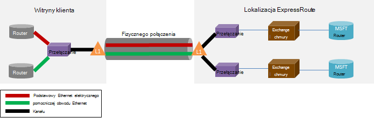

<properties
   pageTitle="ExpressRoute — często zadawane pytania"
   description="Często zadawane pytania ExpressRoute zawiera informacje o obsługiwane usługi Azure, koszt, danych i połączeń, Umowa dotycząca poziomu usług, dostawców i lokalizacji, przepustowości i dodatkowe szczegóły techniczne."
   documentationCenter="na"
   services="expressroute"
   authors="cherylmc"
   manager="carmonm"
   editor=""/>
<tags
   ms.service="expressroute"
   ms.devlang="na"
   ms.topic="article" 
   ms.tgt_pltfrm="na"
   ms.workload="infrastructure-services"
   ms.date="10/10/2016"
   ms.author="cherylmc"/>

# ExpressRoute — często zadawane pytania

## Co to jest ExpressRoute?
ExpressRoute jest Azure usługa, która umożliwia tworzenie prywatnych połączeń między centrach danych firmy Microsoft i infrastruktury, czyli w swojej siedzibie lub w pomieszczeniu wspólna lokalizacja. ExpressRoute połączenia nie Przejdź publicznie w Internecie i oferują wyższą zabezpieczeń, niezawodności i szybkości z opóźnienia niższej niż typowy połączenia przez Internet.

### Jakie są zalety korzystania z ExpressRoute i połączeń sieci prywatnej?
ExpressRoute połączenia nie Przejdź publicznie w Internecie i oferują wyższą zabezpieczeń, niezawodności i szybkości z dolnym i spójność opóźnienia niż typowy połączenia przez Internet. W niektórych przypadkach przy użyciu połączeń ExpressRoute do przenoszenia danych między lokalnego urządzenia i Azure może przynieść korzyści kosztów.

### Jakich usług w chmurze firmy Microsoft są obsługiwane przez ExpressRoute?
ExpressRoute obsługuje większość usług Microsoft Azure dzisiaj łącznie z usługi Office 365.  Wkrótce znajdziesz aktualizacje na ogólnodostępną.

### Gdzie jest usługa?
Tej stronie lokalizacji usługi i dostępności: [partnerów ExpressRoute i lokalizacji](expressroute-locations.md).

### Jak używać ExpressRoute Aby połączyć się z firmą Microsoft, jeśli nie posiadam powiązania z jednego z partnerów ExpressRoute przewoźników?
Można wybrać regionalne przewoźnika i ziemi połączeń Ethernet do jednego z obsługiwanych exchange lokalizacje dostawcy. Następnie można elementów równorzędnych z firmą Microsoft w lokalizacji dostawcy. Zaznacz ostatnią sekcją [partnerów ExpressRoute i lokalizacje,](expressroute-locations.md) Aby sprawdzić, czy Twój dostawca usług znajduje się w innych miejscach programu exchange. Następnie można zamówień obwód ExpressRoute przez usługodawcę, aby nawiązać połączenie Azure.

### Jaki jest koszt ExpressRoute?
Sprawdzanie [ceny szczegóły](https://azure.microsoft.com/pricing/details/expressroute/) , aby uzyskać informacje o cenach.

### Jeśli opłatami obwód ExpressRoute danej przepustowości czy połączenie VPN, które można kupić z usługodawcą sieci musi działać na tej samej szybkości?
Wartość nie. Połączenie VPN każdej prędkości można kupić u usługodawcy. Jednak połączenie Azure będzie ograniczona do przepustowości elektrycznego ExpressRoute zakupu.

### Jeśli opłatami obwód ExpressRoute danej przepustowości jest używana możliwość serii maksymalnie większe szybkości w razie potrzeby?
Wartość Tak. Obwody ExpressRoute są skonfigurowane do obsługi spraw, gdzie możesz można serii maksymalnie dwa razy limit przepustowości, które zamówionych dla bez dodatkowych opłat. Skontaktuj się z dostawcą usługi, jeśli obsługują tę funkcję.

### Można używać tego samego połączenia sieci prywatnej z wirtualnej sieci i innych usług Azure jednocześnie?
Wartość Tak. Układ ExpressRoute raz konfiguracji pozwoli na dostęp do usług w wirtualnej sieci i innych usług Azure jednocześnie. Połączysz się wirtualnych sieci na ścieżce peering prywatnych i innych usług na ścieżce peering publicznej.

### ExpressRoute oferuje system Umowa dotycząca poziomu usług (SLA)?
Odwołują się do [strony ExpressRoute Umowa dotycząca poziomu usług](https://azure.microsoft.com/support/legal/sla/) , aby uzyskać więcej informacji.

## Obsługiwane usługi
Najbardziej Azure usługi są obsługiwane przez ExpressRoute.

- Łączność z maszyn wirtualnych i usług w chmurze wdrożony w wirtualnych sieci są obsługiwane na ścieżce peering prywatne.
- Azure witryn sieci Web są obsługiwane na ścieżce peering publicznej.
- Centrum IoT jest obsługiwana w ścieżce peering publicznej.
- Usługa Office 365 jest obsługiwane na ścieżce peering firmy Microsoft.
- Wszystkie inne usługi są dostępne w ścieżce peering publicznej. Dostępne są następujące wyjątki.

    **Nie są obsługiwane następujące usługi:**

    - SIECI CDN
    - Programu Visual Studio zespołu usługi testowania obciążenia
    - Uwierzytelnianie wieloskładnikowe
    - Menedżer ruchu

## Połączenia i danych

### Czy istnieją ograniczenia dotyczące ilości danych, które mogą przesyłać przy użyciu ExpressRoute?
Firma Microsoft nie ustawiono limit od ilości transfer danych. Zapoznaj się z [ceny szczegóły](https://azure.microsoft.com/pricing/details/expressroute/) uzyskać informacji na temat przepustowości stawki.

### Jakie szybkość połączenia są obsługiwane przez ExpressRoute?
Obsługiwane ofert przepustowości:

| 50 MB/s, 100 MB/s, 200 MB/s, 500 MB/s, 1Gbps, 2 GB, 5 GB, 10Gbps |

### Dostawcy usług, które są dostępne?
Aby uzyskać listę dostawców usług i lokalizacji, zobacz [partnerów ExpressRoute i lokalizacji](expressroute-locations.md) .

## Szczegóły techniczne

### Jakie są wymagania techniczne nawiązywania połączenia swoją lokalizację lokalnego Azure?
Zobacz [stronę wymagania wstępne dotyczące ExpressRoute](expressroute-prerequisites.md) zgodnie z wymaganiami.

### Mają połączenia ExpressRoute zbędne?
Wartość Tak. Każdy obwód rozsyłania Express ma parze nadmiarowych krzyżowe połączenia skonfigurowane tak, aby zapewnić wysoką dostępność.

### Łączność zostaną utracone jeśli jedna z łącza ExpressRoute nie?
Nie utracisz łączność, jeśli jedno z połączeń między nie powiedzie się. Połączenie zbędne jest dostępna do obsługi obciążenie sieci. Ponadto można utworzyć wiele obwodów w innej lokalizacji peering uzyskanie odporność błąd.

### Jeśli nie mam znajdują się w chmurze programu exchange i usługodawcą oferuje połączenie typu punkt-punkt, należy zamówić dwóch połączeń fizycznych między sieci lokalnej i w programie Microsoft? 
Nie, wystarczy tylko jedno połączenie fizycznie Jeśli Twój dostawca usług można ustanawiać dwa obwody wirtualne Ethernet za pośrednictwem fizycznego połączenia. Połączenie fizycznie (np. światłowód) zostanie zakończone na warstwie 1 urządzenia (L1) (patrz rysunek poniżej). Dwa obwody wirtualne Ethernet są oznaczane różnych identyfikatorach VLAN, jedną dla obiegu podstawowego i jedną dla pomocniczego. Te identyfikatory VLAN znajdują się w zewnętrznym 802.1Q Ethernet nagłówka. Wewnętrzne 802.1Q nagłówka Ethernet (niewidoczne) są mapowane do określonej [domeny routingu ExpressRoute](expressroute-circuit-peerings.md). 

### Można rozszerzyć jedną z moim VLAN Azure za pomocą ExpressRoute?
Wartość nie. Warstwy 2 łączności rozszerzenia do Azure nie jest obsługiwana.

### Czy mogę używać więcej niż jeden obwód ExpressRoute Moja subskrypcja?
Wartość Tak. Masz więcej niż jeden obwód ExpressRoute w ramach subskrypcji. Domyślny limit liczby dedykowane obwody wynosi 10. Możesz również skontaktować się Microsoft Support Aby zwiększyć limit, w razie potrzeby.

### Czy mogę używać obwodów ExpressRoute od dostawców usług innego?
Wartość Tak. Obwody ExpressRoute może mieć z wielu usługodawców. Każdy obwód ExpressRoute zostanie skojarzona z jednego usługodawcę tylko.

### Jak połączyć z moim wirtualnych sieci obwodem ExpressRoute
Podstawowe kroki są przedstawione poniżej.

- Należy ustalić obwód ExpressRoute i z usługodawcy ją włączyć.
- Możesz lub dostawcy należy skonfigurować BGP peering (s).
- Należy połączyć wirtualną sieć obwód ExpressRoute.

Aby uzyskać więcej informacji, zobacz [ExpressRoute przepływów pracy na potrzeby obsługi administracyjnej elektrycznego i Stany obwodów](expressroute-workflows.md) .

### Czy istnieją ograniczenia łączności dla mojej obwodu ExpressRoute?
Wartość Tak. [Partnerzy ExpressRoute i lokalizacji](expressroute-locations.md) strony omówiono granic łączności dla obwodu ExpressRoute. Łączność obwód ExpressRoute jest ograniczona do jednego regionu geopolitycznych. Łączność można rozwinąć w taki sposób, aby krzyżowe geopolitycznych regionów przez włączenie funkcji premium ExpressRoute.

### Czy można połączyć z więcej niż jedną siecią wirtualną obwodem ExpressRoute?
Wartość Tak. Do 10 wirtualnych sieci można połączyć obwód ExpressRoute.

### Masz wiele subskrypcji Azure, które zawierają wirtualnych sieci. Czy można połączyć wirtualnych sieci, które znajdują się w oddzielnym subskrypcje pojedynczy obwód ExpressRoute?
Wartość Tak. Można autoryzować maksymalnie 10 pozostałe subskrypcje Azure umożliwia pojedynczy obwód ExpressRoute. Ten limit można zwiększyć przez włączenie funkcji premium ExpressRoute.

Aby uzyskać więcej informacji zobacz [Udostępnianie obwód ExpressRoute przez wiele subskrypcji](expressroute-howto-linkvnet-arm.md).

### Czy wirtualnych sieci połączenie ten sam obwód odizolowane od siebie?
Wartość nie. Wszystkie wirtualnych sieci połączone z ten sam obwód ExpressRoute w ramach tej samej domeny routingu są i nie są odizolowane od siebie z perspektywy routingu. W razie potrzeby izolacji rozsyłania, musisz utworzyć osobne obwód ExpressRoute.

### Można mieć jeden wirtualną sieć połączony z więcej niż jeden obwód ExpressRoute?
Wartość Tak. Można łączyć jednej wirtualnej sieci z maksymalnie 4 obwodów ExpressRoute. Ta osoba należy zamówić za pośrednictwem 4 różnych [lokalizacjach ExpressRoute](expressroute-locations.md).

### Z mojej wirtualnych sieci połączony z obwodów ExpressRoute umożliwiająca dostęp do Internetu?
Wartość Tak. Jeśli masz nie ogłaszane trasy domyślne (0.0.0.0/0) lub internet prefiksy trasy do sesji BGP, można połączyć się z Internetem z wirtualnej sieci połączone z obwód ExpressRoute.

### Czy można zablokować łączność z Internetem do wirtualnych sieci połączony z obwodów ExpressRoute?
Wartość Tak. Możesz ogłaszanie trasy domyślne (0.0.0.0/0), aby zablokować wszystkie łączność z Internetem do maszyn wirtualnych wdrożony w wirtualnej sieci i kierowanie cały ruch się przez obwód ExpressRoute. Należy zauważyć, że ogłaszanie trasy domyślne, firma Microsoft będzie wymusić ruch usługi oferowane przez publicznej wstecz zaglądanie (na przykład i bazy danych SQL Azure magazynowania), aby swojej siedzibie. Konieczne będzie skonfigurowanie routery zwraca ruch Azure za pośrednictwem publicznego ścieżki peering lub w Internecie.

### Wirtualnych sieci połączone z ten sam obwód ExpressRoute można porozmawiać ze sobą?
Wartość Tak. Maszyn wirtualnych wdrożony w wirtualnych sieci połączone z tym samym obwodem ExpressRoute można komunikować się ze sobą.

### Czy mogę używać łączności witryny do witryny wirtualnych sieci w połączeniu z ExpressRoute?
Wartość Tak. ExpressRoute można współistnienie VPN witryny do witryny.

### Czy można przenosić wirtualnej sieci z witryny do witryny / punktu do witryny konfigurację ExpressRoute?
Wartość Tak. Musisz utworzyć bramę ExpressRoute wirtualna sieć. Będzie małe przestoje skojarzone z procesem.

### Co muszę nawiązywanie połączenia z magazynem Azure nad ExpressRoute?
Należy ustalić obwód ExpressRoute i skonfigurować trasy zaglądanie publicznej.

### Czy istnieją ograniczenia liczby trasy, które można I ogłaszanie?
Wartość Tak. Firma Microsoft akceptować do 4000 prefiksów rozsyłania dla zaglądanie prywatne i 200 zaglądanie publicznej i zaglądanie firmy Microsoft. Można to zwiększyć do 10 000 trasy dla prywatnych zaglądanie po włączeniu funkcji premium ExpressRoute.

### Czy istnieją ograniczenia dotyczące zakresów adresów IP, które można I ogłaszanie sesji BGP?
Firma Microsoft nie akceptuj prefiksy prywatne (RFC1918) publicznych i Microsoft peering BGP sesji.

### Co się stanie, jeśli mam BGP ogranicza?
Sesje BGP zostaną usunięte. Będzie można zresetować po statystykę prefiks przechodzi poniżej limitu.

### Co to jest czas archiwum ExpressRoute BGP? Czy można je dostosować?
Czas archiwum jest 180. Aktywności wiadomości są wysyłane co 60 sekund. Są one stałe ustawień na stronie firmy Microsoft, którego nie można zmieniać.

### Po trasy domyślnej (0.0.0.0/0) I ogłaszanie do mojej wirtualnych sieci, I nie można aktywować Windows uruchomionego na moim maszyny wirtualne Azure. Jak do można rozwiązać ten problem?
Poniższe kroki pomogą Azure rozpoznaje żądanie aktywacji:

1. Ustanowić publicznej zaglądanie dla swojego obwodu ExpressRoute.
2. Wyszukiwanie serwera DNS i Znajdź adres IP **kms.core.windows.net**
3. Następnie wykonaj jedną z następujących dwóch elementów tak, aby usługa zarządzania kluczami rozpozna, że żądania aktywacji pochodzi z Azure i będą przestrzegać żądania.
    - W sieci lokalnej skierować ruch przeznaczony dla adresu IP (uzyskana w kroku 2) do Azure za pomocą publicznej zaglądanie.
    - Masz NSP dostawcy włosów-numer pin ruch do Azure za pomocą publicznej zaglądanie.

### Czy mogę zmienić przepustowość obwód ExpressRoute?
Wartość Tak. Przepustowość obwód ExpressRoute można zwiększyć bez konieczności go usunąć. Konieczne będzie Flaga monitująca u dostawcy łączności, aby zaktualizować limity w ramach ich sieci do obsługi zwiększenie przepustowości. Jednak nie można zmniejszyć przepustowość obwód ExpressRoute. Konieczności dolnego, który przepustowość będzie oznaczała zużycie w dół i odtworzenie obwód ExpressRoute.

### Jak zmienić przepustowość obwód ExpressRoute?
Możesz zaktualizować przepustowość obwodu ExpressRoute za pomocą aktualizacji dedykowane elektrycznego i interfejsu API programu PowerShell cmdlet.

## ExpressRoute Premium

### Co to jest ExpressRoute premium?
ExpressRoute premium to zbiór funkcji wymienionych poniżej.

 - Zwiększona routingu limit tabeli z 4000 trasy do 10 000 trasy zaglądanie prywatne.
 - Zwiększenie liczby VNets, które mogą być łączone z obwodem ExpressRoute (wartość domyślna to 10). Zobacz tabela poniżej, aby uzyskać więcej informacji.
 - Globalne łączność za pośrednictwem sieci Microsoft core. Teraz można połączyć VNet w jednym regionie geopolitycznych z obwód ExpressRoute w innym regionie. **Przykład:** Można łączyć VNet utworzone w Europie zachód obwodem ExpressRoute utworzone w Dolinie Krzemowej.
 - Połączenie usługi Office 365 i CRM Online.

### Ile VNets można umieścić łącze do obwód ExpressRoute włączenie ExpressRoute premium?
W poniższej tabeli przedstawiono limity ExpressRoute i liczba VNets na obwód ExpressRoute.

[AZURE.INCLUDE [expressroute-limits](../../includes/expressroute-limits.md)]

### Jak włączyć premia ExpressRoute?
Funkcji premium ExpressRoute można włączyć, gdy jest włączony i może zostać wyłączony aktualizując stan elektrycznego tej funkcji. Można włączyć premia ExpressRoute w czasie tworzenia elektrycznego lub można zadzwonić elektrycznego aktualizacji dedykowane interfejsu API i polecenia cmdlet programu PowerShell, aby włączyć premia ExpressRoute.

### Jak wyłączyć ExpressRoute premium?
Możesz wyłączyć ExpressRoute premium, dzwoniąc aktualizacji dedykowane elektrycznego interfejsu API / polecenia cmdlet programu PowerShell, należy się upewnić, że masz skalowany łączność musi spełniać limity domyślne przed wyłączeniem ExpressRoute premium. Firma Microsoft nie powiedzie się żądanie wyłączyć ExpressRoute premium, jeśli do wykorzystania skale poza limity domyślne.

### Można wybrać funkcji, które mają z zestawu funkcji premium?
Wartość nie. Nie można wybrać funkcje, które są potrzebne. Po włączeniu ExpressRoute premium możemy włączyć wszystkie funkcje.

### Jaki jest koszt premium ExpressRoute?
Zapoznaj się z [ceny szczegóły](https://azure.microsoft.com/pricing/details/expressroute/) koszt.

### Należy opłacać premii ExpressRoute oprócz standardowe opłaty ExpressRoute?
Wartość Tak. ExpressRoute premium opłata na bieżąco ExpressRoute elektrycznego opłaty i opłaty wymagane przez dostawcę łączności.

## ExpressRoute i usługi Office 365 i CRM w trybie Online

[AZURE.INCLUDE [expressroute-office365-include](../../includes/expressroute-office365-include.md)]

### Jak utworzyć obwód ExpressRoute do łączenia się z usługami Office 365 i CRM Online?

1. Sprawdź stronę [ExpressRoute wymagania wstępne dotyczące strony](expressroute-prerequisites.md) , aby upewnić się, że spełniają wymagania.
2. Przejrzyj listę dostawców usług i lokalizacji z [partnerami ExpressRoute i lokalizacji](expressroute-locations.md) , aby zapewnić, że Twoje potrzeby łączności są spełnione.
3. Planowanie wymagań dotyczących zdolności przeglądając [Planowanie sieci i dostosowywanie wydajności dla usługi Office 365](http://aka.ms/tune/).
4. Wykonaj kroki wymienione w przepływach pracy poniżej, aby skonfigurować łączności [ExpressRoute przepływów pracy na potrzeby obsługi administracyjnej elektrycznego i Stany obwodów](expressroute-workflows.md).

>[AZURE.IMPORTANT] Upewnij się, czy włączono dodatek premium ExpressRoute podczas konfigurowania łączności z usługi Office 365 i CRM Online.

### Należy włączyć Azure publicznej zaglądanie nawiązywania połączenia z usługami Office 365 i CRM Online?
Nie, wystarczy umożliwiające Peering firmy Microsoft. Uwierzytelniania ruchu Azure AD będą wysyłane za pośrednictwem Peering firmy Microsoft. 

### Czy moje istniejące obwodów ExpressRoute obsługi połączeń do usługi Office 365 i CRM Online?
Wartość Tak. Do istniejącego elektrycznego ExpressRoute można skonfigurować do obsługi połączeń do usługi Office 365. Upewnij się, że masz wystarczającej, aby połączyć się z usługami Office 365 i upewnij się, czy włączono dodatek premium. [Planowanie sieci i dostosowywanie wydajności dla usługi Office 365](http://aka.ms/tune/) pomogą Ci zaplanować potrzeb łączności. Zobacz też [Tworzenie i modyfikowanie obwód ExpressRoute](expressroute-howto-circuit-classic.md).

### Jakie usługi są dostępne za pośrednictwem połączenia ExpressRoute usługi Office 365?

Odwołują się do [usługi Office 365 w adresy URL i zakresy adresów IP](http://aka.ms/o365endpoints) strony na bieżąco wykaz usług obsługiwanych przez ExpressRoute.

### Ile kosztuje usługa ExpressRoute dla usługi Office 365 i koszt CRM Online?
Usługi Office 365 i CRM Online wymaga dodatku premium są włączone. [Cennik strony szczegółów](https://azure.microsoft.com/pricing/details/expressroute/) zawiera szczegóły kosztów dla ExpressRoute.

### W jakich regionów jest obsługiwana ExpressRoute dla usługi Office 365?
Aby uzyskać więcej informacji na liście partnerów i lokalizacji, w których jest obsługiwana ExpressRoute odwołują się do [partnerów ExpressRoute i lokalizacji](expressroute-locations.md) .

### Można uzyskać dostęp do usługi Office 365 w Internecie, nawet jeśli skonfigurowano ExpressRoute dla swojej organizacji?
Wartość Tak. Office 365 usługi w punkty końcowe są dostępne za pośrednictwem Internetu, nawet jeśli skonfigurowano ExpressRoute dla sieci. Jeśli znajdujesz się w lokalizacji, która jest skonfigurowany do łączenia się do usługi Office 365 za pomocą ExpressRoute, łączą za pośrednictwem ExpressRoute.

### Dynamics AX Online jest dostępna za pośrednictwem połączenia ExpressRoute?
Nie, go nie jest obsługiwane.
