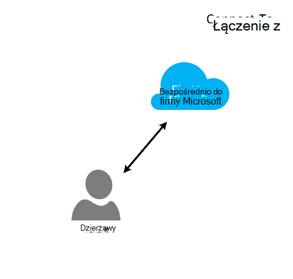
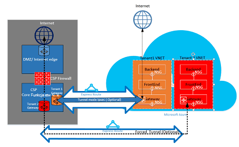

<properties
   pageTitle="Azure ExpressRoute dla dostawcy rozwiązań chmury | Microsoft Azure"
   description="Ten artykuł zawiera informacje dotyczące usługodawców chmury, który zamierzasz uwzględniać usług Azure i ExpressRoute do ich ofert."
   documentationCenter="na"
   services="expressroute"
   authors="richcar"
   manager="carmonm"
   editor=""/>
<tags
   ms.service="expressroute"
   ms.devlang="na"
   ms.topic="get-started-article"
   ms.tgt_pltfrm="na"
   ms.workload="infrastructure-services"
   ms.date="10/10/2016"
   ms.author="richcar"/>

# ExpressRoute dla dostawcy rozwiązań chmury (dostawcy)

Firma Microsoft świadczy usługi funkcji Hyper skala dla odsprzedawców tradycyjny i distributors (dostawcy) można było szybko obsługi administracyjnej nowych usług i rozwiązania dla klientów bez konieczności inwestycji w opracowywanie tych nowych usług. Aby umożliwić dostawcy rozwiązanie chmury (dostawcy) możliwość zarządzania bezpośrednio tych nowych usług, firma Microsoft udostępnia programy oraz interfejsy API, umożliwiająca aby zarządzania zasobami Microsoft Azure w imieniu klientów. Jedną z tych zasobów jest ExpressRoute. ExpressRoute umożliwia Aby nawiązać istniejących zasobów klienta usług Azure. ExpressRoute jest wysoka szybkość prywatnej komunikacji łącze do usługi Azure. 

ExpresRoute składa się z dwóch obwodów wysokiej dostępności, które zostały dołączone do subskrypcji jednego odbiorcy i nie może być współużytkowany przez wielu klientów. Każdy obwód powinno zostać zakończone w różnych router, aby zachować wysoki poziom dostępności.

>[AZURE.NOTE] Istnieje przepustowość i połączenia naciśnij klawisze Caps Lock na ExpressRoute, co oznacza, że duże/skomplikowanych wdrożeń wymaga wielu obwodów ExpressRoute dla jednego odbiorcy.

Microsoft Azure udostępnia rosnącej liczby usług, które mogą oferować klientom.  Można zrobić najlepsze wykorzystanie tych usług wymaga użycia połączeń ExpressRoute w celu udostępnienia szybkich Niskie opóźnienie dostęp do środowiska Microsoft Azure.

## Zarządzanie Microsoft Azure
Firma Microsoft świadczy dostawców z interfejsów API do zarządzania subskrypcjami Azure klienta, umożliwiając programowy Integracja z systemami zarządzania własne usługi. Funkcje obsługiwane zarządzania można znaleźć [w tym miejscu](https://msdn.microsoft.com/library/partnercenter/dn974944.aspx).

## Zarządzanie zasobami Microsoft Azure
W zależności od umowy z klienta Określ, jak będzie wyglądało Zarządzanie subskrypcji. Dostawcy bezpośrednio można zarządzać tworzenie i konserwacja zasobów lub klienta można zachować kontrolę nad subskrypcji Microsoft Azure i utworzyć Azure zasoby potrzebują. Jeśli klienta zarządza tworzeniem zasobów w swoją subskrypcję Microsoft Azure używają jednego z dwóch modeli: modelu "Połącz do" lub "Bezpośrednio do" modelu. W poniższych sekcjach szczegółowo opisano tych modeli.  

### Nawiązywanie połączenia przez model

  

W modelu przez łączenie dostawcy tworzy bezpośrednie połączenie między centrum danych i Azure subskrypcji klienta. Bezpośrednie połączenie zostanie nawiązane za pomocą ExpressRoute połączenia z siecią z Azure. Klient połączy się z siecią. W tym scenariuszu wymaga, aby odbiorcy przechodził z siecią dostawcy, aby uzyskać dostęp do usług Azure. 

Odbiorca ma inne subskrypcje Azure nie zarządzane przez Ciebie, ich należy użyć publicznego Internetu lub prywatne połączenia nawiązywania połączenia z tych usług obsługi administracyjnej w obszarze subskrypcji nie dostawcy. 

Zarządzanie usługami Azure dostawcy przyjmuje się, że dostawcy znajduje się w sklepie tożsamości wcześniej wskazanych klienta, która następnie może być replikowane do usługi Azure Active Directory do zarządzania swoją subskrypcję dostawcy za pośrednictwem Administrate-On-Behalf-Of (AOBO). Kluczowe sterowniki w tym scenariuszu obejmują miejsce, w którym dany partnera lub usługodawcą ma ustanowienia relacji z klientem, klienta używające obecnie dostawcy usług lub partnera ma chęć zapewniają kombinacji hostowanej dostawcy i hostowana Azure rozwiązania zapewniające elastyczność i adres odbiorcy problemach, które nie mogą być spełnione przy dostawcy tylko. Poniżej przedstawiono tego modelu na **rysunku**.

### Łączenie z modelu

W modelu łączenie do usługodawcy tworzy bezpośrednie połączenie między centrum danych swoich klientów i subskrypcji Azure dostawcy obsługi administracyjnej przy użyciu ExpressRoute przez klienta (klienta) sieci.

>[AZURE.NOTE] Dla ExpressRoute klienta musi do tworzenia i obsługi obwód ExpressRoute.  

W tym scenariuszu łączności wymaga, aby odbiorcy łączy bezpośrednio za pośrednictwem sieci klienta, aby uzyskać dostęp do zarządzania dostawcy Azure subskrypcji przy użyciu bezpośrednie połączenie sieciowe jest utworzony, własnością i zarządzanych w całości lub częściowo przez klienta. W przypadku tych klientów, których zakłada się, że dostawcy nie ma obecnie ustanowioną Magazyn tożsamości klienta, a dostawca może pomóc klienta w replikacji bieżącym identyfikowanie do usługi Azure Active Directory do zarządzania swoją subskrypcję za pośrednictwem AOBO. Kluczowe sterowników w tym scenariuszu zawiera miejsce, w którym danego partnera lub usługodawca ma ustanowienia relacji z klientem, klienta używające obecnie dostawcy usług lub partnera ma chęć świadczenia usług, które dotyczą tylko hostowanej Azure rozwiązań bez konieczności istniejącego dostawcy centrum danych lub infrastruktury.

Wybór między tych dwóch opcji są oparte na potrzeby klienta i bieżącej potrzebę świadczenia usług Azure. Sterowanie szczegółów tych modeli i skojarzone dostępu oparta na rolach, sieci i desenie projektu tożsamości są objęte szczegóły w następujących łączy:
-   **Kontrola dostępu podstawie roli (RBAC)** — RBAC jest oparty na usługi Azure Active Directory.  Aby uzyskać więcej informacji na temat Azure RBAC zobacz [poniżej](../active-directory/role-based-access-control-configure.md).
-   **Sieć** — obejmuje różne tematy sieci w Microsoft Azure.
-   **Azure Active Directory (AAD)** — AAD zapewnia zarządzanie tożsamościami Microsoft Azure i 3 aplikacji władz akredytacji bezpieczeństwa firmy. Aby uzyskać więcej informacji na temat Azure AD, zobacz [poniżej](https://azure.microsoft.com/documentation/services/active-directory/).  

## Szybkość sieci
ExpressRoute obsługuje szybkość sieci z 50 Mb/s do 10Gb/s. Dzięki temu klienci mogą zakupić potrzebną do ich unikatowym środowisku przepustowość sieci.

>[AZURE.NOTE] Przepustowość sieci można zwiększyć, stosownie do potrzeb bez przerywania komunikacji, ale w celu zmniejszenia sieci szybkości wymaga przerwanie obwodu w dół i odtworzeniu go w dolnym szybkość sieci.  

ExpressRoute obsługuje połączenia wielu vNets do pojedynczego obwodu ExpressRoute dla lepsze wykorzystanie połączeń szybszy. Pojedynczy obwód ExpressRoute może być udostępniana wiele subskrypcji Azure należącą do tego samego klienta.

## Konfigurowanie ExpressRoute
ExpressRoute można skonfigurować do obsługi trzy typy ruchu ([routingu domen](#ExpressRoute-routing-domains)) w jednym obwód ExpressRoute. Ruch jest podzielić na zaglądanie firmy Microsoft, Azure zaglądanie publicznych i prywatnych zaglądanie. Możesz wybrać jednego lub wszystkich typach ruchu do przesyłania za pośrednictwem jednego elektrycznego ExpressRoute lub użyć wielu obwodów ExpressRoute w zależności od rozmiaru obwód ExpressRoute i izolacji wymagane przez klienta. Postawie zabezpieczeń programu klienta nie jest możliwe danych publicznych i prywatnych ruchu do przechodzenia na ten sam obwód.

### Nawiązywanie połączenia przez model
W konfiguracji przez łączenie obowiązek dla wszystkich sieci underpinnings nawiązać subskrypcje obsługiwany w Azure zasobów Centrum danych klientów. Każdego klienta którego chcesz używać funkcji Azure muszą własne połączenia ExpressRoute, które będą zarządzane przez Ciebie. Masz użyje tych samych metod, które klienta służących do zapewniania obwód ExpressRoute. Wykonując te same kroki opisane w artykule [przepływy pracy ExpressRoute](./expressroute-workflows.md) dla elektrycznego inicjowania obsługi administracyjnej i Stany obwodów. Następnie skonfiguruj przekierowuje obramowania Gateway Protocol (BGP) do sterowania ruch ułożony między sieci lokalnej i Azure vNet.

### Łączenie z modelu
Łączenie do konfiguracji klienta już ma istniejące połączenie z Azure lub inicjuje połączenie z usługodawcą internetowym, łączenie ExpressRoute z centrum danych przez klienta bezpośrednio do Azure, zamiast Centrum danych. Aby rozpocząć proces inicjowania obsługi administracyjnej, klient będzie wykonaj czynności zgodnie z powyższym opisem w modelu przez łączenie. Po ustaleniu obwodu klienta należy skonfigurować routery lokalnego, aby można było uzyskać dostęp do sieci i Azure vNets.

Przy użyciu połączenia i konfigurowania trasy może pomóc w celu uzyskania zasobów do datacenter(s) można komunikować się z zasobami klienta w centrum danych lub z zasobami obsługiwanymi w Azure.

## ExpressRoute domen routingu
ExpressRoute oferuje trzy domeny routingu: publiczna, prywatna i zaglądanie firmy Microsoft. Skonfigurowano każdej z tych domen routingu identyczne routery w konfiguracji aktywny aktywny wysokiej dostępności. Więcej informacji na temat ExpressRoute domen routingu można znaleźć [w tym miejscu](./expressroute-circuit-peerings.md).

Można zdefiniować filtry niestandardowe przekierowuje tylko sposobu (sposobów) chcesz zezwolić lub potrzebujesz. Aby uzyskać więcej informacji lub, aby dowiedzieć się, jak wprowadzić te zmiany, zobacz artykuł: [Tworzenie i modyfikowanie routing obwód ExpressRoute przy użyciu programu PowerShell](./expressroute-howto-routing-classic.md) uzyskać więcej szczegółów dotyczących routingu filtry.

>[AZURE.NOTE] Microsoft i zaglądanie publicznej łączności musi być jednak publiczny adres IP należących do klienta lub dostawcy i muszą być zgodne z wszystkich zdefiniowanych reguł. Aby uzyskać więcej informacji zobacz stronę [ExpressRoute wymagania wstępne](expressroute-prerequisites.md) .  

## Routing
ExpressRoute łączy do sieci Azure przez bramę Azure wirtualnej sieci. Sieć bram zapewniają routingu Azure wirtualnych sieci.

Tworzenie wirtualnych sieci Azure tworzy również domyślną tabelę routingu dla vNet umożliwiającą przekierowanie ruchu z podsieci vNet. Jeśli domyślną tabelę routingu jest za mało niestandardowe rozwiązania można utworzyć trasy do kierowania ruchu wychodzącego do urządzenia niestandardowej lub bloku trasy do określonej podsieci lub sieci zewnętrznych.

### Domyślne routingu
Domyślną tabelę routingu zawiera przekierowuje następujące czynności:

- Routing w podsieci
- Podsieci do sieci w wirtualnej sieci
- W Internecie
- Wirtualna sieć do wirtualnej sieci przy użyciu sieci VPN bramy
- Wirtualnej sieci network do lokalnego przy użyciu sieci VPN lub ExpressRoute bramy

  

### Kierowanie zdefiniowane przez użytkownika (UDR)
Zdefiniowane przez użytkownika przekierowuje Zezwalaj kontrola ruchu wychodzącego z podsieci przypisane do innych podsieci w wirtualnej sieci lub nad jednym z innych wstępnie zdefiniowanych bram (ExpressRoute; internet lub sieci VPN). Domyślną tabelę routingu systemu można zastąpić zdefiniowane przez użytkownika routingu tabelę, która zastępuje domyślną tabelę routingu przekierowuje niestandardowe. W przypadku routingu zdefiniowane przez użytkownika klientów można utworzyć określonej trasy do urządzenia, takich jak zapory lub wyposażenia wykrywania intruzów lub zablokować dostęp do określonej podsieci z podsieci hostingu trasę zdefiniowane przez użytkownika. Omówienie przekierowuje zdefiniowane przez użytkownika można znaleźć [w tym miejscu](../virtual-network/virtual-networks-udr-overview.md). 

## Zabezpieczenia
W zależności od model, który jest używany, połącz się lub łączenie przez, określa zasady zabezpieczeń w ich vNet lub klienta zapewnia bezpieczeństwo wymagań zasad do dostawcy do definiowane w celu ich vNets. Można zdefiniować następujące kryteria zabezpieczeń:

1.  **Izolacji klientów** — platformy Azure udostępnia izolacji klienta identyfikator klienta i vNet informacje są przechowywane w bezpieczny bazy danych, która jest używana do umieszczać ruchu każdego z klientów w tunelem GRE.
2.  **Grupa zabezpieczeń sieci (NSG)** reguły są określających dozwolony ruch do i z podsieci w obrębie vNets platformy Azure. Domyślnie NSG zawiera reguły blokowania zablokować ruchu z Internetu do vNet i zezwolić regułom ruchu w vNet. Więcej informacji na temat grup zabezpieczeń sieci można znaleźć [w tym miejscu](https://azure.microsoft.com/blog/network-security-groups/).
3.  **Wymuszanie tunneling** — jest to możliwość przekierowania ruchu internetowego związane ze pochodzących Azure przekierowywać przez połączenie ExpressRoute w centrum danych lokalnych. Aby uzyskać więcej informacji o tunelowaniu wymuszony wygląd [w tym miejscu](./expressroute-routing.md#advertising-default-routes).  

4.  **Szyfrowanie** — nawet obwodów ExpressRoute są zarezerwowane dla określonego odbiorcy, istnieje możliwość że dostawcy sieci może być naruszone, umożliwiające osobie sprawdzenie ruch pakietów. Aby rozwiązać ten potencjał, odbiorcy lub dostawcy można szyfrować ruch przez połączenie, definiując tunelem tryb lokalny dla całego ruchu ułożony między w środowisku lokalnym zasobów i Azure zasobów (odwołują się do opcjonalne trybu tunelem IPSec dla klienta 1 na rysunku 5: zabezpieczenia ExpressRoute powyżej). Jest to druga opcja za pomocą urządzenia zapory na każdym punkt końcowy obwodu ExpressRoute. Wymaga to dodatkowe strona 3 zapory maszyny wirtualne i urządzeń, musi być zainstalowany na obu końcach do szyfrowania ruchu w układzie ExpressRoute.

  

## Następne kroki
Usługi Cloud rozwiązanie dostawcy zawiera sposób, aby zwiększyć wartość klientom bez potrzeby drogich zakupów infrastruktury i możliwości, zachowując swoją pozycję jako dostawca outsourcing podstawowego. Bezproblemowa integracja z Microsoft Azure można wykonywać za pośrednictwem interfejsu API dostawcy, umożliwiając Integracja zarządzania Microsoft Azure w ramach usługi istniejącego środowiska zarządzania.  

Dodatkowe informacje można znaleźć w następujących łączy:

[Program Microsoft Cloud rozwiązanie dostawcy](https://partner.microsoft.com/en-US/Solutions/cloud-reseller-overview).  
[Przygotowywanie transact jako dostawcę rozwiązań chmury](https://partner.microsoft.com/en-us/solutions/cloud-reseller-pre-launch).  
[Zasoby programu Microsoft Cloud rozwiązanie dostawcy](https://partner.microsoft.com/en-us/solutions/cloud-reseller-resources).
