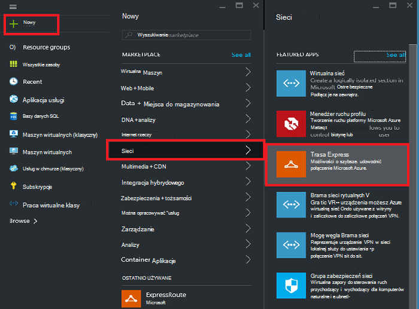
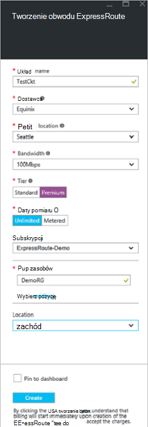
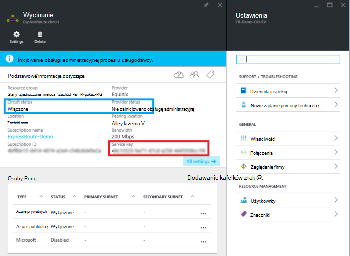
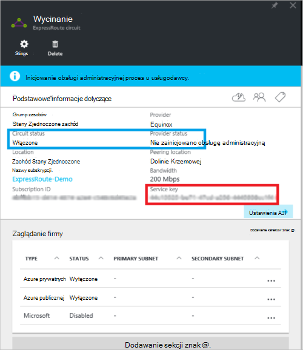
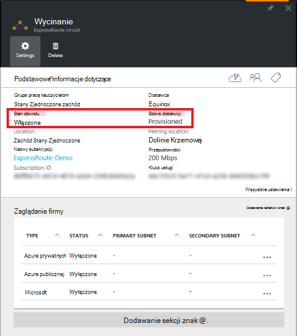

<properties
   pageTitle="Tworzenie i modyfikowanie obwód ExpressRoute za pomocą Menedżera zasobów i Azure portal | Microsoft Azure"
   description="Ten artykuł zawiera opis sposobu tworzenia, obsługi administracyjnej, sprawdź, aktualizowanie, usuwanie i deprovision obwód ExpressRoute."
   documentationCenter="na"
   services="expressroute"
   authors="cherylmc"
   manager="carmonm"
   editor=""
   tags="azure-resource-manager"/>
<tags
   ms.service="expressroute"
   ms.devlang="na"
   ms.topic="article"
   ms.tgt_pltfrm="na"
   ms.workload="infrastructure-services"
   ms.date="10/10/2016"
   ms.author="cherylmc"/>

# Tworzenie i modyfikowanie obwód ExpressRoute

> [AZURE.SELECTOR]
[Portal Azure - Menedżer zasobów](expressroute-howto-circuit-portal-resource-manager.md)
[programu PowerShell — Menedżer zasobów](expressroute-howto-circuit-arm.md)
[PowerShell — klasyczny](expressroute-howto-circuit-classic.md)

Ten artykuł zawiera opis sposobu tworzenia obwód Azure ExpressRoute przy użyciu Azure portal i model wdrożenia Azure Menedżera zasobów. Poniższe kroki pokazują również jak sprawdzić stan obwodu, aktualizowanie lub usuwanie i deprovision go.

**Informacje dotyczące modeli Azure wdrażania**

[AZURE.INCLUDE [vpn-gateway-clasic-rm](../../includes/vpn-gateway-classic-rm-include.md)] 

## Przed rozpoczęciem

- Przed rozpoczęciem konfiguracji, przejrzyj [Warunki wstępne](expressroute-prerequisites.md) i [przepływy pracy](expressroute-workflows.md) .
- Upewnij się, że masz dostęp do [portalu Azure](https://portal.azure.com).
- Upewnij się, że masz uprawnienia do tworzenia nowych zasobów sieci. Skontaktuj się z administratorem konta, jeśli nie masz odpowiednich uprawnień.

## Tworzenie i obsługi administracyjnej obwód ExpressRoute

### 1. Zaloguj się do portalu Azure

W przeglądarce przejdź do [portalu Azure](http://portal.azure.com) i zaloguj się przy użyciu konta Azure.

### 2. Utwórz nowy obwód ExpressRoute

>[AZURE.IMPORTANT] Usługi elektrycznego ExpressRoute będą naliczane od momentu wystawienia klucza usługi. Upewnij się, wykonania tej operacji, gdy dostawca łączności będzie gotowa do obsługi administracyjnej obwodu.

1. Układ ExpressRoute można utworzyć, wybierając opcję, aby utworzyć nowy zasób. Kliknij przycisk **Nowy** > **sieci** > **ExpressRoute**, jak pokazano na poniższej ilustracji:

    

2. Po kliknięciu **ExpressRoute**, pojawi się karta **Tworzenie ExpressRoute elektrycznego** . Po jest wypełnianie wartości w tym karta, upewnij się, możesz określić poprawne warstwa SKU i pomiaru danych.

    - **Warstwa** Określa, czy standardowe ExpressRoute lub dodatek premium ExpressRoute jest włączone. Możesz określić **Standardowy** uzyskać dodatek premium standard SKU lub **Premium** .

    - **Pomiaru danych** Określa typ rozliczeń. Możesz określić **taryfowe** dla planu taryfowego danych i **bez ograniczeń** planu nieograniczony danych. Należy zauważyć, że można zmienić typ rozliczeń z **taryfowe** na **Nieograniczony**, ale nie można zmienić typu z **Nieograniczone** **taryfowe**.

    

>[AZURE.IMPORTANT] Należy pamiętać, że lokalizacji zaglądanie wskazuje [fizycznej lokalizacji](expressroute-locations.md) miejsce, w którym są zaglądanie u firmy Microsoft. To **nie** jest połączony z właściwości "Położenie", która odwołuje się do geograficznych, w której znajduje się dostawca zasobów sieci Azure. Podczas nie są powiązane, najlepiej wybrać dostawcę zasobu sieci geograficznie zbliżony lokalizacji zaglądanie obwodu. 

### 3. wyświetlanie obwodów i właściwości

**Wyświetlanie wszystkich obwodów**

Można wyświetlić wszystkie obwody utworzone przez wybranie **wszystkich zasobów** w menu po lewej stronie.
    

**Wyświetlanie właściwości**

    You can view the properties of the circuit by selecting it. On this blade, note the service key for the circuit. You must copy the circuit key for your circuit and pass it down to the service provider to complete the provisioning process. The circuit key is specific to your circuit.

### 4. wysłać klucz usługi do dostawcy łączności dla inicjowania obsługi administracyjnej

W tym karta **status dostawców** zawiera informacje o bieżącym stanie inicjowania obsługi administracyjnej na stronie dostawcy usługi. **Stan obwodu** pokazuje stan na stronie firmy Microsoft. Aby uzyskać więcej informacji o elektrycznego inicjowania obsługi administracyjnej Państwa zobacz artykuł [przepływy pracy](expressroute-workflows.md#expressroute-circuit-provisioning-states) .

Po utworzeniu nowy obwód ExpressRoute obwodu będzie w następującym stanie:

Stan dostawcy: nie zainicjowano obsługę administracyjną 
Obwód stan: włączony

Obwód będą się zmieniały następujący stan dostawcy łączności Trwa włączanie możesz:

Stan dostawcy: inicjowania obsługi administracyjnej 
Obwód stan: włączony

Należy korzystać obwód ExpressRoute musi być w stanie następujące czynności:

Stan dostawcy: obsługi administracyjnej 
Obwód stan: włączony

### 5. okresowego sprawdzania stanu i stan klucza elektrycznego

Możesz wyświetlić właściwości obwodu, w którym chcesz się, wybierając go. Sprawdzanie **stanu dostawcy** i upewnij się, że został przeniesiony do **Provisioned** przed kontynuowaniem.

### 6. Tworzenie konfiguracji routingu

Instrukcje krok po kroku zapoznaj się z artykułem [konfiguracji routingu elektrycznego ExpressRoute](expressroute-howto-routing-portal-resource-manager.md) do tworzenia i modyfikowania peerings elektrycznego.

>[AZURE.IMPORTANT] Te instrukcje dotyczą tylko obwodów, które są tworzone z dostawcami usług, które oferują usługi łączności 2 warstwy. Jeśli korzystasz z usługodawcy, który oferuje zarządzanych warstwy 3 usługi (zazwyczaj IP VPN, takich jak MPLS), dostawcy łączności skonfiguruje i zarządzanie routingu dla Ciebie.

### 7. łącze wirtualną sieć obwodem ExpressRoute

Następnie łącze wirtualnej sieci do usługi obwód ExpressRoute. Użyj tego artykułu [Łączenie sieci wirtualne obwody ExpressRoute](expressroute-howto-linkvnet-arm.md) podczas pracy z modelem wdrożenia Menedżera zasobów.

## Pobieranie stanu obwód ExpressRoute

Możesz wyświetlać stan obwodu, wybierając go. 

## Modyfikowanie obwód ExpressRoute

Niektóre właściwości obwód ExpressRoute można modyfikować bez wpływania łączności. W tej chwili nie można modyfikować właściwości obwodu ExpressRoute za pomocą portalu Azure. Za pomocą programu PowerShell można jednak zmodyfikować właściwości obwodu. Aby uzyskać więcej informacji zobacz sekcję [Modyfikowanie obwód ExpressRoute przy użyciu programu PowerShell](expressroute-howto-circuit-arm.md#modify).

Możesz wykonać następujące czynności bez przestojów:

- Włączanie lub wyłączanie dodatek premium ExpressRoute dla usługi obwodu ExpressRoute.

- Zwiększanie przepustowości sieci obwodu ExpressRoute. Należy zauważyć, że obniżenie przepustowości obwodu nie jest obsługiwana. 

- Zmienianie pomiaru planu z taryfowe danych na nieograniczoną danych. Należy zauważyć, że zmiana pomiaru planu z danych nieograniczoną taryfowe danych nie jest obsługiwana.

-  Można włączać i wyłączać **Operacje klasyczny**.

Aby uzyskać więcej informacji na ograniczenia i limity zapoznaj się z [ExpressRoute — często zadawane pytania](expressroute-faqs.md).

## Cofanie ubezpieczeń i usuwanie obwód ExpressRoute

Możesz usunąć z obwodu ExpressRoute, klikając ikonę **Usuń** . Pamiętaj o następujących kwestiach:

- Musisz odłączyć wszystkich wirtualnych sieci z obwód ExpressRoute. Jeśli operacja nie powiedzie się, sprawdź, czy wszystkie wirtualnych sieci są połączone z obwodem.

- W przypadku stanu ExpressRoute elektrycznego usługi dostawcy obsługi administracyjnej **obsługi** lub **Provisioned** musi przetwarzania dostawca usług do deprovision elektrycznego na bok. Będziemy rezerwowanie zasobów i BOM, możesz do czasu dostawca usług wykonuje cofanie ubezpieczeń obwodu i powiadomienia z nami.

- Jeśli dostawca usług ma wstrzymano obsługę administracyjną elektrycznego (stan inicjowania obsługi administracyjnej dostawcy usługi jest ustawiona na **nie obsługi administracyjnej**) można usunąć obwodu. Spowoduje to zatrzymanie rozliczeniami dla układu

## Następne kroki

Po utworzeniu usługi elektrycznego, upewnij się, możesz wykonać następujące czynności:

- [Tworzenie i modyfikowanie routingu dla swojego obwodu ExpressRoute](expressroute-howto-routing-portal-resource-manager.md)
- [Łącze wirtualnej sieci z obwodem ExpressRoute](expressroute-howto-linkvnet-arm.md)
