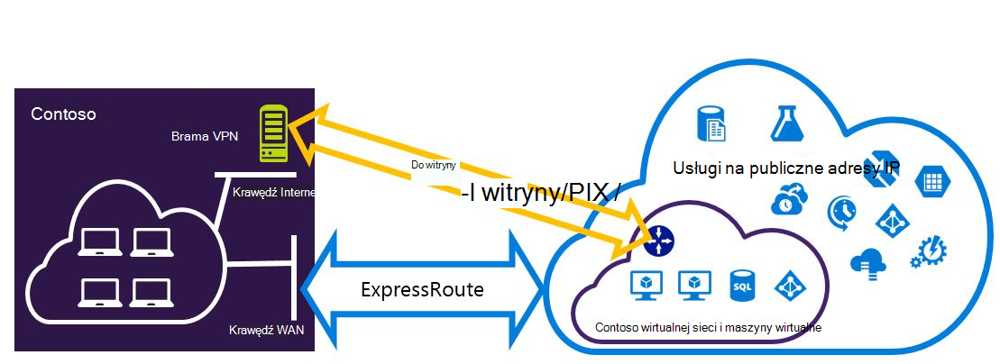
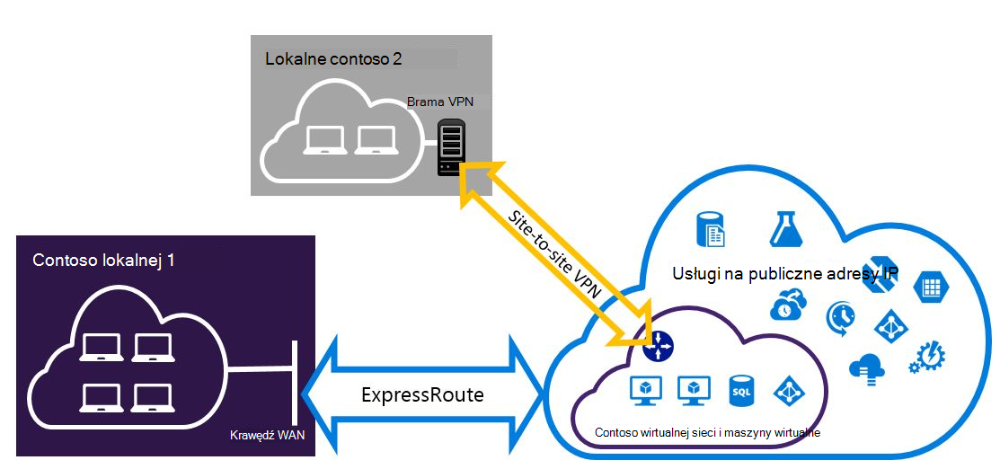

<properties
   pageTitle="Konfigurowanie połączenia VPN Expressroute i witryny do witryny, które mogą występować | Microsoft Azure"
   description="W tym artykule opisano konfigurowanie ExpressRoute i połączenie VPN witryny do witryny, które mogą występować modelu Klasyczny wdrożenia."
   documentationCenter="na"
   services="expressroute"
   authors="charwen"
   manager="carmonm"
   editor=""
   tags="azure-service-management"/>
<tags
   ms.service="expressroute"
   ms.devlang="na"
   ms.topic="get-started-article"
   ms.tgt_pltfrm="na"
   ms.workload="infrastructure-services"
   ms.date="10/10/2016"
   ms.author="charwen"/>

# Konfigurowanie witryny do witryny i ExpressRoute połączeń współistnienia modelu Klasyczny wdrożenia

> [AZURE.SELECTOR]
- [PowerShell — Menedżera zasobów](expressroute-howto-coexist-resource-manager.md)
- [PowerShell — klasyczny](expressroute-howto-coexist-classic.md)

Przechowywanie możliwość konfigurowania witryny do witryny sieci VPN i ExpressRoute ma wiele zalet. Konfigurowanie sieci VPN witryny do witryny jako ścieżkę bezpieczny pracy awaryjnej dla ExressRoute lub nawiązywanie połączenia z witryn, które nie są połączone za pośrednictwem ExpressRoute za pomocą sieci VPN witryny do witryny. Omówimy następujące zagadnienia czynności, aby skonfigurować obu przypadkach w tym artykule. Ten artykuł dotyczy modelu Klasyczny wdrożenia. Ta konfiguracja nie jest dostępna w portalu.

**Informacje dotyczące modeli Azure wdrażania**

[AZURE.INCLUDE [vpn-gateway-clasic-rm](../../includes/vpn-gateway-classic-rm-include.md)] 

>[AZURE.IMPORTANT] Obwody ExpressRoute musi być wstępnie skonfigurowany, przed wykonaj poniższe instrukcje. Upewnij się, że nawiązano przewodniki, aby [utworzyć obwód ExpressRoute](expressroute-howto-circuit-classic.md) i [Konfigurowanie routingu](expressroute-howto-routing-classic.md) przed wykonaj poniższe czynności.

## Ograniczenia i limity

- **Routing przewozowe nie jest obsługiwany.** Nie można kierować (za pośrednictwem Azure) między sieci lokalnej połączonych za pomocą sieci VPN witryny do witryny i sieci lokalnej połączonych za pomocą ExpressRoute.
- **Punkt do witryny nie jest obsługiwane.** Nie można włączyć połączenia VPN punktu do witryny z tym samym VNet, który jest powiązany z ExpressRoute. Punkt do witryny sieci VPN i ExpressRoute nie mogą występować na tym samym VNet.
- **Nie można włączyć wymuszonego tunelowania sieci witryny do witryny.** Możesz tylko "wymusić" cały ruch Internet powiązanych z powrotem do sieci lokalnej za pośrednictwem ExpressRoute.
- **Podstawowa jednostka SKU bramy nie jest obsługiwane.** Dla [bramy ExpressRoute](expressroute-about-virtual-network-gateways.md) i [bramy sieci VPN](../vpn-gateway/vpn-gateway-about-vpngateways.md), należy użyć bramy nie — podstawowa jednostka SKU.
- **Tylko oparte na rozsyłania Brama VPN jest obsługiwana.** Należy użyć oparte na rozsyłania [Brama VPN](../vpn-gateway/vpn-gateway-about-vpngateways.md).
- **Trasa statyczna należy skonfigurować dla bramy sieci VPN.** Jeśli sieci lokalnej jest podłączone do ExpressRoute i VPN witryny do witryny, musisz mieć trasę statyczną skonfigurowane w Twojej sieci lokalnej, aby skierować połączenie VPN witryny do witryny do publicznego Internetu.
- **Najpierw należy skonfigurować ExpressRoute bramy.** Musisz najpierw utworzyć bramy ExpressRoute przed dodaniem Brama VPN witryny do witryny.

## Projekty konfiguracji

### Konfigurowanie sieci VPN witryny do witryny jako ścieżkę pracy awaryjnej dla ExpressRoute

Dla ExpressRoute, można skonfigurować połączenie VPN witryny do witryny jako kopii zapasowej. Dotyczy tylko wirtualnych sieci połączone z ścieżce Azure peering prywatne. Ma rozwiązania opartego na sieci VPN pracy awaryjnej usługi jest dostępne za pośrednictwem Azure publicznej i peerings firmy Microsoft. Obwód ExpressRoute jest zawsze łącze podstawowe. Dane będzie przepływał przez ścieżkę VPN witryny do witryny tylko wtedy, gdy elektrycznego ExpressRoute kończy się niepowodzeniem. 

### Konfigurowanie sieci VPN witryny do witryny, aby nawiązać połączenie witryny nie jest połączony za pośrednictwem ExpressRoute

Aby skonfigurować sieć miejsce, w którym niektóre witryny Podłączanie bezpośrednio do Azure VPN witryny do witryny, a niektóre witryny nawiąż połączenie za pomocą ExpressRoute. 

>[AZURE.NOTE] Konfigurowanie sieci wirtualnej nie można jako router przewozowe.

## Wybieranie czynności, aby użyć

Istnieją dwa różne zestawy procedur, aby wybrać w celu skonfigurowania połączenia, które mogą występować. Procedury konfiguracji wybranej zależy od tego, czy masz istniejące sieci wirtualnej, który chcesz się połączyć lub chcesz utworzyć nowy wirtualnej sieci.

- Nie masz VNet i musisz tworzyć.
    
    Jeśli nie masz jeszcze wirtualnej sieci, ta procedura przeprowadzi Cię przez utworzenie nowego wirtualnej sieci przy użyciu modelu Klasyczny wdrożenia oraz tworzenie nowych połączeń VPN ExpressRoute i witryny do witryny. Aby skonfigurować, wykonaj czynności opisane w sekcji artykułu, [Aby utworzyć nowy wirtualnej sieci i współistnienia połączenia](#new).

- Mam już modelu Klasyczny wdrożenia VNet.

    Wirtualna sieć może być już w miejscu za pomocą istniejącego połączenia VPN witryny do witryny lub ExpressRoute połączenie. [Do konfigurowania połączeń coexsiting dla istniejących VNet](#add) sekcji artykuł prowadzi użytkownika przez proces usuwania bramy, a następnie utworzyć nowe połączenia VPN ExpressRoute i witryny do witryny. Należy zauważyć, że podczas tworzenia nowych połączeń, trzeba wykonać czynności w bardzo określonej kolejności. Nie, wykonaj instrukcje w inne artykuły Tworzenie połączenia i bramy.

    W tej procedurze tworzenie połączeń, które mogą występować będzie trzeba usunąć Centrum, a następnie skonfiguruj nowe bramy. Oznacza to, że usunięcie i ponowne utworzenie połączenia i bramy, ale nie muszą przeprowadzić migrację dowolną maszyny wirtualne lub usług do nowego wirtualnej sieci uzyskuje przestoje połączenia między lokalnej. Twoje maszyny wirtualne i usługi nadal będą mogły komunikować się za pośrednictwem usługi równoważenia obciążenia podczas konfigurowania usługi bramy, jeśli są one skonfigurowane w tym celu.

## Aby utworzyć nowy wirtualnej sieci i współistnienia połączenia

Ta procedura będzie przeprowadził Cię przez proces tworzenia VNet i tworzenie witryny do witryny i połączeń ExpressRoute, które będą występować.

1. Musisz zainstalować najnowszą wersję programu PowerShell Azure poleceń cmdlet. Aby uzyskać więcej informacji o instalowaniu poleceń cmdlet programu PowerShell, zobacz [jak zainstalować i skonfigurować Azure programu PowerShell](../powershell-install-configure.md) . Należy zauważyć, że polecenia cmdlet, który ma być używany dla tej konfiguracji mogą być nieco inne niż co może się zapoznanie się z. Należy użyć poleceń cmdlet określone w tych instrukcjach. 

2. Utwórz schemat wirtualnej sieci. Aby uzyskać więcej informacji o schemacie konfiguracji zobacz [Schemat konfiguracji Azure wirtualną sieć](https://msdn.microsoft.com/library/azure/jj157100.aspx).

    Po utworzeniu schematu, upewnij się, że korzystasz z następujących wartości:

    - Podsieć bramy wirtualną sieć musi być /27 lub krótszy czas prefiks (na przykład /26 lub /25).
    - Typ połączenia bramy jest "przydzielane".

              <VirtualNetworkSite name="MyAzureVNET" Location="Central US">
                <AddressSpace>
                  <AddressPrefix>10.17.159.192/26</AddressPrefix>
                </AddressSpace>
                <Subnets>
                  <Subnet name="Subnet-1">
                    <AddressPrefix>10.17.159.192/27</AddressPrefix>
                  </Subnet>
                  <Subnet name="GatewaySubnet">
                    <AddressPrefix>10.17.159.224/27</AddressPrefix>
                  </Subnet>
                </Subnets>
                <Gateway>
                  <ConnectionsToLocalNetwork>
                    <LocalNetworkSiteRef name="MyLocalNetwork">
                      <Connection type="Dedicated" />
                    </LocalNetworkSiteRef>
                  </ConnectionsToLocalNetwork>
                </Gateway>
              </VirtualNetworkSite>

3. Po utworzeniu i konfigurowanie pliku schematu xml, Przekaż plik. Spowoduje to utworzenie wirtualnej sieci.

    Następujące polecenie cmdlet umożliwia przekazywanie pliku, zamieniając wartość na własny.

        Set-AzureVNetConfig -ConfigurationPath 'C:\NetworkConfig.xml'

4. Tworzenie bramy ExpressRoute. Pamiętaj określić GatewaySKU jako *Standardowy*, *o odwróconej*lub *UltraPerformance* i GatewayType jako *DynamicRouting*.

    Za pomocą Poniższy przykładowy podstawianie własne wartości.

        New-AzureVNetGateway -VNetName MyAzureVNET -GatewayType DynamicRouting -GatewaySKU HighPerformance

5. Łącze bramy ExpressRoute z obwodem ExpressRoute. Po wykonaniu tego kroku nawiązano połączenie między sieci lokalnej i Azure za pomocą ExpressRoute.

        New-AzureDedicatedCircuitLink -ServiceKey <service-key> -VNetName MyAzureVNET

6. Następnie należy utworzyć bramy sieci VPN witryny do witryny. GatewaySKU musi być *Standardowy*, *o odwróconej*lub *UltraPerformance* i GatewayType muszą być *DynamicRouting*.

        New-AzureVirtualNetworkGateway -VNetName MyAzureVNET -GatewayName S2SVPN -GatewayType DynamicRouting -GatewaySKU  HighPerformance

    Aby pobrać ustawienia bramy wirtualnej sieci, w tym identyfikator bramy i publiczny adres IP, należy użyć `Get-AzureVirtualNetworkGateway` polecenia cmdlet.

        Get-AzureVirtualNetworkGateway

        GatewayId            : 348ae011-ffa9-4add-b530-7cb30010565e
        GatewayName          : S2SVPN
        LastEventData        :
        GatewayType          : DynamicRouting
        LastEventTimeStamp   : 5/29/2015 4:41:41 PM
        LastEventMessage     : Successfully created a gateway for the following virtual network: GNSDesMoines
        LastEventID          : 23002
        State                : Provisioned
        VIPAddress           : 104.43.x.y
        DefaultSite          :
        GatewaySKU           : HighPerformance
        Location             :
        VnetId               : 979aabcf-e47f-4136-ab9b-b4780c1e1bd5
        SubnetId             :
        EnableBgp            : False
        OperationDescription : Get-AzureVirtualNetworkGateway
        OperationId          : 42773656-85e1-a6b6-8705-35473f1e6f6a
        OperationStatus      : Succeeded

7. Tworzenie lokalnej witryny sieci VPN brama jednostki. To polecenie nie Konfigurowanie bramy sieci VPN lokalnego. Zamiast umożliwia należy podać ustawienia bramy lokalnej, takie jak publiczny adres IP i lokalnych adresów spacji, tak, aby brama Azure VPN można się z nim połączyć.

    >[AZURE.IMPORTANT] Lokalne witryny wirtualnej sieci prywatnej witryny do witryny nie jest zdefiniowana w netcfg. Zamiast tego należy użyć tego polecenia cmdlet, aby określić parametry lokalnej witryny. Nie można zdefiniować za pomocą portalu lub pliku netcfg.

    Za pomocą następujących próbki, zamieniając wartości na własny.

        New-AzureLocalNetworkGateway -GatewayName MyLocalNetwork -IpAddress <MyLocalGatewayIp> -AddressSpace <MyLocalNetworkAddress>

    > [AZURE.NOTE] Jeśli w Twojej sieci lokalnej jest wielu przekierowuje, można przekazać ich w postaci tablicy.  $MyLocalNetworkAddress =@("10.1.2.0/24","10.1.3.0/24","10.2.1.0/24")  

    Aby pobrać ustawienia bramy wirtualnej sieci, w tym identyfikator bramy i publiczny adres IP, należy użyć `Get-AzureVirtualNetworkGateway` polecenia cmdlet. Zobacz przykład poniżej.

        Get-AzureLocalNetworkGateway

        GatewayId            : 532cb428-8c8c-4596-9a4f-7ae3a9fcd01b
        GatewayName          : MyLocalNetwork
        IpAddress            : 23.39.x.y
        AddressSpace         : {10.1.2.0/24}
        OperationDescription : Get-AzureLocalNetworkGateway
        OperationId          : ddc4bfae-502c-adc7-bd7d-1efbc00b3fe5
        OperationStatus      : Succeeded

8. Konfigurowanie urządzenia lokalne VPN nawiązać Nowa brama. Skorzystaj z informacji, którego został pobrany w kroku 6, podczas konfigurowania urządzenia VPN. Aby uzyskać więcej informacji na temat konfiguracji sieci VPN urządzenia zobacz [Konfiguracja urządzenia VPN](../vpn-gateway/vpn-gateway-about-vpn-devices.md).

9. Brama VPN witryny do witryny Azure łącze do bramy lokalnej.

    W tym przykładzie connectedEntityId jest identyfikator bramy lokalnej, który można znaleźć, uruchamiając `Get-AzureLocalNetworkGateway`. Możesz znaleźć virtualNetworkGatewayId przy użyciu `Get-AzureVirtualNetworkGateway` polecenia cmdlet. Po wykonaniu tego kroku nawiązaniu połączenia między sieci lokalnej i Azure za pośrednictwem połączenia VPN witryny do witryny.

        New-AzureVirtualNetworkGatewayConnection -connectedEntityId <local-network-gateway-id> -gatewayConnectionName Azure2Local -gatewayConnectionType IPsec -sharedKey abc123 -virtualNetworkGatewayId <azure-s2s-vpn-gateway-id>

## Aby skonfigurować połączenia coexsiting dla istniejących VNet

Jeśli masz istniejące wirtualnej sieci, sprawdź rozmiar podsieci bramy. W przypadku podsieci bramy /28 lub /29, możesz usunąć bramę wirtualnej sieci i zwiększanie rozmiaru podsieci bramy. Czynności opisane w tej sekcji procedurach pokazano, jak to zrobić.

Jeśli podsieć bramy jest /27 lub większą wirtualną sieć jest połączony za pośrednictwem ExpressRoute, możesz pominąć kroki i przejdź do ["Krok 6 — Tworzenie bramy VPN witryny do witryny"](#vpngw) w poprzedniej sekcji.

>[AZURE.NOTE] Po usunięciu istniejącego bramy swojej siedzibie lokalnych zostaną utracone połączenia wirtualnej sieci podczas pracy w tej konfiguracji.

1. Musisz zainstalować najnowszą wersję programu PowerShell Menedżera zasobów Azure poleceń cmdlet. Aby uzyskać więcej informacji o instalowaniu poleceń cmdlet programu PowerShell, zobacz [jak zainstalować i skonfigurować Azure programu PowerShell](../powershell-install-configure.md) . Należy zauważyć, że polecenia cmdlet, który ma być używany dla tej konfiguracji mogą być nieco inne niż co może się zapoznanie się z. Należy użyć poleceń cmdlet określone w tych instrukcjach. 

2. Usuń istniejące bramy ExpressRoute lub VPN witryny do witryny. Użyj następującego polecenia cmdlet, zamieniając wartości na własny.

        Remove-AzureVNetGateway –VnetName MyAzureVNET

3. Eksportowanie schematu wirtualnej sieci. Użyj następującego polecenia cmdlet programu PowerShell, zamieniając wartości na własny.

        Get-AzureVNetConfig –ExportToFile “C:\NetworkConfig.xml”

4. Edytuj schemat pliku konfiguracji sieci tak, aby podsieć bramy jest /27 lub krótszy czas prefiks (na przykład /26 lub /25). Zobacz przykład poniżej. 
>[AZURE.NOTE] Jeśli nie masz za mało adresów IP w sieci wirtualnej, aby zwiększyć rozmiar podsieci bramy w lewo, musisz dodać więcej przestrzeni adresów IP. Aby uzyskać więcej informacji o schemacie konfiguracji zobacz [Schemat konfiguracji Azure wirtualną sieć](https://msdn.microsoft.com/library/azure/jj157100.aspx).

          <Subnet name="GatewaySubnet">
            <AddressPrefix>10.17.159.224/27</AddressPrefix>
          </Subnet>

5. Jeśli poprzedniego Centrum sieci VPN witryny do witryny, możesz również zmienić typ połączenia do **Dedicated**.

                 <Gateway>
                  <ConnectionsToLocalNetwork>
                    <LocalNetworkSiteRef name="MyLocalNetwork">
                      <Connection type="Dedicated" />
                    </LocalNetworkSiteRef>
                  </ConnectionsToLocalNetwork>
                </Gateway>

6. W tym momencie będą dostępne VNet z nie bramy. Aby utworzyć nowy bram i ukończyć połączenia, może kontynuować [Krok 4 — Tworzenie bramy ExpressRoute](#gw), dostępny w poprzednim zestawu czynności.

## Następne kroki

Aby uzyskać więcej informacji na temat ExpressRoute zobacz [ExpressRoute — często zadawane pytania](expressroute-faqs.md)
