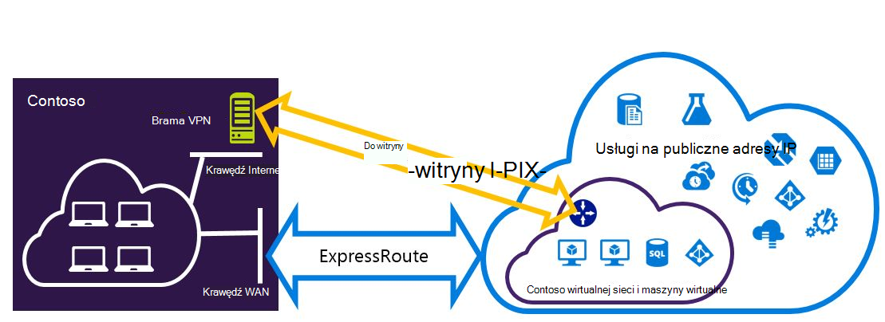
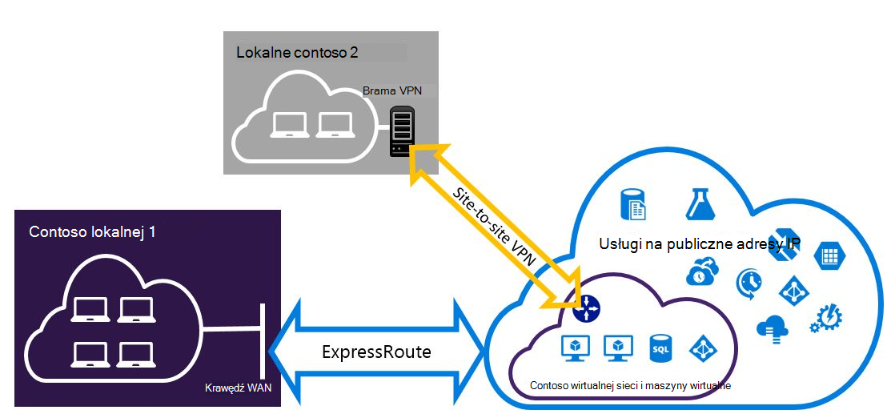

<properties
   pageTitle="Konfigurowanie połączeń VPN Expressroute i witryny do witryny, które mogą występować modelu wdrożenia Menedżera zasobów | Microsoft Azure"
   description="W tym artykule opisano konfigurowanie ExpressRoute i połączenie VPN witryny do witryny, które mogą występować modelu Menedżera zasobów."
   documentationCenter="na"
   services="expressroute"
   authors="charwen"
   manager="carmonm"
   editor=""
   tags="azure-resource-manager"/>
<tags
   ms.service="expressroute"
   ms.devlang="na"
   ms.topic="get-started-article"
   ms.tgt_pltfrm="na"
   ms.workload="infrastructure-services"
   ms.date="10/10/2016"
   ms.author="charleywen"/>

# Konfigurowanie witryny do witryny i ExpressRoute połączeń współistnienia modelu wdrożenia Menedżera zasobów

> [AZURE.SELECTOR]
- [PowerShell — Menedżera zasobów](expressroute-howto-coexist-resource-manager.md)
- [PowerShell — klasyczny](expressroute-howto-coexist-classic.md)

Przechowywanie możliwość konfigurowania witryny do witryny sieci VPN i ExpressRoute ma wiele zalet. Konfigurowanie sieci VPN witryny do witryny jako ścieżkę bezpieczny pracy awaryjnej dla ExressRoute lub nawiązywanie połączenia z witryn, które nie są połączone za pośrednictwem ExpressRoute za pomocą sieci VPN witryny do witryny. Omówimy następujące zagadnienia czynności, aby skonfigurować obu przypadkach w tym artykule. Ten artykuł dotyczy model wdrożenia Menedżera zasobów. Ta konfiguracja nie jest dostępna w portalu Azure.

**Informacje dotyczące modeli Azure wdrażania**

[AZURE.INCLUDE [vpn-gateway-clasic-rm](../../includes/vpn-gateway-classic-rm-include.md)] 

>[AZURE.IMPORTANT] Obwody ExpressRoute musi być wstępnie skonfigurowany, przed wykonaj poniższe instrukcje. Upewnij się, że nawiązano przewodniki, aby [utworzyć obwód ExpressRoute](expressroute-howto-circuit-arm.md) i [Konfigurowanie routingu](expressroute-howto-routing-arm.md) przed wykonaj poniższe czynności.

## Ograniczenia i limity

- **Routing przewozowe nie jest obsługiwany.** Nie można kierować (za pośrednictwem Azure) między sieci lokalnej połączonych za pomocą sieci VPN witryny do witryny i sieci lokalnej połączonych za pomocą ExpressRoute.
- **Podstawowa jednostka SKU bramy nie jest obsługiwane.** Dla [bramy ExpressRoute](expressroute-about-virtual-network-gateways.md) i [bramy sieci VPN](../vpn-gateway/vpn-gateway-about-vpngateways.md), należy użyć bramy nie — podstawowa jednostka SKU.
- **Tylko oparte na rozsyłania Brama VPN jest obsługiwana.** Należy użyć oparte na rozsyłania [Brama VPN](../vpn-gateway/vpn-gateway-about-vpngateways.md).
- **Trasa statyczna należy skonfigurować dla bramy sieci VPN.** Jeśli sieci lokalnej jest podłączone do ExpressRoute i VPN witryny do witryny, musisz mieć trasę statyczną skonfigurowane w Twojej sieci lokalnej, aby skierować połączenie VPN witryny do witryny do publicznego Internetu.
- **Najpierw należy skonfigurować ExpressRoute bramy.** Musisz najpierw utworzyć bramy ExpressRoute przed dodaniem Brama VPN witryny do witryny.

## Projekty konfiguracji

### Konfigurowanie sieci VPN witryny do witryny jako ścieżkę pracy awaryjnej dla ExpressRoute

Dla ExpressRoute, można skonfigurować połączenie VPN witryny do witryny jako kopii zapasowej. Dotyczy tylko wirtualnych sieci połączone z ścieżce Azure peering prywatne. Ma rozwiązania opartego na sieci VPN pracy awaryjnej usługi jest dostępne za pośrednictwem Azure publicznej i peerings firmy Microsoft. Obwód ExpressRoute jest zawsze łącze podstawowe. Dane będzie przepływał przez ścieżkę VPN witryny do witryny tylko wtedy, gdy elektrycznego ExpressRoute kończy się niepowodzeniem.
>[AZURE.NOTE] Gdy elektrycznego ExpressRoute przekracza własną VPN witryny do witryny po obu przekierowuje są takie same, Azure przy użyciu dopasowania prefiks longuest Wybieranie trasy do miejsca docelowego pakietu.

### Konfigurowanie sieci VPN witryny do witryny, aby nawiązać połączenie witryny nie jest połączony za pośrednictwem ExpressRoute

Aby skonfigurować sieć miejsce, w którym niektóre witryny Podłączanie bezpośrednio do Azure VPN witryny do witryny, a niektóre witryny nawiąż połączenie za pomocą ExpressRoute. 

>[AZURE.NOTE] Konfigurowanie sieci wirtualnej nie można jako router przewozowe.

## Wybieranie czynności, aby użyć

Istnieją dwa różne zestawy procedur, aby wybrać w celu skonfigurowania połączenia, które mogą występować. Procedury konfiguracji wybranej zależy od tego, czy masz istniejące sieci wirtualnej, który chcesz się połączyć lub chcesz utworzyć nowy wirtualnej sieci.

- Nie masz VNet i musisz tworzyć.
    
    Jeśli nie masz jeszcze wirtualną sieć, ta procedura przeprowadzi Cię przez utworzenie nowego wirtualnej sieci przy użyciu modelu wdrożenia Menedżera zasobów i tworzenie nowego połączenia VPN ExpressRoute i witryny do witryny. Aby skonfigurować, wykonaj czynności opisane w sekcji artykułu, [Aby utworzyć nowy wirtualnej sieci i współistnienia połączenia](#new).

- Mam już model wdrożenia Menedżera zasobów VNet.

    Wirtualna sieć może być już w miejscu za pomocą istniejącego połączenia VPN witryny do witryny lub ExpressRoute połączenie. [Konfigurowanie połączeń coexsiting dla istniejących VNet](#add) sekcji prowadzi użytkownika przez proces usuwania bramy, a następnie utworzyć nowe połączenia VPN ExpressRoute i witryny do witryny. Należy zauważyć, że podczas tworzenia nowych połączeń, trzeba wykonać czynności w bardzo określonej kolejności. Nie, wykonaj instrukcje w inne artykuły Tworzenie połączenia i bramy.

    W tej procedurze tworzenie połączeń, które mogą występować będzie trzeba usunąć Centrum, a następnie skonfiguruj nowe bramy. Oznacza to, że usunięcie i ponowne utworzenie połączenia i bramy, ale nie muszą przeprowadzić migrację dowolną maszyny wirtualne lub usług do nowego wirtualnej sieci uzyskuje przestoje połączenia między lokalnej. Twoje maszyny wirtualne i usługi nadal będą mogły komunikować się za pośrednictwem usługi równoważenia obciążenia podczas konfigurowania usługi bramy, jeśli są one skonfigurowane w tym celu.

## Aby utworzyć nowy wirtualnej sieci i współistnienia połączenia

Ta procedura będzie przeprowadził Cię przez proces tworzenia VNet i tworzenie witryny do witryny i połączeń ExpressRoute, które będą występować.
    
1. Musisz zainstalować najnowszą wersję programu PowerShell Azure poleceń cmdlet. Aby uzyskać więcej informacji o instalowaniu poleceń cmdlet programu PowerShell, zobacz [jak zainstalować i skonfigurować Azure programu PowerShell](../powershell-install-configure.md) . Należy zauważyć, że polecenia cmdlet, który ma być używany dla tej konfiguracji mogą być nieco inne niż co może się zapoznanie się z. Należy użyć poleceń cmdlet określone w tych instrukcjach.

2. Zaloguj się do konta i konfigurowania środowiska.
    
        login-AzureRmAccount
        Select-AzureRmSubscription -SubscriptionName 'yoursubscription'
        $location = "Central US"
        $resgrp = New-AzureRmResourceGroup -Name "ErVpnCoex" -Location $location

3. Tworzenie wirtualnych sieci, w tym podsieci bramy. Aby uzyskać więcej informacji na temat konfiguracji sieci wirtualnych zobacz [Konfiguracja Azure wirtualnej sieci](../virtual-network/virtual-networks-create-vnet-arm-ps.md).

    >[AZURE.IMPORTANT] Podsieć bramy musi być /27 lub krótszy czas prefiks (na przykład /26 lub /25).
    
    Tworzenie nowego VNet.

        $vnet = New-AzureRmVirtualNetwork -Name "CoexVnet" -ResourceGroupName $resgrp.ResourceGroupName -Location $location -AddressPrefix "10.200.0.0/16" 

    Dodawanie podsieci.

        Add-AzureRmVirtualNetworkSubnetConfig -Name "App" -VirtualNetwork $vnet -AddressPrefix "10.200.1.0/24"
        Add-AzureRmVirtualNetworkSubnetConfig -Name "GatewaySubnet" -VirtualNetwork $vnet -AddressPrefix "10.200.255.0/24"

    Zapisywanie konfiguracji VNet.

        $vnet = Set-AzureRmVirtualNetwork -VirtualNetwork $vnet

4. Tworzenie bramy ExpressRoute. Aby uzyskać więcej informacji na temat konfiguracji bramy ExpressRoute zobacz [ExpressRoute konfiguracji bramy](expressroute-howto-add-gateway-resource-manager.md). GatewaySKU musi być *Standardowy*, *o odwróconej*lub *UltraPerformance*.

        $gwSubnet = Get-AzureRmVirtualNetworkSubnetConfig -Name "GatewaySubnet" -VirtualNetwork $vnet
        $gwIP = New-AzureRmPublicIpAddress -Name "ERGatewayIP" -ResourceGroupName $resgrp.ResourceGroupName -Location $location -AllocationMethod Dynamic
        $gwConfig = New-AzureRmVirtualNetworkGatewayIpConfig -Name "ERGatewayIpConfig" -SubnetId $gwSubnet.Id -PublicIpAddressId $gwIP.Id
        $gw = New-AzureRmVirtualNetworkGateway -Name "ERGateway" -ResourceGroupName $resgrp.ResourceGroupName -Location $location -IpConfigurations $gwConfig -GatewayType "ExpressRoute" -GatewaySku Standard 

5. Łącze bramy ExpressRoute z obwodem ExpressRoute. Po wykonaniu tego kroku nawiązano połączenie między sieci lokalnej i Azure za pomocą ExpressRoute. Aby uzyskać więcej informacji o operacji łączenia zobacz [Łącze VNets do ExpressRoute](expressroute-howto-linkvnet-arm.md).

        $ckt = Get-AzureRmExpressRouteCircuit -Name "YourCircuit" -ResourceGroupName "YourCircuitResourceGroup"
        New-AzureRmVirtualNetworkGatewayConnection -Name "ERConnection" -ResourceGroupName $resgrp.ResourceGroupName -Location $location -VirtualNetworkGateway1 $gw -PeerId $ckt.Id -ConnectionType ExpressRoute

6. Następnie należy utworzyć bramy sieci VPN witryny do witryny. Aby uzyskać więcej informacji na temat konfiguracji bramy sieci VPN zobacz [Konfigurowanie VNet z połączeniem witryny do witryny](../vpn-gateway/vpn-gateway-create-site-to-site-rm-powershell.md). GatewaySKU musi być *Standardowy*, *o odwróconej*lub *UltraPerformance*. VpnType musi być *RouteBased*.

        $gwSubnet = Get-AzureRmVirtualNetworkSubnetConfig -Name "GatewaySubnet" -VirtualNetwork $vnet
        $gwIP = New-AzureRmPublicIpAddress -Name "VPNGatewayIP" -ResourceGroupName $resgrp.ResourceGroupName -Location $location -AllocationMethod Dynamic
        $gwConfig = New-AzureRmVirtualNetworkGatewayIpConfig -Name "VPNGatewayIpConfig" -SubnetId $gwSubnet.Id -PublicIpAddressId $gwIP.Id
        New-AzureRmVirtualNetworkGateway -Name "VPNGateway" -ResourceGroupName $resgrp.ResourceGroupName -Location $location -IpConfigurations $gwConfig -GatewayType "Vpn" -VpnType "RouteBased" -GatewaySku "Standard"

    Azure Brama VPN obsługuje BGP. Możesz określić - EnableBgp w następujące polecenie.

        $azureVpn = New-AzureRmVirtualNetworkGateway -Name "VPNGateway" -ResourceGroupName $resgrp.ResourceGroupName -Location $location -IpConfigurations $gwConfig -GatewayType "Vpn" -VpnType "RouteBased" -GatewaySku "Standard" -EnableBgp $true

    Można znaleźć BGP zaglądanie IP i liczba w korzystającego z Azure bramy sieci VPN w $azureVpn.BgpSettings.BgpPeeringAddress i $azureVpn.BgpSettings.Asn. Aby uzyskać więcej informacji zobacz [Konfigurowanie BGP](../vpn-gateway/vpn-gateway-bgp-resource-manager-ps.md) bramy sieci VPN Azure.

7. Tworzenie lokalnej witryny sieci VPN brama jednostki. To polecenie nie Konfigurowanie bramy sieci VPN lokalnego. Zamiast umożliwia należy podać ustawienia bramy lokalnej, takie jak publiczny adres IP i lokalnych adresów spacji, tak, aby brama Azure VPN można się z nim połączyć.

    Jeśli urządzenia lokalne sieci VPN obsługuje tylko routing statyczny, można skonfigurować trasy statyczne w następujący sposób.

        $MyLocalNetworkAddress = @("10.100.0.0/16","10.101.0.0/16","10.102.0.0/16")
        $localVpn = New-AzureRmLocalNetworkGateway -Name "LocalVPNGateway" -ResourceGroupName $resgrp.ResourceGroupName -Location $location -GatewayIpAddress *<Public IP>* -AddressPrefix $MyLocalNetworkAddress

    Jeśli chcesz włączyć routing dynamiczny lokalne urządzenie VPN obsługuje BGP, należy wiedzieć BGP zaglądanie IP i liczba w korzystającego z urządzenia lokalne sieci VPN.

        $localVPNPublicIP = "<Public IP>"
        $localBGPPeeringIP = "<Private IP for the BGP session>"
        $localBGPASN = "<ASN>"
        $localAddressPrefix = $localBGPPeeringIP + "/32"
        $localVpn = New-AzureRmLocalNetworkGateway -Name "LocalVPNGateway" -ResourceGroupName $resgrp.ResourceGroupName -Location $location -GatewayIpAddress $localVPNPublicIP -AddressPrefix $localAddressPrefix -BgpPeeringAddress $localBGPPeeringIP -Asn $localBGPASN

8. Konfigurowanie urządzenia lokalne VPN nawiązać Nowa brama Azure VPN. Aby uzyskać więcej informacji na temat konfiguracji sieci VPN urządzenia zobacz [Konfiguracja urządzenia VPN](../vpn-gateway/vpn-gateway-about-vpn-devices.md).

9. Brama VPN witryny do witryny Azure łącze do bramy lokalnej.

        $azureVpn = Get-AzureRmVirtualNetworkGateway -Name "VPNGateway" -ResourceGroupName $resgrp.ResourceGroupName
        New-AzureRmVirtualNetworkGatewayConnection -Name "VPNConnection" -ResourceGroupName $resgrp.ResourceGroupName -Location $location -VirtualNetworkGateway1 $azureVpn -LocalNetworkGateway2 $localVpn -ConnectionType IPsec -SharedKey <yourkey>

## Aby skonfigurować połączenia coexsiting dla istniejących VNet

Jeśli masz istniejące wirtualnej sieci, sprawdź rozmiar podsieci bramy. W przypadku podsieci bramy /28 lub /29, możesz usunąć bramę wirtualnej sieci i zwiększanie rozmiaru podsieci bramy. Czynności opisane w tej sekcji procedurach pokazano, jak to zrobić.

Jeśli podsieć bramy jest /27 lub większą wirtualną sieć jest połączony za pośrednictwem ExpressRoute, możesz pominąć kroki i przejdź do ["Krok 6 — Tworzenie bramy VPN witryny do witryny"](#vpngw) w poprzedniej sekcji. 

>[AZURE.NOTE] Po usunięciu istniejącego bramy swojej siedzibie lokalnych zostaną utracone połączenia wirtualnej sieci podczas pracy w tej konfiguracji. 

1. Musisz zainstalować najnowszą wersję programu PowerShell Azure poleceń cmdlet. Aby uzyskać więcej informacji o instalowaniu poleceń cmdlet programu PowerShell, zobacz [jak zainstalować i skonfigurować Azure programu PowerShell](../powershell-install-configure.md) . Należy zauważyć, że polecenia cmdlet, który ma być używany dla tej konfiguracji mogą być nieco inne niż co może się zapoznanie się z. Należy użyć poleceń cmdlet określone w tych instrukcjach. 

2. Usuń istniejące bramy ExpressRoute lub VPN witryny do witryny. 

        Remove-AzureRmVirtualNetworkGateway -Name <yourgatewayname> -ResourceGroupName <yourresourcegroup>

3. Usuwanie podsieci bramy.
        
        $vnet = Get-AzureRmVirtualNetwork -Name <yourvnetname> -ResourceGroupName <yourresourcegroup> 
        Remove-AzureRmVirtualNetworkSubnetConfig -Name GatewaySubnet -VirtualNetwork $vnet

4. Dodawanie podsieci bramy, która jest /27 lub większej.
    >[AZURE.NOTE] Jeśli nie masz za mało adresów IP w sieci wirtualnej, aby zwiększyć rozmiar podsieci bramy w lewo, musisz dodać więcej przestrzeni adresów IP.

        $vnet = Get-AzureRmVirtualNetwork -Name <yourvnetname> -ResourceGroupName <yourresourcegroup>
        Add-AzureRmVirtualNetworkSubnetConfig -Name "GatewaySubnet" -VirtualNetwork $vnet -AddressPrefix "10.200.255.0/24"

    Zapisywanie konfiguracji VNet.

        $vnet = Set-AzureRmVirtualNetwork -VirtualNetwork $vnet

5. W tym momencie będą dostępne VNet z nie bramy. Aby utworzyć nowy bram i ukończyć połączenia, może kontynuować [Krok 4 — Tworzenie bramy ExpressRoute](#gw), dostępny w poprzednim zestawu czynności.

## Aby dodać konfigurację punktu do witryny do bramy sieci VPN
Aby wykonać poniższe czynności, aby dodać punkt do witryny konfiguracji do bramy sieci VPN, w ustawieniach współistnienie.

1. Dodawanie puli adresów klienta VPN. 

        $azureVpn = Get-AzureRmVirtualNetworkGateway -Name "VPNGateway" -ResourceGroupName $resgrp.ResourceGroupName
        Set-AzureRmVirtualNetworkGatewayVpnClientConfig -VirtualNetworkGateway $azureVpn -VpnClientAddressPool "10.251.251.0/24"

2. Przekaż certyfikat główny VPN Azure dla bramy sieci VPN. W tym przykładzie zakłada się, że certyfikat główny są przechowywane na komputerze lokalnym, gdzie uruchom następujące polecenia cmdlet programu PowerShell. 

        $p2sCertFullName = "RootErVpnCoexP2S.cer"
        $p2sCertMatchName = "RootErVpnCoexP2S"
        $p2sCertToUpload=get-childitem Cert:\CurrentUser\My | Where-Object {$_.Subject -match $p2sCertMatchName}
        if ($p2sCertToUpload.count -eq 1){
            write-host "cert found"
        } else {
            write-host "cert not found"
            exit
        } 
        $p2sCertData = [System.Convert]::ToBase64String($p2sCertToUpload.RawData)
        Add-AzureRmVpnClientRootCertificate -VpnClientRootCertificateName $p2sCertFullName -VirtualNetworkGatewayname $azureVpn.Name -ResourceGroupName $resgrp.ResourceGroupName -PublicCertData $p2sCertData

Aby uzyskać więcej informacji na VPN punktu do witryny zobacz [Konfigurowanie połączenia punkt do witryny](../vpn-gateway/vpn-gateway-howto-point-to-site-rm-ps.md).

## Następne kroki

Aby uzyskać więcej informacji o ExpressRoute zobacz [Często zadawane pytania dotyczące ExpressRoute](expressroute-faqs.md).
