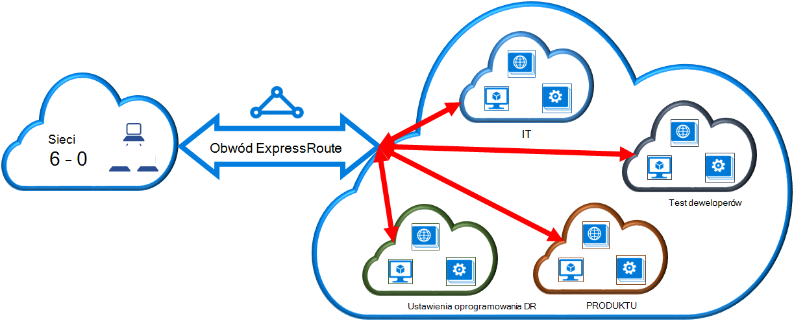

<properties 
   pageTitle="Łącze wirtualnej sieci układ ExpressRoute przy użyciu programu PowerShell | Microsoft Azure"
   description="Ten dokument zawiera omówienie sposobu łącze wirtualnych sieci (VNets) do obwodów ExpressRoute przy użyciu modelu wdrożenia Menedżera zasobów i programu PowerShell."
   services="expressroute"
   documentationCenter="na"
   authors="ganesr"
   manager="carmonm"
   editor=""
   tags="azure-resource-manager"/>
<tags 
   ms.service="expressroute"
   ms.devlang="na"
   ms.topic="article"
   ms.tgt_pltfrm="na"
   ms.workload="infrastructure-services"
   ms.date="10/10/2016"
   ms.author="ganesr" />

# Łącze wirtualnej sieci układ ExpressRoute

> [AZURE.SELECTOR]
- [Portal Azure - Menedżera zasobów](expressroute-howto-linkvnet-portal-resource-manager.md)
- [PowerShell — Menedżera zasobów](expressroute-howto-linkvnet-arm.md)
- [PowerShell — klasyczny](expressroute-howto-linkvnet-classic.md)

W tym artykule pomoże Ci połączyć Azure ExpressRoute obwodów wirtualnych sieci (VNets) przy użyciu modelu wdrożenia Menedżera zasobów i programu PowerShell. Wirtualnych sieci mogą być w tej samej subskrypcji lub części innej subskrypcji.

**Informacje dotyczące modeli Azure wdrażania**

[AZURE.INCLUDE [vpn-gateway-clasic-rm](../../includes/vpn-gateway-classic-rm-include.md)] 

## Wymagania wstępne dotyczące konfiguracji

- Potrzebujesz najnowszą wersję pakietu moduły Azure programu PowerShell (co najmniej w wersji 1.0). Aby uzyskać więcej informacji o instalowaniu poleceń cmdlet programu PowerShell, zobacz [jak zainstalować i skonfigurować Azure programu PowerShell](../powershell-install-configure.md) .
- Należy przejrzeć [wymagania wstępne dotyczące](expressroute-prerequisites.md) [wymagań dotyczących routingu](expressroute-routing.md)i [przepływy pracy](expressroute-workflows.md) , przed rozpoczęciem konfiguracji.
- Musi być aktywna obwód ExpressRoute. 
    - Postępuj zgodnie z instrukcjami, aby [utworzyć obwód ExpressRoute](expressroute-howto-circuit-arm.md) i że masz elektrycznego włączone przez dostawcę usługi łączności. 
    - Upewnij się, że masz Azure prywatne zaglądanie skonfigurowane dla swojego elektrycznego. Zobacz artykuł [Konfigurowanie routingu](expressroute-howto-routing-arm.md) , aby uzyskać instrukcje dotyczące routingu. 
    - Zapewnić Azure zaglądanie prywatny jest skonfigurowany i BGP zaglądanie między sieci i Microsoft jest w górę, dzięki czemu możesz włączyć łączności zakończenia do końca.
    - Upewnij się, że masz wirtualnej sieci i bramy wirtualnej sieci utworzone i pełni obsługi administracyjnej. Postępuj zgodnie z instrukcjami, aby utworzyć [bramy sieci VPN](../articles/vpn-gateway/vpn-gateway-create-site-to-site-rm-powershell.md), ale należy użyć `-GatewayType ExpressRoute`.

Do 10 wirtualnych sieci można połączyć standardowy obwód ExpressRoute. Wszystkie wirtualnych sieci muszą być w tym samym regionie geopolitycznych, gdy za pomocą standardowej obwód ExpressRoute. 

Łącze wirtualnych sieci poza geopolitycznych region obwodu ExpressRoute lub łączenie większej liczby wirtualnych sieci z obwodem ExpressRoute włączenie dodatku premium ExpressRoute. Sprawdź [— często zadawane pytania](expressroute-faqs.md) , aby uzyskać więcej informacji na temat dodatku premium.

## Nawiązywanie połączenia wirtualnej sieci w tej samej subskrypcji z obwodu

Umożliwia nawiązanie połączenia wirtualnej sieci uzyskanie obwód ExpressRoute przy użyciu następującego polecenia cmdlet. Upewnij się, że brama wirtualną sieć zostanie utworzona i jest gotowy do łączenia przed uruchomieniem polecenia cmdlet:

    $circuit = Get-AzureRmExpressRouteCircuit -Name "MyCircuit" -ResourceGroupName "MyRG"
    $gw = Get-AzureRmVirtualNetworkGateway -Name "ExpressRouteGw" -ResourceGroupName "MyRG"
    $connection = New-AzureRmVirtualNetworkGatewayConnection -Name "ERConnection" -ResourceGroupName "MyRG" -Location "East US" -VirtualNetworkGateway1 $gw -PeerId $circuit.Id -ConnectionType ExpressRoute

## Nawiązywanie połączenia wirtualnej sieci w innej subskrypcji z obwodu

Możesz udostępnić obwód ExpressRoute przez wiele subskrypcji. Na poniższej ilustracji pokazano prosty schemat utworów sposobu udostępniania dla obwodów ExpressRoute przez wiele subskrypcji.

Mniejsze chmur w chmurze dużych są używane reprezentować subskrypcje, które należą do różnych działów w obrębie organizacji. Wszystkich działów w obrębie organizacji można używać własnych subskrypcji do wdrażania ich usług — ale można udostępnić pojedynczy obwód ExpressRoute, aby ponownie nawiązać połączenie sieci lokalnej. Jednego działu (w tym przykładzie: IT) mogą być właścicielami obwód ExpressRoute. Inne subskrypcje w obrębie organizacji za pomocą obwód ExpressRoute.

>[AZURE.NOTE] Łączność i przepustowość opłat za dedykowane obwód zostanie zastosowany do właściciela obwód ExpressRoute. Wszystkie wirtualnych sieci udostępnianie samej przepustowości.

### Administracja

*Właściciel elektrycznego* jest użytkownika autoryzowanych power zasobu obwód ExpressRoute. Właściciel elektrycznego można utworzyć zezwolenia, które można zrealizować przez *użytkowników elektrycznego*. *Użytkownicy elektrycznego* są właściciele bram wirtualną sieć, (które nie są w tej samej subskrypcji jako elektrycznego ExpressRoute). *Obwód użytkownicy* mogą zrealizować zezwolenia (pozwolenia na wirtualnej sieci).

*Właściciel elektrycznego* ma uprawnienia do modyfikowania i cofanie zezwoleń w dowolnym momencie. Odwoływanie autoryzacji skutkuje wszystkich połączeń usuwany z subskrypcji, w których dostęp został odwołany.

### Operacje właściciela elektrycznego 

#### Tworzenie autoryzacji
    
Właściciel elektrycznego tworzy zezwolenia. Powoduje utworzenie klucza autoryzacji, który może być używany przez użytkownika elektrycznego nawiązać swoich bram wirtualnej sieci z obwodem ExpressRoute. Zezwolenie dotyczy tylko jedno połączenie.

Poniższy fragment polecenia cmdlet przedstawiono sposób tworzenia autoryzacji:

    $circuit = Get-AzureRmExpressRouteCircuit -Name "MyCircuit" -ResourceGroupName "MyRG"
    Add-AzureRmExpressRouteCircuitAuthorization -ExpressRouteCircuit $circuit -Name "MyAuthorization1"
    Set-AzureRmExpressRouteCircuit -ExpressRouteCircuit $circuit

        $circuit = Get-AzureRmExpressRouteCircuit -Name "MyCircuit" -ResourceGroupName "MyRG"
    $auth1 = Get-AzureRmExpressRouteCircuitAuthorization -ExpressRouteCircuit $circuit -Name "MyAuthorization1"
        

Odpowiedź na tę zawiera klucz autoryzacji i stanu:

    Name                   : MyAuthorization1
    Id                     : /subscriptions/&&&&&&&&&&&&&&&&&&&&&&&&&&&&&&&&&&&&/resourceGroups/ERCrossSubTestRG/providers/Microsoft.Network/expressRouteCircuits/CrossSubTest/authorizations/MyAuthorization1
    Etag                   : &&&&&&&&&&&&&&&&&&&&&&&&&&&&&&&&&&&& 
    AuthorizationKey       : ####################################
    AuthorizationUseStatus : Available
    ProvisioningState      : Succeeded

        

#### Przeglądanie zezwolenia

Właściciel elektrycznego przeglądać wszystkich zezwoleń wydawanych obwód określonego, uruchamiając następujące polecenie cmdlet:

    $circuit = Get-AzureRmExpressRouteCircuit -Name "MyCircuit" -ResourceGroupName "MyRG"
    $authorizations = Get-AzureRmExpressRouteCircuitAuthorization -ExpressRouteCircuit $circuit
    

#### Dodawanie zezwolenia

Właściciel elektrycznego można dodać zezwolenia przy użyciu następującego polecenia cmdlet:

    $circuit = Get-AzureRmExpressRouteCircuit -Name "MyCircuit" -ResourceGroupName "MyRG"
    Add-AzureRmExpressRouteCircuitAuthorization -ExpressRouteCircuit $circuit -Name "MyAuthorization2"
    Set-AzureRmExpressRouteCircuit -ExpressRouteCircuit $circuit
    
    $circuit = Get-AzureRmExpressRouteCircuit -Name "MyCircuit" -ResourceGroupName "MyRG"
    $authorizations = Get-AzureRmExpressRouteCircuitAuthorization -ExpressRouteCircuit $circuit

    
#### Usuwanie zezwolenia

Właściciel elektrycznego można revoke/usuwanie zezwoleń użytkownikowi, uruchamiając następujące polecenie cmdlet:

    Remove-AzureRmExpressRouteCircuitAuthorization -Name "MyAuthorization2" -ExpressRouteCircuit $circuit
    Set-AzureRmExpressRouteCircuit -ExpressRouteCircuit $circuit    

### Operacje użytkownika elektrycznego

Użytkownik elektrycznego musi identyfikator równorzędnych i klucz zezwolenia od właściciela elektrycznego. Klucz autoryzacji jest identyfikator GUID.

Identyfikator równorzędnej jest, można sprawdzić następujące polecenia.

    Get-AzureRmExpressRouteCircuit -Name "MyCircuit" -ResourceGroupName "MyRG"

#### Realizując zezwoleń połączenia

Użytkownik elektrycznego można uruchomić następujące polecenie cmdlet, aby zrealizować autoryzacji łącza:

    $id = "/subscriptions/********************************/resourceGroups/ERCrossSubTestRG/providers/Microsoft.Network/expressRouteCircuits/MyCircuit"  
    $gw = Get-AzureRmVirtualNetworkGateway -Name "ExpressRouteGw" -ResourceGroupName "MyRG"
    $connection = New-AzureRmVirtualNetworkGatewayConnection -Name "ERConnection" -ResourceGroupName "RemoteResourceGroup" -Location "East US" -VirtualNetworkGateway1 $gw -PeerId $id -ConnectionType ExpressRoute -AuthorizationKey "^^^^^^^^^^^^^^^^^^^^^^^^^^^^^^^^^^^^^^^^^^^^^"

#### Zwalnianie zezwolenia połączenia

Zezwolenie można zwolnić, usuwając połączenie z łączem obwód ExpressRoute do wirtualnej sieci.

## Następne kroki

Aby uzyskać więcej informacji o ExpressRoute zobacz [Często zadawane pytania dotyczące ExpressRoute](expressroute-faqs.md).
