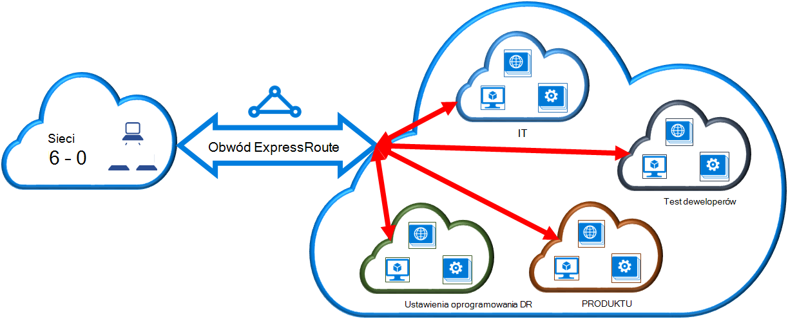

<properties
   pageTitle="Łącze wirtualnej sieci układ ExpressRoute przy użyciu modelu Klasyczny wdrożenia i programu PowerShell | Microsoft Azure"
   description="Ten dokument zawiera omówienie sposobu łącze wirtualnych sieci (VNets) do obwodów ExpressRoute przy użyciu modelu Klasyczny wdrożenia i programu PowerShell."
   services="expressroute"
   documentationCenter="na"
   authors="ganesr"
   manager="carmonm"
   editor=""
   tags="azure-service-management"/>
<tags
   ms.service="expressroute"
   ms.devlang="na"
   ms.topic="article"
   ms.tgt_pltfrm="na"
   ms.workload="infrastructure-services"
   ms.date="10/10/2016"
   ms.author="ganesr" />

# Łącze wirtualnej sieci układ ExpressRoute

> [AZURE.SELECTOR]
- [Portal Azure - Menedżera zasobów](expressroute-howto-linkvnet-portal-resource-manager.md)
- [PowerShell — Menedżera zasobów](expressroute-howto-linkvnet-arm.md)
- [PowerShell — klasyczny](expressroute-howto-linkvnet-classic.md)

W tym artykule pomoże Ci połączyć Azure ExpressRoute obwodów wirtualnych sieci (VNets) przy użyciu modelu Klasyczny wdrożenia i programu PowerShell. Wirtualnych sieci mogą być w tej samej subskrypcji lub może być częścią innej subskrypcji.

**Informacje dotyczące modeli Azure wdrażania**

[AZURE.INCLUDE [vpn-gateway-clasic-rm](../../includes/vpn-gateway-classic-rm-include.md)]

## Wymagania wstępne dotyczące konfiguracji

1. Potrzebujesz najnowszą wersję pakietu moduły Azure programu PowerShell. Można pobrać najnowsze moduły programu PowerShell z sekcji programu PowerShell [strony pobierania Azure](https://azure.microsoft.com/downloads/). Postępuj zgodnie z instrukcjami w [temacie jak zainstalować i skonfigurować Azure programu PowerShell](../powershell-install-configure.md) instrukcje krok po kroku dotyczące konfigurowania komputera do moduły Azure programu PowerShell.
2. Należy przejrzeć [wymagania wstępne dotyczące](expressroute-prerequisites.md) [wymagań dotyczących routingu](expressroute-routing.md)i [przepływy pracy](expressroute-workflows.md) , przed rozpoczęciem konfiguracji.
3. Musi być aktywna obwód ExpressRoute.
    - Postępuj zgodnie z instrukcjami, aby [utworzyć obwód ExpressRoute](expressroute-howto-circuit-classic.md) i że masz dostawcy łączności Włącz obwodu.
    - Upewnij się, że masz Azure prywatne zaglądanie skonfigurowane dla swojego elektrycznego. Zobacz artykuł [Konfigurowanie routingu](expressroute-howto-routing-classic.md) routingu instrukcje.
    - Zapewnić Azure zaglądanie prywatny jest skonfigurowany i BGP zaglądanie między sieci i Microsoft jest w górę, dzięki czemu możesz włączyć łączności zakończenia do końca.
    - Musi być wirtualnej sieci i bramy wirtualną sieć utworzone i pełni obsługi administracyjnej. Postępuj zgodnie z instrukcjami, aby [skonfigurować wirtualna sieć ExpressRoute](expressroute-howto-vnet-portal-classic.md).

Do 10 wirtualnych sieci można połączyć obwód ExpressRoute. W tym samym regionie geopolitycznych musi być wszystkich wirtualnych sieci. Można połączyć wiele wirtualnych sieci z obwodem ExpressRoute lub wirtualnych sieci łącze, które znajdują się w innych regionach geopolitycznych włączenie dodatku premium ExpressRoute. Sprawdź [— często zadawane pytania](expressroute-faqs.md) , aby uzyskać więcej informacji na temat dodatku premium.

## Nawiązywanie połączenia wirtualnej sieci w tej samej subskrypcji z obwodu

Wirtualna sieć można połączyć w obwód ExpressRoute, przy użyciu następującego polecenia cmdlet. Upewnij się, że brama wirtualną sieć zostanie utworzona i jest gotowy do łączenia przed uruchomieniem polecenia cmdlet.

    New-AzureDedicatedCircuitLink -ServiceKey "*****************************" -VNetName "MyVNet"
    Provisioned

## Nawiązywanie połączenia wirtualnej sieci w innej subskrypcji z obwodu

Możesz udostępnić obwód ExpressRoute przez wiele subskrypcji. Na poniższej ilustracji pokazano prosty schemat utworów sposobu udostępniania dla obwodów ExpressRoute przez wiele subskrypcji.

Mniejsze chmur w chmurze dużych są używane reprezentować subskrypcje, które należą do różnych działów w obrębie organizacji. Wszystkich działów w obrębie organizacji za pomocą własnych subskrypcję dla wdrażanie usług — ale służb udostępnić pojedynczy obwód ExpressRoute, aby ponownie nawiązać połączenie sieci lokalnej. Jednego działu (w tym przykładzie: IT) mogą być właścicielami obwód ExpressRoute. Inne subskrypcje w obrębie organizacji za pomocą obwód ExpressRoute.

>[AZURE.NOTE] Łączność i przepustowość opłat za dedykowane obwód zostanie zastosowany do właściciela obwód ExpressRoute. Wszystkie wirtualnych sieci udostępnianie samej przepustowości.

### Administracja

*Właściciel elektrycznego* jest administrator-coadministrator subskrypcji, w której jest tworzona obwód ExpressRoute. Właściciel elektrycznego można zezwolić Administratorzy coadministrators innych subskrypcji określane jako *elektrycznego użytkowników*, aby użyć dedykowane obwodu, w którym są. Użytkownicy obwodu elektrycznego ExpressRoute organizacji przy użyciu można połączyć wirtualną sieć w swoją subskrypcję elektrycznego ExpressRoute po mają uprawnień.

Właściciel elektrycznego ma uprawnienia do modyfikowania i cofanie zezwoleń w dowolnym momencie. Odwoływanie zezwolenia spowoduje wszystkie łącza, są usuwane z subskrypcji, w których dostęp został odwołany.

### Operacje właściciela elektrycznego

#### Tworzenie autoryzacji

Właściciel elektrycznego zezwala administratorom użycie określonej elektrycznego pozostałe subskrypcje. W poniższym przykładzie administrator elektrycznego (Contoso IT) umożliwia administratorowi innej subskrypcji (deweloperów Test) utworzyć łącze do dwóch wirtualnych sieci do układu. Contoso informatykiem umożliwia to, określając identyfikatora Microsoft deweloperów Test. Polecenie cmdlet poczty e-mail nie są wysyłane do określonego identyfikatora Microsoft. Właściciel elektrycznego musi jawnie poinformować o tym właściciela subskrypcji o ukończeniu zezwolenie.

    New-AzureDedicatedCircuitLinkAuthorization -ServiceKey "**************************" -Description "Dev-Test Links" -Limit 2 -MicrosoftIds 'devtest@contoso.com'

    Description         : Dev-Test Links
    Limit               : 2
    LinkAuthorizationId : **********************************
    MicrosoftIds        : devtest@contoso.com
    Used                : 0

#### Przeglądanie zezwolenia

Właściciel elektrycznego przeglądać wszystkich zezwoleń wydawanych obwód określonego, uruchamiając następujące polecenie cmdlet:

    Get-AzureDedicatedCircuitLinkAuthorization -ServiceKey: "**************************"

    Description         : EngineeringTeam
    Limit               : 3
    LinkAuthorizationId : ####################################
    MicrosoftIds        : engadmin@contoso.com
    Used                : 1

    Description         : MarketingTeam
    Limit               : 1
    LinkAuthorizationId : @@@@@@@@@@@@@@@@@@@@@@@@@@@@@@@@@@@@
    MicrosoftIds        : marketingadmin@contoso.com
    Used                : 0

    Description         : Dev-Test Links
    Limit               : 2
    LinkAuthorizationId : &&&&&&&&&&&&&&&&&&&&&&&&&&&&&&&&&&&&
    MicrosoftIds        : salesadmin@contoso.com
    Used                : 2

#### Aktualizowanie zezwolenia

Właściciel elektrycznego można zmodyfikować zezwolenia przy użyciu następującego polecenia cmdlet:

    Set-AzureDedicatedCircuitLinkAuthorization -ServiceKey "**************************" -AuthorizationId "&&&&&&&&&&&&&&&&&&&&&&&&&&&&"-Limit 5

    Description         : Dev-Test Links
    Limit               : 5
    LinkAuthorizationId : &&&&&&&&&&&&&&&&&&&&&&&&&&&&&&&&&&&&&&
    MicrosoftIds        : devtest@contoso.com
    Used                : 0

#### Usuwanie zezwolenia

Właściciel elektrycznego można revoke/usuwanie zezwolenia użytkownikowi, uruchamiając następujące polecenie cmdlet:

    Remove-AzureDedicatedCircuitLinkAuthorization -ServiceKey "*****************************" -AuthorizationId "###############################"

### Obwód operacjami użytkownika

#### Przeglądanie zezwolenia

Użytkownik elektrycznego może przeglądać zezwolenia przy użyciu następującego polecenia cmdlet:

    Get-AzureAuthorizedDedicatedCircuit

    Bandwidth                        : 200
    CircuitName                      : ContosoIT
    Location                         : Washington DC
    MaximumAllowedLinks              : 2
    ServiceKey                       : &&&&&&&&&&&&&&&&&&&&&&&&&&&&&&&&&&&&
    ServiceProviderName              : equinix
    ServiceProviderProvisioningState : Provisioned
    Status                           : Enabled
    UsedLinks                        : 0

#### Realizując zezwolenia łącza

Użytkownik elektrycznego można uruchomić następujące polecenie cmdlet, aby zrealizować autoryzacji łącza:

    New-AzureDedicatedCircuitLink –servicekey "&&&&&&&&&&&&&&&&&&&&&&&&&&" –VnetName 'SalesVNET1'

    State VnetName
    ----- --------
    Provisioned SalesVNET1

## Następne kroki

Aby uzyskać więcej informacji o ExpressRoute zobacz [Często zadawane pytania dotyczące ExpressRoute](expressroute-faqs.md).
