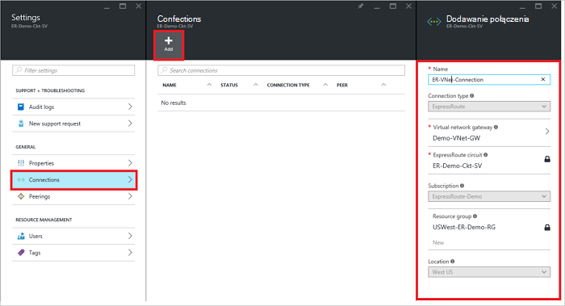
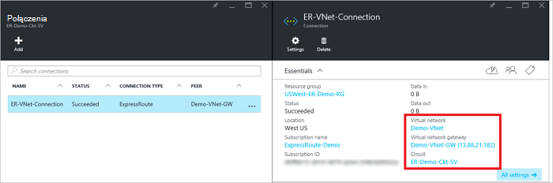

<properties
   pageTitle="Łącze wirtualnej sieci układ ExpressRoute przy użyciu modelu wdrożenia Menedżera zasobów i Azure portal | Microsoft Azure"
   description="Ten dokument zawiera omówienie sposobu połączyć ExpressRoute obwodów wirtualnych sieci (VNets)."
   services="expressroute"
   documentationCenter="na"
   authors="cherylmc"
   manager="carmonm"
   editor=""
   tags="azure-resource-manager"/>
<tags
   ms.service="expressroute"
   ms.devlang="na"
   ms.topic="article"
   ms.tgt_pltfrm="na"
   ms.workload="infrastructure-services"
   ms.date="10/10/2016"
   ms.author="cherylmc" />

# Łącze wirtualnej sieci układ ExpressRoute

> [AZURE.SELECTOR]
- [Portal Azure - Menedżera zasobów](expressroute-howto-linkvnet-portal-resource-manager.md)
- [PowerShell — Menedżera zasobów](expressroute-howto-linkvnet-arm.md)
- [PowerShell — klasyczny](expressroute-howto-linkvnet-classic.md)

W tym artykule pomoże Ci połączyć przy użyciu modelu wdrożenia Menedżera zasobów i Azure portal Azure ExpressRoute obwodów wirtualnych sieci (VNets). Wirtualnych sieci mogą być w tej samej subskrypcji lub mogą być częścią innej subskrypcji.

**Informacje dotyczące modeli Azure wdrażania**

[AZURE.INCLUDE [vpn-gateway-clasic-rm](../../includes/vpn-gateway-classic-rm-include.md)]

## Wymagania wstępne dotyczące konfiguracji

- Upewnij się, że przejrzeniu [wymagania wstępne](expressroute-prerequisites.md), [routingu wymagania](expressroute-routing.md)i [przepływy pracy](expressroute-workflows.md) przed rozpoczęciem konfiguracji.
- Musi być aktywna obwód ExpressRoute.
    - Postępuj zgodnie z instrukcjami, aby [utworzyć obwód ExpressRoute](expressroute-howto-circuit-arm.md) i że masz elektrycznego włączone przez dostawcę usługi łączności.

    - Upewnij się, że masz Azure prywatne zaglądanie skonfigurowane dla swojego elektrycznego. Zobacz artykuł [Konfigurowanie routingu](expressroute-howto-routing-portal-resource-manager.md) routingu instrukcje.

    - Zapewnić Azure zaglądanie prywatny jest skonfigurowany i BGP zaglądanie między sieci i Microsoft jest w górę, dzięki czemu możesz włączyć łączności zakończenia do końca.

    - Upewnij się, że masz wirtualnej sieci i bramy wirtualną sieć utworzone i pełni obsługi administracyjnej. Postępuj zgodnie z instrukcjami, aby utworzyć [Brama VPN](../articles/vpn-gateway/vpn-gateway-howto-site-to-site-resource-manager-portal.md) (Obserwuj tylko kroki 1-5).

Do 10 wirtualnych sieci można połączyć standardowy obwód ExpressRoute. Wszystkie wirtualnych sieci muszą być w tym samym regionie geopolitycznych, gdy za pomocą standardowej obwód ExpressRoute. Łącze wirtualne sieci poza geopolitycznych region obwodu ExpressRoute lub łączenie większej liczby wirtualnych sieci z obwodem ExpressRoute włączenie dodatku premium ExpressRoute. Sprawdź [— często zadawane pytania](expressroute-faqs.md) , aby uzyskać więcej informacji na temat dodatku premium.

## Nawiązywanie połączenia wirtualnej sieci w tej samej subskrypcji z obwodu

### Aby utworzyć połączenie

1. Upewnij się, że obwód ExpressRoute i Azure zaglądanie prywatne zostały skonfigurowane pomyślnie. Postępuj zgodnie z instrukcjami [Utwórz obwód ExpressRoute](expressroute-howto-circuit-arm.md) i [Konfigurowanie routingu](expressroute-howto-routing-arm.md). Usługi elektrycznego ExpressRoute powinna wyglądać podobnie do poniższej ilustracji.

    

    >[AZURE.NOTE] Informacje o konfiguracji BGP nie będą widoczne jeśli dostawca warstwy 3 skonfigurowany do peerings. W przypadku usługi elektrycznego ustanawianie stan, należy utworzyć połączenia.

2. Możesz teraz rozpocząć inicjowania obsługi administracyjnej połączenia do połączenia wirtualnej sieci uzyskanie usługi obwód ExpressRoute. Kliknij pozycję **połączenie** > **Dodaj** , aby otworzyć karta **Dodaj połączenie** , a następnie skonfiguruj wartości. Zobacz w poniższym przykładzie odwołania.

      

3. Po pomyślnym skonfigurowaniu połączenia obiekt połączenia zostaną wyświetlone informacje połączenia.

    

### Aby usunąć połączenie

Połączenie można usunąć, wybierając ikonę **Usuń** karta dla połączenia.

## Nawiązywanie połączenia wirtualnej sieci w innej subskrypcji z obwodu

W tej chwili nie połączenia wirtualnej sieci w subskrypcjach przy użyciu Azure portal. Za pomocą programu PowerShell można jednak wykonaj następujące czynności. Zobacz artykuł [programu PowerShell](expressroute-howto-linkvnet-arm.md) , aby uzyskać więcej informacji.

## Następne kroki

Aby uzyskać więcej informacji o ExpressRoute zobacz [Często zadawane pytania dotyczące ExpressRoute](expressroute-faqs.md).
