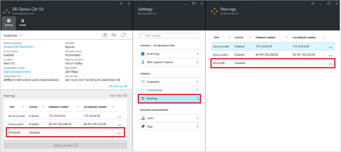

<properties
   pageTitle="Jak skonfigurować routing obwodu ExpressRoute za pomocą Azure Portal | Microsoft Azure"
   description="W tym artykule opisano kroki tworzenia i inicjowania obsługi administracyjnej prywatnych, publicznych i Microsoft zaglądanie obwodu ExpressRoute. Ten artykuł zawiera także jak sprawdzić stan, aktualizowanie lub usuwanie peerings dla swojego obwodu."
   documentationCenter="na"
   services="expressroute"
   authors="cherylmc"
   manager="carmonm"
   editor=""
   tags="azure-resource-manager"/>
<tags
   ms.service="expressroute"
   ms.devlang="na"
   ms.topic="hero-article" 
   ms.tgt_pltfrm="na"
   ms.workload="infrastructure-services"
   ms.date="10/10/2016"
   ms.author="cherylmc"/>

# Tworzenie i modyfikowanie routing obwód ExpressRoute

> [AZURE.SELECTOR]
[Portal Azure - Menedżer zasobów](expressroute-howto-routing-portal-resource-manager.md)
[programu PowerShell — Menedżer zasobów](expressroute-howto-routing-arm.md)
[PowerShell — klasyczny](expressroute-howto-routing-classic.md)

W tym artykule opisano kroki tworzenia i zarządzania konfiguracji routingu dla obwodu ExpressRoute za pomocą Azure portal i model wdrożenia Menedżera zasobów.

**Informacje dotyczące modeli Azure wdrażania**

[AZURE.INCLUDE [vpn-gateway-clasic-rm](../../includes/vpn-gateway-classic-rm-include.md)] 

## Wymagania wstępne dotyczące konfiguracji

- Upewnij się, że przejrzeniu stronie [wymagania wstępne](expressroute-prerequisites.md) , strona [routingu wymagania](expressroute-routing.md) i strona [przepływy pracy](expressroute-workflows.md) przed rozpoczęciem konfiguracji.
- Musi być aktywna obwód ExpressRoute. Postępuj zgodnie z instrukcjami do [utworzenia obwód ExpressRoute](expressroute-howto-circuit-arm.md) i że masz elektrycznego włączone przez dostawcę usługi łączności, przed kontynuowaniem. Obwód ExpressRoute musi być w stanie ustanawianie i włączony będzie możliwe uruchomić polecenia cmdlet, opisane poniżej.

Te instrukcje dotyczą tylko obwody utworzone za pomocą dostawców usług oferujących usługi łączności warstwy 2. Jeśli używasz usługodawcy oferujących usługi zarządzanych Layer 3 (zazwyczaj IPVPN, takich jak MPLS) dostawcy łączności Konfigurowanie i zarządzanie routingu dla Ciebie. 

>[AZURE.IMPORTANT] Pracujemy obecnie nie ogłaszanie peerings skonfigurowany przez dostawców usług za pomocą portalu zarządzania. Pracujemy obecnie nad szybko włączyć tę funkcję. Sprawdź, czy u usługodawcy przed skonfigurowaniem BGP peerings.

Można skonfigurować jeden, dwa lub wszystkie trzy peerings (Azure publicznych prywatne, Azure i Microsoft) dla obwodu ExpressRoute. Peerings można konfigurować w wybranym w jakiejkolwiek kolejności. Jednak należy się upewnić, aby zakończyć konfigurację poszczególnych peering w danej chwili. 

## Azure zaglądanie prywatnych

Ta sekcja zawiera instrukcje na temat Tworzenie, pobieranie, aktualizowanie i usuwanie Azure prywatne konfiguracji peering obwód ExpressRoute. 

### Aby utworzyć Azure zaglądanie prywatnych

1. Konfigurowanie obwód ExpressRoute. Upewnij się, że obwód jest w pełni obsługi administracyjnej przez dostawcę łączności przed kontynuowaniem.

    

2. Konfigurowanie Azure prywatne zaglądanie do układu. Upewnij się, że jest następujące elementy, przed kontynuowaniem następne kroki:

    - /30 podsieć łącze podstawowe. Nie może być częścią dowolne miejsce adres zastrzeżone wirtualnych sieci.
    - /30 podsieci pomocniczej łącza. Nie może być częścią dowolne miejsce adres zastrzeżone wirtualnych sieci.
    - Prawidłowego Identyfikatora VLAN, aby ustalić to zaglądanie na. Upewnij się, że nie inne zaglądanie w układzie używa tego samego identyfikatora VLAN.
    - JAKO numer zaglądanie. Można użyć zarówno 2-bajtowa i 4-bajtowe jako liczby. Możesz użyć prywatnej jako numer ten zaglądanie. Upewnij się, że nie używasz 65515.
    - Mieszanie MD5 wybranie korzystać. **Jest to opcjonalne**.

3. Zaznacz Azure prywatne wiersz peering, tak jak pokazano poniżej.
    
    
    

4. Konfigurowanie zaglądanie prywatne. Na poniższej ilustracji przedstawiono przykład konfiguracji.

    

    
5. Zapisywanie konfiguracji po określeniu wszystkich parametrów. Po zaakceptowaniu pomyślnie konfiguracji, zostanie wyświetlona strona podobna do poniższego przykładu.

    
    

### Aby wyświetlić szczegóły Azure zaglądanie prywatnych

Możesz wyświetlić właściwości Azure zaglądanie prywatne, wybierając pozycję zaglądanie.

### Aby zaktualizować konfigurację Azure zaglądanie prywatnych

Można zaznaczyć wiersz zaglądanie i modyfikować właściwości peering. 

### Aby usunąć Azure zaglądanie prywatnych

Możesz usunąć konfiguracji peering, wybierając ikonę Usuń, tak jak pokazano poniżej.

## Azure zaglądanie publicznej

Ta sekcja zawiera instrukcje na temat Tworzenie, pobieranie, aktualizowanie i usuwanie Azure publicznej konfiguracji peering obwód ExpressRoute. 

### Aby utworzyć Azure zaglądanie publicznej

1. Konfigurowanie obwód ExpressRoute. Upewnij się, że obwód jest w pełni obsługi administracyjnej przez dostawcę łączności przed kontynuacji.

    

2. Konfigurowanie Azure publicznej zaglądanie do układu. Upewnij się, że jest następujące elementy, przed kontynuowaniem następne kroki:

    - /30 podsieć łącze podstawowe. 
    - /30 podsieci pomocniczej łącza. 
    - Wszystkie adresy IP używane do instalacji tego zaglądanie musi być prawidłowych publicznych adresów IP protokołu IPv4.
    - Prawidłowego Identyfikatora VLAN, aby ustalić to zaglądanie na. Upewnij się, że nie inne zaglądanie w układzie używa tego samego identyfikatora VLAN.
    - JAKO numer zaglądanie. Można użyć zarówno 2-bajtowa i 4-bajtowe jako liczby.
    - Mieszanie MD5 wybranie korzystać. **Jest to opcjonalne**.

3. Zaznacz Azure publicznej wiersz peering, tak jak pokazano poniżej.
    
    
    

4. Konfigurowanie publicznej zaglądanie. Na poniższej ilustracji przedstawiono przykład konfiguracji.

    

    
5. Zapisywanie konfiguracji po określeniu wszystkich parametrów. Po zaakceptowaniu pomyślnie konfiguracji, zostanie wyświetlona strona podobna do poniższego przykładu.

    
    

### Aby wyświetlić szczegóły zaglądanie publicznej Azure

Możesz wyświetlić właściwości Azure zaglądanie publicznej, wybierając pozycję zaglądanie.

### Aby zaktualizować konfigurację zaglądanie publicznej Azure

Można zaznaczyć wiersz zaglądanie i modyfikować właściwości peering. 

### Aby usunąć Azure zaglądanie publicznej

Możesz usunąć konfiguracji peering, wybierając ikonę Usuń, tak jak pokazano poniżej.

## Zaglądanie firmy Microsoft

Ta sekcja zawiera instrukcje na temat Tworzenie, pobieranie, aktualizowanie i usuwanie Microsoft peering konfiguracji obwód ExpressRoute. 

### Aby utworzyć zaglądanie firmy Microsoft

1. Konfigurowanie obwód ExpressRoute. Upewnij się, że obwód jest w pełni obsługi administracyjnej przez dostawcę łączności przed kontynuacji.

    

2. Konfigurowanie Microsoft zaglądanie do układu. Upewnij się, że masz następujące informacje, przed kontynuowaniem.

    - /30 podsieć łącze podstawowe. Musi to być prawidłowy publicznej prefiks IPv4 należącą do Ciebie i zarejestrowane w RIR-IRR.
    - /30 podsieci pomocniczej łącza. Musi to być prawidłowy publicznej prefiks IPv4 należącą do Ciebie i zarejestrowane w RIR-IRR.
    - Prawidłowego Identyfikatora VLAN, aby ustalić to zaglądanie na. Upewnij się, że nie inne zaglądanie w układzie używa tego samego identyfikatora VLAN.
    - JAKO numer zaglądanie. Można użyć zarówno 2-bajtowa i 4-bajtowe jako liczby.
    - **Ogłaszane prefiksy:** Musisz podać listę wszystkich prefiksów, które mają być ogłaszanie sesji BGP. Tylko publicznej prefiksy adresów IP są akceptowane. Możesz wysłać listę rozdzielanych przecinkami, jeśli zamierzasz wysłać zestaw prefiksów. Tych prefiksów musi być zarejestrowany dla Ciebie w RIR-IRR.
    - **Klienta ASN:** Jeśli prefiksy reklam, które nie są rejestrowane do zaglądanie jako liczby, można określić numer AS, do której są rejestrowane. **Jest to opcjonalne**.
    - **Routingu nazwa rejestru:** Możesz określić RIR-IRR, dla której numer i prefiksy są zarejestrowane. **Jest to opcjonalne.**
    - Mieszanie MD5, jeśli chcesz użyć jednego. **Jest to opcjonalne.**
    
3. Możesz wybrać zaglądanie, którą chcesz skonfigurować, tak jak pokazano poniżej. Zaznacz wiersz peering firmy Microsoft.
    
    
    

4.  Konfigurowanie zaglądanie firmy Microsoft. Na poniższej ilustracji przedstawiono przykład konfiguracji.

    

    
5. Zapisywanie konfiguracji po określeniu wszystkich parametrów. 

    Usługi elektrycznego otrzymuje do sprawdzania poprawności potrzeby stan (jak pokazano poniżej), należy otworzyć bilet pomocy technicznej, aby wyświetlić dowodu własności prefiksy do działu pomocy technicznej.  
    
    

    Możesz otworzyć bilet pomocy technicznej bezpośrednio w portalu, jak pokazano poniżej   
    
    

6. Po zaakceptowaniu pomyślnie konfiguracji, zostanie wyświetlona strona podobna do poniższego przykładu.

    
    

### Aby wyświetlić szczegóły zaglądanie firmy Microsoft

Możesz wyświetlić właściwości Azure zaglądanie publicznej, wybierając pozycję zaglądanie.

### Aby zaktualizować konfigurację zaglądanie firmy Microsoft

Można zaznaczyć wiersz zaglądanie i modyfikować właściwości peering. 

### Aby usunąć zaglądanie firmy Microsoft

Możesz usunąć konfiguracji peering, wybierając ikonę Usuń, tak jak pokazano poniżej.

## Następne kroki

Następnym krokiem [łącze VNet obwodem ExpressRoute](expressroute-howto-linkvnet-arm.md).

-  Aby uzyskać więcej informacji o przepływach pracy ExpressRoute zobacz [ExpressRoute przepływy pracy](expressroute-workflows.md).

-  Aby uzyskać więcej informacji na temat obwodu zaglądanie zobacz [ExpressRoute obwody elektryczne i układy domen routingu](expressroute-circuit-peerings.md).

-  Aby uzyskać więcej informacji na temat pracy z wirtualnych sieci zobacz [Omówienie wirtualnych sieci](../virtual-network/virtual-networks-overview.md).

