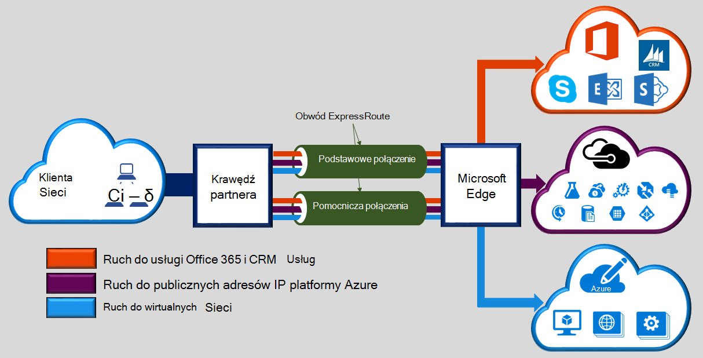
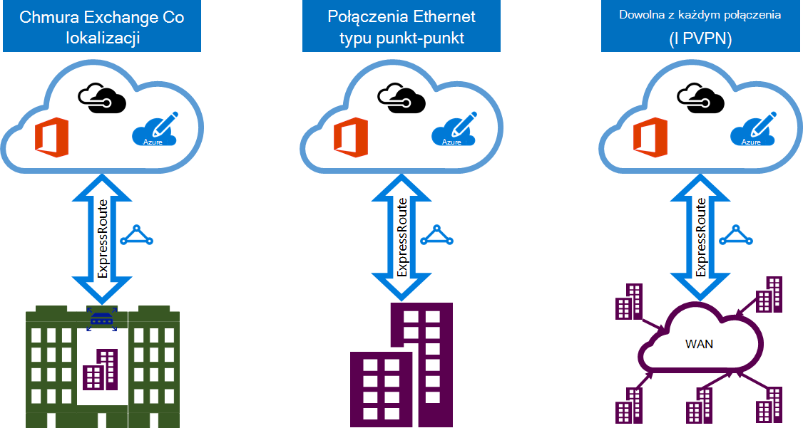

<properties 
   pageTitle="Wprowadzenie do ExpressRoute | Microsoft Azure"
   description="Ta strona zawiera omówienie usługi ExpressRoute, w tym, jak działa połączenie ExpressRoute."
   documentationCenter="na"
   services="expressroute"
   authors="cherylmc"
   manager="carmonm"
   editor=""/>
<tags 
   ms.service="expressroute"
   ms.devlang="na"
   ms.topic="get-started-article" 
   ms.tgt_pltfrm="na"
   ms.workload="infrastructure-services" 
   ms.date="10/10/2016"
   ms.author="cherylmc"/>

# Omówienie kwestii technicznych ExpressRoute

Microsoft Azure ExpressRoute umożliwia rozszerzanie sieci lokalnej w chmurze firmy Microsoft przez połączenie prywatne dedykowane ułatwić przez dostawcę łączności. Przy użyciu ExpressRoute można nawiązać połączenia z usługami w chmurze firmy Microsoft, takich jak Microsoft Azure, Office 365 i CRM Online. Łączność może być dowolna z każdym sieci (IP VPN), sieci Ethernet typu punkt-punkt lub wirtualnego połączenia między przez dostawcę łączności w funkcji współtworzenia lokalizacji. ExpressRoute połączenia nie przechodzą publicznie w Internecie. Dzięki temu ExpressRoute połączenia do oferowania więcej niezawodności, szybsze szybkości opóźnienia dolnym i lepsze zabezpieczenia niż typowy połączenia przez Internet.

**Kluczowe zalety:**

- Warstwy 3 łączność między sieci lokalnej i Cloud firmy Microsoft przez dostawcę łączności. Łączność może być dowolna z każdym sieci (IPVPN), połączenie typu punkt-punkt Ethernet lub za pośrednictwem wirtualnych połączenia między za pośrednictwem programu exchange Ethernet.
- Łączność z usługami w chmurze firmy Microsoft przez wszystkich regionów w regionie geopolitycznych.
- Globalny łączności z usługami firmy Microsoft przez wszystkich regionów z ExpressRoute premium dodatku.
- Dynamiczne routing między sieci i Microsoft przez branżowe standardowych protokołów (BGP).
- Wbudowane nadmiarowości w każdej peering lokalizacji wyższe niezawodności.
- Połączenie przestojów [Umowa dotycząca poziomu usług](https://azure.microsoft.com/support/legal/sla/).
- QoS i obsługa wielu rodzajów usługi dla aplikacji specjalnych, takich jak Skype dla firm.

Zobacz [ExpressRoute — często zadawane pytania](expressroute-faqs.md) , aby uzyskać więcej informacji.

## Jak połączyć sieci do firmy Microsoft przy użyciu ExpressRoute?

Można utworzyć połączenie między sieci lokalnej i w chmurze firmy Microsoft na trzy sposoby:

### Współtworzenie znajdujący się w chmurze programu exchange

Jeśli Współtworzenie firma znajduje się w miejscu z serwerem exchange w chmurze, można uporządkować połączeń między wirtualnych w chmurze firmy Microsoft za pośrednictwem dostawcy Współtworzenie lokalizacji Ethernet exchange. Współtworzenie lokalizacji dostawców mogą oferować warstwy 2 między połączenia lub zarządzanych Layer 3 między połączenia między infrastruktury w funkcji współtworzenia lokalizacji i w chmurze firmy Microsoft.

### Połączeń Ethernet typu punkt-punkt 

Umożliwia nawiązanie połączenia lokalnego centrach danych i biurami w chmurze firmy Microsoft przy użyciu łączy Ethernet typu punkt-punkt. Dostawców Ethernet typu punkt-punkt mogą oferować połączenia Layer 2 lub zarządzanych Layer 3 połączenia między witryny i w chmurze firmy Microsoft.

### Dowolna z każdym sieci (IPVPN)

Usługi WAN można zintegrować z chmury firmy Microsoft. IPVPN dostawców (zazwyczaj MPLS VPN) oferuje dowolna z każdym łączność między oddziałów i centrach danych. Chmury firmy Microsoft mogą połączona do swojego WAN, aby wyglądał tak samo jak inne oddziału. WAN dostawców oferuje zwykle zarządzanych łączności Layer 3. Funkcje i możliwości ExpressRoute są wszystkie identyczne we wszystkich powyższych modele usługi łączności. 

Łączność dostawców mogą oferować modele usługi łączności jeden lub więcej. Możesz pracować z dostawcą łączności wybierz modelu, który najbardziej Ci odpowiada.

## Funkcje ExpressRoute

ExpressRoute obsługuje następujące funkcje i możliwości: 

### Łączność warstwy 3

Microsoft przy użyciu standardowego dynamicznego routingu protokołu (BGP) do usługi exchange kieruje między sieci lokalnej usługi wystąpienia platformy Azure i Microsoft publicznych adresów.  Firma Microsoft ustanowić wiele sesji BGP z siecią profilów ruch innego. Więcej informacji można znaleźć w artykule [routing domen i obwód ExpressRoute](expressroute-circuit-peerings.md) .

### Nadmiarowości

Każdy obwód ExpressRoute składa się z dwóch połączeń Microsoft Enterprise krawędzi routerami (MSEEs) od dostawcy łączności / Twojej sieci krawędzi. Firma Microsoft wymaga dwóch BGP połączenie od dostawcy łączności / Twojej strony — jeden-do-każdego MSEE. Możesz wybrać nie wdrażanie zbędne urządzenia / Ethernet obwody wraz z końcem. Jednak dostawców łączności umożliwia upewnij się, że połączenia są przekazane do firmy Microsoft w sposób zbędne zbędne urządzenia. Zbędne konfiguracji łączności Layer 3 jest wymagane dla naszych [Umowa dotycząca poziomu usług](https://azure.microsoft.com/support/legal/sla/) jest nieprawidłowy. 

### Łączność z usługami w chmurze firmy Microsoft

[AZURE.INCLUDE [expressroute-office365-include](../../includes/expressroute-office365-include.md)]

ExpressRoute połączeń umożliwiają dostęp do następujących usług:

- Usługi Microsoft Azure
- Usługi Microsoft Office 365
- Usługi Microsoft CRM Online 
 
Można odwiedzić stronę [ExpressRoute — często zadawane pytania](expressroute-faqs.md) szczegółową listą usług obsługiwanych przez ExpressRoute.

### Łączność z wszystkich regionów w regionie geopolitycznych

Można połączyć z firmą Microsoft w jednej z naszych [zaglądanie lokalizacji](expressroute-locations.md) i mają dostęp do wszystkich regionów w obszarze geopolitycznych. 

Na przykład jeśli połączenie do firmy Microsoft w Amsterdam za pośrednictwem ExpressRoute, będzie miał dostęp do wszystkich usług chmury firmy Microsoft, obsługiwany w Europie północnej i Europa Zachodnia. Można znaleźć w artykule [ExpressRoute partnerów i lokalizacji zaglądanie](expressroute-locations.md) omówiono geopolitycznych regionów, skojarzone regionów chmury firmy Microsoft i odpowiadających im ExpressRoute zaglądanie folderów.

### Globalne łączność z dodatku premium ExpressRoute

Możesz włączyć tę funkcję dodatku premium ExpressRoute, aby rozszerzyć łączności granicami geopolitycznych. Na przykład po nawiązaniu połączenia do firmy Microsoft w Amsterdam za pośrednictwem ExpressRoute, konieczne będzie dostęp do wszystkich usług chmury firmy Microsoft, obsługiwany we wszystkich regionach na całym świecie (krajowe chmury są wyłączone). Masz dostęp do usług wdrożony w Azji i Australii w ten sam sposób uzyskiwania dostępu do regiony Północ i zachód Europe.

### Sformatowany łączności partnera ekosystemu

ExpressRoute ma stale rosnących ekosystemu łączności dostawców i partnerów tożsamości usługi. Można używać odwołań do artykułu [ExpressRoute dostawców i lokalizacji](expressroute-locations.md) , aby uzyskać najnowsze informacje.

### Nawiązywanie połączenia krajowe chmury

Microsoft działa środowiska chmury odizolowanych specjalne geopolitycznych regionów i segmentów klientów. Zapoznaj się z stronę [ExpressRoute dostawców i lokalizacji](expressroute-locations.md) dla listy krajowych chmury i dostawców.

### Opcje obsługiwane przepustowości

Możesz kupić scalone ExpressRoute dla szeroką gamę przepustowości. Poniżej przedstawiono listę obsługiwanych przepustowości. Należy skontaktować się z dostawcą łączności listy obsługiwanych przepustowości, które zapewniają.

- 50 MB/s
- 100 MB/s
- 200 MB/s
- 500 MB/s
- 1 GB
- 2 GB
- 5 GB
- 10 GB

### Dynamiczne skalowania przepustowości

Masz możliwość zwiększenia przepustowości elektrycznego ExpressRoute (w konkretnej sytuacji) bez konieczności usunąć połączenia. 

### Elastyczne modeli rozliczeń

Możesz wybrać model rozliczeń, która najbardziej Ci odpowiada. Wybieranie między modelami rozliczeń wymienione poniżej. Zapoznaj się z strony [ExpressRoute — często zadawane pytania](expressroute-faqs.md) , aby uzyskać więcej informacji. 

- **Nieograniczony danych**. Obwód ExpressRoute jest naliczany w oparciu o opłaty miesięcznej i wszystkich przychodzących i wychodzących transfer danych jest dołączany bez opłat. 
- **Taryfowe danych**. Obwód ExpressRoute jest naliczany w oparciu o opłaty miesięcznej. Wszystkie przychodzące transfer danych jest dostępne bezpłatnie. Transfer danych ruchu wychodzącego jest naliczany za GB przesyłania danych. Szybkość przesyłania zależy od regionu.
- **Dodatek premium ExpressRoute**. ExpressRoute premium jest dodatek obwód ExpressRoute. Dodatek premium ExpressRoute oferuje następujące możliwości: 
    - Limity lepszą trasę Azure publicznych i Azure prywatne zaglądanie z 4000 trasy do 10 000 marszrut.
    - Globalne łączności dla usług. Układ ExpressRoute utworzony w dowolnym regionie (z wyłączeniem krajowych chmury) uzyskuje dostęp do zasobów w innym regionie na świecie. Na przykład wirtualną sieć utworzone w Europie Zachód są dostępne za pośrednictwem obwód ExpressRoute obsługi administracyjnej w Dolinie Krzemowej.
    - Zwiększona liczba łączy VNet na obwód ExpressRoute od 10 do większy limit, w zależności od przepustowości obwodu.

## Następne kroki

- Informacje na temat ExpressRoute połączeń i kierowanie domen. Zobacz [ExpressRoute obwody elektryczne i układy domen routingu](expressroute-circuit-peerings.md).
- Znajdowanie dostawcy usługi. Zobacz [ExpressRoute partnerów i zaglądanie lokalizacji](expressroute-locations.md).
- Upewnij się, że są spełnione wszystkie wymagania wstępne. Zobacz [wymagania wstępne dotyczące ExpressRoute](expressroute-prerequisites.md).
- Zapoznaj się z wymaganiami [Routing](expressroute-routing.md), [translatora adresów Sieciowych](expressroute-nat.md) i [QoS](expressroute-qos.md).
- Konfigurowanie połączenia ExpressRoute.
    - [Tworzenie obwodu ExpressRoute](expressroute-howto-circuit-classic.md)
    - [Konfigurowanie routingu](expressroute-howto-routing-classic.md)
    - [Łącze VNet obwód ExpressRoute](expressroute-howto-linkvnet-classic.md)
