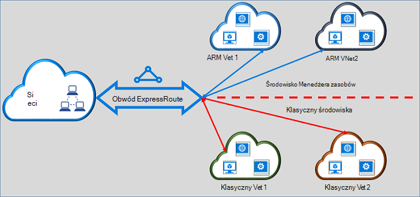

<properties
   pageTitle="Przenoszenie obwodów ExpressRoute od klasycznych do Menedżera zasobów | Microsoft Azure"
   description="Ta strona zawiera omówienie co należy wiedzieć o łączące klasycznego i modeli wdrażania Menedżera zasobów."
   documentationCenter="na"
   services="expressroute"
   authors="ganesr"
   manager="carmonm"
   editor=""/>
<tags
   ms.service="expressroute"
   ms.devlang="na"
   ms.topic="get-started-article"
   ms.tgt_pltfrm="na"
   ms.workload="infrastructure-services"
   ms.date="10/10/2016"
   ms.author="ganesr"/>

# Przenoszenie obwodów ExpressRoute z klasycznego modelu wdrożenia Menedżera zasobów

Ten artykuł zawiera omówienie znaczenie przenieść obwód Azure ExpressRoute z klasycznego modelu wdrożenia Azure Menedżera zasobów.

[AZURE.INCLUDE [vpn-gateway-sm-rm](../../includes/vpn-gateway-classic-rm-include.md)]

Pojedynczy obwód ExpressRoute umożliwia nawiązywanie połączenia z wirtualnych sieci wdrożonych klasycznego i modeli wdrażania Menedżera zasobów. Układ ExpressRoute niezależnie od tego, jak został utworzony, można teraz połączyć wirtualnych sieci w obu modelach wdrożenia.

## ExpressRoute obwodów, które są tworzone w modelu Klasyczny wdrażania

Obwodów ExpressRoute, które są tworzone w modelu Klasyczny wdrażania muszą zostać przeniesione do modelu wdrożenia Menedżera zasobów, najpierw łączność zarówno klasycznego, jak i modeli wdrażania Menedżera zasobów. Nie ma utraty łączności lub zakłóceń podczas połączenia został przeniesiony. Wszystkie łącza elektrycznego do wirtualnej sieci w modelu Klasyczny wdrożenia (w ramach tego samego subskrypcji i krzyżowe subskrypcji) są zachowywane.

Po pomyślnym zakończeniu Przenieś elektrycznego ExpressRoute wygląda, wykonuje i zdania dokładnie tak, jak obwodu ExpressRoute, w którym został utworzony model wdrożenia Menedżera zasobów. Teraz można utworzyć połączenia wirtualnej sieci w modelu wdrożenia Menedżera zasobów.

Po ExpressRoute elektrycznego został przeniesiony do modelu wdrożenia Menedżera zasobów cyklu życia obwodu ExpressRoute można zarządzać tylko przy użyciu modelu wdrożenia Menedżera zasobów. Oznacza to, można wykonywać operacje, takie jak dodawanie i aktualizowanie i usuwanie peerings aktualizowania właściwości obwodu (na przykład przepustowość, SKU i rozliczenia typu) i usuwania obwodów tylko w modelu wdrożenia Menedżera zasobów. Zapoznaj się z sekcją poniżej na obwodów, które są tworzone w modelu wdrożenia Menedżera zasobów szczegółowe informacje o jak mogą zarządzać dostępem do obu modeli wdrożenia.

Nie masz obejmują dostawcy połączenia w celu wykonywania czynności.

## ExpressRoute obwodów, które są tworzone w modelu wdrożenia Menedżera zasobów

Możesz włączyć obwodów ExpressRoute, które są tworzone w modelu wdrożenia Menedżera zasobów mają być dostępne z obu modeli wdrożenia. Wszelkie elektrycznego ExpressRoute w ramach subskrypcji można włączyć, można uzyskać dostęp z obu modeli wdrożenia.

- ExpressRoute obwodów, które zostały utworzone w modelu wdrożenia Menedżera zasobów nie ma dostępu do modelu Klasyczny wdrożenia domyślnie.
- Obwody ExpressRoute, które zostały przeniesione z modelu Klasyczny wdrożenia do modelu wdrożenia Menedżera zasobów są dostępne z obu modeli wdrażania domyślnie.
- Układ ExpressRoute zawsze ma dostęp do modelu wdrożenia Menedżera zasobów, niezależnie od tego, czy został utworzony w Menedżerze zasobów lub klasyczny wdrożenia modelu. Oznacza to, że możesz tworzyć połączenia wirtualnej sieci utworzone w modelu wdrożenia Menedżera zasobów, zgodnie z instrukcjami podanymi w [sposób połączenia wirtualnej sieci](expressroute-howto-linkvnet-arm.md).
- Dostęp do modelu Klasyczny wdrożenia sterują przez parametr **allowClassicOperations** w układzie ExpressRoute.

>[AZURE.IMPORTANT] Stosowanie wszystkich przydziałów opisane na stronie [usługi ograniczenia](../azure-subscription-service-limits.md) . Na przykład standardowy elektrycznego może mieć co najwyżej 10 połączenia wirtualnej sieci łączy i różnych zarówno klasycznego, jak i modeli wdrażania Menedżera zasobów.

## Kontrolowanie dostępu do modelu Klasyczny wdrażania

Możesz włączyć pojedynczy obwód ExpressRoute utworzyć łącze do wirtualnych sieci w obu modelach wdrożenia, ustawiając parametr **allowClassicOperations** obwodu ExpressRoute.

Ustawienie **allowClassicOperations** na wartość TRUE umożliwia łączenie wirtualnych sieci z obu modeli wdrażania z obwodem ExpressRoute. Można połączyć wirtualnych sieci w modelu Klasyczny wdrożenia, wykonując wytyczne dotyczące [sposobu łącze wirtualnych sieci w modelu Klasyczny wdrożenia](expressroute-howto-linkvnet-classic.md). Można połączyć wirtualnych sieci w modelu wdrożenia Menedżera zasobów, wykonując wytyczne dotyczące [sposobu łącze wirtualnych sieci w modelu wdrożenia Menedżera zasobów](expressroute-howto-linkvnet-arm.md).

Konfigurowanie **allowClassicOperations** dostępu FAŁSZ bloków konstrukcyjnych do układu z modelu Klasyczny wdrożenia. Jednak są zachowywane wszystkie łącza wirtualną sieć w modelu Klasyczny wdrożenia. W tym przypadku elektrycznego ExpressRoute nie jest widoczny w modelu Klasyczny wdrożenia.

## Obsługiwane operacje w modelu Klasyczny wdrażania

Gdy **allowClassicOperations** jest ustawiona na Prawda w obwód ExpressRoute są obsługiwane następujące operacje klasyczny:

 - Uzyskiwanie informacji elektrycznego ExpressRoute
 - Tworzenie/aktualizacja/get usuwanie wirtualną sieć łącza do klasyczny wirtualnych sieci
 - Tworzenie/aktualizacja/get usuwanie wirtualną sieć łącze zezwolenia na łączność między subskrypcji

Nie można wykonać następujące operacje klasyczny, gdy **allowClassicOperations** jest ustawiona na PRAWDA:

 - Tworzenie/aktualizacja/get usuwanie obramowania Gateway Protocol (BGP) peerings dla Azure publicznej prywatne, Azure i peerings firmy Microsoft
 - Usuwanie obwodów ExpressRoute

## Komunikacji między klasycznego i modeli wdrażania Menedżera zasobów

Obwód ExpressRoute zachowuje się jak mostka między klasycznego i modeli wdrażania Menedżera zasobów. Ruch między virtual machines w wirtualnych sieci w modelu Klasyczny wdrożenia i znajdującymi się w wirtualnych sieci w przepływach modelu wdrożenia Menedżera zasobów za pomocą ExpressRoute, jeśli oba wirtualnych sieci są połączone z ten sam obwód ExpressRoute.

Agreguj przepustowość jest ograniczona przez przepustowości bramy wirtualnej sieci. Ruch nie wprowadź w takich przypadkach dostawca łączności sieci lub sieci. Ruch między wirtualnych sieci w pełni znajduje się w sieci firmy Microsoft.

## Dostęp do publicznych Azure i zasoby zaglądanie firmy Microsoft

Nadal można uzyskać dostęp do zasobów, które są zwykle dostępne za pośrednictwem Azure zaglądanie publicznej i Microsoft zaglądanie bez zakłóceń.  

## Jakie funkcje są obsługiwane

W tej sekcji opisano, co jest obsługiwane dla obwodów ExpressRoute:

 - Pojedynczy obwód ExpressRoute umożliwia dostęp do sieci wirtualne, które są rozmieszczane w klasycznym i modeli wdrażania Menedżera zasobów.
 - Możesz przenieść obwód ExpressRoute od klasycznego modelu wdrożenia Menedżera zasobów. Po przeniesieniu, obwód ExpressRoute wygląda, zdania i jak inne obwodu ExpressRoute, tworzonym w modelu wdrożenia Menedżera zasobów.
 - Możesz przenieść układzie ExpressRoute. Nie można przenieść łącza elektrycznego, wirtualnych sieci i bramy sieci VPN za pomocą tej operacji.
 - Po ExpressRoute elektrycznego został przeniesiony do modelu wdrożenia Menedżera zasobów cyklu życia obwodu ExpressRoute można zarządzać tylko przy użyciu modelu wdrożenia Menedżera zasobów. Oznacza to, można wykonywać operacje, takie jak dodawanie i aktualizowanie i usuwanie peerings aktualizowania właściwości obwodu (na przykład przepustowość, SKU i rozliczenia typu) i usuwania obwodów tylko w modelu wdrożenia Menedżera zasobów.
 - Obwód ExpressRoute zachowuje się jak mostka między klasycznego i modeli wdrażania Menedżera zasobów. Ruch między virtual machines w wirtualnych sieci w modelu Klasyczny wdrożenia i znajdującymi się w wirtualnych sieci w przepływach modelu wdrożenia Menedżera zasobów za pomocą ExpressRoute, jeśli oba wirtualnych sieci są połączone z ten sam obwód ExpressRoute.
 - Łączność między subskrypcji jest obsługiwana w zarówno klasycznego, jak i modeli wdrażania Menedżera zasobów.

## Co nie jest obsługiwane

W tej sekcji opisano, co nie jest obsługiwane dla obwodów ExpressRoute:

 - Przenoszenie łącza elektrycznego, bramy i wirtualnych sieci z klasycznego modelu wdrożenia Menedżera zasobów.
 - Zarządzanie cyklu życia obwód ExpressRoute z modelu Klasyczny wdrożenia.
 - Oparta na rolach kontrola dostępu (RBAC) obsługę modelu Klasyczny wdrożenia. Nie możesz wykonywać RBAC kontrolek w celu obwodu w modelu Klasyczny wdrożenia. Dowolny administrator-coadministrator subskrypcji można połączyć lub odłączyć wirtualnych sieci z obwodem.

## Konfiguracja

Wykonaj instrukcje opisane w [Przenoszenie obwód ExpressRoute od klasycznych do modelu wdrożenia Menedżera zasobów](expressroute-howto-move-arm.md).

## Następne kroki

- Aby uzyskać informacje o przepływie pracy zobacz [elektrycznego ExpressRoute inicjowania obsługi administracyjnej, przepływy pracy i Stany obwodów](expressroute-workflows.md).
- Aby skonfigurować połączenie ExpressRoute:

    - [Tworzenie obwodu ExpressRoute](expressroute-howto-circuit-arm.md)
    - [Konfigurowanie routingu](expressroute-howto-routing-arm.md)
    - [Łącze wirtualnej sieci układ ExpressRoute](expressroute-howto-linkvnet-arm.md)
