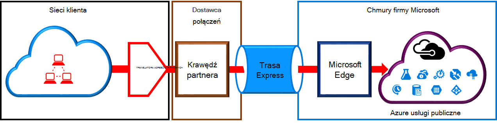
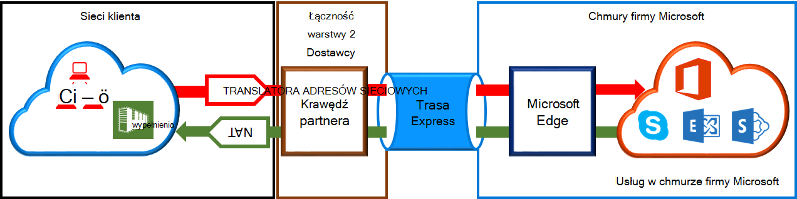

<properties
   pageTitle="Wymagania dotyczące translatora adresów Sieciowych dla obwodów ExpressRoute | Microsoft Azure"
   description="Ta strona zawiera szczegółowe wymagania dotyczące konfigurowania i zarządzania nimi translatora adresów Sieciowych dla obwodów ExpressRoute."
   documentationCenter="na"
   services="expressroute"
   authors="cherylmc"
   manager="carmonm"
   editor=""/>
<tags
   ms.service="expressroute"
   ms.devlang="na"
   ms.topic="get-started-article"
   ms.tgt_pltfrm="na"
   ms.workload="infrastructure-services"
   ms.date="10/10/2016"
   ms.author="cherylmc"/>

# Wymagania dotyczące ExpressRoute translatora adresów Sieciowych

Aby połączyć się z usługami w chmurze firmy Microsoft przy użyciu ExpressRoute, musisz skonfigurować i zarządzać nimi NAT. Niektórych dostawców łączności oferują konfigurowaniu i zarządzaniu nimi translatora adresów Sieciowych jako zarządzanych usług. Skontaktuj się z dostawcą łączności, aby zobaczyć, jeśli oferują usługi sieci. Jeśli nie, muszą spełniać wymagania opisane poniżej. 

Sprawdź stronę [ExpressRoute obwody elektryczne i układy domen routingu](expressroute-circuit-peerings.md) zawiera omówienie różnych domen routingu. Aby spełniają wymagania adres IP publicznej Azure publicznej i zaglądanie firmy Microsoft, zaleca się, że konfigurowanie translatora adresów Sieciowych między sieci i Microsoft. Ta sekcja zawiera szczegółowy opis infrastruktury translatora adresów Sieciowych, które należy skonfigurować.

## Wymagania dotyczące Azure zaglądanie publicznej związane z translatora adresów Sieciowych

Azure publicznej ścieżkę peering umożliwia łączenie się z usługami wszystkie obsługiwane platformy Azure na ich publicznych adresów IP. Należą do usług wymienionych w sekcji [Często zadawane pytania dotyczące ExpessRoute](expressroute-faqs.md) i usług obsługiwanych przez niezależnych dostawców oprogramowania firmy Microsoft Azure. Nawiązywanie połączenia usługi Microsoft Azure na publicznej zaglądanie jest zawsze inicjowane z sieci do sieci firmy Microsoft. Ruchu przeznaczonego dla Microsoft Azure na publicznej zaglądanie musi być SNATed prawidłowych publicznych adresów IP protokołu IPv4 przed mogą wejść do sieci firmy Microsoft. Poniższy rysunek przedstawia wysokiego poziomu obrazu jak translatora adresów Sieciowych można ustawić maksymalnie wymaganie powyżej.

 

### Anonse puli i rozsyłania translatora adresów IP

Należy się upewnić, że ruch jest wprowadzanie Azure publicznej ścieżki peering z prawidłowy publiczny adres IP protokołu IPv4. Microsoft muszą mieć możliwość sprawdzania poprawności własność puli adresów IP protokołu IPv4 NAT przed regionalne routingu rejestru Internet (RIR) lub rejestru routingu internetowego (IRR). Będą sprawdzane w zależności od liczby jako jest peered z i adresy IP używane dla translatora adresów sieciowych. Zapoznaj się z stronę [wymagania routingu ExpressRoute](expressroute-routing.md) dla informacji dotyczących routingu rejestrów.
 
Nie ma żadnych ograniczeń długości ogłaszane przez ten zaglądanie prefiks translatora adresów IP. Należy monitorować puli translatora adresów Sieciowych i upewnij się, że użytkownik nie zginą sesji translatora adresów Sieciowych.

>[AZURE.IMPORTANT] Pula translatora adresów IP ogłaszane do firmy Microsoft musi nie były ogłaszane w Internecie. Spowoduje to przerwanie łączności z innych usług firmy Microsoft.

## Wymagania dotyczące translatora adresów Sieciowych dla zaglądanie firmy Microsoft

Ścieżka peering firmy Microsoft umożliwia nawiązywanie połączenia z usługami firmy Microsoft w chmurze, które nie są obsługiwane przez Azure publicznej ścieżkę peering. Na liście usług obejmuje usługi Office 365, takie jak usługi Exchange Online, usłudze SharePoint Online, w programie Skype dla firm i CRM Online. Microsoft oczekuje obsługuje dwukierunkową łączność zaglądanie firmy Microsoft. Ruchu przeznaczonego dla usług w chmurze firmy Microsoft musi być SNATed prawidłowych publicznych adresów IP protokołu IPv4, zanim mogą wejść do sieci firmy Microsoft. Ruchu przeznaczonego dla sieci z usług w chmurze firmy Microsoft musi być SNATed przed ich dostać się do sieci. Poniższy rysunek przedstawia wysokiego poziomu obrazu jak translatora adresów Sieciowych powinny być Instalatora systemu Microsoft zaglądanie.
 
 

#### Ruch pochodzący z sieci przeznaczone do firmy Microsoft

- Należy się upewnić, że ruch jest wprowadzanie ścieżki peering firmy Microsoft z prawidłowy publiczny adres IP protokołu IPv4. Microsoft muszą mieć możliwość sprawdzania poprawności właściciela puli adresów IP protokołu IPv4 NAT przed regionalne rejestru internet routingu (RIR) lub rejestru routingu internetowego (IRR). Będzie można sprawdzić na podstawie numer AS jest peered z i adresy IP używane dla translatora adresów sieciowych. Zapoznaj się z stronę [wymagania routingu ExpressRoute](expressroute-routing.md) dla informacji dotyczących routingu rejestrów.

- Za pośrednictwem sesji BGP, nie były ogłaszane adresy IP używane Azure publicznej ustawień peering i innych obwodów ExpressRoute do firmy Microsoft. Nie ma żadnych ograniczeń długości ogłaszane za pośrednictwem tego zaglądanie prefiks translatora adresów IP.

    >[AZURE.IMPORTANT] Pula translatora adresów IP ogłaszane do firmy Microsoft musi nie były ogłaszane w Internecie. Spowoduje to przerwanie łączności z innych usług firmy Microsoft.

#### Ruch pochodzący od firmy Microsoft przeznaczone do sieci

- Niektórych scenariuszach wymagają firmy Microsoft zainicjować łączności do punktów końcowych usługi hostowanej w obrębie tej samej sieci. Typowy przykład scenariusza będzie łączność z serwerami ADFS obsługiwany w sieci z usługi Office 365. W takich przypadkach możesz pamięci odpowiednie prefiksy z sieci do zaglądanie firmy Microsoft. 

- Musisz najpierw ruch SNAT przeznaczone do adresów IP w sieci firmy Microsoft. 

## Następne kroki

- Zapoznaj się z wymaganiami [trasowanie](expressroute-routing.md) i [QoS](expressroute-qos.md).
- Aby uzyskać informacje o przepływie pracy zobacz [elektrycznego ExpressRoute inicjowania obsługi administracyjnej, przepływy pracy i Stany obwodów](expressroute-workflows.md).
- Konfigurowanie połączenia ExpressRoute.

    - [Tworzenie obwodu ExpressRoute](expressroute-howto-circuit-classic.md)
    - [Konfigurowanie routingu](expressroute-howto-routing-classic.md)
    - [Łącze VNet obwód ExpressRoute](expressroute-howto-linkvnet-classic.md)

