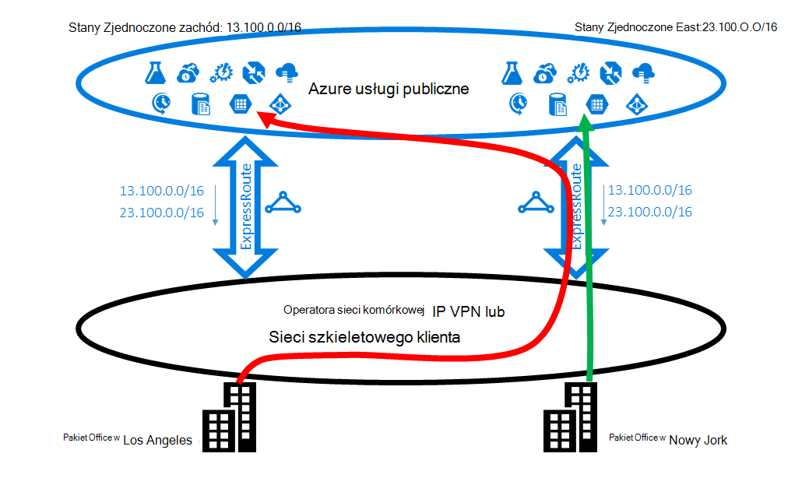

<properties
   pageTitle="Optymalizowanie routingu ExpressRoute | Microsoft Azure"
   description="Ta strona zawiera szczegółowe informacje o tym, jak zoptymalizować routingu, gdy odbiorca ma więcej niż jedną obwodów ExpressRoute, które połączenie między firmy Microsoft i sieci corp klienta."
   documentationCenter="na"
   services="expressroute"
   authors="charwen"
   manager="carmonm"
   editor=""/>
<tags
   ms.service="expressroute"
   ms.devlang="na"
   ms.topic="get-started-article"
   ms.tgt_pltfrm="na"
   ms.workload="infrastructure-services"
   ms.date="10/10/2016"
   ms.author="charwen"/>

# Optymalizowanie ExpressRoute routingu
Jeśli masz wiele obwodów ExpressRoute, masz więcej niż jedną ścieżkę, aby połączyć z firmą Microsoft. W wyniku utratę jakości routingu może wystąpić - oznacza to, że ruchu może potrwać dłużej ścieżka do osiągnięcia firmy Microsoft i firmy Microsoft z siecią. Dłuższy ścieżki sieciowej, wyższa opóźnienie. Opóźnienie ma bezpośredni wpływ na wydajność i użytkownika obsługi aplikacji. Ten artykuł będzie przedstawić ten problem i wyjaśniono, jak zoptymalizować routingu przy użyciu standardowych technologii routingu.

## Utratę jakości routingu przypadku 1
Spójrzmy Zamknij routingu problemu według przykładu. Załóżmy, że masz dwie oddziałów w Stanach Zjednoczonych, w jednym w Nowy Jork i Los Angeles. Biurami są połączone na szerokości obszaru sieć WAN, sieci szkieletowego lub dostawca usług VPN adresów IP. Są dwa obwody ExpressRoute, w nam zachód i jedną nam Wschodzie, które są również połączone w sieci WAN. Oczywiście masz dwie ścieżki, aby nawiązać połączenie z siecią firmy Microsoft. Teraz załóżmy masz Azure wdrażania (np. Usługa aplikacji Azure) w programach nam zachód i wschód nam. Masz zamiar polega na połączeniu użytkowników w Los Angeles Azure nam zachód i użytkowników w Nowym Jorku Azure nam wschód, ponieważ administrator usługi anonsuje, czy użytkownicy w każdy urząd dostęp pobliżu usługi Azure dla optymalnego środowiska. Niestety plan sprawdza również dla użytkowników wschodniego, ale nie dla użytkowników Zachód. Przyczyną tego problemu jest następująca. Obwód ExpressRoute możemy ogłaszanie użytkownikowi zarówno prefiksu Azure nam Wschodzie (23.100.0.0/16), jak i prefiksu w Azure nam zachód (13.100.0.0/16). Jeśli nie wiesz, jakie prefiksu pochodzi z których region, nie jest możliwe traktowania jej inaczej. Sieci WAN może być traktować zarówno prefiksy są bliżej nam wschód niż nam zachód i w związku z tym rozsyłanie użytkownicy pakietu office z obwodem ExpressRoute nam Wschodzie. W końcu konieczne będzie wielu użytkowników Smutna w pakiecie office Los Angeles.

### Rozwiązanie: Użyj BGP społeczności
Aby zoptymalizować routingu dla obu użytkowników pakietu office, należy wiedzieć, które prefiks pochodzi z Azure nam zachód i które z Azure nam Wschodu. Firma Microsoft kodowanie tych informacji przy użyciu [wartości BGP społeczności](expressroute-routing.md). Firma Microsoft zostały przypisane unikatowe wartości BGP Wspólnoty do każdego regionu Azure, np. "12076:51004" dla nas wschód, "12076:51006" nam Zachód. Teraz, gdy wiesz, którego prefiks jest z których Azure regionu, można skonfigurować, które elektrycznego ExpressRoute powinny mieć pierwszeństwo. Ponieważ firma Microsoft korzysta z BGP do wymiany informacji dotyczących routingu umożliwia BGP w lokalnym preferencji wpływają na routing. W naszym przykładzie można przypisać wyższa wartość preferencji lokalne do 13.100.0.0/16 w nam zachód niż nam Wschodzie, a podobnie wyższa wartość lokalny preferencji 23.100.0.0/16 nam wschodzie niż w nam Zachód. Ta konfiguracja będzie upewnij się, gdy dostępne są oba ścieżki do firmy Microsoft, użytkowników w Los Angeles weźmie elektrycznego ExpressRoute w zachód nam nawiązać Azure nam zachód użytkownikom w Nowym Jorku podjąć ExpressRoute nam wschodzie Azure nam Wschód. Routing jest zoptymalizowana pod na obu stronach arkusza. 

## Utratę jakości przypadku routingu 2
Oto kolejny przykład miejsce, w którym połączenia przez firmę Microsoft zajmują dłuższa ścieżka nawiązywać połączenia z siecią. W tym przypadku za pomocą lokalne serwery Exchange i usługi Exchange Online w [środowisku hybrydowym](https://technet.microsoft.com/library/jj200581%28v=exchg.150%29.aspx). Biurami są podłączone do sieci WAN. Ogłaszanie prefiksy lokalnych serwerów zarówno biur do firmy Microsoft przez dwa obwody ExpressRoute. Exchange Online inicjowanie połączeń z serwerami lokalnego w przypadku migracji skrzynek pocztowych. Niestety połączenie z pakietu office Los Angeles jest przekierowywane do elektrycznego ExpressRoute nam wschodzie przed przechodzenie przez cały kontynent wstecz Zachód. Przyczyną tego problemu jest podobna do pierwszego. Bez wszelkie wskazówki Microsoft network nie wiadomo, które prefiksy klienta jest zbliżony nam Wschód i które z nich jest zbliżony nam Zachód. Tak się dzieje wybierz problem ścieżka do pakietu office w Los Angeles.

### Rozwiązanie: Użyj ścieżki jako prepending
Istnieją dwa rozwiązania tego problemu. Pierwszy jest po prostu ogłaszanie usługi prefiksu lokalnego dla pakietu office Los Angeles 177.2.0.0/31 obwód ExpressRoute w nam zachód oraz z lokalnego prefiks dla pakietu office Nowy Jork 177.2.0.2/31 obwód ExpressRoute nam Wschodzie. W wyniku istnieje tylko jedna ścieżka dla firmy Microsoft nawiązać połączenie poszczególnych biur. Jest nie niejednoznaczności i routingu jest zoptymalizowany. Z tego projektu należy wziąć pod uwagę strategii dotyczącej pracy awaryjnej. W przypadku, gdy ścieżkę do firmy Microsoft przy użyciu ExpressRoute zostało przerwane, należy upewnić się, że usługi Exchange Online nadal łączyć się z lokalne serwery. 

Drugim rozwiązaniem jest nadal ogłaszanie oba prefiksów na obu obwodów ExpressRoute, oraz ponadto Przekaż nam wskazówkę, które prefiksu zbliża się do nich biur. Ponieważ obsługujemy prepending BGP jako ścieżkę, można skonfigurować jako ścieżkę dla swojego prefiksu wpływ na routing. W tym przykładzie możesz zwiększyć ŚCIEŻKĘ jako 172.2.0.0/31 nam wschodzie tak, aby firma Microsoft będzie wolisz układzie ExpressRoute nam zachód dla ruchu przeznaczonego dla tego prefiksu (jak naszej sieci będzie wydaje się, że ścieżka do tego prefiksu jest krótsza w zachód). Podobnie możesz zwiększyć ŚCIEŻKĘ jako 172.2.0.2/31 w nam zachód tak, aby firma Microsoft będzie wolisz elektrycznego ExpressRoute nam Wschodzie. Routing jest zoptymalizowana pod kątem obu oddziałów. Z tego projektu Jeśli jeden obwód ExpressRoute zostało przerwane, usługi Exchange Online można nadal otrzymywanych przy użyciu innego elektrycznego ExpressRoute i sieci WAN. 

>[AZURE.IMPORTANT] Firma Microsoft usuwanie prywatnych jako liczby w ŚCIEŻCE jako dla prefiksów odebranych w Peering firmy Microsoft. Musisz dołączyć publicznej jako liczby w ŚCIEŻCE jako wpływ na routing Peering firmy Microsoft.

>[AZURE.IMPORTANT] Przykłady podane tutaj są dla firmy Microsoft i peerings publicznej, możemy obsługę takie same możliwości zaglądanie prywatne. Ponadto jako ścieżka prepending works w jeden pojedynczy obwód ExpressRoute wpływ zaznaczenia ścieżki głównego i pomocniczego.
