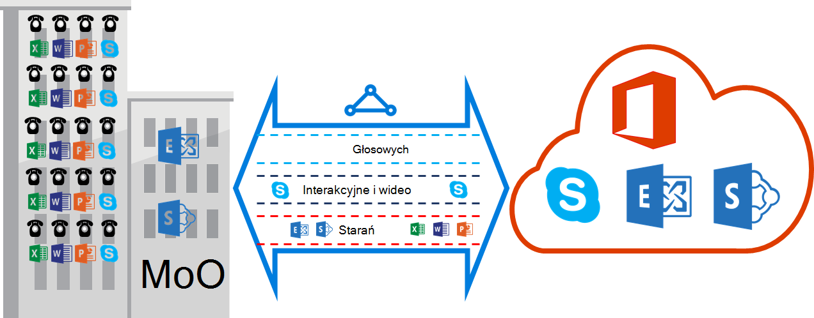

<properties
   pageTitle="QoS wymagania dotyczące ExpressRoute | Microsoft Azure"
   description="Ta strona zawiera szczegółowe wymagania dotyczące konfigurowania i zarządzania nimi QoS dla obwodów ExpressRoute."
   documentationCenter="na"
   services="expressroute"
   authors="cherylmc"
   manager="carmonm"
   editor=""/>
<tags
   ms.service="expressroute"
   ms.devlang="na"
   ms.topic="get-started-article"
   ms.tgt_pltfrm="na"
   ms.workload="infrastructure-services"
   ms.date="10/10/2016"
   ms.author="cherylmc"/>

# Wymagania dotyczące ExpressRoute QoS

Program Skype dla firm ma różne obciążenia, które wymagają zróżnicowane traktowanie QoS. Jeśli planujesz do korzystania z usług głosowych za pośrednictwem ExpressRoute, należy przestrzegać wymagania opisane poniżej.

>[AZURE.NOTE] Wymagania QoS dotyczą tylko zaglądanie oprogramowania firmy Microsoft. Wartości DSCP w ruch w tej sieci odebranych w Azure zaglądanie publicznej i Azure zaglądanie prywatne zostaną zresetowane 0. 

Poniższa tabela zawiera listę oznaczeń DSCP używane przez program Skype dla firm. Aby uzyskać więcej informacji, zapoznaj się [Zarządzanie QoS dla programu Skype dla firm](https://technet.microsoft.com/library/gg405409.aspx) .

| **Ruch zajęć** | **Traktowanie (oznaczania DSCP)** | **W programie Skype dla firm obciążenia** |
|---|---|---|
| **Głosowej** | EF (46) | Skype-głosowych programu Lync |
| **Interakcyjne** | AF41 (34) | Klip wideo |
|   | AF21 (18) | Udostępnianie aplikacji | 
| **Domyślne** | AF11 (10) | Transfer plików|
|   | CS0 (0) | Czy coś jeszcze| 

- Należy klasyfikować obciążenie pracą i oznaczanie prawo wartości DSCP. Postępuj zgodnie z udostępnionymi wskazówkami [w tym miejscu](https://technet.microsoft.com/library/gg405409.aspx) na temat ustawiania oznaczenia DSCP w sieci.

- Należy skonfigurować i obsługi wielu kolejek QoS w sieci. Głosu należy klasy autonomicznego i traktowane EF określonego w RFC 3246. 

- Możesz zdecydować, kolejkowanie mechanizmu, zasady wykrywania przeciążeń i przydzielanie przepustowości na ruch zajęć. Jednak oznaczenia dla programu Skype dla firm obciążenia DSCP mają zostać zachowane. Jeśli korzystasz z oznaczenia DSCP nie wymienionych powyżej, np. AF31 (26) muszą zmodyfikować wartość DSCP 0 przed wysłaniem go do firmy Microsoft. Firma Microsoft wysyła tylko pakiety oznaczone symbolem wartość DSCP pokazano w powyższej tabeli. 

## Następne kroki

- Zapoznaj się z wymaganiami [trasowanie](expressroute-routing.md) i [translatora adresów Sieciowych](expressroute-nat.md).
- Zobacz poniższe łącza, aby skonfigurować połączenie ExpressRoute.

    - [Tworzenie obwodu ExpressRoute](expressroute-howto-circuit-classic.md)
    - [Konfigurowanie routingu](expressroute-howto-routing-classic.md)
    - [Łącze VNet obwód ExpressRoute](expressroute-howto-linkvnet-classic.md)
