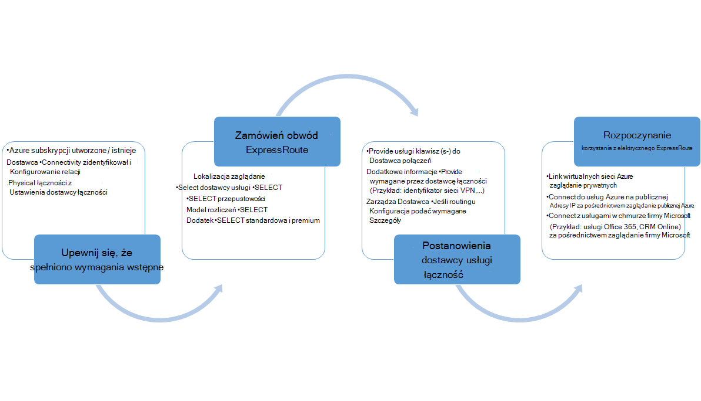
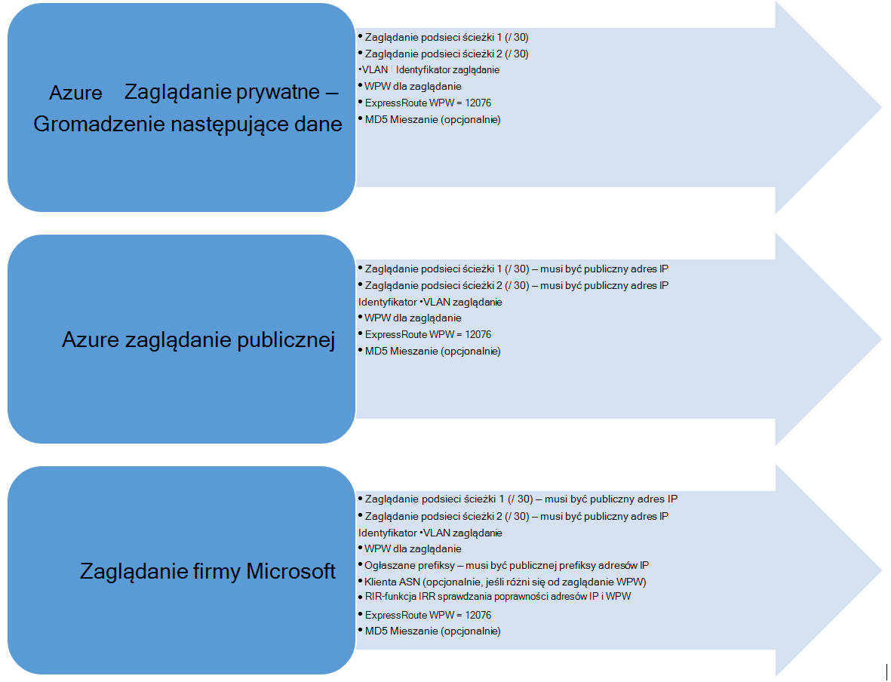

<properties
   pageTitle="Przepływy pracy dla Konfigurowanie obwód ExpressRoute | Microsoft Azure"
   description="Ta strona przeprowadzi Cię przez przepływy pracy dla Konfigurowanie obwód ExpressRoute i peerings"
   documentationCenter="na"
   services="expressroute"
   authors="cherylmc"
   manager="carmonm"
   editor="" />
<tags
   ms.service="expressroute"
   ms.devlang="na"
   ms.topic="article" 
   ms.tgt_pltfrm="na"
   ms.workload="infrastructure-services"
   ms.date="10/10/2016"
   ms.author="cherylmc"/>

# Przepływy pracy ExpressRoute dla elektrycznego inicjowania obsługi administracyjnej i Stany obwodów

Ta strona przeprowadzi Cię przez usługę routing konfiguracji przepływy pracy na wysokim poziomie i inicjowania obsługi administracyjnej.

Przedstawiony poniżej rysunek i odpowiadające mu kroki Pokaż zadania, które należy wykonać w celu obwód ExpressRoute obsługi administracyjnej zakończenia do końca. 

1. Aby skonfigurować obwód ExpressRoute za pomocą programu PowerShell. Postępuj zgodnie z instrukcjami w artykule [Tworzenie ExpressRoute obwodów](expressroute-howto-circuit-classic.md) uzyskać więcej szczegółowych informacji.

2. Kolejność połączenie od dostawcy usług. Ten proces zmienia się. Aby uzyskać więcej informacji na temat zamówień łączności, skontaktuj się z dostawcą łączności.

3. Upewnij się, że obwód zainicjowano pomyślnie sprawdzając elektrycznego ExpressRoute inicjowania obsługi administracyjnej stanu przy użyciu programu PowerShell. 

4. Konfigurowanie domen routingu. Jeśli dostawca łączności zarządza Layer 3 dla Ciebie, ich konfigurowania routingu dla swojego obwodu. Jeśli dostawca łączności oferuje tylko warstwy 2 usługi, musisz skonfigurować routing zgodnie z wytycznymi opisanych na stronach [routingu wymagania](expressroute-routing.md) i [konfiguracji routingu](expressroute-howto-routing-classic.md) .

    -  Włączanie Azure zaglądanie prywatne — należy włączyć ten zaglądanie do nawiązywanie połączenia z maszyny wirtualne / wdrożony w wirtualnych sieci usług w chmurze.
    -  Włączanie Azure zaglądanie publicznej — należy włączyć Azure publicznej zaglądanie Jeśli chcesz połączyć się z usługami Azure hostowana w publicznych adresów IP. Jest to wymagane, aby uzyskać dostęp do Azure zasobów, jeśli wybrano opcję Włącz routing domyślny dla Azure zaglądanie prywatne.
    -  Włączanie zaglądanie firmy Microsoft — musi włączyć tę do CRM online usług i dostęp do usługi Office 365. 
    
    >[AZURE.IMPORTANT] Należy się upewnić, że korzystasz z osobnych serwera proxy / krawędzi, aby połączyć do firmy Microsoft niż za pomocą w Internecie. Za pomocą tej samej krawędzi zarówno ExpressRoute, jak i Internet powodować asymetrycznym routingu i powodować dostawie łączność w sieci.

    

5. Łączenie sieci wirtualne obwody ExpressRoute - wirtualnych sieci można połączyć z obwodem ExpressRoute. Wykonaj instrukcje, [Aby połączyć VNets](expressroute-howto-linkvnet-arm.md) z obwodem. Te VNets mogą być w tej samej subskrypcji Azure jako elektrycznego ExpressRoute lub mogą znajdować się w innej subskrypcji.

## Obwód ExpressRoute inicjowania obsługi administracyjnej Państwa

Każdy obwód ExpressRoute ma dwa stany:

- Stan obsługi administracyjnej usługi dostawcy
- Stan

Stan przedstawia stan obsługi administracyjnej firmy Microsoft. Ta właściwość jest ustawiony na włączone, podczas tworzenia obwód Expressroute

Stan obsługi administracyjnej dostawcy łączności przedstawia stan na stronie dostawcy łączności. Może być go *NotProvisioned*, *obsługi*lub *Provisioned*. Obwód ExpressRoute muszą być w stanie Provisioned dla Ciebie można było jej używać.

### Możliwe stany obwód ExpressRoute

W tej sekcji przedstawiono się możliwe stany obwód ExpressRoute.

#### W czasie tworzenia

Zostanie wyświetlona elektrycznego ExpressRoute w następującym stanie zaraz po uruchomieniu polecenia cmdlet programu PowerShell, aby utworzyć obwód ExpressRoute.

    ServiceProviderProvisioningState : NotProvisioned
    Status                           : Enabled

#### Dostawca połączeń w przypadku podczas inicjowania obsługi administracyjnej obwodu

Zostanie wyświetlona elektrycznego ExpressRoute w następującym stanie natychmiast przekazywane klucza usługi dostawcy łączności i zaczęły procesu inicjowania obsługi administracyjnej.

    ServiceProviderProvisioningState : Provisioning
    Status                           : Enabled

#### Kiedy dostawcy połączenia zakończyło się procesu obsługi administracyjnej

Obwód ExpressRoute w następującym stanie zostanie wyświetlony po zainicjowaniu dostawcy łączności zakończeniu procesu inicjowania obsługi administracyjnej.

    ServiceProviderProvisioningState : Provisioned
    Status                           : Enabled

Obsługi administracyjnej i jest włączone tylko stan obwodu może być dla Ciebie można było jej używać. Jeśli korzystasz z dostawcą warstwy 2, można skonfigurować routingu dla swojego obwodu tylko wtedy, gdy znajdzie się w tym stanie.

#### Gdy dostawca łączności jest cofanie ubezpieczeń obwodu

Jeśli wymagane usługodawcy deprovision obwód ExpressRoute, zostanie wyświetlony elektrycznego ustawić stan następujących po deprovisioning proces dostawcy usługi.

    ServiceProviderProvisioningState : NotProvisioned
    Status                           : Enabled

Możesz ponownie włączyć potrzeby lub używania poleceń cmdlet programu PowerShell, aby usunąć obwodu.  

>[AZURE.IMPORTANT] Po uruchomieniu polecenia cmdlet programu PowerShell, aby usunąć elektrycznego podczas inicjowania obsługi administracyjnej ServiceProviderProvisioningState lub Provisioned operacji zakończy się niepowodzeniem. We współpracy z dostawcą łączności, aby najpierw deprovision obwód ExpressRoute, a następnie usuń łącze. Firma Microsoft będzie do do momentu uruchomienia polecenia cmdlet programu PowerShell, aby usunąć obwodu elektrycznego.

## Stan konfiguracji routingu sesji

BGP inicjowania obsługi administracyjnej stan pozwala sprawdzić, czy włączono sesji BGP na krawędzi firmy Microsoft. Stan musi być włączona dla Ciebie można było używać zaglądanie.

Należy sprawdzić stan sesji BGP, szczególnie w przypadku zaglądanie firmy Microsoft. Oprócz BGP inicjowania obsługi administracyjnej stan istnieje inny stan o nazwie *ogłaszane stan prefiksy publicznej*. Stan anonsowanego prefiksy publicznej musi być w stanie *skonfigurowane* , zarówno dla sesji BGP, aby być w górę i routingu pracy zakończenia do końca. 

Jeśli stan anonsowanego prefiksu publicznej jest ustawiona do *potrzeb sprawdzania poprawności* stanu, sesji BGP nie jest włączona, podczas prefiksów anonsowanych niezgodny numer AS w dowolnym routingu kancelarii. 

>[AZURE.IMPORTANT] Jeśli stan anonsowanego prefiksy publicznej jest w stanie *Ręczne sprawdzanie poprawności* , otwórz bilet pomocy technicznej z [pomocy technicznej firmy Microsoft](https://portal.azure.com/?#blade/Microsoft_Azure_Support/HelpAndSupportBlade) i przedstawić dowód, że jesteś właścicielem adresów IP ogłaszane wzdłuż z numerem skojarzone systemu autonomicznego.

## Następne kroki

- Konfigurowanie połączenia ExpressRoute.

    - [Tworzenie obwodu ExpressRoute](expressroute-howto-circuit-arm.md)
    - [Konfigurowanie routingu](expressroute-howto-routing-arm.md)
    - [Łącze VNet obwód ExpressRoute](expressroute-howto-linkvnet-arm.md)
