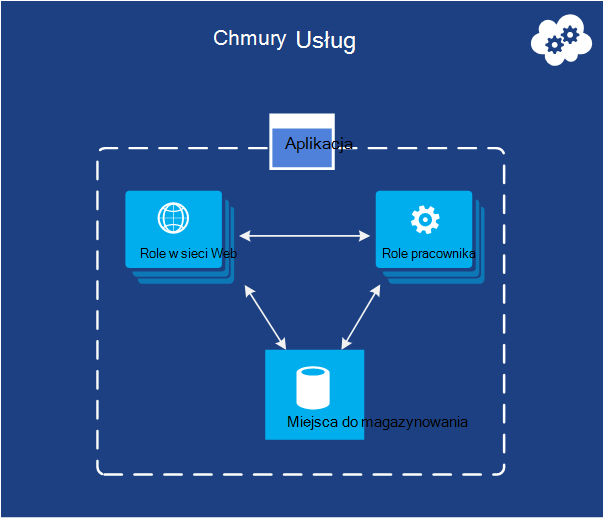

<properties
    pageTitle="Wprowadzenie do programu Microsoft Azure | Microsoft Azure"
    description="Jesteś nowym użytkownikiem platformy Microsoft Azure? Omówienie podstawowych usług oferuje z przykładami jak są przydatne."
    services=" "
    documentationCenter=".net"
    authors="rboucher"
    manager="carolz"
    editor=""/>

<tags
    ms.service="multiple"
    ms.workload="multiple"
    ms.tgt_pltfrm="na"
    ms.devlang="na"
    ms.topic="article"
    ms.date="06/30/2015"  
    ms.author="robb"/>

# Wprowadzenie do programu Microsoft Azure

Microsoft Azure jest platformy aplikacji firmy Microsoft dla publicznej chmury.  Celem tego artykułu jest zapewniają podstawę dla zrozumienia podstawy Azure, nawet jeśli nie wiesz, jakiekolwiek założenia dotyczące chmury korzystania z komputera.

**Jak w tym artykule**

Azure rośnie cały czas, aby łatwo uzyskać nadmiernie.  Rozpoczyna się podstawowe usług, które są najpierw wymienione w tym artykule, a następnie przejdź do dodatkowych usług. Nie oznacza to, nie można używać tylko usługi dodatkowe samodzielnie, ale podstawowe usługi uzupełnić podstawową aplikacja działająca w Azure.

**Wyrażanie opinii**

Ważne jest swoją opinię. Ten artykuł powinien podać Ci skutecznych omówienie Azure. Jeśli nie, Przekaż nam w sekcji komentarze w dolnej części strony. Nadaj niektóre szczegóły dotyczące spodziewasz się znaleźć i poprawić tego artykułu.  

## Składniki Azure

Azure grup usługi kategorii w portalu zarządzania i na różnych ułatwienia wizualne, takie jak [Co to jest Azure Infographic](https://azure.microsoft.com/documentation/infographics/azure/) . Portal zarządzania jest używane do zarządzania większości (ale nie wszystkie) usługi Azure.

W tym artykule będą używane **innej organizacji** , aby porozmawiać o usługach, na podstawie podobnych funkcji i do wyróżnienia ważnych podrzędnych usług, które są częścią większe z nich.  

   
 *Rysunek: Azure udostępnia Internet dostępne usługi aplikacji działa w Azure centrach danych.*

## Portal zarządzania
Azure ma interfejs sieci web o nazwie [Portalu zarządzania](http://manage.windowsazure.com) , która umożliwia administratorom dostępu i administrowanie najbardziej, ale nie wszystkie funkcje Azure.  Firma Microsoft udostępnia zwykle portalu nowszego interfejsu użytkownika w wersji beta przed emeryturę starsze jeden. Jeden nowszego nosi nazwę ["Azure Preview Portal"](https://portal.azure.com/).

Jest zazwyczaj długie pokrywające się po obu portali są aktywne. Gdy program core services pojawią się w obu portali, nie wszystkie funkcje mogą być dostępne w obu. Nowszych usługach może być wyświetlane w nowszej portalu pierwszy i starszych wersjach usług i funkcji może istnieć tylko w jednej starsze.  Wiadomości w tym miejscu jest Jeśli nie możesz czegoś znaleźć w portalu starsze sprawdzają nowszego jeden i na odwrót.

## Obliczenia

Jedną z najbardziej podstawowe czynności, które oznacza platformy chmurze jest wykonywania aplikacji. Każda z modelami Azure obliczeń ma swoją własną rolę do odtwarzania.

Można używać tych technologii osobno lub połączyć je potrzebne do utworzenia prawo podstawę dla aplikacji. Podejście, które możesz wybrać, zależy od problemach próbujesz rozwiązać.

### Azure maszyn wirtualnych

   
*Rysunek: Azure maszyn wirtualnych zapewnia pełną kontrolę nad wystąpienia maszyn wirtualnych w chmurze.*

Możliwość tworzenia maszyny wirtualnej na żądanie, czy z obrazem standardowym lub jedną znasz, może być bardzo przydatne. Tej metody, nazywaną infrastruktury jako usługa (IaaS), jest maszyn wirtualnych Azure udostępnia. Rysunek 2 przedstawia kombinacja działania maszyn wirtualnych (maszyny) i jak go utworzyć wirtualnego dysku twardego.  

Aby utworzyć maszyny, można określić, które wirtualnego dysku twardego i rozmiar pamięci Wirtualnej.  Następnie zapłacić terminie, który jest uruchomiony maszyn wirtualnych. Płacisz za minuty i tylko wtedy, gdy jest uruchomiony, gdy jest opłatę minimalnego magazynowania zachowywania dostępne wirtualnego dysku twardego. Azure oferuje Galeria giełdowy wirtualnych dysków twardych (nazywane "obrazy") zawierające startowy systemu operacyjnego, aby rozpocząć od. Należą do firmy Microsoft i partnerów opcje, takie jak Windows Server i Linux, SQL Server, Oracle i wiele innych. Jesteś można tworzyć wirtualnych dysków twardych i obrazy, a następnie przekaż je sobie bezpłatnie. Możesz nawet przekazać wirtualnych dysków twardych, które zawierają tylko dane, a następnie uzyskiwać do nich dostęp ze swojego uruchomionego maszyny wirtualne.

Miejsce, w którym wirtualny dysk twardy pochodzi z, trwale można przechowywać wszystkie zmiany wprowadzone po uruchomieniu maszyny. Przy następnym Tworzenie maszyn wirtualnych z tym wirtualny dysk twardy, co wybierz miejsce, w którym została przerwana. Wirtualnych dysków twardych, które wykonują kopię maszyn wirtualnych są przechowywane w Azure magazyn obiektów blob, które porozmawiamy o później.  Oznacza to, że zostanie wyświetlony nadmiarowości, aby upewnić się, że pośrednictwem usługi SMS nie znikają z powodu awarii sprzętu i dysku. Użytkownik może też skopiuj zmieniony wirtualny dysk twardy poza Azure, a następnie uruchom lokalnie.

Aplikacja działa w jeden lub więcej maszyn wirtualnych, w zależności od sposobu utworzony przed lub zdecydować teraz utworzyć od podstaw.

To dość ogólny podejście do chmury przetwarzania danych może służyć do wielu różnych problemów.

**Scenariusze maszyn wirtualnych**

1.  **Deweloperów/testowanie** — można ich używać do tworzenia niedrogie platformy projektowania i testowania, który można zamknąć po zakończeniu korzystania z niego. Może tworzyć i aplikacje, które używają niezależnie od języków i bibliotek, które chcesz uruchomić. Te aplikacje mogą używać jednej z opcji zarządzania danych, które zawiera Azure i można także użyć programu SQL Server lub innego bazami danych działa w środowisku maszyn wirtualnych.
2.  **Przenoszenie aplikacji Azure (dźwigu i zmiana)** - "Dźwigu i shift" odwołuje się do przenoszenia aplikacji podobnie jak można użyć widłowego, aby przenieść obiekt dużych.  "Podnieś" wirtualny dysk twardy z lokalnym centrum danych i "" przesunięcie go Azure i uruchom go.  Konieczne będzie zwykle niektóre pracę w celu usunięcia zależności dotyczących innych systemów. W przypadku zbyt wiele, może zamiast tego wybrać opcję 3.  
3.  **Rozszerzone centrum danych** — maszyny wirtualne Azure Użyj jako rozszerzenie lokalnego centrum danych, z programu SharePoint lub innych aplikacji. W tym jest możliwość utworzenia domen systemu Windows w chmurze, uruchamiając usługi Active Directory w maszyny wirtualne Azure. Za pomocą wirtualnej sieci Azure (wymienionych w dalszej części) powiązać sieci lokalnej z siecią w Azure razem.

### Aplikacje sieci Web

   
 *Rysunek: Azure aplikacje sieci Web aplikacja jest uruchamiana witryny sieci Web w chmurze bez konieczności Zarządzanie serwera sieci web.*

Jedną z najbardziej typowych czynności, które osoby wykonywać w chmurze jest uruchamiane aplikacje sieci web i witryn sieci Web. Azure maszyn wirtualnych pozwala na to, ale nadal można pozostawia odpowiada administrowania jeden lub więcej maszyny wirtualne i źródłowych systemów operacyjnych. Role w chmurze usług sieci web można to zrobić, ale wdrażania i utrzymania ich nadal trwa pracy administracyjnej.  Co zrobić, jeśli chcesz witryny sieci Web w przypadku gdy ktoś odpowiada za wykonywanie pracy związanej z administracyjne?

Jest to dokładnie, co zapewnia aplikacji sieci Web. Ten model obliczeń oferuje środowisku zarządzanych sieci web za pomocą portalu zarządzania Azure, a także interfejsy API. Możesz przenieść istniejącej aplikacji witryny sieci Web do aplikacji sieci Web bez zmian lub można utworzyć nową bezpośrednio w chmurze. Po uruchomieniu witryny sieci Web, można dodawać lub usuń wystąpienia dynamicznie Polegaj na aplikacje sieci Web Azure załadować żądania bilans w notatkach. Aplikacje Azure oferuje udostępnionych opcji, gdzie witryny sieci Web działa w maszyny wirtualnej z innych witryn, jak standardowe opcję, która umożliwia witryny uruchomić w osobnym maszyn wirtualnych. Opcja Standardowy pozwala także na zwiększenie rozmiaru (obliczanie power) do wystąpienia w razie potrzeby.

Rozwoju aplikacje sieci Web obsługuje .NET, PHP, Node.js, Java i Python wraz z bazy danych SQL i MySQL (od ClearDB, partnera firmy Microsoft) dla relacyjnych miejsca do magazynowania. Umożliwia także obsługa dla kilku popularnych aplikacji, takich jak WordPress, Joomla i Drupal. Celem jest zapewnienie platformy kosztach, skalowalna i ogólnie przydatne do tworzenia aplikacji sieci web i witryn sieci Web w chmurze publicznej.

**Scenariusze dotyczące aplikacji sieci Web**

Aplikacje sieci Web ma być przydatne dla firmy, deweloperów i agencji projektu sieci web. W przypadku firm jest łatwe w zarządzaniu, skalowalna wysokim poziomie zabezpieczeń i wysokiej dostępności rozwiązanie do uruchamiania obecności witryn sieci Web. Jeśli chcesz skonfigurować witrynę sieci Web, najlepiej początkowych Azure aplikacji sieci Web i przejdź do usług w chmurze, gdy potrzebujesz funkcji, która nie jest dostępna. Zobacz koniec sekcji "Obliczeń" więcej łącza, które pomagają wybrać odpowiednie opcje.

### Usług w chmurze
   
*Rysunek: Azure usług w chmurze miejsce na uruchamianie wysoce skalowalna kodu niestandardowego na platformie jako środowisko usługi (PaaS)*

Załóżmy, że chcesz utworzyć aplikację chmury obsługujące wiele osób jednocześnie, nie wymaga dużo Administracja, a nie istnieje w dół. Może być wskazanych dostawcą, na przykład, który postanowił obejmować oprogramowania jako usługa (władz akredytacji bezpieczeństwa) przez tworzenie wersji jedna z aplikacji w chmurze. Lub może być uruchamiania, tworzenie aplikacji dla klientów indywidualnych, której oczekujesz wzrost szybkie. Jeśli tworzysz Azure, którego wykonanie modelu należy skorzystać?

Azure aplikacje sieci Web umożliwia tworzenie tego typu aplikacji sieci web, ale istnieją pewne ograniczenia. Nie masz dostępu administracyjnego, na przykład, co oznacza, że nie można zainstalować dowolnego oprogramowania. Azure maszyn wirtualnych zapewnia dużą elastyczność, łącznie z dostępu administracyjnego i możesz oczywiście służy do tworzenia aplikacji bardzo skalowalna, ale musisz samodzielnie obsługę wielu aspektów administracyjne i niezawodności. Co chcesz to opcja, która zapewnia kontrolę potrzebują, ale obsługuje również większość pracy wymagane dla administracyjne i niezawodności.

Jest to dokładnie, co to jest dostarczany przez Azure usług w chmurze. Ta technologia umożliwia wyraźnie skalowalna, niezawodne i niski administrator aplikacji, a jest przykładem co ma nazywanego dodatkiem platformy usług (PaaS). Używanie tej funkcji, możesz utworzyć aplikację przy użyciu technologii, których możesz wybrać, takich jak C#, Java, PHP, Python, Node.js lub innego elementu. Kod następnie wykonuje w środowisku maszyn wirtualnych (nazywane wystąpień) wersja systemu Windows Server.

Ale te maszyny wirtualne różnią się od tych, których możesz utworzyć z maszyn wirtualnych Azure. Dla jednego kryterium Azure sam zarządza nimi, wykonując czynności, takich jak instalowanie poprawek systemów operacyjnych i automatycznie wdrażania nowych poprawkami obrazy. Oznacza to, że aplikacja nie powinny utrzymywania stanu w sieci web lub pracownika wystąpienia roli; Zamiast tego powinna być przechowywana w jednej z opcji zarządzania danymi Azure opisane w następnej sekcji. Azure monitorowane są także te maszyny wirtualne każdym ponowne uruchomienie tego błędu. Można ustawić usług w chmurze do automatycznego tworzenia wystąpień więcej lub mniej w odpowiedzi na żądanie. Dzięki temu będzie można obsługiwać lepszą zastosowania, a następnie skalowanie ponownie, aby nie są opłaty tyle po mniej zastosowania.

Masz dwie role do wyboru podczas tworzenia wystąpienia, oparte na serwerze systemu Windows. Główna różnica między tymi dwoma jest, że wystąpienie ról w sieci web zostanie uruchomiona IIS, a wystąpienie roli Pracownik nie. Oba zarządza się w taki sam sposób, jednak i często dla aplikacji, aby korzystać z obu. Na przykład wystąpienie roli sieci web może zaakceptować żądania od użytkowników, a następnie przekazać je do wystąpienia roli pracownika do przetwarzania. Przeskalować aplikacji w górę lub w dół, można zażądać Azure utworzyć kolejne wystąpienia albo roli lub zamknij istniejącego wystąpienia. I podobne do maszyn wirtualnych Azure, jest naliczany tylko raz czy każde wystąpienie roli sieci web lub pracownika jest uruchomiony.

**Cloud Services scenariuszy**

Usług w chmurze to idealne rozwiązanie do obsługi ogromną skalę się, gdy potrzebujesz więcej kontrolować platformy niż przez aplikacje sieci Web Azure, ale nie są potrzebne kontrolę nad system operacyjny.

#### Wybieranie modelu obliczeń
Na stronie [aplikacje sieci Web Azure, usług w chmurze i porównania maszyn wirtualnych](./app-service-web/choose-web-site-cloud-service-vm.md) jest bardziej szczegółowe informacje na temat wybierania modelu obliczeń.

## Zarządzanie danymi

Aplikacje muszą danych, a różnych rodzajów aplikacje wymagają różnych rodzajów danych. Z tego powodu Azure udostępnia kilka różnych sposobów przechowywanie danych i zarządzanie nimi. Azure udostępnia wiele opcji miejsca do magazynowania, ale wszystkie są przeznaczone dla bardzo trwałe miejsca do magazynowania.  Przy użyciu jednej z tych opcji są zawsze 3 kopie danych synchronizowane między Azure centrum danych — 6, jeśli są dozwolone Azure za pomocą nadmiarowości geo wykonywanie kopii zapasowej w innym centrum danych co najmniej 300 mila z dala od komputera.     

### W środowisku maszyn wirtualnych
Możliwość uruchomienia programu SQL Server lub innego bazami danych w maszyny utworzone przy użyciu maszyn wirtualnych Azure zostały wymienione. Uznasz, że ta opcja nie jest ograniczone do relacyjnych systemów; Możesz również można uruchomić technologii NoSQL, takich jak MongoDB i Cassandra bezpłatnie. Uruchamianie systemu bazy danych jest proste it powtórzeń co to jest używana do w naszych centrach danych —, ale również wymaga obsługi stosowania tego bazami danych.  W obszarze inne opcje Azure obsługuje większej ilości administracji dla Ciebie.

Ponownie stan maszyny wirtualnej i każdego dysku dodatkowych danych, tworzenie lub przekazywanie kopii przez magazyn obiektów blob, (który porozmawiamy o później).  

### Baza danych SQL Azure
   

*Rysunek: Bazy danych SQL Azure udostępnia usługę zarządzanych relacyjnej bazy danych w chmurze.*

W przypadku relacyjnych miejscem do magazynowania Azure udostępnia funkcję bazy danych SQL. Uniemożliwianie innym nazewnictwa oszukania użytkownika. To jest inny niż typowy bazy danych SQL dostarczony przez program SQL Server uruchomiony nad systemem Windows Server.  

Poprzednia nazwa platformy SQL Azure, bazy danych SQL Azure znajdują się wszystkie najważniejszych funkcji programu relacyjnej bazy danych system zarządzania tym Atomowej transakcje dostęp do danych jednocześnie przez wielu użytkowników przy użyciu integralności danych, kwerendy ANSI SQL i znanych model programowania. Jak SQL Server, bazy danych SQL można uzyskać dostęp za pomocą struktury obiektu, ADO.NET, JDBC i innych danych znanych dostęp do technologii. Obsługuje ona również większość języka T SQL, wraz z narzędzi programu SQL Server, takich jak SQL Server Management Studio. Każda znanych z programu SQL Server (lub innej relacyjnej bazy danych) przy użyciu bazy danych SQL jest proste.

Baza danych SQL nie jest po prostu bazami danych w chmurze — się przez usługę PaaS. Nadal kontrolować danych, kto może uzyskać do niego dostęp, a baza danych SQL trwa istotnych pracy grunt administracyjnych, takich jak zarządzanie infrastrukturą sprzętu i automatyczne aktualizowanie oprogramowania bazy danych i system operacyjny. Baza danych SQL zapewnia wysoką dostępność, automatycznych kopii zapasowych w chwili przywrócić możliwości, a następnie można odtworzyć kopii w regionach geograficznych.  

**Scenariusze używania bazy danych SQL**

Jeśli tworzysz Azure aplikacji (za pomocą dowolnej z modelami obliczeń) wymagającego magazynowania relacyjne bazy danych SQL może być dobrym rozwiązaniem. Aplikacje poza w chmurze można również użyć tej usługi, jednak, więc istnieje wiele innych sytuacjach. Na przykład dane przechowywane w bazie danych SQL są dostępne z systemami innego klienta, w tym komputery stacjonarne, komputery przenośne, tabletów i telefonów. A ponieważ zapewnia wbudowane wysokiej dostępności za pomocą replikacji, za pomocą bazy danych SQL może ułatwić zminimalizować przestoje.

### Tabele
  

*Rysunek: Tabele Azure umożliwia prostym NoSQL do przechowywania danych.*

Ta funkcja jest czasami nazywana różne terminy w ramach funkcji większe o nazwie "Magazyn Azure". Jeśli zobaczysz "tabele", "Azure tabele" lub "Magazyn tabel" jest ten sam efekt.  

I nie należy mylić Nazwa: tej technologii nie zapewnia relacyjnych miejsca do magazynowania. W rzeczywistości jest przykładem podejście NoSQL o nazwie sklepu klucza/wartości. Tabele Azure umożliwić aplikacji przechowywania właściwości różnego typu, takie jak ciągi, liczby całkowite i daty. Aplikacja mogą następnie pobrać grupę właściwości, dostarczając Unikatowy klucz dla tej grupy. Podczas złożonych operacji jak sprzężenia nie są obsługiwane, tabele oferują szybki dostęp do wprowadzonych danych. Są one również bardzo skalowalna z jednej tabeli umożliwia przechowywanie jak terabajtów danych. I dopasowanie ich uproszczenia, tabele są zwykle mniejszy koszt za pomocą niż magazynowania relacyjne bazy danych SQL.

**Scenariusze dotyczące tabel**

Załóżmy, że chcesz utworzyć aplikację Azure, który wymaga szybkiego dostępu do wpisany danych, być może wiele go, ale nie musisz wykonywać złożone zapytania SQL na tych danych. Załóżmy, że tworzysz aplikację dla klientów indywidualnych, który należy przechowywać informacje z profilu klienta dla każdego użytkownika. Aplikacji ma być bardzo popularne, więc należy zezwolić dla dużej ilości danych, ale nie wykonasz wiele z tych danych, oprócz przechowywania, pobieranie go w prosty sposób. Jest to dokładnie rodzaj scenariusz miejsce, w którym sens Azure tabel.

### BLOB
    
*Rysunek: Obiektów blob platformy Azure udostępnia niestrukturalne dane binarne.*  

Azure BLOB (ponownie tylko miejsca do magazynowania blob"" i "Magazyn obiektów Blob" to samo) służy do przechowywania niestrukturalne dane binarne. Jak tabele obiektów blob umożliwia przechowywanie niedrogie i pojedynczy obiektów blob może być większy niż 1TB (jeden terabajtów). Azure aplikacji można także użyć Azure dyski, które pozwalają blob zapewnienia trwałych magazynu systemu plików systemu Windows zainstalowanych w wystąpieniu Azure. Aplikacja widzi zwykłej plików systemu Windows, ale zawartości są przechowywane w obiekcie blob.

Magazyn obiektów blob jest używany przez wiele innych funkcji Azure (w tym maszyn wirtualnych), aby obciążenia z pewnością może obsługiwać za.

**Scenariusze dotyczące obiektów blob**

Aplikacja, z której są przechowywane pliki wideo, duże lub inne informacje binarne umożliwiają obiektów blob proste, tanimi przestrzeni dyskowej. BLOB są również często używane w połączeniu z innymi usługami, takimi jak będzie porozmawiamy o później sieci dostarczania zawartości.  

### Importowanie / eksportowanie
  

*Rysunek: Azure Importuj / Eksportuj umożliwia wysłanie fizyczny dysk twardy lub z platformy Azure danych szybsze i tańsze zbiorczo importować lub eksportować.*  

Czasami chcesz przenieść wiele danych do Azure. Który zająć dużo czasu, być może dni i używania wielu przepustowości. W takich przypadkach można użyć Azure Importuj/Eksportuj, dzięki czemu można wysłać zaszyfrowaną Bitlocker 3,5" dyskach twardych SATA bezpośrednio do centrów danych Azure, gdzie Microsoft spowoduje przeniesienie danych do magazyn obiektów blob usługi.  Po zakończeniu przekazywania Microsoft dostarczany dyski powrót do.  Można także zażądać, że dużych ilości danych z magazynem obiektów Blob wyeksportowane na dyskach twardych oraz do siebie pocztą.

**Scenariusze Importuj / Eksportuj**

- **Duże migracji danych** — w dowolnym momencie masz duże ilości danych (terabajtów), który chcesz przekazać Azure, Importuj/Eksportuj usługa jest często duża szybsze i ewentualnie tańsze niż przenoszenia go w Internecie. Po zaimportowaniu danych w obiektów blob, można przetwarzać go do innych form, takich jak magazyn tabel lub bazy danych SQL.

- **Odzyskiwanie danych archiwizowane** — należy użyć Importuj/Eksportuj celu przeniesienia Microsoft dużych ilości danych przechowywanych w magazynie obiektów Blob platformy Azure urządzeniu magazynującym wysyłanych i mieć urządzenia dostarczania powrót do lokalizacji się. Ponieważ to może zająć trochę czasu, nie jest dobrym rozwiązaniem awarii. Najlepiej zarchiwizowane nie jest potrzebny szybki dostęp do danych.

### Usługa plików
    
*Rysunek: Azure usługi plików to SMB \\ \\server\share ścieżki dla aplikacji działających w chmurze.*

W lokalnym często jest mają duże ilości miejsca do magazynowania plików dostępne za pomocą protokołu bloku komunikatów serwera (SMB) \\ \\Server\share format. Azure zawiera teraz usługa, która pozwala na używanie tego protokołu w chmurze. Aplikacje platformy Azure służy do udostępniania plików między maszyny wirtualne przy użyciu systemu plików znanych interfejsy API, takich jak ReadFile i WriteFile. Ponadto pliki również są dostępne w tym samym czasie za pośrednictwem interfejsu REST, który umożliwia uzyskiwanie dostępu do akcji ze źródeł lokalnych podczas również skonfigurować wirtualnej sieci. Pliki Azure jest tworzona na bieżąco usługę obiektów blob dziedziczy dostępność samego wytrzymałości, skalowalność i nadmiarowości geo, wbudowane magazyn Azure.

**Scenariusze Azure plików**

- **Migrowanie istniejącej aplikacje w chmurze** — łatwiejsze przeprowadzić migrację lokalnych aplikacje w chmurze, które używają udziały plików do udostępnienia danych między części aplikacji. Każdego maszyn wirtualnych łączy do udziału plików, a następnie można odczytywać i zapisywać pliki tak, jak ją przed pliku lokalnego samo, jak.

- **Ustawienia aplikacji udostępnionych** — typowe wzór wypełnienia dla aplikacje rozproszone ma pliki konfiguracji w scentralizowanej lokalizacji, w której są one dostępne z wielu różnych maszyn wirtualnych. Te pliki konfiguracji można przechowywane w udziale plików Azure i odczytywane przez wszystkich wystąpień aplikacji. Ustawienia odbywa się za pośrednictwem interfejsu REST, co pozwala na całym świecie dostęp do plików konfiguracji.

- **Udostępnianie diagnostyczne** - można zapisać i udostępnić diagnostyczne pliki, takie jak dzienniki, metryki i zrzuty awaryjne. Udostępnienie tych plików dostępne za pośrednictwem interfejsu SMB i pozostałe umożliwia aplikacji do przetwarzania i analizowania danych diagnostycznych za pomocą różnych narzędzi do analizy.

- **Debugowania-deweloperów-Test** - deweloperów lub Administratorzy pracy w przypadku maszyn wirtualnych w chmurze, muszą często zestaw narzędzi. Instalowanie i rozpowszechnianie tych narzędzi na każdym komputerze wirtualnych jest czasochłonne. Z plikami Azure dewelopera lub administratora, można przechowywać swoje ulubione narzędzia w udziale plików i łączyć się z nimi z maszyn wirtualnych.

## Sieci

Azure uruchamia dzisiaj wiele centrach danych rozmieszczony na świecie. Podczas uruchamiania aplikacji lub przechowywania danych, można wybrać jedną lub więcej z następujących centrach danych, aby użyć. W przypadku nawiązywania połączenia z centrami tych danych na różne sposoby korzystania z usług poniżej.

### Wirtualna sieć
   

*Rysunek: Wirtualnych sieci zapewnia sieci prywatnej w chmurze różnych usługach można porozmawiać ze sobą lub do zasobów lokalnych po skonfigurowaniu sieci VPN między lokalnego połączenia.*  

Przydatne sposób użycia w chmurze publicznej jest traktowania jej jako rozszerzenie własnego centrum danych.

Ponieważ maszyny wirtualne można tworzyć na żądanie, a następnie je usunąć (i zatrzymywanie opłaty) nie są już potrzebne, można tak skonfigurować przetwarzania power tylko wtedy, gdy chcesz ją. A ponieważ maszyn wirtualnych Azure umożliwia utworzenie maszyny wirtualne uruchamiania programu SharePoint, usługi Active Directory i inne oprogramowanie znanych lokalnego, tej metody można pracować z aplikacjami, które już masz.

Ma być naprawdę przydatny, jednak użytkowników powinny mieć możliwość traktować te aplikacje tak, jakby były uruchomione w Centrum własnych danych. Jest to dokładnie, wirtualną sieć Azure umożliwia. Za pomocą urządzenia bramy sieci VPN, administrator może skonfigurować wirtualną sieć prywatną (VPN) między sieci lokalnej i usługi maszyny wirtualne wdrożone w wirtualnej sieci platformy Azure. Ponieważ przypisujesz własnych adresów IP 4 w chmurze maszyny wirtualne znajdują się we własnej sieci. Użytkownicy w Twojej organizacji może uzyskać dostęp do aplikacji te maszyny wirtualne zawierają tak, jakby były uruchomione lokalnie.

Aby uzyskać więcej informacji na temat planowania i tworzenia wirtualnej sieci, który Ci odpowiada zobacz [Wirtualnej sieci](./virtual-network/virtual-networks-overview.md).

### Trasa Express

   

*Rysunek: ExpressRoute używa Azure wirtualnej sieci, ale kieruje połączenia za pomocą szybciej dedykowane linie zamiast publicznego Internetu.*  

Jeśli potrzebujesz więcej przepustowości lub zabezpieczeń niż wirtualną sieć Azure umożliwia połączenie, można wyszukać go do ExpressRoute. W niektórych przypadkach ExpressRoute można również zaoszczędzić pieniądze. Konieczne będzie nadal wirtualną sieć platformy Azure, ale łącza między Azure i witryny sieci Web używa dedykowane połączenia, który wykracza publicznie w Internecie. Aby można było korzystać z tej usługi, musisz mieć umowę z dostawcy usług sieciowych lub dostawca programu exchange.

Konfigurowanie ExpressRoute połączenia wymaga więcej czasu i planowanie, więc warto rozpocząć VPN witryny do witryny, a następnie przeprowadzić migrację do połączenia ExpressRoute.

Aby uzyskać więcej informacji o ExpressRoute zobacz [Omówienie kwestii technicznych ExpressRoute](./expressroute/expressroute-introduction.md).

### Menedżer ruchu

   

*Rysunek: Azure Menedżer ruchu umożliwia skierować ruch globalnej do tej usługi na podstawie reguł inteligentnego.*

Jeśli aplikacja Azure działa w wielu centrach danych, służy Menedżer ruchu Azure do kierowania żądań od użytkowników inteligentną wielu wystąpień aplikacji. Można również skierować ruch do usług nie działa w Azure, jak są one dostępne z Internetu.  

Aplikacja Azure z użytkownikami w jednej części świata mogą działać w tylko jednym Azure centrum danych. W większości przypadków do uruchamiania w wielu centrach danych, być może nawet każdy z nich jest jednak aplikacji użytkownikom rozproszone na świecie. W tej sytuacji drugiego buźkę problem: jak można sposób inteligentny polecić użytkownikom wystąpień aplikacji? W większości przypadków, prawdopodobnie ma każdego użytkownika, aby uzyskać dostęp do centrum danych najbliżej, ponieważ prawdopodobnie pozwala jej najlepszej godziny odpowiedź. Ale co zrobić, jeśli to wystąpienie aplikacji jest przeciążony lub niedostępne? W tym przypadku powinna być uwzględniona bezpośredni jej żądanie automatycznie do innego centrum danych. Jest to dokładnie, co odbywa się za pomocą Menedżera ruch Azure.

Właściciel aplikacji definiuje reguły, które określają, jak powinny być kierowane żądania od użytkowników z centrami danych, a następnie polega na Menedżera ruchu w celu przeprowadzenia tych reguł. Na przykład użytkownicy zwykle mogą być kierowane do najbliższego centrum danych Azure, ale są wysyłane do innego, gdy czas reakcji z ich domyślne centrum danych przekracza czasów odpowiedzi od innych centrach danych. Globalne rozłożone aplikacji z wielu użytkowników o wbudowanej usługi do obsługi problemów, takie jak te przydaje się.

Menedżer ruchu używa katalogów usługi DNS (Name) użytkownikom trasy do punktów końcowych usługi, ale jeszcze bardziej ruch wykracza za pomocą Menedżera ruch po nawiązaniu połączenia. Dzięki temu Menedżer ruchu przed gardło może spowolnić komunikacji usługi.

## Usług dla deweloperów
Azure udostępnia wiele narzędzi, które pomagają deweloperów i informatyków tworzyć i konserwować aplikacje w chmurze.  

### Zestaw SDK Azure
W programie 2008 pierwszego wersji wstępnej pakietu Azure obsługiwane tylko .NET rozwoju. Dzisiaj jednak można utworzyć Azure aplikacji w dużym stopniu dowolny język. Firma Microsoft udostępnia obecnie SDK specyficzne dla języka .NET, języka Java, PHP, Node.js, dopiskiem i Python. Istnieje także ogólne SDK Azure, który zapewnia obsługę podstawowe dowolnego języka, takiego jak C++.  

Te SDK ułatwiają budowania, wdrażania i zarządzania aplikacjami Azure. Są dostępne z [www.microsoftazure.com](https://azure.microsoft.com/downloads/) lub GitHub i mogą być używane przy użyciu programu Visual Studio i Zaćmienie. Azure oferuje narzędzi wiersza polecenia, których deweloperzy mogą używać przy użyciu dowolnego edytora lub rozwoju środowisko, włącznie z narzędzia wdrażania aplikacji Azure z systemów Linux oraz dla komputerów Macintosh.

Wraz z ułatwiają tworzenie aplikacji Azure, te SDK udostępniają bibliotek klienta, które ułatwiają tworzenie oprogramowania korzysta z usług Azure. Na przykład możesz utworzyć aplikację, która odczytuje i zapisuje Azure obiektów blob, lub utworzyć narzędziu wdrożono aplikacje Azure za pomocą interfejsu zarządzania Azure.

### Program Visual Studio Team Services

Visual Studio Team Services jest nazwą marketingowych obejmującego usługi liczb, które pomogą opracowywania aplikacji platformy Azure.

Aby uniknąć zamieszania — nie oferuje hostowanej lub oparte na sieci Web wersji programu Visual Studio. Nadal potrzebujesz kopii lokalnej uruchomionego programu Visual Studio. Jednak udostępnia wiele narzędzi, które mogą być bardzo przydatne.

Ona zawierać systemu kontroli źródła hostowanej o nazwie Team Foundation usługa, która zapewnia kontrolę wersji i śledzenie elementów pracy.  Jeśli wolisz, który jeszcze umożliwia cyfra kontroli wersji. I mogą się różnić w źródłowym systemie sterowania używanego przez program project. Możesz utworzyć projektów nieograniczoną zespołów prywatne były dostępne z dowolnego miejsca na świecie.  

Visual Studio Team Services udostępnia usługi testowania obciążenia. Można wykonać testy ładowania utworzone w programie Visual Studio na maszyny wirtualne w chmurze. Określ całkowita liczba użytkowników, aby załadować test z, a program Visual Studio Team Services automatycznie określi, ile agentów są potrzebne, aż wymagane maszyn wirtualnych i wykonać testy ładowania. Jeśli jest to Twoja subskrypcja MSDN, możesz uzyskać tysiące bezpłatne minuty użytkownika, obciążenia badania każdego miesiąca.

Visual Studio Team Services oferuje pomocy technicznej dotyczącej opracowywania adaptacyjne przy użyciu funkcji, takich jak tworzy ciągły integracji, tablice Kanban i pokoje wirtualny zespół.

**Scenariusze usług programu Visual Studio zespołu**

Visual Studio Team Services jest dobrym rozwiązaniem dla firm, które trzeba współpracę na całym świecie, a nie w miejscu, w tym celu już infrastruktury. Można uzyskać konfiguracji w minutach, wybierz pozycję system kontroli źródła i rozpocznij pisanie kodu oraz tworzenie tego dnia.  Narzędzia zespołu to świetne miejsce dla można je zsynchronizować i współpracy i dodatkowe narzędzia Podaj analizy, aby przetestować i szybko dostosować aplikacji.

Ale organizacji, które już masz lokalny system można przetestować nowych projektów na Visual Studio Team Services, aby sprawdzić, czy jest bardziej efektywne.   

### Wnioski aplikacji

  

*Rysunek: Wniosków aplikacji monitorów wydajności i użycia live aplikacji sieci web i na urządzeniu.*

Po opublikowaniu aplikacji — czy działa na urządzenia przenośne, komputery stacjonarne lub przeglądarki sieci web — wnioski aplikacji zawiera informację, jak działa i co robią użytkowników z nim. Zostaną zachowane liczba awarii powolnych odpowiedzi, alertów, jeśli dane krzyżowe do przyjęcia progi i ułatwiają diagnozowanie problemów.

Podczas opracowywania nową funkcję Planowanie celu pomiaru jego sukces użytkownikom. Analizując upodobania zrozumieć, jaki jest najlepszy dla klientów i ulepszanie w każdym cyklu opracowywania aplikacji.

Mimo że jest ona hostowana Azure, wniosków aplikacji działa w przypadku szeroką gamę rosnących aplikacje, zarówno i wyłączanie Azure. Zarówno J2EE i ASP.NET sieci web, które aplikacje są objęte, a także iOS, Android, OSX i Windows aplikacje. Telemetrycznego jest wysyłana z zestawu SDK skonstruowane za pomocą aplikacji, analizowane i wyświetlanie w usłudze wniosków aplikacji platformy Azure.

Jeśli chcesz bardziej specjalistyczne analizy, wyeksportuj strumienia telemetrycznego do bazy danych lub do usługi Power BI i innych narzędzi.

**Scenariusze wniosków aplikacji**

Tworzysz aplikację. Może to być aplikacji sieci web lub aplikacji dla urządzeń lub aplikacji dla urządzeń z wewnętrznej sieci web.

* Dostosowywanie wydajności aplikacji, po opublikowaniu lub w ładowanie testowania.  Wnioski aplikacji agreguje telemetrycznego ze wszystkich wystąpień zainstalowane i oferuje wykresy czasy odpowiedzi, żądania zlicza wyjątku, czasy odpowiedzi współzależności i inne wskaźniki wydajności. Te ułatwiają dostosowywanie wydajności usługi aplikacji. Kod raportowania więcej można wstawić określone dane, jeśli jest potrzebna.
* Wykrywanie i diagnozowanie problemów na żywo aplikacji. Jeśli wskaźniki wydajności krzyżowe dopuszczalne progi, można otrzymywać alerty pocztą e-mail. Możesz przejrzeć sesji określonego użytkownika, na przykład wyświetlić żądanie, które spowodowało wyjątek.
* Śledzenie zastosowania do oceny powodzenia każdej nowej funkcji. Podczas projektowania nowego wątku użytkownika planowanie celu pomiaru ile jest używana i czy użytkownicy osiągnięciu założonych oczekiwany. Wnioski aplikacji umożliwia wykorzystanie podstawowych danych, takich jak liczba wyświetleń strony sieci web, a można wstawić kod do śledzenia użytkownikom bardziej szczegółowo.

### Automatyzacji
Nikt nie będzie lubię do straty czasu na wykonanie tych samych procesów ręcznego od nowa. Automatyzacja Azure umożliwia tworzenie, monitorowanie, zarządzanie i wdrażanie zasobów w środowisku usługi Azure.  

Automatyzacja używa "runbooks", która używa programu Windows PowerShell przepływy pracy (w odróżnieniu od programu PowerShell tylko zwykły), w obszarze okładki. Runbooks mają być wykonywane bez interakcji użytkownika. Przepływy pracy programu PowerShell umożliwia stan skrypt można zapisać w punktach kontrolnych wzdłuż sposób. Następnie w przypadku awarii, nie musisz uruchomić skrypt od początku. Można uruchomić ponownie go na ostatniego punktu kontrolnego. Zapisuje dużej ilości pracy próby nawiązania skrypt obsługiwać wszystkich możliwych błąd.

**Scenariusze automatyzacji**

Azure automatyzacji jest dobrym rozwiązaniem do automatyzowania ręcznego, długim podatne na błędy i często powtarzających się zadań w Azure.

### Interfejs API zarządzania

Tworzenie i publikowanie interfejsów programowania aplikacji (API) w Internecie jest powszechne rozwiązanie w celu dostarczania usług do aplikacji. Jeśli te usługi są resellable (na przykład dane), organizacji można zezwolić innym stronom trzecim uzyskać dostęp do tych usług samej za opłatą. Podczas skalowania dla partnerów więcej, zwykle musisz zoptymalizować i kontrolowania dostępu.  Niektórzy partnerzy nawet może być konieczne danych w innym formacie.

Azure zarządzania interfejsu API ułatwia organizacjom publikowanie interfejsy API partnerów, pracownicy i innych firm bezpiecznie i w skali. Zapewnia różne końcowy interfejsu API, a działa jako serwer proxy połączenie punkt końcowy rzeczywisty zapewniając usługi, takie jak pamięci podręcznej, przekształcenie, ograniczania, kontrola dostępu i analizy agregacji.

**Scenariusze zarządzania interfejsu API**

Załóżmy, że firma ma zestaw urządzeń wszystkie konieczne oddzwonić do Centrum obsługi mają zostać pobrane dane — na przykład firma wysyłki, która ma urządzeń w każdej wózek w podróży.  Na pewno firmy będzie chcesz skonfigurować system do śledzenia swoich samochody, aby mogły niezawodne przewidywanie i aktualizowania czasów dostarczenia. Można ustalić liczbę samochody został i planowanie odpowiednio.  Każdy wózek muszą urządzenie nawiąże połączenie z powrotem w centralnej lokalizacji z jego położenia i szybkości danych i prawdopodobnie więcej.

Klient firmy wysyłki prawdopodobnie również korzystać z wprowadzenie położenia danych.  Klienta można go używać wiedzieć, jak daleko produktów przychodzić, gdzie one utkniesz, ile one opłaty wzdłuż pewne trasy (jeśli jest używana w połączeniu z ich opłaconej do wysłania). Jeśli firma wysyłki już agreguje tych danych, wielu klientów może zapłacić go.  Ale następnie firmy wysyłki umożliwia przekazania klientów tych danych. Po ich klientom dostępu, nie mogą mieć kontrolę nad częstotliwość kwerendy danych. Należy je określić zasady dotyczące kto może uzyskiwać dostęp do danych. Wszystkie te reguły musi być wbudowane w ich zewnętrznego interfejsu API. Jest to miejsce, w którym może ułatwić zarządzanie interfejsu API.  

## Tożsamości i dostęp

Praca z tożsamości jest częścią większość aplikacji. Informacje o kim jest użytkownik umożliwia aplikacji, określ go należy interakcja z tego użytkownika. Azure udostępnia usługi służące do śledzenia tożsamości, a także zintegrować go w sklepach tożsamości, które już być może używasz.

### Usługi Active Directory

Przykład większości usług katalogowych usługi Azure Active Directory przechowuje informacje dotyczące użytkowników i organizacji, do których należą. Umożliwia użytkownikom zalogowanie się następnie nadawców tokeny, które mogą przedstawić do aplikacji, aby potwierdzić swoją tożsamość. Umożliwia także synchronizowanie informacje o użytkowniku z systemu Windows Server Active Directory uruchomiony lokalnie w Twojej sieci lokalnej. Mechanizmy i formaty danych używane przez usługi Azure Active Directory nie identyczne z tymi używanymi w usłudze Active Directory systemu Windows Server, są bardzo podobne funkcje, które wykonuje.

Jest ważne dowiedzieć się, że usługi Azure Active Directory jest przeznaczony głównie do użytku przez aplikacje w chmurze. Mogą być używane przez aplikacje na Azure, na przykład lub na innych platformach chmury. Jest też używany przez aplikacje w chmurze firmy Microsoft, takie jak kontakty w usłudze Office 365. Jeśli chcesz rozciągnąć centrum danych w chmurze przy użyciu maszyn wirtualnych Azure i Azure wirtualnej sieci, jednak usługi Azure Active Directory nie jest odpowiednim wyborem. Warto przeprowadzić usługi Active Directory systemu Windows Server w środowisku maszyn wirtualnych.

Aby umożliwić dostęp do informacji o nim aplikacje, usługi Azure Active Directory udostępnia interfejs API RESTful o nazwie Azure Active Directory wykresu. Ten interfejs API umożliwia aplikacji uruchomionych dla dowolnych obiektów katalogu programu access platformy i relacje między nimi.  Na przykład autoryzowanych aplikacji może być umożliwia ten interfejs API informacje na temat użytkownika, grupy, do której należy dana i inne informacje. Aplikacje można też wyświetlić relacje między ich użytkowników społecznego zezwolenia wykresu, ich więcej inteligentną przetwarzania powiązania między poszczególnymi osobami.

Inną możliwość tej usługi Azure Active Directory kontrola dostępu ułatwia aplikację zaakceptować tożsamości informacji z serwisu Facebook, Google, identyfikator Windows Live ID i innych dostawców tożsamości popularne. Zamiast wymagania aplikacji w celu zrozumienia danych różnych formatów i protokoły używane przez każdego z tych dostawców, kontrola dostępu przekształca je wszystkie w pojedynczy popularnym formatem używanym. Umożliwia także aplikacji zaakceptować logowania w jednej lub kilku domen usługi Active Directory. Na przykład dostawca udostępniania aplikacji władz akredytacji bezpieczeństwa może użyć Azure Active Directory kontrola dostępu udostępniający użytkownikom w każdej z jej klientów rejestracji jednokrotnej do aplikacji.

Usługi katalogowe są podstawa core dla korzystania z komputera lokalnego. Nie powinny być zaskakująco, że są one również ważne w chmurze.

### Uwierzytelnianie wieloskładnikowe
   

*Rysunek: Uwierzytelnianie wieloskładnikowe udostępnia funkcje dla aplikacji do weryfikacji więcej niż jeden formularz identyfikacji*

Ważne jest zawsze zabezpieczeń. Uwierzytelnianie wieloskładnikowe (MFA) ułatwia zapewnienie, że tylko użytkownicy sami uzyskać dostęp do swoich kont. MFA (nazywane także dwuskładnikowe uwierzytelniania lub "2FA") wymaga oferują użytkownikom dwie z tych trzech metod weryfikacji tożsamości dodatki logowania użytkownika i transakcje.

- Coś znasz (zwykle hasło)
- Element (zaufanych urządzenie nie łatwo zduplikowanych, jak telefon)
- Element jest (biometria)

Dlatego gdy użytkownik zaloguje się, może wymagać umożliwia również zweryfikowania jego tożsamości za pomocą aplikacji dla urządzeń przenośnych, połączenie telefoniczne lub wiadomości tekstowe w połączeniu z swoje hasło. Domyślnie usługi Azure Active Directory obsługuje stosowania haseł jako metody uwierzytelniania tylko dla dodatki logowania użytkownika. Za pomocą MFA razem z Azure AD lub niestandardowe aplikacje i katalogów przy użyciu zestawu SDK MFA. Umożliwia także go razem z aplikacji lokalnej za pośrednictwem serwera uwierzytelnianie wieloskładnikowe.

**Scenariusze MFA**

Ochrona logowania na poufnych kont, takich jak banku logowania i miejsce, w którym nieautoryzowanego wpis może mieć duży finansowe lub prawa własności intelektualnej kosztów dostęp do kodu źródła.   

## Telefon komórkowy

Jeśli tworzysz aplikację dla urządzenia przenośnego Azure może pomóc w przechowywania danych w chmurze, uwierzytelniania użytkowników i wysyłanie powiadomienia wypychane bez konieczności pisanie dużą kodu niestandardowego.

Podczas wewnętrznej bazy danych dla aplikacji dla urządzeń przenośnych za pomocą maszyn wirtualnych, usług w chmurze lub aplikacji sieci Web na pewno można tworzyć, trzeba poświęcić mniej czasu pisania podstawowe składniki usługi przy użyciu usługi Azure firmy.

### Aplikacje dla urządzeń przenośnych

*Rysunek: Aplikacje dla urządzeń przenośnych zapewnia funkcje często wymagane przez aplikacje, które z urządzeń przenośnych.*

Azure aplikacji Mobile zawiera wiele przydatnych funkcji, które pozwalają zaoszczędzić czas podczas tworzenia wewnętrznej bazie danych dla urządzeń przenośnych aplikacji. Możliwość wykonywania prostych inicjowania obsługi administracyjnej i zarządzania danymi przechowywanymi w bazie danych SQL. Kod po stronie serwera można łatwo opcje przechowywania dodatkowych danych, takich jak magazyn obiektów blob lub MongoDB. Aplikacje Mobile zapewnia obsługę powiadomienia, ale w niektórych przypadkach należy użyć koncentratory powiadomienie zgodnie z opisem dalej.  Usługa ma także interfejsu API usługi REST, który urządzeń przenośnych aplikacji można zadzwonić do pracy. Aplikacje Mobile także możliwość uwierzytelniania użytkowników za pomocą programu Microsoft i usługą Active Directory, jak również innych dostawców tożsamości dobrze znane, takich jak Facebook, Twitter i Google.   

Możesz korzystać z innych usług Azure, takich jak usługa Bus i ról pracownika i łączyć się z systemami lokalnego. Można nawet korzystanie ze 3 dodatki innych firm ze sklepu Azure (na przykład SendGrid do obsługi poczty e-mail) umożliwiają udostępnianie dodatkowych funkcji.

Biblioteki klientami dla systemu Android, iOS, HTML i JavaScript, Windows Phone i ze Sklepu Windows ułatwiają opracowywaniu aplikacji na wszystkich głównych platformy urządzeń przenośnych. Interfejsu API usługi REST umożliwia korzystanie z funkcji danych i uwierzytelniania usług Mobile z aplikacjami na innych platformach. Pojedynczy usług mobilnych może wykonywać kopie wiele aplikacji klienta, można zapewnić spójny interfejs użytkownika na urządzeniach.

Ponieważ Azure obsługuje już ogromną skalę, jak aplikacji staje się bardziej popularne mogą obsługiwać dane.  Monitorowania i rejestrowania są obsługiwane ułatwiających rozwiązywanie problemów oraz zarządzanie wydajności.

### Powiadomienie o koncentratory

  

*Rysunek: Koncentratory powiadomienie zawiera funkcje często wymagane przez aplikacje, które z urządzeń przenośnych.*

Podczas można wpisać kod zrobić powiadomień w aplikacji Mobile Azure, koncentratory powiadomienie jest zoptymalizowane pod kątem emisji miliony powiadomienia wypychane wysoce spersonalizowanych ciągu kilku minut.  Nie musisz martwić szczegóły, takie jak urządzeń przenośnych lub operatora producenta urządzenia. Można kierować osoby lub miliony użytkowników przy użyciu jednego interfejsu API rozmowy.

Powiadomienie o koncentratory jest przeznaczona do pracy z dowolną wewnętrznej bazy danych. Możesz użyć aplikacji Mobile Azure, niestandardowe wewnętrznej bazy danych w chmurze uruchomionych dla dowolnego dostawcy lub lokalnego wewnętrznej bazy danych.

**Powiadomienie o Centrum scenariuszy** Podczas pisania przenośnych nożna, których odtwarzacze miała zmieni się, może być konieczne powiadomić odtwarzacza 2 tego odtwarzacza 1 na koniec jej Włącz. Jeśli to wszystko, co należy zrobić, można użyć tylko w aplikacji Mobile. Ale jeśli wcześniej używano 100 000 użytkowników usługi gry i chcesz wysłać razem, gdy poufne bezpłatną ofertę wszystkim koncentratory powiadomienie jest lepszym wyborem.

Możesz wysłać najnowszych wiadomości sportowe wydarzeń i powiadomień zawiadomienie o produktu i miliony użytkowników z krótki czas oczekiwania. Przedsiębiorstw powiadamiać pracowników o nowych poufnych łączności w czasie, takich jak informacji o potencjalnych klientach, aby pracownicy nie musisz stale sprawdzanie poczty e-mail lub innych aplikacji, aby otrzymywać informacje. Możesz też wysyłać jeden-jednorazowej-opcję wymagania haseł uwierzytelniania wieloskładnikowego.

## Tworzenie kopii zapasowych
Co przedsiębiorstwa musi kopia zapasowa i przywracanie danych. Azure umożliwia kopia zapasowa i przywracanie aplikacji w chmurze lub lokalnego. Azure oferuje różnych opcji, które pomogą w zależności od typu kopii zapasowej.

### Odzyskiwanie witryny

Odzyskiwanie witryny Azure (dawniej Menedżer odzyskiwania funkcji Hyper-V) może ułatwić ochrona ważnych aplikacji przez koordynowanie replikacji i odzyskiwanie w witrynach. Odzyskiwanie witryny zapewnia możliwości ochrony aplikacji na podstawie funkcji Hyper-v, VMWare lub SAN do witryny pomocniczej do hosta witryny lub do Azure i uniknąć wydatków i złożoności tworzenia oraz zarządzania nimi pomocniczej lokalizacji. Dane są szyfrowane Azure i komunikacji i masz również włączyć szyfrowanie dla danych w pozostałych opcji.

Stale monitoruje kondycję usługi i ułatwia Automatyzowanie uporządkowane odzyskiwania usług wypadku awarii witryny na podstawowy centrum danych. Maszyn wirtualnych można przełączyć w sposób orchestrated, Przywróć usługi szybko, nawet w przypadku złożonych obciążenia wielu.

Odzyskiwanie witryny współdziała z istniejących technologii, takich jak replice funkcji Hyper-V, System Center i SQL Server zawsze włączone. Aby uzyskać więcej informacji, zapoznaj się [Omówienie Azure witryny odzyskiwania](site-recovery/site-recovery-overview.md) .

### Kopia zapasowa Azure
  

*Rysunek: Azure wykonywane są kopie zapasowe danych z lokalnych serwerów systemu Windows w chmurze.*  

Azure wykonywane są kopie zapasowe danych z lokalnych serwerów z systemem Windows Server do chmury. Możesz zarządzać kopie zapasowe bezpośrednio z narzędzia tworzenia kopii zapasowych w Windows Server 2012, podstawowe informacje dotyczące systemu Windows Server 2012 lub systemu Centrum 2012 — Menedżer ochrony danych. Można również użyć specjalistyczne agenta kopii zapasowej.

Danych jest bezpieczniejsze, ponieważ kopie zapasowe są szyfrowane przed transmisją i przechowywane w zaszyfrowanej Azure i chronione certyfikat, który należy przekazać. Usługa używa taką samą ochronę zbędne i wysokiej dostępności danych znaleziony w magazynie Azure.  Użytkownik może wykonywać kopie zapasowe plików i folderów w nieregularny lub od razu, uruchamianie pełne lub przyrostowe kopii zapasowych. Po danych kopii zapasowej w chmurze, autoryzowani użytkownicy mogą łatwo można odzyskać kopie zapasowe do dowolnego serwera. Zapewnia on również zasady przechowywania danych można konfigurować, kompresja danych i danych przenieść ograniczania, możesz zarządzać koszt do przechowywania i przesyłać dane.

**Scenariusze Azure kopii zapasowej**

Jeśli możesz już przy użyciu systemu Windows Server lub Centrum systemu Azure kopia zapasowa jest naturalne rozwiązanie do tworzenia kopii zapasowych serwerów plików systemu Windows, maszyn wirtualnych i baz danych programu SQL Server.  Działa on z plików zaszyfrowanych, rzadkie i skompresowany. Istnieją pewne ograniczenia, więc należy [sprawdzić wymagania wstępne Azure kopii zapasowej](http://technet.microsoft.com/library/dn296608.aspx) .

## Wiadomości i integracji

Niezależnie od tego, co on robi kod często musi współdziałać z inny kod.  W niektórych sytuacjach wszystkie potrzebne jest podstawowe kolejce wiadomości. W innych przypadkach bardziej złożone interakcji są wymagane. Azure udostępnia kilka różnych sposobów rozwiązywania tych problemów. Rysunek 5 przedstawia dostępnych opcji.

### Kolejki

*Rysunek: Kolejki umożliwiają swobodne sprzężenia między części aplikacji i ułatwienia skalowania.*  

Kolejkowanie jest proste ogólny obraz: jednej aplikacji umieszcza wiadomości w kolejce i wiadomości jest ostatecznie odczytu w innej aplikacji. Jeśli aplikacja wymaga tylko ta usługa proste, kolejek Azure może być najlepszym wyborem.

Ze względu na sposób, w jaki Azure wzrósł w czasie kolejek miejsca do magazynowania Azure i kolejek Bus usług zawierają podobne usługi Kolejkowanie. Powodów, dlaczego warto używać jedna nad drugą są objęte dość techniczne papieru [kolejki Azure i kolejek Bus usług — porównanie i Contrasted](http://msdn.microsoft.com/library/azure/hh767287.aspx).  W wielu scenariuszach albo działa.

**Scenariusze kolejki**

Jeden powszechnie używane kolejek dzisiaj jest aby umożliwić wystąpienie roli sieci web komunikować się z wystąpieniem roli pracownika w tej samej aplikacji usług w chmurze.

Załóżmy na przykład, możesz utworzyć aplikację Azure udostępniania wideo. Aplikacja składa się z kodu PHP uruchomionego w roli sieci web, która umożliwia przekazywanie użytkowników i filmy czujki, razem z roli Pracownik zaimplementowana w C# przetwarzający wideo przekazane do różnych formatów.

Gdy wystąpienie roli sieci web pobiera nowe wideo z użytkownikiem, go można przechowywać klipu wideo w obiektów blob, a następnie wysłać wiadomość do roli Pracownik za pośrednictwem kolejki podjęcie decyzji, gdzie znaleźć ten nowy klip wideo. Pracownik roli wystąpienia it nie ma znaczenia, które będą z nich, a następnie odczytywać wiadomości z kolejki i przeprowadzić wymagane tłumaczenie wideo w tle.

Tworzenie struktury aplikacji w ten sposób umożliwia przetwarzanie asynchroniczne i go też ułatwia aplikacji skali, ponieważ liczba wystąpień roli sieci web i wystąpienia roli Pracownik można zmieniać niezależnie. Umożliwia także rozmiar kolejki jako wyzwalacz przeskalować liczbę ról pracownika w górę i w dół. Zbyt duża i dodanie kolejnych ról. Po staje się dolnym, można zmniejszyć liczbę uruchomionych role zaoszczędzić.  

Nawet jeśli nie używają ról w sieci web i pracownika, można użyć tego samego wzorca między wiele różnych części aplikacji.  Umożliwia skalowanie części po obu stronach kolejki w górę i w dół jako żądanie i wymaga czas przetwarzania.

### Usługa Bus
Czy są uruchamiane w chmurze, za pomocą Centrum danych na urządzeniu przenośnym lub gdzieś indziej, aplikacje muszą korzystać. Celem Bus usługi Azure to aby umożliwić aplikacje zasadzie dużo miejsca wymiany danych.

Oprócz kolejce (jeden) opisanych wcześniej Bus usługi zawiera również innych metod komunikacji.

#### Usługa Bus przekazywania

*Rysunek: Usługa Bus przekazywania umożliwia komunikacji między aplikacjami na różnych stronach zapory.*

Bus usługi umożliwia bezpośrednie komunikacji za pośrednictwem jego usługi przekazywania, dostarczając bezpieczny sposób, aby interakcyjnie używać za pośrednictwem zapory. Usługa Bus przekaźniki umożliwiają aplikacjom komunikowanie się za wymianę wiadomości za pośrednictwem punktu końcowego hostowana w chmurze, a nie lokalnie.

**Usługa Bus przekazywania scenariuszy**

Aplikacje, które komunikowanie się za pośrednictwem usługi Bus może być Azure aplikacji lub oprogramowanie na innych platformach w chmurze. Aplikacje poza w chmurze, jednak mogą być również. Na przykład można traktować lotnicza wykonuje usługi rezerwacji na komputerach w osobnym centrum danych. Linia lotnicza musi uwidaczniane tych usług dla wielu klientów, w tym ewidencjonowania kioski w lotnisk, terminale agenta rezerwacji, a może nawet telefonów klientów. Można w nim korzystać Bus usługi Aby to zrobić: tworzenie luźno powiązanych interakcji między różnymi aplikacjami.

#### Tematy Bus usługi i subskrypcje
   
 *Rysunek: Usługa Bus tematy umożliwia wielu aplikacje, aby publikować wiadomości oraz inne aplikacje, aby subskrybować, aby otrzymywać wiadomości spełniających określone kryteria.*

Usługa Bus udostępnia mechanizm publikowania i subskrybowania o nazwie tematy i subskrypcji. Z publish-subscribe aplikacja może wysyłać wiadomości na temat innych aplikacji, można tworzyć subskrypcji do tego tematu. Dzięki temu jeden do wielu komunikacji między zestaw aplikacji, co pozwala tego samego komunikatu są odczytywane przez wielu adresatów.

**Tematy Bus usługi i subskrypcje scenariusze**

W dowolnym momencie konfigurowania miejsce, w którym istnieje wiele wiadomości, które są wszystkie ważne, ale różne systemy klienckie tylko muszą słuchać różne podzbiór tych komunikacji tematu Bus usługi i subskrypcje są dobrym rozwiązaniem.

### BizTalk usług
   
 *Rysunek: Usługi BizTalk zapewniają możliwości przekształcania formatów wiadomości XML w chmurze.*

Czasami potrzebujesz łączyć systemów, które komunikowanie się za pomocą różnych formatów wiadomości. Są często dla firm w celu schematy inną bazę danych i XML wiadomości formatów, nawet jeśli jest dostępne typowe standardowe. Zamiast pisanie wiele kodu niestandardowego, można zintegrować różnych systemów lokalnego serwera BizTalk.  Usług Azure BizTalk zawiera tego samego typu usługi, ale w chmurze. Możesz zapłacić tylko co za pomocą, a nie martw się o skali, takich jak wymaga lokalnego.

**Scenariusze usług BizTalk**

Interakcje między firmami (B2B) wymagają często tego typu tłumaczenia.  Na przykład firmie tworzenie samolotów należy zamówić części z jego różnych części dostawców. Ma wiele części dostawców.  Tych zamówień należy automatycznych przejść bezpośrednio z systemów producenci samolotem do systemów dostawców.  Ani firm chce zmienić ich podstawowych systemów i formaty wiadomości, która jest bardzo mało prawdopodobne, że te formaty są takie same. BizTalk usług w celu przeniesienia wiadomości i tłumaczenie między nowe formaty obu metod. Dostawca samolotem może wykonać tę pracę do tłumaczenia lub można różnych dostawców, w zależności od osób, które chce więcej możliwości sterowania i ilość tłumaczenia potrzebne.     

## Obliczanie pomocy
Azure zawiera pomoc dotyczącą usług, które nie mają zostać uruchomione przez cały czas.  

### Harmonogram

   
*Rysunek: Harmonogram Azure umożliwia planowanie zadań w określonym czasie na określony czas.*

Czasami aplikacji tylko potrzebne do uruchamiania w określonym czasie. Azure możesz zapisać pieniądze tego typu aplikacji zamiast co aplikacja tylko działanie 24 x 7, trwa oczekiwanie na danych do przetwarzania. Harmonogram Azure umożliwia planowanie, gdy aplikacja powinna uruchomione na podstawie przedziału czasu lub kalendarza. Jest niezawodne i sprawdzisz, nawet w przypadku awarii Centrum sieci, komputera i danych jest uruchomiony proces. Zarządzanie te akcje za pomocą interfejsu API usługi REST harmonogram.

W przypadku zaplanowanego alarmu harmonogram wysyła wiadomości HTTP lub HTTPS do określonego punktu końcowego lub można umieścić wiadomości w kolejce miejsca do magazynowania.  Należy więc aplikacja ma punktu końcowego dostępne albo go monitorować kolejkę miejsca do magazynowania. Następnie po staje się wiadomości, można wykonać działania, jakie go zaprogramowano.

**Scenariusze harmonogramu**

- Cykliczne akcji aplikacji: na przykład usługa może okresowo pobieranie danych z twitter i zbieranie danych w regularnych źródło danych.
- Dzienny Konserwacja: Dziennik przetwarzania lub oczyszczeniem, wykonywanie kopii zapasowych i inne okresowo Planowanie zadań.
- Zadania, które będą uruchamiane w nocy.
- Dzienny oczyszczania dzienniki, wykonywanie kopii zapasowych i innych czynności, takich jak zadania aplikacji sieci Web. Administrator może wybrać wykonywania kopii zapasowej jej bazy danych na 1: 00 codziennie następnego 9 miesięcy, na przykład.

Interfejs API harmonogramu umożliwia tworzenie, aktualizowanie, usuwanie, wyświetlanie i zarządzanie zbiorami zadania i zaplanowanych zadań programowy.

## Wydajność

Wydajność zawsze jest ważna w przypadku aplikacji. Aplikacje mogą uzyskać dostęp do tych samych danych od nowa. Jednym ze sposobów zwiększenia wydajności jest zachowywania kopii bliżej danych z aplikacją, minimalizując czas potrzebny na pobranie ich. Azure udostępnia różne usługi dla tych czynności.

### Azure pamięci podręcznej

   
 **Rysunek: Azure aplikacja można pamięci podręcznej danych przechowywanych w pamięci, a nawet podzielić je wiele ról pracownika**

Dostęp do danych przechowywanych w dowolnym zarządzania danymi firmy Azure baza danych usług SQL, tabel lub obiektów blob-jest bardzo szybkie. Jeszcze dostęp do danych przechowywanych w pamięci jest szybszy. Z tego powodu pozostawiania kopii w pamięci często używanych danych można zwiększyć wydajność aplikacji. Buforowanie w pamięci i Azure umożliwia wykonaj następujące czynności.

Aplikacji usług w chmurze można dane są przechowywane w pamięci podręcznej, a następnie je podjąć bezpośrednio bez konieczności dostęp do magazynu trwałego. Pamięć podręczna może być zachowana wewnątrz maszyny wirtualne aplikacji lub być udostępniana za pośrednictwem SMS przeznaczonym wyłącznie do pamięci podręcznej. W obu przypadkach mogą być rozpowszechniane pamięci podręcznej, z danymi w nim rozpowszechniania przez wielu maszyny wirtualne w Azure centrum danych.

Azure zawiera liczbę technologie różnych pamięci podręcznej, które mają przesuniętą w czasie. W kolejności zostały wprowadzone, jest udostępniony, w roli zarządzania oraz Redis pamięci podręcznej. Buforowanie udostępnionych to technologia starsze i nie należy tworzyć nowe implementacji z nim. Pamięć podręczną zarządzane zawiera te same funkcje roli w pamięci podręcznej, ale jako usługa zarządzanych poza portalu zarządzania Azure. Pamięć podręczna Redis jest w podglądzie. Wdrożenie Redis, że największa liczba funkcji i jest zalecane, gdy wpisać nowy kod pamięci podręcznej.

**Scenariusze Azure pamięci podręcznej**

Aplikacja, z której wielokrotnie odczytuje katalogiem produktów mogą korzystać z tego typu pamięci podręcznej, na przykład od danych musi będzie on dostępny szybciej. Technologia umożliwia blokowanie pozwolić jej można używać z odczytu/zapisu, a także dane tylko do odczytu. I aplikacje ASP.NET mogą używać usługi przechowywania danych sesji tylko zmianą konfiguracji.

### Sieć dostarczania zawartości
   
 **Rysunek: Kopii obiektów blob mogą być buforowane w miejscach na świecie.**

Załóżmy, że należy zachować dane obiektów blob, które będzie dostępna przez użytkowników na całym świecie. Być może jest najnowsza świata dopasowanie, na przykład aktualizacje sterowników lub popularne książki elektronicznej klip wideo. Przechowywanie kopię danych w wielu Azure centrach danych może pomóc, ale w przypadku wielu użytkowników, prawdopodobnie nie wystarcza. Aby jeszcze lepiej wydajność możesz użyć Azure CDN.

Sieci CDN zawiera dziesiątki witryn na świecie, każdy może przechowywania kopii obiektów blob platformy Azure. Po raz pierwszy użytkownika w niektórych części świata uzyskuje dostęp do określonych obiektów blob, informacje, które zawiera jest kopiowana z Azure centrum danych do magazynu lokalnego CDN w tym geograficznych. Po przypisaniu dostępu z tej części świata użyje kopiowania obiektów blob przechowywanych w pamięci podręcznej w sieci CDN — nie trzeba przejść do najbliższego centrum danych Azure. Wynikiem jest szybszy dostęp do danych często używanych przez użytkowników w dowolnym miejscu na świecie.

**Scenariusze CDN**

Są często używać CDN z usługami multimediów do przekazywania klipów wideo na całym świecie. Klip wideo jest zazwyczaj duży i wymaga użycia wielu przepustowości.  Usługi multimediów jest zawsze mówię o innym miejscu na tej stronie.

## Duży danych i duży obliczeń

### Usługa HDInsight (Hadoop)
   
 **Rysunek: HDInsight ułatwia zbiorcze przetwarzanie dużej ilości danych**

Przez wiele lat zbiorcze analizy danych zostało wykonane w relacyjnej bazie danych przechowywanych w magazynie danych z relacyjnymi bazami danych. Ten rodzaj analiz biznesowych jest nadal ważna i będzie on od dłuższego czasu zostanie dodane później. Ale co zrobić, jeśli dane mają być analizowane jest tak duży, że relacyjne bazy danych po prostu nie obsługuje go? I Załóżmy, że dane nie znajdują się relacyjnych? Może to być dzienniki serwera w centrum danych, na przykład, danych historycznych wydarzenia z czujników lub coś innego. W przypadku tak masz obsługującej problem duży danych. Potrzebujesz innej metody.

Technologia dominującej dzisiaj do analizy danych duży jest Hadoop. Apache otwarcie projektu źródła, ta technologia przechowywanych danych przy użyciu systemu Distributed plik Hadoop (HDFS), a następnie umożliwia deweloperzy tworzenia zadań MapReduce do analizowania danych. Dane w HDFS strony widzące wielu serwerów, a następnie zostanie uruchomiona fragmentów zadania MapReduce na każdej z nich, co pozwala duży danych zostanie przetworzony równolegle.

Usługa HDInsight jest nazwą usługi opartej na Apache Hadoop Azure. Usługa HDInsight umożliwia HDFS przechowywania danych w klastrze i rozpowszechnianie go u wielu maszyny wirtualne. Strony go też widzące logiczny zadania MapReduce przez te maszyny wirtualne. Podobnie jak Hadoop lokalnego danych ma przetworzony logiki lokalnie i jej działania na dane znajdują się w tym samym maszyn wirtualnych- i równolegle w celu zwiększenia wydajności. Usługa HDInsight można również przechowywać dane w Azure miejsca do magazynowania magazynu (ASV), który używa obiektów blob.  Używanie ASV pozwala zaoszczędzić, ponieważ można usunąć klaster HDInsight nieużywane, ale w dalszym ciągu przechowywać swoje dane w chmurze.

Usługa HDinsight obsługuje inne składniki ekosystemu Hadoop również tym gałęzi i świnka. Firma Microsoft utworzyła również składniki, które ułatwiają pracę z danymi tworzone przez HDInsight przy użyciu tradycyjnych narzędzi analizy Biznesowej, takich jak karty HiveODBC i Eksplorator danych, który pracy z programem Excel.

### Wysokiej wydajności przetwarzania (duży obliczeń)

Jedną z najbardziej atrakcyjnym sposobów używania platformy chmurze jest uruchomienie wysokiej wydajności (HPC) korzystania z komputera i innych aplikacjach "Obliczyć duży". Jako przykład można wymienić specjalistyczne aplikacje konstrukcyjną przystosowane do używania standardowych wiadomości przechodzące Interface (MPI), a także tak zwanych embarrassingly równoległe aplikacje, takie modele finansowe ryzyka.

Istoty obliczyć duży jest wykonywanie kodu na wielu komputerach w tym samym czasie. Azure oznacza to, uruchomiony wiele wirtualnych maszyny jednocześnie wszystkie pracy równolegle, aby rozwiązać problem. Wymaga to jakiś sposób do zasobów i Planowanie aplikacji, to znaczy, rozłożenie pracy w takich przypadkach. Bezpłatne HPC Pack firmy Microsoft i innych rozwiązań klaster komputerowe można wykonywać w Azure, korzystając z usług Azure obliczeń i infrastruktury dodać pojemności na żądanie do klastrów obliczeniowych lokalnego lub uruchamianie aplikacji duży obliczyć całkowicie w chmurze.

Azure zawiera zakres maszyny rozmiarów wystąpienie w różnych konfiguracjach Procesora rdzenie, pamięci, dysku i inne cechy do wymagań różnych aplikacji. Ostatnio wprowadzone pracy wystąpienia A8 i A9 również dla wielu obliczyć intensywnie obciążenia i równoległych aplikacji MPI w szczególności, ponieważ szybkich, wielordzeniowych procesorów i dużej ilości pamięci. W niektórych konfiguracjach wystąpienia korzystać z aplikacji małym opóźnieniem i wysokiej przepustowości sieci w chmurze, która zawiera zdalnego pamięci bezpośredni dostęp (RDMA) technologię z maksymalną wydajnością równoległe aplikacji MPI.

Azure oferuje duży obliczyć deweloperów aplikacji i partnerów pełny zestaw możliwości obliczeniowe, usług opcji architektura i narzędzi do tworzenia. Azure Obsługa niestandardowych przepływów duży obliczyć pracy, obejmujących dane specjalistyczne przepływów pracy i zadania i zadania planowania wzorców, które można skalować tysiące obliczyć rdzenie.

## Multimedia

   
 **Rysunek: Usługi multimediów jest platformą dla aplikacji, które zapewniają wideo i innych multimediów do klientów na całym świecie.**

Klip wideo tworzą duża część ruchu internetowego dzisiaj, a wartość procentowa będzie nawet większy jutro. Jeszcze udostępniania wideo w sieci web nie jest proste. Istnieje wiele czynników, takich jak algorytm kodowania i rozdzielczość ekranu użytkownika. Klip wideo zwykle mają seria w żądanie, takich jak kolekcji nocy sobota, gdy wiele osób okazało się, że chce Obejrzyj filmów w trybie online.

Uwagi popularności tej zawartości, jest bezpieczne, trafień, że wiele nowych aplikacji zostanie utworzony tego korzystanie z obsługi wideo. Jeszcze korzystać z nich będzie konieczne rozwiązanie takie same problemy, a następnie wprowadzając każdego z nich rozwiązywania tych problemów związanych z własną powoduje, że nie właściwe rozwiązanie. Lepszym rozwiązaniem jest utworzenie platformy, która zawiera typowe rozwiązania dla wielu aplikacji. I tworzenia tej platformie w chmurze wyczyść korzyści. Może być szeroko dostępny dla płatne osobno, a także mogą obsługiwać zmienności żądanie, które często buźkę aplikacje wideo.

Usługi multimediów Azure rozwiązuje ten problem. Zapewnia zestaw składników chmury, które ułatwiają życia osób, tworzenie i uruchamianie aplikacji przy użyciu wideo i innych multimediów.

Jak pokazano na ilustracji, usługi multimediów zapewnia zestaw części aplikacji, które współpracują z wideo i innych plików multimedialnych. Na przykład zawiera multimediów mogły zjeść tej ostatniej składnika przekazany klip wideo do usługi multimediów (której jest przechowywany w obiektów blob platformy Azure), kodowania składnik, który obsługuje różne formaty audio i wideo, składnik ochrony zawartości, który umożliwia zarządzanie prawami cyfrowymi, składnik służące do wstawiania reklam do strumienia wideo, składniki do przesyłania strumieniowego i inne. Partnerów firmy Microsoft można również udostępnia składników na platformie, a następnie program Microsoft rozpowszechnianie tych składników i BOM w imieniu tej osoby.

Aplikacje, które używają tej platformy można uruchomić Azure lub innym programie. Na przykład aplikacji klasycznej dla domku produkcji wideo może umożliwić użytkownikom przekazywanie wideo do usługi multimediów następnie przetwarzać go na różne sposoby. Możesz też usługi opartej na chmurze zarządzania zawartością uruchomionych Azure mogą nie korzysta z usług multimediów przetwarzanie i rozpowszechnianie klip wideo. Wszędzie tam, gdzie jest uruchomiony i tak jest, każdą z nich wybiera składniki, które należy użyć, uzyskiwanie do nich dostępu za pośrednictwem interfejsów RESTful.

Do rozpowszechniania, co daje w wyniku, aplikacji można użyć sieci CDN Azure innej sieci CDN, lub po prostu wysłać bitów bezpośrednio do użytkowników. Jednak staje się tam, wideo utworzone za pomocą usługi multimediów może być używana przez różne systemów klienta, w tym systemu Windows, Macintosh technologie HTML 5, iOS, Android, Windows Phone, Flash i Silverlight. Celem jest ułatwia tworzenie nowoczesnego aplikacji.

**Odwołania**

Aby uzyskać bardziej wizualną widok działania usługi multimediów, Pobierz [Plakat usługi multimediów Azure][Azure Media Services Poster].

## Handlowego

Wzrost oprogramowania jako usługa jest przekształcanie, jak tworzymy aplikacji. Także przekształcanie się, jak firma Microsoft sprzedać aplikacji. Ponieważ aplikacji władz akredytacji bezpieczeństwa znajduje się w chmurze, jest to właściwe rozwiązanie, które jej potencjalnych klientów należy szukać rozwiązania w trybie online. I tę zmianę dotyczy danych, a także aplikacji. Dlaczego nie powinny osób szukać w chmurze komercyjną zestawy danych? Microsoft adresy obu tych problemów z [Usługi Azure Marketplace](https://azure.microsoft.com/marketplace/).

   
 **Rysunek: Azure Marketplace i magazynu Azure umożliwiają znajdowanie i kupowanie aplikacji Azure i komercyjnego zestawy danych i używać ich jako część aplikacji Azure.**

Różnica między tymi dwoma jest Marketplace wykracza poza portalu zarządzania Azure, że magazynie jest możliwy z w portalu. Potencjalnych klientów można wyszukiwać Azure aplikacje, które ich potrzeb. Klientów można wyszukiwać komercyjnego zestawy danych oraz, w tym dane demograficzne, danych finansowych, dane geograficzne i. Gdy uznają coś, co oni, takich jak ich będzie dostępny od dostawcy, bezpośrednio w lokalizacji Marketplace lub magazynu w sieci web lub w niektórych przypadkach za pomocą portalu zarządzania. Aplikacje mogą również korzystać z interfejsu API wyszukiwania usługi Bing za pośrednictwem witryny Marketplace, umożliwiając dostęp do wyników wyszukiwania w sieci web.

**Scenariusze handlowego**

SendGrid jest aplikacji w sklepie Azure, która umożliwia wysyłanie wiadomości e-mail. Oferuje dodatkowe funkcje, takie jak niezawodne dostarczanie i statystyki.  Można kupić tej aplikacji i usług pokrewnych zamiast próby tworzenia infrastruktury usługi.  

## Wprowadzenie

Teraz, gdy masz duży obraz, następnym krokiem jest pisanie pierwszej aplikacji Azure. Wybierz język, [Uzyskaj odpowiednie SDK](/downloads/)i przejdź do niego. Chmura obliczeniowych jest nowy domyślny — Rozpocznij teraz.

[Azure Media Services Poster]: http://azure.microsoft.com/documentation/infographics/media-services/
