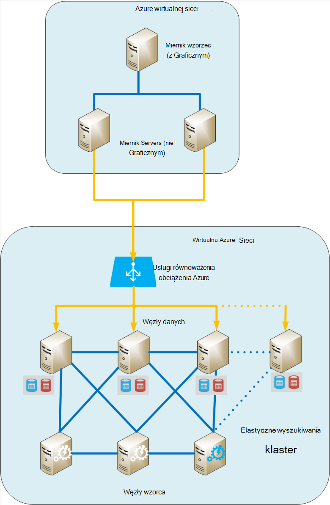
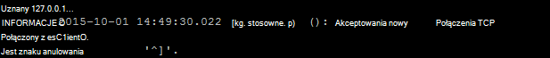
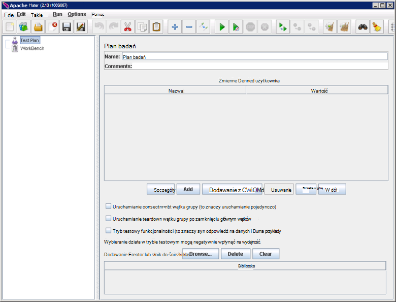
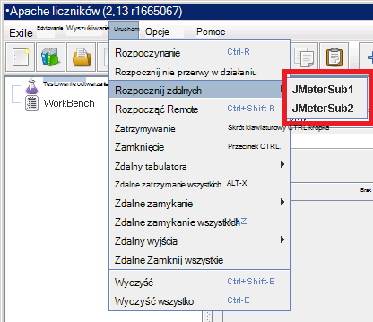
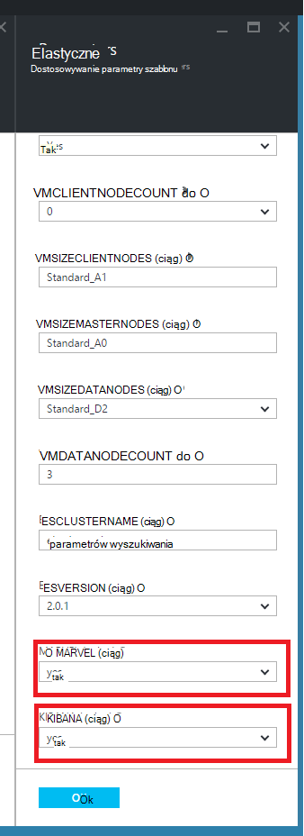
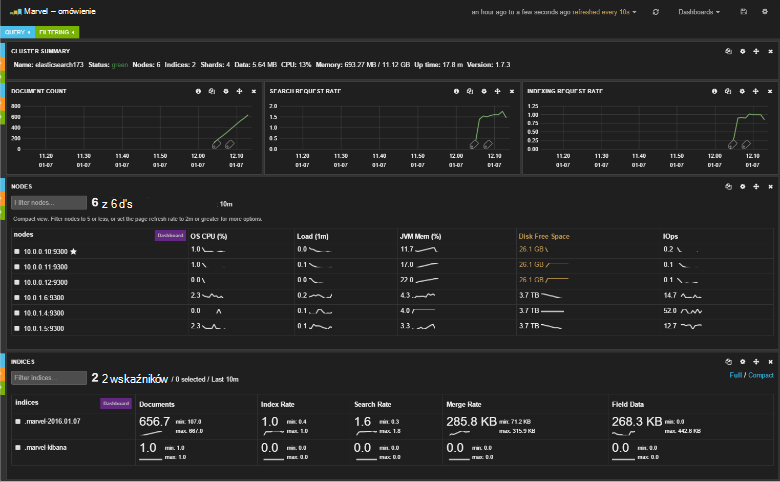
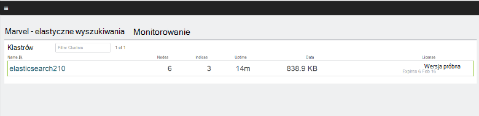
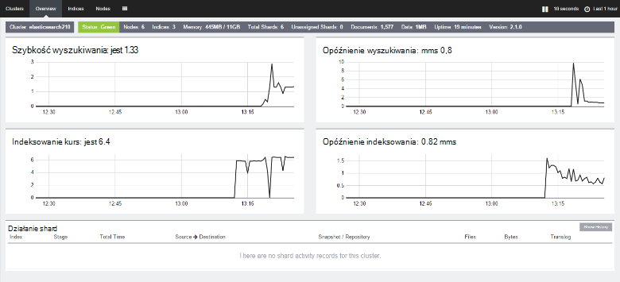

<properties
   pageTitle="Tworzenie testowania środowiska dla Elasticsearch | Microsoft Azure"
   description="Jak skonfigurować środowisko testów wydajności klaster Elasticsearch."
   services=""
   documentationCenter="na"
   authors="dragon119"
   manager="bennage"
   editor=""
   tags=""/>

<tags
   ms.service="guidance"
   ms.devlang="na"
   ms.topic="article"
   ms.tgt_pltfrm="na"
   ms.workload="na"
   ms.date="09/22/2016"
   ms.author="masashin"/>
   
# <a name="creating-a-performance-testing-environment-for-elasticsearch-on-azure"></a>Tworzenie testowania środowiska dla Elasticsearch Azure

[AZURE.INCLUDE [pnp-header](../../includes/guidance-pnp-header-include.md)]

Ten artykuł jest [częścią serii](guidance-elasticsearch.md). 

Ten dokument opisano, jak skonfigurować środowisko testów wydajności klaster Elasticsearch. Ta konfiguracja użyto do testowania wydajności danych spożyciu i kwerendy obciążeń pracą, zgodnie z opisem w [dostrajania wydajności spożyciu danych dla Elasticsearch Azure][].

Proces testowania wydajności używanych [Apache JMeter](http://jmeter.apache.org/)ze [standardowego zestawu](http://jmeter-plugins.org/wiki/StandardSet/) wtyczek zainstalowana w konfiguracji nadrzędny podrzędny przy użyciu zestawu dedykowane maszyny wirtualne (nie jest częścią klaster Elasticsearch) specjalnie skonfigurowany w celu. 

[Agent serwera monitora](http://jmeter-plugins.org/wiki/PerfMonAgent/) został zainstalowany na każdym węźle Elasticsearch. W poniższych sekcjach przedstawiono instrukcje dotyczące odtworzenia środowisku testowym, co umożliwia przeprowadzanie własne testowania z JMeter. W poniższych instrukcjach przyjęto już utworzono klaster Elasticsearch o węzły połączone za pomocą Azure wirtualnej sieci. 

Zauważ, że w środowisku testowym działa także jako zbiór maszyny wirtualne Azure zarządzać za pomocą pojedynczej Azure grupy zasobów.

[Marvel](https://www.elastic.co/products/marvel) także zainstalowaniu i skonfigurowaniu umożliwiające wewnętrznych aspektów klaster Elasticsearch monitorowania i analizować prostsze. Jeśli Statystyka JMeter był Szczyt lub zagłębieniu wydajności, informacji dostępnych za pośrednictwem Marvel może być cenne pomagają w określeniu przyczyny zmianami.

Poniższa ilustracja przedstawia strukturę całego systemu. 



Zwróć uwagę następujące punkty:

- Wzorzec JMeter maszyn wirtualnych działa system Windows Server, aby udostępnić środowisko graficznego interfejsu użytkownika konsoli JMeter. Wzorzec JMeter maszyn wirtualnych zawiera Graficznym ( *jmeter* aplikacji) umożliwiające tester tworzyć testów, uruchom testy i wizualizowanie wyniki. Ten maszyn wirtualnych współdziała z serwerem JMeter maszyny wirtualne, które rzeczywiście wysyłanie zaproszenia, które stanowią testów.

- Maszyny wirtualne podrzędne JMeter systemem Ubuntu Server (Linux), jest wymagany Graficznym te maszyny wirtualne. Serwer JMeter maszyny wirtualne oprogramowanie JMeter server ( *serwer jmeter* aplikacji) do wysyłania żądań do klastrów Elasticsearch.

- Węzły dedykowane klienta nie były stosowane, chociaż były dedykowane węzły wzorca.

- Liczby węzłów danych w grupie może się różnić w zależności od tego scenariusza badany.

- Wszystkie węzły w klastrze Elasticsearch uruchomić Marvel obserwować wydajności w czasie rzeczywistym i agenta serwera JMeter zbierać dane z monitorowania późniejszej analizy.

- Podczas testowania Elasticsearch 2.0.0 i później, jeden z węzłów danych działa także Kibana. To jest wymagane przez wersję Marvel uruchamianej na Elasticsearch 2.0.0 lub nowszy.

## <a name="creating-an-azure-resource-group-for-the-virtual-machines"></a>Tworzenie grupy Azure zasobów dla maszyn wirtualnych

Wzorzec JMeter musi mieć możliwość utworzenia połączenia bezpośrednio do każdego węzła w klastrze Elasticsearch zebrać dane dotyczące wydajności. W przypadku różnią się od klaster Elasticsearch VNet JMeter VNet następnie dzięki temu konfigurowanie każdego węzła Elasticsearch przy użyciu publicznego adresu IP. Jeśli ten problem z konfiguracją Elasticsearch, a następnie należy rozważyć, czy implementacji maszyny wirtualne JMeter w tym samym VNet jako klaster Elasticsearch przy użyciu tej samej grupy zasobów, w takim przypadku możesz pominąć tę procedurę pierwszego.

Najpierw [utworzyć grupę zasobów](../resource-group-template-deploy-portal.md). Ten dokument przyjęto założenie, że grupy zasobów o nazwie *JMeterPerformanceTest*. Jeśli chcesz uruchomić maszyny wirtualne JMeter w tym samym VNet jako klaster Elasticsearch, użyj tej samej grupy zasobów jako klastrze zamiast tworzenia nowej witryny.

## <a name="creating-the-jmeter-master-virtual-machine"></a>Tworzenie wzorca maszyny wirtualnej JMeter

Następny [Tworzenie maszyn wirtualnych systemu Windows](../virtual-machines/virtual-machines-windows-hero-tutorial.md) przy użyciu obrazu *Systemu Windows Server 2008 R2 z dodatkiem SP1* .  Zalecamy wybranie opcji rozmiar pamięci Wirtualnej z wystarczających rdzenie i pamięci, aby uruchomić testów wydajności. Najlepiej będzie maszyny liczącej z co najmniej 2 rdzenia i 3,5 GB pamięci RAM (A2 standardowy lub większy).

<!-- TODO add info on why disabling diagnostics is positive --> 

Zalecamy, aby wyłączyć Diagnostyka. Podczas tworzenia maszyn wirtualnych w portalu, można to zrobić na karta *Ustawienia* w sekcji *monitorowania* w obszarze *Narzędzia diagnostyczne*. Pozostaw pozostałe ustawienia na wartości domyślne.

Upewnij się, że maszyn wirtualnych i skojarzonych z nimi zasobów zostały utworzone pomyślnie przez [badania grupa zasobów](../azure-portal/resource-group-portal.md#manage-resource-groups) w portalu. Zasoby na liście powinny się składać z maszyny, grupy zabezpieczeń sieci i publiczny adres IP wszystkie o takiej samej nazwie i konta interfejs i miejsca do magazynowania z nazwami oparta na maszyn wirtualnych sieci.

## <a name="creating-the-jmeter-subordinate-virtual-machines"></a>Tworzenie maszyn wirtualnych podrzędnego JMeter

Teraz [Utwórz maszyny Linux](../virtual-machines/virtual-machines-linux-quick-create-portal.md) przy użyciu obrazu *Ubuntu serwera 14.04 KÓW* .  Podobnie jak w przypadku JMeter Głosowa wzorca, wybierz rozmiar pamięci Wirtualnej z wystarczających rdzenie i pamięci, aby uruchomić testów wydajności. Najlepiej będzie maszyny liczącej z co najmniej 2 rdzenia i co najmniej 3,5 GB pamięci RAM (A2 standardowy lub większy).

Ponownie zaleca się wyłączenie Diagnostyka.

Możesz utworzyć dowolną liczbę podrzędnego maszyny wirtualne zgodnie z potrzebami. 

## <a name="installing-jmeter-server-on-the-jmeter-subordinate-vms"></a>Instalowanie serwera JMeter na maszyny wirtualne podrzędne JMeter

Maszyny wirtualne podrzędne JMeter systemem Linux i domyślnie nie możesz połączyć się je, otwierając Podłączanie pulpitu zdalnego (RDP). Zamiast tego można [użyć Kit, aby otworzyć okno wiersza polecenia](../virtual-machines/virtual-machines-linux-mac-create-ssh-keys.md) na każdym maszyn wirtualnych.

Po połączeniu zostały do jednego z podrzędnych maszyny wirtualne użyjemy imprezie skonfigurować JMeter.

Najpierw zainstaluj języka Java musi być uruchamiana JMeter.

```bash
sudo add-apt-repository ppa:webupd8team/java
sudo apt-get update
sudo apt-get install oracle-java8-installer
```

Pobierz teraz oprogramowania JMeter dostarczana w pliku zip.

```bash
wget http://apache.mirror.anlx.net/jmeter/binaries/apache-jmeter-2.13.zip
```

Instalowanie polecenie unzip, a następnie go używać, aby rozwinąć oprogramowania JMeter. Oprogramowanie jest kopiowana do folderu o nazwie **apache-jmeter-2.13**.

```bash
sudo apt-get install unzip
unzip apache-jmeter-2.13.zip
```

Przejdź do katalogu *Kosza* zablokowanych plików wykonywalnych JMeter i wprowadź wykonywalny programów *serwera jmeter* i *jmeter* .

```bash
cd apache-jmeter-2.13/bin
chmod u+x jmeter-server
chmod u+x jmeter
```

Teraz, należy edytować plik `jmeter.properties` znajduje się w bieżącym folderze (używaj edytora tekstu znasz najczęściej, takich jak *vi* lub *vim*). Znajdź następujące wiersze:

```yaml
...
client.rmi.localport=0
...
server.rmi.localport=4000
...
```

Usuń komentarze (usuwanie interlinię \#znaków #) modyfikowanie te linie, tak jak pokazano poniżej, a następnie zapisz plik i zamknij Edytor:

```yaml
...
client.rmi.localport=4441
...
server.rmi.localport=4440
```

Teraz uruchom następujące polecenia, aby otworzyć port 4441 do ruchu przychodzącego TCP (jest to port *serwera jmeter* Aby odsłuchać na właśnie został skonfigurowany):

```bash
sudo iptables -A INPUT -m state --state NEW -m tcp -p tcp --dport 4441 -j ACCEPT
```

Pobierz plik zip zawierający standardowe zbiór wtyczek JMeter (te wtyczki podać liczniki monitorowania wydajności) i rozpakuj plik pliku do folderu **apache-jmeter-2.13** . Rozpakować pliku w tej lokalizacji umieści wtyczek serwisu w odpowiednim folderze.

Jeśli zostanie wyświetlony monit o zastąpienie pliku licencji, wpisz A (dla wszystkich):

```bash
wget http://jmeter-plugins.org/downloads/file/JMeterPlugins-Standard-1.3.0.zip
unzip JMeterPlugins-Standard-1.3.0.zip
```

Używanie `nohup` do uruchomienia serwera JMeter w tle. Powinno odpowiedzieć, wyświetlając identyfikator procesu i komunikat informujący, że został utworzony obiekt zdalny i jest gotowy do uruchomienia odbieranie poleceń.  Uruchom następujące polecenie w katalogu ~/apache-jmeter-2.13/bin. 

```bash
nohup jmeter-server &
```

> [AZURE.NOTE]Jeśli maszyn wirtualnych zostanie zamknięty program serwera JMeter zostanie zakończone. Konieczne będzie łączyć się maszyn wirtualnych i ponownie ręcznie uruchomić go ponownie. Alternatywnie możesz skonfigurować system na uruchomienie polecenia *jmeter server* automatycznie podczas uruchamiania, dodając następujące polecenia, aby `/etc/rc.local` pliku (przed polecenia *Zamknij 0* ):

```bash
sudo -u <username> bash << eoc
cd /home/<username>/apache-jmeter-2.13/bin
nohup ./jmeter-server &
eoc
```

Zamienianie `<username>` z nazwą logowania.

Mogą być przydatne do pozostaw otwarte okno końcowych tak, aby można monitorować postęp na serwerze JMeter badania w trakcie.

Konieczne będzie Powtórz te kroki dla maszyn wirtualnych każdego JMeter podrzędnego.

## <a name="installing-the-jmeter-server-agent-on-the-elasticsearch-nodes"></a>Instalowanie agenta serwera JMeter w węzłach Elasticsearch

W poniższej procedurze założono, że masz dostęp do logowania do węzłów Elasticsearch. Jeśli utworzono klaster przy użyciu szablonu Menedżera zasobów można nawiązać każdy węzeł w ramce skok Głosowa, jak pokazano w sekcji topologii Elasticsearch [Uruchomiony Elasticsearch Azure](guidance-elasticsearch-running-on-azure.md). Pole szybkiego dostępu za pomocą Kit także można nawiązać. 

Za pomocą polecenia *ssh* zalogować się do każdego węzła w klastrze Elasticsearch, w tym miejscu.

Zaloguj się do jednego z węzłów Elasticsearch jako administrator.  W wierszu polecenia imprezie wprowadź następujące polecenia, aby utworzyć folder do przechowywania JMeter Server Agent i przejście do tego folderu:

```bash
mkdir server-agent
cd server-agent
```

Uruchom następujące polecenia do zainstalowania polecenie *Rozpakuj plik* (Jeśli nie jest jeszcze zainstalowany), pobieranie oprogramowania JMeter Server Agent i rozpakuj plik go:

```bash
sudo apt-get install unzip
wget http://jmeter-plugins.org/downloads/file/ServerAgent-2.2.1.zip
unzip ServerAgent-2.2.1.zip
```
 
Uruchom następujące polecenie, aby skonfigurować zaporę i włączyć przekazywanie za pośrednictwem portu 4444 ruchu TCP (jest to port używany przez agenta serwera JMeter):

```bash
sudo iptables -A INPUT -m state --state NEW -m tcp -p tcp --dport 4444 -j ACCEPT
```

Uruchom następujące polecenie, aby uruchomić agenta serwera JMeter w tle:

```bash
nohup ./startAgent.sh &
```

Agent serwera JMeter powinien odpowiadać z wiadomościami informujący, że został uruchomiony i nasłuchują na porcie 4444.  Naciśnij klawisz Enter, aby uzyskać wiersz polecenia, a następnie uruchom następujące polecenie.

```bash
telnet <nodename> 4444
```

Zamienianie `<nodename>` o nazwie węzła. (Nazwa węzła można znaleźć, uruchamiając `hostname` polecenie.) To polecenie otwiera połączenia telnet portu 4444 na komputerze lokalnym. To połączenie umożliwia sprawdzenie JMeter Server Agent działa poprawnie.

Jeśli JMeter Server Agent nie jest uruchomiony, otrzymasz odpowiedź 

`*telnet: Unable to connect to remote host: Connection refused*.`

Jeśli JMeter Server Agent jest uruchomiony i portu 4444 zostały skonfigurowane poprawnie, zobacz następującą odpowiedź:



> [AZURE.NOTE] Sesji telnet nie umożliwia dowolny wiersz po jest połączony.

W sesji telnet wpisz następujące polecenie:

``` 
test
```

Jeśli JMeter Server Agent nie jest skonfigurowane i słuchanie poprawnie, powinien wskazują, że jego polecenia i odpowiadanie za pomocą wiadomości *Yep*.

> [AZURE.NOTE]Możesz wpisać w innych poleceniach uzyskanie danych monitorowania wydajności. Na przykład polecenie `metric-single:cpu:idle` spowoduje wyświetlenie bieżącego część czasu, który Procesor jest bezczynny (jest to migawki). Aby uzyskać pełną listę poleceń odwiedź stronę [Agenta serwera monitora](http://jmeter-plugins.org/wiki/PerfMonAgent/) . : Do nawiązywania połączeń z jego on serwera monitora agenta. >>

W sesji telnet wpisz następujące polecenie, aby zakończyć sesję i powrócić do wiersza polecenia imprezie:

``` 
exit
```

> [AZURE.NOTE]Zgodnie z JMeter podrzędnych maszyny wirtualne, wyloguj się, czy ten komputer jest zamknięcie i ponowne uruchomienie następnie agenta serwera JMeter należy ręcznie uruchomić ponownie za pomocą `startAgent.sh` polecenia. Jeśli chcesz agenta serwera JMeter, aby był uruchamiany automatycznie, należy dodać następujące polecenie do końca `/etc/rc.local` pliku przed polecenia *Zakończ 0* . 
> Zamienianie `<username>` z nazwą logowania:

```bash
sudo -u <username> bash << eoc
cd /home/<username>/server-agent
nohup ./startAgent.sh &
eoc
```

Można teraz albo powtórzyć całego procesu dla wszystkich innych węzła w klastrze Elasticsearch lub można użyć `scp` polecenie, aby skopiować folder agenta serwera i zawartość do każdej węzeł i przy użyciu `ssh` polecenia Uruchom agenta serwera JMeter, tak jak pokazano poniżej. e Zamień `<username>` przy użyciu nazwy użytkownika i `<nodename>` o nazwie węzła, w którym chcesz kopiowania i uruchamiania oprogramowania (możesz otrzymać prośbę o podanie hasła, zgodnie z każdego polecenia):

```bash
scp -r \~/server-agent <username>@<nodename>:\~
ssh <nodename> sudo iptables -A INPUT -m state --state NEW -m tcp -p tcp --dport 4444 -j ACCEPT
ssh <nodename> -n -f 'nohup \~/server-agent/startAgent.sh'
```

## <a name="installing-and-configuring-jmeter-on-the-jmeter-master-vm"></a>Instalowanie i konfigurowanie JMeter na głównym maszyn wirtualnych JMeter

W portalu usługi Azure kliknij pozycję **grupy zasobów**. W karta **grup zasobów** kliknij grupę zasobów, zawierającą wzorzec JMeter i maszyny wirtualne podrzędne.  Karta **Grupa zasobów** kliknij **JMeter wzorca maszyn wirtualnych**. W karta maszyn wirtualnych, na pasku narzędzi kliknij przycisk **Połącz**. Otwórz plik RDP po wyświetleniu monitu w przeglądarce sieci web. System Windows tworzy Podłączanie pulpitu zdalnego do swojego maszyn wirtualnych.  Maszyn wirtualnych po wyświetleniu monitu wprowadź nazwę użytkownika i hasło.

W Głosowa, przy użyciu programu Internet Explorer przejdź do strony [Pobierania Java dla systemu Windows](http://www.java.com/en/download/ie_manual.jsp) . Postępuj zgodnie z instrukcjami, aby pobrać i uruchomić Instalatora języka Java.

W przeglądarce sieci web przejdź do strony [Pobierania JMeter Apache](http://jmeter.apache.org/download_jmeter.cgi) i pobrać zip zawierający to najnowszy format binarny. Zapisywanie zip w dogodnym miejscu na swojej maszyn wirtualnych.

Przejdź do witryny [Dodatków plug-in JMeter niestandardowe](http://jmeter-plugins.org/) i Pobierz standardowy zestaw dodatków plug-in. Zapisz zip w tym samym folderze co plik do pobrania JMeter w poprzednim kroku.

W Eksploratorze Windows przejdź do folderu zawierającego apache-jmeter -*xxx* pliku zip, gdzie *xxx* jest aktualną wersję JMeter. Wyodrębnij pliki do bieżącego folderu.

Wyodrębnianie plików w JMeterPlugins-standardowe -*yyy*zip pliku, gdzie *yyy* jest aktualną wersję wtyczek serwisu do apache-jmeter*tych* folderów. Spowoduje to dodanie do właściwego folderu wtyczek serwisu dla JMeter. Można bezpiecznie scalanie folderach Biblioteka i zastąpić pliki licencji i pliku readme, jeśli zostanie wyświetlony monit.

Przejdź do pozycji apache-jmeter**xxx/bin folderów i Edycja jmeter.properties plik za pomocą Notatnika.  W `jmeter.properties` pliku, Znajdź sekcję oznakowane *hostów zdalnych i RMI konfiguracji*.  W tej sekcji pliku Znajdź następujący wiersz:

```yaml
remote_hosts=127.0.0.1
```

Zmień ten wiersz i zastąp listę adresów 127.0.0.1 przecinkami oddzielone IP adresy IP lub nazwy hosta dla wszystkich serwerów podrzędnych JMeter. Na przykład:

```yaml
remote_hosts=JMeterSub1,JMeterSub2
```

Znajdź następujący wiersz, a następnie usuń `#` znak na początku wiersza, a następnie zmodyfikować wartość ustawienia client.rmi.localport:

```yaml
#client.rmi.localport=0
```

Aby:

```yaml
client.rmi.localport=4440
```

Zapisz plik, a następnie zamknij Notatnik. 

Na pasku zadań systemu Windows kliknij przycisk **Start**, kliknij polecenie **Narzędzia administracyjne**, a następnie kliknij **Zapora systemu Windows z zabezpieczeniami zaawansowanymi**.  W oknie Zapora systemu Windows z zabezpieczeniami zaawansowanymi, w okienku po lewej stronie kliknij prawym przyciskiem myszy **Reguły przychodzące**, a następnie kliknij **Nową regułę**.

**Kreator nowej reguły przychodzącej**, na stronie **Typ reguły** wybierz **Port**, a następnie kliknij przycisk **Dalej**.  Na stronie porty i protokoły wybierz **TCP**, wybierz **określone porty lokalne**w polu tekstowym wpisz `4440-4444`, a następnie kliknij przycisk **Dalej**.  Na stronie Akcja wybierz pozycję **Zezwalaj na połączenie**, a następnie kliknij przycisk **Dalej**. Na stronie profilu Pozostaw wszystkie opcje zaznaczone pole wyboru, a następnie kliknij przycisk **Dalej**.  Na stronie Nazwa w polu **Nazwa** pola tekstowego wpisz *JMeter*, a następnie kliknij przycisk **Zakończ**.  Zamknij Zapora systemu Windows z zabezpieczeniami zaawansowanymi.

W Eksploratorze Windows, w apache-jmeter -**xx/bin folderu, kliknij dwukrotnie plik wsadowy Windows *jmeter* , aby rozpocząć Graficznym. Interfejs użytkownika powinny być wyświetlane:



Na pasku menu kliknij polecenie **Uruchom**, kliknij przycisk **Start zdalnego**i sprawdź, czy są wymienione dwa urządzenia podrzędnego JMeter:



Teraz możesz przystąpić do rozpoczęcia testów wydajności.

## <a name="installing-and-configuring-marvel"></a>Instalowanie i konfigurowanie Marvel

Szablon Szybki Start Elasticsearch Azure będzie Zainstaluj i skonfiguruj odpowiednią wersję programu Marvel automatycznie, jeśli Ustawianie parametrów MARVEL i KIBANA na PRAWDA ("tak"), tworząc klaster:



Jeśli dodajesz Marvel z istniejącym klastrem trzeba ręcznie przeprowadzić instalację, a proces różni się w zależności od tego, czy jest używana wersja Elasticsearch 1.7.x lub 2.x, zgodnie z opisem w poniższych procedur.

### <a name="installing-marvel-with-elasticsearch-173-or-earlier"></a>Instalowanie Marvel z 1,73 Elasticsearch lub starszym

Jeśli używasz Elasticsearch 1.7.3 lub wcześniej, wykonaj następujące czynności *w każdym węźle* w klastrze:

- Zaloguj się do węzła i przejście do katalogu macierzystego Elasticsearch.  W systemie Linux, jest katalogu macierzystego typowe `/usr/share/elasticsearch`.

-  Uruchom następujące polecenie, aby pobrać i zainstalować dodatek Marvel dla Elasticsearch:

```bash
sudo bin/plugin -i elasticsearch/marvel/latest
```

- Zatrzymaj i uruchom ponownie Elasticsearch w węźle:

```bash
sudo service elasticsearch restart
```

- Aby sprawdzić, czy Marvel została zainstalowana poprawnie, otwórz przeglądarkę sieci web i przejdź do adresu URL `http://<server>:9200/_plugin/marvel`. Zamienianie `<server>` z nazwy lub adresu IP każdego serwera Elasticsearch w klastrze.  Sprawdź, czy zostanie wyświetlona strona podobna do tej pokazano poniżej:




### <a name="installing-marvel-with-elasticsearch-200-or-later"></a>Instalowanie Marvel z Elasticsearch 2.0.0 lub nowsza

Jeśli używasz Elasticsearch 2.0.0 lub później, wykonaj następujące zadania *w każdym węźle* w klastrze:

Zaloguj się do węzła i przejście do katalogu macierzystego Elasticsearch (zazwyczaj `/usr/share/elasticsearch`) uruchom następujące polecenia, aby pobrać i zainstalować dodatek Marvel dla Elasticsearch:

```bash
sudo bin/plugin install license
sudo bin/plugin install marvel-agent
```

Zatrzymaj i uruchom ponownie Elasticsearch w węźle:

```bash
sudo service elasticsearch restart
```

W poniższej procedurze Zamień `<kibana-version>` 4.2.2, jeśli korzystasz z Elasticsearch 2.0.0 lub Elasticsearch 2.0.1 lub 4.3.1, jeśli korzystasz z Elasticsearch 2.1.0 lub nowszym.  Zamienianie `<marvel-version>` 2.0.0, jeśli korzystasz z Elasticsearch 2.0.0 lub Elasticsearch 2.0.1 lub 2.1.0, jeśli korzystasz z Elasticsearch 2.1.0 lub nowszym.  Wykonywać następujące zadania *w jednym z węzłów* w klastrze:

Zaloguj się do węzła i Pobierz odpowiedni kompilacji Kibana dla używanej wersji programu Elasticsearch z [Elasticsearch pobrać witryny sieci web](https://www.elastic.co/downloads/past-releases), a następnie Wyodrębnij pakiet:

```bash
wget https://download.elastic.co/kibana/kibana/kibana-<kibana-version>-linux-x64.tar.gz
tar xvzf kibana-<kibana-version>-linux-x64.tar.gz
```

Otwórz port 5601, aby zaakceptować przychodzące żądania:

```bash
sudo iptables -A INPUT -m state --state NEW -m tcp -p tcp --dport 5601 -j ACCEPT
```

Przejdź do folderu konfiguracji Kibana (`kibana-<kibana-version>-linux-x64/config`), edytować `kibana.yml` pliku, a następnie dodaj następujący wiersz. Zamienianie `<server>` z nazwy lub adresu IP serwera Elasticsearch w klastrze:

```yaml
elasticsearch.url: "http://<server>:9200"
```

Przenieś do folderu Kibana Kosza (`kibana-<kibana-version>-linux-x64/bin`), i uruchom następujące polecenie, aby zintegrować dodatek Marvel Kibana:

```bash
sudo ./kibana plugin --install elasticsearch/marvel/<marvel-version>
```

Rozpocznij Kibana:

```bash
sudo nohup ./kibana &
```

Aby sprawdzić instalacji Marvel, otwórz przeglądarkę sieci web i przejdź do adresu URL `http://<server>:5601/app/marvel`. Zamienianie `<server>` z nazwy lub adresu IP serwera z programem Kibana.

Sprawdź, czy zostanie wyświetlona strona podobna do tej pokazano poniżej (nazwa klaster prawdopodobnie różnią się od tej pokazano na ilustracji).



Kliknij łącze odpowiadające klaster (elasticsearch210 na ilustracji powyżej). Powinna zostać wyświetlona strona podobna do tej pokazano poniżej:




[Dostosowywanie wydajności spożyciu danych dla Elasticsearch Azure]: guidance-elasticsearch-tuning-data-ingestion-performance.md  