<properties
   pageTitle="Rozmieszczanie przykłady JMeter JUnit dla testów wydajności Elasticsearch | Microsoft Azure"
   description="Jak używać przykłady JUnit do generowania i przekazywać do klastrów Elasticsearch danych."
   services=""
   documentationCenter="na"
   authors="dragon119"
   manager="bennage"
   editor=""
   tags=""/>

<tags
   ms.service="guidance"
   ms.devlang="na"
   ms.topic="article"
   ms.tgt_pltfrm="na"
   ms.workload="na"
   ms.date="09/22/2016"
   ms.author="masashin"/>
   
# Rozmieszczanie przykłady JMeter JUnit dla testów wydajności Elasticsearch

[AZURE.INCLUDE [pnp-header](../../includes/guidance-pnp-header-include.md)]

Ten artykuł jest [częścią serii](guidance-elasticsearch.md). 

Tym dokumencie opisano sposób tworzenia i używania przykłady JUnit, który można wygenerować i przekazywanie danych do klastrów Elasticsearch w ramach planu testowania JMeter. Tej metody dostarcza wysoce elastyczne rozwiązanie załadować, testując generowany dużych ilości danych test bez w zależności od plików danych zewnętrznych.

> [AZURE.NOTE] Testy ładowania służąca do oceny wydajności oddziaływanie danych opisanych [dostrajania](guidance-elasticsearch-tuning-data-ingestion-performance.md) wydajności spożyciu danych Elasticsearch skonstruowane w ten sposób. W tym dokumencie opisano informacji o kodzie JUnit.

W przypadku testów wydajności spożyciu danych kod JUnit została opracowywania przy użyciu Zaćmienie (Mars) i zależności zostały rozwiązane, przy użyciu środowiska Maven. W poniższych procedurach opisano proces krok po kroku Zaćmienie instalowania, konfigurowania środowiska Maven tworzenie testu JUnit i wdrażanie test jako przykłady żądanie JUnit w teście JMeter.

> [AZURE.NOTE] Aby uzyskać szczegółowe informacje na temat struktury i konfiguracji środowisku testowym zobacz [Tworzenie środowisku testów wydajności dla Elasticsearch Azure][].

## Wymagania wstępne dotyczące instalacji

Konieczne będzie [Języka Java](http://www.java.com/en/download/ie_manual.jsp) na tym komputerze rozwoju.
Konieczne będzie również zainstalować [IDE Zaćmienie dla deweloperów języka Java](https://www.eclipse.org/downloads/index.php?show_instructions=TRUE).

> [AZURE.NOTE] Jeśli korzystasz z maszyn wirtualnych wzorca JMeter opisano w temacie [Tworzenie środowisku testów wydajności dla Elasticsearch Azure][] jako środowiska programowania, Pobierz 32 bitowego systemu Windows w wersji Instalatora Zaćmienie.

## Tworzenie projektu badania JUnit do testowania Elasticsearch obciążenia

Uruchamianie IDE Zaćmienie, jeśli nie jest już uruchomiony, a następnie zamknij strony **powitalnej** .  W menu **plik** kliknij pozycję, a następnie kliknij **Projekt języka Java**.

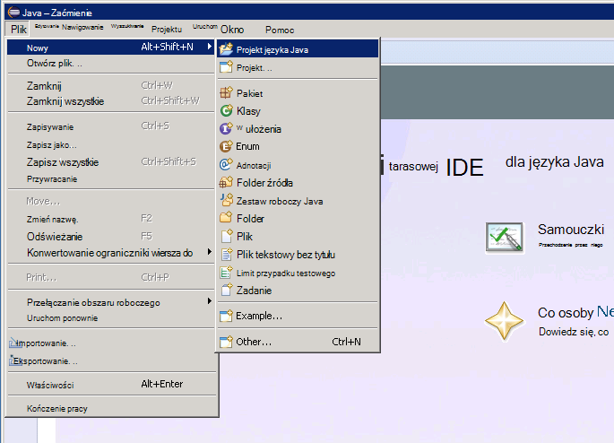

W oknie **Nowy projekt języka Java** wprowadź nazwę projektu, wybierz pozycję **Użyj domyślnych JRE**, a następnie kliknij przycisk **Zakończ**.

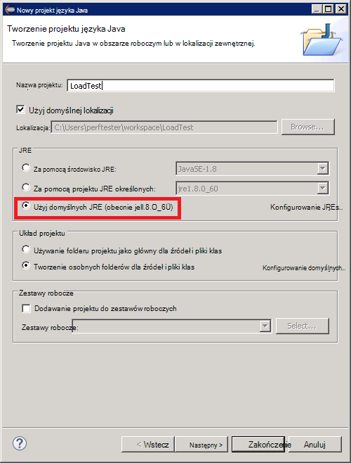

W oknie **Eksplorator pakiet** rozwiń węzeł o nazwie po projektu. Upewnij się, że zawiera ona folder o nazwie **src** i odwołanie do JRE określonej.

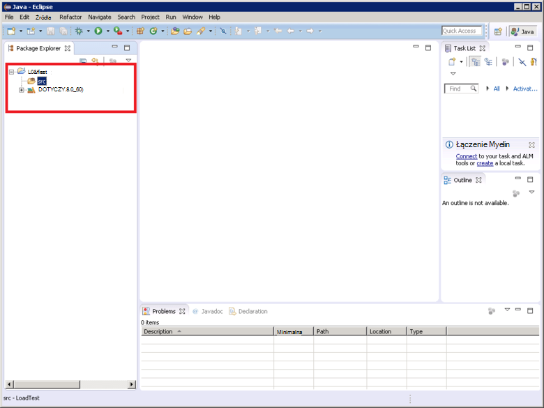

Kliknij prawym przyciskiem myszy **src** folder, kliknij pozycję **Nowy**, a następnie kliknij **JUnit przypadku testowego**.

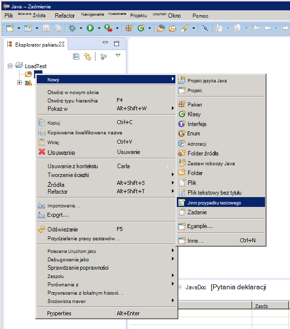

W oknie **nową sprawę Test JUnit** , wybierz pozycję **Nowy 4 Junit test**, wprowadź nazwę pakietu (może to być taka sama jak nazwa projektu, mimo że Konwencja powinna rozpoczynać się od litery małe litery), nazwę klasy test, a następnie wybierz odpowiednie opcje wygenerować fragmentami metody wymagane dla usługi test. Pozostaw puste pole **kategorii test** , a następnie kliknij przycisk **Zakończ**.

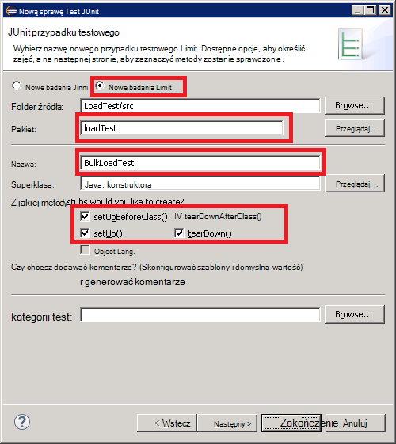

Jeśli zostanie wyświetlone następujące okno dialogowe **nową sprawę Test JUnit** , wybierz opcję, aby dodać bibliotekę JUnit 4 do ścieżki kompilacji, a następnie kliknij **przycisk OK**. 

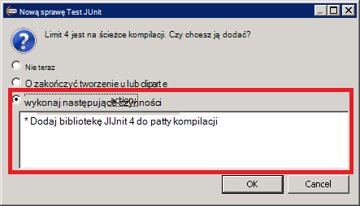

Upewnij się, że kod szkielet w teście JUnit jest generowane i wyświetlane w oknie edytora języka Java.

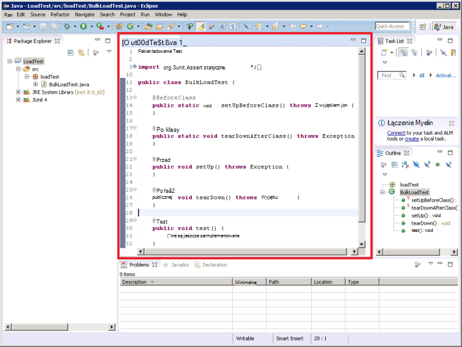

W **Eksploratorze pakietu**kliknij prawym przyciskiem myszy węzeł projektu, kliknij przycisk **Konfiguruj**, a następnie kliknij **Konwersja na projekt środowiska Maven**.

> [AZURE.NOTE]Przy użyciu pozwala na łatwe zarządzanie zależności zewnętrznych (na przykład Elasticsearch Java bibliotek klienta) umożliwia środowiska Maven projektu zależy od.

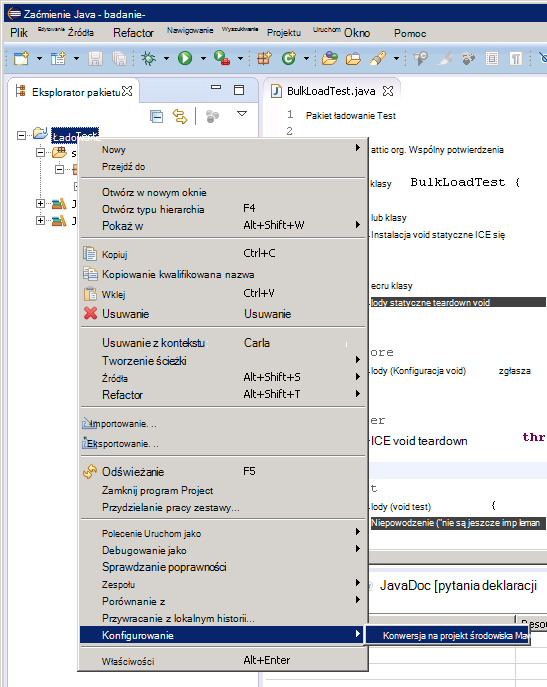

W oknie dialogowym **Tworzenie nowego POM** na liście rozwijanej **opakowań** wybierz **słoik**, a następnie kliknij **Zakończ**.

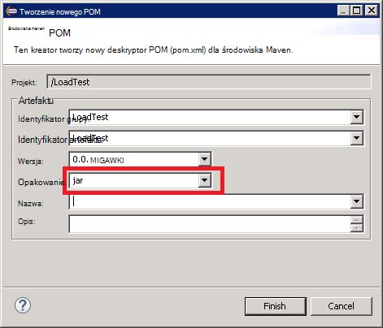

Okienka, która pojawia się poniżej Edytor (POM) modelu obiektów programu project mogą być wyświetlane ostrzeżenie "Ścieżka kompilacji określa środowisko J2SE 1,5. Istnieją nie JREs zainstalowanych w obszarze roboczym, ściśle zgodnych z tego środowiska", w zależności od tego, jaka wersja programu Java jest zainstalowana na tym komputerze rozwoju. Jeśli masz wersję Java później niż wersja 1.5 można zignorować to ostrzeżenie.

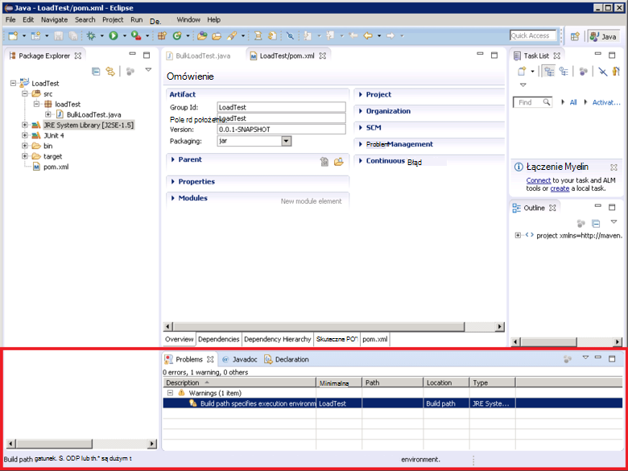

W edytorze POM rozwiń **Właściwości** , a następnie kliknij przycisk **Utwórz**.

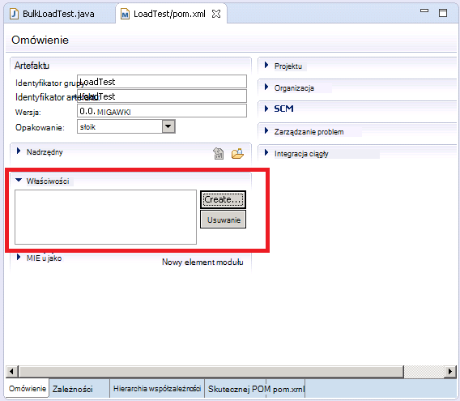

W oknie dialogowym **Dodaj właściwość** w polu **Nazwa** wpisz *es.version*, w polu **wartość** wpisz *1.7.2*, a następnie kliknij **przycisk OK**. To jest wersja biblioteki Elasticsearch Java klienta w celu używania (Ta wersja może być zastąpione w przyszłości, a Definiowanie wersji jako właściwość POM i odwoływanie się do tej właściwości w ramach projektu umożliwia wersji szybkiej zmiany).

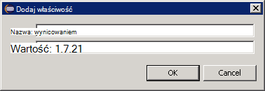

Kliknij kartę **zależności** u dołu Edytora POM, a następnie kliknij przycisk **Dodaj** obok listy **zależności** .

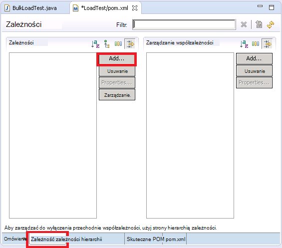

W polu **Identyfikator artefaktu** wpisz *elasticsearch*w polu wpisz **wersji** , w oknie dialogowym **Wybierz zależności** w polu **Identyfikator grupy** wpisz *org.elasticsearch* * \${es.version}*, a następnie kliknij **przycisk OK**. Informacji na temat biblioteki klienta Java Elasticsearch odbywa się w trybie online środowiska Maven centralnym repozytorium i tej konfiguracji automatycznie pobierze biblioteki i jej zależności podczas tworzenia projektu.

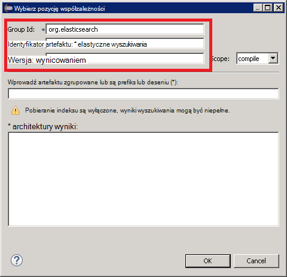

W menu **plik** kliknij przycisk **Zapisz wszystko**. Ta akcja Zapisz, a następnie tworzenie projektu, pobierając zależności określony przez środowiska Maven. Upewnij się, że folder zależności środowiska Maven zostanie wyświetlona w Eksploratorze pakiet. Rozwiń ten folder, aby wyświetlić pliki jar pobierane do obsługi języka Elasticsearch Java Biblioteka klienta.

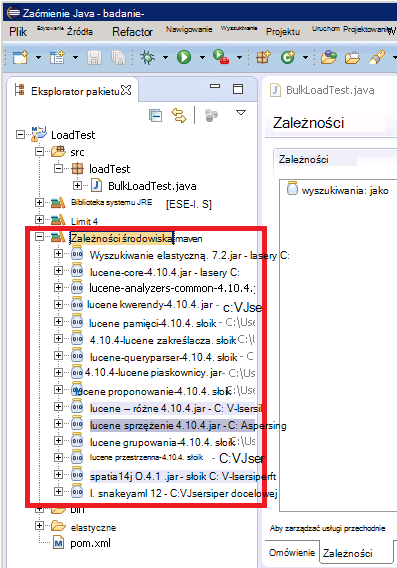

## Importowanie istniejącego projektu badania JUnit Zaćmienie

W poniższej procedurze założono, pobrany projekt środowiska Maven, który został wcześniej utworzony przy użyciu Zaćmienie.

Rozpocznij Zaćmienie IDE. W menu **plik** kliknij polecenie **Importuj**.

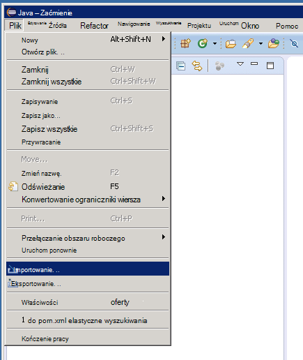

W oknie **Wybieranie** rozwiń folder **środowiska Maven** , kliknij pozycję **Istniejące projekty środowiska Maven**, a następnie kliknij przycisk **Dalej**.

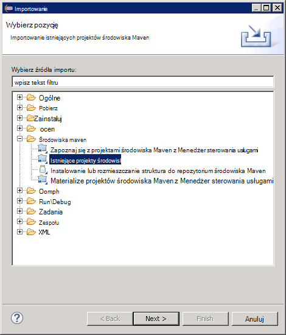

W oknie **Projektów środowiska Maven** określić folder, przytrzymując projektu (folderu zawierającego plik pom.xml), kliknij przycisk **Zaznacz wszystko**, a następnie kliknij **Zakończ**.

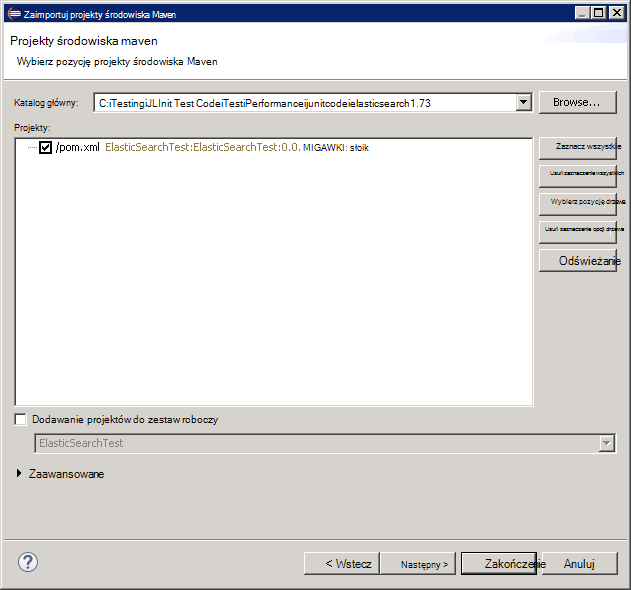

W oknie **Eksplorator pakiet** rozwiń węzeł odpowiadający mu do projektu. Upewnij się, że projekt nie zawiera folder o nazwie **src**. Ten folder zawiera kod źródłowy w teście JUnit. Projektu można skompilować i wdrożone zgodnie z poniższymi instrukcjami.

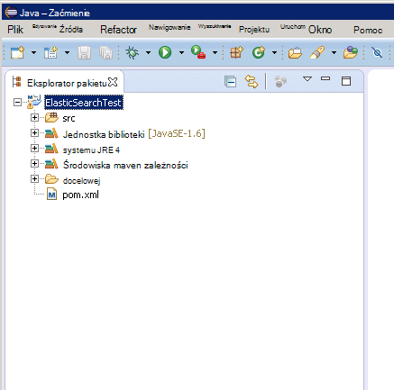

## Wdrażanie JUnit test JMeter

W poniższej procedurze założono, projekt o nazwie LoadTest zawierający klasę JUnit Test o nazwie został utworzony `BulkLoadTest.java` która akceptuje parametry konfiguracji przekazany jako jeden ciąg znaków do konstruktora (jest to mechanizmu oczekuje JMeter).

W IDE Zaćmienie, w **Eksploratorze pakietu**kliknij prawym przyciskiem myszy węzeł projektu, a następnie kliknij polecenie **Eksportuj**.

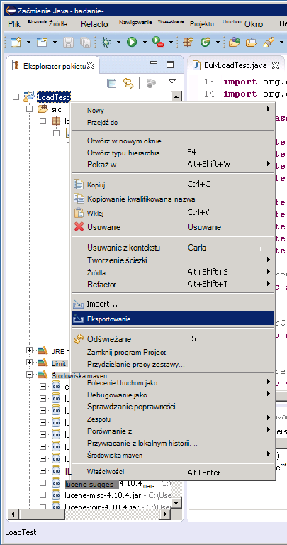

**Kreatora eksportu**, na stronie **Wybierz** rozwiń węzeł **Java** , kliknij, **JAR plik**, a następnie kliknij przycisk **Dalej**.

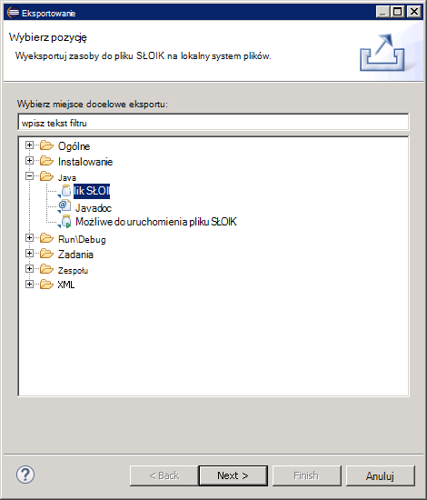

Na stronie **JAR Specyfikacja pliku** w oknie dialogowym **Wybierz zasobów do wyeksportowania** rozwiń węzeł projektu **.project**wyczyść i usuń zaznaczenie opcji **pom.xml**. W oknie dialogowym **JAR pliku** podać nazwę pliku i lokalizację SŁOIK (należy rozszerzenie pliku .jar), a następnie kliknij przycisk **Zakończ**.

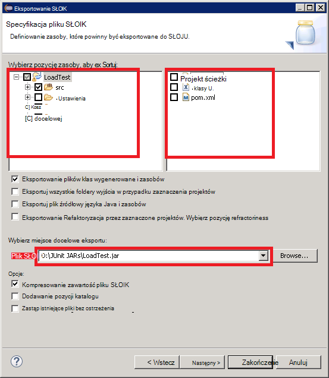

Za pomocą Eksploratora Windows, skopiuj plik SŁOIK właśnie utworzono JMeter maszyny wirtualnej Java wzorca i zapisz go w apache jmeter 2.13\\Biblioteka\\junit folderu znajdującego się w folderze miejsce, w którym zainstalowano JMeter (zobacz procedurę "Tworzenie maszyny wirtualnej wzorca JMeter" podczas [tworzenia środowiska usługi wydajności testowania Elasticsearch Azure](guidance-elasticsearch-creating-performance-testing-environment.md) Aby uzyskać więcej informacji).

Wróć do Zaćmienie, rozwiń okno **Eksploratora pakietu** i zanotuj wszystkie pliki JAR i ich lokalizacji w folderze zależności środowiska Maven projektu na liście. Zwróć uwagę, że wyświetlone na poniższej ilustracji pliki mogą się różnić w zależności od tego, jaka wersja programu Elasticsearch używasz:

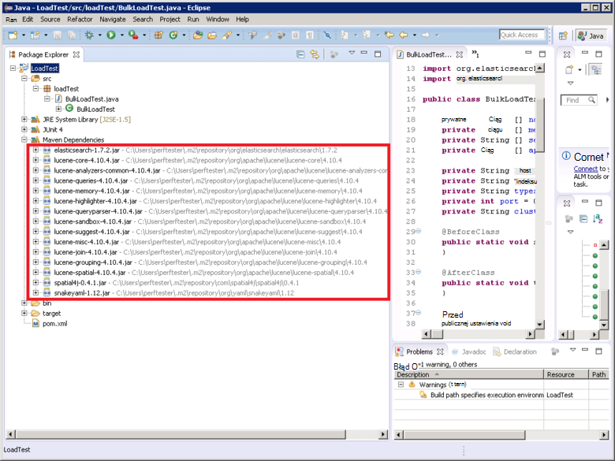

Za pomocą Eksploratora Windows skopiuj każdy plik SŁOIK wymienianych w folderze zależności środowiska Maven apache jmeter 2.13\\Biblioteka\\folder junit na maszyn wirtualnych wzorca JMeter.

Jeśli biblioteka\\junit folder już zawiera starsze wersje tych plików JAR, a następnie usuń je. Jeśli pole w miejscu następnie JUnit test może nie działać zgodnie odwołania można rozpoznać słoików problem.

We wzorcu JMeter maszyn wirtualnych wyłączyć JMeter, gdy jest uruchomiony.  Rozpocznij JMeter.  W JMeter kliknij prawym przyciskiem myszy, **Plan badań**, kliknij przycisk **Dodaj**, kliknij pozycję **wątków (użytkownicy)**, a następnie kliknij **Grupę wątku**.

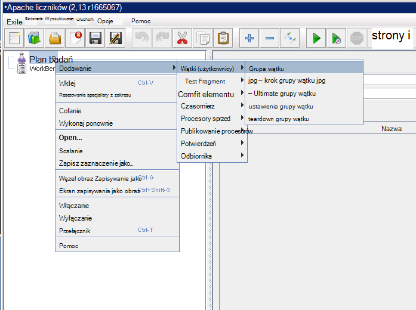

Węźle **Planowanie Test** kliknij prawym przyciskiem myszy **Grupę wątku**, kliknij przycisk **Dodaj**, kliknij pozycję **Przykłady**, a następnie kliknij **Żądania JUnit**.

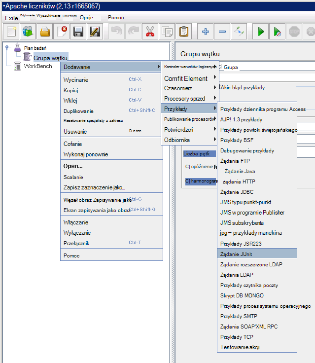

Na stronie **Żądania JUnit** wybierz **Wyszukiwanie adnotacje JUnit4 (zamiast JUnit 3)**. Na liście rozwijanej **Nazwa_klasy** Wybierz klasy test ładowania JUnit (będzie on wymieniony w formularzu * &lt;pakietu&gt;.&lt; klasy&gt;*), **Metoda** metoda testowa listy rozwijanej wybierz pozycję JUnit (jest metodę faktycznie wykonującego pracy związanej z test, należy zostały oznaczone *@test* adnotacji w programie project Zaćmienie), a następnie wprowadź wartości, które zostaną przekazane do konstruktora w polu **Etykieta ciąg konstruktora** . Szczegóły pokazano na poniższej ilustracji przedstawiono przykłady tylko; **Nazwa_klasy** * *Metody*i * *Etykiety ciąg konstruktora** prawdopodobnie różnią się od tych wyświetlana.

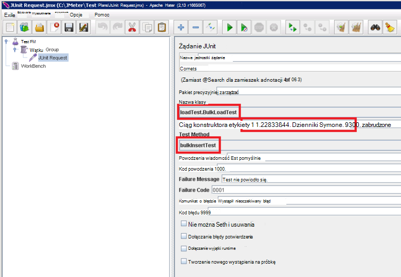

Swojej klasy nie są wyświetlane na liście rozwijanej **Nazwa_klasy** , prawdopodobnie oznacza to, że SŁOJU nie został poprawnie wyeksportowany lub nie został umieszczony w Biblioteka\\junit folder lub część zależne słoików brakuje Biblioteka\\junit folder. W takim przypadku ponownie wyeksportuj projektu z Zaćmienie i zagwarantować, że wybrano zasobów **src** , skopiuj SŁOJU Biblioteka\\junit folder, a następnie sprawdź, czy zostały skopiowane wszystkie zależne słoików, wyświetlane według środowiska Maven do folderu Biblioteka.

Zamknij JMeter. Istnieje bez konieczności Zapisz plan badań.  Skopiuj plik SŁOIK zawierającego klasę test JUnit do /home/&lt;nazwy użytkownika&gt;folder /apache-jmeter-2.13/lib/junit na każdej maszyny wirtualne podrzędne JMeter (*&lt;nazwy użytkownika&gt; * jest nazwą administracyjne użytkownika określonej podczas tworzenia maszyn wirtualnych, uzyskać więcej informacji, zobacz procedurę "Tworzenie maszyn wirtualnych podrzędnego JMeter" podczas [tworzenia środowiska usługi wydajności testowania Elasticsearch Azure](guidance-elasticsearch-creating-performance-testing-environment.md) .)

Kopiowanie plików JAR zależnych wymagane przez klasę test JUnit do /home/&lt;nazwa_użytkownika&gt;folder /apache-jmeter-2.13/lib/junit na każdej maszyny wirtualne podrzędne JMeter. Upewnij się, że najpierw usuń starsze wersje SŁOIK plików z tego folderu.

Możesz użyć `pscp` narzędzie, aby skopiować pliki z komputera z systemem Windows do Linux.

[Tworzenie testowania środowiska dla Elasticsearch Azure]: guidance-elasticsearch-creating-performance-testing-environment.md
