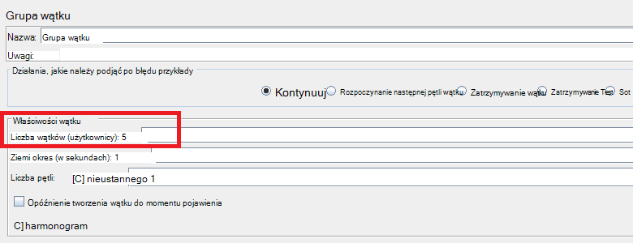
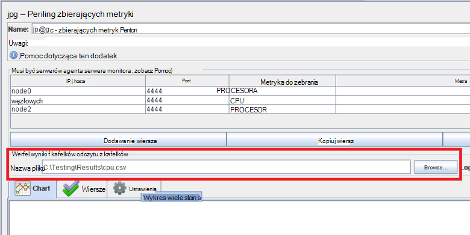
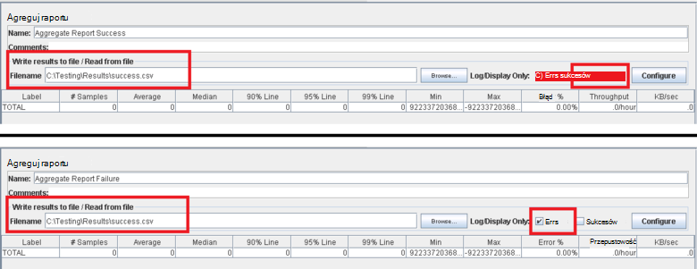
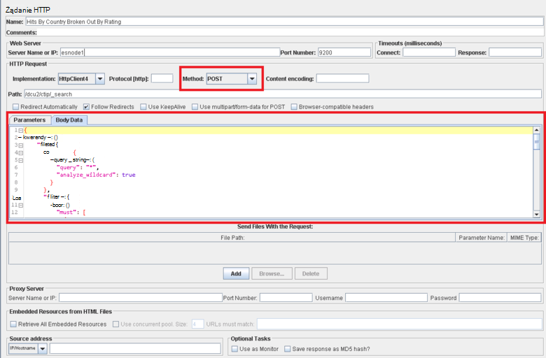

<properties
   pageTitle="Wykonywania planu testowania JMeter do Elasticsearch | Microsoft Azure"
   description="Jak uruchomić wydajności badań Elasticsearch z JMeter."
   services=""
   documentationCenter="na"
   authors="dragon119"
   manager="bennage"
   editor=""
   tags=""/>

<tags
   ms.service="guidance"
   ms.devlang="na"
   ms.topic="article"
   ms.tgt_pltfrm="na"
   ms.workload="na"
   ms.date="09/22/2016"
   ms.author="masashin" />
   
# <a name="implementing-a-jmeter-test-plan-for-elasticsearch"></a>Wykonywania planu testowania JMeter do Elasticsearch

[AZURE.INCLUDE [pnp-header](../../includes/guidance-pnp-header-include.md)]

Ten artykuł jest [częścią serii](guidance-elasticsearch.md). 

Testy wydajności przeprowadzane przed Elasticsearch zostały wprowadzone przy użyciu planów testu JMeter razem z kodu języka Java dołączane jako test JUnit do wykonywania zadań, takich jak przekazywanie danych w grupie. Test planów i kod JUnit opisano w [dostrajania wydajności spożyciu danych dla Elasticsearch Azure][]i [dostrajania agregacji danych i wydajność kwerendy dla Elasticsearch Azure][].

Celem tego dokumentu jest podsumowanie najważniejszych obsługi zdobyte podczas tworzenia i uruchamiania tych testowanie planów. Strona [JMeter najlepsze rozwiązania](http://jmeter.apache.org/usermanual/best-practices.html) w witrynie sieci Web Apache JMeter zawiera więcej ogólnych porad dotyczących efektywnego korzystania JMeter.

## <a name="implementing-a-jmeter-test-plan"></a>Życie planu testowania JMeter

Poniższa lista zawiera podsumowanie elementy, które należy rozważyć podczas tworzenia planu testowania JMeter:

- Tworzenie grupy oddzielnego wątku dla każdego testu, którą chcesz wykonać. Test może zawierać wiele kroków, w tym kontrolery logiki, jaka przed i po procesorów próbki i detektory.

- Należy unikać tworzenia zbyt wiele wątków w grupie wątku. Zbyt częste wątków spowoduje, że JMeter Niepowodzenie "Poza pamięci" wyjątki. Warto dodać więcej serwerów podrzędnych JMeter uruchomiony mniejszej liczby wątków niż spróbuj uruchomić dużej liczby wątków na serwerze JMeter.



- Aby ocenić wydajność klaster, należy włączyć dodatek [Zbierających metryki monitora](http://jmeter-plugins.org/wiki/PerfMon/) do plan badań. To jest odbiornik JMeter jest dostępny jako jeden standardowy wtyczek JMeter. Zapisz dane dotyczące wydajności nieprzetworzonych zestawu plików w formacie wartości rozdzielanych przecinkami (CSV) i procesu ich po zakończeniu test. To jest bardziej efektywne i nakłada mniejsze obciążenie JMeter niż próby przetwarzania danych, jak jest rejestrowany. 



Możesz narzędzia takie Excel umożliwia importowanie danych oraz generowanie zakresu wykresów do analiz.

Należy rozważyć, czy przechwytywanie następujące informacje:

- Użycie Procesora dla każdego węzła w klastrze Elasticsearch.

- Przeczytaj liczbę bajtów na sekundę z dysku dla każdego węzła.

- Jeśli to możliwe procent czasu Procesora poświęconego oczekiwanie na wejścia/wyjścia do wykonania w każdym węźle. To nie zawsze jest możliwe dla maszyny wirtualne systemu Windows, ale Linux można utworzyć niestandardową metrykę (jednostki metryczne WYKONYWALNA), którą wykonuje następujące polecenie powłoki, aby wywołania *vmstat* w węźle:

```Shell
sh:-c:vmstat 1 5 | awk 'BEGIN { line=0;total=0;}{line=line+1;if(line&gt;1){total=total+\$16;}}END{print total/4}'
```

Pole 16 w wyniku kwerendy z *vmstat* zawiera Procesor czasu dla we/wy. Aby uzyskać więcej informacji na temat działania tej instrukcji zobacz [polecenia vmstat](http://linuxcommand.org/man_pages/vmstat8.html).

- Liczbę bajtów wysyłane i otrzymywane przez sieć do każdego węzła.

- Rejestrować częstotliwość operacji pomyślnego i niepowodzeniem i wydajności za pomocą osobnych detektory agregacji raportu. Rejestrowanie sukcesów i porażek danych do innych plików.



- Zachowaj każdorazowo test JMeter możliwie najprostsze ułatwia bezpośrednio przeniesionym wydajności za pomocą test określone akcje. W przypadku testu wymagających złożonych logiczny należy rozważyć, czy zawierający tę logikę w teście JUnit i używać przykłady żądanie JUnit w JMeter testu.

- Przykłady żądania HTTP umożliwia wykonywanie operacji HTTP, takich jak GET, WPIS, położenie lub Usuń. Na przykład można uruchomić Elasticsearch wyszukiwania przy użyciu kwerendy WPIS i podając szczegóły zapytania w polu *Jednostka danych* :



- W celu ułatwienia powtarzalności i ponownego użycia, definiowanie parametrów testowanie planów testu JMeter. Następnie umożliwia wykonywanie skryptów zautomatyzować działania planów testowania.

## <a name="implementing-a-junit-test"></a>JUnit test wykonania

Złożony kod można dołączać do planu testowania JMeter, tworząc jeden lub więcej testów JUnit. JUnit test można napisać przy użyciu języka Java zintegrowanego środowiska programowania (IDE) takich jak Zaćmienie. [Wdrażanie przykłady JMeter JUnit do testowania wydajności Elasticsearch][] zawiera informacje o tym, jak skonfigurować środowisko projektowania właściwe.

Poniżej wymieniono niektóre najważniejsze wskazówki, które należy wykonać podczas pisania kodu dla odpowiedzi w teście JUnit:

- Aby przekazać parametry inicjowania w teście za pomocą konstruktora klasy test. JMeter za pomocą konstruktora, który pobiera argument jeden ciąg znaków. W Konstruktorze analizować ten argument do jego poszczególnych elementów, jak pokazano w poniższym przykładzie:

```Java
private String hostName = "";
private String indexName = "";
private String typeName = "";
private int port = 0;
private String clusterName = "";
private int itemsPerBatch = 0;

/\* JUnit test class constructor \*/
public ElasticsearchLoadTest2(String params) {
    /* params is a string containing a set of comma separated values for:
        hostName
        indexName
        typeName
        port
        clustername
        itemsPerBatch
    */

    /* Parse the parameter string into an array of string items */
    String delims = "\[ \]\*,\[ \]\*"; // comma surrounded by zero or more spaces
    String\[\] items = params.split(delims);

    /* Note: Parameter validation code omitted */

    /* Use the parameters to populate variables used by the test */
    hostName = items[0];
    indexName = items[1];
    typeName = items[2];
    port = Integer.parseInt(items[3]);
    clusterName = items[4];
    itemsPerBatch = Integer.parseInt(items[5]);

    if(itemsPerBatch == 0)
        itemsPerBatch = 1000;
}
```

- Unikaj operacji We/Wy lub innych czasochłonne danych w konstruktorze lub klasy test konfiguracji, ponieważ są zawsze, gdy JUnit test działa. (To samo badanie JUnit może zostać uruchomiony tysiące razy dla każdego testu wydajności uruchamiane JMeter.)

- Należy rozważyć jednorazowej konfiguracji inicjowanie drogich przypadku testowego.

- Jeśli wynik testu wymaga dużej liczby parametrów wejściowych, przechowywania informacji o test konfiguracji w pliku konfiguracji oddzielnych i przekaż lokalizację tego pliku do konstruktora.

- Unikaj trwałym kodowania ścieżki pliku w kodzie test ładowania. Może to powodować błędy ze względu na różnice między operating systems, takie jak Windows i Linux.

- Aby wskazać, że błędów w JUnit metody testów, dzięki czemu będzie ich śledzenia z JMeter i używać ich jako metryk biznesowych za pomocą potwierdzeń. Jeśli to możliwe, przejście wstecz informacje dotyczące przyczynę błędu, jak pokazano w pogrubienie w poniższym przykładzie:

```Java
@Test
public void bulkInsertTest() throws IOException {
    ...
    BulkResponse bulkResponse = bulkRequest.execute().actionGet();
    assertFalse(
        bulkResponse.buildFailureMessage(), bulkResponse.hasFailures());
        ...
}
```


[Running Elasticsearch on Azure]: guidance-elasticsearch-running-on-azure.md
[Dostosowywanie wydajności spożyciu danych dla Elasticsearch Azure]: guidance-elasticsearch-tuning-data-ingestion-performance.md
[Rozmieszczanie przykłady JMeter JUnit dla testów wydajności Elasticsearch]: guidance-elasticsearch-deploying-jmeter-junit-sampler.md
[Dostosowywanie agregacji danych i wydajność kwerendy dla Elasticsearch Azure]: guidance-elasticsearch-tuning-data-aggregation-and-query-performance.md
