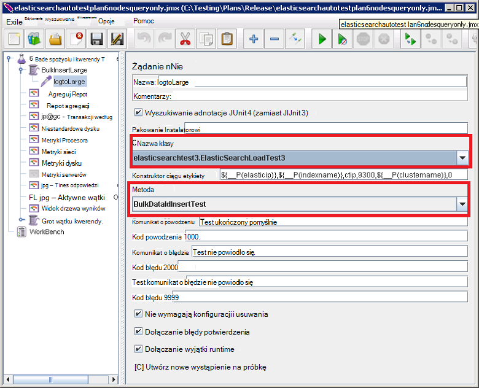

<properties
   pageTitle="Uruchamianie testów wydajności Elasticsearch | Microsoft Azure"
   description="Opis sposobu testów wydajności można uruchamiać w środowisku."
   services=""
   documentationCenter="na"
   authors="dragon119"
   manager="bennage"
   editor=""
   tags=""/>

<tags
   ms.service="guidance"
   ms.devlang="na"
   ms.topic="article"
   ms.tgt_pltfrm="na"
   ms.workload="na"
   ms.date="09/22/2016"
   ms.author="masashin"/>
   
# <a name="running-the-automated-elasticsearch-performance-tests"></a>Uruchamianie testów wydajności Elasticsearch

[AZURE.INCLUDE [pnp-header](../../includes/guidance-pnp-header-include.md)]

Ten artykuł jest [częścią serii](guidance-elasticsearch.md). 

Dokumenty [dostrajania wydajności spożyciu danych dla Elasticsearch Azure] i [dostrajania agregacji danych i wydajność kwerendy dla Elasticsearch Azure] opisano szereg testów wydajności, które były wykonywane klastrze Elasticsearch próbki.

Testy zostały tworzone w celu umożliwienia im mają być wykonywane w sposób automatycznego. W tym dokumencie opisano, jak można powtórzyć testów we własnym środowisku.

## <a name="prerequisites"></a>Wymagania wstępne

Testy automatyczne wymagają następujące elementy:

-  Klaster Elasticsearch.

- Konfigurowanie środowiska JMeter, zgodnie z opisem w dokumencie [tworzenia środowiska usługi wydajności testowania Elasticsearch Azure].

- [Python 3.5.1](https://www.python.org/downloads/release/python-351/) zainstalowanego na wzorcu JMeter maszyn wirtualnych.


## <a name="how-the-tests-work"></a>Jak działają testów
Testy są uruchamiane przy użyciu JMeter. Serwer główny JMeter ładowania planu testowania i przekazuje je do zestawu JMeter serwery podrzędne, które rzeczywiście uruchomić testy. Serwer główny JMeter współrzędne serwerów podrzędnych JMeter i sumuje wyniki.

Dostępne są następujące plany test:

* [elasticsearchautotestplan3nodes.jmx](https://github.com/mspnp/azure-guidance/blob/master/ingestion-and-query-tests/templates/elasticsearchautotestplan3nodes.jmx). Uruchamia test spożyciu w klastrze węzeł 3.

* [elasticsearchautotestplan6nodes.jmx](https://github.com/mspnp/azure-guidance/blob/master/ingestion-and-query-tests/templates/elasticsearchautotestplan6nodes.jmx). Uruchamia test spożyciu w klastrze węzeł 6.

* [elasticsearchautotestplan6qnodes.jmx](https://github.com/mspnp/azure-guidance/blob/master/ingestion-and-query-tests/templates/elasticsearchautotestplan6qnodes.jmx). Uruchamia test spożyciu i kwerend w klastrze węzeł 6.

* [elasticsearchautotestplan6nodesqueryonly.jmx](https://github.com/mspnp/azure-guidance/blob/master/ingestion-and-query-tests/templates/elasticsearchautotestplan6nodesqueryonly.jmx). Uruchamia test tylko do kwerendy w klastrze węzeł 6.


Możesz użyć tych testowanie planów podstawę dla własnego scenariusze, w razie potrzeby mniej lub więcej węzłów.

Plany test używać przykłady żądanie JUnit do generowania i przekaż testowymi danymi. Plan badań JMeter tworzy i uruchamia ten przykłady i monitoruje węzłach Elasticsearch dla dane dotyczące wydajności.  

## <a name="building-and-deploying-the-junit-jar-and-dependencies"></a>Tworzenie i wdrażanie JUnit JAR i zależności
Przed uruchomieniem testów wydajności, które należy pobrać, skompilować i wdrażanie testów JUnit umieszczony w folderze wydajności i junitcode. Testy odwołuje się plan badań JMeter. Aby uzyskać więcej informacji zobacz procedurę "Importowanie istniejącego projektu badania JUnit Zaćmienie" w dokumencie [Wdrażanie przykłady JMeter JUnit do testowania Elasticsearch wydajności].

Dostępne są dwie wersje testów JUnit: 

- [Elasticsearch1.73](https://github.com/mspnp/azure-guidance/tree/master/ingestion-and-query-tests/junitcode/elasticsearch1.73). Użyj tego kodu do wykonywania testów spożyciu. Testy za pomocą 1,73 Elasticsearch.

- [Elasticsearch2](https://github.com/mspnp/azure-guidance/tree/master/ingestion-and-query-tests/junitcode/elasticsearch2). Użyj tego kodu do wykonywania testów kwerend. Testy za pomocą Elasticsearch 2.1 lub nowszy.

Skopiuj odpowiedni plik archiwum (SŁOIK) Java wraz z pozostałych zależności do komputery JMeter. Ten proces jest opisany w [Wdrażanie przykłady JMeter JUnit do testowania Elasticsearch wydajności][]. 

> **Ważne** Po wdrożeniu JUnit test, JMeter umożliwia ładowanie i Konfigurowanie planów test, w których odwołanie JUnit test i upewnij się, że grupa wątku BulkInsertLarge odwołuje się właściwy plik SŁOIK, nazwa klasy JUnit i przetestować metod:
> 
> 
> 
> Zapisywanie planów zaktualizowaną testowania przed uruchomieniem testów.

## <a name="creating-the-test-indexes"></a>Tworzenie indeksów test
Każdego badania wykonuje spożyciu i/lub kwerend dla jednego indeksu określone uruchomienia test. Należy utworzyć indeks, przy użyciu schematów opisanych w dodatkach do dokumentów [dostrajania wydajności spożyciu danych dla Elasticsearch Azure] i [dostrajania agregacji danych i wydajność kwerendy dla Elasticsearch Azure] i konfigurowanie ich według rozwiązania test (wartości dokumentu włączone/wyłączone, wielu replikach itd.) Należy zauważyć, że planów testu założono, że indeks zawiera pojedynczy typ o nazwie *ctip*.

## <a name="configuring-the-test-script-parameters"></a>Konfigurowanie parametrów skryptu testu
Skopiuj następujące pliki parametru skrypt testu do serwera JMeter:

* [run.properties](https://github.com/mspnp/azure-guidance/blob/master/ingestion-and-query-tests/run.properties). Ten plik Określa liczbę wątków test JMeter użyć, czas trwania testu (w sekundach), adres IP węzła (lub równoważenia obciążenia w klastrze Elasticsearch) oraz nazwę grupie:

  ```ini
  nthreads=3
  duration=300
  elasticip=<IP Address or DNS Name Here>
  clustername=<Cluster Name Here>
  ```
  
  Edytowanie tego pliku i określ odpowiednie wartości dla klastrów i test.

* [kwerendy config-win.ini](https://github.com/mspnp/azure-guidance/blob/master/ingestion-and-query-tests/query-config-win.ini) i [kwerendy config-nix.ini](https://github.com/mspnp/azure-guidance/blob/master/ingestion-and-query-tests/query-config-nix.ini). Tych plików zawierają te same informacje; plik *zdobywają* został sformatowany dla systemu Windows nazwy i ścieżki, a plik *nix* został sformatowany Linux nazwy i ścieżki:

  ```ini
  [DEFAULT]
  debug=true #if true shows console logs.

  [RUN]
  pathreports=C:\Users\administrator1\jmeter\test-results\ #path where tests results are saved.
  jmx=C:\Users\administrator1\testplan.jmx #path to the JMeter test plan.
  machines=10.0.0.1,10.0.0.2,10.0.0.3 #IPs of the Elasticsearch data nodes separated by commas.
  reports=aggr,err,tps,waitio,cpu,network,disk,response,view #Name of the reports separated by commas.
  tests=idx1,idx2 #Elasticsearch index(es) name(s) to test, comma delimited if more than one.
  properties=run.properties #Name of the properties file.
  ```

  Edytowanie tego pliku, aby określić lokalizacje wyniki testu Nazwa planu test JMeter, aby uruchomić, adresów IP węzłów danych Elasticsearch zbieranych wskaźniki, raporty zawierające dane nieprzetworzonych wydajności, który zostanie wygenerowany, a nazwę (lub nazwy rozdzielany przecinkami) z index(es) w obszarze badania, jeśli więcej niż jeden , testy zostaną uruchomione po kolei. Jeśli plik run.properties znajduje się w katalogu lub inny folder, określ pełną ścieżkę do tego pliku.

## <a name="running-the-tests"></a>Uruchamianie testów

* Skopiuj plik [test.py kwerendy](https://github.com/mspnp/azure-guidance/blob/master/ingestion-and-query-tests/query-test.py) do JMeter serwera, w tym samym folderze co pliki (kwerendy config-nix.ini) kwerendy config-win.ini i run.properties.

* Upewnij się, że jmeter.bat (Windows) lub jmeter.sh (Linux) są na ścieżce wykonywalny w środowisku usługi.

* Uruchom skrypt test.py kwerendy w wierszu polecenia w celu wykonania testów:

  ```cmd
  py query-test.py
  ```

* Po zakończeniu testowania wyniki są przechowywane jako zbiór przecinkami wartości określone w pliku kwerendy konfiguracji win.ini (kwerendy config-nix.ini) pliki (CSV). Program Excel umożliwia analizowanie, a także tworzyć wykresy te dane.


[Dostosowywanie wydajności spożyciu danych dla Elasticsearch Azure]: guidance-elasticsearch-tuning-data-ingestion-performance.md
[Dostosowywanie agregacji danych i wydajność kwerendy dla Elasticsearch Azure]: guidance-elasticsearch-tuning-data-aggregation-and-query-performance.md
[Tworzenie testowania środowiska dla Elasticsearch Azure]: guidance-elasticsearch-creating-performance-testing-environment.md
[Rozmieszczanie przykłady JMeter JUnit dla testów wydajności Elasticsearch]: guidance-elasticsearch-deploying-jmeter-junit-sampler.md
