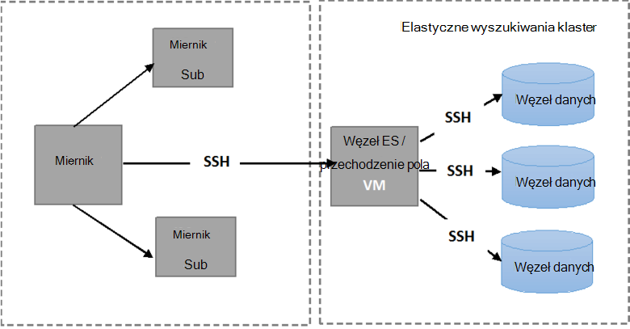

<properties
   pageTitle="Uruchamianie testów elastyczność Elasticsearch | Microsoft Azure"
   description="Opis sposobu można uruchomić testy elastyczność we własnym środowisku."
   services=""
   documentationCenter="na"
   authors="dragon119"
   manager="bennage"
   editor=""
   tags=""/>

<tags
   ms.service="guidance"
   ms.devlang="na"
   ms.topic="article"
   ms.tgt_pltfrm="na"
   ms.workload="na"
   ms.date="09/22/2016"
   ms.author="masashin"/>

# <a name="running-the-automated-elasticsearch-resiliency-tests"></a>Uruchamianie testów elastyczność Elasticsearch

[AZURE.INCLUDE [pnp-header](../../includes/guidance-pnp-header-include.md)]

Ten artykuł jest [częścią serii](guidance-elasticsearch.md).

[Konfigurowanie odporność]i odzyskiwaniu na Elasticsearch Azure[elasticsearch-resilience-recovery], możemy opisano szereg testów, które zostały przeprowadzana klastrze Elasticsearch próbki, można sprawdzić, jak system odpowiedzi pewne wspólne formularze błąd i jak odzyskać. Testy były tworzone umożliwiające im mają być wykonywane w sposób automatycznego. W tym dokumencie opisano, jak można powtórzyć testów we własnym środowisku. 

Zostały przetestowane następujących scenariuszy:

- **Węzła i uruchom ponownie bez utraty danych**. Węzeł danych zatrzymując i ponownie po 5 minut.
Nie chcesz, aby ponownie przydzielić Brak odłamki w tym okresie, nie dodatkowych we/wy jest poniesiony w przenoszenia odłamki został skonfigurowany Elasticsearch. Po ponownym uruchomieniu węzła procesu odzyskiwania powoduje odłamki w tym węźle wstecz na bieżąco.

- **Węzła z utratą danych losowych**. Węzeł danych jest zablokowany i dane, które przechowuje zostaje wymazana celu zasymulowania awarii dysku losowych. Węzeł następnie uruchomieniu (po 5 minut) skutecznie działające jako zamiennik oryginalnego węzła. Proces odzyskiwania wymaga odbudowywania brakujących danych dla tego węzła i może obejmować przenoszenie odłamki przechowywanych na innych węzłach.

- **Węzła i uruchom ponownie bez utraty danych, ale ponowne przydzielenie shard**. Węzeł danych jest zablokowany i odłamki, które przechowuje są przesunąć do innych węzłów. Następnie uruchomieniu węzeł i ponowne przydzielenie więcej dotyczy, aby wyrównać klaster.

- **Stopniowe aktualizacji**. Każdy węzeł w klastrze zatrzymując i ponownie po krótki odstęp w celu zasymulowania maszyny jest uruchomienia po aktualizacji oprogramowania. Tylko jeden węzeł jest zablokowany w dowolnym momencie.
Odłamki nie zostaną ponownie przydzielona podczas węzeł nie działa.

## <a name="prerequisites"></a>Wymagania wstępne

Testy automatyczne wymagają następujące elementy:

- Klaster Elasticsearch.

- Konfigurowanie środowiska JMeter, zgodnie z opisem w [orientacji testów wydajności]. 

- Zainstalowano na JMeter wzorca maszyn wirtualnych tylko następujące dodatki.

    - Środowisko uruchomieniowe Java 7.

    - Nodejs 4.x.x lub nowszym.

    - Narzędzia wiersza polecenia cyfra.

## <a name="how-the-scripts-work"></a>Jak działają skrypty

Skrypty testu mają uruchamiać na maszyn wirtualnych JMeter wzorca. Po wybraniu test, aby uruchomić skrypty następującej sekwencji czynności:

1.  Rozpoczynanie planu testowania JMeter przekazywania parametrów, które mają określone.

2.  Skopiuj skrypt, który wykonuje operacje wymagane przez badania określonej maszyn wirtualnych w klastrze. Może to być dowolny maszyn wirtualnych, który ma publiczny adres IP lub maszyn wirtualnych *Jumpbox* , jeśli skonstruowaniu klaster przy użyciu [szablonu Szybki Start Azure Elasticsearch](https://github.com/Azure/azure-quickstart-templates/tree/master/elasticsearch).

3.  Uruchom skrypt na maszyn wirtualnych (lub Jumpbox).

Poniższa ilustracja przedstawia strukturę środowisku testowym i klaster Elasticsearch. Należy zauważyć, że skrypty test nawiązywanie połączenia z każdym węźle w klastrze do wykonywania różnych operacji Elasticsearch, takich jak zatrzymanie lub ponowne uruchomienie węzła za pomocą bezpiecznego shell (SSH).



## <a name="setting-up-the-jmeter-tests"></a>Konfigurowanie JMeter testów

Przed uruchamianie odporność testów należy skompilować i wdrażanie testów JUnit znajduje się w folderze elastyczność jmeter testów. Testy odwołuje się plan badań JMeter. Aby uzyskać więcej informacji zobacz procedurę "Importowanie istniejącego projektu badania JUnit Zaćmienie" wdrażania [Przykłady JMeter JUnit do testowania Elasticsearch wydajności][].

Dostępne są dwie wersje testów JUnit przechowywane w następujących folderach:

- **Elasticsearch17.** Projekt w tym folderze generuje plik Elasticsearch17.jar. Użyj tego SŁOIK testowania wersji Elasticsearch 1.7.x

- **Elasticsearch20**. Projekt w tym folderze generuje plik Elasticsearch20.jar. Użyj tego SŁOIK testowania Elasticsearch wersji 2.0.0 lub w nowszej wersji

Skopiuj odpowiedni plik SŁOIK wraz z pozostałych zależności do komputery JMeter. Zgodnie z procedurą "Wdrażanie JUnit test JMeter" wdrażania [Przykłady JMeter JUnit dla testów wydajności Elasticsearch]opisano sposób.

## <a name="configuring-vm-security-for-each-node"></a>Konfigurowanie zabezpieczeń maszyn wirtualnych dla każdego węzła

Skrypty testu wymagają certyfikatu uwierzytelniania można zainstalować na każdym węźle Elasticsearch w klastrze. Dzięki temu skryptów, aby były uruchamiane automatycznie bez monitowania o nazwę użytkownika i hasło, jak łączą się różne maszyny wirtualne.

Zacznij od logowanie się do jednego z węzłów w klastrze Elasticsearch (lub maszyn wirtualnych Jumpbox), a następnie uruchom następujące polecenie, aby wygenerować klucz uwierzytelniania:

```Shell
ssh-keygen -t rsa
```

Po połączeniu się węzeł Elasticsearch (lub Jumpbox), uruchom następujące polecenia dla każdego węzła w on klaster Elasticsearch. Zamienianie `<username>` o nazwie prawidłowym użytkownikiem na poszczególnych maszyn wirtualnych i zamienianie `<nodename>` o nazwie DNS lub adres IP maszyn wirtualnych, hostingu węzeł Elasticsearch.
Należy zauważyć, że zostanie wyświetlony monit o podanie hasła użytkownika podczas uruchamiania tych poleceń.
Aby uzyskać więcej informacji, zobacz [Logowanie SSH bez hasła](http://www.linuxproblem.org/art_9.html):

```Shell
ssh <username>@<nodename> mkdir -p .ssh (
cat .ssh/id\_rsa.pub | ssh <username>*@<nodename> 'cat &gt;&gt; .ssh/authorized\_keys'
```

## <a name="downloading-and-configuring-the-test-scripts"></a>Pobieranie i konfigurowanie skryptów testowych

Test skryptów znajdują się w repozytorium cyfra. Poniższa procedura umożliwia pobieranie i skonfigurować skrypty.

Na komputerze wzorca JMeter miejsce, w którym będzie uruchomić testy Otwórz okno pulpitu cyfra (cyfra imprezie) i klonowanie repozytorium, zawierający skryptów, w następujący sposób:

```Shell
git clone https://github.com/mspnp/azure-guidance.git
```

Przejdź do folderu testów elastyczność i uruchom następujące polecenie, aby zainstalować zależności wymagane do uruchomienia testów:

```Shell
npm install
```

Jeśli wzorzec JMeter działa w systemie Windows, Pobierz [Plink](http://www.chiark.greenend.org.uk/~sgtatham/putty/download.html), która jest interfejs wiersza polecenia do klienta Telnet Kit. Skopiuj wykonywalny Plink do folderu elastyczność — sprawdza i Biblioteka.

Jeśli wzorzec JMeter działa w systemie Linux, nie musisz pobrać Plink, ale należy skonfigurować hasło mniej SSH między wzorzec JMeter i węzeł Elasticsearch lub Jumpbox używane, wykonując czynności opisane w procedurze "Konfigurowanie maszyn wirtualnych zabezpieczeń dla każdego węzła." 

Edytuj następujące parametry konfiguracji w `config.js` pliku zgodnie z środowisku testowym i Elasticsearch klaster usługi. Parametry te są wspólne dla wszystkich testów:

| Nazwa | Opis | Wartość domyślna |
| ---- | ----------- | ------------- |
| `jmeterPath` | Lokalna ścieżka miejsce, w którym znajduje się JMeter. | `C:/apache-jmeter-2.13` |
| `resultsPath` | Względne katalog miejsce, w którym skrypt dokonuje zrzutu wynik. | `results` |
| `verbose` | Wskazuje, czy skrypt wyświetla w trybie pełnym lub nie. | `true` |
| `remote` | Wskazuje, czy testów JMeter uruchomione lokalnie lub na serwerach zdalnych. | `true` |
| `cluster.clusterName` | Nazwa klaster Elasticsearch. | `elasticsearch` |
| `cluster.jumpboxIp`         | Adres IP komputera Jumpbox.                 |-|
| `cluster.username`          | Administrator utworzonego podczas wdrażania klaster. |-|
| `cluster.password`          | Hasło użytkownika administratora.                        |-|
| `cluster.loadBalancer.ip`   | Adres IP usługi równoważenia obciążenia Elasticsearch.    |-|
| `cluster.loadBalancer.url`  | Podstawowy adres URL usługi równoważenia obciążenia.                          |-|

## <a name="running-the-tests"></a>Uruchamianie testów

Przejdź do folderu testów elastyczność i uruchom następujące polecenie:

```Shell
node app.js
```

Następujące menu powinny być wyświetlane:


Wprowadź liczbę tego scenariusza, które chcesz uruchomić: `11`, `12`, `13` lub `21`. 

Po wybraniu scenariusza, test zostanie uruchomiony automatycznie. Wyniki są przechowywane jako zbiór wartości rozdzielanych przecinkami (CSV) plików w folderze utworzone na podstawie katalogu wyników. Każdej serii ma własny folder wyników.
Program Excel umożliwia analizowanie, a także tworzyć wykresy te dane.

[Running Elasticsearch on Azure]: guidance-elasticsearch-running-on-azure.md
[Tuning Data Ingestion Performance for Elasticsearch on Azure]: guidance-elasticsearch-tuning-data-ingestion-performance.md
[wskazówki dotyczące testów wydajności]: guidance-elasticsearch-creating-performance-testing-environment.md
[JMeter guidance]: guidance-elasticsearch-implementing-jmeter.md
[Considerations for JMeter]: guidance-elasticsearch-deploying-jmeter-junit-sampler.md
[Query aggregation and performance]: guidance-elasticsearch-query-aggregation-performance.md
[elasticsearch-resilience-recovery]: guidance-elasticsearch-configuring-resilience-and-recovery.md
[Resilience and Recovery Testing]: guidance-elasticsearch-running-automated-resilience-tests.md
[Rozmieszczanie przykłady JMeter JUnit dla testów wydajności Elasticsearch]: guidance-elasticsearch-deploying-jmeter-junit-sampler.md
