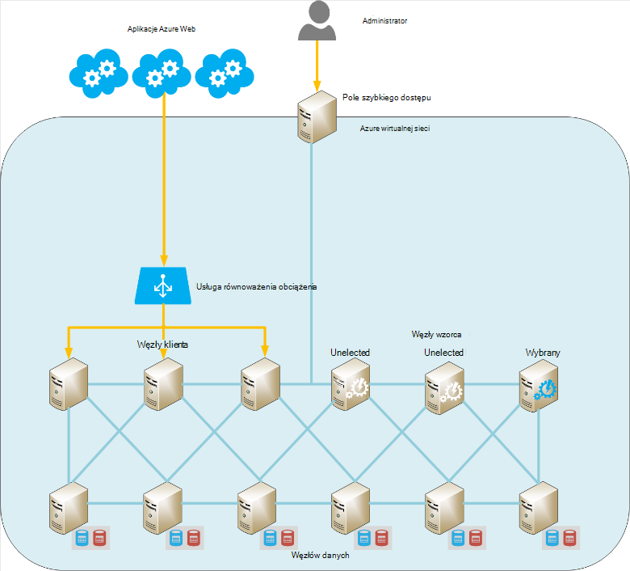

<properties
   pageTitle="Uruchamianie Elasticsearch Azure | Microsoft Azure"
   description="Jak instalowania, konfigurowania i uruchamiania Elasticsearch Azure."
   services=""
   documentationCenter="na"
   authors="dragon119"
   manager="bennage"
   editor=""
   tags=""/>

<tags
   ms.service="guidance"
   ms.devlang="na"
   ms.topic="article"
   ms.tgt_pltfrm="na"
   ms.workload="na"
   ms.date="09/22/2016"
   ms.author="masashin"/>

# <a name="running-elasticsearch-on-azure"></a>Uruchamianie Elasticsearch Azure

[AZURE.INCLUDE [pnp-header](../../includes/guidance-pnp-header-include.md)]

Ten artykuł jest [częścią serii](guidance-elasticsearch.md). 

## <a name="overview"></a>Omówienie

Ten dokument zawiera krótkie wprowadzenie do ogólnej struktury Elasticsearch, a następnie w tym artykule opisano sposoby implementowania klaster Elasticsearch przy użyciu Azure. Dotknęła na najlepsze rozwiązania dotyczące rozmieszczania klastrze Elasticsearch skoncentrowanie się na różnych funkcjonalności wydajności i wymagania dotyczące zarządzania systemu oraz uwzględniając należy wpływie wymagań dotyczących konfiguracji i topologii wybranej.

> [AZURE.NOTE] Te wskazówki przyjęto założenie, niektóre podstawowe znajomości [Elasticsearch][].

## <a name="the-structure-of-elasticsearch"></a>Struktura Elasticsearch 

Elasticsearch jest baza danych dokumentu wysoce zoptymalizowane ma pełnić rolę aparat wyszukiwania. Dokumenty są szeregować w formacie JSON. Dane odbywa się w indeksie, wykonywane przy użyciu [Apache Lucene][], mimo że szczegóły zostaną usunięte z widoku i nie jest konieczne lepiej zrozumieć Lucene było użyć Elasticsearch.

### <a name="clusters-nodes-indexes-and-shards"></a>Klastrów, węzły indeksy i odłamki

Elasticsearch wykonuje grupowany architekturę, która używa sharding do rozpowszechniania danych w wielu węzły i replikacji w celu zapewnienia wysokiej dostępności. Dokumenty są przechowywane w indeksie. Użytkownik może określić pola, które w dokumencie są używane do jednoznacznie identyfikować w indeksu lub systemu można tworzyć pola klucza i wartości automatycznie. Indeks jest używana fizycznie organizowanie dokumentów i kapitału sposób lokalizowanie dokumentów. 

Indeks zawiera zestaw odłamki. Dokumenty są równomiernie rozmieszczonych przez odłamki przy użyciu mechanizmu mieszania na podstawie wartości kluczy indeksu i liczba odłamki w indeksie. 

Indeksy mogą być replikowane. W tym przypadku jest kopiowana każdego shard w indeksie. Elasticsearch zapewnia, że każdy oryginalny shard dla indeksu (nazywane "shard podstawowego") i jego replice zawsze znajdować się na różnych węzłach. Podczas dodawania lub modyfikowania dokumentu wszystkie zapisu operacje są wykonywane na podstawowy shard pierwszego, a następnie w każdej replice. 

Na poniższym rysunku przedstawiono podstawowych aspektów klastrze Elasticsearch zawierającym trzy węzły. Utworzono indeksu, która składa się z dwóch podstawowych odłamki z dwóch replikami dla każdego shard (sześć odłamki we wszystkich).


*Prosta klastrze Elasticsearch zawierającym dwa węzły podstawowego i dwa zestawy replik*

W tym klastrze podstawowego shard 1 i podstawowego shard 2 znajdują się na osobne węzły ułatwiające obciążenie w notatkach. Repliki podobnie są rozdzielane. Jeśli jeden węzeł kończy się niepowodzeniem, pozostałe węzły masz wystarczających informacji, aby włączyć system działał. W razie potrzeby Elasticsearch będzie promować shard replice zostać shard podstawowy, jeśli odpowiadające im shard podstawowy jest niedostępny.

### <a name="node-roles"></a>Węzeł ról

Węzły w klastrze Elasticsearch można wykonywać następujących ról:

- **Węzeł danych** , który może zawierać co najmniej jeden odłamki, które zawierają dane indeksu.

- **Węzeł Klient** , który nie ma danych indeks, ale obsługuje przychodzących żądań wprowadzone przez aplikacje klienckie do węzła odpowiednie dane.
 
- **Główny węzeł** nie przechowuje dane indeksu, natomiast wykonywania operacji zarządzania klaster, takich jak zachowanie i rozpowszechnianie informacji routingu wokół klaster (które węzły zawierają które odłamki listy), określanie węzły, które są dostępne, przenoszenie odłamki jako węzły pojawiają się i znikają i koordynowania odzyskiwania po węzła. Wiele węzłów można skonfigurować jako wzorców, ale tylko jeden będzie faktycznie wybranych funkcji wzorca. Jeśli ten węzeł nie powiedzie się, wybór innej ma miejsce, a jeden z innych odpowiedniej węzłów wzorca zostanie wybrany i przejąć.

> [AZURE.NOTE]Niezwykle ważne dobra klaster jest wybrany węzeł wzorca. Inne węzły ping je regularnie, aby upewnić się, że jest on nadal dostępny. Jeśli wybrany węzeł główny działa również jako węzeł danych, istnieje prawdopodobieństwo, że węzeł może stać się czymś i błędów odpowiedzi na te polecenia ping. W tej sytuacji wzorcu uznaje się nie powiodło się, a jeden z innych węzłów wzorca jest wybrany w tym miejscu. 

 Na poniższym rysunku przedstawiono topologii zawierające dedykowane wzorca, klientów i węzłów danych w klastrze Elasticsearch.


*Klaster Elasticsearch typami węzłów*

### <a name="costs-and-benefits-of-using-client-nodes"></a>Kosztów i korzyści wynikające z używania węzły klienta

Gdy aplikacja przesyła kwerendy z klastrem Elasticsearch, węzeł, do której aplikacja łączy jest odpowiedzialny za kierowanie procesu kwerendy. Węzeł przesyła żądanie do każdego węzła danych i zbiera dane wyników, zwracanie zakumulowaną informacji do aplikacji. Jeśli kwerenda obejmuje agregacji i pozostałych obliczeń, węzeł, do której aplikacja łączy wykonuje operacje niezbędne po pobraniu dane z każdego z pozostałych węzłach. Ten proces punktowych i zbieranie mogą używać znacznych zasobów przetwarzania i pamięci.

Za pomocą klienta dedykowane węzły do wykonywania następujących zadań umożliwia węzłów danych skoncentrować się na zarządzanie i przechowywania danych. Wynik to, że wiele scenariuszy, które wymagają złożonych kwerend i agregacji można korzystać z węzły dedykowane klienta. Jednak wpływ przy użyciu klienta dedykowane węzły prawdopodobnie różnią się w zależności od scenariusza, obciążenie pracą i rozmiar klaster. 

> [AZURE.NOTE] Aby uzyskać więcej informacji na temat dostosowywania procesu odwołują się do [dostosowywania agregacji danych i wydajność kwerendy dla Elasticsearch Azure][] .

### <a name="connecting-to-a-cluster"></a>Łączenia się z klastrem

Elasticsearch udostępnia szereg pozostałych interfejsów API do tworzenia aplikacji klienta i wysyłanie wezwań do klastrów. Jeśli tworzysz aplikacje przy użyciu programu .NET Framework są dostępne — dwa poziomy wyższe interfejsy API [Elasticsearch.Net i ZAGNIEŻDŻONE][].

Jeśli tworzysz aplikacje klienckie przy użyciu języka Java umożliwia [Interfejsu API klienta węzeł][] utworzyć węzły klienta dynamicznie i dodać je do klaster. Tworzenie klienta dynamicznie węzły jest wygodny, jeśli jest używany system stosunkowo niewielką liczbą długotrwałe połączenia. Utworzone za pomocą interfejsu API węzeł węzły klienta są dostarczane z klastrem routingu mapowanie (szczegóły, które węzły zawierają które odłamki) przez węzeł wzorca. Te informacje umożliwia aplikacji Java bezpośrednio połączyć odpowiednie węzły podczas indeksowania i badania danych, zmniejszenie liczby przeskoków, które mogą być konieczne w przypadku korzystania z innych interfejsów API.

Koszt tej metody jest obciążenie związane z rejestrowanie węzeł klient w grupie. Jeśli dużej liczby węzłów klienckich pojawiają się i znikają szybko, wpływ na utrzymanie i rozpowszechniania Mapa routingu klaster może stać się istotne.

Na poniższym rysunku przedstawiono konfiguracji, która używa równoważenia obciążenia do kierowania żądań do zestawu węzłów klienta, chociaż samej strategii można użyć do połączenia bezpośrednio z węzłów danych, jeśli węzłów klienckich nie są używane.


*Nawiązywanie połączenia z klastrem Elasticsearch za pośrednictwem usługi równoważenia obciążenia Azure wystąpień aplikacji klienta*

> [AZURE.NOTE]Za pomocą [Usługi równoważenia obciążenia Azure][] udostępniania klaster do publicznego Internetu, lub możesz użyć [usługi równoważenia obciążenia wewnętrzny][] , jeśli aplikacje klienckie i klaster ujęte są całkowicie w tej samej wirtualnej sieci prywatnej (VNet).

### <a name="node-discovery"></a>Odnajdowanie węzeł

Elasticsearch jest oparty na komunikacji w sesjach równorzędnych, więc odkrywanie węzłach w klastrze jest ważnym elementem w cyklu życia węzła. Odnajdowanie węzeł udostępnia nowe węzły danych do dodania dynamicznie z klastrem, co z kolei pozwala klaster skalowania przezroczysty. Ponadto jeśli węzeł danych nie powiedzie się reagować na żądania komunikacji z innych węzłów, węźle głównym można zdecydować, że węzeł danych nie powiodło się i wykonać czynności niezbędne do ponownego przydzielenia odłamki, które zostało gospodarstwa węzłach danych operacyjnych.

Odnajdowanie węzeł Elasticsearch odbywa się przy użyciu modułu odnajdowania. Moduł odnajdowania jest wtyczki, które mogą być przełączane do korzysta z mechanizmu odnajdowania różnych. Domyślny moduł odnajdowania ([Zen][]) powoduje, że węzeł do wykonania żądania usługi ping znajdowanie innych węzłów na tej samej sieci. Jeśli inne węzły nie odpowiada, ich poplotkujmy wymiany informacji. Główny węzeł można rozpowszechnianie odłamki nowy węzeł (jeśli jest węzeł danych) i wyrównać klaster. Moduł odnajdowania Zen obsługuje również procesu wyborów wzorca i protokół wykrywania węzła.

Ponadto jeśli węzły Elasticsearch jest używany jako Azure wirtualnych maszyn, obsługa wiadomości multiemisji nie jest obsługiwane. Ze względów ten należy skonfigurować odnajdowania Zen, aby korzystać z emisji pojedynczej wiadomości i podaj listę prawidłowych węzłów kontaktów w pliku konfiguracji elasticsearch.yml.

Jeśli przechowujesz klaster Elasticsearch w Azure wirtualnej sieci można określić, że prywatnego IP przypisany DHCP zaadresowaną poszczególnym maszyn wirtualnych w klastrze powinny pozostać przydzielonego (statyczny). Możesz skonfigurować Zen odnajdowania emisji pojedynczej wiadomości przy użyciu tych adresów IP. Maszyny wirtualne za pomocą dynamiczne adresy IP, pamiętać, że jeśli maszyny zatrzymuje i uruchamia ponownie go może zostać przydzielone nowy adres IP, co odnajdowania trudniejsze. Obsłudze tego scenariusza, możesz zamienić moduł odnajdowania Zen dla [Wtyczki chmura Azure][]. Ten dodatek używa interfejsu API Azure w celu zaimplementowania mechanizmu odnajdowania jest oparte na informacjach Azure subskrypcji.

> [AZURE.NOTE]Bieżącą wersję dodatku chmura Azure należy zainstalować certyfikat zarządzania dla subskrypcji Azure elementu keystore Java w węźle Elasticsearch i podaj lokalizację i poświadczenia dostępu do elementu keystore w pliku elasticsearch.yml. Ten plik jest przechowywany w zwykłego tekstu, aby była wszechobecne, że należy upewnić się, że ten plik jest dostępny tylko przy użyciu konta usługi Elasticsearch. 
> 
> Ponadto tej metody mogą być niezgodne z wdrożenia Azure Menedżera zasobów. Z tego powodu zaleca się używanie statycznych adresów IP dla węzłów wzorca i emisji odnajdowania Zen pojedynczej wiadomości w klastrze przy użyciu tych węzłów. W następujących konfiguracji (pobrane z pliku elasticsearch.yml węzeł danych przykładowych) adresów IP hosta odwołanie wzorca węzły w klastrze:

```yaml
discovery.zen.ping.multicast.enabled: false  
discovery.zen.ping.unicast.hosts: ["10.0.0.10","10.0.0.11","10.0.0.12"]
```

## <a name="general-system-guidelines"></a>Wskazówki dotyczące ogólnego systemu

Elasticsearch można uruchamiać na różnych komputerach, począwszy od jednego komputera przenośnego do klastrów serwerów wysokiej jakości. Więcej zasobów w pamięci, obliczeniowych, że power i szybkie dyski, które są jednak dostępne lepszą wydajność. Poniższe sekcje podsumowywanie podstawowe wymagania sprzętu i oprogramowania do uruchamiania Elasticsearch.

### <a name="memory-requirements"></a>Wymagania dotyczące pamięci 

Pozwala podjąć próbę przechowywania danych w pamięci szybkości Elasticsearch. Serwer produkcji obsługujący węzeł typowe firmy lub o rozmiarze umiarkowane komercyjnego wdrożenia Azure powinien mieć między 14GB oraz 28GB pamięci RAM (D3 lub maszyny wirtualne D4). **Rozdzielić obciążenie między więcej węzły zamiast tworzenia węzły z większą ilością pamięci** (Doświadczeń mają pokazane czy większe węzły za pomocą więcej pamięci mogą powodować razy przedłużone odzyskiwanie usługi w przypadku awarii.) Jednak mimo że tworzenie klastrów z bardzo dużej liczby węzłów małych można zwiększyć dostępność i przepustowość, go też przypiszą nakładu zajmujących się utrzymywania taki system i zarządzania nimi.

**Przydzielanie 50% dostępnej pamięci na serwerze w celu stosu Elasticsearch**. Jeśli korzystasz z zestawu Linux zmiennej środowiska ES_HEAP_SIZE przed uruchomieniem Elasticsearch. Ewentualnie, jeśli korzystasz z systemu Windows i Linux oraz można określić rozmiar pamięci w `Xmx` i `Xms` parametrów podczas uruchamiania Elasticseach. Zestaw obu tych parametrów na tę samą wartość, aby uniknąć maszyn wirtualnych Java (JVM) rozmiaru stosu w czasie rzeczywistym. Jednak **nie przydzielić ponad 30 GB**. Za pomocą pozostałych pamięci dla pamięci podręcznej plików systemu operacyjnego.

> [AZURE.NOTE]Elasticsearch wykorzystuje biblioteki Lucene tworzyć i zarządzać nimi indeksy. W strukturze Lucene za pomocą formatu opartej na dysku i pamięci podręcznej te struktury w pamięci podręcznej systemu plików znacznie zwiększyć wydajność.

Należy zauważyć, że rozmiar maksymalny stosu optymalne dla języka Java na komputerze z 64-bitowej powyżej 30GB. Nad tym rozmiar Java przełączy się do korzystania z rozszerzonego mechanizmu dla odwoływanie się do obiektów na stosu, które zwiększa wymagania dotyczące pamięci dla każdego obiektu i zmniejsza wydajność. 

Domyślne zbierających śmieci Java (znak równoczesne i wyczyść) może również optymalnej wydajności podrzędnego w przypadku rozmiar stosu powyżej 30 GB. Nie obecnie zaleca się przełączyć się do różnych zbierających śmieci jako Elasticsearch i Lucene tylko przetestowano pod kątem zgodności domyślny.

Nie overcommit pamięci, jak potrzeby wymiany pamięci głównej na dysku poważnie będzie mieć wpływ na wydajność. Jeśli to możliwe, wyłącz zamienianie całkowicie (szczegóły zależą od systemu operacyjnego). Jeśli nie jest to możliwe następnie ustawienie *mlockall* w pliku konfiguracji Elasticsearch (elasticsearch.yml) w następujący sposób:

```yaml
bootstrap.mlockall: true
```

Taka konfiguracja powoduje maszyny wirtualnej Java w celu zablokowania pamięci i powoduje jest wymieniony przez system operacyjny.

### <a name="disk-and-file-system-requirements"></a>Wymagania systemowe dysku i plików

Za pomocą dysków danych kopii przez Magazyn premium do przechowywania odłamki. Dyski należy o rozmiarze, aby wstrzymać maksymalnej ilości danych oczekiwać w swojej odłamki, chociaż można dodać kolejne dyski później. Shard można rozszerzyć na wielu dyskach w węźle.

> [AZURE.NOTE]Elasticsearch kompresuje dane przechowywane pól za pomocą algorytmu LZ4, a w Elasticsearch 2.0 lub nowszym można zmienić typ kompresji. Algorytm kompresji można przełączyć się DEFLATE używane przez narzędzia *zip* i *gzip* . Ta metoda kompresji może być większej ilości zasobów, ale należy rozważyć użycie go dla zarchiwizowanych danych dziennika. Tej metody może pomóc w celu zmniejszenia rozmiaru indeksu.

Nie jest konieczne, że wszystkie węzły w klastrze mają ten sam układ dysku i wydajność. Jednak węzeł o pojemności dysku bardzo duże w stosunku do innych węzłów w klastrze będzie przyciągnąć większej ilości danych i wymaga możliwości przetwarzania lepszą obsługę danych. W związku z tym może stać się węzeł "ciepłej" w stosunku do innych węzłów, a z kolei może to wpłynąć na wydajność.

Jeśli to możliwe Użyj RAID 0 (rozkładanie). Inne formy RAID implementujących spójności i odzwierciedlające są konieczne, gdyż Elasticsearch rozwiązaniem własnej wysoka dostępność w formularzu replik.

> [AZURE.NOTE]Przed Elasticsearch 2.0.0 można także zaimplementować rozkładanie na poziomie oprogramowania, określając wielu katalogów w ustawieniach konfiguracji *path.data* . W Elasticsearch 2.0.0 Ten formularz rozkładanie nie jest już obsługiwana. Zamiast tego innego odłamki mogą zostać przypisane do różnych ścieżek, ale wszystkie pliki w jednym shard zostaną zapisane w tej samej ścieżce. Jeśli jest wymagane rozkładanie, należy paskowych dane na poziomie sprzętu lub system operacyjny. 

Aby zmaksymalizować przepustowości miejsca do magazynowania, każdego **maszyn wirtualnych powinien mieć konto dedykowane premium miejsca do magazynowania**.

Biblioteki Lucene służy do przechowywania danych indeksu dużej liczby plików i Elasticsearch można otworzyć znaczącej liczby sockets komunikacji między węzły i z klientami. Upewnij się, że system operacyjny jest skonfigurowany do obsługi odpowiednią liczbę deskryptorów Otwórz plik (maksymalnie 64000, jeśli pamięć wystarczające jest dostępna). Należy zauważyć, że domyślną konfigurację wielu dystrybucji Linux ogranicza liczbę deskryptorów Otwieranie pliku w celu 1024, czyli znacznie za mały.

Elasticsearch używa mapowanych w pamięci (mmap) we/wy i Java nowe we/wy (NIO) do optymalizacji równoczesne uzyskiwanie dostępu do plików danych i indeksy. Jeśli korzystasz z Linux, należy skonfigurować system operacyjny do zapewnienia, że jest wystarczające pamięć wirtualna dostępne z miejsca do magazynowania dla obszary mapy pamięci 256K.

> [AZURE.NOTE]Wiele Linux dystrybucji domyślnie przy użyciu całkowicie projektu naukowego Kolejkowanie harmonogramu (CFQ) podczas rozmieszczania jest zapisanie danych na dysku. Ten harmonogram nie jest zoptymalizowana pod kątem twarde SSD. Należy rozważyć ponowne konfigurowanie systemu operacyjnego harmonogram aktualizujący nie działa lub harmonogram termin ostateczny, które są bardziej skutecznych dla twarde SSD.

### <a name="cpu-requirements"></a>Wymagania dotyczące Procesora

Azure maszyny wirtualne są dostępne w wielu konfiguracjach Procesora pomocniczych między 1 a 32 rdzenie. Węzeł danych dobry punkt wyjścia w przypadku standardowej serii Zasadami maszyn wirtualnych, a następnie wybierz pozycję DS3 (4 rdzenie) lub D4 SKU (rdzenie 8). DS3 zapewnia także 14GB pamięci RAM, gdy DS4 zawiera 28GB. 

Serii GS (w przypadku przechowywania premium) i G serii (w przypadku standardowego magazynu) za pomocą procesory Xeon E5 V3, które mogą być przydatne w przypadku obciążenia, które są mocno obliczeniowych, takich jak agregacje na dużą skalę. Aby uzyskać najnowsze informacje odwiedź [rozmiarów maszyn wirtualnych][].

### <a name="network-requirements"></a>Wymagania sieci

Elasticsearch wymaga przepustowości między 1 a 10Gbps, w zależności od rozmiaru i zmienności klastrów, które wykonuje go. Elasticsearch migruje odłamki węzłów, gdy więcej węzłów są dodawane do klastrów. Elasticsearch założono czasu komunikacji między wszystkie węzły odpowiada w przybliżeniu i nie należy rozważyć, czy względne lokalizacje odłamki przechowywanych w tych węzłów. Ponadto replikacji może spowodować istotne sieci We/Wy między odłamki. Z tego powodu **należy unikać tworzenia klastrów w węzłach, które znajdują się w różnych regionów**.

### <a name="software-requirements"></a>Wymagania dotyczące oprogramowania

Elasticsearch można uruchamiać w systemie Windows lub Linux. Usługa Elasticsearch jest używany jako biblioteki słoik Java i ma zależności od innych bibliotek Java, które znajdują się w pakiecie Elasticsearch. Konieczne jest zainstalowanie Java 7 (aktualizacja z 55 lub nowszy) lub Java 8 (aktualizacja z 20 lub nowszy) maszyny wirtualnej Java, aby uruchomić Elasticsearch.

> [AZURE.NOTE]Oprócz parametrów pamięci *Xmx* i *Xms* (określony jako opcje wiersza polecenia do aparatu Elasticsearch — zobacz [wymagania dotyczące pamięci][]) nie modyfikuj domyślnych ustawień konfiguracji maszyny wirtualnej Java. Elasticsearch została zaprojektowana przy użyciu ustawień domyślnych; zmiana ich może spowodować Elasticsearch detuned i niskiej wydajności.

### <a name="deploying-elasticsearch-on-azure"></a>Wdrażanie Elasticsearch Azure

Mimo że nie jest trudne do wdrożenia jedno wystąpienie Elasticsearch, tworzenie liczby węzłów i instalowanie i konfigurowanie Elasticsearch na każdej z nich może być czasochłonne i podatne na błędy proces. Planując uruchomionych Elasticsearch maszyny wirtualne Azure, masz trzy opcje, które mogą pomóc w celu zmniejszenia ryzyka błędów.

- Używanie Menedżera zasobów Azure [szablonu](https://azure.microsoft.com/marketplace/partners/elastic/elasticsearchelasticsearch/) w Azure marketplace. Ten szablon jest tworzona przez elastyczne. Umożliwia dodawanie komercyjnego ulepszeń, takich jak tarczą, Marvel, Monitor i tak dalej.

- Za pomocą Azure Szybki Start [szablonu](https://github.com/Azure/azure-quickstart-templates/tree/master/elasticsearch) do utworzenia klaster. Tego szablonu można utworzyć klaster oparty na systemie Windows Server 2012 lub Ubuntu Linux 14.0.4. Umożliwia korzystanie z funkcji badawczych, takich jak magazyn plików Azure. Ten szablon służy do badań i testowania zadań w tym dokumencie.

- Za pomocą skryptów, które mogą być automatycznego lub uruchamiana bez nadzoru. Skrypty, które może tworzyć i wdrażać klaster Elasticsearch są dostępne w [repozytorium GitHub][elasticsearch-scripts]

## <a name="cluster-and-node-sizing-and-scalability"></a>Klaster i zmiany rozmiaru węzeł i skalowalność 

Elasticsearch udostępnia szereg topologii wdrożenia, z myślą o obsłudze różne wymagania i poziomy skali. W tej sekcji opisano niektóre typowe topologii, a w tym artykule opisano zagadnienia dotyczące stosowania klastrów oparte na tych topologii.

### <a name="elasticsearch-topologies"></a>Topologii Elasticsearch

Na poniższym rysunku przedstawiono punkt wyjścia do projektowania topologii Elasticsearch dla Azure:



*Sugerowane punkt początkowy dla tworzenia klastrze Elasticsearch z platformy Azure*

Ta topologia zawiera sześć węzły dane z trzech węzłów klienckich i trzy węzły wzorca (tylko raz jest wybrany węzeł wzorca, dwa inne są dostępne do wyboru w przypadku nie zaznaczony wzorzec.) Każdy węzeł jest zaimplementowana jako osobne maszyn wirtualnych. Aplikacje sieci web Azure są kierowane do węzłów klienckich za pośrednictwem usługi równoważenia obciążenia. 

W tym przykładzie wszystkie węzły i aplikacji sieci web znajdują się w tej samej sieci wirtualnych, które skutecznie wyodrębnia ich ze świata zewnętrznego. Jeśli klaster musi być dostępna zewnętrznie (niekiedy jako część rozwiązania hybrydowego dołączanie klientów lokalnego), można zapewnić publiczny adres IP usługi równoważenia obciążenia Azure, ale musisz wykonać dodatkowe ostrożności, aby wyeliminować możliwość uzyskania nieautoryzowanego dostępu do klaster. 

Opcjonalnie "przejść pole" jest maszyn wirtualnych, który jest dostępny tylko dla administratorów. Ten maszyn wirtualnych ma połączenie sieciowe jest wirtualną sieć, lecz także na zewnątrz przeciwległych połączenie sieciowe, aby umożliwić logowanie administratora z sieci zewnętrznej (to logowania powinny być chronione za pomocą silnego hasła lub certyfikatu). Administrator może zalogować się do pola szybkiego dostępu, a następnie podłącz stamtąd bezpośrednio do dowolnego z węzłów w klastrze. 

Alternatywnych metod zawierać przy użyciu sieci VPN witryny do witryny między organizacji i wirtualnych sieci lub przy użyciu obwodów [ExpressRoute][] nawiązania połączenia wirtualnej sieci. Mechanizmy zezwalać na dostęp administracyjny do klaster bez ujawniania klaster do publicznego Internetu.

Aby zachować dostępność maszyn wirtualnych, węzłów danych są pogrupowane w ten sam zestaw Azure dostępności. Podobnie węzłów klienckich odbywa się w innym zbiorze dostępność i wzorca węzły są przechowywane w trzecim Ustawianie dostępności.

Ta topologia jest stosunkowo łatwo skalowania, wystarczy dodać więcej węzłów odpowiedniego typu i upewnij się, że zostały skonfigurowane o takiej samej nazwie klaster w pliku elasticsearch.yml. Również węzłów klienckich mają zostać dodane do puli wewnętrznej bazy danych dla usługi równoważenia obciążenia Azure.

**Lokalizowanie Geo klastrów**

**Nie rozdzielanie węzłów w klastrze między różnymi regionami, jak to może mieć wpływ na wydajność komunikacji między węzeł** (zobacz [wymagania sieci][]). Lokalizowanie Geo danych Zamknij, aby użytkownicy w różnych regionów wymaga tworzenia wielu klientów. W tym przypadku należy wziąć pod uwagę jak (lub nawet, czy) do synchronizacji klastrów. Możliwe rozwiązania obejmują:

[Węzły tribe][] są podobne do węzła klienta, ale można uczestniczyć w wielu klastrów Elasticsearch i wyświetlać je wszystkie jako jeden duży klaster. Dane są nadal zarządzane lokalnie przy każdy klaster (aktualizacje nie są przenoszone przez granice klaster), ale wszystkie dane są widoczne. Węzeł tribe można wykonać kwerendę, tworzenie i zarządzanie dokumentami w dowolnym klaster. 

Podstawowy ograniczenia są że węzeł tribe nie można utworzyć nowy indeks, a nazwy indeksów musi być unikatowa we wszystkich klastrów. W związku z tym należy rozważyć jak nazwane indeksy podczas projektowania dostępu z węzłów tribe do klastrów.

Użycie tego mechanizmu, każdy klaster może zawierać dane, które są najczęściej są dostępne w aplikacjach klienckich lokalnych, ale tych klientów można nadal dostępu i modyfikowania danych zdalnego chociaż z możliwości rozszerzonego opóźnienie. Na poniższym rysunku przedstawiono przykład tej topologii. Wyróżniona węzeł tribe w klastrze 1; innych klastrów można także używać węzły tribe, mimo że nie są one wyświetlane na diagramie:


*Uzyskiwanie dostępu do wielu klientów za pośrednictwem węzła tribe aplikacja klienta*

W tym przykładzie z aplikacją kliencką łączy do węzła tribe w klastrze 1 (Współtworzenie znajduje się w tym samym regionie), ale ten węzeł jest skonfigurowany do mieć dostęp do programu access klaster 2 i 3 klaster, które mogą znajdować się w różnych regionów. Aplikacja klienta można wysłać zaproszenia, na które pobrać lub zmodyfikować dane w dowolnym klastrów.

> [AZURE.NOTE]Węzły tribe wymagają multiemisji odnajdowanie, aby nawiązać połączenie klastrów, które mogą stanowić problem dotyczący zabezpieczeń. Zobacz sekcję [odnajdowania węzeł][] uzyskać więcej szczegółowych informacji.

- Wdrażanie replikacji geo między klastrów. W tej metody zmiany wprowadzone w każdym klastrze są przenoszone w pobliżu do klastrów znajduje się w innych centrach danych w czasie rzeczywistym. Dodatki innych firm są dostępne dla Elasticsearch, które obsługują tę funkcję, takich jak [Dodatek zmiany PubNub][].

- Korzystanie z [migawki Elasticsearch i przywracanie modułu][]. Jeśli danych jest bardzo spowalniać poruszający i jest modyfikować tylko jeden klaster, można uznać za pomocą migawek sporządzanie okresowych kopię danych, a następnie przywróć migawek w innych klastrów (migawki mogą być przechowywane w magazynie obiektów Blob platformy Azure Jeśli zainstalowano [Wtyczkę chmura Azure][]). Jednak to rozwiązanie nie działa również do szybkiego zmiany danych lub jeśli danych można zmienić w więcej niż jeden klaster.

**Drobnych topologii**

Na dużą skalę topologii obejmujące klastrów dedykowane węzłów wzorca, klientów i danych mogą nie być właściwe dla każdego scenariusza. Jeśli tworzysz drobnych produkcji lub systemu dla deweloperów, warto rozważyć klaster węzeł 3 pokazano na poniższej ilustracji.

Aplikacje klienckie podłącz bezpośrednio do dowolnego węzła dostępne dane w grupie. Klaster zawiera trzy odłamki oznakowane P1-P3 (Aby zezwolić na wzrost) oraz repliki oznakowane R1 R3. Za pomocą trzy węzły umożliwia Elasticsearch do rozpowszechniania odłamki i repliki, tak aby dowolny pojedynczy węzeł kończy się niepowodzeniem bez danych zostaną utracone.


*Klaster węzeł 3 z 3 odłamki i repliki*

Jeśli korzystasz z instalacją rozwoju na komputerze autonomicznego można skonfigurować klaster z jednego węzła działająca jako miejsca do magazynowania wzorca, klientów i danych. Alternatywnie możesz rozpocząć wiele węzłów działać jako klaster na tym samym komputerze, uruchamiając więcej niż jednego wystąpienia Elasticsearch. Na poniższym rysunku przedstawiono przykład.


*Konfiguracja rozwoju uruchomiony wiele węzłów Elasticsearch na tym samym komputerze*

Należy zauważyć, że żaden z tych konfiguracji autonomicznej polecanych środowisku produkcyjnym jako mogą powodować konflikty, chyba że komputer rozwoju dużo pamięci i kilku dyskach szybkie. Ponadto nie zapewniają gwarancje dowolnej szybkiej. Jeśli komputer nie powiedzie się, wszystkie węzły zostają utracone.

### <a name="scaling-a-cluster-and-data-nodes"></a>Skalowanie węzłów klaster i danych

Elasticsearch można skalować dwuwymiarowej: pionowo (za pomocą większe, bardziej zaawansowanych komputerów) i w poziomie (rozpraszania Załaduj na komputerach).

**Skalowanie węzłów danych Elasticsearch w pionie**

Jeśli przechowujesz klaster Elasticsearch przy użyciu maszyny wirtualne Azure, każdy węzeł może odpowiadać maszyny. Limit pionowa skalowalność węzła podlega znacznym stopniu jednostki SKU maszyn wirtualnych i ogólnego ograniczenia stosowane do magazynowania poszczególnych kont i Azure subskrypcji. 

Strony [Azure subskrypcji i limity dotyczące usługi, przydziały oraz ograniczenia](../azure-subscription-service-limits.md) w tym artykule opisano te limity szczegółowo, ale chodzi tworzenia klaster Elasticsearch jest, elementy na poniższej liście są najbardziej istotne. 

- Konto każdego miejsca do magazynowania jest ograniczone do 20 000 operacji i/o na SEKUNDĘ. Każdy maszyn wirtualnych w klastrze należy korzystać z dedykowanej (najlepiej premium) konta miejsca do magazynowania.

- Liczba węzłów danych w wirtualnej sieci. Jeśli nie używasz Menedżera zasobów Azure, istnieje ograniczenie 2048 wystąpień maszyn wirtualnych na wirtualnej sieci. Gdy to okaże wystarczające dla wielu przypadkach, jeśli masz bardzo duże konfiguracji tysięcy węzłów może to być ograniczenia.

- Liczba kont miejsca do magazynowania dla subskrypcji w rozbiciu na regiony. Możesz utworzyć do 100 konta miejsca do magazynowania dla subskrypcji Azure w każdym regionie. Konta magazynu są używane do przechowywania dysków wirtualnych, a konto każdego miejsca do magazynowania ma limit 500 TB miejsca.

- Liczba rdzeni w jednym subskrypcji. Domyślny limit wynosi 20 rdzenie na subskrypcję, ale to może wzrosnąć maksymalnie 10 000 rdzenie przez żądanie zwiększona o limit za pośrednictwem bilet pomocy technicznej. 

- Ilość pamięci na rozmiar pamięci Wirtualnej. Mniejszy rozmiar maszyny wirtualne mającym ograniczoną ilości pamięci (maszyn D1 mają 3,5 GB i D2 maszyn mają 7 GB). Tych urządzeń mogą nie być odpowiednie dla scenariuszy, które wymagają Elasticsearch buforowania znaczące ilości danych w celu uzyskania dobrej wydajności (agregowanie danych lub analizowanie dużej liczby dokumentów podczas spożycia danych, na przykład).

- Maksymalna liczba dysków na rozmiar pamięci Wirtualnej. To ograniczenie ograniczyć wydajność klastrze i rozmiar. Mniej dysków oznacza, że może być przechowywana mniej danych i wydajność ograniczona, konfigurując mniej dostępne dla rozkładanie dysków.

- Liczba aktualizacji domen / błędów domen według dostępności. Jeśli tworzysz maszyny wirtualne za pomocą Menedżera zasobów Azure, każdy zestaw dostępność można przypisać maksymalnie 3 błędów a domenami 20 aktualizacji. To ograniczenie może mieć wpływ na odporność klastrze dużych będącej go częste aktualizacje stopniowe.

Ponadto prawdopodobnie nie należy rozważyć użycie maszyny wirtualne z więcej niż 64GB pamięci. Zgodnie z opisem w sekcji [wymagania dotyczące pamięci][], nie należy przydzielić więcej niż 30 GB pamięci RAM w poszczególnych maszyn wirtualnych do maszyny wirtualnej Java i system operacyjny korzystanie z pozostałych pamięć buforowania We/Wy.

Z tych ograniczeń pamiętać możesz należy zawsze rozmieszczony dyski wirtualne dla maszyny wirtualne w klastrze konta przestrzeni dyskowej, aby zmniejszyć szanse ograniczania we/wy. W klastrze bardzo duży może być konieczne ponownie zaprojektować infrastrukturę logiczne i podzielić je na osobne partycje funkcjonalności. Na przykład może być konieczne dzielenie klaster w subskrypcjach, mimo że ten proces może prowadzić do dalszej komplikacji ze względu na potrzeby połączenia wirtualnej sieci.

**Skalowanie klaster Elasticsearch w poziomie**

Wewnętrznie w Elasticsearch, limit skalowalność poziomie jest określona przez liczbę odłamki zdefiniowanych dla każdego indeksu. Początkowo wiele odłamki można przydzielić węzeł w klastrze, ale w miarę ilości danych dodatkowe węzły można dodawać i odłamki mogą być rozpowszechniane na tych węzłach. Teoretycznie tylko wtedy, gdy liczba węzłów osiągnie liczbę odłamki system przestaną skalowanie w poziomie.

Podobnie jak w przypadku skalować w pionie, istnieje kilka problemów, które należy rozważyć podczas zamiar dokonać implementacji skalowanie w poziomie, w tym:

- Maksymalna liczba maszyny wirtualne łączących w Azure wirtualnej sieci. Może to ograniczyć pozioma skalowalność dla klastrów bardzo duże. Możesz utworzyć klaster węzłów o zakresy więcej niż jeden wirtualną sieć, aby obejść ten limit, ale ta metoda może spowodować ograniczenie wydajności z powodu braku miejscowości każdego węzła z jego współpracownicy.

- Liczba dysków na rozmiar pamięci Wirtualnej. Wiele serii i SKU obsługują różne liczby dysków dołączonych.
Ponadto można też rozważyć użycie na przechowywanie tymczasowych dołączone do maszyn wirtualnych zapewniające ograniczoną ilość szybsze miejscem do magazynowania danych, mimo że ma wpływ elastyczność i odzyskiwania, które należy wziąć pod uwagę (zobacz [Konfigurowanie odporność i odzyskiwanie na Elasticsearch Azure] [ elasticsearch-resilience-recovery] uzyskać więcej informacji). Serii D Zasadami serii, Dv2 serii GS serii maszyny wirtualne użycie i twarde SSD tymczasowych miejsca do magazynowania.

Możesz użyć [Maszyn wirtualnych skali zestawy] [ vmss] do rozpoczynania i kończenia maszyny wirtualne jako wymaga ile wymagają tego warunki. Jednak to podejście mogą nie być właściwe dla klastrów Elasticsearch z następujących powodów:

- Ta metoda jest najbardziej przydatna do stateless maszyny wirtualne. Za każdym razem dodać lub usunąć węzeł z klastrze Elasticsearch odłamki są przesunąć do równoważenia obciążenia i ten proces wygenerować znaczące ilości ruchu sieciowego i dysku i poważnie wpływają na szybkości spożyciu danych. Musi ocenić, czy ten ogólnych warto korzyści, jakie dodatkowe przetwarzania i zasoby pamięci, które są dostępne po dynamicznie uruchamianie więcej maszyny wirtualne.

- Uruchamianie maszyn wirtualnych nie wystąpić natychmiast, a może potrwać kilka minut, zanim dodatkowe maszyny wirtualne stają się niedostępne lub są zamknięte. Skalowania w ten sposób można stosować tylko trwałe zmiany w żądanie obsługi.

- Po Skalowanie zewnętrzne, faktycznie należy brać pod uwagę skalowania ponownie? Odebranie maszyny klaster Elasticsearch może być procesem intensywnie zasobów wymagających że Elasticsearch odzyskuje replik, znajdujących się w tym maszyn wirtualnych i odłamki, a następnie odtwarza je na jedną lub więcej z pozostałych węzłów. Usuwanie kilku maszyny wirtualne w tym samym czasie może wpłynąć na integralność klaster, co utrudnia odzyskiwania. Ponadto wiele implementacji Elasticsearch powiększanie w czasie, ale rodzaj danych jest taki, że nie równie zmniejszanie wielkości. Istnieje możliwość ręcznie usunąć dokumenty i dokumenty można także skonfigurować TTL (czas wygaśnięcia) po wygasa i do usunięcia, ale w większości przypadków, którą prawdopodobnie miejsce wcześniej przydzielone będzie można szybko ponownie nowe lub zmodyfikowane dokumenty. Fragmentacji indeksu mogą wystąpić podczas dokumenty zostały usunięte lub zmienione, w takim przypadku można za pomocą protokołu HTTP Elasticsearch [Optymalizacja][] interfejsu API (Elasticsearch 2.0.0 i starszych) lub [Scalić życie][] interfejsu API (Elasticsearch 2.1.0 lub w nowszej wersji) do wykonania defragmentacji.

### <a name="determining-the-number-of-shards-for-an-index"></a>Określanie liczby odłamki indeksu

Liczby węzłów w klastrze może być różna w czasie, ale liczba odłamki w indeksie został rozwiązany po utworzeniu indeksu. Aby dodać lub usunąć odłamki wymaga indeksowanie danych — proces tworzenia nowego indeksu z wymaganą liczbę odłamki, a następnie skopiować dane z indeksu starego do nowego (umożliwia aliasy ochronić użytkowników z faktu, że dane zostały ponownie indeksowane — zobacz [dostrajania agregacji danych i wydajność kwerendy dla Elasticsearch Azure][] uzyskać więcej szczegółowych informacji).
Dlatego jest ważne, aby określić liczbę odłamki, które mogą wymagać przed rozpoczęciem tworzenia pierwszego indeksu w klastrze. Można wykonywać następujące czynności, aby ustalić ten numer:

- Utwórz klaster pojedynczy węzeł w takiej samej konfiguracji sprzętu, który chcesz wdrożyć w produkcji.

- Tworzenie indeksu, która jest zgodna z strukturę, która ma zostać użyta w produkcji. Nadaj tego indeksu pojedynczy shard i nie repliki.

- Dodawanie określonej ilości danych rzeczywistych produkcyjnych do indeksu.

- Wykonywanie typowych kwerend, agregacji i inne obciążenia przed indeks i zmierzyć czas przepustowość i odpowiedzi.

- Jeśli podczas przepustowość i odpowiedzi znajdują się w dopuszczalnych granicach, następnie należy powtórzyć w kroku 3 (Dodaj więcej danych).

- Podczas wyświetlania informacji o osiągnięciu możliwości shard (odpowiedzi czas i przepustowość rozpocząć staje się do przyjęcia), zanotuj wielkość dokumentów.

- Ekstrapolacja na podstawie możliwości pojedynczego shard przewidywanych liczby dokumentów produkcji do obliczania wymaganą liczbę odłamki (można dołączyć marginesu błędu tych obliczeń ekstrapolacji nie jest dokładne nauki).

> [AZURE.NOTE]Pamiętaj, że wykonanie każdego shard jako indeks Lucene, który powoduje zużycie pamięci, power Procesora i uchwytów plików. Więcej odłamki masz, tym bardziej te zasoby, które będą wymagane.

Ponadto tworzenia więcej odłamki może zwiększyć skalowalność (w zależności od obciążenia i scenariusz) i można zwiększyć spożyciu przepustowość, ale może zmniejszyć wydajność wielu kwerend. Domyślnie kwerendy zostanie interrogate każdej shard używane przez indeks (umożliwia [routing niestandardowe][] zmodyfikować to zachowanie, jeśli wiesz, które odłamki danych, które są wymagane znajduje się na). 

Po tego procesu tylko Generowanie oszacowania dla liczby odłamki, a wielkość dokumentów w produkcji może być nieznany. W tym przypadku należy określić wielkość początkowa (jak powyżej) i przewidywane wzrost. Utwórz odpowiednią liczbę odłamki obsługujące wzrostu danych okres, dopóki nie chcesz indeksowania bazy danych. 

Inne strategie używane do scenariuszy, takich jak zarządzanie zdarzeń i rejestrowanie użyć stopniowe indeksy.
Tworzenie nowego indeksu dla danych wchłonięte każdego dnia i dostęp do tego indeksu w alias, który jest przełączenia codziennie, aby wskazywały ostatnio indeksu. Ta metoda pozwala łatwiej wieku w nowym oknie starych danych (możesz usunąć indeksy zawierające informacje, które nie jest już potrzebne) i zachowuje ilości danych w zarządzaniu.

Należy pamiętać, że liczby węzłów nie musi być zgodny z numerem odłamki. Na przykład jeśli utworzysz odłamki 50 można rozciągnąć ich węzły 10 początkowo, a następnie dodaj więcej węzłów przeskalować system się jako objętość podwyżki pracy. Należy unikać tworzenia wyjątkowo dużej liczby odłamki na małej liczby węzłów (1000 odłamki rozciągnąć 2 węzły, na przykład). Mimo że system teoretycznie można skalować do 1000 węzłów w tej konfiguracji, uruchomionych ryzyka związanego z jednego węzła crippling wydajności węzła odłamki 500.

> [AZURE.NOTE]Dla systemów, które są spożyciu danych pogrubiona, należy rozważyć, czy przy użyciu technologii prime liczba odłamki. Domyślny algorytm Elasticsearch używane do rozsyłania dokumentów do przedstawi odłamki bardziej nawet Rozłóż w tym przypadku.

### <a name="security"></a>Zabezpieczenia

Domyślnie Elasticsearch wykonuje zabezpieczenia minimalne i nie zawiera żadnych środków uwierzytelniania i autoryzacji. Te aspekty wymagają Konfigurowanie z systemu operacyjnego i sieci i używanie dodatków plug-in i narzędzia innych firm. Jako przykład można wymienić [tarczą][]i [Straż wyszukiwania][].

> [AZURE.NOTE]Tarczą jest dodatek przewidziane przez elastyczne uwierzytelnianie użytkownika, szyfrowanie danych, kontrola dostępu oparta na rolach, filtrowanie adresów IP i inspekcja. Może być konieczne skonfigurować system operacyjny do dalsze wdrożenie zabezpieczenia, takie jak szyfrowanie dysków.

W systemie produkcji, należy rozważyć sposoby:

- Zapobieganie nieupoważnionemu dostępowi do klaster.
- Identyfikowanie i uwierzytelniania użytkowników.
- Autoryzuj mogą wykonywać operacje, które uwierzytelnionych użytkowników.
- Chroń klaster z rozpoczęcie lub szkodliwych operacji.
- Ochrona danych przed nieautoryzowanym dostępem.
- Wymagań przepisami zabezpieczania danych handlowych (w stosownych przypadkach).

### <a name="securing-access-to-the-cluster"></a>Zabezpieczanie dostępu do klaster

Elasticsearch jest usługą sieciową. Węzły w klastrze Elasticsearch odsłuchać dla przychodzących żądań klienta przy użyciu protokołu HTTP, a komunikowania się między sobą przy użyciu kanału TCP. Należy wykonać czynności, aby uniemożliwić nieautoryzowanym klientów lub usług na wysyłanie wezwań na ścieżki HTTP i TCP. Należy rozważyć następujące elementy. 

- Definiowanie grup zabezpieczeń sieci, aby ograniczyć ruch przychodzący i wychodzący ruch sieciowy wirtualnej sieci lub maszyn wirtualnych do określonych portów tylko.

- Zmienianie domyślnych portów na potrzeby klienta web access (9200) i dostęp do sieci programowych (9300). Za pomocą zapory ochrony każdego węzła z złośliwy ruchu internetowego.

- W zależności od lokalizacji i łączność z klientami umieść klaster podsieci prywatne z nie bezpośredni dostęp do Internetu. Jeśli klaster musi być wystawiony spoza podsieci, jest rozsyłana wszystkie żądania za pośrednictwem serwera bastionu lub serwera proxy wystarczająco zaostrzony ochrony klaster.

Jeśli musisz podać bezpośredni dostęp do węzłów, Użyj serwera proxy [nginx](http://nginx.org/en/) skonfigurować i uwierzytelnianie protokołu HTTPS.

> [AZURE.NOTE]Korzystając z serwera proxy, takich jak nginx, można również ograniczyć dostęp do funkcji. Na przykład można skonfigurować nginx umożliwia tylko żądania \_wyszukiwania punktu końcowego, jeśli chcesz uniemożliwić klientom innych operacji.

Jeśli potrzebujesz bardziej zaawansowane zabezpieczenia dostępu do sieci, za pomocą wtyczki tarczą lub straż wyszukiwania.

### <a name="identifying-and-authenticating-users"></a>Identyfikowanie i uwierzytelniania użytkowników

Wszystkie wnioski klientów z klastrem uwierzytelniania. Ponadto możesz należy zapobiec dołączaniu nieautoryzowanego węzły do klaster tych może dostarczać backdoor w systemie pomija uwierzytelniania.

Wtyczki Elasticsearch są dostępne którego można wykonywać różne typy uwierzytelniania, w tym:

- **Uwierzytelnianie podstawowe HTTP**. Nazwy użytkowników i hasła znajdują się w każdego żądania. Wszystkie żądania musi być zaszyfrowany przy użyciu protokołu SSL/TLS lub poziom ochrony.

- **Integracja usługi Active Directory i LDAP**. Ta metoda wymaga, aby klientów przypisanych ról w grupach LDAP lub AD.

- **Natywne uwierzytelniania**. Używa tożsamości zdefiniowane w klastrze Elasticsearch się.

- **Uwierzytelnianie TLS**. Wszystkie węzły służą do uwierzytelniania za pomocą uwierzytelniania TLS w klastrze.

- **Filtrowanie adresów IP**. Za pomocą filtrowanie, aby uniemożliwić klientom z nieautoryzowanego podsieci nawiązywania połączenia, a także zapobieganie węzłów z tych podsieci dołączania klaster adresów IP.

### <a name="authorizing-client-requests"></a>Autoryzowanie żądań

Autoryzacja zależy od dodatek Elasticsearch używana do dostarczania tej usługi. Na przykład wtyczki zapewnia uwierzytelnianie podstawowe zwykle zawiera funkcje, które definiują poziom uwierzytelniania, wtyczki, która korzysta z LDAP lub AD zwykle skojarzyć klientów role, a następnie przypisać uprawnienia dostępu do tych ról. Gdy używasz dowolny dodatek, należy rozważyć następujące punkty:

- Należy ograniczyć operacji, które mogą wykonywać klienta? Na przykład należy klienta można monitorować stan klaster, tworzenie i usuwanie indeksy?

- Klient powinien być ograniczony do określonej indeksy? Jest to przydatne w multitenant: nie łącznik na styl przewodnik. >> sytuacji miejsce, w którym dzierżaw można przypisać własne określonego zestawu indeksy, a indeksy te powinny być niedostępne dla innych dzierżaw.

- Należy przy mógł odczytywanie i zapisywanie danych do indeksu? Klient może mieć możliwość wyszukiwanie, pobieranie danych przy użyciu indeksu, które muszą być zabezpieczone przed dodanie lub usunięcie danych z tego indeksu, na przykład.

Obecnie większość zabezpieczeń wtyczki zakres operacji do poziomu klaster lub indeks, a nie do podzbiór dokumentów w obrębie indeksy. Jest to ze względów efektywności. Dlatego nie jest łatwe do zaproszenia do określonych dokumentów w ramach jednego indeksu. Jeśli wymaga tego poziomu szczegółowości, zapisywać dokumenty w osobnym indeksy i aliasów użyć tej grupy indeksy ze sobą. 

Na przykład w układzie personelu, A użytkownik musi mieć dostęp do wszystkich dokumentów, które zawierają informacje na temat pracowników działu X, użytkownik B musi mieć dostęp do wszystkich dokumentów, które zawierają informacje na temat pracowników działu Y, gdy użytkownik C wymaga dostępu do wszystkich dokumentów, które zawierają informacje o pracownikach w obu działy, utworzyć dwa indeksy (dla działu X i Y działu) , a alias, który odwołuje się do obu indeksy. Użytkownik A dostęp do pierwszego indeksu, użytkownik B dostęp do drugiego indeksu, a użytkownik C dostęp do obu indeksy za pośrednictwem alias. Aby uzyskać więcej informacji zobacz [Faking indeksu dla poszczególnych użytkowników z aliasów][].

### <a name="protecting-the-cluster"></a>Ochrona klaster

Klaster może stać się podatne na niewłaściwe użycie, jeśli nie jest dokładnie chroniony. 

**Wyłączanie skryptów w Elasticsearch zapytania dynamicznego** kwerendy jako może prowadzić do luk. Używanie natywnych skryptów zamiast kwerendy skryptów; skrypt natywnych jest dodatek Elasticsearch napisany w języku Java i skompilowany w pliku SŁOIK.

Dynamiczne kwerendy jest teraz skryptów domyślnie; nie ponownie włączyć ją o ile masz bardzo dobry powód to zrobić.

**Unikaj Uwidacznianie ciągu kwerendy wyszukiwania użytkownikom** jako tego typu wyszukiwania umożliwia użytkownikom wykonywanie zapytań zasobów bez przeszkód. Wyszukiwania może spowodować poważne wpływ na wydajność klaster i systemu może spowodować otwarte na ataki, co należy ROBIĆ. Ponadto ciągu kwerendy wyszukiwania można udostępnić potencjalnie poufnych informacji.

**Zapobieganie operacji z używające dużej ilości pamięci** one mogą powodować wyjątki brakiem pamięci powodujące niepowodzenie Elasticsearch w węźle. Można także długotrwałych operacji intensywnie zasobów do wykonania atakami DOS. Przykłady:

Unikanie żądania wyszukiwania, które będą próbować załadować bardzo dużych pól do pamięci (Jeśli kwerendy sortuje skryptów lub aspekty na tych polach), takich jak:

- Wyszukiwanie tego zapytania wiele indeksów w tym samym czasie.

- Wyniki wyszukiwania, które służą do pobierania dużej liczby pól. Wyszukiwania można spalin pamięci powodując dużych ilości danych pola pamięci podręcznej. Domyślnie pamięci podręcznej danych pola jest w rozmiarze, ale można ustawić właściwości [indices.fielddata.cache.*](https://www.elastic.co/guide/en/elasticsearch/reference/current/modules-fielddata.html) w pliku konfiguracji elasticsearch.yml ograniczania zasobów dostępnych. Można również skonfigurować [rozmieszczenie pól danych][] w celu zapobiegania buforowane dane z jednego pola z podłączonych pamięci i [rozmieszczenie żądanie][] , aby zatrzymać poszczególnych kwerend od przejęcie kontroli nad pamięci. Kosztów dla tych parametrów jest zwiększone prawdopodobieństwo niektórych kwerend awarii lub limit czasu.
 
> [AZURE.NOTE]Używanie [Wartości dokumentu][] można zmniejszyć wymagania dotyczące pamięci indeksów zapisywania danych pola na dysku zamiast ładowania go do pamięci. Pomaga to zmniejszyć szanse wyczerpania pamięci w węźle, ale zmniejszenie szybkości.

> Zawsze Elasticsearch przyjmuje, że ma za mało pamięci, aby wykonać jego bieżące obciążenie pracą. Jeśli nie jest to możliwe, następnie usługę Elasticsearch może ulec awarii. Elasticsearch zawiera punkty końcowe, które zwracają informacji na temat użycia zasobów (HTTP [kota interfejsy API][]) i należy starannie monitorować te informacje.

**Oczekujące na dłuższy czas opróżnić segmentu pamięci w toku**. To jest spalin obszar buforu w pamięci.
Jeśli to konieczne, [Skonfiguruj translog][] w celu zmniejszenia progi danych jest opróżniany na dysku.

**Tworzenie indeksów z dużą ilością metadanych**. Indeks, który zawiera dokumenty z dużych odmian w nazwach pól mogą używać dużej ilości pamięci. Aby uzyskać więcej informacji zobacz [Mapowanie rozbicie][].
  
Definicja długim lub kwerendę intensywnie jest wysoce specyficzne dla scenariusza. Obciążenie pracą, zwykle oczekiwanego przez jeden klaster może być zupełnie inny profil z obciążenie pracą na innym. Określanie, jakie operacje jest do przyjęcia wymaga skalę badań naukowych i testowania aplikacji.

Mogą zarządzać, wykrywania i zatrzymanie złośliwych działań przed ich spowodować istotne uszkodzenia lub utraty danych.
Warto rozważyć użycie zabezpieczeń monitorowania i powiadamiania systemu, w którym szybko może wykryć nietypowe wzorców danych dostępu i podnieść alertów podczas, na przykład żądania logowania użytkownika kończą się niepowodzeniem, nieoczekiwane węzły dołączanie lub jej opuszczanie klaster lub operacji trwa dłużej niż oczekiwano. Narzędzia, które mogą wykonywać następujące zadania obejmują Elasticearch [Monitor][].

### <a name="protecting-the-data"></a>Ochrona danych

Za pomocą protokołu SSL/TLS można chronić locie zmiany danych, ale Elasticsearch nie umożliwia jakiejkolwiek wbudowane szyfrowanie danych dla informacje, które są przechowywane na dysku. Należy pamiętać, że te informacje są przechowywane w zwykłych dysku i każdy użytkownik mający dostęp do tych plików może mieć możliwość złamanie dane, które posiadają, na przykład kopiując je do własnych klastrów. Rozważ następujące wskazówki:

- Ochrona plików używanych przez Elasticsearch do przechowywania danych. Nie jest możliwe dowolnego odczytu lub zapisu do tożsamości innych niż Usługa Elasticsearch.

- Szyfrowanie danych przechowywanych w tych plików przy użyciu szyfrowania systemu plików.

> [AZURE.NOTE]Azure obsługuje teraz szyfrowanie dysków maszyny wirtualne systemu Windows i Linux. Aby uzyskać więcej informacji zobacz [Azure dysku szyfrowania dla systemu Windows i Linux oraz IaaS maszyny wirtualne Podgląd][].

### <a name="meeting-regulatory-requirements"></a>Regulacji spotkania

Regulacji przede wszystkim są działania w celu utrzymania Historia zdarzenia, inspekcją i zapewnienia prywatności te operacje, aby zapobiec ich jest monitorowane (odtwarzane) Agencja zewnętrznych. W szczególności, należy rozważyć sposoby:

- Śledzenie wszystkich żądań (pomyślnego lub nie), a wszystkie próby uzyskania dostępu do systemu.

- Szyfrowania komunikacji wprowadzonych przez klientów w klastrze, a także komunikacja węzeł węzeł wykonywane przez klaster. SSL/TLS wykonała komunikacji klaster. Elasticsearch obsługuje także podłączany szyfrowania, jeśli Twoja organizacja ma wymagania różnią się od tych, które są dostępne za pośrednictwem protokołu SSL/TLS.

- Bezpieczne przechowywanie wszystkich danych inspekcji. Głośność informacje inspekcji można powiększać bardzo szybko i muszą być chronione trwała do nich informacji inspekcji.

- Bezpieczne dane inspekcji archiwum.

### <a name="monitoring"></a>Monitorowanie

Monitorowanie jest ważne, zarówno na poziomie systemu operacyjnego, jak i na poziomie Elasticsearch.

Można wykonywać monitorowanie na poziomie systemu operacyjnego za pomocą narzędzia określonego systemu operacyjnego. W systemie Windows w tym elementów takich jak monitorowanie wydajności liczników właściwego działania w obszarze Linux za pomocą narzędzi, takich jak *vmstat*, *iostat*i *góry*. Najważniejszych elementów monitorowanie na poziomie systemu operacyjnego obejmują Procesora wykorzystania, dysk we/wy, czas oczekiwania dysku i ruch sieciowy.
W klastrze dobrze dostrajanych Elasticsearch użycie Procesora przez proces Elasticsearch powinna być wysoka i czas oczekiwania We/Wy dysku powinien być minimalny.

Na poziomie oprogramowania należy monitorować godziny przepustowość i odpowiedź żądania, wraz ze szczegółami żądania, których nie powiodło się. Elasticsearch udostępnia kilka interfejsów API umożliwia sprawdzenie wydajności różnych aspektów klastrze. Dwie najważniejsze interfejsy API są *_cluster zdrowia* i *_nodes Statystyka*. *Zdrowia _cluster* interfejsu API może służyć do zapewniają migawki ogólnej kondycji klaster, a także szczegółowe informacje dla każdego indeksu, jak pokazano w poniższym przykładzie:

`GET _cluster/health?level=indices`

Wynik przykładzie pokazano poniżej został wygenerowany za pomocą tego interfejsu API:

```json
{
    "cluster_name": "elasticsearch",
    "status": "green",
    "timed_out": false,
    "number_of_nodes": 6,
    "number_of_data_nodes": 3,
    "active_primary_shards": 10,
    "active_shards": 20,
    "relocating_shards": 0,
    "initializing_shards": 0,
    "unassigned_shards": 0,
    "delayed_unassigned_shards": 0,
    "number_of_pending_tasks": 0,
    "number_of_in_flight_fetch": 0,
    "indices": {
        "systwo": {
            "status": "green",
            "number_of_shards": 5,
            "number_of_replicas": 1,
            "active_primary_shards": 5,
            "active_shards": 10,
            "relocating_shards": 0,
            "initializing_shards": 0,
            "unassigned_shards": 0
        },
        "sysfour": {
            "status": "green",
            "number_of_shards": 5,
            "number_of_replicas": 1,
            "active_primary_shards": 5,
            "active_shards": 10,
            "relocating_shards": 0,
            "initializing_shards": 0,
            "unassigned_shards": 0
        }
    }
}
```

Ten klaster zawiera dwa indeksy o nazwie *systwo* i *sysfour*. Podstawowe informacje statystyczne monitorowanie dla każdego indeksu są stan, active_shards i unassigned_shards. Stan powinny być zielone, liczba active_shards odzwierciedlała number_of_shards i number_of_replicas i unassigned_shards powinna być równa zero. 

Jeśli stan jest czerwony, częścią indeksu brakuje lub została uszkodzona. Można to sprawdzić, jeśli ustawienie *active_shards* jest mniejsza niż *number_of_shards* - (*number_of_replicas* + 1) i unassigned_shards jest równa zero. Uwaga Stan żółty wskazuje, że indeks jest w stanie przejściowych, albo w wyniku dodania więcej repliki lub odłamki przeniesieniu. Zielony stanu zostanie wyświetlony po ukończeniu przejścia. 

Jeśli jest wyświetlany żółty przez dłuższy czas lub zmian na czerwony, należy zwrócić uwagę, aby sprawdzić, czy wszystkie znaczące zdarzenia We/Wy (na przykład awarii dysku lub w sieci) wystąpiły na poziomie systemu operacyjnego.

\_Interfejsu API węzły statystykę emituje szczegółowe informacje o każdym węźle w klastrze:

`GET _nodes/stats`

Wyniki generowane zawiera szczegółowe informacje o jak indeksy są przechowywane na każdym węźle (w tym rozmiary i liczby dokumentów) czas zużyte wykonywanie indeksowania, kwerenda, wyszukiwanie, scalanie, pamięci podręcznej, system operacyjny i informacji dotyczących procesów, statystykę maszyny wirtualnej Java (łącznie śmieci zbioru wydajność) i wątku pul. Aby uzyskać więcej informacji zobacz [Monitorowanie poszczególnych węzłów][].

Jeśli błędy znaczną żądań Elasticsearch *EsRejectedExecutionException* komunikatów o błędach Elasticsearch się niepowodzeniem pracę wysyłana sposób pracy. W tym przypadku należy zidentyfikować gardło, który powoduje wystąpienie Elasticsearch spadek. Należy rozważyć następujące elementy:

- W przypadku gardło z powodu ograniczeń zasobów, takich jak brak pamięci przydzielone do maszyny wirtualnej Java powoduje nadmierną liczbę zbiorów śmieci należy rozważyć przydzielenie dodatkowych zasobów (w tym przypadku Konfigurowanie maszyny wirtualnej Java używać większej ilości pamięci, o 50% dostępnego magazynu w węźle — zobacz [wymagania dotyczące pamięci][]).

- Jeśli klaster jest widoczna dużych we/wy Zaczekaj godzin i statystyki korespondencji seryjnej zgromadzono indeksu przy użyciu \_węzeł statystykę interfejsu API zawierają duże wartości, a następnie indeks jest dużej zapisu. Odwiedzaj punktów podniesione w [Optymalizowanie zasobów dla operacji indeksowania](guidance-elasticsearch-tuning-data-ingestion-performance.md#optimizing-resources-for-indexing-operations) , aby dostosować wydajność indeksowania.

- Ograniczenia aplikacje klienckie, które operacji spożyciu danych i określić ten wpływ na wydajność. Jeśli ta metoda jest wyświetlana znacznej poprawy jakości, warto rozważyć zachowywania ograniczenia albo Skalowanie zewnętrzne poprzez rozłożenie obciążenia dla dużej zapisu indeksów więcej węzłów.
Aby uzyskać więcej informacji zobacz [Wydajność spożyciu danych dostrajania Elasticsearch Azure][].

- Jeśli wyszukiwanie statystyki indeksu wskazują, że kwerendy trwa długo, a następnie należy rozważyć, czy sposób optymalizacji kwerend. Można użyć wartości *query_time_in_millis* i *query_total* zgłaszane przez statystyki wyszukiwania do obliczania ogólna wskazówka efektywności kwerendy; Równanie funkcji *query_time_in_millis* / *query_total* spowoduje wyświetlenie Średni czas dla każdej kwerendy.

### <a name="tools-for-monitoring-elasticsearch"></a>Narzędzia do monitorowania Elasticsearch

Różne narzędzia są dostępne do wykonywania codziennych monitorowania Elasticsearch produkcji. Te narzędzia zwykle przy użyciu podstawowego Elasticsearch interfejsów API zbieranie informacji i prezentowanie szczegóły w sposób, który jest łatwiejsza do przestrzegania niż nieprzetworzonych danych. Typowe przykładami [Głowy Elasticsearch][], [Bigdesk][], [Kopf][]i [Marvel][].

Szef Elasticsearch, Bigdesk i Kopf, Uruchom jako wtyczek dla oprogramowania Elasticsearch. Nowsze wersje Marvel można uruchamiać niezależnie, ale wymagają [Kibana][] o podanie danych przechwytywania i środowisko macierzyste. Korzyścią ze stosowania Marvel z Kibana to, że można zaimplementować monitorowania w środowisku osobnych z klaster Elasticsearch pozwoli Ci to na eksplorowanie problemów z Elasticsearch, który może być niemożliwe w przypadku narzędzi do monitorowania jako część oprogramowania Elasticsearch. Na przykład jeśli Elasticsearch wielokrotnie kończy się niepowodzeniem, działa bardzo wolno narzędzia uruchamiane jako wtyczki Elasticsearch również wpłynie, wprowadzania monitorowania i diagnostyki trudniejsze.

Za pomocą narzędzi, takich jak funkcja analizy dziennika [Pakiet administracyjny operacje Azure][] lub [Diagnostyka Azure Portal Azure][] do przechwytywania dane dotyczące wydajności dla maszyny wirtualne hostingu węzłów Elasticsearch, na poziomie systemu operacyjnego. Innym rozwiązaniem jest zastosowanie [Logstash][] Przechwytywanie wydajności i rejestrowanie danych, przechowywania tych informacji w osobnym klaster Elasticsearch (nie używaj tym samym klastrze, którego używasz lub aplikacji), a następnie wizualizowanie danych za pomocą Kibana. Aby uzyskać więcej informacji zobacz [Diagnostyka pakietu Microsoft Azure z ŁOSI][].

### <a name="tools-for-testing-elasticsearch-performance"></a>Narzędzia do testowania wydajności Elasticsearch

Inne narzędzia są dostępne, jeśli są wzorców Elasticsearch lub poddania klastrze do testów wydajności. Te narzędzia mają być używane w fazie projektowania lub testowanie środowiska zamiast produkcji.
Przykład często używany jest [Apache JMeter][].

JMeter użyto w celu wykonania testów obciążenia najlepszymi i innych, opisane w dokumentacji związane z tych wskazówek. [Tworzenie środowiska testowania wydajności, aby Elasticsearch Azure][] opisano szczegółowo, jak skonfigurowane i używane JMeter.

[Running Elasticsearch on Azure]: guidance-elasticsearch-running-on-azure.md
[Dostosowywanie wydajności spożyciu danych dla Elasticsearch Azure]: guidance-elasticsearch-tuning-data-ingestion-performance.md
[Tworzenie testowania środowiska dla Elasticsearch Azure]: guidance-elasticsearch-creating-performance-testing-environment.md
[Implementing a JMeter Test Plan for Elasticsearch]: guidance-elasticsearch-implementing-jmeter-test-plan.md
[Deploying a JMeter JUnit Sampler for Testing Elasticsearch Performance]: guidance-elasticsearch-deploying-jmeter-junit-sampler.md
[Dostosowywanie agregacji danych i wydajność kwerendy dla Elasticsearch Azure]: guidance-elasticsearch-tuning-data-aggregation-and-query-performance.md
[Configuring Resilience and Recovery on Elasticsearch on Azure]: guidance-elasticsearch-configuring-resilience-and-recovery.md
[Running the Automated Elasticsearch Resiliency Tests]: guidance-elasticsearch-configuring-resilience-and-recovery

[Apache JMeter]: http://jmeter.apache.org/
[Apache Lucene]: https://lucene.apache.org/
[Szyfrowanie dysków Azure dla systemu Windows i Linux oraz IaaS maszyny wirtualne podglądu]: ../azure-security-disk-encryption.md
[Usługi równoważenia obciążenia Azure]: ../load-balancer/load-balancer-overview.md
[ExpressRoute]: ../expressroute/expressroute-introduction.md
[usługi równoważenia obciążenia wewnętrznych]:  ../load-balancer/load-balancer-internal-overview.md
[Rozmiary maszyn wirtualnych]: ../virtual-machines/virtual-machines-linux-sizes.md

[Wymagania dotyczące pamięci]: #memory-requirements
[Wymagania sieci]: #network-requirements
[Odnajdowanie węzeł]: #node-discovery
[Query Tuning]: #query-tuning

[elasticsearch-scripts]: https://github.com/mspnp/azure-guidance/tree/master/scripts/ps
[A Highly Available Cloud Storage Service with Strong Consistency]: http://blogs.msdn.com/b/windowsazurestorage/archive/2011/11/20/windows-azure-storage-a-highly-available-cloud-storage-service-with-strong-consistency.aspx
[Dodatek chmura azure]: https://www.elastic.co/blog/azure-cloud-plugin-for-elasticsearch
[Azure diagnostyki Portal Azure]: https://azure.microsoft.com/blog/windows-azure-virtual-machine-monitoring-with-wad-extension/
[Pakiet administracyjny operacje Azure]: https://www.microsoft.com/server-cloud/operations-management-suite/overview.aspx
[Azure Quickstart Templates]: https://azure.microsoft.com/documentation/templates/
[Bigdesk]: http://bigdesk.org/
[interfejsy API kota]: https://www.elastic.co/guide/en/elasticsearch/reference/1.7/cat.html
[Konfigurowanie translog]: https://www.elastic.co/guide/en/elasticsearch/reference/current/index-modules-translog.html
[niestandardowe routingu]: https://www.elastic.co/guide/en/elasticsearch/reference/current/mapping-routing-field.html
[Wartości dokumentu]: https://www.elastic.co/guide/en/elasticsearch/guide/current/doc-values.html
[Elasticsearch]: https://www.elastic.co/products/elasticsearch
[Szef Elasticsearch]: https://mobz.github.io/elasticsearch-head/
[Elasticsearch.Net & ZAGNIEŻDŻONE]: http://nest.azurewebsites.net/
[elasticsearch-resilience-recovery]: guidance-elasticsearch-configuring-resilience-and-recovery.md
[Migawka Elasticsearch i przywracanie modułu]: https://www.elastic.co/guide/en/elasticsearch/reference/current/modules-snapshots.html
[Faking indeksu dla poszczególnych użytkowników z aliasów]: https://www.elastic.co/guide/en/elasticsearch/guide/current/faking-it.html
[rozmieszczenie danych pola]: https://www.elastic.co/guide/en/elasticsearch/reference/current/circuit-breaker.html#fielddata-circuit-breaker
[Wymuszanie korespondencji seryjnej]: https://www.elastic.co/guide/en/elasticsearch/reference/2.1/indices-forcemerge.html
[gossiping]: https://en.wikipedia.org/wiki/Gossip_protocol
[Kibana]: https://www.elastic.co/downloads/kibana
[Kopf]: https://github.com/lmenezes/elasticsearch-kopf
[Logstash]: https://www.elastic.co/products/logstash
[Rozbicie mapowania]: https://www.elastic.co/blog/found-crash-elasticsearch#mapping-explosion
[Marvel]: https://www.elastic.co/products/marvel
[Narzędzia diagnostyczne Microsoft Azure z ŁOSI]: http://aka.ms/AzureDiagnosticsElk
[Monitorowanie poszczególnych węzłów]: https://www.elastic.co/guide/en/elasticsearch/guide/current/_monitoring_individual_nodes.html#_monitoring_individual_nodes
[nginx]: http://nginx.org/en/
[Interfejs API klienta węzeł]: https://www.elastic.co/guide/en/elasticsearch/client/java-api/current/client.html
[Optymalizowanie]: https://www.elastic.co/guide/en/elasticsearch/reference/1.7/indices-optimize.html
[Dodatek zmiany PubNub]: http://www.pubnub.com/blog/quick-start-realtime-geo-replication-for-elasticsearch/
[rozmieszczenie żądanie]: https://www.elastic.co/guide/en/elasticsearch/reference/current/circuit-breaker.html#request-circuit-breaker
[Straż wyszukiwania]: https://github.com/floragunncom/search-guard
[Tarczą]: https://www.elastic.co/products/shield
[Transport Client API]: https://www.elastic.co/guide/en/elasticsearch/client/java-api/current/transport-client.html
[węzły tribe]: https://www.elastic.co/blog/tribe-node
[vmss]: https://azure.microsoft.com/documentation/services/virtual-machine-scale-sets/
[Monitor]: https://www.elastic.co/products/watcher
[Zen]: https://www.elastic.co/guide/en/elasticsearch/reference/current/modules-discovery-zen.html
