<properties
   pageTitle="Dostosowywanie wydajności agregacji i kwerendy danych z Elasticsearch Azure | Microsoft Azure"
   description="Podsumowanie zagadnienia dotyczące optymalizowania wydajności kwerend i wyszukiwania dla Elasticsearch."
   services=""
   documentationCenter="na"
   authors="dragon119"
   manager="bennage"
   editor=""
   tags=""/>

<tags
   ms.service="guidance"
   ms.devlang="na"
   ms.topic="article"
   ms.tgt_pltfrm="na"
   ms.workload="na"
   ms.date="09/22/2016"
   ms.author="masashin"/>
   
# <a name="tuning-data-aggregation-and-query-performance-with-elasticsearch-on-azure"></a>Dostosowywanie wydajności agregacji i kwerendy danych z Elasticsearch Azure

[AZURE.INCLUDE [pnp-header](../../includes/guidance-pnp-header-include.md)]

Ten artykuł jest [częścią serii](guidance-elasticsearch.md). 

Głównym powodem używania Elasticsearch jest do pomocy technicznej przeszukuje danych. Użytkownicy powinno być możliwe szybko znaleźć informacje, które są szukasz. Ponadto system musi umożliwić użytkownikom zadawać pytania danych, wyszukiwania korelacji i powrocie do wniosków, które można dysku decyzji biznesowych. To przetwarzanie jest to, co wyróżnia danych z informacji.

Ten dokument zawiera podsumowanie opcji, które można rozważyć podczas określania najlepszym sposobem zoptymalizować systemu wydajność kwerend i wyszukiwania.

Wszystkie zalecenia wydajności zależą głównie od scenariuszy, które dotyczą sytuacji, ilość danych, które są indeksowania i stawek, w którym aplikacji i użytkowników kwerendy danych. Należy dokładnie przetestować wyniki jakiejkolwiek zmiany w układzie lub struktury indeksowania przy użyciu własnych danych i obciążenia do oceny korzyści z określonych scenariuszach. W tym celu w tym dokumencie opisano szereg wzorce, które były wykonywane jeden scenariusz określonych zaimplementować za pomocą różnych konfiguracji. Istnieje możliwość dostosowania podejście do oceny wydajności własnych systemów. Szczegóły testy opisane w [dodatku](#appendix-the-query-and-aggregation-performance-test).

## <a name="index-and-query-performance-considerations"></a>Zagadnienia dotyczące wydajności indeks i kwerendy

W tej sekcji opisano niektóre typowe czynniki, które należy się zastanowić, o podczas projektowania indeksy potrzebę obsługują szybkie sprawdzanie i wyszukiwanie.

### <a name="storing-multiple-types-in-an-index"></a>Przechowywanie wielu typów na indeksu

Indeks Elasticsearch może zawierać wiele typów. Może być lepiej tej metody można uniknąć i tworzenie osobnych indeksu dla każdego typu. Rozważ następujące wskazówki:

- Różne typy może określić różne programy do analizowania, a nie zawsze jest wyczyść analizatora, które Elasticsearch należy użyć kwerendy jest wykonywane na poziomie indeks, a nie na poziomie typu. Aby uzyskać szczegółowe informacje, zobacz [Unikanie niespodzianki typu](https://www.elastic.co/guide/en/elasticsearch/guide/current/mapping.html#_avoiding_type_gotchas) .

- Odłamki dla indeksów, które zawierają wiele typów będzie prawdopodobnie większa niż indeksy, które zawierają jednego typu. Rozmiar czcionki, a shard, większego wysiłku jest wymagane przez Elasticsearch można filtrować dane podczas wykonywania kwerend.

- Jeśli istnieje znacznej niezgodności między ilości danych dla typów, informacje dla jednego typu może stają się słabo rozłożone na wiele odłamki zmniejszania wydajność wyszukiwania, które służą do pobierania danych.

    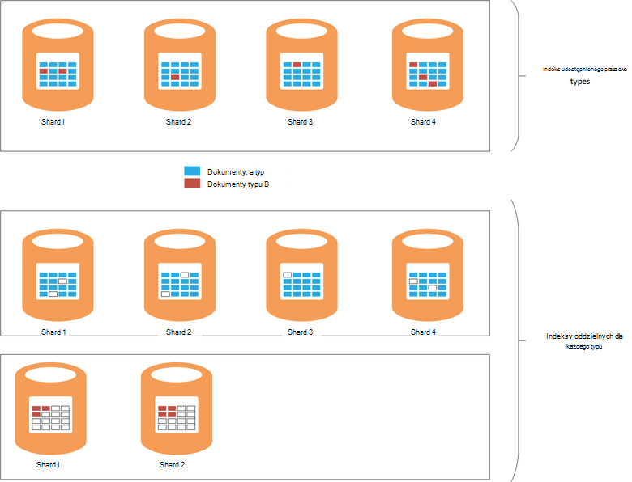

    ***Efekty udostępniania indeksu między typami*** 

    W górnej części diagramu ten sam indeks udostępnianą dokumenty typu A i B. typ Istnieje wiele dokumentów wpisz niż typ B. wyszukuje typ będzie obejmować kwerendy wszystkie cztery odłamki. Dolnej części diagramu pokazuje efekt, jeśli osobnych indeksy są tworzone dla każdego typu. W tym przypadku wyszukuje typu będą wymagane tylko, uzyskiwanie dostępu do dwóch odłamki.

- Małe odłamki może być bardziej rozłożony niż duże odłamki, ułatwiając Elasticsearch rozdzielić obciążenie w węzłach.

- Różne typy może być przechowywania różnych okresów. Może być trudne archiwizowanie stare dane, które udostępnia odłamki aktywne dane.


W niektórych okolicznościach udostępniania indeksu różnych typów może być jednak wydajność jeśli:

- Wyszukiwanie obejmować regularnie typy przechowywanych w ten sam indeks.

- Typy mieć tylko niewielka liczba dokumentów każdego. Zachowywanie oddzielny zestaw odłamki dla każdego typu może stać się istotne ogólnych w tym przypadku.


### <a name="optimizing-index-types"></a>Optymalizacja typy indeksu

Indeks Elasticsearch zawiera kopię oryginalnego dokumenty JSON, które zostały użyte do zapełnienia go. Te informacje są przechowywane w [* \_źródła*](https://www.elastic.co/guide/en/elasticsearch/reference/current/mapping-source-field.html#mapping-source-field) pola poszczególnych indeksowane. Te dane nie jest można wyszukiwać, ale domyślnie został zwrócony przez żądania *get* i *wyszukiwania* . Jednak w tym polu wiąże się obciążenie i zajmuje miejscem do magazynowania, powiększanie odłamki i zwiększanie głośności we/wy wykonywane. Możesz wyłączyć * \_źródła* pola na podstawie typu na:

```http
PUT my_index
{
  "mappings": {
    "my_type": {
      "_source": {
        "enabled": false
      }
    }
  }
}
```
Wyłączenie tego pola spowoduje również usunięcie możliwość wykonywania następujących czynności:

- Aktualizowanie danych w indeksie przy użyciu, *Zaktualizuj* interfejs API.

- Wykonywanie wyszukiwania, które zwracają wyróżnione dane.

- Indeksowanie z jednego indeksu Elasticsearch bezpośrednio do innego.

- Zmienianie mapowania ustawienia analizy.

- Debugowanie kwerend, wyświetlając oryginalny dokument.


### <a name="reindexing-data"></a>Indeksowanie danych

Liczba odłamki dostępne dla indeksu określa możliwości indeksu. Możesz wykonać przypuszczenia początkowej (i informacje) na ilu odłamki będą wymagane, ale zawsze warto ponownego indeksowania strategii na początku dokumentu. W większości przypadków indeksowanie może być zamierzonego zadania w miarę danych. Nie można przydzielić dużej liczby odłamki indeksu początkowo dla Optymalizacja wyszukiwania, ale przydzielić nowego odłamki jako powiększa ilości danych. W innych przypadkach indeksowanie może być konieczne do wykonania na zasadzie ad hoc więcej oszacowania o wzrostu głośność danych po prostu okazać się nieprawidłowe.

> [AZURE.NOTE] Indeksowanie nie może być konieczne wieku szybko danych. W tym przypadku aplikacja może utworzyć nowy indeks dla każdego okresu czasu. Przykłady obejmują dzienniki wydajności lub kontrola danych, który może być przechowywany nowy indeks każdego dnia.

<!-- -->

Indeksowanie skuteczne obejmuje tworzenia nowego indeksu danych w starej, a następnie usuwając stary indeks. Jeśli indeks jest duży, ten proces może potrwać i może być konieczne upewnić się, że dane pozostaną wyszukiwania, w tym okresie. Z tego powodu należy utworzyć [alias dla każdego indeksu](https://www.elastic.co/guide/en/elasticsearch/reference/current/indices-aliases.html), a kwerend należy pobrać danych za pomocą tych aliasów. Podczas indeksowanie, Zachowaj alias wskazującego stary indeks, a następnie przełącz się odwołać nowego indeksu po zakończeniu indeksowanie. Ta metoda jest również przydatne w przypadku uzyskiwania dostępu do danych opartych na czasie, który tworzy nowy indeks każdego dnia. Aby uzyskać dostęp do bieżącego danych za pomocą aliasu przesuwany nad do nowego indeksu, jak została utworzona.

### <a name="managing-mappings"></a>Zarządzanie mapowaniami

Elasticsearch używa mapowania, aby dowiedzieć się, jak interpretować dane, które występuje w każdym polu w dokumencie. Każdy typ ma własny mapowania skuteczne definiuje schemat dla tego typu. Aby wygenerować odwrócona indeksy dla każdego pola w dokumentach w typie Elasticsearch korzysta z tych informacji. W dowolnym dokumencie każde pole ma typ danych (na przykład *ciąg*, *datę*lub *długi*) i wartości. Po utworzeniu indeksu lub może być wywnioskowana przez Elasticsearch, po dodaniu nowych dokumentów do typu można określić mapowania indeksu. Jednak rozważ następujące wskazówki:

- Mapowania generowane dynamicznie może spowodować błędy w zależności od tego, jak pola są interpretowane, gdy dokumenty są dodawane do indeksu. Na przykład dokument 1 może zawierać pola A zawierające liczby, a przyczyny Elasticsearch, aby dodać mapowania, która określa, że to pole jest *długi*. Jeśli następny dokument zostanie dodany, A pole zawiera dane nieliczbowe, a następnie zakończy się niepowodzeniem. W tym przypadku pole A należy prawdopodobnie jest interpretowany jako ciąg podczas dodawania pierwszego dokumentu. Określanie mapowanie po utworzeniu indeksu może pomóc w zapobieganiu tych problemów.

- Projektowanie dokumentów, aby uniknąć generowania mapowania zbyt duży, to dodawanie znaczną obciążenie podczas wykonywania wyszukiwania, wykorzystywać duże ilości pamięci i powodować kwerendy do nie udało się znaleźć danych. Przyjąć spójne konwencje nazewnictwa dla pól w dokumentach, które mają tego samego typu. Na przykład nie używaj nazw pól, takich jak "imię", "Imię" i "nazwisko" w różnych dokumentów. Wykonaj tę samą nazwę pola w każdym dokumencie. Ponadto nie należy używać wartości jako klucze (to jest wybieranym podejściem w bazach danych dla kolumny rodziny, ale może spowodować nieefektywność i błędów z Elasticsearch.) Aby uzyskać więcej informacji zobacz [Mapowanie rozbicie](https://www.elastic.co/blog/found-crash-elasticsearch#mapping-explosion).

- Aby uniknąć tokenization odpowiednim za pomocą *not_analyzed* . Na przykład jeśli dokument zawiera pole ciąg o nazwie *danych* , która zawiera wartość "ABC wysokiej rozdzielczości" może spróbujesz wyszukiwania dla wszystkich dokumentów, które są zgodne z tę wartość w następujący sposób:

  ```http
  GET /myindex/mydata/_search
  {
    "query" : {
      "filtered" : {
        "filter" : {
          "term" : {
            "data" : "ABC-DEF"
          }
        }
      }
    }
  }
  ```

 Jednak to wyszukiwanie zakończy się niepowodzeniem zwrócić oczekiwanych wyników ze względu na sposób, w którym ciąg ABC wysokiej rozdzielczości jest plikach gdy jest indeksowany. Go będzie skuteczne podzielony na dwa tokeny ABC oraz rozdzielczości, łącznik. Ta funkcja jest przeznaczona do obsługi wyszukiwania pełny tekst, ale chcesz ciąg są interpretowane jako pojedynczego elementu Atomowej należy wyłączyć tokenization gdy dokument jest dodawany do indeksu. Za pomocą mapowania, takich jak:

  ```http
  PUT /myindex
  {
    "mappings" : {
      "mydata" : {
        "properties" : {
          "data" : {
            "type" : "string",
            "index" : "not_analyzed"
          }
        }
      }
    }
  }
  ```

  Aby uzyskać więcej informacji zobacz [Znajdowanie dokładne wartości](https://www.elastic.co/guide/en/elasticsearch/guide/current/_finding_exact_values.html#_term_filter_with_text).


### <a name="using-doc-values"></a>Za pomocą wartości dokumentu

Wiele zapytań i agregacje wymagają, czy dane są sortowane w ramach operacji wyszukiwania. Sortowanie wymaga możliwość mapowanie jeden lub więcej warunków na liście dokumentów. Aby ułatwić ten proces, Elasticsearch można załadować wszystkie wartości dla pola używane jako klucz do pamięci. Te informacje nosi nazwę *fielddata*. Zamiarem jest, że buforowanie fielddata w pamięci wiąże się mniej We/Wy i może być większa niż wielokrotnie czytania te same dane z dysku. Jednak w pole ma wysoka kardynalności następnie przechowywanie fielddata w pamięci mogą zajmować dużo miejsca stosu, prawdopodobnie wpływające na ochronę możliwość wykonywania innych operacji równoczesne lub nawet wykorzystaniu miejsca do magazynowania powoduje Elasticsearch kończy się niepowodzeniem.

Jako podejściem alternatywnym Elasticsearch obsługuje *wartości dokumentu*. Wartość dokumentu jest podobna do elementu fielddata w pamięci, z wyjątkiem, że jest zapisany na dysku i utworzenia dane są przechowywane w indeksie (fielddata jest tworzona dynamicznie podczas kwerendy.) Wartości dokumentu nie zajmują miejsca stosu, a więc są używane do kwerendy, że sortowanie lub agregowanie danych przez pola który może zawierać bardzo dużej liczby unikatowych wartości. Ponadto ograniczona ciśnienia na stosu ułatwiają przesunięcie wydajności różnice między pobieranie danych z dysku i z pamięci. Prawdopodobieństwo wystąpienia rzadziej jest śmieci, a rzadziej dokonywane są inne równoczesne wykonywanie operacji, które korzystają z pamięci.

Włączanie lub wyłączanie wartości dokumentu na podstawie poszczególnych właściwości w indeksie przy użyciu atrybutu *doc_values* , jak pokazano w poniższym przykładzie:

```http
PUT /myindex
{
  "mappings" : {
    "mydata" : {
      "properties" : {
        "data" : {
          ...
          "doc_values": true
        }
      }
    }
  }
}
```
> [AZURE.NOTE] Wartości dokumentu są domyślnie z Elasticsearch wersji 2.0.0 lub nowszym.

Porównaj wpływ przy użyciu wartości dokumentu jest mogą być bardzo specyficzne dla scenariusze własnych danych i kwerendy, dlatego Przygotuj się na przeprowadzanie testów wydajności ustalenie ich użyteczności. Należy również zauważyć, tego dokumentu, które nie działają wartości z pola analizowanych ciągów. Aby uzyskać więcej informacji zobacz [Wartości dokumentu](https://www.elastic.co/guide/en/elasticsearch/guide/current/doc-values.html#doc-values).

### <a name="using-replicas-to-reduce-query-contention"></a>Użycie repliki w celu zmniejszenia konfliktu kwerendy

Wspólną strategię, aby zwiększyć wydajność kwerend jest utworzenie wielu repliki każdy indeks. Operacje pobierania danych mogą być spełnione przez pobieranie danych z replice. Jednak tej strategii poważnie można wpływ na wydajność operacje spożyciu danych, więc musi być używane z rozwagą w scenariusze obejmujące mieszanych obciążenia. Ponadto tej strategii jest świadczenia tylko w przypadku repliki są rozmieszczane węzły i nie powodują konfliktu dla zasobów z podstawowego odłamki, które są częścią ten sam indeks. Pamiętaj, że jest to możliwe zwiększyć lub zmniejszyć liczbę repliki indeksu dynamiczne.

### <a name="using-the-shard-request-cache"></a>Przy użyciu pamięci podręcznej żądanie shard

Elasticsearch może buforować dane lokalne zlecone przez kwerendy dla każdego shard w pamięci. Ten wyszukiwania umożliwia pobierające tych samych danych, aby uruchomić szybciej danych mogą być odczytywane z magazynu w pamięci, a nie na dysku. Buforowanie danych w ten sposób w związku z tym można zwiększyć wydajność niektórych operacji wyszukiwania kosztem zmniejszania pamięci dostępnej dla innych zadań wykonywanych jednocześnie. Istnieje także ryzyka czy danych obsługiwanych z pamięci podręcznej jest nieaktualna. Dane w pamięci podręcznej jest tylko unieważniane po odświeżeniu shard i dane zostały zmienione. Częstotliwość odświeżania podlega wartość ustawienia *interwał_odświeżania* indeksu.

Żądanie pamięci podręcznej indeksu jest domyślnie wyłączona, ale można je włączyć w następujący sposób:

```http
PUT /myindex/_settings
{
  "index.requests.cache.enable": true
}
```

Pamięć podręczna żądania shard jest najbardziej odpowiednich informacji, która pozostaje stosunkowo statyczna, takich jak danych historycznych lub rejestrowanie.

### <a name="using-client-nodes"></a>Za pomocą węzły klienta

Wszystkie kwerendy są przetwarzane węzeł, który najpierw odbiera żądanie. Ten węzeł wysyła dodatkowo żądania do wszystkich innych węzłów zawierające odłamki dla wskaźników poszukiwanych, a następnie sumuje wyniki zwracanie odpowiedzi. Jeśli kwerenda obejmuje agregowanie danych lub wykonywanie złożonych obliczeń, węzeł początkowy jest odpowiedzialny za wykonywanie właściwego przetwarzania. Jeśli system ma obsługiwać stosunkowo niewielką liczbą złożonych kwerend, rozważ utworzenie puli klienta węzłów w celu zmniejszenia obciążenia z węzłów danych. Analogicznie jeśli w systemie jest obsługę dużej liczby prostych kwerend, przesyłać te żądania bezpośrednio do węzłów danych i umożliwia równomierne rozłożenie żądania usługi równoważenia obciążenia.

### <a name="tuning-queries"></a>Dostosowywanie kwerendy

Następujące punkty podsumowanie porady dotyczące maksymalizowanie wydajności kwerend Elasticsearch:

- Unikaj kwerend, które wymagają symbole wieloznaczne, gdy jest to możliwe.

- Jeżeli to samo pole jest objęte pełnotekstowym wyszukiwania i dokładne dopasowanie, należy rozważyć, przechowywania danych dla pola w formularzach analizowanych i nonanalyzed. Wykonywanie wyszukiwania pełnotekstowym analizowanych pola i dokładnych dopasowań nonanalyzed pola.

- Tylko zwrócenie danych przez to konieczne. Jeśli masz duże dokumenty, ale aplikacja wymaga tylko informacji przechowywanych w podzbiór pola, zwracany jest to podzbiór z kwerendy, a nie całe dokumenty. Ta strategia można zmniejszyć wymagania dotyczące przepustowości sieci z klastrem.

- Jeśli to możliwe, należy użyć filtrów zamiast kwerendy podczas wyszukiwania danych. Filtr po prostu Określa, czy dany dokument odpowiada określonych kryteriów, dlatego kwerendy również oblicza odległość dopasowanie dokumentu jest (wyników). Wewnętrznie generowane przez filtr wartości są przechowywane jako mapę bitową wskazującą dopasowanie/nie dopasowania dla każdego dokumentu i mogą być buforowane przez Elasticsearch. Jeśli to samo kryterium filtrowania występuje później, mapy bitowej można pobrać z pamięci podręcznej i umożliwia szybkie pobieranie pasujących dokumentów. Aby uzyskać więcej informacji zobacz [Filtrowanie wewnętrzny](https://www.elastic.co/guide/en/elasticsearch/guide/current/_finding_exact_values.html#_internal_filter_operation).

- Korzystanie z filtrów *wartość logiczna* do wykonywania statyczne porównania, a tylko przy użyciu *oraz*, *lub*i *nie* filtry dla dynamicznie obliczeniowe filtry, takie jak kontakty, które wymagają skryptów lub *geo -\* * filtry.

- Jeśli kwerenda łączy filtrów *wartość logiczna* *i*, *lub*, czy *nie* z *geo -* * filtry, umieść *i*/*lub*/*geo-** filtry ostatni tak, aby działają na najmniejszą możliwą zestawu danych.

    Podobnie do uruchomienia operacji drogich filtru za pomocą *post_filter* . Te filtry zostaną wykonane ostatnie.

- Użyj zamiast aspekty agregacji. Unikaj obliczania agregacji, które są analizowane lub mających wielu możliwych wartości.

    > **Uwaga**: aspekty zostały usunięte z Elasticsearch wersję 2.0.0.

- Użyj agregacji *kardynalności* zamiast agregacji *value_count* , chyba że aplikacja wymaga dokładnego Liczba pasujących elementów. Dokładne liczba może stać się szybko nieaktualne i wiele aplikacji wymaga tylko rozsądne przybliżenie.

- Unikaj skryptów. Skryptów w kwerendach i filtrach może być drogich i wyniki nie są buforowane. Długotrwałe skryptów mogą używać wyszukiwania o tej wątków, powoduje kolejne żądania można umieścić w kolejce. Jeśli kolejki wypełnienia w górę, dalej żądania będą odrzucane.

## <a name="testing-and-analyzing-aggregation-and-search-performance"></a>Testowanie i analizowania wydajności agregacji i wyszukiwanie

W tej sekcji opisano wyniki serii testów, które były wykonywane przed zróżnicowanymi klaster i konfiguracji indeksu. Dwa typy badań były wykonywane w następujący sposób:

- *Kwerendy i *spożyciu ** test **. Ten test pracę z pustym indeks, który został wypełniony jako test poprzedzone operacji Wstawianie zbiorcze (każdorazowym dodany do dokumentów 1000). W tym samym czasie liczba kwerend przeznaczona do wyszukiwania dokumentów dodane okresie 15 minut i wygeneruj agregacji były powtarzane w 5 sekund. Ten test zwykle została mogą być uruchamiane przez 24 godziny, w celu odtworzenia efektów trudne obciążenie pracą obejmujące spożyciu dużych danych z u zapytania w czasie rzeczywistym.

- ** *Tylko do kwerendy* testowanie**. Ten test jest podobny do *spożyciu i kwerendy* testowanie z wyjątkiem, że część spożyciu zostanie pominięty, a indeksu w każdym węźle jest wstępnie 100 milionów dokumentów. Zmieniony zestawu kwerend jest wykonywane; element czasu ograniczenia dokumentów osobom dodane w ciągu ostatnich 15 minut został usunięty, jak dane teraz statyczne. Testy uruchomiono 90 minut, jest mniej czasu, aby ustalić wzorzec wydajności z powodu stałej ilości danych.

---

Każdy dokument w indeksie sprzedał tego samego schematu. W poniższej tabeli podsumowano pola w schemacie:

Nazwa                          | Typ         | Notatki |
  ----------------------------- | ------------ | -------------------------------------------------------- |
  Organizacja                  | Ciąg      | Test generuje 200 unikatowe organizacji. |
  CustomField1 - CustomField5   |Ciąg       |Są to pięć pól Parametry, które są ustawione na pusty ciąg.|
  DateTimeRecievedUtc           |Sygnatura czasowa    |Data i godzina, w którym dokument został dodany.|
  Hosta                          |Ciąg       |W tym polu jest równa pusty ciąg.|
  Element HttpMethod                    |Ciąg       |W tym polu jest ustawiona do jednej z następujących wartości: "OPUBLIKUJ", "Pobierz", "Umieszczenie".|
  HttpReferrer                  |Ciąg       |W tym polu jest równa pusty ciąg.|
  HttpRequest                   |Ciąg       |W tym polu zostanie wypełniona losowe tekstu między 10 a 200 znaków.|
  HttpUserAgent                 |Ciąg       |W tym polu jest równa pusty ciąg.|
  HttpVersion                   |Ciąg       |W tym polu jest równa pusty ciąg.|
  Nazwa_organizacji              |Ciąg       |W tym polu jest ustawiona na tę samą wartość co pole organizacji.|
  SourceIp                      |IP           |To pole zawiera adres IP wskazujące "pochodzenia" danych. |
   SourceIpAreaCode              |Długie         |W tym polu jest równa 0.|
  SourceIpAsnNr                 |Ciąg       |W tym polu jest równa "jako\#\#\#\#\#".|
  SourceIpBase10                |Długie         |W tym polu jest równa 500.|
  SourceIpCountryCode           |Ciąg       |To pole zawiera kod kraju 2 znaków. |
  SourceIpCity                  |Ciąg       |To pole zawiera ciąg identyfikujący miasta w kraju. |
  SourceIpLatitude              |Naciśnij dwukrotnie       |To pole zawiera wartość losowe.|
  SourceIpLongitude             |Naciśnij dwukrotnie       |To pole zawiera wartość losowe.|
  SourceIpMetroCode             |Długie         |W tym polu jest równa 0.|
  SourceIpPostalCode            |Ciąg       |W tym polu jest równa pusty ciąg.|
  SourceLatLong                 |Punkt Geo   |W tym polu jest ustawiona do punktu geo losowe.|
  Port_źródłowy                    |Ciąg       |W tym polu zostanie wypełniona Reprezentacja tekstowa liczbę losową z zakresu.|
  TargetIp                      |IP           |To jest wpisywany adres IP losową z zakresu od 0.0.100.100 do 255.9.100.100.|
  SourcedFrom                   |Ciąg       |W tym polu jest ustawiona ciąg "MonitoringCollector".|
  TargetPort                    |Ciąg       |W tym polu zostanie wypełniona Reprezentacja tekstowa liczbę losową z zakresu.|
  Ocena                        |Ciąg       |W tym polu zostanie wypełniona 20 wartości innym ciągiem wybranych losowo.|
  UseHumanReadableDateTimes     |Wartość logiczna      |W tym polu jest równa FAŁSZ.|
 
Następujące kwerendy przeprowadzono jako partię iteracji testów. Nazwy kursywą są używane do odwołują się do tych kwerend w dalszej części tego dokumentu. Należy zauważyć, że został pominięty kryterium czasu (dokumenty dodane w ciągu ostatnich 15 minut) *tylko do kwerendy* testów:

- Ile dokumentów przy użyciu wartości *klasyfikacji* zostały wprowadzone w ciągu ostatnich 15 minut (*Liczba według ocen*)? 

- Liczba dokumentów zostały dodane w każdym 5 minut podczas ostatniego 15 minut (*Liczba upływu czasu*)?

- Liczba dokumentów każdej wartości *klasyfikacji* zostały dodane dla każdego kraju w ciągu ostatnich 15 minut (*trafień według krajów*)?

- 15 organizacji, w których występuje większość często w dokumenty dodane w ciągu ostatnich 15 minut (*organizacje góry 15*)?

- Ile innych organizacji występuje w dokumentach dodane w ostatnim 15 minut (*Liczba unikatowych organizacje*)?

- Liczba dokumentów zostały dodane w ciągu ostatnich 15 minut (*Liczba całkowita liczba odwołań*)?

- Jak wielu różnych wartości *SourceIp* występuje w dokumentach dodane w ostatnim 15 minut (*Liczba unikatowych adresów IP*)?


Definicja indeksu i szczegóły kwerend zostały opisane w [dodatku](#appendix-the-query-and-aggregation-performance-test).

Testy są przeznaczone do zrozumienie skutków następujących czynników:

- **Typ dysku**. Testy zostały wykonane w klastrze węzeł 6 D4 maszyny wirtualne za pomocą standardowego magazynu (dysków twardych) i powtarzane w klastrze węzeł 6 DS4 maszyny wirtualne przy użyciu magazynu premium (twarde SSD).

- **Rozmiar komputera — skalowanie w górę**. Testy zostały wykonane w klastrze 6 węzeł zawierający DS3 maszyny wirtualne (wskazany jako *małe* klaster), powtarzany w klastrze DS4 maszyny wirtualne (klaster *Średni* ), a następnie ponownie powtarzane w klastrze maszyn DS14 (klaster *duże* ). W poniższej tabeli przedstawiono główne cechy każdego SKU maszyn wirtualnych:

 Klaster | JEDNOSTKA SKU MASZYN WIRTUALNYCH        | Liczby rdzeni | Liczba dysków danych | PAMIĘCI RAM (GB) |
---------|---------------|-----------------|----------------------|----------|
 Małe   | Standardowe DS3  | 4               | 8                    | 14       |
 Średnia  | Standardowe DS4  | 8               | 16                   | 28       |
 Duży   | Standardowe DS14 | 16              | 32                   | 112      |

- **Rozmiar klaster - Skalowanie zewnętrzne**. Testy przeprowadzono na klastrów maszyny wirtualne DS14 zawierający 1, 3 i 6 węzły.

- **Liczba operacji wstawiania indeksu danych**. Testy przeprowadzono przy użyciu indeksy skonfigurowane z replikami 1 i 2.

- **Wartości dokumentu**. Początkowo testy przeprowadzono z indeksem ustawienie *doc_values* ustawiona na *PRAWDA* (wartość domyślna). Testy zaznaczonych zostały powtarzane z *doc_values* ustaw wartość *FAŁSZ*.

- **Pamięci podręcznej**. Testy przeprowadzono z pamięci podręcznej żądania shard, które zostały włączone w indeksie.

- **Liczba odłamki**. Testy były powtarzane przy użyciu różną liczbę odłamki, aby ustalić, czy kwerendy skuteczniejsze uruchomiono przez indeksy zawierające odłamki mniej, większy lub mniejszy, więcej odłamki.


## <a name="performance-results---disk-type"></a>Wyniki — typ dysku

Oszacowano wydajności dysku, uruchamiając test *spożyciu i kwerend* w klastrze węzeł 6 D4 maszyny wirtualne (za pomocą dysków twardych), a w klastrze węzeł 6 DS4 maszyny wirtualne (za pomocą twarde SSD). Konfiguracja Elasticsearch w obu klastrów był taki sam. Dane został rozmieszczony 16 dysków w każdym węźle i każdy węzeł zawiera 14GB pamięci RAM przydzielone do środowiska Java (maszyny wirtualnej Java) działa Elasticsearch, pozostał pozostała pamięci (również 14GB) do użycia system operacyjny. Uruchomiono każdego testu 24 godzin. Tego okresu zostało zaznaczone, aby umożliwić skutków wzrost ilości danych stają się widoczne i umożliwić system w celu ustabilizowania. W poniższej tabeli podsumowano wyników, wyróżnianie czasy odpowiedzi różnych operacji, które składają się test.

 Klaster | Operacja/kwerendy            | Średni czas reakcji (ms) |
---------|----------------------------|----------------------------|
 D4      | Spożyciu                  | 978                        |
         | Liczba według ocen            | 103                        |
         | Liczba przez godzinę            | 134                        |
         | Trafień według krajów            | 199                        |
         | Organizacje góry 15       | 137                        |
         | Liczba unikatowych organizacji | 139                        |
         | Liczba unikatowych adresów IP            | 510                        |
         | Liczba całkowita liczba odwołań           | 89                         |
 DS4     | Spożyciu                  | 511                        |
         | Liczba według ocen            | 187                        |
         | Liczba przez godzinę            | 411                        |
         | Trafień według krajów            | 402                        |
         | Organizacje góry 15       | 307                        |
         | Liczba unikatowych organizacji | 320                        |
         | Liczba unikatowych adresów IP            | 841                        |
         | Liczba całkowita liczba odwołań           | 236                        |

Na pierwszy rzut oka wydaje się, że klaster DS4 wykonać kwerendy mniej również niż klaster D4, czasami Podwajanie (lub zmniejszenie) czas reakcji. To nie został poinformowany, wszystko na temat jednak. Następnej tabeli zawiera numer spożyciu operacji wykonywanych przez każdy klaster (należy pamiętać, że każda operacja ładowania dokumentów 1000):

 Klaster | Liczba operacji spożyciu |
---------|---------------------------|
 D4      | 264769                    |
 DS4     | 503157                    |

Klaster DS4 był w stanie załadować prawie dwa razy więcej danych niż klaster D4 podczas próby. Dlatego przy analizie czasy odpowiedzi dla każdej operacji, również należy wziąć pod uwagę liczbę dokumentów każda kwerenda zawiera przeglądania i ile dokumenty są zwracane. Dynamiczne dane są to jak stale rośnie wielkość dokumenty w indeksie. Nie można po prostu dzielenie 503137 przez 264769 (liczba spożyciu operacji wykonywanych przez każdy klaster), a następnie pomnożyć wynik przez średni czas reakcji dla każdej kwerendy wykonywane przez klaster D4, aby nadać porównawczych, jak to ignoruje wielkość we/wy wykonywane jednocześnie przez operację spożyciu. Należy zmierzyć fizycznie ilości danych zapisywane i odczytać z dysku w trakcie wykonywania test. Plan badań JMeter rejestruje informacje dla każdego węzła. Są podsumowanych wyników:

 Klaster | Średnią liczbę bajtów napisane/przeczytane przy każdorazowym |
---------|----------------------------------------------|
 D4      | 13471557                                     |
 DS4     | 24643470                                     |

Te dane pokazano, że klaster DS4 mógł wyważonego Wy około 1.8 godziny dnia klaster D4. Przyjmując, że niezależnie od rodzaju dysków, wszystkie inne zasoby są takie same, różnica musi to być spowodowane za pomocą twarde SSD wolisz dysków twardych.

Ułatwiające Justowanie tego wniosku następujące wykresy przedstawić jak/Wy została wykonana w czasie przez każdy klaster:

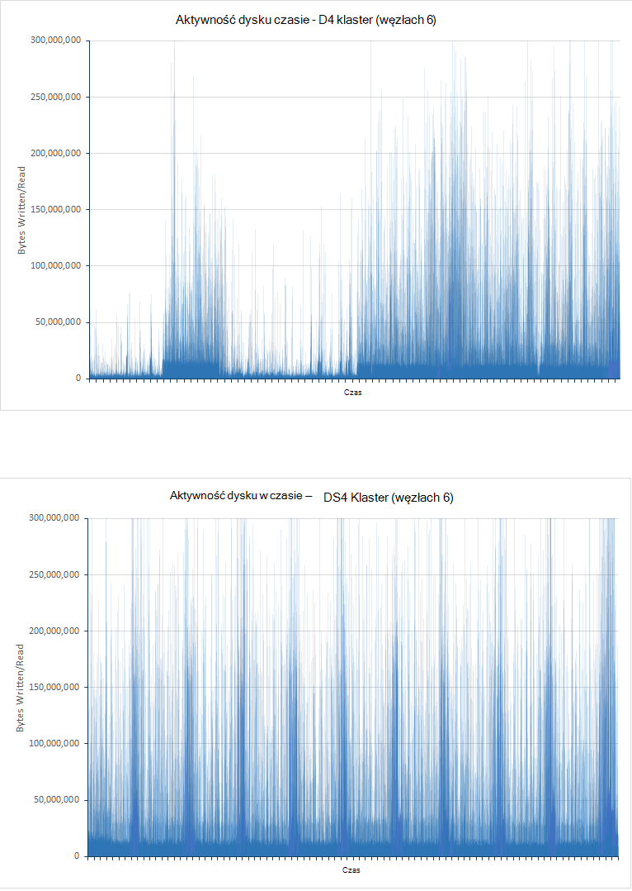

<!-- -->

***Aktywność dysku dla klastrów D4 i DS4***

Na wykresie dla klastrów D4 są wyświetlane znacznych zmian, szczególnie w pierwszej połowie test. To jest prawdopodobnie z powodu ograniczania w celu zmniejszenia Wy. Na wczesnym etapie badania kwerendy będą mogli szybko uruchomić się nieco analizę danych. Dysków w klastrze D4 prawdopodobnie dlatego działać zbliżony ich operacji wejścia i wyjścia na drugim pojemności (operacji i/o na SEKUNDĘ), chociaż każdej operacji We/Wy nie może zwracać dużej ilości danych. Klaster DS4 umożliwia wyższym operacji i/o na SEKUNDĘ i nie występują w niej ten sam stopień ograniczania, stawki We/Wy są bardziej zwykła. Aby obsługiwać ten teorii, następna para wykresów Pokaż, jak Procesora została zablokowana przez dyskowej w czasie (czas oczekiwania dysku przedstawiane na wykresach to część czasu Procesora poświęconego na oczekiwanie na We/Wy):

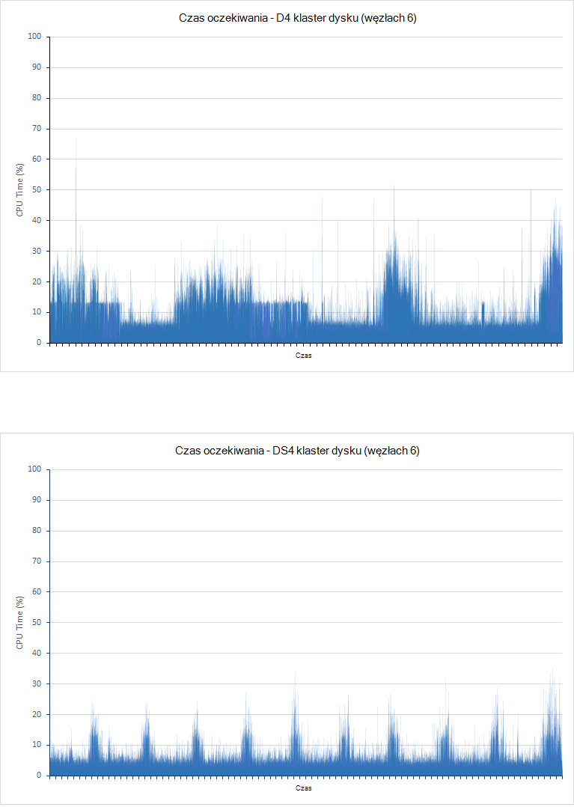

***Procesor dyskowej czekać godziny dla klastrów D4 i DS4***

Należy pamiętać, że istnieją dwa powody głównym dla operacji We/Wy do blokowania Procesora:

- / Wyjścia może być odczytu lub zapisu danych do lub z dysku.

- / Wyjścia może ograniczenie środowisko hosta. Azure dyski wykonywane za pomocą dysków twardych mają maksymalnej przepustowości 500 operacji i/o na SEKUNDĘ, a twarde SSD mieć maksymalnej przepustowości 5000 operacji i/o na SEKUNDĘ.


Klaster D4 ilość czasu poświęconego oczekiwanie na We/Wy w pierwszej połowie odpowiada test ściśle w sposób odwrócona z wykres przedstawiający stawki we/wy. Okresy niskim we/wy odpowiadają znaczną czas, jaki Procesor spędza zablokowanych, oznacza to, że we/wy zostaje ograniczona. Jak dodać więcej danych jest klaster zmiany sytuacji, a w drugiej połowie wartości test WE czas oczekiwania odpowiadają wartości w przepustowość danych. W tym momencie Procesora jest zablokowany wykonując rzeczywistą we/wy. Ponownie z klastrem DS4 czas oczekiwania na We/Wy jest o wiele bardziej nieparzystych. Każdy Szczyt odpowiada równoważne Szczyt wydajność wejścia/wyjścia zamiast rynience, oznacza to, że jest niewielki lub występujące ograniczania.

Istnieje jeden współczynnik brać pod uwagę. Podczas badania klaster D4 generowane 10584 błędów spożyciu i 21 błędy kwerend. Test w klastrze DS4 wyprodukowano żadne błędy.

## <a name="performance-results---scaling-up"></a>Wyniki - skalowanie w górę

Testowanie up skali wykonano, uruchamiając testy przed 6-klastrów DS3, DS4 i DS14 maszyny wirtualne. Te wersje SKU wybrano, ponieważ maszyny DS4 udostępnia dwa razy wiele rdzeni Procesora i pamięci jako DS3, a komputer DS14 zwiększa dwukrotnie zasobów Procesora ponownie zapewniając cztery razy ilość pamięci. W poniższej tabeli porównano aspektami każdego SKU:

 JEDNOSTKA SKU  | \#Rdzenie Procesora | Pamięć (GB) | Maksymalna liczba dysku operacji i/o na SEKUNDĘ | Maksymalna przepustowość (MB/s)|
------|-------------|-------------|---------------|--------------|
 DS3  | 4           | 14          | 12,800| 128 |
 DS4  | 8           | 28          | 25,600| 256 |
 DS14 | 16          | 112         | 50 000| 512 |

W poniższej tabeli podsumowano wyniki uruchomienia testów na małych (DS3), średni (DS4) i dużych klastrów (DS14). Każdy maszyn wirtualnych służy twarde SSD do przechowywania danych. Uruchomiono każdego testu 24 godzin.

Tabela raportów liczba żądań pomyślnie dla każdego typu kwerendy (błędy nie są uwzględniane). Liczba żądań próby dla każdego typu kwerendy jest mniej więcej taki sam cyklu badania. Jest tak, ponieważ plan badań JMeter wykonuje pojedynczego wystąpienia każda kwerenda (liczba według oceny, liczba przez godzinę, trafień według kraju, organizacje 15 górnej, unikatowe Statystyka organizacji, liczba unikatowych adresów IP i całkowita liczba trafień) razem w całość znana pod nazwą *Testowanie transakcji* (transakcja jest niezależnie od zadania, który wykonuje operacje spożyciu, który jest uruchamiany w oddzielnym wątku). Iteracji plan badań wykonuje test jednej transakcji. Liczba transakcji testowanie ukończony w związku z tym jest miarą czasu odpowiedzi najmniejszą kwerendy w każdej transakcji.

| Klaster      | Operacja/kwerendy            | Liczba żądań | Średni czas reakcji (ms) |
|--------------|----------------------------|--------------------|----------------------------|
| Mały (DS3)  | Spożyciu                  | 207284             | 3328                       |
|              | Liczba według ocen            | 18444              | 268                        |
|              | Liczba przez godzinę            | 18444              | 340                        |
|              | Trafień według krajów            | 18445              | 404                        |
|              | Organizacje góry 15       | 18439              | 323                        |
|              | Liczba unikatowych organizacji | 18437              | 338                        |
|              | Liczba unikatowych adresów IP            | 18442              | 468                        |
|              | Liczba całkowita liczba odwołań           | 18428              | 294   
|||||
| Średni (DS4) | Spożyciu                  | 503157             | 511                        |
|              | Liczba według ocen            | 6958               | 187                        |
|              | Liczba przez godzinę            | 6958               | 411                        |
|              | Trafień według krajów            | 6958               | 402                        |
|              | Organizacje góry 15       | 6958               | 307                        |
|              | Liczba unikatowych organizacji | 6956               | 320                        |
|              | Liczba unikatowych adresów IP            | 6955               | 841                        |
|              | Liczba całkowita liczba odwołań           | 6958               | 236                        |
|||||
| Duży (DS14) | Spożyciu                  | 502714             | 511                        |
|              | Liczba według ocen            | 7041               | 201                        |
|              | Liczba przez godzinę            | 7040               | 298                        |
|              | Trafień według krajów            | 7039               | 363                        |
|              | Organizacje góry 15       | 7038               | 244                        |
|              | Liczba unikatowych organizacji | 7037               | 283                        |
|              | Liczba unikatowych adresów IP            | 7037               | 681                        |
|              | Liczba całkowita liczba odwołań           | 7038               | 200                        |

Te dane liczbowe wykazać, że, ten test wydajności klaster DS4 i DS14 były rozsądnie podobne. Czas odpowiedzi w przypadku operacji kwerendy klaster DS3 również wyświetlony, aby porównać favorably początkowo i liczba kwerend operacji wykonywanych jest znacznie powyżej wartości dla klastrów DS4 i DS14. Jednak jedną Poświęć silnych powiadomienie o wskaźnik spożyciu i wynikające z niego liczbę dokumentów przeszukiwanej. W grupie DS3 spożyciu jest bardziej ograniczona, a na koniec test bazy danych zawiera tylko około 40% dokumentów przeczytać w przez wszystkich innych klastrów. Jest to może to być spowodowane przetwarzania zasobów, sieci i przepustowość dysku dostępna dla maszyny DS3 w porównaniu z DS4 lub DS14 maszyn wirtualnych. Zakładając, że maszyny DS4 ma dwa razy wielu zasobów dostępnych jako maszyny DS3 i DS14 ma dwa razy (cztery razy pamięć) zasobów maszyny DS4, pozostaje jedno pytanie: Dlaczego różnią się w kursach spożyciu klastrów DS4 i DS14 znacznie mniejszy niż ten, który odbywa się między klastrów DS3 i DS4? Może to być spowodowane wykorzystania sieci i limitów przepustowości maszyny wirtualne Azure. Na wykresach poniżej wyświetlane te dane dla wszystkich trzech klastrów:


**Wykorzystanie sieci dla klastrów DS3, DS4 i DS14, wykonywanie test spożyciu i kwerendy** 

<!-- -->

Limity dostępna przepustowość sieci z maszyny wirtualne Azure nie są publikowane i mogą się różnić, fakt, że aktywność sieciowa wydaje się mieć poziomej u średnio o około 2.75GBps dla obu DS4 a DS14 testów proponuje że takie ograniczenie osiągnięto i stał się współczynnik podstawowego w ograniczenia przepustowości. W przypadku klaster DS3 aktywność sieci było znacznie niższy, dlatego w większości przypadków z powodu ograniczeń dostępności inne zasoby mniejszą wydajność.

Do wyodrębnienia efekty operacji spożyciu i przedstawić, jak wydajności kwerend zmienia się węzły skalowania w górę, serię testów tylko do kwerendy została wykonana za pomocą samego węzły. W poniższej tabeli przedstawiono wyniki uzyskane na każdym klastrze:

> [AZURE.NOTE] Nie należy porównać wydajność i liczba żądań wykonywanych przez kwerendy w *tylko do kwerendy* test z tych, uruchamiając test *spożyciu i kwerendy* . To, ponieważ zostały zmodyfikowane kwerend i różni się wielkość dokumenty.

| Klaster      | Operacja/kwerendy            | Liczba żądań | Obliczanie średniej wartości odpowiedź Ttme (ms) |
|--------------|----------------------------|--------------------|----------------------------|
| Mały (DS3)  | Liczba według ocen            | 464                | 11758                      |
|              | Liczba przez godzinę            | 464                | 14699                      |
|              | Trafień według krajów            | 463                | 14075                      |
|              | Organizacje góry 15       | 464                | 11856                      |
|              | Liczba unikatowych organizacji | 462                | 12314                      |
|              | Liczba unikatowych adresów IP            | 461                | 19898                      |
|              | Liczba całkowita liczba odwołań           | 462                | 8882  
|||||
| Średni (DS4) | Liczba według ocen            | 1045               | 4489                       |
|              | Liczba przez godzinę            | 1045               | 7292                       |
|              | Trafień według krajów            | 1053               | 7564                       |
|              | Organizacje góry 15       | 1055               | 5066                       |
|              | Liczba unikatowych organizacji | 1051               | 5231                       |
|              | Liczba unikatowych adresów IP            | 1051               | 9228                       |
|              | Liczba całkowita liczba odwołań           | 1051               | 2180                       |
|||||
| Duży (DS14) | Liczba według ocen            | 1842               | 1927 r                       |
|              | Liczba przez godzinę            | 1839               | 4483                       |
|              | Trafień według krajów            | 1838               | 4761                       |
|              | Organizacje góry 15       | 1842               | 2117                       |
|              | Liczba unikatowych organizacji | 1837               | 2393                       |
|              | Liczba unikatowych adresów IP            | 1837               | 7159                       |
|              | Liczba całkowita liczba odwołań           | 1837               | 642                        |

Ten czas trendów w czasie średnią otrzymaną wielu różnych klastrów jest wyraźny. Wykorzystanie sieci jest również poniżej 2.75GBps wymaganych wcześniej przez klastrów DS4 i DS14 (które prawdopodobnie nasycenia sieci w spożyciu i kwerendy badań), a 1.5GBps dla klastrów DS3. W rzeczywistości jest bliżej 200MBps we wszystkich przypadkach pokazany poniżej wykresów:

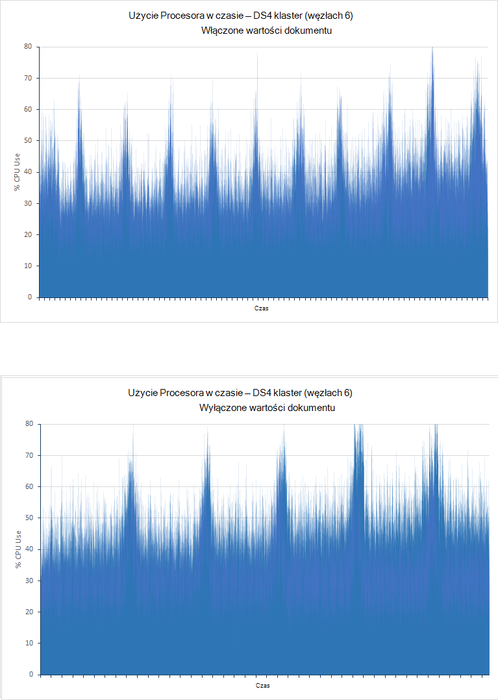

***Wykorzystania dla DS3, sieci klastrów DS4 i DS14 wykonujące test tylko do kwerendy*** 

Ograniczanie czynniki w klastrów DS3 i DS4 teraz jest wyświetlany procesora jest zbliżony 100% dla większość czasu. W DS14 użycie Procesora klaster uśrednia tuż ponad 80%. To jest nadal wysoki, ale wyraźnie wyróżnia zalety o Procesora rdzeni dostępne. Poniższa ilustracja przedstawia upodobania Procesora dla klastrów DS3, DS4 i DS14.

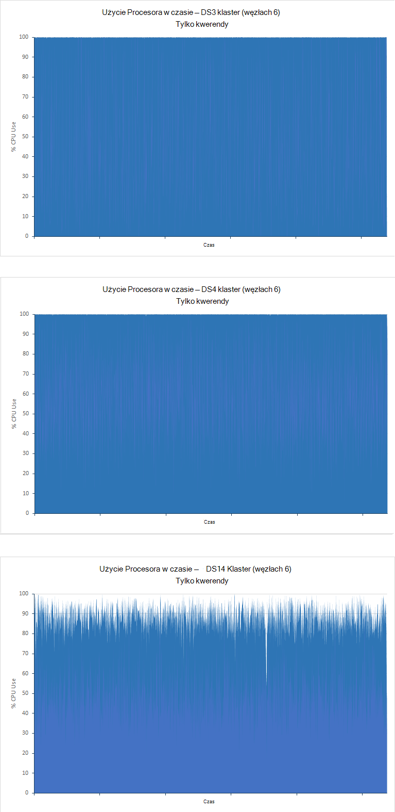

***Użycie Procesora dla klastrów DS3 i DS14 wykonujące test tylko do kwerendy*** 

## <a name="performance-results---scaling-out"></a>Wyniki - Skalowanie zewnętrzne

Aby przedstawić, jak system skale się z liczby węzłów, uruchomienia testów przy użyciu klastrów DS14 zawierający 1, 3 i 6 węzły. Tylko tym razem, *tylko do kwerendy* wykonano badanie, przy użyciu dokumentów 100 milionów i uruchamianie dla 90 minut:

| Klaster | Operacja/kwerendy            | Liczba żądań | Średni czas reakcji (ms) |
|---------|----------------------------|--------------------|----------------------------|
| Węzeł 1  | Liczba według ocen            | 288                | 6216                       |
|         | Liczba przez godzinę            | 288                | 28933                      |
|         | Trafień według krajów            | 288                | 29455                      |
|         | Organizacje góry 15       | 288                | 9058                       |
|         | Liczba unikatowych organizacji | 287                | 19916                      |
|         | Liczba unikatowych adresów IP            | 284                | 54203                      |
|         | Liczba całkowita liczba odwołań           | 287                | 3333                       |
|||||
| Węzły 3 | Liczba według ocen            | 1194               | 3427                       |
|         | Liczba przez godzinę            | 1194               | 5381                       |
|         | Trafień według krajów            | 1191               | 6840                       |
|         | Organizacje góry 15       | 1196               | 3819                       |
|         | Liczba unikatowych organizacji | 1190               | 2938                       |
|         | Liczba unikatowych adresów IP            | 1189               | 12516                      |
|         | Liczba całkowita liczba odwołań           | 1191               | 1272                       |
|||||
| Węzły 6 | Liczba według ocen            | 1842               | 1927 r                       |
|         | Liczba przez godzinę            | 1839               | 4483                       |
|         | Trafień według krajów            | 1838               | 4761                       |
|         | Organizacje góry 15       | 1842               | 2117                       |
|         | Liczba unikatowych organizacji | 1837               | 2393                       |
|         | Liczba unikatowych adresów IP            | 1837               | 7159                       |
|         | Liczba całkowita liczba odwołań           | 1837               | 642                        |

Liczby węzłów sprawia, że znaczące różnice w trakcie wykonywania kwerend klaster, chociaż w sposób nieliniowa. Klaster węzeł 3 wykonuje około 4 godziny jako wielu kwerend jako klaster jednego węzła podczas klaster 6 węzeł obsługuje 6 godzin więcej. Aby wyjaśnić ten nonlinearity, następujące wykresy Pokaż, jak Procesora została są używane przez trzy klastrów:

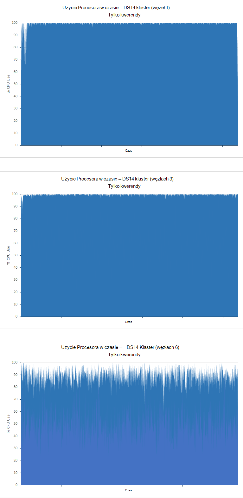

***Użycie Procesora dla pozycji 1, 3 i 6-klastrów wykonywania test tylko do kwerendy***

Klastrów pojedynczy węzeł i 3-węzeł są Procesora powiązanych, a mimo że procesora jest wysoki w klastrze węzeł 6 jest możliwości zamiennych przetwarzania. W tym przypadku inne czynniki mogą być ograniczenia przepustowości. Może to potwierdzone, testując węzłów 9 i 12, czy prawdopodobnie pokazujące dodatkowo możliwości zamiennych przetwarzania.

Również dane w powyższej tabeli pokazano, jak czas odpowiedzi średnia zapytania w zależności od. To jest element, który jest najbardziej znaczącą podczas testowania, jak system skale dla określonych typów kwerend. Niektóre wyniki wyszukiwania są wyraźnie znacznie zwiększyć jego wydajność, gdy obejmujące więcej węzłów niż inne. Może to być spowodowane stosunek liczby węzłów liczba dokumentów w zwiększenie klaster, każdy klaster zawarte 100 milionów dokumentów. Podczas wykonywania wyszukiwania, które wymagają agregowanie danych, Elasticsearch przetwarzania i buforu danych pobranych w ramach procesu agregacji w pamięci w każdym węźle. W przypadku więcej węzłów jest mniej danych do pobrania, bufor, diagramów procesów w każdym węźle.

## <a name="performance-results---number-of-replicas"></a>Wyniki — liczba operacji wstawiania danych

Przed indeksu z jednej replice uruchomienia testów *spożyciu i kwerendy* . Testy były powtarzane na 6-DS4 i DS14 klastrów przy użyciu indeksu skonfigurowano dwie repliki. Wszystkie testy uruchomiono 24 godzin. W poniższej tabeli pokazano wyniki porównawcze replik jednym i dwoma:

| Klaster | Operacja/kwerendy            | Średni czas reakcji (ms) - 1 replice | Średni czas reakcji (ms) - 2 repliki | % różnicy czas reakcji |
|---------|----------------------------|----------------------------------------|-----------------------------------------|-------------------------------|
| DS4     | Spożyciu                  | 511                                    | 655                                     | + 28%                          |
|         | Liczba według ocen            | 187                                    | 168                                     | -10%                          |
|         | Liczba przez godzinę            | 411                                    | 309                                     | -25%                          |
|         | Trafień według krajów            | 402                                    | 562                                     | + 40%                          |
|         | Organizacje góry 15       | 307                                    | 366                                     | + 19%                          |
|         | Liczba unikatowych organizacji | 320                                    | 378                                     | + 18%                          |
|         | Liczba unikatowych adresów IP            | 841                                    | 987                                     | + 17%                          |
|         | Liczba całkowita liczba odwołań           | 236                                    | 236                                     | + 0%                           |
||||||
| DS14    | Spożyciu                  | 511                                    | 618                                     | + 21%                          |
|         | Liczba według ocen            | 201                                    | 275                                     | + 37%                          |
|         | Liczba przez godzinę            | 298                                    | 466                                     | + 56%                          |
|         | Trafień według krajów            | 363                                    | 529                                     | + 46%                          |
|         | Organizacje góry 15       | 244                                    | 407                                     | + 67%                          |
|         | Liczba unikatowych organizacji | 283                                    | 403                                     | + 42%                          |
|         | Liczba unikatowych adresów IP            | 681                                    | 823                                     | + 21%                          |
|         | Liczba całkowita liczba odwołań           | 200                                    | 221                                     | + 11%                          |

Stopa spożyciu zmniejszyła się jako liczba replik zwiększone. To można się spodziewać podczas Elasticsearch zapisuje większej liczby kopii każdego dokumentu generowania We/Wy dysku.  Jest to uwzględnione w przypadku klaster DS14 dla indeksów z replikami 1 i 2 pokazano na poniższej ilustracji. W przypadku indeks z replice 1 średnia Wy było 16896573 bajtów na sekundę. Indeks z replikami 2 średnia Wy była 33986843 bajtów na sekundę, tuż ponad dwa razy więcej.

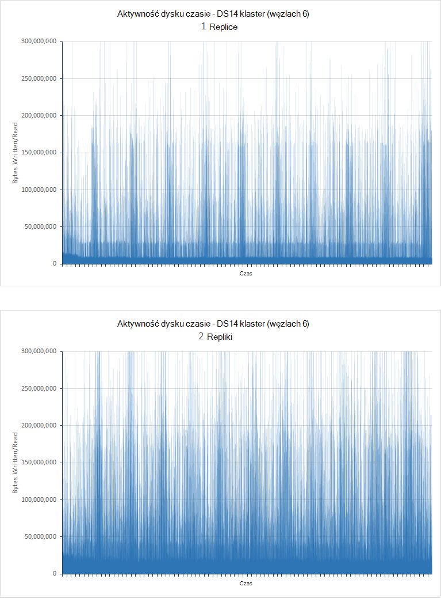

***Kursy dyskowej węzły z replikami 1 i 2, wykonywanie test spożyciu i kwerendy***

| Klaster | Kwerendy                      | Średni czas reakcji (ms) - 1 replice | Średni czas reakcji (ms) - 2 repliki |
|---------|----------------------------|----------------------------------------|-----------------------------------------|
| DS4     | Liczba według ocen            | 4489                                   | 4079                                    |
|         | Liczba przez godzinę            | 7292                                   | 6697                                    |
|         | Trafień według krajów            | 7564                                   | 7173                                    |
|         | Organizacje góry 15       | 5066                                   | 4650                                    |
|         | Liczba unikatowych organizacji | 5231                                   | 4691                                    |
|         | Liczba unikatowych adresów IP            | 9228                                   | 8752                                    |
|         | Liczba całkowita liczba odwołań           | 2180                                   | 1909                                    |
|||||
| DS14    | Liczba według ocen            | 1927 r                                   | 2330                                    |
|         | Liczba przez godzinę            | 4483                                   | 4381                                    |
|         | Trafień według krajów            | 4761                                   | 5341                                    |
|         | Organizacje góry 15       | 2117                                   | 2560                                    |
|         | Liczba unikatowych organizacji | 2393                                   | 2546                                    |
|         | Liczba unikatowych adresów IP            | 7159                                   | 7048                                    |
|         | Liczba całkowita liczba odwołań           | 642                                    | 708                                     |

Te wyniki będą obejmowały poprawy jakości Średni czas reakcji dla klastrów DS4, ale zwiększenia klaster DS14. Aby interpretować te wyniki, warto także liczba kwerend przez każdego testu:

| Klaster | Kwerendy                      | Liczba wykonanej - replice 1 | Wykonywane liczby - 2 repliki |
|---------|----------------------------|------------------------------|-------------------------------|
| DS4     | Liczba według ocen            | 1054                         | 1141                          |
|         | Liczba przez godzinę            | 1054                         | 1139                          |
|         | Trafień według krajów            | 1053                         | 1138                          |
|         | Organizacje góry 15       | 1055                         | 1141                          |
|         | Liczba unikatowych organizacji | 1051                         | 1136                          |
|         | Liczba unikatowych adresów IP            | 1051                         | 1135                          |
|         | Liczba całkowita liczba odwołań           | 1051                         | 1136                          |
|||||
| DS14    | Liczba według ocen            | 1842                         | 1718                          |
|         | Liczba przez godzinę            | 1839                         | 1716                          |
|         | Trafień według krajów            | 1838                         | 1714                          |
|         | Organizacje góry 15       | 1842                         | 1718                          |
|         | Liczba unikatowych organizacji | 1837                         | 1712                          |
|         | Liczba unikatowych adresów IP            | 1837                         | 1712                          |
|         | Liczba całkowita liczba odwołań           | 1837                         | 1712                          |

Te dane zawiera liczbę kwerend przez klaster DS4 wzrosnąć wskutek spadek Średni czas reakcji, że ponownie odwrotnej dotyczy klaster DS14. Język, który czynniki istotne jest, że procesora DS4 klaster w replice 1 i 2 replice testów nierównomiernie został rozłożony. Niektóre węzły uwidocznione zbliżony 100% wykorzystania podczas sprzedał inne możliwości zamiennych przetwarzania. Poprawa wydajności jest prawdopodobnie ze względu na lepszą możliwość dystrybucji przetwarzania w węzłach klaster. Poniższa ilustracja przedstawia zmiany w Procesora przetwarzania między najbardziej lekko i intensywnie używany maszyny wirtualne (węzły 4 i 3):

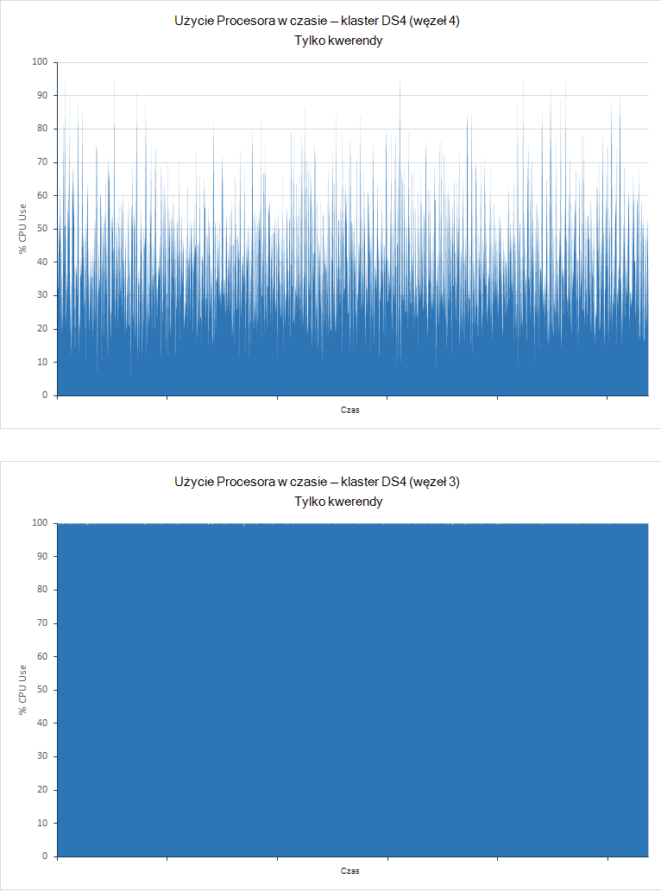

***Użycie Procesora dla węzłów najmniej zajęte i najczęściej używane w klastrze DS4 wykonujące test tylko do kwerendy***

Klaster DS14 to nie była wielkość liter. Użycie Procesora w obu wynosiła we wszystkich węzłach i dostępność drugiej replice stał się mniej korzyści a więcej ogólnych:

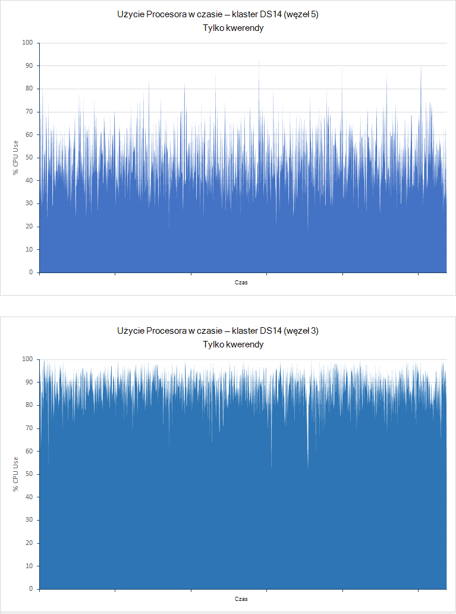

***Użycie Procesora dla węzłów najmniej używane i najczęściej używane w klastrze DS14 wykonujące test tylko do kwerendy***

Te wyniki będą obejmowały potrzeba porównania systemu starannie podczas podejmowania decyzji o wielu replikach za pomocą. Zawsze wymaga co najmniej jednej replice każdy indeks (o ile nie jesteś bez ryzyka utraty danych, jeśli węzeł kończy się niepowodzeniem), ale dodatkowych replik można nałożyć obciążenie systemu nieco korzyści, w zależności od usługi obciążenia i zasoby sprzętowe dostępne z klastrem.

## <a name="performance-results---doc-values"></a>Wyniki - wartości dokumentu

Testy *spożyciu i kwerendy* przeprowadzono z wartościami dokumentu włączone, powoduje Elasticsearch do przechowywania danych używany na potrzeby sortowania pola na dysku. Testy były powtarzane z wartościami dokumentu wyłączony, więc Elasticsearch dynamicznie zbudowane fielddata i w pamięci podręcznej. Wszystkie testy uruchomiono 24 godzin. W poniższej tabeli porównano czas odpowiedzi w przypadku testów przed klastrów węzłów 6 utworzony przy użyciu D4, DS4 i DS14 maszyny wirtualne (klaster D4 używa zwykła dyskach twardych, podczas gdy twarde SSD klastrów DS4 i DS14).

| Klaster | Operacja/kwerendy            | Średni czas reakcji (ms) - włączone wartości dokumentu | Średni czas reakcji (ms) - wyłączone wartości dokumentu | % różnicy czas reakcji |
|---------|----------------------------|-------------------------------------------------|--------------------------------------------------|-------------------------------|
| D4      | Spożyciu                  | 978                                             | 835                                              | -15%                          |
|         | Liczba według ocen            | 103                                             | 132                                              | + 28%                          |
|         | Liczba przez godzinę            | 134                                             | 189                                              | + 41%                          |
|         | Trafień według krajów            | 199                                             | 259                                              | + 30%                          |
|         | Organizacje góry 15       | 137                                             | 184                                              | + 34%                          |
|         | Liczba unikatowych organizacji | 139                                             | 197                                              | + 42%                          |
|         | Liczba unikatowych adresów IP            | 510                                             | 604                                              | + 18%                          |
|         | Liczba całkowita liczba odwołań           | 89                                              | 134                                              | + 51%                          |
||||||
| DS4     | Spożyciu                  | 511                                             | 581                                              | + 14%                          |
|         | Liczba według ocen            | 187                                             | 190                                              | + 2%                           |
|         | Liczba przez godzinę            | 411                                             | 409                                              | -0,5%                         |
|         | Trafień według krajów            | 402                                             | 414                                              | + 3%                           |
|         | Organizacje góry 15       | 307                                             | 284                                              | -7%                           |
|         | Liczba unikatowych organizacji | 320                                             | 313                                              | -2%                           |
|         | Liczba unikatowych adresów IP            | 841                                             | 955                                              | + 14%                          |
|         | Liczba całkowita liczba odwołań           | 236                                             | 281                                              | + 19%                          |
||||||
| DS14    | Spożyciu                  | 511                                             | 571                                              | + 12%                          |
|         | Liczba według ocen            | 201                                             | 232                                              | + 15%                          |
|         | Liczba przez godzinę            | 298                                             | 341                                              | + 14%                          |
|         | Trafień według krajów            | 363                                             | 457                                              | + 26%                          |
|         | Organizacje góry 15       | 244                                             | 338                                              | + 39%                          |
|         | Liczba unikatowych organizacji | 283                                             | 350                                              | + 24%                          |
|         | Liczba unikatowych adresów IP            | 681                                             | 909                                              | + 33%                          |
|         | Liczba całkowita liczba odwołań           | 200                                             | 245                                              | + 23%                          |

W następnej tabeli porównano liczbę operacji spożyciu wykonaną przez wszystkie testy:

| Klaster | Liczba operacji spożyciu — włączone wartości dokumentu | Liczba operacji spożyciu — wyłączone wartości dokumentu | % różnicy w \number spożyciu operacji |
|---------|----------------------------------------------|-----------------------------------------------|-----------------------------------------|
| D4      | 264769                                       | 408690                                        | + 54%                                    |
| DS4     | 503137                                       | 578237                                        | + 15%                                    |
| DS14    | 502714                                       | 586472                                        | + 17%                                    |

Ulepszone spożyciu stawki wystąpić w przypadku wartości dokumentu wyłączona jako mniej danych jest zapisywany na dysku podczas wstawiania dokumentów. Zwiększona wydajność jest szczególnie zauważalne maszyn wirtualnych D4 za pomocą dysków twardych do przechowywania danych. W tym przypadku czas reakcji dla operacji spożyciu również zmniejszyła się przez 15% (zobacz pierwszej tabeli w tej sekcji). To może ze względu na ograniczenie ciśnienia na dysków twardych, które mogą działać zbliżony granice operacji i/o na SEKUNDĘ w teście z dokumentem wartości włączone, zobacz badanie typu dysku, aby uzyskać więcej informacji. Wydajność We/Wy maszyny wirtualne D4 poniższym diagramem różni się od wartości dokumentu włączone (wartości przechowywane na dysku) i dokumentu wartości wyłączone (wartości przechowywane w pamięci):

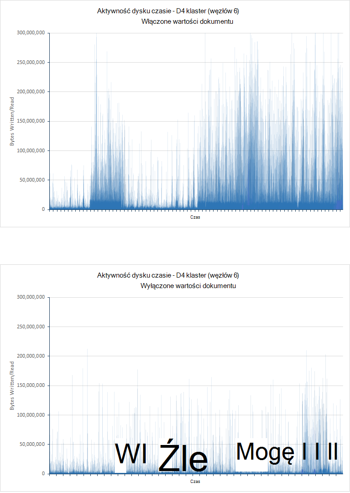

***Działanie dysku dla klastrów D4 wartościami dokumentu włączone i wyłączone***

Natomiast wartości spożyciu maszyny wirtualne, przy użyciu twarde SSD Pokaż zwiększona o małych w polu Liczba dokumentów, ale również wzrost czas reakcji operacji spożyciu. Z jednej lub dwóch wyjątkami małych czasy odpowiedzi kwerendy były również zmniejszenie. Twarde SSD są rzadziej działać zbliżony granice operacji i/o na SEKUNDĘ z wartościami dokumentu włączone, aby zmian w działaniu prawdopodobnie wynika zwiększa się przetwarzania aktywności i ogólnych zarządzania stosu maszyny wirtualnej Java. Jest to widoczne przez porównanie procesora z wartościami dokumentu włączone i wyłączone. Następny wykresu są wyróżniane te dane dla klastrów DS4, gdzie większość użycie Procesora jest przenoszony z przedziału 30-40% z wartościami dokumentu możliwość grupy 40-50% wartości dokumentu wyłączone (klaster DS14 pokazano trendu podobne):


***Użycie Procesora dla klastrów DS4 z wartościami dokumentu włączone i wyłączone***

Aby odróżnić skutków tej czynności wartości dokumentu wydajności kwerend z pożytkiem danych, pary badań tylko do kwerendy przeprowadzono dla klastrów DS4 i DS14 z wartościami dokumentu włączone i wyłączone. W poniższej tabeli podsumowano wyniki tych testów:

| Klaster | Operacja/kwerendy            | Średni czas reakcji (ms) - włączone wartości dokumentu | Średni czas reakcji (ms) - wyłączone wartości dokumentu | % różnicy czas reakcji |
|---------|----------------------------|-------------------------------------------------|--------------------------------------------------|-------------------------------|
| DS4     | Liczba według ocen            | 4489                                            | 3736                                             | -16%                          |
|         | Liczba przez godzinę            | 7293                                            | 5459                                             | -25%                          |
|         | Trafień według krajów            | 7564                                            | 5930                                             | -22%                          |
|         | Organizacje góry 15       | 5066                                            | 3874                                             | -14%                          |
|         | Liczba unikatowych organizacji | 5231                                            | 4483                                             | -2%                           |
|         | Liczba unikatowych adresów IP            | 9228                                            | 9474                                             | + 3%                           |
|         | Liczba całkowita liczba odwołań           | 2180                                            | 1218                                             | -44%                          |
||||||
| DS14    | Liczba według ocen            | 1927 r                                            | 2144                                             | + 11%                          |
|         | Liczba przez godzinę            | 4483                                            | 4337                                             | -3%                           |
|         | Trafień według krajów            | 4761                                            | 4840                                             | + 2%                           |
|         | Organizacje góry 15       | 2117                                            | 2302                                             | + 9%                           |
|         | Liczba unikatowych organizacji | 2393                                            | 2497                                             | + 4%                           |
|         | Liczba unikatowych adresów IP            | 7159                                            | 7639                                             | + 7%                           |
|         | Liczba całkowita liczba odwołań           | 642                                             | 633                                              | -1%                           |

Pamiętaj, że począwszy 2.0 Elasticsearch z wartości dokumentu są domyślnie włączone. W testów obejmujących klaster DS4 wyłączanie wartości dokumentu zostanie wyświetlony mieć dodatni wpływ ogólny, odwrotnej jest zazwyczaj dotyczy klaster DS14 (dwóch przypadkach, gdy wydajność jest lepsza z wartościami dokumentu wyłączone są bardzo małe).

Klaster DS4 procesora w obu przypadkach była blisko 100% na czas trwania obu badań wskazujący, że klaster jest powiązana Procesora. Jednak liczba kwerend przetwarzane zmniejszyła się z 7369 5894 (20%). Pamiętać, że po wyłączeniu wartości dokumentu Elasticsearch wygeneruje dynamicznie fielddata w pamięci, i to pobiera energii Procesora. Ta konfiguracja ma obniżonej stawki dysku, ale zwiększenie obciążenia na procesory już uruchomiony zbliżony ich maksymalną możliwości, w tym przypadku kwerendy są szybsze z wartościami dokumentu wyłączone istnieją jednak mniej z nich.

W testów DS14 z i bez wartości dokumentu Procesora aktywności był wysoki, ale nie 100%. Liczba kwerend wykonywane były nieco wyższe (około 4%) do testowania z użyciem wartości dokumentu włączone:

| Klaster | Kwerendy                      | Liczba wykonanej - włączone wartości dokumentu | Liczba wykonanej - dokumentu wartości wyłączone |
|---------|----------------------------|---------------------------------------|----------------------------------------|
| DS4     | Liczba według ocen            | 1054                                  | 845                                    |
|         | Liczba przez godzinę            | 1054                                  | 844                                    |
|         | Trafień według krajów            | 1053                                  | 842                                    |
|         | Organizacje góry 15       | 1055                                  | 846                                    |
|         | Liczba unikatowych organizacji | 1051                                  | 839                                    |
|         | Liczba unikatowych adresów IP            | 1051                                  | 839                                    |
|         | Liczba całkowita liczba odwołań           | 1051                                  | 839  
|||||                                  |
| DS14    | Liczba według ocen            | 1772                                  | 1842                                   |
|         | Liczba przez godzinę            | 1772                                  | 1839                                   |
|         | Trafień według krajów            | 1770                                  | 1838                                   |
|         | Organizacje góry 15       | 1773                                  | 1842                                   |
|         | Liczba unikatowych organizacji | 1769                                  | 1837                                   |
|         | Liczba unikatowych adresów IP            | 1768                                  | 1837                                   |
|         | Liczba całkowita liczba odwołań           | 1769                                  | 1837                                   |

## <a name="performance-results---shard-request-cache"></a>Wyniki - shard żądania w pamięci podręcznej

Wykazać się, jak buforowania danych indeksu w pamięci każdego węzła może mieć wpływ na wydajność, testowanie *kwerendy i pokarmową* została przeprowadzona w dniu DS4 i DS14 klastrze węzeł 6 z pamięci podręcznej indeks enabled - można znaleźć w sekcji [przy użyciu pamięci podręcznej żądania shard](#using-the-shard-request-cache) więcej informacji. Wyniki porównano generowane przez wcześniejszych testów przy użyciu ten sam indeks, ale z indeksu Buforowanie wyłączone. W poniższej tabeli podsumowano wyniki. Zauważ, że dane występują został skrócony dotyczyć tylko pierwszych 90 minut test, na tym etapie porównawczych trendu była widoczna i kontynuowanie test będzie prawdopodobnie masz nie uzyskane wszelkie dodatkowe informacje na temat technologii:

| Klaster | Operacja/kwerendy            | Średni czas reakcji (ms) - wyłączone pamięć podręczna indeksu | Średni czas reakcji (ms) - pamięci podręcznej indeks włączony | % różnicy czas reakcji |
|---------|----------------------------|---------------------------------------------------|--------------------------------------------------|-------------------------------|
| DS4     | Spożyciu                  | 504                                               | 3260                                             | + 547%                         |
|         | Liczba według ocen            | 218                                               | 273                                              | + 25%                          |
|         | Liczba przez godzinę            | 450                                               | 314                                              | -30%                          |
|         | Trafień według krajów            | 447                                               | 397                                              | -11%                          |
|         | Organizacje góry 15       | 342                                               | 317                                              | -7%                           |
|         | Liczba unikatowych organizacji | 370                                               | 324                                              | -12 %%                         |
|         | Liczba unikatowych adresów IP            | 760                                               | 355                                              | -53%                          |
|         | Liczba całkowita liczba odwołań           | 258                                               | 291                                              | + 12%                          |
||||||
| DS14    | Spożyciu                  | 503                                               | 3365                                             | + 569%                         |
|         | Liczba według ocen            | 234                                               | 262                                              | + 12%                          |
|         | Liczba przez godzinę            | 357                                               | 298                                              | -17%                          |
|         | Trafień według krajów            | 416                                               | 383                                              | -8%                           |
|         | Organizacje góry 15       | 272                                               | 324                                              | -7%                           |
|         | Liczba unikatowych organizacji | 330                                               | 321                                              | -3%                           |
|         | Liczba unikatowych adresów IP            | 674                                               | 352                                              | – 48%                          |
|         | Liczba całkowita liczba odwołań           | 227                                               | 292                                              | + 29%                          |

Te dane przedstawia dwóch ważnych miejsc:

-  Szybkości spożyciu danych ma być znacznie zmniejszona przez włączenie buforowania indeksu.

-  Indeks pamięci podręcznej niekoniecznie nie poprawia czas reakcji wszystkie typy kwerend i może mieć negatywny wpływ na niektórych operacji agregowania przykład realizowane przez liczba według oceny i całkowita liczba trafień kwerendy.
 

Aby dowiedzieć się, dlaczego system wykazuje ten problem, należy rozważyć liczba kwerend pomyślnie wykonywane w każdym przypadku podczas testów. W poniższej tabeli przedstawiono te dane:

| Klaster | Operacja/kwerendy            | Liczba operacji/kwerendy — wyłączony pamięć podręczna indeksu | Liczba operacji/kwerendy — pamięci podręcznej indeks włączony |
|---------|----------------------------|-------------------------------------------------|------------------------------------------------|
| DS4     | Spożyciu                  | 38611                                           | 13232                                          |
|         | Liczba według ocen            | 524                                             | 18704                                          |
|         | Liczba przez godzinę            | 523                                             | 18703                                          |
|         | Trafień według krajów            | 522                                             | 18702                                          |
|         | Organizacje góry 15       | 521                                             | 18706                                          |
|         | Liczba unikatowych organizacji | 521                                             | 18700                                          |
|         | Liczba unikatowych adresów IP            | 521                                             | 18699                                          |
|         | Liczba całkowita liczba odwołań           | 521                                             | 18701                                          |
||||                                        |
| DS14    | Spożyciu                  | 38769                                           | 12835                                          |
|         | Liczba według ocen            | 528                                             | 19239                                          |
|         | Liczba przez godzinę            | 528                                             | 19239                                          |
|         | Trafień według krajów            | 528                                             | 19238                                          |
|         | Organizacje góry 15       | 527                                             | 19240                                          |
|         | Liczba unikatowych organizacji | 524                                             | 19234                                          |
|         | Liczba unikatowych adresów IP            | 524                                             | 19234                                          |
|         | Liczba całkowita liczba odwołań           | 527                                             | 19236                                          |

Widać, że chociaż spożyciu gdy zostało włączone buforowanie wynosiła około 1-3 tego podczas buforowanie zostało wyłączone, liczba kwerend wykonywane przy wzroście współczynnika równego 34. Kwerendy nie są już ponoszenia tyle dysku i nie ma celu współzawodniczenia dla zasobów dysku. Jest to uwzględnione w wykresów na poniższej ilustracji, które porównanie działania We/Wy dla wszystkich czterech przypadkach:

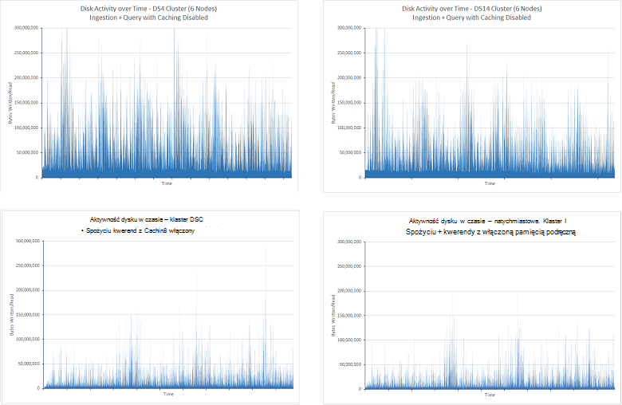

***Działania dyskowej w teście spożyciu i kwerendy z pamięci podręcznej indeks wyłączone i włączone***

Spadek dyskowej przeznaczone również, że Procesora poświęconego mniej czasu trwa oczekiwanie na wejścia/wyjścia do wykonania. Wyróżnione następnej ilustracji:

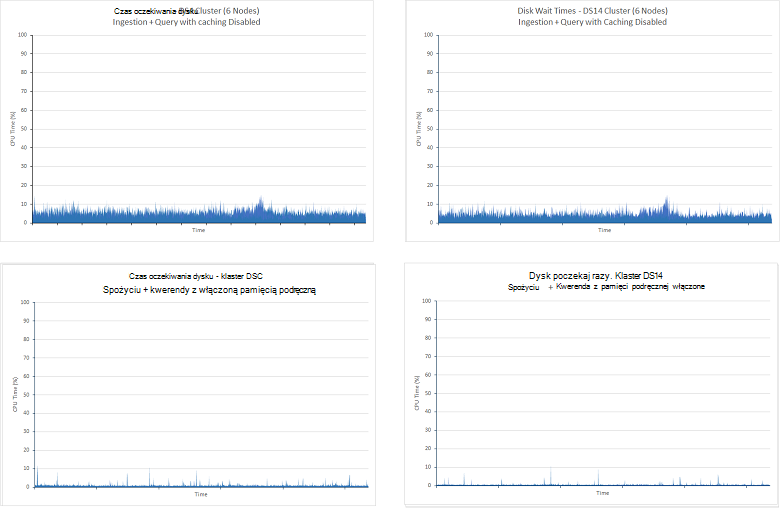

***Procesor czas oczekiwania na dyskowej zakończyć w teście spożyciu i kwerendy z indeksu Buforowanie wyłączone i włączone***

Zmniejszenie dysku, które mają we/wy Elasticsearch może poświęcanego większa część jego czas obsługi kwerend z danych przechowywanych w pamięci. To wzrost procesora okaże się, jeśli przeglądać procesora we wszystkich przypadkach cztery. Wykresy poniżej Pokaż, jak wartość był bardziej poniesione z włączoną pamięcią podręczną:

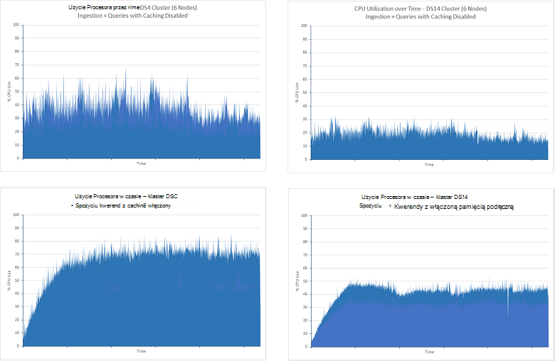

***Testowanie procesora spożyciu i kwerendy z indeksu Buforowanie wyłączone i włączone***

Wielkość sieci We/Wy w obu przypadkach na czas trwania testów była podobnej. Testy bez pamięci podręcznej pokazano stopniowego rozkładu podczas okresu próbnego, ale dłuższy, 24-godzinnego uruchamia tych testów pokazano Ta statystyka poziomej w przybliżeniu 2.75GBps. Na poniższej ilustracji przedstawiono te dane dla klastrów DS4 (dane dla klastrów DS14 był bardzo podobne):

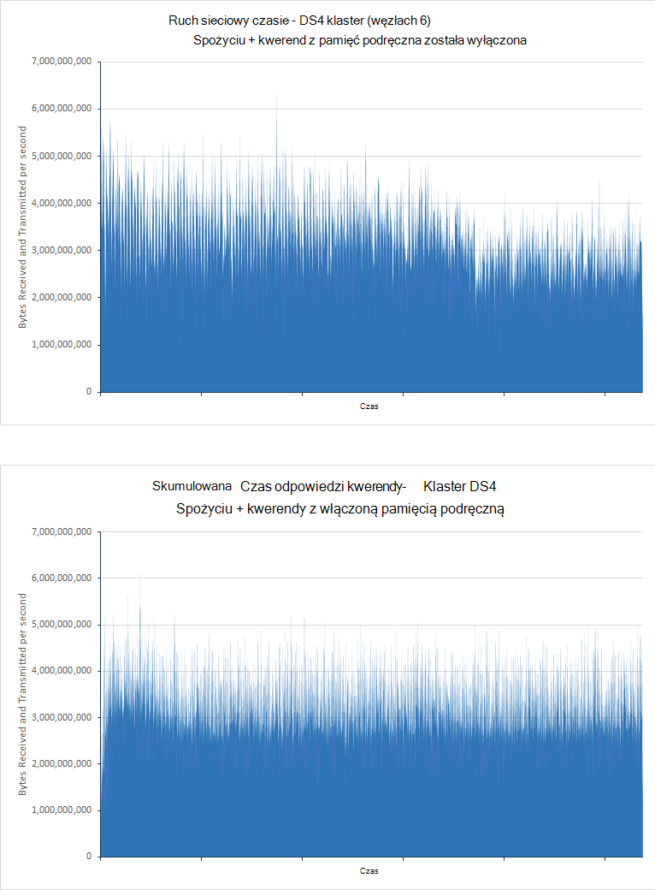

***Sieć natężenia w teście spożyciu i kwerendy z indeksu Buforowanie wyłączone i włączone***

Zgodnie z opisem w teście [Skalowanie wewnętrzne](#performance-results-scaling-up) , ograniczenia przepustowości z maszyny wirtualne Azure sieci nie są publikowane i może być różna, ale średnim poziomów aktywności Procesora i dysku sugeruje, że wykorzystania sieci może być ograniczanie czynniki, w tym scenariuszu.

Buforowanie nadaje się bardziej w sposób naturalny scenariuszy, w którym zmiany danych rzadko. Aby wyróżnić wpływu pamięci podręcznej w tym scenariuszu *tylko do kwerendy* testy przeprowadzono z włączoną pamięcią podręczną. Poniżej przedstawiono wyniki (testy uruchomiono 90 minuty, a następnie indeksy badany zawarte 100 milionów dokumenty):

| Klaster | Kwerendy                      | Średni czas reakcji (ms) | Liczba kwerend wykonane |
|---------|----------------------------|----------------------------|-------------------------|
|         |                            | **Pamięć podręczna wyłączona**         | **Pamięć podręczna włączona**       |
| DS4     | Liczba według ocen            | 4489                       | 210                     |
|         | Liczba przez godzinę            | 7292                       | 211                     |
|         | Trafień według krajów            | 7564                       | 231                     |
|         | Organizacje góry 15       | 5066                       | 211                     |
|         | Liczba unikatowych organizacji | 5231                       | 211                     |
|         | Liczba unikatowych adresów IP            | 9228                       | 218                     |
|         | Liczba całkowita liczba odwołań           | 2180                       | 210                     |
|         |                            |                            |                         |
| DS14    | Liczba według ocen            | 1927 r                       | 211                     |
|         | Liczba przez godzinę            | 4483                       | 219                     |
|         | Trafień według krajów            | 4761                       | 236                     |
|         | Organizacje góry 15       | 2117                       | 212                     |
|         | Liczba unikatowych organizacji | 2393                       | 212                     |
|         | Liczba unikatowych adresów IP            | 7159                       | 220                     |
|         | Liczba całkowita liczba odwołań           | 642                        | 211                     |

Wariancja wydajności niebuforowany testów jest ze względu na różnicę w zasobów dostępnych DS4 i maszyny wirtualne DS14. W obu przypadkach test pamięci podręcznej Średni czas reakcji inicjały znacznie jako danych został pobierane bezpośrednio z pamięci. Warto również zauważyć, że czasy odpowiedzi dla DS4 pamięci podręcznej i DS14 klaster testy zostały bardzo podobne pomimo różnice niebuforowany wyników. Dostępna jest również bardzo mało różnica między czasy odpowiedzi dla każdej kwerendy w obrębie każdego badania, wszystkie przyjmować około 220ms. Stawki dysku i procesora dla obu klastrów były bardzo niskie jako raz wszystkie dane znajdują się w pamięci We/Wy lub przetwarzanie jest wymagane. Stopa sieciowe We/Wy jest podobny do badań bez buforowania potwierdzania tej przepustowości sieci może być ograniczanie czynniki, w tym badaniu. Następujące wykresy prezentowanie tych informacji dotyczących klaster DS4. Profil klaster DS14 to bardzo podobne:

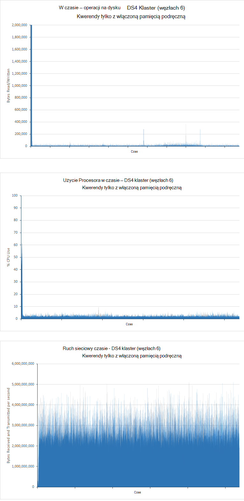

***Do dysku, procesora i wykorzystania sieci w teście tylko do kwerendy z włączoną pamięcią podręczną indeksu***

Dane w powyższej tabeli sugerują, że używanie architektury DS14 przedstawia nieco korzyści za pośrednictwem przy użyciu DS4. W rzeczywistości liczba prób wygenerowane przez klaster DS14 została około 5% poniżej klaster DS4, ale może to być również z powodu ograniczeń sieci, które mogą się nieco różnić w czasie.

## <a name="performance-results---number-of-shards"></a>Wyniki — liczba odłamki

Celem tego badania było ustalić, czy liczba odłamki utworzoną dla indeksu ma wpływ na wydajność kwerendy tego indeksu.

Osobne testów przeprowadzonych wcześniej pokazano, że konfiguracja shard indeksu może mieć wpływ na szybkość spożyciu danych. Testów przeprowadzonych w celu wyznaczenia wydajności kwerend wykonane metodologii podobne, ale jest ograniczony do klastrów węzeł 6 sprzęt DS14 z systemem. Ta metoda pozwala zminimalizować liczbę zmiennych, więc różnice w wydajności powinny być ze względu na wielkość odłamki.

*Tylko do kwerendy* badanie zostało przeprowadzone na kopii ten sam indeks skonfigurowany z 7, 13, 23, 37 i 61 odłamki podstawowego. Indeks zawarte 100 milionów dokumentów i zostały pojedynczej replice podwajając liczbę odłamki w klastrze. Uruchomiono każdego testu dla 90 minut. W poniższej tabeli przedstawiono wyniki. Średni czas reakcji pokazano czas reakcji transakcji testowej JMeter obejmujący kompletny zestaw kwerend odbywa się w każdej iteracji test. Zobacz uwagi w sekcji [wyniki — skalowanie w górę](#performance-results-scaling-up) , aby uzyskać więcej informacji:

| Liczba odłamki          | Układ shard (odłamki na węzła, w tym repliki) | Liczba kwerend wykonane | Średni czas odpowiedzi (ms) |
|---------------------------|----------------------------------------------------|-----------------------------|------------------------|
| 7 (łącznie z repliki 14) | 3-2-2-2-2-3                                        | 7461                        | 40524                  |
| 13 (26)                   | 5-4-5-4-4-4                                        | 7369                        | 41055                  |
| 23 (46)                   | 7-8-8-7-8-8                                        | 14193                       | 21283                  |
| 37 (74)                   | 13-12-12-13-12-12                                  | 13399                       | 22506                  |
| 61 (122)                  | 20-21-20-20-21-20                                  | 14743                       | 20445                  |

Wyniki te wskazują, że znaczną różnią się w wydajności klaster shard 13(26) i klaster shard 23,(46), przepustowość prawie zwiększa dwukrotnie i połowę czasy odpowiedzi. Najprawdopodobniej z powodu konfiguracji maszyny wirtualne i struktury używanych przez Elasticsearch przetwarzania żądania wyszukiwania. Żądania wyszukiwania znajduje się w kolejce i każdego żądania wyszukiwania jest obsługiwany przez wątku pojedynczego wyszukiwania. Liczba wątków wyszukiwania utworzone przez węzeł Elasticsearch jest to funkcja liczby procesorów dostępnych na komputerze obsługującym węzeł. Wyniki sugerują, że z odłamki tylko 4 i 5 w węźle zasoby przetwarzania są nie jest w pełni włączona. Jest to obsługiwane sprawdzając procesora podczas uruchamiania ten test. Poniższy obraz przedstawia migawkę pobierany ze Marvel podczas wykonywania 13(26) shard test:

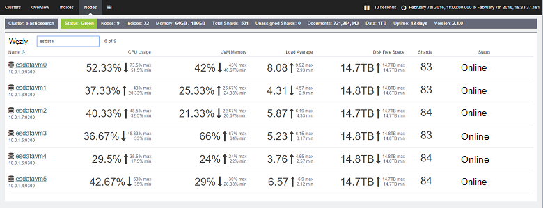

***Użycie Procesora w teście tylko do kwerendy w klastrze shard 7(14)***

Porównanie tych wyników z tymi testu shard 23(46):

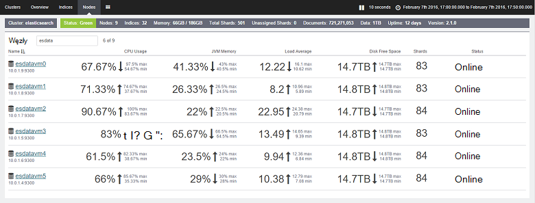

***Użycie Procesora w teście tylko do kwerendy w klastrze shard 23(46)***

W teście shard 23(46) procesora był znacznie większy. Każdy węzeł zawiera odłamki 7 lub 8. Architektura DS14 zawiera 16 procesorów i Elasticsearch może lepiej wykorzystać tę liczbę rdzenie z dodatkowe odłamki. Dane w powyższej tabeli Zaproponuj zwiększenie liczby odłamki poza ten punkt może zwiększyć wydajność nieco, że należy przesunięcie tych wyników dodatkowe obciążenie utrzymania dużej liczby odłamki. Testy oznacza, że Optymalna liczba odłamki na węzeł jest połowę rdzenie dostępne w każdym węźle. Należy jednak pamiętać, że te wyniki zostały osiągnięte, gdy tylko wykonywania kwerend. Jeśli systemem importowania danych, należy również rozważyć, jak sharding może mieć wpływ na wydajność operacji spożyciu danych. 

## <a name="summary"></a>Podsumowanie

Elasticsearch zawiera wiele opcji, które można strukturę indeksy i dostosowywanie ich do obsługi operacji kwerend na dużą skalę. Ten dokument został podsumowane niektóre typowe konfiguracje i technik, które można dostosować bazy danych na potrzeby kwerendy. Jednak powinien rozpoznać, że jest zależnościami między optymalizowania bazy danych do obsługi szybkiego wyszukiwania zamiast pomocniczych spożyciu dużych danych. Czasami co będzie pasować do wykonywania kwerend może mieć szkodliwy wpływ na operacje wstawiania i odwrotnie. W systemie udostępniany mieszanych obciążenia należy ocenić miejsce, w którym znajduje się saldo i odpowiednio dopasować parametry systemu.

Ponadto stosowanie różnych konfiguracji i technik może być różna w zależności od rodzaju struktury danych i ograniczenia (lub inny) sprzętu systemu jest tworzona na. Wiele testów wyświetlane w tym dokumencie przedstawiają sposób zaznaczenia platform sprzęt może mieć wpływ na wydajność, a także jak kilka strategii może być przydatne w niektórych przypadkach szkodliwych w innych. Istotne jest dostępnych opcji, a następnie wykonać rygorystyczne wzorców, korzystając z własnych danych do określenia najbardziej optymalnego połączenia.

Pamiętaj także, że Elasticsearch baza danych jest zawsze statyczne elementu. Prawdopodobnie będzie rosnąć w czasie, a strategii umożliwiających struktury danych może być konieczne poprawić regularnie. Na przykład go może zajść konieczność rozbudowy, skalowania, lub indeksowania danych za pomocą dodatkowych odłamki. Jak system zwiększa rozmiar i złożoność, Przygotuj się na bieżąco testowanie wydajności, aby upewnić się, są dowolnego poziomu gwarantowana klientom nadal spotkania.

## <a name="appendix-the-query-and-aggregation-performance-test"></a>Dodatek: kwerendy i agregacji test wydajności

Niniejszy dodatek opisuje test wydajności przeprowadzana klaster Elasticsearch. Do uruchomienia testów przy użyciu JMeter uruchomionych oddzielny zestaw maszyny wirtualne. Szczegóły konfiguracji środowisku testowym są opisano w sekcji [Tworzenie testowania środowisko Elasticsearch Azure](guidance-elasticsearch-creating-performance-testing-environment.md). Do testowania własne, możesz utworzyć własny plan badań JMeter ręcznie zgodnie z zaleceniami w tym dodatku lub można używać skryptów testu automatycznego dostępne osobno. Aby uzyskać więcej informacji zobacz [Uruchamianie testów wydajności Elasticsearch](guidance-elasticsearch-running-automated-performance-tests.md).

Obciążenie pracą kwerendy danych wykonywane zestawu kwerend opisane poniżej podczas wykonywania dużych przekazywania dokumentów, w tym samym czasie. Przeznaczenie obciążenie było zasymulowania środowisku produkcyjnym, w którym nowych danych jest stale dodawany podczas wyszukiwania są wykonywane. Kwerendy zostały struktury, aby pobrać najnowsze dane z dokumenty dodane w ciągu ostatnich 15 minut.

Każdy dokument został zapisany w jeden indeks o nazwie *idx*i sprzedał typ *dokumentu*. Następujące żądanie HTTP umożliwia tworzenie indeksu. Ustawienia *number_of_replicas* i *number_of_shards* różnić się od wartości pokazano poniżej w wielu testów. Ponadto badań używane fielddata zamiast wartości dokumentu, każdej właściwości została odnoszący atrybutem *"doc_values": FAŁSZ*.

**Ważne**: Indeks został usunięty i odtworzyć przed każdego testu. 

``` http
PUT /idx
{  
    "settings" : {
        "number_of_replicas": 1,
        "refresh_interval": "30s",
        "number_of_shards": "5",
        "index.translog.durability": "async"    
    },
    "doc": {
        "mappings": {
            "event": {
                "_all": {
                    "enabled": false
                },
                "_timestamp": {
                    "enabled": true,
                    "store": true,
                    "format": "date_time"
                },
                "properties": {
                    "Organization": {
                        "type": "string",
                        "index": "not_analyzed"
                    },
                    "CustomField1": {
                        "type": "string",
                        "index": "not_analyzed"
                    },
                    "CustomField2": {
                        "type": "string",
                        "index": "not_analyzed"
                    },
                    "CustomField3": {
                        "type": "string",
                        "index": "not_analyzed"
                    },
                    "CustomField4": {
                        "type": "string",
                        "index": "not_analyzed"
                    },
                    "CustomField5": {
                        "type": "string",
                        "index": "not_analyzed"
                    },
                    "DateTimeReceivedUtc": {
                        "type": "date",
                        "format": "dateOptionalTime"
                    },
                    "Host": {
                        "type": "string",
                        "index": "not_analyzed"
                    },
                    "HttpMethod": {
                        "type": "string",
                        "index": "not_analyzed"
                    },
                    "HttpReferrer": {
                        "type": "string",
                        "index": "not_analyzed"
                    },
                    "HttpRequest": {
                        "type": "string",
                        "index": "not_analyzed"
                    },
                    "HttpUserAgent": {
                        "type": "string",
                        "index": "not_analyzed"
                    },
                    "HttpVersion": {
                        "type": "string",
                        "index": "not_analyzed"
                    },
                    "OrganizationName": {
                        "type": "string",
                        "index": "not_analyzed"
                    },
                    "SourceIp": {
                        "type": "ip"
                    },
                    "SourceIpAreaCode": {
                        "type": "long"
                    },
                    "SourceIpAsnNr": {
                        "type": "string",
                        "index": "not_analyzed"
                    },
                    "SourceIpBase10": {
                        "type": "long"
                    },
                    "SourceIpCity": {
                        "type": "string",
                        "index": "not_analyzed"
                    },
                    "SourceIpCountryCode": {
                        "type": "string",
                        "index": "not_analyzed"
                    },
                    "SourceIpLatitude": {
                        "type": "double"
                    },
                    "SourceIpLongitude": {
                        "type": "double"
                    },
                    "SourceIpMetroCode": {
                        "type": "long"
                    },
                    "SourceIpPostalCode": {
                        "type": "string",
                        "index": "not_analyzed"
                    },
                    "SourceIpRegion": {
                        "type": "string",
                        "index": "not_analyzed"
                    },
                    "SourceLatLong": {
                        "type": "geo_point",
                        "doc_values": true,
                        "lat_lon": true,
                        "geohash": true
                    },
                    "SourcePort": {
                        "type": "string",
                        "index": "not_analyzed"
                    },
                    "SourcedFrom": {
                        "type": "string",
                        "index": "not_analyzed"
                    },
                    "TargetIp": {
                        "type": "ip"
                    },
                    "TargetPort": {
                        "type": "string",
                        "index": "not_analyzed"
                    },
                    "Rating": {
                        "type": "string",
                        "index": "not_analyzed"
                    },
                    "UseHumanReadableDateTimes": {
                        "type": "boolean"
                    }
                }
            }
        }
    }
}
```

Następujące kwerendy były wykonywane przez test:
* Ile dokumentów przy użyciu wartości klasyfikacji zostały wprowadzone w ciągu ostatnich 15 minut?

  ```http
  GET /idx/doc/_search
  {
    "query": {
      "bool": {
        "must": [
          {
            "range": {
              "DateTimeReceivedUtc": {
                "gte": "now-15m",
                "lte": "now"
              }
            }
          }
        ],
        "must_not": [],
        "should": []
      }
    },
    "from": 0,
    "size": 0,
    "aggs": {
      "2": {
        "terms": {
          "field": "Rating",
          "size": 5,
          "order": {
            "_count": "desc"
          }
        }
      }
    }
  }
  ```

* Liczba dokumentów zostały dodane w każdym 5 minut podczas ostatniego 15 minut?

  ```http
  GET /idx/doc/_search
  {
    "query": {
      "bool": {
        "must": [
          {
            "range": {
              "DateTimeReceivedUtc": {
                "gte": "now-15m",
                "lte": "now"
              }
            }
          }
        ],
        "must_not": [],
        "should": []
      }
    },
    "from": 0,
    "size": 0,
    "sort": [],
    "aggs": {
      "2": {
        "date_histogram": {
          "field": "DateTimeReceivedUtc",
          "interval": "5m",
          "time_zone": "America/Los_Angeles",
          "min_doc_count": 1,
          "extended_bounds": {
            "min": "now-15m",
            "max": "now"
          }
        }
      }
    }
  }
  ```

* Liczba dokumentów każdej wartości klasyfikacji zostały dodane dla każdego kraju w ciągu ostatnich 15 minut?

  ```HTTP
  GET /idx/doc/_search
  {
    "query": {
      "filtered": {
        "query": {
          "query_string": {
            "query": "*",
            "analyze_wildcard": true
          }
        },
        "filter": {
          "bool": {
            "must": [
              {
                "query": {
                  "query_string": {
                    "query": "*",
                    "analyze_wildcard": true
                  }
                }
              },
              {
                "range": {
                  "DateTimeReceivedUtc": {
                    "gte": "now-15m",
                    "lte": "now"
                  }
                }
              }
            ],
            "must_not": []
          }
        }
      }
    },
    "size": 0,
    "aggs": {
      "2": {
        "terms": {
          "field": "Rating",
          "size": 5,
          "order": {
            "_count": "desc"
          }
        },
        "aggs": {
          "3": {
            "terms": {
              "field": "SourceIpCountryCode",
              "size": 15,
              "order": {
                "_count": "desc"
              }
            }
          }
        }
      }
    }
  }
  ```

* 15 organizacji, w których występuje najczęściej używane dokumenty dodane w ciągu ostatnich 15 minut?

  ```http
  GET /idx/doc/_search
  {
    "query": {
      "filtered": {
        "query": {
          "query_string": {
            "query": "*",
            "analyze_wildcard": true
          }
        },
        "filter": {
          "bool": {
            "must": [
              {
                "query": {
                  "query_string": {
                    "query": "*",
                    "analyze_wildcard": true
                  }
                }
              },
              {
                "range": {
                  "DateTimeReceivedUtc": {
                    "gte": "now-15m",
                    "lte": "now"
                  }
                }
              }
            ],
            "must_not": []
          }
        }
      }
    },
    "size": 0,
    "aggs": {
      "2": {
        "terms": {
          "field": "Organization",
          "size": 15,
          "order": {
            "_count": "desc"
          }
        }
      }
    }
  }
  ```

* Ile innych organizacji występuje w dokumentach dodane w ciągu ostatnich 15 minut?

  ```http
  GET /idx/doc/_search
  {
    "query": {
      "filtered": {
        "query": {
          "query_string": {
            "query": "*",
            "analyze_wildcard": true
          }
        },
        "filter": {
          "bool": {
            "must": [
              {
                "query": {
                  "query_string": {
                    "query": "*",
                    "analyze_wildcard": true
                  }
                }
              },
              {
                "range": {
                  "DateTimeReceivedUtc": {
                    "gte": "now-15m",
                    "lte": "now"
                  }
                }
              }
            ],
            "must_not": []
          }
        }
      }
    },
    "size": 0,
    "aggs": {
      "2": {
        "cardinality": {
          "field": "Organization"
        }
      }
    }
  }
  ```

* Liczba dokumentów zostały dodane w ciągu ostatnich 15 minut?

  ```http
  GET /idx/doc/_search
  {
    "query": {
      "filtered": {
        "query": {
          "query_string": {
            "query": "*",
            "analyze_wildcard": true
          }
        },
        "filter": {
          "bool": {
            "must": [
              {
                "query": {
                  "query_string": {
                    "analyze_wildcard": true,
                    "query": "*"
                  }
                }
              },
              {
                "range": {
                  "DateTimeReceivedUtc": {
                    "gte": "now-15m",
                    "lte": "now"
                  }
                }
              }
            ],
            "must_not": []
          }
        }
      }
    },
    "size": 0,
    "aggs": {}
  }
  ```

* Jak wielu różnych wartości SourceIp występuje w dokumentach dodane w ciągu ostatnich 15 minut?

  ```http
  GET /idx/doc/_search
  {
    "query": {
      "filtered": {
        "query": {
          "query_string": {
            "query": "*",
            "analyze_wildcard": true
          }
        },
        "filter": {
          "bool": {
            "must": [
              {
                "query": {
                  "query_string": {
                    "query": "*",
                    "analyze_wildcard": true
                  }
                }
              },
              {
                "range": {
                  "DateTimeReceivedUtc": {
                    "gte": "now-15m",
                    "lte": "now"
                  }
                }
              }
            ],
            "must_not": []
          }
        }
      }
    },
    "size": 0,
    "aggs": {
      "2": {
        "cardinality": {
          "field": "SourceIp"
        }
      }
    }
  }
  ```
