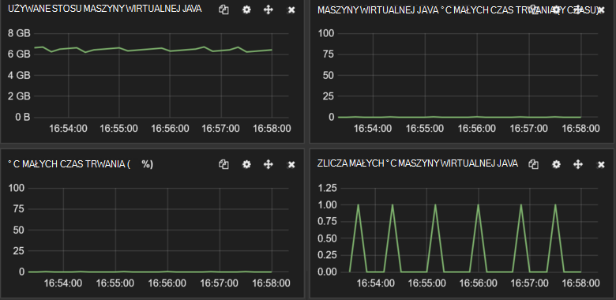

<properties
   pageTitle="Dostosowywanie wydajności spożyciu danych dla Elasticsearch Azure | Microsoft Azure"
   description="Jak zwiększyć wydajność spożyciu danych z Elasticsearch Azure."
   services=""
   documentationCenter="na"
   authors="dragon119"
   manager="bennage"
   editor=""
   tags=""/>

<tags
   ms.service="guidance"
   ms.devlang="na"
   ms.topic="article"
   ms.tgt_pltfrm="na"
   ms.workload="na"
   ms.date="09/22/2016"
   ms.author="masashin"/>

# <a name="tuning-data-ingestion-performance-for-elasticsearch-on-azure"></a>Dostosowywanie wydajności spożyciu danych dla Elasticsearch Azure

[AZURE.INCLUDE [pnp-header](../../includes/guidance-pnp-header-include.md)]

Ten artykuł jest [częścią serii](guidance-elasticsearch.md). 

## <a name="overview"></a>Omówienie

Ważnym aspektem podczas tworzenia bazy danych wszelkie wyszukiwania jest sprawdzenie najlepszy sposób określania struktury systemu mogły zjeść tej ostatniej danych z możliwością szybkie i efektywne. Zagadnienia otaczającego to wymaganie dotyczy nie tylko wybór infrastruktury, na którym wdrożenia systemu, ale również różne optymalizacje, których można użyć, aby upewnić się, że system może przechowywać z poziomu oczekiwanych napływu danych. 

W tym dokumencie opisano opcje wdrażania i konfiguracji, które należy wziąć pod uwagę stosowania klaster Elasticsearch oczekuje dużą liczbę spożyciu danych. Aby zapewnić pełne danych na potrzeby przykładowy, ten dokument zawiera wyniki wzorców różnych konfiguracji przy użyciu obciążenie pracą spożyciu proste dane duże. Szczegółowe informacje o obciążenie pracą opisano w [dodatku](#appendix-the-bulk-load-data-ingestion-performance-test) na końcu tego dokumentu.

Celem stawek było nie w celu wygenerowania wartości bezwzględne wydajności uruchamiania Elasticsearch lub nawet do zalecamy określonego topologii, ale wolisz, aby przedstawić metod, których można użyć Ocenianie wydajności, zmiany rozmiaru węzłów danych i wykonywania klastrów spełniających wymagań wydajności. 

Zmienianie rozmiaru własnych systemów, należy przetestować wydajność dokładnie według własnego obciążenia. Gromadzenie telemetrycznego umożliwiające uzyskanie informacji o konfiguracji sprzętowej optymalnego, aby użyć i poziomej skalowania czynniki, które należy rozważyć. W szczególności należy:

- Należy rozważyć, czy ogólny rozmiar ładunku wysłane i nie tylko liczbę elementów każdego zbiorczo Wstaw wezwanie. Mniejszej liczby elementów dużych zbiorczej w każdego żądania może być bardziej optymalnego niż większą liczbę, w zależności od zasobów dostępnych dla każdego żądania.

Można monitorować skutków o różnych szerokościach żądanie Wstawianie zbiorcze przy użyciu [Marvel](https://www.elastic.co/products/marvel), za pomocą *readbytes*/*writebytes* we/wy liczniki z [JMeter](https://jmeter.apache.org/)i narzędzia systemu operacyjnego, takie jak *iostat* i *vmstat* na Ubuntu. 

- Przeprowadzanie testów wydajności i zbieranie telemetrycznego przetwarzanie miary Procesora i czas oczekiwania We/Wy, opóźnienie dysku, przepustowość i czas odpowiedzi. Te informacje mogą pomóc do identyfikowania potencjalnych gardła i ocena kosztów i korzyści wynikające z używania miejsca do magazynowania premium. Mieć na uwadze, że wykorzystanie Procesora i dysku może nie być nawet we wszystkich węzłach w zależności od sposobu w odłamki i repliki, które są rozmieszczane klaster (niektóre węzły może zawierać odłamki więcej niż inne).

- Rozważ rozkładany klaster, oceny wpływu z użyciem różne liczby węzłów do obsługi obciążenie liczbę żądań usługi obciążenia pracą.

- Należy rozważyć, czy jak obciążenia może powiększanie jako powoduje rozszerzenie firmy. Oceń znaczenie wzrostu na koszty maszyny wirtualne i magazynu używanych przez węzły.

- Rozpoznaje, że użycie klastrze z większą liczbą węzłów zwykła dysków może być bardziej ekonomicznych Jeśli rozwiązania wymaga dużą liczbą żądań i infrastruktury dysku przechowuje przepustowość spełniającego usługi umów poziomu (poziomu). Jednak zwiększenie liczby węzłów można wprowadzać ogólnych w postaci dodatkowe komunikacji między węzeł i synchronizacji.

- Opis, że większa liczba rdzeni w jednym węzeł może generować więcej ruch dysku więcej dokumentów można przetwarzania. W tym przypadku Zmierz wykorzystanie dysku w celu sprawdzenia, czy / wyjścia może stać się gardło i określanie korzyści wynikające z używania miejsca do magazynowania premium.

- Przetestuj i analizowania korzystnych rozwiązań z większej liczby węzłów o mniej rdzenie biurowa lub mniejszej liczby węzłów o rdzeni. Należy pamiętać, że zwiększenie liczby replik przypiszą wymagania dotyczące klaster i może być konieczna dodać węzły.

- Weź pod uwagę, że przy użyciu tymczasowych dysków może wymagać, że można odzyskać częściej indeksy.

- Zmierz użycie miejsca do magazynowania głośność oceny wydajności i w obszarze wykorzystanie miejsca do magazynowania. Na przykład w naszym scenariusz możemy przechowywane miliardów 1,5 dokumentów przy użyciu 350GB miejsca do magazynowania.

- Zmierz szybkością dla swojego obciążenia i należy rozważyć, czy jak blisko najprawdopodobniej będzie przejść do całkowitego limitu transfer stopa we/wy dla wszystkich kont danego miejsca do magazynowania, w którym została utworzona dysków wirtualnych.

## <a name="node-and-index-design"></a>Projekt węzeł i indeksu

W układzie musi obsługiwać spożyciu dużych danych możesz na następujące pytania:

- **Znajdują się dane szybko lub względnie statyczne?** Bardziej dynamiczne dane, tym większy Obsługa obciążenie dla Elasticsearch. Jeśli dane są replikowane, każdej replice jest obsługiwana synchronicznego. Szybko danych, który zawiera tylko ograniczony rozpiętość czasu lub który można łatwo odtworzony mogą korzystać z całkowicie wyłączanie replikacji. Ta opcja jest opisane w sekcji [Dostosowywanie spożyciu danych na dużą skalę.](#tuning-large-scale-data-ingestion)

- **Jak aktualne wymagane danych wykryte przez wyszukiwanie być?** Aby zachować wydajność, Elasticsearch buforów tyle danych przechowywanych w pamięci, jak go. Oznacza to, że nie wszystkie zmiany są natychmiast dostępne dla żądania wyszukiwania. Proces, który używa Elasticsearch utrzymują zmiany i były widoczne opisano w [Wprowadzania zmian trwałych](https://www.elastic.co/guide/en/elasticsearch/guide/current/translog.html#translog). 

    Dane stopa stają się widoczne podlega *Odświeżanie\_interwał* ustawienie odpowiednich indeksu. Domyślnie ten interwał wynosi 1 sekundę. Jednak nie każdy sytuacja wymaga odświeżania występowanie to szybko. Na przykład indeksy rejestrowania danych dziennika może być konieczne radzenia sobie z szybkiego i ciągłego napływu informacji, które musi być wchłonięte szybko, ale nie wymaga informacje, które mają być natychmiast dostępne dla kwerendy. W tym przypadku należy rozważyć, czy zmniejszenie częstotliwości odświeżania. Ta funkcja jest również opisane w sekcji [Dostosowywanie spożyciu danych na dużą skalę.](#tuning-large-scale-data-ingestion)

- **Jak szybko znajdują się dane mogą się rozrośnie?** Indeks wydajność zależy od liczby odłamki podczas tworzenia indeksu. Aby zezwolić na wzrostu, określ odpowiednią liczbę odłamki (wartość domyślna to pięć). Jeśli indeks zostanie utworzony w jednym węźle, wszystkie pięć odłamki będzie znajdować się w tym węźle, ale w miarę ilości danych dodatkowe węzły można dodawać i Elasticsearch będzie dynamicznie rozpowszechnianie odłamki w węzłach. Każdy shard ma jednak ogólnych. Wszystkie wyszukiwania w indeksie zwrócą odłamki wszystkie, aby tworzenie dużej liczby odłamki dla niewielkiej ilości danych może spowalniać pobieraniu danych (uniknąć tego scenariusza [odłamki Kagillion](https://www.elastic.co/guide/en/elasticsearch/guide/current/kagillion-shards.html) ).

    Niektóre obciążenia (na przykład rejestrowanie) może utworzyć nowy indeks każdego dnia, a jeśli obserwuje się, że liczba odłamki jest niewystarczająca dla ilości danych, należy zmienić ją przed utworzeniem następnego indeks (istniejące indeksy będą bez zmian). Jeśli istniejących danych należy rozpowszechnić przez więcej odłamki, jedną z opcji jest indeksowania informacji. Utwórz nowy indeks z odpowiednią konfigurację i skopiuj dane do niego. Ten proces mogą być niewidoczne do aplikacji przy użyciu [aliasy indeksu](https://www.elastic.co/guide/en/elasticsearch/reference/current/indices-aliases.html).

- **Czy danych należy podziału między użytkowników w scenariuszu multitenancy?** Możesz utworzyć osobne indeksy dla każdego użytkownika, ale może to być drogich, gdy każdy użytkownik ma tylko średnim ilości danych. Należy rozważyć utworzenie [udostępnionej indeksy](https://www.elastic.co/guide/en/elasticsearch/guide/current/shared-index.html) i kierować żądania do danych dla poszczególnych użytkowników za pomocą [aliasów według filtry](https://www.elastic.co/guide/en/elasticsearch/guide/current/faking-it.html) . Aby zachować dane dla użytkownika razem, w tym samym shard, zastępują domyślne konfigurację routingu indeks i rozsyłania danych według niektórych atrybut identyfikujący użytkownika.

- **Czy dane długa lub krótkotrwałe?** Jeśli korzystasz z zestawu Azure maszyny wirtualne do wykonania klaster Elasticsearch, można przechowywać tymczasowych danych na dysku systemowym zasobów lokalnych, a nie na dysku dołączonym.
Za pomocą SKU maszyn wirtualnych, używającego SSD dysku zasobu można poprawić wydajność wejścia/wyjścia. Jednak wszelkie informacje przechowywane na dysku zasobu jest tymczasowy i mogą zostać utracone przy uruchomieniu maszyn wirtualnych (zobacz sekcję po danych na tymczasowe dysk jest tracone w [Opis tymczasowe dysk na Microsoft Azure środowisku maszyn wirtualnych systemu](http://blogs.msdn.com/b/mast/archive/2013/12/07/understanding-the-temporary-drive-on-windows-azure-virtual-machines.aspx) uzyskać więcej szczegółowych informacji). Jeśli chcesz zachować danych między ponownego uruchamiania, utworzyć dyski danych do przechowywania tych informacji i dołączyć je do maszyn wirtualnych.

- **Jak aktywne znajdują się dane?** Azure wirtualnych dysków twardych będą podlegać ograniczania, jeśli jest większa niż ilość operacje odczytu/zapisu określonych parametrów (obecnie 500 wejścia i wyjścia operacji na sekundę (operacji i/o na SEKUNDĘ) na dysk dołączony do standardowego maszyny warstwy, a 5000 operacji i/o na SEKUNDĘ dla dysku magazynu Premium). 

    Aby zmniejszyć szanse ograniczania i zwiększyć wydajność wejścia/wyjścia, rozważ utworzenie wielu dyskach danych dla każdego maszyn wirtualnych i konfigurować Elasticsearch w celu rozłożenia danych na tych dyskach zgodnie z opisem w [dysku i plik wymagania systemowe](guidance-elasticsearch-running-on-azure.md#disk-and-file-system-requirements).

    Należy wybrać konfiguracji sprzętowej, który pomaga ograniczyć liczbę dyskowej operacji odczytu przez zapewnienie, że wystarczającej ilości pamięci ma dostęp do najczęściej używanych w pamięci podręcznej danych. Jest to opisane w sekcji [wymagania dotyczące pamięci](guidance-elasticsearch-running-on-azure.md#memory-requirements) Elasticsearch uruchomiony Azure.

- **Jakiego rodzaju obciążenie pracą każdy węzeł będą do pomocy technicznej?** Elasticsearch korzysta z konieczności pamięci podręcznej danych w (w formie pamięć podręczną systemu plików) i stosu maszyny wirtualnej Java zgodnie z opisem w sekcji [wymagania dotyczące pamięci](guidance-elasticsearch-running-on-azure.md#memory-requirements) Elasticsearch uruchomiony Azure. 

    Ilość pamięci liczby rdzeni Procesora i ilość dostępnych dysków są ustawiane przez SKU maszyny wirtualnej. Aby uzyskać więcej informacji zobacz [Ceny maszyn wirtualnych](http://azure.microsoft.com/pricing/details/virtual-machines/) w witrynie sieci Web Azure.

### <a name="virtual-machine-options"></a>Opcje maszyn wirtualnych

Umożliwia obsługę maszyny wirtualne platformy Azure przy użyciu wielu różnych wersji produktu. Zasobów dostępnych dla maszyn wirtualnych Azure zależą od SKU zaznaczone. Każdy SKU oferuje różne kombinacją rdzenie, pamięci i przechowywania. Należy wybrać odpowiedni rozmiar maszyn wirtualnych, które będą obsługiwane obciążenie pracą oczekiwanych, ale które będą również udowodnić, efektywnego pod względem kosztów.
Rozpoczynać konfiguracji, która będą zgodne z wymaganiami bieżącego (znajdowania wzorców Aby sprawdzić, jak opisano w dalszej części tego dokumentu). Klaster można skalować później, dodając więcej maszyny wirtualne uruchomione węzły Elasticsearch.

[Rozmiary maszyn wirtualnych](../virtual-machines/virtual-machines-linux-sizes.md) w witrynie sieci Web Azure dokumenty różne opcje i SKU dostępne dla maszyny wirtualne.

Należy dopasować rozmiar i zasoby maszyn wirtualnych do roli wykonana węzły uruchomionych maszyn wirtualnych.

Dla węzła danych:

- Przydzielanie do 30 GB lub 50% dostępną pamięć RAM języka Java heap, którekolwiek jest niższe. Pozostaw resztę system operacyjny do użycia w pamięci podręcznej plików. Jeśli używasz Linux, można określić ilość pamięci, aby przydzielić do stosu Java, ustawiając ES\_STOSU\_rozmiar zmiennej środowiska przed uruchomieniem Elasticsearch. Alternatywnie Jeśli korzystasz z systemu Windows i Linux oraz, można ograniczyć liczbę rozmiar pamięci z parametrami *Xmx* i *Xms* po rozpoczęciu Elasticsearch.

    W zależności od obciążenie pracą mniejszej liczby dużych maszyny wirtualne może nie być tak skuteczne dla wydajności, jak przy użyciu większej liczby obraz o rozmiarze maszyny wirtualne. Należy przeprowadzić badania mierzące kompromisów między ruch sieciowy dodatkowe i konserwacji związane i koszty zwiększenie liczby rdzeni dostępne i konfliktu ograniczona dysku na każdym węźle.

- Za pomocą premium miejsca do magazynowania do przechowywania danych Elasticsearch. Jest to omówione bardziej szczegółowo w sekcji [Opcje przechowywania](#storage-options) .

- Przy użyciu wielu dysków tych samych danych rozmiar i pasek na tych dyskach. Jednostka SKU z pośrednictwem usługi SMS określają, maksymalna liczba dyski danych, które można dołączać. Aby uzyskać więcej informacji zobacz [wymagania systemowe dysku i plik](guidance-elasticsearch-running-on-azure.md#disk-and-file-system-requirements).

- SKU Procesora core wielu elementów za pomocą rdzeni co najmniej 2, najlepiej 4 lub więcej. 

Dla węzła klienta:

- Nie przydzielić ilość miejsca do magazynowania dla danych Elasticsearch, dedykowane klientów dane przechowywane na dysku.

- Upewnij się, że odpowiednie pamięci jest dostępna do obsługi obciążenia. Żądania wstawiania zbiorcze są odczytywane do pamięci przed danych wysyłanych do różnych węzłów danych, a wyniki kwerend i agregacje są skumulowaną w pamięci przed zwracanych do aplikacji klienckiej. Testu wydajności własnych obciążenia i monitorować użycie pamięci za pomocą narzędzia, takie jak Marvel lub [informacji maszyny wirtualnej Java](https://www.elastic.co/guide/en/elasticsearch/guide/current/_monitoring_individual_nodes.html#_jvm_section) zwracane przy użyciu *węzła i argument statystyka* interfejsu API (`GET _nodes/stats`) do oceny optymalnego wymagań.  W szczególności monitorować *stosu\_używane\_procent* Metryka dla każdego węzła i mają na celu zachować rozmiar stosu poniżej 75% dostępnego miejsca.

- Upewnij się, że wystarczające rdzenie Procesora są dostępne do odbierania i przetwarzania oczekiwana liczba żądań.
Żądania są w kolejce otrzymała przed przetwarzania i liczby elementów, które można umieścić w kolejce jest funkcją liczby rdzeni Procesora w każdym węźle. Długości kolejki można monitorować za pomocą danych w [puli informacje](https://www.elastic.co/guide/en/elasticsearch/guide/current/_monitoring_individual_nodes.html#_threadpool_section) zwracane przy użyciu węzeł statystykę interfejsu API. 

    Jeśli liczba *Odrzucone* dla kolejki wskazuje odmowy żądania, oznacza to, że klaster zaczyna gardło. To może to być spowodowane przepustowości Procesora, ale może też to być spowodowane innych czynników, takich jak brakiem pamięci lub spadek wydajności we/wy, więc za pomocą tych informacji w połączeniu z innymi statystykami pomagają w określeniu głównej przyczyny.

    Węzły klienta może być lub może nie być konieczne, w zależności od usługi obciążenia. Dane spożyciu obciążenia zwykle nie chcesz, aby korzystać z dedykowane klientów, podczas gdy niektóre wyszukiwania i agregacje pozwala uruchomić szybciej. Przygotuj się na testu wydajności własnych scenariuszy.

    Węzły klienta są przydatne przede wszystkim dla aplikacji, które nawiązywanie połączenia z klastrem za pomocą interfejsu API klienta transportu. Umożliwia także węzeł klienta interfejsu API, który dynamicznie tworzy dedykowane klienta dla aplikacji, za pomocą zasobów w środowisku hosta aplikacji. Użycie interfejsu API klienta węzeł, aplikacji następnie może nie być konieczne dla klaster zawiera węzły wstępnie dedykowane klienta. 
    
    Należy jednak pamiętać, że węzeł utworzony przy użyciu interfejsu API węzeł klienta jest członkiem najlepszych klaster i jako takie uczestniczy w drganie sieci z innych węzłów. Często uruchamianie i zatrzymywanie węzłów klienckich można utworzyć niepotrzebne hałasu całego klastrze.

Aby uzyskać węźle głównym:

- Nie przydzielić ilość miejsca do magazynowania dla danych Elasticsearch, dedykowane węzły wzorca dane przechowywane na dysku.

- Wymagania dotyczące Procesora powinien być minimalny.

- Wymagania dotyczące pamięci zależy od rozmiaru klaster. Informacje o stanie klaster jest zachowywana w pamięci. W przypadku małych klastrów ilości pamięci wymagane są minimalne, ale dla dużych, wysoce aktywne klastrze miejsce, w którym są tworzone indeksy często i odłamki poruszania się po ilość informacji o stanie można powiększać znacznie. Monitorowanie rozmiar stosu maszyny wirtualnej Java, aby określić, czy trzeba dodać więcej pamięci.

> [AZURE.NOTE]Klaster niezawodności zawsze Utwórz wiele węzłów wzorca do i skonfiguruj pozostałe węzły, aby uniknąć możliwości występujące badania nad umysłem podziału. Najlepiej powinny być nieparzystej liczby węzłów wzorca. W tym temacie opisano bardziej szczegółowo w [Konfigurowanie odporność i odzyskiwania Elasticsearch Azure][].

### <a name="storage-options"></a>Opcje przechowywania

Istnieje wiele opcji przechowywania dostępnych na maszyny wirtualne Azure z różnych korzystnych rozwiązań wpływu kosztu, wydajności, dostępności i odzyskiwania, które należy rozważyć.

Należy zauważyć, że należy zapisać Elasticsearch danych na dyskach dedykowane danych.  Dzięki temu można ograniczyć liczbę niezgodności z systemu operacyjnego i upewnij się, że dużych ilości Elasticsearch We/Wy nie powodują konfliktu z funkcjami system operacyjny dla zasobów we/wy.

Azure dyski są objęte ograniczeń wydajności. Jeśli stwierdzisz, że klaster podlega okresowych seria działania żądania We/Wy może być ograniczenie. Aby zapobiec, dostosować projekt tak, aby saldo rozmiar dokumentu w Elasticsearch względem liczby żądań może zostać odebrana przez każdego dysku.

Dyski według standardowego magazynu obsługuje żądania maksymalna liczba operacji i/o na SEKUNDĘ 500 należy dyski podstawie ilość miejsca do magazynowania premium może działać z szybkością do 5000 operacji i/o na SEKUNDĘ, w zależności od rozmiaru dysków danych. Premium miejsca do magazynowania dysków są dostępne tylko dla serii Zasadami i GS maszyny wirtualne. Aby znaleźć dysku maksymalna operacji i/o na SEKUNDĘ przez rozmiar pamięci Wirtualnej, zobacz [rozmiarów maszyn wirtualnych w Azure](../virtual-machines/virtual-machines-linux-sizes.md). Wydajność ilość miejsca do magazynowania premium jest określona przez rozmiar pamięci Wirtualnej razem z dysku rozmiar alokacji. Aby uzyskać więcej informacji, zobacz [miejsca do magazynowania Premium: wysokiej wydajności miejsca do magazynowania dla Azure maszyn wirtualnych obciążenia](../storage/storage-premium-storage.md).

**Dyski trwałych danych**

Dyski trwałych danych są wirtualnych dysków twardych, które są kopii przez Magazyn Azure. Jeśli maszyn wirtualnych musi zostać ponownie utworzone po awarii głównych, istniejące wirtualnych dysków twardych można łatwo dołączone do nowych maszyn wirtualnych. Wirtualnych dysków twardych można utworzyć na podstawie standardowego magazynu (wirujący multimediów) lub miejsca do magazynowania premium (twarde SSD). Jeśli chcesz używać twarde SSD należy utworzyć maszyny wirtualne za pomocą serii Zasadami lub lepiej. Maszyny Zasadami kosztów, taka sama, jak równoważne maszyny wirtualne serii, ale jest naliczany dodatkowe dotyczące korzystania z miejsca do magazynowania premium.

W przypadku, gdy maksymalna szybkość transmisji na dysku jest niewystarczająca do obsługi oczekiwanych obciążenie pracą rozważ utworzenie wielu dyskach danych i Zezwól Elasticsearch na [pasek danych na tych dyskach](guidance-elasticsearch-running-on-azure.md#disk-and-file-system-requirements)lub wdrożenie systemu poziom [RAID 0 rozkładanie za pomocą dysków wirtualnych](../virtual-machines/virtual-machines-linux-configure-raid.md).

> [AZURE.NOTE]Środowisko w programie Microsoft pokazuje, że przy użyciu RAID 0 jest szczególnie przydatne w przypadku wygładzanie skutków we/wy *spiky* obciążenia generujących częste seria aktywności.

Użyj premium lokalnie zbędne (lub lokalnie zbędne dla niższej lub pytania i odpowiedzi — obciążenia) miejsca do magazynowania dla konta miejsca do magazynowania, przytrzymując dyski; Replikacja w regionach i strefy nie jest wymagane wysokiej dostępności Elasticsearch. 

**Dyski tymczasowych**

Przy użyciu dysków trwałych według twarde SSD wymaga tworzenia maszyny wirtualne obsługujące premium miejsca do magazynowania. Ma to implikacją ceny. Korzystanie z dysku tymczasowych do przechowywania danych Elasticsearch może być kosztów skuteczne rozwiązanie dla węzłów obraz o rozmiarze wymaganie górę 800 GB miejsca. Na standardowe D szereg maszyny wirtualne dyski tymczasowych są wykonywane przy użyciu twarde SSD, które zapewniają znacznie większą wydajność i dużo mniejsze opóźnienia niż zwykłe dyski

Podczas korzystania z Elasticsearch wydajność może być równoważna przy użyciu magazynu premium bez konieczności — zobacz sekcję [problemów dotyczących opóźnienie dysku adresowanie](#addressing-disk-latency-issues) Aby uzyskać więcej informacji.

Rozmiar maszyn wirtualnych ogranicza ilość miejsca w magazynie tymczasowych zgodnie z opisem w blogu [Serii D oczekiwania wydajności](https://azure.microsoft.com/blog/d-series-performance-expectations/).

Na przykład standardowe\_maszyn wirtualnych D1 zapewnia 50GB pamięci tymczasowych Standard\_maszyn wirtualnych D2 zawiera 100GB miejsca do magazynowania tymczasowych i standardowy\_maszyn wirtualnych D14 zawiera 800GB miejsca tymczasowych. Dla klastrów miejsce, w którym węzły wymagane tylko to wielkość odstępu maszyny serii za pomocą tymczasowych miejsca do magazynowania może być kosztów skutecznych.

Musisz saldo zwiększać przepustowość dostępne w przypadku tymczasowych miejsca do magazynowania przed czas i koszty związane z odzyskiwanie danych, po ponownym uruchomieniu komputera. Zawartość dysku tymczasowych zostają utracone, jeśli maszyn wirtualnych zostanie przeniesione na serwerze innego hosta host jest aktualizowana lub jeśli host ulegnie awarii sprzętu. Jeśli dane ma ograniczone rozpiętość czasu ten utratą danych może być dopuszczalna. W przypadku nabywca zyskuje danych może być możliwe odbudowanie indeksu lub odzyskać brakujące informacje z kopii zapasowej. Istnieje możliwość zminimalizowania możliwości strat przy użyciu repliki przechowywanych na inne maszyny wirtualne.

> [AZURE.NOTE]Nie należy używać **jednego** maszyn wirtualnych do przechowywania danych produkcji krytyczne. Jeśli węzeł nie powiedzie się, wszystkich danych jest niedostępne. Dla ważnych informacji upewnij się, czy dane mają być replikowane na co najmniej jeden inny węzeł.

**Pliki Azure**

[Usługa Azure plików](http://blogs.msdn.com/b/windowsazurestorage/archive/2014/05/12/introducing-microsoft-azure-file-service.aspx) zapewnia dostęp do udostępnionych plików przy użyciu magazynu Azure. Można tworzyć udziały plików, które można zainstalować na maszyny wirtualne Azure. Wiele maszyny wirtualne można zainstalować tego samego udziału plików, pozwalającego uzyskać dostęp do tych samych danych.

Ze względu na wydajność nie zaleca się, że używasz na potrzeby przechowywania danych Elasticsearch, która nie musi być udostępniane w węzłach udziały plików, dysków regularnych danych więcej nadają się do tego celu. Udziały plików można używać do tworzenia Elasticsearch [Indeksy replice cień](https://www.elastic.co/guide/en/elasticsearch/reference/current/indices-shadow-replicas.html). Jednak ta funkcja jest obecnie badawczych i nie powinny być wdrożone w środowisku produkcyjnym w tej chwili. Z tego powodu cień indeksy nie są uwzględniane w tych wskazówek.

**Opcje sieci**

Azure wykonuje schemat sieci udostępnionej. Maszyny wirtualne wykorzystania sam stojaki sprzętu współzawodniczenia dla zasobów. W związku z tym dostępna przepustowość sieci mogą różnić od pora dnia i dziennego cyklu pracy uruchomionych maszyny wirtualne udostępniania infrastruktura sieci fizycznej. Masz mało kontrolę nad następujących czynników. Ważne dowiedzieć się, że wydajność sieci prawdopodobnie zmieniają się w czasie, dlatego odpowiednio ustawić oczekiwań użytkowników jest.

## <a name="scaling-up-nodes-to-support-large-scale-data-ingestion"></a>Skalowanie wewnętrzne węzły do obsługi spożyciu dużych danych

Można Tworzenie klastrów Elasticsearch przy użyciu rozsądnie średnim sprzętu, a następnie rozbudowy lub skalowania rozwoju ilości danych i zwiększa się liczba żądań. Za pomocą Azure możesz Skala up, uruchamiając na większych i bardziej drogich maszyny wirtualne, lub możesz można poza skalowanie za pomocą dodatkowych mniejszy i tańszych maszyny wirtualne. 

Można również wykonać kombinacja obu strategii. Istnieje rozwiązanie rozwiązanie dla wszystkich scenariuszy, tak aby ocenić najlepszym rozwiązaniem dla danej sytuacji, które muszą być w stanie podjąć wydajności serii testów.

W tej sekcji dotyczy ujęciu skala w górę, w nowym oknie skalowania został omówiony w sekcji [skalowania się: wnioski](#scaling-out-conclusions).
W tej sekcji opisano wyniki szeregu wzorce, które były wykonywane z zestawem klastrów Elasticsearch zawierające maszyny wirtualne o różnych rozmiarach. Klastrów zostały wyznaczone jako małe, średnie i duże. W poniższej tabeli podsumowano zasoby przydzielone do maszyny wirtualne w każdym klastrze.

| Klaster | JEDNOSTKA SKU MASZYN WIRTUALNYCH      | Liczby rdzeni | Liczba dysków danych | PAMIĘCI RAM  |
|---------|-------------|-----------------|----------------------|------|
| Małe   | Standardowy D2 | 2               | 4                    | 7GB  |
| Średnia  | Standardowy D3 | 4               | 8                    | 14GB |
| Duży   | D4 standardowy | 8               | 16                   | 28GB |

Każdy klaster Elasticsearch zawarte 3 węzłów danych. Węzły te dane obsługiwane żądania klienta, a także obsługę przetwarzania danych. Nie użyto węzłów klienckich osobnych, ponieważ one oferowane nieco korzyści scenariusza spożyciu danych używanego przez testów. Klaster zawiera również trzy węzły wzorca, z których jedna został wybrany przez Elasticsearch koordynowanie klaster.

Testy były wykonywane przy użyciu Elasticsearch 1.7.3. Testy początkowo były wykonywane na klastrów systemem Ubuntu Linux 14.0.4, a następnie powtórzyć przy użyciu systemu Windows Server 2012. Szczegółowe informacje o obciążenie pracą wykonaną przez wszystkie testy opisane w [dodatku](#appendix-the-bulk-load-data-ingestion-performance-test).

### <a name="data-ingestion-performance--ubuntu-linux-1404"></a>Wydajność spożyciu danych — Ubuntu Linux 14.0.4

W poniższej tabeli przedstawiono ogólne wyniki uruchomienia testów przez dwie godziny dla każdej konfiguracji:

| Konfiguracja | Licznik przykładowy | Średni czas reakcji (ms) | Przepustowość (operacji/s) |
|---------------|--------------|----------------------------|---------------------------|
| Małe         | 67057        | 636                        | 9.3                       |
| Średnia        | 123482       | 692                        | 17.2                      |
| Duży         | 197085       | 839                        | 27.4                      |

Przepustowość i liczba prób przetwarzane dla tych trzech konfiguracji znajdują się w przybliżeniu stosunek 1:2:3. Zasoby dostępne pamięci, rdzenie Procesora i dysków jednak stosunek 1:2:4. Uważano jest wart badanie szczegóły niższego poziomu wydajności węzłów w klastrze oceny dlaczego może to być wielkość liter. Te informacje mogą pomóc w celu ustalenia, czy są limity skalowania w górę i lepiej brać pod uwagę Skalowanie zewnętrzne. 

### <a name="determining-limiting-factors-network-utilization"></a>Określanie, ograniczając czynniki: wykorzystania sieci

Elasticsearch jest uzależniony od konieczności wystarczających przepustowości sieci do obsługi napływu żądania klienta, a także informacje synchronizacji między węzły w klastrze. Wcześniej jako wyróżnione mającym ograniczoną kontrolę nad dostępność przepustowości, która jest zależna od wielu zmiennych, takich jak centrum danych używane, i bieżące obciążenie sieci inne maszyny wirtualne udostępniania samej infrastruktury sieciowej. Jednak warto nadal badania aktywności sieci każdego klaster Sprawdź głośność ruch nie jest zbyt duża. Wykres poniżej przedstawia porównanie ruchu sieciowego odebrana przez węzeł 2 w każdym klastrów (wielkość dla innych węzłów na poszczególnych klaster był bardzo podobne).


Średnią liczbę bajtów na sekundę węzła 2 w każdej konfiguracji klaster w okresie dwóch godzin były następujące:

| Konfiguracja | Średnia liczba bajtów/s |
|---------------|--------------------------------------|
| Małe         | 3993640.3                            |
| Średnia        | 7311689.9                            |
| Duży         | 11893874.2                           |

Testy przeprowadzono podczas system został uruchomiony w **stanie stałego**. W sytuacjach miejsce, w którym indeksu ponowne równoważenie lub występuje odzyskiwanie węzeł transmisji danych między węzły przytrzymując podstawowego i odłamki replice wygenerować ruch sieciowy znaczące. Efekty tego procesu opisano bardziej w dokumencie [Konfigurowanie odporność i odzyskiwania Elasticsearch Azure][].

### <a name="determining-limiting-factors-cpu-utilization"></a>Określanie, ograniczając czynniki: procesora

Stopa obsługi żądania jest co najmniej częściowo objęte możliwości produkcyjnych. Elasticsearch akceptuje żądania wstawiania zbiorczego na zbiorcze Wstaw kolejki. Każdy węzeł ma zestaw zbiorcze wstawić kolejkach uzależnione od liczby dostępnych procesorów. Domyślnie jest jedna kolejka dla każdego procesora i każdej kolejki może zawierać maksymalnie 50 zaległych żądań przed powoduje rozpoczęcie odrzucane. 

Aplikacje należy wysyłać żądania stawki, która nie spowoduje kolejek overspill. Liczba elementów w każdej kolejce w dowolnym momencie ma być funkcję stopa żądania wysyłane przez aplikacje klienckie i stawek, w którym te same żądania pobierania i przetwarzanych przez Elasticsearch. Z tego powodu jednego statystyczny ważne przechwytywane dotyczy częstotliwość błędów podsumowano w poniższej tabeli.

| Konfiguracja | Całkowitej liczby próbek | Liczba błędów  | Częstotliwość błędów |
|---------------|---------------|--------------|------------|
| Małe         | 67057         | 0            | 0,00%      |
| Średnia        | 123483        | 1            | 0.0008%    |
| Duży         | 200702        | 3617         | 1.8%      |

Każdy z tych błędów była spowodowana następujący wyjątek Java:

```
org.elasticsearch.action.support.replication.TransportShardReplicationOperationAction$PrimaryPhase$1@75a30c1b]; ]
[219]: index [systembase], type [logs], id [AVEAioKb2TRSNcPa_8YG], message [RemoteTransportException[[esdatavm2][inet[/10.0.1.5:9300]][indices:data/write/bulk[s]]]; nested: EsRejectedExecutionException[rejected execution (queue capacity 50)
```

Zwiększenie liczby kolejek i/lub długość każdej kolejki może zmniejszyć liczbę błędów, ale ta metoda tylko radzić sobie z seria krótki czas trwania. Spowoduje to uruchomienia stałej serii danych spożyciu zadań po prostu opóźnienie punkt, w którym błędy zaczęły występować występujące. Ponadto ta zmiana nie może zwiększyć przepustowość i będą prawdopodobnie szkody na czas reakcji aplikacji klienckich, jak żądania zostaną umieszczone w kolejce dla już przed przetwarzane.

Struktury indeksu domyślne odłamki 5 z wynikami (10 odłamki we wszystkich), replice 1 w niewielkie równowagi w obciążenia między węzłów w klastrze, dwa węzły będzie zawierać trzy odłamki, podczas węzła będzie zawierać cztery. Obciążenie najbardziej zajętej węzeł jest najprawdopodobniej jest element, który ogranicza przepustowość, dlatego ten węzeł został wybrany w każdym przypadku. 

Następujący zestaw wykresów przedstawienie procesora Obciążenie najbardziej zajętej węzła w każdym klastrze.


Dla dużych klastrów małe, średnie i średnia procesora dla tych węzłów był 75.01%, 64.93%. i 64.64%. Rzadko czy wykorzystania faktycznie 100 procent trafień i wykorzystania pomija jako rozmiar węzły i dostępne zwiększa dostępny power Procesora. Procesor power nie istnieje prawdopodobieństwo za czynnik ograniczanie wydajność dużych klaster.

### <a name="determining-limiting-factors-memory"></a>Określanie, ograniczając czynniki: pamięci

Użycie pamięci jest innym ważnym aspektem, które mogą mieć wpływ na wydajność. Dla testów Elasticsearch przydzielono 50% dostępnej pamięci. Jest to zgodne z [opisanych zalecenia](https://www.elastic.co/guide/en/elasticsearch/guide/current/heap-sizing.html#_give_half_your_memory_to_lucene). Podczas uruchamiania testów, maszyny wirtualnej Java została monitorowane pod kątem nadmiarowego śmieci zbierania w trybie offline (wskazaniem braku pamięci stosu). We wszystkich przypadkach rozmiar stosu jest stabilny i maszyny wirtualnej Java uwidocznione zbierania śmieci niska w trybie offline. Zrzut ekranu poniżej pokazano migawki Marvel, wyróżnianie klucz statystyki maszyny wirtualnej Java na krótko, gdy test został uruchomiony w klastrze dużych.



***Maszyny wirtualnej Java pamięci i śmieci zbierania w trybie offline w klastrze duży.***

### <a name="determining-limiting-factors-disk-io-rrates"></a>Określanie, ograniczając czynniki: rRates we/wy na dysku

Pozostała funkcji fizycznej po stronie serwera, który może ograniczyć wydajność jest wydajność dysku wyjścia. Wykres poniżej porównanie działania dysku zapisanych dla Obciążenie najbardziej zajętej węzłów na poszczególnych klaster bajtów.

 

W poniższej tabeli przedstawiono średnią liczbę bajtów zapisane na sekundę węzła 2 w każdej konfiguracji klaster w okresie dwóch godzin:

| Konfiguracja | Średnia liczba bajtów zapisywane/s |
|---------------|-------------------------------------|
| Małe         | 25502361.94                         |
| Średnia        | 48856124.5                          |
| Duży         | 88137675.46                         |

Zwiększa wielkość zapisanych danych z liczbą żądań przetwarzanych przez klaster, ale stawki We/Wy są w ramach limitów miejsca do magazynowania Azure (dysków utworzonych przy użyciu magazynu Azure może obsługiwać stałej stopy 10s do 100s MB/s, w zależności od tego, czy jest używany Standard lub Premium magazyn). Badanie ilość czasu poświęconego, trwa oczekiwanie na dysku ułatwia wyjaśnienie, dlaczego przepustowość dysków jest również poniżej wartości maksymalnej teoretyczna. Wykresy i w poniższej tabeli przedstawiają tych statystyk dla samej trzy węzły:

> [AZURE.NOTE]Czas oczekiwania dysku jest mierzona przez monitorowanie procent czasu Procesora, w którym procesory są zablokowane, trwa oczekiwanie na operacji We/Wy do wykonania.


| Konfiguracja | Średnia dysku oczekiwania czas Procesora (%) |
|---------------|--------------------------------|
| Małe         | 21.04                          |
| Średnia        | 14.48                          |
| Duży         | 15.84                          |

Te dane wskazuje dużej ilości czasu Procesora (między niemal 16% i 21%) jest wydatków, trwa oczekiwanie na dyskowej zakończyć. Jest to ograniczenie funkcji Elasticsearch przetwarzania żądań i przechowywania danych.

Podczas badania, grupie dużych wstawiony powyżej **pięć sto milionów dokumentów**. Zezwalanie test, aby kontynuować pokazano znacznie zwiększone czas oczekiwania wówczas, gdy bazy danych zawartych powyżej 6 milionów sto dokumentów. Powody takie zachowanie nie są w pełni zbadać, ale może ze względu na dysku fragmentacji powodować opóźnienia większe dysku. 

Zwiększanie rozmiaru klaster na więcej węzłów mogą pomóc w celu zmniejszenia skutków to zachowanie. W skrajnych przypadkach może być konieczne zdefragmentować dysk, na której jest wyświetlana nadmiarowe razy we/wy. Jednak defragmentowanie dużych dysków może potrwać przez dłuższy czas (prawdopodobnie więcej niż 48 godzin dysku wirtualnego dysku twardego 2TB), a po prostu formatowania dysku i zezwalania Elasticsearch umożliwiająca przywrócenie brakujących danych z odłamki replice może być rozwiązaniem redukcji kosztów.

### <a name="addressing-disk-latency-issues"></a>Rozwiązywania problemów opóźnienie dysku

Testy przeprowadzono początkowo przy użyciu maszyny wirtualne skonfigurowany ze standardowego dysków. Standardowy dysk jest oparty na wirujący multimediów i w wyniku podlega obrotowa opóźnienie i innych problemów, które mogą ograniczyć stawki we/wy. Azure również umożliwia przechowywanie premium, w którym dyski są tworzone przy użyciu urządzeń SSD. Urządzenia te mają nie obrotowa opóźnienie i w wyniku powinien zawierać ulepszone szybkości we/wy. 

W poniższej tabeli porównano wyniki wymiany dysków standardowy premium dysków w klastrze dużych (standardowy maszyny D4 wirtualne w klastrze dużych zostały zastąpione ze standardowego DS4 maszyny wirtualne; liczba rdzeni, pamięci i dysków jest taki sam w obu przypadkach jedyną różnicą, że maszyny wirtualne DS4 używane twarde SSD).

| Konfiguracja    | Licznik przykładowy | Średni czas reakcji (ms) | Przepustowość (operacji/s) |
|------------------|--------------|----------------------------|---------------------------|
| Duże — standardowe | 197085       | 839                        | 27.4                      |
| Duże — Premium  | 255985       | 581                        | 35.6                      |

Czas odpowiedzi były znacznie lepiej, uzyskując znacznie bliżej Średnia produktywność 4 x z małych klaster. To jest bardziej zgodny z zasobów dostępnych w standardowej maszyny DS4. Średnia procesora w węźle Obciążenie najbardziej zajętej w klastrze (węzeł 1 w tym przypadku) zwiększone podczas jego wydatków mniej czasu trwa oczekiwanie na wejścia/wyjścia do wykonania:


Zmniejszenie czas oczekiwania dysku okaże się po rozważ następujące wykresu, który pokazuje, że obciążenie najbardziej zajętej węzła Ta statystyka przenoszony na około 1% średnio:


Cena płacisz za tym poprawy jakości, jednak nie istnieje. Liczba błędów spożyciu zwiększone przez współczynnik równy 10 do 35797 (12.3%). Większość tych błędów zostały ponownie, wartości zbiorcze Wstawianie przepełnienia kolejki. Zakładając, że sprzęt pojawi się teraz jest uruchomiony zbliżony wydajność, może być konieczne dodawać więcej węzłów lub ograniczyć ponownie stawkę wstawia zbiorczej w celu zmniejszenia wielkości błędów. Problemy te omówiono w dalszej części tego dokumentu.

### <a name="testing-with-ephemeral-storage"></a>Testowanie za pomocą tymczasowych miejsca do magazynowania

Te same testy zostały powtórzyć w klastrze maszyny wirtualne D4 tymczasowych magazynu. Na maszyny wirtualne D4 tymczasowych miejsca do magazynowania jest zaimplementowana jako pojedynczy 400GB SSD. Liczba Przykłady przetwarzania, czas reakcji i przepustowość były wszystkie są bardzo podobne do dane zgłoszone dla klaster według maszyny wirtualne DS14 z miejsca do magazynowania premium.

| Konfiguracja                     | Licznik przykładowy | Średni czas reakcji (ms) | Przepustowość (operacji/s) |
|-----------------------------------|--------------|----------------------------|---------------------------|
| Duże — Premium                   | 255985       | 581                        | 35.6                      |
| Duży — standardowy (tymczasowych dysku) | 255626       | 585                        | 35,5                      |

Wskaźnik błędu była także podobne (33862 błędy poza 289488 żądania w całości — 11,7%).

Na wykresach następujące wyświetlane użycie Procesora i dysku Zaczekaj statystyki Obciążenie najbardziej zajętej węzła w klastrze (węzeł 2 tej chwili):


! [] (media/guidance-elasticsearch/data-ingestion-image13.png

W tym przypadku w kategoriach wydajności tylko przy użyciu magazynu tymczasowych mogą zostać uznane za redukcji kosztów rozwiązanie programowi premium miejsca do magazynowania.

### <a name="data-ingestion-performance--windows-server-2012"></a>Wydajność spożyciu danych — Windows Server 2012

Te same testy zostały powtórzyć przy użyciu zestawu klastrów Elasticsearch z węzłów z systemem Windows Server 2012. Celem tych testów było ustalenie, jakie efekty, wybór systemu operacyjnego może być na wydajność klaster.

Aby przedstawić skalowalność Elasticsearch w systemie Windows, w poniższej tabeli przedstawiono przepustowość i odpowiadania na czas uzyskania małe, średnie i duże klaster konfiguracji. Zwróć uwagę, że testy wszystkich przeprowadzono z Elasticsearch skonfigurowany do używania SSD tymczasowych miejscem do magazynowania, jak przy Ubuntu sprzedał pokazano, że opóźnienie dysku jest prawdopodobnie decyduje o osiągnięciu maksymalnej wydajności:

| Konfiguracja | Licznik przykładowy | Średni czas reakcji (ms) | Przepustowość (operacji/s) |
|---------------|--------------|----------------------------|---------------------------|
| Małe         | 90295        | 476                        | 12.5                      |
| Średnia        | 169243       | 508                        | 23,5, aby przedstawić                      |
| Duży         | 257115       | 613                        | 35.6                      |

Wyniki wskazywać, jak Elasticsearch skale rozmiar pamięci Wirtualnej i zasobów dostępnych w systemie Windows.

Poniższej tabeli porównano wyniki dla dużych klaster w Ubuntu i Windows:

| System operacyjny | Licznik przykładowy | Średni czas reakcji (ms) | Przepustowość (operacji/s) | Częstotliwość błędów (%) |
|------------------|--------------|----------------------------|---------------------------|----------------|
| Ubuntu           | 255626       | 585                        | 35,5                      | 11,7           |
| Systemu Windows          | 257115       | 613                        | 35.6                      | 7.2            |

Przepustowość był zgodny z formatem dużych klastrów Ubuntu, chociaż czas reakcji był nieco wyższe. To może być uwzględnienie przez stawkę błędu dolnym (błędy są zgłaszane szybciej niż pomyślnie zakończone operacje, aby mieć dolnym czas reakcji).

Użycie Procesora zgłoszone za pomocą narzędzi monitorowania systemu Windows jest nieznacznie wyższy niż Ubuntu. Jednak powinna traktować bezpośrednie porównania miar, takich jak te w systemach operacyjnych z skrajnych Uwaga ze względu na sposób systemów operacyjnych raportów statystyki te. Ponadto informacji na temat opóźnienie dysku pod względem Procesora czas oczekiwania na We/Wy nie jest dostępna w taki sam sposób, podobnie jak w przypadku Ubuntu. Istotne jest to, że procesora był wysoki, wskazująca, że czas które zużyte oczekiwanie na we/wy był niski:


### <a name="scaling-up-conclusions"></a>Skalowanie wewnętrzne: wnioski

Wydajność Elasticsearch dobrze dostrajanych klaster jest prawdopodobnie równowartość w systemach Windows i Ubuntu i że jej skale up w podobny sposób we wszystkich systemach operacyjnych. Aby uzyskać optymalną wydajność, **Użyj premium miejsca do magazynowania dla przechowywania danych Elasticsearch**.

## <a name="scaling-out-clusters-to-support-large-scale-data-ingestion"></a>Skalowanie zewnętrzne klastrów do obsługi spożyciu dużych danych

Skalowanie zewnętrzne jest bezpłatną sposobem Skalowanie wewnętrzne objętych dochodzeniem w poprzedniej sekcji. Ważne Funkcja Elasticsearch jest związane skalowalność pozioma wbudowane oprogramowanie. Zwiększanie rozmiaru klastrze polega po prostu na dodanie więcej węzłów. Nie trzeba wykonywać żadnych operacji ręcznego, aby ponownie rozmieścić indeksy lub odłamki jako te zadania są obsługiwane automatycznie, chociaż istnieje wiele opcji konfiguracyjnych dostępnych, której można kontrolować ten proces. 

Dodając więcej węzłów pomaga zwiększyć wydajność przez rozłożenie obciążenia więcej maszyn. Jak dodać więcej węzłów, konieczne może być należy rozważyć, czy indeksowanie danych, aby zwiększyć liczbę odłamki dostępne. Ten proces w pewnym stopniu można zastępują, tworząc indeksy, które mają odłamki więcej niż początkowo są dostępne węzły. Podczas dalszej dodawania węzłów odłamki mogą być rozpowszechniane.

Oprócz skorzystać z poziomej skalowalność Elasticsearch, istnieje inne przyczyny implementacji indeksy, które mają odłamki więcej niż węzły. Każdy shard jest zaimplementowana w strukturze osobnych danych (indeks [Lucene](https://lucene.apache.org/) ) i ma własny wewnętrznych mechanizmy zachowaniu spójności i obsługi współbieżności. Tworzenie wielu odłamki pomaga zwiększyć równoległości w węźle i zwiększyć wydajność. 

Jednak zachowaniu wydajności, gdy skalowania jest działanie. Więcej węzłów i odłamki, który zawiera klastrze większego wysiłku jest wymagane do synchronizacji wykonywaną przez klaster, który może się zmniejszyć przepustowość. Wszelkie danego obciążenie pracą jest optymalne konfiguracji, która maksymalizuje wydajność spożyciu minimalizując ogólnych konserwacji. Ta konfiguracja jest intensywnie zależy od rodzaju obciążenie pracą i klaster; w szczególności głośność, rozmiaru i zawartości dokumentów, stopa, w którym występuje spożyciu i sprzęt, na którym jest uruchomiony system.  

W tej sekcji przedstawiono wyniki badań do zmiany rozmiaru klastrów przeznaczony do obsługi obciążenie pracą używane przez testów wydajności opisany powyżej. To samo badanie zostało wykonane dla klastrów z maszyny wirtualne według dużych uruchomiony (standardowy D4 z 8 rdzeni Procesora, dyski 16 danych i 28GB pamięci RAM) rozmiar maszyn wirtualnych Ubuntu Linux 14.0.4, ale skonfigurowanych z różną węzłów i odłamki. Wyniki nie mają być ostateczne dotyczą tylko jeden scenariusz określonych, ale może pełnić rolę dobry punkt wyjścia ułatwia analizowanie pozioma skalowalność klastrów i generowania numerów optymalny stosunek odłamki węzłów, które najlepiej własnych wymagań.

### <a name="baseline-results--3-nodes"></a>Wyniki według planu bazowego — węzły 3

Aby uzyskać rysunek według planu bazowego, test wydajności spożyciu danych zostało uruchomione przed klastrze węzeł 3 z 5 odłamki i replice 1. To jest domyślna konfiguracja indeksu Elasticsearch. W tej konfiguracji Elasticsearch rozdziela 2 podstawowego odłamki 2 węzły, a pozostałe shard podstawowy jest przechowywany w trzecim węzeł. W poniższej tabeli podsumowano przepustowość pod względem zbiorcze spożyciu operacji na sekundę i liczbę dokumentów, które zostały pomyślnie zapisane w badaniu.

> [AZURE.NOTE] W tabelach występujące w tej sekcji rozkład podstawowego odłamki są prezentowane jako liczbę dla każdego węzła, oddzielając je kreski. Na przykład układu węzeł 3 5 shard jest nazywane 2-2-1. Układ odłamki replice nie jest włączony. Ich przestrzega schemat podobne odłamki podstawowego.

| Konfiguracja | Liczbę dokumentów | Przepustowość (operacji/s)   | Układ shard |
|---------------|----------------|-----------------------------|--------------|
| odłamki 5      | 200560412      | 27.86                       | 2-2-1        |

### <a name="6-node-results"></a>wyniki węzeł 6

Test powtórzony została w klastrze węzeł 6. Celem tych testów było potwierdzenia dokładniej skutków przechowywania więcej niż jeden shard w węźle i spróbuj.

| Konfiguracja | Liczbę dokumentów | Przepustowość (operacji/s)   | Układ shard |
|---------------|----------------|-----------------------------|--------------|
| odłamki 4      | 227360412      | 31.58                       | 1-1-0-1-1-0  |
| odłamki 7      | 268013252      | 37.22                       | 2-1-1-1-1-1  |
| odłamki 10     | 258065854      | 35.84                       | 1-2-2-2-1-2  |
| odłamki 11     | 279788157      | 38.86                       | 2-2-2-1-2-2  |
| odłamki 12     | 257628504      | 35.78                       | 2-2-2-2-2-2  |
| odłamki 13     | 300126822      | 41.68                       | 2-2-2-2-2-3  |

Następujące wyniki są wyświetlane oznaczającą trendów następujące czynności:

* Więcej odłamki na węzeł zwiększa produktywność. Z małą liczbę odłamki na węzeł utworzoną dla testy tego zjawiska oczekiwano powodów opisanych wcześniej.

* Nieparzysta odłamki daje lepszą wydajność niż liczbą parzystą. Powody do tego są mniej Wyczyść, ale *może* być algorytmu routingu, która korzysta z Elasticsearch lepiej jest możliwość w tym przypadku rozłożenie dane w odłamki prowadzące do bardziej równomierne obciążenie na węzeł.

Aby przetestować te hipotez, kilku dalsze testy przeprowadzono większej liczby odłamki. Na poradę Elasticsearch podjęto decyzję o za pomocą technologii prime liczbę odłamki dla każdego testu jak te dają rozsądne rozkład nieparzystych dla danego zakresu.

| Konfiguracja | Liczbę dokumentów | Przepustowość (operacji/s)   | Układ shard      |
|---------------|----------------|-----------------------------|-------------------|
| odłamki 23     | 312844185      | 43.45                       | 4-4-4-3-4-4       |
| odłamki 31     | 309930777      | 43.05                       | 5-5-5-5-6-5       |
| odłamki 43     | 316357076      | 43.94                       | 8-7-7-7-7-7       |
| odłamki 61     | 305072556      | 42.37                       | 10-11-10-10-10-10 |
| odłamki 91     | 291073519      | 40.43                       | 15-15-16-15-15-15 |
| odłamki 119    | 273596325      | 38.00                       | 20-20-20-20-20-19 |

Wyniki te sugerowane, że punktu wywrotki osiągnięto odłamki około 23. Od tej chwili zwiększenie liczby odłamki uszkodzenie małych obniżenie wydajności wydajności (przepustowości dla 43 odłamki jest prawdopodobnie anomalii).

### <a name="9-node-results"></a>wyniki węzeł 9

Testy zostały powtórzyć, używając klastrze węzłów 9 ponownie przy użyciu technologii prime liczbę odłamki.

| Konfiguracja | Liczbę dokumentów | Przepustowość (operacji/s)   | Układ shard               |
|---------------|----------------|-----------------------------|----------------------------|
| odłamki 17     | 325165364      | 45.16                       | 2-2-2-2-2-2-2-2-1          |
| odłamki 19     | 331272619      | 46.01                       | 2-2-2-2-2-2-2-2-3          |
| odłamki 29     | 349682551      | 48.57                       | 3-3-3-4-3-3-3-4-3          |
| odłamki 37     | 352764546      | 49.00                       | 4-4-4-4-4-4-4-4-5          |
| odłamki 47     | 343684074      | 47.73                       | 5-5-5-6-5-5-5-6-5          |
| odłamki 89     | 336248667      | 46.70                       | 10-10-10-10-10-10-10-10-9  |
| odłamki 181    | 297919131      | 41.38                       | 20-20-20-20-20-20-20-20-21 |

Wyniki te pokazano tego samego typu, z punktem wywrotki odłamki około 37.

### <a name="scaling-out-conclusions"></a>Skalowanie zewnętrzne: wnioski

Przy użyciu surowej ekstrapolacji, wyniki testów węzeł 6 i 9-węzeł wskazane, w tym scenariuszu dla określonych idealny liczba odłamki zwiększyć wydajność była 4 n +/-1, gdzie n to liczba węzłów. Ten *może* być funkcją liczba wątków Wstawianie zbiorcze dostępnych, która z kolei zależy od liczby rdzeni Procesora, uzasadnienie jest w następujący sposób (zobacz [Desenie wiele dokumentów](https://www.elastic.co/guide/en/elasticsearch/guide/current/distrib-multi-doc.html#distrib-multi-doc) , aby uzyskać szczegółowe informacje):

- Każdego żądania Wstawianie zbiorcze wysyłane przez aplikację klienta jest odbierane przez węzeł pojedynczego danych.

- Węzeł danych tworzy nowe żądanie Wstawianie zbiorcze dla każdego podstawowego shard wpływu na oryginalne wezwanie i przekazuje je do innych węzłów równolegle.

- Podczas zapisywania każdego podstawowego shard kolejnego żądania są wysyłane do każdej replice dla tego shard. Podstawowy shard oczekuje na żądanie wysłane do replice do wykonania przed zakończeniem.

Domyślnie Elasticsearch tworzy jeden wątek Wstawianie zbiorcze dla każdego dostępne core Procesora w maszyny. W przypadku maszyny wirtualne D4 używane przez ten test każdego z nich zawarte 8 rdzeniom, wstawiane zbiorcze 8 wątków zostały utworzone. Indeks używany łączone 4 (w przypadku jednej 5) podstawowego odłamki na każdym węźle, ale również wystąpiły 4 (5) repliki w każdym węźle. Wstawianie danych do tych replik i odłamki może korzystać z maksymalnie 8 wątków w każdym węźle na żądanie, pasujących dostępnego numeru. Zwiększanie lub zmniejszanie liczby odłamki może spowodować nieefektywność wątków wątków niekiedy pozostają wolne lub żądania w kolejce. Jednak bez dalszej eksperyment to po prostu teorii i nie jest możliwe ostateczne.

Testy ilustruje jeden punkt ważne. W tym scenariuszu zwiększenie liczby węzłów można poprawić spożyciu przepustowość, ale wyniki nie musi być przebieg liniowy. Dalsze testach z 12 a 15 klastrów można wyświetlić punktu w skali, które się żywą nieco dodatkowych korzyści. Jeśli tej liczby węzłów udostępnia za mało miejsca, może być konieczne powrócić do skali w górę strategii i rozpocząć korzystanie z narzędzia więcej lub większy dysków według premium miejsca do magazynowania.

> [AZURE.IMPORTANT] Nie mają 4 n stosunek +/-1 jako Magiczna formułę, która zawsze będą działać w przypadku każdej klaster. Jeśli masz więcej lub mniej rdzenie Procesora dostępne konfiguracji optymalnego shard mogą być inne. Wyniki były oparte na określonym obciążenie pracą, która wykonała tylko spożyciu danych. Obciążenie pracą, obejmujące kwerend i agregacji wyników może być bardzo różne.

> Ponadto obciążenie pracą spożyciu danych wykorzystane indeks. W wielu sytuacjach dane prawdopodobnie można rozciągnąć wiele indeksów prowadzące do różnych wzorców lub użycia zasobów.

> Istotne tego ćwiczenia jest zrozumienie metodę zamiast uzyskane wyniki. Powinny mieć możliwość wykonywania własnej oceny skalowalność, w oparciu o własne obciążeń w celu uzyskania informacji, która jest najczęściej stosowana do swojego własnego scenariusza.

## <a name="tuning-large-scale-data-ingestion"></a>Dostosowywanie spożyciu dużych danych

Elasticsearch jest wysoce konfigurować z wieloma przełączniki i ustawień, które można wykorzystać do optymalizacji wydajności przypadków użycia określonych i scenariusze. W tej sekcji opisano kilka typowych przykładów. Należy pamiętać, że elastyczność, która zawiera Elasticsearch w związku z tym pochodzi z ostrzeżeniem, jest bardzo proste detune Elasticsearch i wydajności odpowiadającą. Podczas dostosowywania, tylko utworzyć jednocześnie zmienić i zawsze zmierzyć efekty wprowadzonych zmian, aby upewnić się, że nie są one szkodliwy z systemem.

### <a name="optimizing-resources-for-indexing-operations"></a>Optymalizacja zasobów dla operacji indeksowania

Na poniższej liście przedstawiono kilka kwestii, które należy rozważyć podczas dostosowywania klaster Elasticsearch do obsługi spożyciu danych na dużą skalę. Dwa pierwsze elementy najprawdopodobniej będzie mieć natychmiast oczywiste wpływ na wydajność, podczas gdy pozostała są bardziej margines, w zależności od obciążenie pracą:

*  Nowe dokumenty dodane do indeksu tylko stają się widoczne do wyszukiwania po odświeżeniu indeks. Odświeżanie indeksu jest operacji drogich, więc jest tylko wykonywane okresowo zamiast w każdym dokumencie zostanie utworzona. Domyślny interwał odświeżania wynosi 1 sekundę. Jeśli przeprowadzasz operacje zbiorcze, należy rozważyć tymczasowe wyłączanie odświeżanie indeksu. Ustawianie indeks *Odświeżanie\_interwał* -1.

    ```http
    PUT /my_busy_index
    {
        "settings" : {
            "refresh_interval": -1
        }
    }
    ```

    Wyzwalanie odświeżenia ręcznie przy użyciu [* \_odświeżanie*](https://www.elastic.co/guide/en/elasticsearch/reference/current/indices-refresh.html) interfejsu API na końcu tej operacji, aby wyświetlić dane. Aby uzyskać więcej informacji, zobacz [Zastosowania indeksowania zbiorczo](https://www.elastic.co/guide/en/elasticsearch/reference/current/indices-update-settings.html#bulk) . Dodatkowe informacje na temat [wpływ zmiany interwału odświeżania na spożyciu danych](#the-impact-of-changing-the-index-refresh-interval-on-data-ingestion-performance) opisano później.

* Jeśli replikacji indeksu każdej operacji indeksowania (dokument Tworzenie, aktualizowanie i usuwanie) jest powtarzane na odłamki replice występujące w shard podstawowego. Rozważ wyłączenie replikacji podczas operacji importu zbiorczego i ponownie włączyć po zakończeniu importu:

    ```http
    PUT /my_busy_index
    {
        "settings" : {
            "number_of_replicas": 0
        }
    }
    ```

    Po ponownym włączeniu replikacji, Elasticsearch wykonuje transfer sieci bajtów dla bajtów danych z indeksu do każdej replice. Jest to bardziej efektywne niż powtarzany proces indeksowania przez dokument w każdym węźle. Ryzyko jest dane mogą zostać utracone z kończy się niepowodzeniem główny węzeł podczas wykonywania importu zbiorczego, że odzyskiwanie po prostu może być przedmiotem ponownie uruchomić importowanie. [Wpływ replikacji na wydajność spożyciu danych](#the-impact-of-replicas-on-data-ingestion-performance) opisano bardziej szczegółowo później.

* Pozwala podjąć próbę saldo zasobów dostępnych między wymaganymi dla kwerend i wymaganymi dla ingesting danych Elasticsearch. W wyniku go mogą ograniczyć wydajność spożyciu danych (zdarzenia ograniczania są rejestrowane w dzienniku Elasticsearch). To ograniczenie ma na celu zapobieganie dużej liczby segmentów indeks utworzenie jednocześnie, które wymagają scalanie i zapisywania na dysku, procesem, który można całej zasobów. Jeśli system nie jest obecnie wykonywania kwerend, możesz wyłączyć ograniczania spożyciu danych. Powinno to umożliwić indeksowania w celu zwiększenia wydajności. Możesz wyłączyć ograniczania dla całego klaster w następujący sposób:

    ```http
    PUT /_cluster/settings
    {
        "transient" : {
            "indices.store.throttle.type": "none"
        }
    }
    ```

    Ustaw typ ograniczenia klaster ponownie *"korespondencji seryjnej"* po ukończeniu spożyciu. Również Zauważ, że wyłączenie ograniczania może prowadzić do niestabilności w klastrze, zapewniając mieć procedury w miejsce, w którym można odzyskać klaster w razie potrzeby.

* Część pamięci stosu operacji indeksowania zastrzega sobie Elasticsearch, reszta jest używana przede wszystkim przez kwerendy i wyniki wyszukiwania. Przeznaczenie bufory jest Zmniejsz liczbę operacji We/Wy dysku, w celu wykonywania zapisy mniej, większy niż zapisy więcej, mniejsze. Domyślne część przydzielona pamięć stosu wynosi 10%. Jeśli są indeksowanie dużych ilości danych ta wartość może być za mało. Dla systemów, które obsługują spożyciu dużych danych należy zezwalać do 512MB pamięci dla każdego aktywnego shard w węźle. Na przykład jeśli są uruchomione Elasticsearch na D4 maszyny wirtualne (28GB pamięci RAM) i zostały przydzielone 50% dostępnej pamięci maszyny wirtualnej Java (14GB), 1.4GB zostaną dostępne do użycia w operacji indeksowania. Jeśli węzeł zawiera 3 odłamki aktywne, ta konfiguracja jest prawdopodobnie wystarczające. Jednak jeśli węzeł zawiera odłamki więcej niż to, należy rozważyć zwiększenie wartości *indices.memory.index\_buforu\_rozmiar* parametru w pliku konfiguracji elasticsearch.yml. Aby uzyskać więcej informacji zobacz [Wydajność zagadnienia związane z Elasticsearch indeksowania](https://www.elastic.co/blog/performance-considerations-elasticsearch-indexing).

    Przydzielanie później niż 512MB na aktywne shard najprawdopodobniej będzie nie poprawia wydajności indeksowania i może w rzeczywistości negatywnie jako mniej pamięci jest dostępne do wykonywania innych zadań. Również należy pamiętać, że przydzielając więcej miejsca stosu dla buforów indeks Usuwa pamięci dla innych operacji, takich jak wyszukiwanie i agregowanie danych i może zmniejszyć wydajność operacji kwerendy.

* Elasticsearch ogranicza liczbę wątków (wartość domyślna to 8) można jednocześnie operacji indeksowania w shard. Jeżeli węzeł zawiera tylko niewielka liczba odłamki, należy rozważyć zwiększenie *Indeks\_współbieżności* ustawienie indeks, który podlega dużej liczby operacji indeksowania lub docelowego Wstawianie zbiorczej w następujący sposób:

    ```http
    PUT /my_busy_index
    {
        "settings" : {
            "index_concurrency": 20
        }
    }
    ```

* Jeśli przeprowadzasz dużej liczby operacji indeksowania i zbiorcze na krótko czasu można zwiększyć liczbę *indeks* i *zbiorcze* wątków dostępnych w puli wątków i rozszerzanie rozmiar kolejki *wstawić zbiorczo* dla każdego węzła danych. Dzięki temu będzie więcej żądań znajdować się w kolejce zostanie usunięty. Aby uzyskać więcej informacji zobacz [Wątku puli](https://www.elastic.co/guide/en/elasticsearch/reference/current/modules-threadpool.html). Jeśli przeprowadzasz stałej wysokiego poziomu spożyciu danych, następnie zwiększenie liczby wątków zbiorczej nie jest zalecane. Zamiast tworzyć dodatkowych węzłów i używać sharding do dystrybucji obciążenia indeksowania w tych węzłach. Alternatywnie rozważ wysłanie partie Wstawianie zbiorcze pojedynczo zamiast równolegle jak to będzie działać w charakterze mechanizmu ograniczania naturalne można zmniejszyć szanse błędy spowodowane zbiorcze Wstawianie przepełnienia kolejki.

### <a name="the-impact-of-changing-the-index-refresh-interval-on-data-ingestion-performance"></a>Interwał na wydajność spożyciu danych odświeżania wpływu zmiany indeksu

Interwał odświeżania decyduje stawek, co jest widoczna w kwerendach i agregacje zasysanego danych, ale często odświeżanie może mieć wpływ na wydajność operacji spożyciu danych. Domyślny interwał odświeżania wynosi 1 sekundę. Możesz wyłączyć całkowicie odświeżanie, ale to może nie być potrzebne z pracą. Możesz wypróbować przez wypróbowywania różnych interwałów i utworzenia miejscu kukurydza, który spożyciu wydajności względem przedstawiania aktualne informacje.

Na przykład wpływu test wydajności spożyciu danych został powtarzane na klaster Elasticsearch składa się z 7 odłamki rozciągnąć węzłów danych 3. Indeks sprzedał pojedynczej replice. Każdy węzeł danych było oparte na D4 maszyn wirtualnych (28GB pamięci RAM, 8 rdzenie) przy użyciu kopii SSD tymczasowych magazynu do przechowywania danych. Uruchomiono każdego testu na 1 godzinę.

W tym teście częstotliwość odświeżania została ustawiona na wartość domyślną 1 sekundę. W poniższej tabeli przedstawiono przepustowość i odpowiedź terminy w porównaniu z osobnych Uruchom test, gdzie został zmniejszony częstotliwość odświeżania raz na 30 sekund.

| Częstotliwość odświeżania | Licznik przykładowy | Średni czas reakcji — pomyślne operacje (ms) | Przepustowość — pomyślne operacje (operacji/s) |
|--------------|--------------|----------------------------------------------------|---------------------------------------------------|
| 1 sekunda     | 93755        | 460                                                | 26.0                                              |
| 30 sekund   | 117758       | 365                                                | 32.7                                              |

W tym teście upuszczanie częstotliwość odświeżania spowodowało 18% wzrost przepustowość i zmniejszenie 21% Średni czas reakcji. Następujące wykresy wygenerowane za pomocą Marvel przedstawienie główny powód ta różnica. Poniżej wartości Pokaż działania korespondencji seryjnej indeks, który wystąpił interwał odświeżania Ustaw 1 sekundy i 30 sekund. 

Aby zapobiec liczbę segmentów indeksu w pamięci zbyt wiele są wykonywane scala indeksu. 1 sekundy interwał odświeżania generuje dużej liczby małych segmentów, których mają być scalane często, dlatego interwał odświeżania 30 sekund generuje mniejszej liczby dużych segmentów, które mogą być scalane więcej optymalnie.


***Działanie korespondencji seryjnej indeksu dla częstotliwość odświeżania indeksu 1 sekundę***


***Działanie korespondencji seryjnej indeksu dla częstotliwość odświeżania indeksu 30 sekund***

### <a name="the-impact-of-replicas-on-data-ingestion-performance"></a>Wpływ replik na wydajność spożyciu danych

Repliki są podstawowych funkcji dowolny mechanizm klaster, a następnie bez używania ich ryzyka utraty informacji, jeśli węzeł nie powiedzie się. Jednak repliki zwiększyć dysków i sieciowe we/wy wykonywane i mogą negatywnie wpłynąć na szybkość, w którym jest spożywana danych. Ze względów opisanych wcześniej mogą być przydatne do tymczasowo wyłączyć repliki na czas trwania operacji przekazywania danych na dużą skalę.

Testy wydajności spożyciu danych były powtarzane, przy użyciu trzech konfiguracji:

* Klaster za pomocą nie repliki.

* Klaster za pomocą replice 1.

* Używanie klastrze z replikami 2.

We wszystkich przypadkach klaster zawarte 7 odłamki rozciągnąć węzły 3 i uruchomiono na maszyny wirtualne skonfigurowane zgodnie z opisem w poprzedniej zestaw testów. Indeks testu używane interwał odświeżania 30 sekund.

W poniższej tabeli podsumowano czasy odpowiedzi i przepustowość każdego badania w celu porównania:

| Konfiguracja | Licznik przykładowy | Średni czas reakcji — pomyślne operacje (ms) | Przepustowość — pomyślne operacje (operacji/s) | Błędy spożyciu danych |
|---------------|--------------|----------------------------------------------------|---------------------------------------------------|--------------------------|
| repliki 0    | 215451       | 200                                                | 59.8                                              | 0                        |
| replice 1     | 117758       | 365                                                | 32.7                                              | 0                        |
| repliki 2    | 94218        | 453                                                | 26.1                                              | 194262                   |


Spadek wydajności jako liczba podwyżki repliki jest wyczyszczone, ale należy również zauważyć, że dużej liczby błędów spożyciu danych w teście trzecim. Komunikaty generowane przez tych błędów wskazuje, że one zostały z powodu przepełnienia kolejki Wstawianie zbiorcze powoduje żądania odrzucono. Te odrzucenia wystąpił bardzo szybko, dlatego liczba jest duży.

> [AZURE.NOTE] Wyniki testu trzecia wyróżnianie znaczenie przy użyciu funkcji strategia inteligentnego ponów próbę, jeśli wystąpią błędy przejściowych, takich jak — ponownie wyłączyć przez krótki okres umożliwić kolejkę Wstawianie zbiorczo, aby opróżnić przed interwał ponawiania Powtarzaj zbiorcze operacji wstawiania.

Następny zestawy wykresów porównanie czas odpowiedzi podczas badań. W przypadku każdego pierwszy wykresie są wyświetlane ogólny czas odpowiedzi a drugi wykres polega na czas odpowiedzi w przypadku operacji najszybszy (należy zauważyć, że skali pierwszego wykresu jest dziesięć razy drugiego). Można zobaczyć, jak profil czas reakcji zmienia się w trzech badań.

Z nie replikami większość operacji zajęła między 75ms i 750ms z czasu około 25 MS najszybszą odpowiedzi:


Z 1 replice najbardziej wypełnione czas reakcji operacyjne był w zakresie 125ms do 1250ms. Najszybszym odpowiedzi zajęła około 75ms, jednak dokonano mniejsza z tych szybkie odpowiedzi niż w przypadku repliki 0. Dokonano również znacznie więcej odpowiedzi, które miały znacznie dłużej niż najbardziej typowych przypadkach powyżej 1250ms:


Z 2 replikami najbardziej wypełnione przedziału czasu odpowiedzi został 200 MS do 1500ms, ale znacznie mniej wyników poniżej minimalny zakres niż w teście replice 1. Jednak deseniem wyników nad górną granicę były bardzo podobny do badania replice 1. Najprawdopodobniej z powodu efekty kolejki Wstawianie zbiorcze przepełnienia (przekraczającą długość kolejki żądań 50). Dodatkowe pracy wymaganej do Obsługa repliki 2 powoduje, że w kolejce przepełnienia częściej, zapobieganie operacje spożyciu uzyskanie czasy nadmiarowe odpowiedzi. Operacje zostały odrzucone szybko zamiast trwa upływie długiego czasu, prawdopodobnie powodujące wyjątki przekroczenia limitu czasu lub wpływ na czas reakcji aplikacji klienckich (jest to celem mechanizmu kolejki Wstawianie zbiorcze):


Przy użyciu Marvel, można zobaczyć efekt liczby replik w kolejce indeks zbiorczo. Na poniższym rysunku przedstawiono dane z Marvel przedstawiający, jak zbiorcze Wstaw kolejki wypełnione podczas próby. Długość kolejki średnia została wokół 40 żądania, ale okresowych seria powodowanych przepełnienia i żądania zostały odrzucone w wyniku:


***Zbiorcze indeks rozmiar kolejki i liczba żądań odrzucone z replikami 2.***

Należy to porównać z poniższy rysunek przedstawia wyniki dla pojedynczej replice. Aparat Elasticsearch był w stanie procesu żądania wystarczająco szybko utrzymania długość kolejki średnia na około 25, a nie w punkcie czy kolejki, których długość przekracza 50 żądania, nie została odrzucona.


***Zbiorcze indeks rozmiar kolejki i liczba żądań odrzucane z replice 1.***

## <a name="best-practices-for-clients-sending-data-to-elasticsearch"></a>Najważniejsze wskazówki dotyczące klientów wysyłanie danych do Elasticsearch

Dotyczy to wielu aspektów wydajności, nie tylko wewnętrznie w systemie, ale z używania system w aplikacjach klienckich. Elasticsearch udostępnia wiele funkcji, które może być wykorzystana przez proces spożyciu danych; Generowanie unikatowych identyfikatorów dokumentów, przeprowadzanie analiz dokumentu, a nawet Przekształcanie danych, jak są one przechowywane za pomocą skryptów przedstawiono kilka przykładów. Jednak te funkcje, które wszystkie dodane do ładowania aparat Elasticsearch i w wielu przypadkach mogą być wykonywane zwiększyć wydajność w aplikacjach klienckich przed ich przesłaniem. 

> [AZURE.NOTE] Ta lista najważniejsze wskazówki jest przede wszystkim ingesting nowych danych na ogół modyfikowanie istniejących danych, które już zostały zapisane w indeksie. Obciążenia spożyciu są wykonywane, jak dołączyć operacje przez Elasticsearch, dlatego modyfikacji danych są wykonywane jako Usuń i dołączyć operacje. Jest tak, ponieważ dokumenty w indeksie są niezmienne, więc modyfikowanie dokumentu obejmuje, zastępując w całym dokumencie nowej wersji. Żądanie HTTP umieszczenie, aby zastąpić istniejący dokument albo można wykonywać, lub można użyć Elasticsearch *Zaktualizuj* interfejs API abstracts kwerendy w celu pobrania istniejącego dokumentu, scala zmiany, a następnie wykonuje położenie do przechowywania nowy dokument.

Ponadto należy rozważyć, czy wykonania poniższych rozwiązań odpowiednio:

* Wyłącz Analiza tekstu dla pól indeks, które nie muszą być analizowane. Analiza obejmuje tokenizację tekstu, aby włączyć zapytania, które można wyszukać określone warunki. Jednak go być zadaniem obciążenie Procesora, aby zachować ostrożność. Jeśli korzystasz z Elasticsearch do przechowywania danych dziennika, może być przydatne do tokenize wiadomości szczegółowy dziennik, aby umożliwić złożone wyszukiwanie. Inne pola, takie jak tych, które zawierają kody błędów lub identyfikatory prawdopodobnie nie należy tokenized (jak często są prawdopodobnie żądania szczegółowe informacje o wszystkich wiadomości którego kod błędu zawiera "3" dla example?) poniższy kod wyłącza analizy w polach *Nazwa* i *hostip* czcionką *Dzienniki* indeksu *systembase* .

    ```http
    PUT /systembase
    {
        "settings" : {
            ...
        },
        "logs" : {
            ...
            "name": {
                "type": "string",
                "index" : "not_analyzed"
            },
            "hostip": {
                "type": "string",
                "index" : "not_analyzed"
            },
            ...
        }
    }
    ```

* Wyłącz pole *_all* indeksu, jeśli nie jest wymagane. * \_Wszystkie* pola łączy wartości w innych pól w dokumencie do analizy i indeksowania. Jest przydatne w przypadku wykonywania kwerend, które można dopasować do dowolnego pola w dokumencie. Jeśli klienci powinni odpowiedniki nazwanego pola, następnie włączać * \_wszystkie* po prostu wiąże się obciążenie Procesora i miejsca do magazynowania. W poniższym przykładzie pokazano, jak wyłączyć * \_wszystkie* pola typu *Dzienniki* w indeksie *systembase* .

    ```http
    PUT /systembase
    {
        "settings" : {
            ...
        },
        "logs" : {
            "_all": {
                "enabled" : false
            },
            ...,
        ...
        }
    }
    ```

    Należy zauważyć, że można utworzyć wersję selektywne * \_wszystkie* zawierający tylko informacje z określonych pól. Aby uzyskać więcej informacji, zobacz [Wyłączanie \_wszystkie pola](https://www.elastic.co/guide/en/elasticsearch/reference/current/mapping-all-field.html#disabling-all-field).

* Unikaj mapowania dynamiczne w indeksie. Mapowanie dynamiczne zaawansowanych funkcji, ale dodawanie nowych pól do istniejącego indeksu wymaga koordynowanie zmiany w strukturze indeksu w węzłach i tymczasowo mogą powodować indeksu w celu zablokowania. Mapowanie dynamiczne również może prowadzić do rozłożenie liczba pól i wynikające z niego głośności metadanych indeksu w przeciwnym razie używane starannie. Z kolei powoduje zwiększenie miejsca do magazynowania wymagania i we/wy, zarówno dla ingesting danych i podczas wykonywania kwerend. Jedną z tych problemów będzie mieć wpływ na wydajność. Rozważ wyłączenie mapowanie dynamiczne i jawnie zdefiniować usługi struktur indeksu. Aby uzyskać więcej informacji zobacz [Dynamicznego mapowania pól](https://www.elastic.co/guide/en/elasticsearch/reference/current/dynamic-field-mapping.html#dynamic-field-mapping).

* Opis sposobu równoważenia obciążenia do wymagań w konflikcie. Zawsze należy rozważyć spożyciu danych może mieć wpływ na wydajność innych równoczesne operacji, takich jak użytkownicy wykonywania kwerend. Spożyciu danych mogą zostać naliczone szybkiego seria, a system próbuje korzystającą z danych otrzymywanej od razu napływ może spowodować wolno strumieniem kursy kwerendy. Elasticsearch próbuje zapobiec tej sytuacji wystąpienia przez określanie stawek, w którym będzie przetwarzał żądania spożyciu za pośrednictwem zbiorcze Wstaw kolejki (można znaleźć w sekcji [Określanie czynników — procesora](#determining-limiting-factors-cpu-utilization) Aby uzyskać więcej informacji), ale ten mechanizm naprawdę powinny być traktowane jako ostatniej z możliwości. Jeśli kod aplikacji nie jest gotowe do obsługi odrzucone żądania, że istnieje ryzyko utraty danych. Należy rozważyć deseniu, takich jak [opartych na kolejkach Levelling obciążenia](https://msdn.microsoft.com/library/dn589783.aspx) do sterowania szybkość, w którym dane są przekazywane do Elasticsearch.

* Upewnij się, że klaster ma wystarczających zasobów, aby obsługiwać obciążenie pracą, zwłaszcza jeśli indeksy skonfigurowano wiele replik.

* Użyj zbiorcze Wstawianie interfejsu API do przekazania duże partie dokumentów. Zbiorcze rozmiar żądania prawidłowo. Czasami większe partie są lepszą wydajność i mogą powodować wątki Elasticsearch i inne zasoby, aby stają się nadmiernie opóźnienia inne równoczesne wykonywanie operacji. Dokumenty w partii Wstawianie zbiorcze są przechowywane w pamięci w węźle koordynujące, gdy przeprowadzana jest operacja. Fizyczny rozmiar każdej partii jest liczbę dokumentów. Chociaż Elasticsearch dokumentacji zaleca używanie między 5 MB i 15 MB jako początkowego punktu dla własnego dochodzenia jest nie słabo i szybkie reguły, co stanowi rozmiar idealne rozwiązanie w partii. Przeprowadzanie testowania ustanawiania rozmiar partii optymalnego własne scenariusze i mix obciążenie pracą.

* Upewnij się, że żądania wstawiania zbiorcze są rozkładany węzły zamiast skierowane do jednego węzła. Kierowanie wszystkie żądania do jednego węzła może spowodować wyczerpanie pamięci, jak każdego żądania Wstawianie zbiorcze przetwarzane są przechowywane w pamięci w węźle. Można również zwiększyć opóźnienie sieci jako żądania są przekierowywane do innych węzłów.

* Elasticsearch używa kworum Większość węzłów podstawowego i replice podczas zapisywania danych. Operacja zapisu nie jest ukończona, dopóki kworum raporty o powodzeniu. Ta metoda pozwala upewnij się, że dane nie są zapisywane, jeśli Większość węzłów są niedostępne z powodu zdarzenia partition (niepowodzenie) sieci. Za pomocą kworum może spowalniać wydajności operacji zapisu. Oparte na kworum pisania można wyłączyć przez ustawienie parametru *spójności* *z jednym* podczas zapisywania danych. Poniższy przykład powoduje dodanie nowego dokumentu, ale wykonuje zaraz po zakończeniu zapisu do podstawowego shard.

    ```http
    PUT /my_index/my_data/104?consistency=one
    {
        "name": "Bert",
        "age": 23
    }
    ```

    Należy zauważyć, że podobnie jak w przypadku asynchroniczne replikacji wyłączenie oparte na kworum pisania może prowadzić do niespójności między shard podstawowego i wszystkich replik.

* Gdy używasz kworum, Elasticsearch czeka węzły niewystarczające, które są dostępne ustalenie, że operacji zapisu powinna zostać cofnięta, ponieważ kworum nie można się z Tobą. Tego okresu oczekiwania zależy od limit czasu kwerendy (wartością domyślną jest 1 minuta). Limit czasu kwerendy można zmodyfikować to ustawienie. W poniższym przykładzie tworzy nowy dokument i czeka na maksymalnie 5 sekund kworum odpowiedzieć przed anulowania:

    ```http
    PUT /my_index/my_data/104?timeout=5s
    {
        "name": "Sid",
        "age": 27
    }
    ```

    Elasticsearch umożliwia również przy użyciu własnej wersji numery [generowane zewnętrznie](https://www.elastic.co/guide/en/elasticsearch/reference/current/docs-index_.html#_version_types).

* Rozważ wyłączenie * \_źródła* pola indeksu. To pole zawiera kopię oryginalnego dokumentu JSON, który został użyty podczas dokument jest przechowywany. Zapisywanie w tym polu wiąże się kosztów dodatkowego miejsca do magazynowania i dysku. Jednak tych koszty mogą być margines w zależności od struktury dokumentu, a także powinni wiedzieć wyłączenie tej * \_źródła* pole zapobiega klienta mogą wykonywać następujące operacje:

    * Korzystanie z interfejsu API aktualizacji do modyfikowania dokumentu.
    * Wykonywanie na Przylot wyróżnienie podczas uruchamiania kwerendy.
    * Indeksowanie danych.
    * Debugowanie kwerendy i agregacje, wyświetlając oryginalny dokument.

    W poniższym przykładzie * \_źródła* pola typu *Dzienniki* w indeksie *systembase* .

  ```http
  PUT /systembase
  {
        "settings" : {
            ...
        },
        "logs" : {
            "_source": {
                "enabled": false
            },
            ...,
        ...
        }
  }
  ```

## <a name="general-guidelines-for-conducting-data-ingestion-performance-testing-with-elasticsearch"></a>Ogólne wskazówki dotyczące przeprowadzenie danych spożyciu testowania z Elasticsearch

W poniższych punktach wyróżniono niektórych elementów należy rozważyć, gdy Uruchamianie testów wydajności z Elasticsearch i analizowanie wyników.

* Testowanie wydajności jest zawsze czasochłonne i kosztów. Co najmniej gromadzenie statystyk zmierzyć szybkością na dysku i sieci, użycie Procesora, czas oczekiwania Procesora i opóźnienie dysku (Jeśli to możliwe). To można uzyskać szybkie opinii na wszelką test z dobrym zwrot inwestycji.

* Korzystanie z dowolnej funkcji skryptów dostarczony przez do testowania narzędzia obciążenia zbieranie miar, które w przeciwnym razie będą niedostępne. Na przykład Linux udostępnia szereg statystyki zaufanego wydajności, który można uzyskać za pomocą narzędzi, takich jak *vmstat* i *iostat*. Skryptów w programie JMeter służy do rejestrowania danych w ramach planu testowania.

* Wydajność techniczny jest głównie o analizie statystyki na podstawie wiarygodnych i powtarzalnych danych. Nie zatrzymywać w wysokiego poziomu metryk, które nie dają niezbędne wnioski. Dowiedz się więcej o dane i wprowadź wydajności rysunek techniczny procesu ops deweloperów z pętli szybkie opinii. Zawsze wyświetlić statystykę porównanie trendów i ostatnich wyników i konfiguracji. Dzięki temu regularnie wygeneruje dane, które będą opis jest powtarzalnych z Twojej obciążenia i z którego będzie można do oceny wpływu zmian w konfiguracji i wdrażanie.

* Monitorowanie wydajności klastrów i węzłów podczas testowania, aby uzyskać dodatkowe informacje na temat technologii za pomocą narzędzi, takich jak Marvel. JMeter mogą być skuteczne do przechwytywania nieprzetworzonych danych do dalszej analizy, ale przy użyciu Marvel można nadać w czasie rzeczywistym działanie jak działalność wydajności i możliwe przyczyny zakłócenia i spowolnić rozwijane. Ponadto wielu narzędzi test ładowania nie zawierają widoczność do wewnętrznego metryki Elasticsearch. I porównać indeksowania przepustowość, liczone części korespondencji seryjnej, statystyki zbierających śmieci ° (c) i ograniczanie godzin dostępne statystyki indeksu. Powtórz ten analizy na bieżąco.

* Porównanie statystyk narzędzie test ładowania ze statystyką węzeł w Marvel (dysk i sieć ruch, wykorzystania Procesora, pamięci i wątku puli użycie) aby zrozumieć deseniu korelacji między dane zgłoszone, infrastruktura i Elasticsearch dane.

* Zasadniczo należy *jeden shard jeden węzeł* jako podstawy dla testów wydajności i ocenić koszty aplikacji, dodając węzły. Jednak nie zależą od całkowicie wydajności ekstrapolacji na podstawie małej liczby węzłów i odłamki. Koszty synchronizacji i komunikacji w klastrze może mieć nieoczekiwane skutki większy liczby węzłów i odłamki.

* Przyjrzyj się alokacji shard w węzłach do porównywania statystyki. Niektóre węzły ma mniej repliki i odłamki tworzące równowagi wykorzystania zasobów.

* Jeśli przeprowadzasz testowania obciążenia Zwiększ liczbę wątków używanych przez narzędzie do badania przesłania pracy z klastrem, dopóki nie występują błędy. Do testowania stałego przepustowość, warto rozważyć zachowaniu poziom test poniżej Załaduj oczekiwanych Szczyt. Jeśli stopa błędu przekracza sufitu, błędy będzie powodowało kosztów zasobów wewnętrznej bazy danych z powodu odzyskiwanie danych. W takiej sytuacji uniknięcia zmniejszą przepustowość.

* Aby symulować zachowaniem systemu nieoczekiwanie dużą serii działania, Rozważ uruchomienie testów generujących częstotliwość błędów, przekracza usługi ładowania oczekiwanych Szczyt. Zapewni to przepustowość ilustracji nie tylko pod względem wydajność, ale również koszt odzyskiwanie danych.

* Oceń profilu wydajności za pomocą liczbę dokumentów, a Kosz dokumentów po desenie z pracą. Weź pod uwagę, że podczas dodawania kolejnych dokumentów wydajności profil może się zmienić.

* Należy pamiętać o zwiększany dla operacji i/o na SEKUNDĘ i przesyłanie stawki limity magazynowania, którego używasz. Typy magazynu innego (SSD wirujący multimediów) mają różne szybkością.

* Należy pamiętać, że wydajność Procesora można usunąć nie tylko ze względu na dysku i sieci aktywności, ale ponieważ wewnętrznej bazy danych aplikacji można używać blokowania i mechanizmy komunikacji z rozkładem przetwarzania może spowodować underutilization procesora.

* Uruchom testy wydajności, przez co najmniej dwie godziny (nie kilka minut). Indeksowanie może mieć wpływ na wydajność w sposobów, które mogą nie być widoczne od razu. Na przykład maszyny wirtualnej Java śmieci zbierania statystyk i indeksowania scala można zmienić profil wydajności w czasie.

* Należy rozważyć, jak indeks odświeża może być duży wpływ na przepustowość spożyciu i ograniczanie z klastrem.

## <a name="summary"></a>Podsumowanie

Należy zrozumieć, jak przeskalować rozwiązania jako ilości danych oraz liczbę podwyżki żądania. Elasticsearch uruchomionych Azure umożliwia skalowanie pionowe i poziome. Można uruchamiać na zwiększenie maszyny wirtualne z większej ilości zasobów i rozpowszechniania klaster Elasticsearch przez sieć maszyny wirtualne. Zakres opcji może być trudne. Jest to redukcji kosztów do wykonania klastrze na dużej liczby małych pośrednictwem SMS, w klastrze z małą liczbą dużych maszyny wirtualne lub gdzieś w środku? Ponadto ile odłamki powinien zawierać każdy indeks i co to są kompromisów dotyczące spożyciu danych i wydajność kwerendy? Sposób, w którym odłamki są rozmieszczane węzły mieć wpływ na przepustowość spożyciu danych. Za pomocą więcej odłamki można zmniejszyć ilość konfliktu wewnętrznych, występujący w shard, ale muszą się bilansować te korzyści z obciążenie przy użyciu wielu odłamki można nałożyć w klastrze. Efektywne odpowiedzi na pytania, należy przygotować Aby przetestować system, aby określić bardziej odpowiednia strategii.

Dane spożyciu obciążenia wydajność dysku wyjścia w przypadku krytyczne czynniki. Za pomocą twarde SSD może zwiększyć wydajność, zmniejszając opóźnienie dysku operacji zapisu. Jeśli nie potrzebujesz dużych ilości miejsca na dysku w węźle, warto rozważyć użycie standardowej maszyny wirtualne z tymczasowych nośnikami zamiast więcej maszyny wirtualne obsługujące premium miejsca do magazynowania.

## <a name="appendix-the-bulk-load-data-ingestion-performance-test"></a>Dodatek: zbiorcze ładowania danych spożyciu test wydajności

Niniejszy dodatek opisuje test wydajności przeprowadzana klaster Elasticsearch. Do uruchomienia testów przy użyciu JMeter uruchomionych oddzielny zestaw maszyny wirtualne. Szczegóły konfiguracji środowisku testowym są opisano w sekcji [Tworzenie testowania środowisko Elasticsearch Azure][]. Do testowania własne, możesz ręcznie utworzyć własny plan badań JMeter lub można używać skryptów testu automatycznego dostępne osobno. Aby uzyskać więcej informacji, zobacz [Uruchamianie testów wydajności Elasticsearch][] .

Obciążenie pracą spożyciu danych wykonywane na dużą skalę przekazywania dokumentów za pomocą interfejsu API Wstawianie zbiorczo. Celem tego indeksu było celu zasymulowania repozytorium otrzymywania reprezentującą zdarzenia systemowe dla kolejnych wyszukiwania i analizy danych dziennika. Każdy dokument został zapisany w jeden indeks o nazwie *systembase*, a sprzedał typów *dzienników*. Wszystkie dokumenty miały ten sam schemat stały opisane w poniższej tabeli:

| Pole         | Typ danych            | Przykład                           |
|---------------|---------------------|-----------------------------------|
| @timestamp    | daty i godziny            | 2013-12-11T08:01:45.000Z          |
| Nazwa          | ciąg              | checkOut.Payment                  |
| Komunikat       | ciąg              | Przychodzących wiadomości z wezwaniem          |
| severityCode  | Liczba całkowita             | 1                                 |
| ważności      | ciąg              | informacje o                              |
| Nazwa hosta      | ciąg              | sixshot                           |
| hostip        | ciąg (adres ip) | 10.0.0.4                          |
| PID           | int                 | 123                               |
| TID           | int                 | 4325                              |
| Identyfikator aplikacji         | ciąg (uuid)       | {00000000-0000-0000-000000000000} |
| Nazwa aplikacji       | ciąg              | mytestapp                         |
| appVersion    | ciąg              | 0.1.0.1234                        |
| Typ          | int                 | 5                                 |
| podtypu       | int                 | 1                                 |
| correlationId | Identyfikator GUID                | {00000000-0000-0000-000000000000} |
| system operacyjny            | ciąg              | Linux                             |
| Element osVersion     | ciąg              | 4.1.1                             |
| Parametry    | [ ]                | {klucz: wartość klucza:}             |

Następujące żądanie umożliwia tworzenie indeksu. *Numer\_z\_repliki*, *Odświeżanie\_interwał*, i *numer\_z\_odłamki* ustawienia różne od wartości pokazano poniżej w wielu testów.

> [AZURE.IMPORTANT] Indeks został usunięty i ponownie utworzyć przed każdym testowa.

```http
PUT /systembase
{
    "settings" : {
        "number_of_replicas": 1,
        "refresh_interval": "30s",
        "number_of_shards": "5"
    },
    "logs" : {
        "properties" : {
            "@timestamp": {
            "type": "date",
            "index" : "not_analyzed"
            },
            "name": {
                "type": "string",
                "index" : "not_analyzed"
            },
            "message": {
                "type": "string",
                "index" : "not_analyzed"
            },
            "severityCode": {
                "type": "integer",
                "index" : "not_analyzed"
            },
            "severity": {
                "type": "string",
                "index" : "not_analyzed"
            },
            "hostname": {
                "type": "string",
                "index" : "not_analyzed"
            },
            "hostip": {
                "type": "string",
                "index" : "not_analyzed"
            },
            "pid": {
                "type": "integer",
                "index" : "not_analyzed"
            },
            "tid": {
                "type": "integer",
                "index" : "not_analyzed"
            },
            "appId": {
                "type": "string",
                "index" : "not_analyzed"
            },
            "appName": {
                "type": "string",
                "index" : "not_analyzed"
            },
            "appVersion": {
                "type": "integer",
                "index" : "not_analyzed"
            },
            "type": {
                "type": "integer",
                "index" : "not_analyzed"
            },
            "subtype": {
                "type": "integer",
                "index" : "not_analyzed"
            },
            "correlationId": {
                "type": "string",
                "index" : "not_analyzed"
            },
            "os": {
                "type": "string",
                "index" : "not_analyzed"
            },
            "osVersion": {
                "type": "string",
                "index" : "not_analyzed"
            },
            "parameters": {
                "type": "string",     
                "index" : "not_analyzed"
            }
        }
    }
}
```

Każda partia Wstawianie zbiorcze zawarte 1000 dokumentów. Każdy dokument został wygenerowany, oparty na kombinacji losowe wartości *severityCode*, *Nazwa hosta*, *hostip*, *pid*, *tid*, *argumentu*, *appVersion*, pól *Typ*, *Podtyp*i *correlationId* i losowej tekstu z ustalony zestaw terminów w polach *Nazwa*, *wiadomości*, *ważności*, *systemu operacyjnego*, *element osVersion*, *Parametry*, *data1*i *data2* . Liczba wystąpień aplikacji klienckich służącego do przesyłania danych wybrano starannie maksymalizować pomyślnego głośność. Testy uruchomiono przez dwie godziny włączyć klaster rozliczenia i zmniejsza wpływ wszelkie tymczasowe zakłócenia w ogólne wyniki. W tym czasie niektóre testy przekazaniu dokumentów prawie 1,5 miliardów.

Dane został wygenerowany dynamicznie przy użyciu niestandardowej przykłady żądania JUnit, który został dodany do grupy wątku w planie testów JMeter. Kod JUnit został utworzony za pomocą szablonu przypadku testowego JUnit w IDE Zaćmienie.

> [AZURE.NOTE] Aby uzyskać informacje na temat tworzenia JUnit test dla JMeter zobacz [Wdrażanie przykłady JMeter JUnit do testowania Elasticsearch wydajności][].

Poniższy fragment zawiera kod języka Java do testowania Elasticsearch 1.7.3. Zwróć uwagę, że klasy test JUnit w tym przykładzie ma nazwę *ElasticsearchLoadTest2*:

```java
/* Java */
package elasticsearchtest2;

    import static org.junit.Assert.*;

    import org.junit.*;

    import java.util.*;

    import java.io.*;

    import org.elasticsearch.action.bulk.*;
    import org.elasticsearch.common.transport.*;
    import org.elasticsearch.client.transport.*;
    import org.elasticsearch.common.settings.*;
    import org.elasticsearch.common.xcontent.*;

    public class ElasticsearchLoadTest2 {

        private String [] names={"checkout","order","search","payment"};
        private String [] messages={"Incoming request from code","incoming operation succeeded with code","Operation completed time","transaction performed"};
        private String [] severity={"info","warning","transaction","verbose"};
        private String [] apps={"4D24BD62-20BF-4D74-B6DC-31313ABADB82","5D24BD62-20BF-4D74-B6DC-31313ABADB82","6D24BD62-20BF-4D74-B6DC-31313ABADB82","7D24BD62-20BF-4D74-B6DC-31313ABADB82"};

        private String hostname = "";
        private String indexstr = "";
        private String typestr = "";
        private int port = 0;
        private int itemsPerInsert = 0;
        private String clustername = "";
        private static Random rand=new Random();

        @Before
        public void setUp() throws Exception {
        }

        public ElasticsearchLoadTest2(String paras) {
        \* Paras is a string containing a set of comma separated values for:
            hostname
            indexstr
            typestr
            port
            clustername
            node
            itemsPerInsert
        */

            // Note: No checking/validation is performed

            String delims = "[ ]*,[ ]*"; // comma surrounded by zero or more spaces
            String[] items = paras.split(delims);

            hostname = items[0];
            indexstr = items[1];
            typestr = items[2];
            port = Integer.parseInt(items[3]);
            clustername = items[4];
            itemsPerInsert = Integer.parseInt(items[5]);

            if (itemsPerInsert == 0)
                itemsPerInsert = 1000;
            }

        @After
        public void tearDown() throws Exception {
        }

        @Test
        public void BulkBigInsertTest() throws IOException {

            Settings settings = ImmutableSettings.settingsBuilder().put("cluster.name", clustername).build();

            TransportClient client;
            client = new TransportClient(settings);

            try {
                client.addTransportAddress(new InetSocketTransportAddress(hostname, port));
                BulkRequestBuilder bulkRequest = client.prepareBulk();
                Random random = new Random();
                char[] exmarks = new char[12000];
                Arrays.fill(exmarks, 'x');
                String dataString = new String(exmarks);

                for(int i=1; i &lt; itemsPerInsert; i++){
                    random.nextInt(10);
                    int host=random.nextInt(20);

                    bulkRequest.add(client.prepareIndex(indexstr, typestr).setSource(XContentFactory.jsonBuilder().startObject()
                        .field("@timestamp", new Date())
                        .field("name", names[random.nextInt(names.length)])
                        .field("message", messages[random.nextInt(messages.length)])
                        .field("severityCode", random.nextInt(10))
                        .field("severity", severity[random.nextInt(severity.length)])
                        .field("hostname", "Hostname"+host)
                        .field("hostip", "10.1.0."+host)
                        .field("pid",random.nextInt(10))
                        .field("tid",random.nextInt(10))
                        .field("appId", apps[random.nextInt(apps.length)])
                        .field("appName", "application" + host)
                        .field("appVersion", random.nextInt(5))
                        .field("type", random.nextInt(6))
                        .field("subtype", random.nextInt(6))
                        .field("correlationId", UUID.randomUUID().toString())
                        .field("os", "linux")
                        .field("osVersion", "14.1.5")
                        .field("parameters", "{key:value,key:value}")
                        .field("data1",dataString)
                        .field("data2",dataString)
                    .endObject()));
                }

                BulkResponse bulkResponse = bulkRequest.execute().actionGet();
                assertFalse(bulkResponse.hasFailures());
            }
            finally {
                client.close();
            }
        }

        @Test
        public void BulkDataInsertTest() throws IOException {
            Settings settings = ImmutableSettings.settingsBuilder().put("cluster.name", clustername).build();

            TransportClient client;
            client = new TransportClient(settings);

            try {
                client.addTransportAddress(new InetSocketTransportAddress(hostname, port));
                BulkRequestBuilder bulkRequest = client.prepareBulk();

                for(int i=1; i&lt; itemsPerInsert; i++){
                    rand.nextInt(10);
                    int host=rand.nextInt(20);

                    bulkRequest.add(client.prepareIndex(indexstr, typestr).setSource(XContentFactory.jsonBuilder().startObject()
                        .field("@timestamp", new Date())
                        .field("name", names[rand.nextInt(names.length)])
                        .field("message", messages[rand.nextInt(messages.length)])
                        .field("severityCode", rand.nextInt(10))
                        .field("severity", severity[rand.nextInt(severity.length)])
                        .field("hostname", "Hostname" + host)
                        .field("hostip", "10.1.0."+host)
                        .field("pid",rand.nextInt(10))
                        .field("tid",rand.nextInt(10))
                        .field("appId", apps[rand.nextInt(apps.length)])
                        .field("appName", "application"+host)
                        .field("appVersion", rand.nextInt(5))
                        .field("type", rand.nextInt(6))
                        .field("subtype", rand.nextInt(6))
                        .field("correlationId", UUID.randomUUID().toString())
                        .field("os", "linux")
                        .field("osVersion", "14.1.5")
                        .field("parameters", "{key:value,key:value}")
                    .endObject()));
                }

                BulkResponse bulkResponse = bulkRequest.execute().actionGet();
                assertFalse(bulkResponse.hasFailures());
            }
            finally {
                client.close();
            }
        }
    }
```

Prywatne tablic *ciągów* *nazwy*, *wiadomości*, *ważności*i *aplikacje* zawierają małego zestawu wartości, które elementy są zaznaczone z losowo. Pozostałe elementy danych dla każdego dokumentu są generowane podczas pracy.

Konstruktora, który wymaga parametru *ciągu* jest wywoływana z JMeter, a wartości przekazanych w ciągu są określane jako części konfiguracji przykłady JUnit wezwanie. Ten test JUnit parametru *ciągu* oczekuje zawierają następujące informacje:

* **Nazwa hosta**. Jest to nazwa lub adres IP usługi równoważenia obciążenia Azure. Pozwala podjąć próbę rozpowszechnianie żądania w węzłach danych w klastrze równoważenia obciążenia. Jeśli nie używasz usługi równoważenia obciążenia możesz określić adres węzła w klastrze, ale wszystkie żądania będą kierowane do może spowodować węzeł, a w nim staje się gardło.

* **Indexstr**. Jest to nazwa dane wygenerowane przez JUnit test są dodawane do indeksu. Jeśli masz utworzony indeks, zgodnie z powyższym opisem, ta wartość powinna być *systembase*.

* **Typestr**. Jest to typ w indeksie, gdzie są przechowywane dane. Jeśli masz utworzony indeks, zgodnie z powyższym opisem, ta wartość powinna być *dzienników*.

* **Port**. Jest to numer portu, aby nawiązać połączenie na hoście. W większości przypadków to powinna być równa 9300 (port używany przez Elasticsearch, aby odsłuchać dla żądania klienta interfejsu API, port 9200 jest używany tylko do żądania HTTP).

* **NazwaKlastra**. Jest to nazwa klaster Elasticsearch zawierające indeks.

* **ItemsPerInsert**. To jest liczbowy parametr wskazująca liczbę dokumentów, aby dodać w każdej partii Wstawianie zbiorczo. Domyślny rozmiar partii wynosi 1000.

Należy określić dane dla ciąg konstruktora w stronie żądania JUnit używanych do konfigurowania przykłady JUnit w JMeter. Poniższy obraz przedstawia przykład:


Metody *BulkInsertTest* i *BigBulkInsertTest* wykonywanie pracy rzeczywistej generowania i przekazywania danych. Obie metody są bardzo podobne. Oni połączyć się z klastrem Elasticsearch, a następnie Utwórz partię dokumentów (określony przez parametr ciąg konstruktora *ItemsPerInsert* ). Dokumenty są dodawane do indeksu za pomocą interfejsu API zbiorcze Elasticsearch. Różnica między dwiema metodami jest pominięto przekazywania w metodzie *BulkInsertTest* pola ciągu *data1* i *data2* w każdym dokumencie, ale są wypełniane ciągów znaków 12000 metody *BigBulkInsertTest* . Zwróć uwagę, zaznacz którego z tych metod przy użyciu pola *Metoda* na stronie żądania JUnit w JMeter (wyróżnione w powyższej ilustracji).

> [AZURE.NOTE] Przedstawiony poniżej przykładowy kod korzysta z biblioteki klienta transportu Elasticsearch 1.7.3. Jeśli korzystasz z Elasticsearch 2.0.0 lub później, należy użyć odpowiednią bibliotekę dla wersji zaznaczone. Aby uzyskać więcej informacji o bibliotece klienta transportu Elasticsearch 2.0.0 zobacz stronę [Transportu klienta](https://www.elastic.co/guide/en/elasticsearch/client/java-api/2.0/transport-client.html) w witrynie sieci Web Elasticsearch.

[Konfigurowanie odporność i odzyskiwania na Elasticsearch Azure]: guidance-elasticsearch-configuring-resilience-and-recovery.md
[Tworzenie testowania środowiska dla Elasticsearch Azure]: guidance-elasticsearch-creating-performance-testing-environment.md
[Uruchamianie automatyczne Elasticsearch testów wydajności]: guidance-elasticsearch-running-automated-performance-tests.md
[Rozmieszczanie przykłady JMeter JUnit dla testów wydajności Elasticsearch]: guidance-elasticsearch-deploying-jmeter-junit-sampler.md
