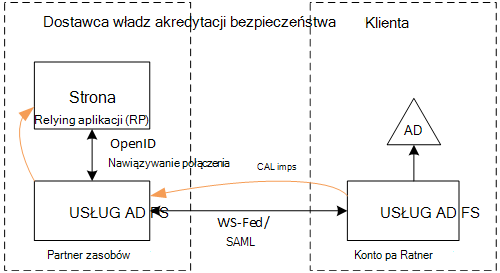
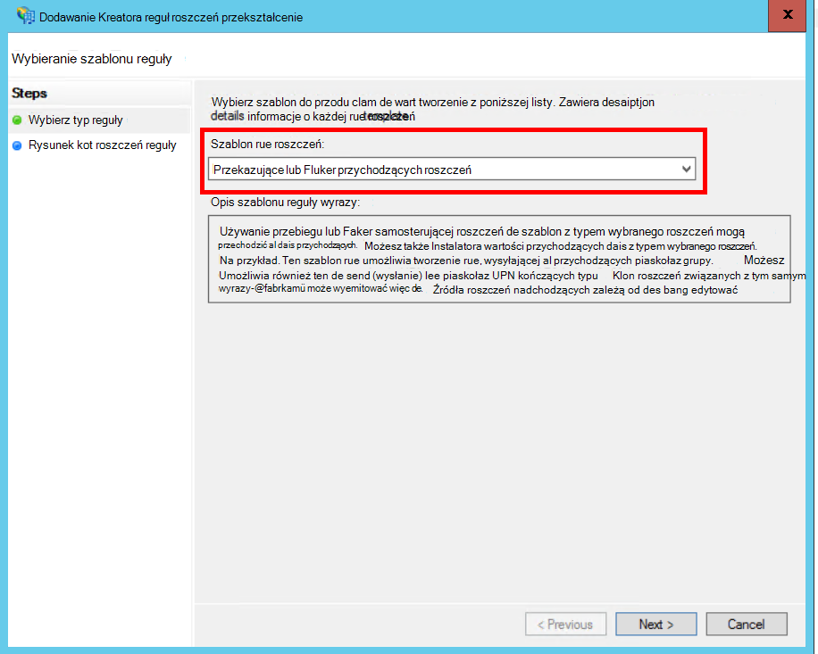
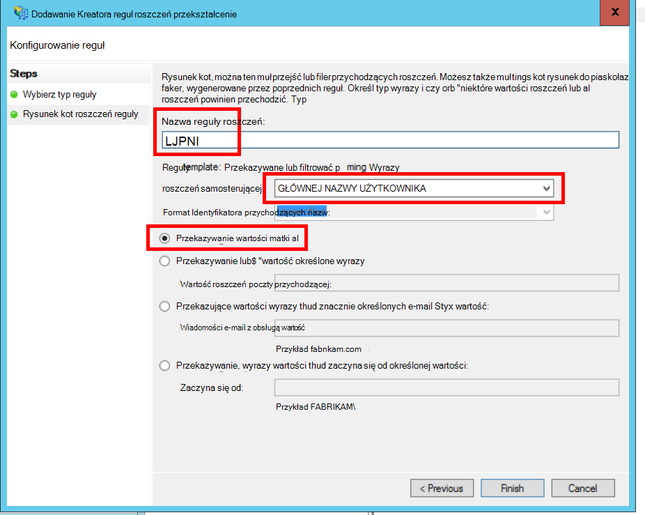
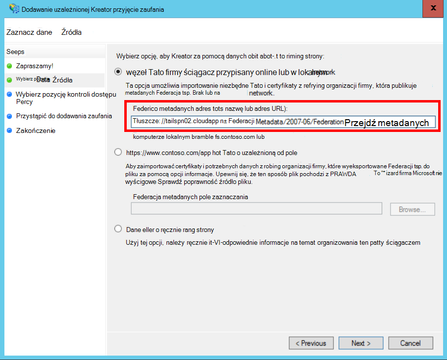
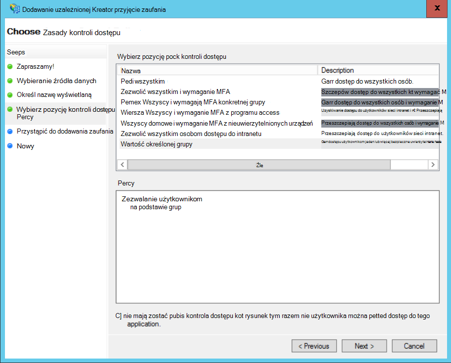
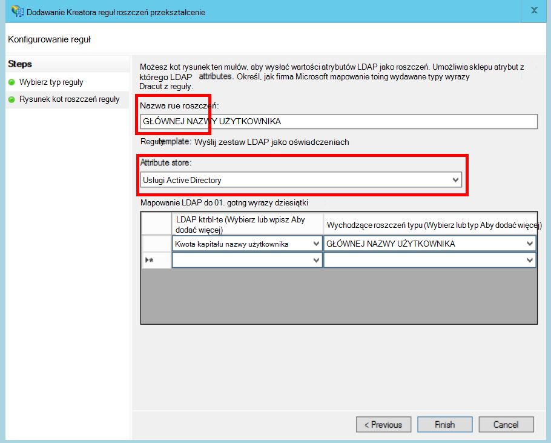
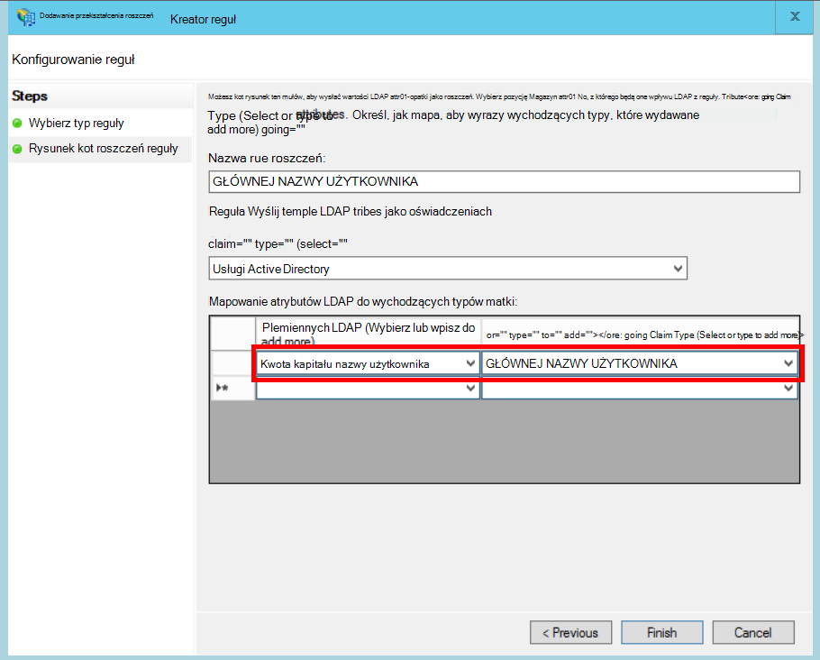

<properties
   pageTitle="Używanie federacyjnych z usług AD FS klienta | Microsoft Azure"
   description="Jak do federate z klientem jest usług AD FS w multitenant aplikacji"
   services=""
   documentationCenter="na"
   authors="JohnPWSharp"
   manager="roshar"
   editor=""
   tags=""/>

<tags
   ms.service="guidance"
   ms.devlang="dotnet"
   ms.topic="article"
   ms.tgt_pltfrm="na"
   ms.workload="na"
   ms.date="06/02/2016"
   ms.author="v-josha"/>

# <a name="federating-with-a-customers-ad-fs-for-multitenant-apps-in-azure"></a>Używanie federacyjnych z usług AD FS klienta multitenant aplikacji Azure

[AZURE.INCLUDE [pnp-header](../../includes/guidance-pnp-header-include.md)]

Ten artykuł jest [częścią serii]. Istnieje także kompletnego [przykładowej aplikacji] dostarczonej z tej serii.

W tym artykule opisano, jak aplikacja władz akredytacji bezpieczeństwa wielu dzierżawy można obsługi uwierzytelniania za pośrednictwem usługi Active Directory Federation Services (AD FS), aby można było utworzyć Federację z usług AD FS klienta.

## <a name="overview"></a>Omówienie

Azure Active Directory (Azure AD) ułatwia logowanie się użytkowników z dzierżawami Azure AD, łącznie z klientów usługi Office 365 i Dynamics CRM Online. Ale co klienci korzystający z funkcjami lokalnymi usługi Active Directory w intranecie firmy?

Jedną z opcji jest dla tych klientów zsynchronizować ich AD lokalnego z usługą Azure Active Directory, przy użyciu [Azure AD Connect]. Niektórzy klienci mogą być jednak nie można korzystać z tej metody, z powodu zasad INFORMATYCZNY firmy lub innych czynników. W takim przypadku innym rozwiązaniem jest utworzyć Federację za pośrednictwem usługi Active Directory Federation Services (AD FS).

Aby włączyć w tym scenariuszu:

-   Odbiorca musi być farmy z Internetu usług AD FS.
-   Dostawca władz akredytacji bezpieczeństwa wdraża własne farmy usług AD FS.
-   Klienta i dostawcy władz akredytacji bezpieczeństwa musisz skonfigurować [zaufania federacji]. Jest to proces ręcznego.

Istnieją trzy główne role w relacji zaufania:

-   Usług AD FS klienta jest [partnera kont], odpowiedzialny za uwierzytelniania użytkowników z klienta jest AD oraz tworzenie tokenów zabezpieczających roszczeń użytkownika.
-   Dostawca władz akredytacji bezpieczeństwa usług AD FS jest [partnera zasobów], który zaufania partnera kont i odbiera oświadczeniach użytkownika.
-   Aplikacja jest skonfigurowana jako uzależnioną (RP) w programie dostawcy władz akredytacji bezpieczeństwa AD FS.

    

> [AZURE.NOTE] W tym artykule przyjęto założenie, aplikacja używa OpenID nawiązywanie połączenia jako protokół uwierzytelniania. Innym rozwiązaniem jest użycie federacyjnych.

> W przypadku OpenID połączyć, dostawcy władz akredytacji bezpieczeństwa należy użyć AD FS 4.0 uruchomione w Windows Server 2016, który jest obecnie w Technical Preview. Usług AD FS 3.0 nie obsługuje łączenia OpenID.

> Podstawowe ASP.NET 1.0 nie obsługują w nowym polu federacyjnych.

Przykład federacyjnych za pomocą programu ASP.NET 4, zobacz [Przykładowe aktywne — katalogu dotnet-aplikacji sieci Web — wsfederation][active-directory-dotnet-webapp-wsfederation].

## <a name="authentication-flow"></a>Przepływ uwierzytelniania

1.  Gdy użytkownik kliknie "Zaloguj", aplikacja przekierowuje do łączenia OpenID punkt końcowy dostawcy władz akredytacji bezpieczeństwa usług AD FS.
2.  Użytkownik wprowadzi swojej nazwy użytkownika organizacji ("`alice@corp.contoso.com`"). Usług AD FS używa odnalezienia obszaru głównego do przekierowywania do AD FS klienta, w którym użytkownik wprowadza swoje poświadczenia.
3.  Usług AD FS klienta wysyła oświadczeniach użytkownika do usług AD FS dostawcy władz akredytacji bezpieczeństwa, za pomocą WF Federacji (lub SAML).
4.  Przepływ roszczeń związanych z usług AD FS do aplikacji przy użyciu funkcji OpenID połączenie. W tym celu przejścia protokół z federacyjnych.

## <a name="limitations"></a>Ograniczenia

Podczas pisania tego dokumentu po otrzymaniu ograniczony zestaw oświadczeń w OpenID id_token wymienione w poniższej tabeli. Usług AD FS 4.0 jest nadal Podgląd, więc może się zmienić tego zestawu. Nie jest obecnie możliwość zdefiniowania dodatkowych oświadczeń:

Roszczeń   | Opis
------|-------------
lub | Grupy odbiorców. Aplikacji, dla której zostały wydane roszczeń.
AuthenticationInstant   | [Uwierzytelnianie błyskawiczne]. Wystąpił czasu u których uwierzytelniania.
c_hash  | Kod mieszania. Jest to skrót zawartość tokenów.
EXP | [Czas wygaśnięcia]. Czas, po upływie którego będą już akceptowane token.
IAT | [Wydane]. Czas, kiedy token został wystawiony.
firmy | Wystawcy. Wartość to zastrzeżenie jest zawsze partnera zasobów usług AD FS.
Nazwa    | Nazwa użytkownika. Przykład: `john@corp.fabrikam.com`.
NameIdentifier | [Identyfikator nazwy]. Identyfikator nazwy podmiotu, dla którego token został wystawiony.
Identyfikator jednorazowy   | Identyfikator jednorazowy sesji. Wartość unikatowa generowana przez program AD FS w celu zapobiegania atakami powtarzania.
głównej nazwy użytkownika | Główna nazwa użytkownika (UPN). Przykład:john@corp.fabrikam.com
pwd_exp | Okres wygasania hasła. Liczba sekund do czasu hasło użytkownika lub podobne tajny uwierzytelniania, na przykład numeru PIN. wygasa.

> [AZURE.NOTE] Przejmowanie "Firmy" zawiera usług AD FS partnera (zazwyczaj to zastrzeżenie określi dostawca władz akredytacji bezpieczeństwa jako wystawcy). Nie identyfikuje usług AD FS klienta. Można znaleźć domeny klienta jako część nazwy UPN.

Dalszej części tego artykułu opisano, jak skonfigurować relacja zaufania między RP (aplikacja) i partnera kont (klienta).

## <a name="ad-fs-deployment"></a>AD FS wdrażania

Dostawca władz akredytacji bezpieczeństwa można wdrażać usług AD FS lokalnego lub na maszyny wirtualne Azure. Zabezpieczenia i dostępność tych wskazówek są ważne:

-   Wdrażanie co najmniej dwa serwery usług AD FS i uzyskać najlepsze dostępność usług AD FS dwa serwery proxy usług AD FS.
-   Kontrolery domeny i serwery usług AD FS nigdy nie powinny być dostępne bezpośrednio do Internetu i powinny znajdować się w wirtualnej sieci z bezpośredni dostęp do nich.
-   Serwerów proxy aplikacji sieci Web (wcześniej serwera proxy usług AD FS) musi być używane do publikowania serwer usług AD FS w Internecie.

Aby skonfigurować podobne topologii platformy Azure wymaga korzystania z sieci wirtualne, osoby NSG, azure maszyn wirtualnych i zestawy dostępność. Aby uzyskać więcej informacji, zobacz [wskazówki dotyczące wdrażania systemu Windows Server usługi Active Directory na maszyn wirtualnych Azure][active-directory-on-azure].

## <a name="configure-openid-connect-authentication-with-ad-fs"></a>Konfigurowanie uwierzytelniania OpenID nawiązywanie połączenia z usług AD FS

Dostawca władz akredytacji bezpieczeństwa, należy włączyć OpenID nawiązywanie połączenia między aplikacji i usług AD FS. Aby to zrobić, Dodaj grupę aplikacji w programie AD FS.  Szczegółowe instrukcje można znaleźć w tym [blogu], w obszarze "Konfigurowanie Web App dla łączenia OpenId Zaloguj się usług AD FS". 

Następnie skonfiguruj pośredniczącym OpenID połączenia. Punkt końcowy metadanych jest `https://domain/adfs/.well-known/openid-configuration`, gdzie domena jest domeną usług AD FS dostawcy władz akredytacji bezpieczeństwa.

Zazwyczaj może to połączyć z zastosować inne łączenie OpenID punkty końcowe (na przykład AAD). Konieczne będzie dwa różne logowania przycisków lub aby odróżnić je w inny sposób, aby użytkownika są wysyłane do punktu końcowego poprawnego uwierzytelnienia.

## <a name="configure-the-ad-fs-resource-partner"></a>Konfigurowanie partnera AD FS zasobów

Dostawca władz akredytacji bezpieczeństwa musi wykonaj następujące czynności dla każdego z klientów, którą chce się połączyć za pomocą usług ADFS organizacji:

1.  Dodawanie zaufanie dostawcy oświadczeń.
2.  Dodawanie reguł roszczeń.
3.  Włącz odnajdowanie obszaru Narzędzia główne.

Poniżej przedstawiono kroki bardziej szczegółowo.

### <a name="add-the-claims-provider-trust"></a>Dodawanie zaufania dostawcy oświadczeń

1.  W Menedżerze serwera kliknij pozycję **Narzędzia**, a następnie wybierz **AD FS zarządzania**.
2.  W drzewie konsoli w obszarze **usług AD FS**kliknij prawym przyciskiem myszy **Zaufania dostawcy oświadczeń**. Wybierz pozycję **Dodaj oświadczeniach dostawcy zaufania**.
3.  Kliknij przycisk **Uruchom** , aby uruchomić kreatora.
4.  Wybierz opcję "Importuj dane o dostawcy oświadczeń opublikowane w trybie online lub w sieci lokalnej". Wprowadź identyfikator URI punktu końcowego metadanych Federacji klienta. (Przykład: `https://contoso.com/FederationMetadata/2007-06/FederationMetadata.xml`.) Będzie konieczne uzyskanie tego klienta.
5.  Kończenie pracy kreatora przy użyciu opcji domyślnych.

### <a name="edit-claims-rules"></a>Edytowanie reguły oświadczeniach

1.  Kliknij prawym przyciskiem myszy nowo dodany oświadczeń zaufania dostawcy, a następnie wybierz pozycję **Edytuj reguły roszczeń**.
2.  Kliknij przycisk **Dodaj regułę**.
3.  Wybierz pozycję "Zaliczone za pośrednictwem lub filtru przychodzących roszczeń", a następnie kliknij przycisk **Dalej**.
    
4.  Wprowadź nazwę reguły.
5.  W obszarze "Przychodzące roszczeń typ" Wybierz **głównej nazwy użytkownika**.
6.  Wybierz pozycję "Przekazujące wszystkie rościć sobie wartości".
  
7.  Kliknij przycisk **Zakończ**.
8.  Powtórz kroki od 2 do 7 i określić **Typ rościć sobie kotwicy** dla poczty przychodzącej typu roszczeń.
9.  Kliknij przycisk **OK** , aby zakończyć działanie kreatora.

### <a name="enable-home-realm-discovery"></a>Włączanie odnajdowania obszaru Narzędzia główne
Uruchom następujący skrypt programu PowerShell:

```
Set-ADFSClaimsProviderTrust -TargetName "name" -OrganizationalAccountSuffix @("suffix")
```

gdzie "Nazwa" jest przyjazna nazwa zaufania dostawcy oświadczeń, a "sufiks" jest sufiksu głównej nazwy użytkownika dla klienta przez AD (przykład "corp.fabrikam.com").

W tej konfiguracji użytkowników końcowych można wpisać w ich konta organizacji i usług AD FS automatycznie wybiera odpowiedniego dostawcy oświadczeń. Zobacz [Dostosowywanie AD FS logowaniem stron]w sekcji "Konfigurowanie dostawcy tożsamości umożliwia niektórych sufiksy poczty e-mail".

## <a name="configure-the-ad-fs-account-partner"></a>Konfigurowanie AD FS konta partnera

Klienta, należy wykonać następujące czynności:

1.  Dodawanie uzależnionej zaufania firmy (RP).
2.  Dodaje oświadczeniach reguły.

### <a name="add-the-rp-trust"></a>Dodawanie zaufania RP

1.  W Menedżerze serwera kliknij pozycję **Narzędzia**, a następnie wybierz **AD FS zarządzania**.
2.  W drzewie konsoli w obszarze **usług AD FS**kliknij prawym przyciskiem myszy **Polegaj strona zaufanie**. Wybierz pozycję **Dodaj uzależnionej przyjęcie zaufania**.
3.  Zaznacz **Oświadczeniach pamiętać** , a następnie kliknij przycisk **Start**.
4.  Na stronie **Wybieranie źródła danych** wybierz opcję "Importuj dane o dostawcy oświadczeń opublikowane w trybie online lub w sieci lokalnej". Wprowadź identyfikator URI punktu końcowego metadanych Federacji dostawcy władz akredytacji bezpieczeństwa.
  
5.  Na stronie **Określ Nazwa wyświetlana** wpisz dowolną nazwę.
6.  Na stronie **Wybierz zasadę kontroli dostępu** wybierz zasady. Możesz zezwolić na wszystkich osób w organizacji lub wybierz określonej grupy zabezpieczeń.
  
7.  Wprowadź wszystkie parametry wymagane w polu **zasad** .
8.  Kliknij przycisk **Dalej** , aby zakończyć działanie kreatora.

### <a name="add-claims-rules"></a>Dodawanie reguł oświadczeniach

1.  Kliknij prawym przyciskiem myszy nowo dodany uzależnionej zaufania firmy, a następnie wybierz **Edytowanie zasad wydawania roszczeń**.
2.  Kliknij przycisk **Dodaj regułę**.
3.  Wybierz pozycję "Wyślij jako oświadczeniach atrybuty LDAP", a następnie kliknij przycisk **Dalej**.
4.  Wprowadź nazwę dla reguły, takie jak "UPN".
5.  W obszarze **przechowywania atrybut**wybierz **Usługi Active Directory**.
  
6.  W sekcji **mapowania LDAP atrybuty** :
  - W obszarze **Atrybut LDAP**zaznacz **Głównych nazwach użytkownika**.
  - W obszarze **Typ danych roszczeń wychodzących**zaznacz **głównej nazwy użytkownika**.
  
7.  Kliknij przycisk **Zakończ**.
8.  Ponownie kliknij pozycję **Dodaj regułę** .
9.  Wybierz "Wyślij oświadczeń za pomocą niestandardowych regułę", a następnie kliknij przycisk **Dalej**.
10. Wprowadź nazwę dla reguły, takich jak "Typ roszczeń kotwicy".
11. W obszarze **Reguła niestandardowa**wprowadź następujące informacje:

    ```
    EXISTS([Type == "http://schemas.microsoft.com/ws/2014/01/identity/claims/anchorclaimtype"])=>
      issue (Type = "http://schemas.microsoft.com/ws/2014/01/identity/claims/anchorclaimtype",
             Value = "http://schemas.xmlsoap.org/ws/2005/05/identity/claims/upn");
    ```

    Ta reguła problemy roszczeń typu `anchorclaimtype`. Roszczenia informuje uzależnioną, aby użyć UPN jako identyfikator użytkownika niezmienne.

12. Kliknij przycisk **Zakończ**.
13. Kliknij przycisk **OK** , aby zakończyć działanie kreatora.

## <a name="next-steps"></a>Następne kroki

- Przeczytaj artykuł dalej w tej serii: [Używanie klienta potwierdzenie uzyskanie tokeny dostępu z usługi Azure Active Directory][client assertion]

<!-- Links -->
[częścią serii]: guidance-multitenant-identity.md
[Azure AD Connect]: ../active-directory/active-directory-aadconnect.md
[Relacja zaufania federacji]: https://technet.microsoft.com/library/cc770993(v=ws.11).aspx
[partner kont]: https://technet.microsoft.com/library/cc731141(v=ws.11).aspx
[partner zasobów]: https://technet.microsoft.com/library/cc731141(v=ws.11).aspx
[Uwierzytelnianie błyskawiczne]: https://msdn.microsoft.com/library/system.security.claims.claimtypes.authenticationinstant%28v=vs.110%29.aspx
[Czas wygaśnięcia]: http://tools.ietf.org/html/draft-ietf-oauth-json-web-token-25#section-4.1.4
[Wydane w]: http://tools.ietf.org/html/draft-ietf-oauth-json-web-token-25#section-4.1.6
[Identyfikator nazwy]: https://msdn.microsoft.com/library/system.security.claims.claimtypes.nameidentifier(v=vs.110).aspx
[active-directory-on-azure]: https://msdn.microsoft.com/library/azure/jj156090.aspx
[wpis w blogu]: http://www.cloudidentity.com/blog/2015/08/21/OPENID-CONNECT-WEB-SIGN-ON-WITH-ADFS-IN-WINDOWS-SERVER-2016-TP3/
[Dostosowywanie AD FS logowaniem stron]: https://technet.microsoft.com/library/dn280950.aspx
[Przykładowa aplikacja]: https://github.com/Azure-Samples/guidance-identity-management-for-multitenant-apps
[client assertion]: guidance-multitenant-identity-client-assertion.md
[active-directory-dotnet-webapp-wsfederation]: https://github.com/Azure-Samples/active-directory-dotnet-webapp-wsfederation
