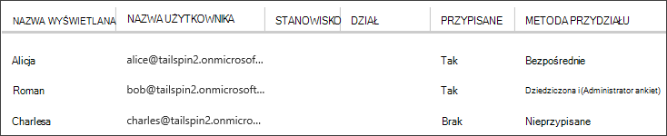

<properties
   pageTitle="Role aplikacji | Microsoft Azure"
   description="Jak przeprowadzić autoryzacji za pośrednictwem ról aplikacji"
   services=""
   documentationCenter="na"
   authors="MikeWasson"
   manager="roshar"
   editor=""
   tags=""/>

<tags
   ms.service="guidance"
   ms.devlang="dotnet"
   ms.topic="article"
   ms.tgt_pltfrm="na"
   ms.workload="na"
   ms.date="02/16/2016"
   ms.author="mwasson"/>

#  <a name="application-roles-in-multitenant-applications"></a>Role aplikacji w aplikacjach multitenant

[AZURE.INCLUDE [pnp-header](../../includes/guidance-pnp-header-include.md)]

Ten artykuł jest [częścią serii]. Istnieje także kompletnego [przykładowej aplikacji] dostarczonej z tej serii.

Role aplikacji są używane do przypisywania uprawnień użytkownikom. Na przykład [Firma ankiet] [ Tailspin] definiuje aplikacja następujących ról:

- Administrator. Można wykonywać wszystkie operacje OBSŁUGIWAŁ na dowolny ankiety, należący do tej dzierżawy.
- Kreator. Można tworzyć nowe ankiety.
- Czytnik. Można przeczytać wszelkie ankiety, które należą do tej dzierżawy.

Widać, że role ostatecznie uzyskać przekształcić uprawnienia podczas [autoryzacji]. Ale pierwszego pytania dotyczące przypisywania i zarządzanie rolami. Firma Microsoft uznawane trzy główne opcje:

-   [Role aplikacji w usłudze Azure AD](#roles-using-azure-ad-app-roles)
-   [Grupy zabezpieczeń w usłudze Azure AD](#roles-using-azure-ad-security-groups)
-   [Menedżer ról aplikacji](#roles-using-an-application-role-manager).

## <a name="roles-using-azure-ad-app-roles"></a>Role przy użyciu Azure AD aplikacji ról

Jest to metoda używany w aplikacji firma ankiety.

W tej metody dostawca władz akredytacji bezpieczeństwa definiuje ról aplikacji, dodając je do manifest aplikacji. Po zarejestrowaniu klienta, administrator usługi katalogowej AD klienta przypisuje role użytkowników. Gdy użytkownik zaloguje się, przypisanych ról użytkownika są wysyłane jako oświadczeń.

> [AZURE.NOTE] Jeśli odbiorca ma Azure AD Premium, administrator może przypisać grupy zabezpieczeń, a członkowie grupy będzie dziedziczyć roli aplikacji. To wygodny sposób, aby zarządzać rolami, ponieważ nie musi być administratorem AD właściciela grupy

Zalety tej metody:

-   Prosty model programowania.
-   Role są specyficzne dla aplikacji. Roszczeń roli dla jednej aplikacji nie są wysyłane do innej aplikacji.
-   Jeśli odbiorca usuwa aplikację z ich dzierżawy AD, ról przejdź z dala od komputera.
-   Aplikacja nie wymaga żadnych dodatkowych uprawnień usługi Active Directory, niż odczytu profilu użytkownika.

Wady:

- Klientów, którzy nie Azure AD Premium nie można przypisywać role grupy zabezpieczeń. W przypadku tych klientów wszystkich przydziałów użytkownika musi odbywać się przez administratora AD.
- Jeśli masz wewnętrznej bazy danych sieci web interfejsu API, który różni się od aplikacji sieci web, przypisania roli dla aplikacji sieci web nie stosuj się do interfejsu API sieci web. Aby poznać tego punktu zobacz [Zabezpieczanie wewnętrznej bazie danych sieci web interfejsu API].

### <a name="implementation"></a>Implementacja

**Definiowanie ról.** Dostawca władz akredytacji bezpieczeństwa deklaruje ról aplikacji w [aplikacji pojawiają]. Na przykład Oto manifestu wpisu aplikacji ankiet:

```
"appRoles": [
  {
    "allowedMemberTypes": [
      "User"
    ],
    "description": "Creators can create Surveys",
    "displayName": "SurveyCreator",
    "id": "1b4f816e-5eaf-48b9-8613-7923830595ad",
    "isEnabled": true,
    "value": "SurveyCreator"
  },
  {
    "allowedMemberTypes": [
      "User"
    ],
    "description": "Administrators can manage the Surveys in their tenant",
    "displayName": "SurveyAdmin",
    "id": "c20e145e-5459-4a6c-a074-b942bbd4cfe1",
    "isEnabled": true,
    "value": "SurveyAdmin"
  }
],
```

`value` Pojawi się ona w roszczeń roli. `id` Właściwość jest unikatowy identyfikator zdefiniowanej roli. Zawsze wygenerować nową wartość identyfikator GUID `id`.

**Przypisywanie użytkowników**. Po zarejestrowaniu nowym klientem, aplikacja jest zarejestrowany w dzierżawie AD klienta. W tym momencie AD administrator dzierżawy można przypisywać użytkowników do roli.

> [AZURE.NOTE] Jak wspomniano wcześniej, klienci z Azure AD Premium można również przypisywać grupy zabezpieczeń do ról.

Następujące zrzut ekranu z poziomu portalu Azure przedstawiono trzy. Alicja został przypisany bezpośrednio do roli. Roman dziedziczone roli jako członek grupy zabezpieczeń o nazwie "Administrator ankiet", który jest przypisany do roli. Charlesa nie jest przypisana do dowolnej roli.



> [AZURE.NOTE] Możesz też aplikacji może przypisywać role programistycznie, za pomocą interfejsu API Azure AD wykresu.  Jednak wymaga to aplikacji, aby uzyskać uprawnienia do zapisu katalogu AD klienta. Aplikacja z tymi uprawnieniami może wykonać wiele i szkodliwych działań &mdash; klienta jest zaufanie aplikacji nie chcesz, aby mess ich katalogu. Wielu klientów może być nie chcesz udzielić ten poziom dostępu.

**Uzyskiwanie oświadczeń roli**. Gdy użytkownik zaloguje się, po otrzymaniu użytkownika przypisanych ról w roszczeń typu `http://schemas.microsoft.com/ws/2008/06/identity/claims/role`.  

Użytkownik może mieć wiele ról lub Brak roli. W kodzie autoryzacji nie przyjęto założenie, że użytkownik ma dokładnie jedna rola rościć sobie. Zamiast tego wpisz kod, który sprawdza, czy znajduje się wartość określonego roszczeń:

```csharp
if (context.User.HasClaim(ClaimTypes.Role, "Admin")) { ... }
```

## <a name="roles-using-azure-ad-security-groups"></a>Role przy użyciu grup zabezpieczeń Azure AD

W tej metody role są przedstawiane jako AD grupy zabezpieczeń. Aplikacja przypisywanie uprawnień użytkownikom według ich przynależność do grupy zabezpieczeń.

Zalety:

-   W przypadku klientów, którzy nie mają Azure AD Premium ta metoda umożliwia klientowi Zarządzanie przypisania ról przy użyciu grup zabezpieczeń.

Wady:

- Złożoność. Ponieważ każdy dzierżawy wysyła oświadczeniach innej grupy, aplikacji należy zachować informacje o odpowiadające grupy zabezpieczeń do ról aplikacji, dla każdego dzierżawy.
- Jeśli odbiorca usuwa aplikację z ich dzierżawy AD, grupy zabezpieczeń pozostają w katalogu ich AD.

### <a name="implementation"></a>Implementacja

W aplikacji oczywiste, ustaw `groupMembershipClaims` właściwości "SecurityGroup". Jest to potrzebne uzyskiwania oświadczeń członkostwa grupy z AAD.

```
{
   // ...
   "groupMembershipClaims": "SecurityGroup",
}
```

Po zarejestrowaniu nowym klientem, aplikacja powoduje, że klienta do tworzenia grup zabezpieczeń dla ról potrzebne aplikacji. Następnie klienta należy wprowadzić obiektu grupy identyfikatorów do aplikacji. Aplikacja przechowuje w tabeli, która mapy identyfikatory grup do ról aplikacji na dzierżawcę.

> [AZURE.NOTE] Możesz też aplikacji można utworzyć grupy programistycznie, za pomocą interfejsu API Azure AD wykresu.  Będzie mniej podatne błędu. Jednak wymaga aplikacji w celu uzyskania "odczytywanie i zapisywanie wszystkich grup" uprawnień do katalogu AD klienta. Wielu klientów może być nie chcesz udzielić ten poziom dostępu.

Gdy użytkownik rejestruje:

1.  Po otrzymaniu grup użytkowników jako roszczeń. Wartość każdego roszczenia jest identyfikator obiektu grupy.
2.  Azure AD ogranicza liczbę grup wysłane w tokenu. Jeśli liczba grup przekracza ten limit, Azure AD wysyła specjalne zastrzeżenie "nadmiarowych". Jeśli ma opinia ta aplikacja musi kwerendę interfejsu API Azure AD wykres do wszystkich grup, do których użytkownik należy. Aby uzyskać szczegółowe informacje Zobacz [autoryzacji w chmurze aplikacji przy użyciu grup AD] w obszarze do sekcji "Grup rościć sobie nadmiar".
3.  Aplikacja wyszukuje identyfikatory obiektów na własną bazę danych, aby znaleźć odpowiednie role aplikacji, które chcesz przypisać do użytkownika.
4.  Aplikacja dodaje wartość roszczeń niestandardowych do główna użytkownika, który wyraża rolę aplikacji. Na przykład: `survey_role` = "SurveyAdmin".

Zasady autoryzacji należy używać roszczeń rolę niestandardową rościć sobie nie do grupy.

## <a name="roles-using-an-application-role-manager"></a>Role za pomocą Menedżera roli aplikacji

Z tej metody ról aplikacji nie są przechowywane w Azure AD wcale. Zamiast tego aplikacja przechowuje przypisania roli dla każdego użytkownika w osobnym DB &mdash; na przykład za pomocą klasy **RoleManager** w tożsamości ASP.NET.

Zalety:

-   Aplikacja ma pełną kontrolę nad ról i przypisania użytkowników.

Wady:

- Bardziej złożone, trudniej Obsługa.
- Nie można używać grup zabezpieczeń AD do zarządzania przypisaniami ról.
- Informacje o użytkowniku przechowywanych w bazie danych aplikacji, w którym może nastąpić zsynchronizowany z katalogu AD dzierżawy, podczas dodawania lub usuwania użytkowników.   

Istnieje wiele przykładów istniejących dla tej metody. Na przykład zobacz [Tworzenie aplikacji programu ASP.NET MVC z auth i bazy danych SQL i wdrażanie usługi aplikacji Azure].

## <a name="next-steps"></a>Następne kroki

- Przeczytaj artykuł dalej w tej serii: [oparta na rolach i opartych na zasobach autoryzacji w aplikacjach multitenant][autoryzacji]

<!-- Links -->
[Tailspin]: guidance-multitenant-identity-tailspin.md
[częścią serii]: guidance-multitenant-identity.md
[Autoryzacja]: guidance-multitenant-identity-authorize.md
[Zabezpieczanie wewnętrznej bazy danych interfejsu API sieci web]: guidance-multitenant-identity-web-api.md
[Tworzenie aplikacji programu ASP.NET MVC z auth i bazy danych SQL i wdrażanie Azure aplikacji usługi]: ../app-service-web/web-sites-dotnet-deploy-aspnet-mvc-app-membership-oauth-sql-database.md
[manifest aplikacji]: ../active-directory/active-directory-application-manifest.md
[Przykładowa aplikacja]: https://github.com/Azure-Samples/guidance-identity-management-for-multitenant-apps
