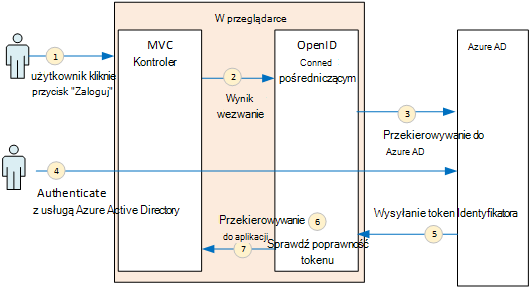
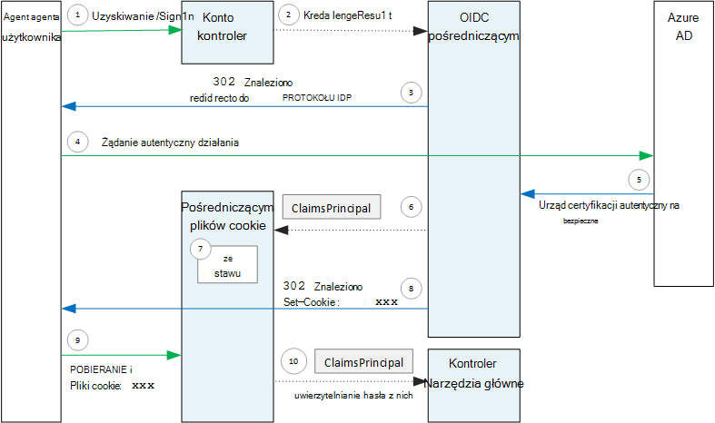

<properties
   pageTitle="Uwierzytelnianie w aplikacjach multitenant | Microsoft Azure"
   description="Jak multitenant aplikacji może przeprowadzać uwierzytelnianie użytkowników z usługi Azure Active Directory"
   services=""
   documentationCenter="na"
   authors="MikeWasson"
   manager="roshar"
   editor=""
   tags=""/>

<tags
   ms.service="guidance"
   ms.devlang="dotnet"
   ms.topic="article"
   ms.tgt_pltfrm="na"
   ms.workload="na"
   ms.date="05/23/2016"
   ms.author="mwasson"/>

# <a name="authentication-in-multitenant-apps-using-azure-ad-and-openid-connect"></a>Uwierzytelnianie w multitenant aplikacji, za pomocą Azure AD i łączenie OpenID

[AZURE.INCLUDE [pnp-header](../../includes/guidance-pnp-header-include.md)]

Ten artykuł jest [częścią serii](guidance-multitenant-identity.md). Istnieje także kompletnego [przykładowej aplikacji] dostarczonej z tej serii.

W tym artykule opisano, jak multitenant aplikacji może przeprowadzać uwierzytelnianie użytkowników z usługi Azure Active Directory (Azure AD), służą do uwierzytelniania za pomocą połączenia OpenID (OIDC).

## <a name="overview"></a>Omówienie

Nasze [implementacji](guidance-multitenant-identity-tailspin.md) to aplikacja ASP.NET Core 1.0. Aplikacja używa wbudowanych pośredniczącym łączenie OpenID do wykonywania OIDC przepływ uwierzytelniania. Na poniższym diagramie pokazano, co się dzieje, gdy użytkownik zaloguje, na wysokim poziomie.



1.  Użytkownik kliknie przycisk "Zaloguj" w aplikacji. Ta akcja jest obsługiwany przez kontroler MVC.
2.  Kontroler MVC zwraca akcję **ChallengeResult** .
3.  Pośredniczącym przechwytuje **ChallengeResult** i tworzy 302 odpowiedzi, która przekierowuje użytkownika na stronę logowania Azure AD.
4.  Użytkownik uwierzytelnia z usługą Azure Active Directory.
5.  Azure AD wysyła token identyfikator aplikacji.
6.  Pośredniczącym sprawdza token Identyfikatora. W tym momencie użytkownik jest teraz uwierzytelniony wewnątrz aplikacji.
7.  Pośredniczącym przekierowuje użytkownika do aplikacji.

## <a name="register-the-app-with-azure-ad"></a>Zarejestruj się w aplikacji z usługą Azure Active Directory

Aby połączyć OpenID, dostawca władz akredytacji bezpieczeństwa rejestruje aplikacji wewnątrz własne dzierżawy Azure AD.

Aby zarejestrować aplikacji, wykonaj czynności opisane w [Integracji aplikacji z usługą Azure Active Directory](../active-directory/active-directory-integrating-applications.md), w sekcji [Dodawanie aplikacji](../active-directory/active-directory-integrating-applications.md#adding-an-application).

Na stronie **Konfigurowanie** :

-   Zanotuj identyfikator klienta.
-   W obszarze **aplikacja jest wiele dzierżawy**wybierz opcję **Tak**.
-   Ustawić **Adres URL odpowiedź** do adresu URL, w którym Azure AD wyśle odpowiedź uwierzytelniania. Możesz użyć podstawowy adres URL aplikacji.
  - Uwaga: Ścieżka adresu URL może obejmować wszystko, jak nazwa hosta odpowiada wdrożonej aplikacji.
  - Można ustawić wiele odpowiedzi adresów URL. Podczas opracowywania, możesz użyć `localhost` adresu, uruchomionej aplikacji na komputerze lokalnym.
-   Generowanie tajny klienta: **klawiszy**, kliknij menu rozwijane który mówi **Wybierz czas trwania** i wybierz lata 1 lub 2. Klucz będą widoczne po kliknięciu przycisku **Zapisz**. Pamiętaj skopiować wartość, ponieważ go nie jest wyświetlana ponownie po ponownym ładowaniu strony konfiguracji.

## <a name="configure-the-auth-middleware"></a>Konfigurowanie uwierzytelniania pośredniczącym

W tej sekcji opisano sposób konfigurowania pośredniczącym uwierzytelniania w ASP.NET Core 1.0 multitenant do uwierzytelniania przy użyciu połączenia OpenID.

W swojej klasy uruchamiania Dodaj pośredniczącym OpenID połączenia:

```csharp
app.UseOpenIdConnectAuthentication(options =>
{
    options.AutomaticAuthenticate = true;
    options.AutomaticChallenge = true;
    options.ClientId = [client ID];
    options.Authority = "https://login.microsoftonline.com/common/";
    options.CallbackPath = [callback path];
    options.PostLogoutRedirectUri = [application URI];
    options.SignInScheme = CookieAuthenticationDefaults.AuthenticationScheme;
    options.TokenValidationParameters = new TokenValidationParameters
    {
        ValidateIssuer = false
    };
    options.Events = [event callbacks];
});
```

> [AZURE.NOTE] Zobacz [Startup.cs](https://github.com/Azure-Samples/guidance-identity-management-for-multitenant-apps/blob/master/src/Tailspin.Surveys.Web/Startup.cs).

Aby uzyskać więcej informacji dotyczących klasy uruchamiania zobacz [Uruchamiania aplikacji](https://docs.asp.net/en/latest/fundamentals/startup.html) w dokumentacji programu ASP.NET Core 1.0.

Ustaw następujące opcje pośredniczącym:

- **ClientId**. Identyfikator klienta aplikacji, której masz podczas rejestrowania aplikacji w Azure AD.
- **Urząd**. W przypadku multitenant aplikacji można ustawić `https://login.microsoftonline.com/common/`. Jest to adres URL Azure AD typowych końcowy, co pozwala użytkownikom z dowolnej dzierżawy Azure AD, aby się zalogować. Aby uzyskać więcej informacji o typowych punktu końcowego zobacz [Ten wpis w blogu](http://www.cloudidentity.com/blog/2014/08/26/the-common-endpoint-walks-like-a-tenant-talks-like-a-tenant-but-is-not-a-tenant/).
- W **TokenValidationParameters**ustaw **ValidateIssuer** ma wartość FAŁSZ. Oznacza to, że aplikacja będzie odpowiedzialne za zatwierdzanie wartość wystawcy token Identyfikatora. (Pośredniczącym nadal sprawdza się token). Aby uzyskać więcej informacji na temat sprawdzania poprawności wystawcy zobacz [wystawcy sprawdzania poprawności](guidance-multitenant-identity-claims.md#issuer-validation).
- **CallbackPath**. Ustaw to ścieżkę w adresie URL odpowiedzi, które zarejestrowane w Azure AD. Na przykład, jeśli jest używany adres URL odpowiedź `http://contoso.com/aadsignin`, należy **CallbackPath** `aadsignin`. Jeśli nie ustawisz tę opcję, wartością domyślną jest `signin-oidc`.
- **PostLogoutRedirectUri**. Określ adres URL do przekierowywania użytkowników po zalogowaniu się. Należy to strona, która umożliwia anonimowe żądania &mdash; zwykle strony głównej.
- **SignInScheme**. Można ustawić `CookieAuthenticationDefaults.AuthenticationScheme`. To ustawienie oznacza, że po uwierzytelnieniu użytkownika oświadczeniach użytkownika są przechowywane lokalnie w pliku cookie. Ten plik cookie jest, jak użytkownik pozostaje zarejestrowane w trakcie sesji przeglądarki.
- **Zdarzenia.** Zwrotne wydarzenia; zobacz [zdarzenia uwierzytelniania](#authentication-events).

Proces również dodać pośredniczącym uwierzytelniania plików Cookie. Ten pośredniczącym jest odpowiedzialny za pisania oświadczeniach użytkownika do pliku cookie, a następnie odczytanie cookie podczas ładowaniu kolejnych stron.

```csharp
app.UseCookieAuthentication(options =>
{
    options.AutomaticAuthenticate = true;
    options.AutomaticChallenge = true;
    options.AccessDeniedPath = "/Home/Forbidden";
});
```

## <a name="initiate-the-authentication-flow"></a>Inicjowanie przepływ uwierzytelniania

Aby uruchomić przepływ uwierzytelniania w ASP.NET MVC, zwracać **ChallengeResult** z sterownika:

```csharp
[AllowAnonymous]
public IActionResult SignIn()
{
    return new ChallengeResult(
        OpenIdConnectDefaults.AuthenticationScheme,
        new AuthenticationProperties
        {
            IsPersistent = true,
            RedirectUri = Url.Action("SignInCallback", "Account")
        });
}
```

Ta opcja powoduje pośredniczącym zwraca 302 odpowiedzi (odnalezione), który przekierowuje do punktu końcowego uwierzytelniania.

## <a name="user-login-sessions"></a>Sesje logowania użytkownika

Jak wspomniano, gdy użytkownik pierwsze znaki w pośredniczącym plików Cookie uwierzytelniania zapisuje oświadczeniach użytkownika do pliku cookie. Po wykonaniu tej żądania HTTP są uwierzytelnianie, czytając cookie.

Domyślnie pośredniczącym plików cookie zapisuje [cookie sesji][session-cookie], która pobiera usunięty raz zamyka przeglądarkę. Podczas następnego użytkownika dalej odwiedzić witrynę, należy je ponownie zaloguj się. Jednak jeśli **IsPersistent** jest ustawiona na Prawda w **ChallengeResult**, pośredniczącym zapisuje trwałych plików cookie, aby użytkownik pozostanie zalogowany po zamknięciu przeglądarki. Możesz skonfigurować wygasania plików cookie; zobacz [Opcje plików cookie kontrolowanie][cookie-options]. Trwałe pliki cookie są wygodniejsze dla użytkownika, ale może być niewłaściwe dla niektórych aplikacji (Powiedz, metody), w którym chcesz użytkownika do zalogowania się zawsze.

## <a name="about-the-openid-connect-middleware"></a>Informacje o pośredniczącym OpenID nawiązywanie połączenia

Łączenie OpenID pośredniczącym w programie ASP.NET ukrywa najczęściej szczegóły Protocol (protokół). Ta sekcja zawiera kilka uwag dotyczących wykonania, które mogą być przydatne dla zrozumienia przepływu Protocol (protokół).

Najpierw Przeanalizujmy przepływ uwierzytelniania za pomocą programu ASP.NET (ignoruje szczegóły przepływu protokół OIDC między aplikacji i Azure AD). Na poniższym diagramie przedstawiono proces.



W tym diagramie istnieją dwa kontrolery MVC. Kontroler konto obsługuje żądania zalogowania, a główne kontroler w górę strony głównej.

Oto proces uwierzytelniania:

1. Użytkownik kliknie przycisk "Zaloguj", a przeglądarka wysyła żądania GET. Na przykład: `GET /Account/SignIn/`.
2. Zwraca kontroler konta `ChallengeResult`.
3. Pośredniczącym OIDC zwraca odpowiedź HTTP 302, przekierowywanie do Azure AD.
4. Przeglądarka przesyła żądanie uwierzytelnienia do Azure AD
5. Użytkownik rejestruje się Azure AD i Azure AD odsyła odpowiedź uwierzytelniania.
6. Pośredniczącym OIDC tworzy kapitału oświadczeniach i przekazuje je do pośredniczącym uwierzytelniania plików Cookie.
7. Pośredniczącym plików cookie serializes kapitału oświadczeniach i zestawów plików cookie.
8. Pośredniczącym OIDC przekierowuje do adresu URL zwrotnego aplikacji.
10. Przekieruj, wysyłanie plików cookie w wezwaniu na są uwzględniane w przeglądarce.
11. Pośredniczącym plików cookie deserializes plików cookie roszczeń kapitału i zestawy `HttpContext.User` równe kapitału roszczeń. Wniosek jest kierowane do kontrolera MVC.

### <a name="authentication-ticket"></a>Uwierzytelnianie biletów

Po pomyślnym zakończeniu uwierzytelniania pośredniczącym OIDC tworzy biletów uwierzytelniania, zawierający podmiotu roszczeń, który zawiera oświadczeniach użytkownika. Można korzystać z kart wewnątrz zdarzenia **AuthenticationValidated** lub **TicketReceived** .

> [AZURE.NOTE] Zakończenia przepływ uwierzytelniania całego `HttpContext.User` nadal zawiera anonimowe kapitału, _nie_ uwierzytelnionego użytkownika. Anonimowe podmiot ma zbiór oświadczeniach puste. Po zakończeniu uwierzytelniania i deserializes pośredniczącym plików cookie przekierowania aplikacji cookie uwierzytelniania i zestawy `HttpContext.User` podstawowego oświadczeniach reprezentujący uwierzytelnionego użytkownika.

### <a name="authentication-events"></a>Zdarzenia uwierzytelniania

Podczas procesu uwierzytelniania pośredniczącym łączenie OpenID zgłasza serię zdarzeń:

- **RedirectToAuthenticationEndpoint**. Wywołane bezpośrednio przed pośredniczącym przekierowuje do punktu końcowego uwierzytelniania. Zdarzenia tego można użyć, aby zmodyfikować adres URL przekierowania; na przykład, aby dodać parametry wezwanie. Na przykład, zobacz [Dodawanie wiersza zgody administratora](guidance-multitenant-identity-signup.md#adding-the-admin-consent-prompt) .

- **AuthorizationResponseReceived**. O nazwie po pośredniczącym odpowiedzi uwierzytelniania od dostawcy tożsamości (protokołu IDP), ale przed pośredniczącym sprawdza odpowiedź.  

- **AuthorizationCodeReceived**. O nazwie kodu autoryzacji.

- **TokenResponseReceived**. Wywoływane po pośredniczącym pobiera dostępu token z protokołu IDP. Dotyczy tylko przepływ kodu autoryzacji.

- **AuthenticationValidated**. Wywoływane po pośredniczącym sprawdza token Identyfikatora. W tym momencie aplikacja ma zestaw sprawdzanej oświadczeń o użytkowniku. Zdarzenia tego można użyć w celu sprawdzenia poprawności dodatkowe na oświadczeniach lub przekształcanie roszczeń. Zobacz [Praca z roszczeń](guidance-multitenant-identity-claims.md).

- **UserInformationReceived**. O nazwie, jeśli pośredniczącym pobiera profil użytkownika z użytkownika końcowego informacje. Dotyczy tylko przepływ kod autoryzacji i tylko wtedy, gdy `GetClaimsFromUserInfoEndpoint = true` w opcjach pośredniczącym.

- **TicketReceived**. O nazwie po zakończeniu uwierzytelniania. To jest ostatnie zdarzenie, przy założeniu, że że uwierzytelnianie zakończyło się powodzeniem. Gdy to zdarzenie jest obsługiwana, dany użytkownik jest zalogowany do aplikacji.

- **AuthenticationFailed**. O nazwie, jeśli uwierzytelnianie nie powiedzie się. Za pomocą tego zdarzenia obsługi błędów uwierzytelniania &mdash; na przykład przez przekierowanie do strony o błędzie.

Aby zapewnić zwrotne dla tych zdarzeń, ustaw dla opcji **wydarzeń** na pośredniczącym. Istnieją dwa różne sposoby, aby zadeklarować obsługi zdarzeń: w tekście z lambdas lub klasy, który pochodzi od **OpenIdConnectEvents**.

Równo z lambdas:

```csharp
app.UseOpenIdConnectAuthentication(options =>
{
    // Other options not shown.

    options.Events = new OpenIdConnectEvents
    {
        OnTicketReceived = (context) =>
        {
             // Handle event
             return Task.FromResult(0);
        },
        // other events
    }
});
```

Wynikających z **OpenIdConnectEvents**:

```csharp
public class SurveyAuthenticationEvents : OpenIdConnectEvents
{
    public override Task TicketReceived(TicketReceivedContext context)
    {
        // Handle event
        return base.TicketReceived(context);
    }
    // other events
}

// In Startup.cs:
app.UseOpenIdConnectAuthentication(options =>
{
    // Other options not shown.

    options.Events = new SurveyAuthenticationEvents();
});
```

Druga metoda jest zalecane, jeśli usługi zwrotne wydarzenie ma dowolną znacznych logiczny, więc nie folderu mało istotne swojej klasy uruchamiania. Nasze implementacji używa tej metody; zobacz [SurveyAuthenticationEvents.cs](https://github.com/Azure-Samples/guidance-identity-management-for-multitenant-apps/blob/master/src/Tailspin.Surveys.Web/Security/SurveyAuthenticationEvents.cs).

### <a name="openid-connect-endpoints"></a>OpenID łączenie punktów końcowych

Azure AD obsługuje [OpenID łączenie odnajdowanie](https://openid.net/specs/openid-connect-discovery-1_0.html), którym dostawcy tożsamości (protokołu IDP) zwraca dokument metadanych JSON z [znanego punktu końcowego](https://openid.net/specs/openid-connect-discovery-1_0.html#ProviderConfig). Dokument metadanych zawiera informacje, takie jak:

-   Adres URL punktu końcowego autoryzacji. Jest to miejsce, w którym aplikacji przekierowuje do uwierzytelnienia użytkownika.
-   Adres URL punktu końcowego "zakończenie sesji", gdzie aplikacji przejście do wylogowania użytkownika.
-   Adres URL uzyskanie klucze podpisywania, które klient używa do sprawdzania poprawności tokeny OIDC staje się z protokołu IDP.

Domyślnie pośredniczącym OIDC wie, jak pobrać metadanych. Ustawianie opcji **urząd** w pośredniczącym, oraz pośredniczącym konstrukcji adres URL metadanych. (Przez ustawienie opcji **MetadataAddress** można zastąpić adres URL metadanych).

### <a name="openid-connect-flows"></a>Łączenie OpenID przepływów

Domyślnie pośredniczącym OIDC używa przepływu hybrydowych w trybie odpowiedź na wpis formularza.

-   _Przepływ hybrydowych_ oznacza, że klient może uzyskać dostęp token identyfikator i Kod autoryzacji w tym samym przesyłania danych na serwerze autoryzacji.
-   _Formularz opublikować tryb odpowiedź_ oznacza, że serwer autoryzacji używa żądanie HTTP POST do wysłania kod identyfikacyjny token i autoryzacji do aplikacji. Wartości są urlencoded formularza (typ zawartości = "aplikacji x--www-form-urlencoded").

Adres URL przekierowania pośredniczącym OIDC przekierowuje do punktu końcowego autoryzacji, zawiera wszystkie parametry ciągu kwerendy, które są wymagane przez OIDC. Dla przepływu hybrydowych:

-   client_id. Ta wartość jest ustawiona w opcji **ClientId**
-   zakres = "openid profil", oznacza, że jest żądaniem OIDC i chcemy profilu użytkownika.
-   response_type = "Kod id_token". To ustawienie określa przepływu hybrydowych.
-   response_mode = "form_post". Określa formularz odpowiedzi wpisu.

Aby określić inny przepływ, należy ustawić właściwość **ResponseType** na odpowiednie opcje. Na przykład:

```csharp
app.UseOpenIdConnectAuthentication(options =>
{
    options.ResponseType = "code"; // Authorization code flow

    // Other options
}
```

## <a name="next-steps"></a>Następne kroki

- Przeczytaj artykuł dalej w tej serii: [Praca z opartych na oświadczeniach tożsamości w aplikacjach multitenant][claims]


[claims]: guidance-multitenant-identity-claims.md
[cookie-options]: https://docs.asp.net/en/latest/security/authentication/cookie.html#controlling-cookie-options
[session-cookie]: https://en.wikipedia.org/wiki/HTTP_cookie#Session_cookie
[Przykładowa aplikacja]: https://github.com/Azure-Samples/guidance-identity-management-for-multitenant-apps
