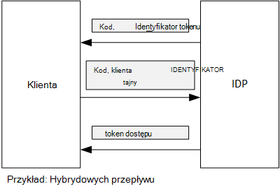

<properties
   pageTitle="Pobieranie tokeny dostępu z Azure AD przy użyciu klienta potwierdzenia | Microsoft Azure"
   description="Jak uzyskać tokeny dostępu z Azure AD przy użyciu klienta potwierdzenia."
   services=""
   documentationCenter="na"
   authors="MikeWasson"
   manager="roshar"
   editor=""
   tags=""/>

<tags
   ms.service="guidance"
   ms.devlang="dotnet"
   ms.topic="article"
   ms.tgt_pltfrm="na"
   ms.workload="na"
   ms.date="05/23/2016"
   ms.author="mwasson"/>

# <a name="using-client-assertion-to-get-access-tokens-from-azure-ad"></a>Pobieranie tokeny dostępu z Azure AD przy użyciu klienta potwierdzenia

[AZURE.INCLUDE [pnp-header](../../includes/guidance-pnp-header-include.md)]

Ten artykuł jest [częścią serii]. Istnieje także kompletnego [przykładowej aplikacji] dostarczonej z tej serii.

## <a name="background"></a>Tła

Podczas używania przepływ kod autoryzacji lub przepływ hybrydowych w łączenie OpenID, klient wymienia kod autoryzacji token dostępu. W tym kroku klient ma uwierzytelnienia bramy na serwerze.



Jest jednym ze sposobów uwierzytelniania klienta przy użyciu hasła klienta. Jest to jak [Ankiet firma] [ Surveys] aplikacja została skonfigurowana domyślnie.

Poniżej przedstawiono żądanie przykład od klienta do protokołu IDP, żąda token dostępu. Uwaga `client_secret` parametru.

```
POST https://login.microsoftonline.com/b9bd2162xxx/oauth2/token HTTP/1.1
Content-Type: application/x-www-form-urlencoded

resource=https://tailspin.onmicrosoft.com/surveys.webapi
  &client_id=87df91dc-63de-4765-8701-b59cc8bd9e11
  &client_secret=i3Bf12Dn...
  &grant_type=authorization_code
  &code=PG8wJG6Y...
```

Hasło jest po prostu ciągu, więc upewnij się, że nie pamięci wartość. Najlepiej jest tajny klienta poza kontrolki źródła. Po wdrożeniu Azure przechowywanie hasło [aplikacji ustawienie][configure-web-app].

Kto ma dostęp do subskrypcji Azure jednak przeglądać ustawienia aplikacji. Ponadto istnieje możliwość przesłania sprawdzanie hasła w formancie źródła (np. w skrypty wdrożenia), udostępnianie ich pocztą e-mail i tak dalej.

Poziom zabezpieczeń zamiast tajny klienta można użyć [potwierdzenia klienta] . Z potwierdzenia klienta klient używa certyfikat X.509, aby udowodnić, że żądania tokenu pochodzi od klienta. Certyfikat klienta jest zainstalowany na serwerze sieci web. Ogólnie rzecz biorąc będzie łatwiej ograniczenia dostępu do certyfikatu, niż w celu zapewnienia, że nikt nie będzie przypadkowo powoduje wyświetlenie tajny klienta. Aby uzyskać więcej informacji o konfigurowaniu certyfikatów w aplikacji sieci web zobacz [Przy użyciu certyfikatów w aplikacjach witryn sieci Web Azure][using-certs-in-websites]

Oto żądania tokenu przy użyciu klienta potwierdzenia:

```
POST https://login.microsoftonline.com/b9bd2162xxx/oauth2/token HTTP/1.1
Content-Type: application/x-www-form-urlencoded

resource=https://tailspin.onmicrosoft.com/surveys.webapi
  &client_id=87df91dc-63de-4765-8701-b59cc8bd9e11
  &client_assertion_type=urn:ietf:params:oauth:client-assertion-type:jwt-bearer
  &client_assertion=eyJhbGci...
  &grant_type=authorization_code
  &code= PG8wJG6Y...
```

Należy zauważyć, że `client_secret` parametr jest już używana. Zamiast tego `client_assertion` parametr zawiera token JWT, który został podpisany przy użyciu certyfikatu klienta. `client_assertion_type` Parametr określa typ potwierdzenia &mdash; w tym przypadku token JWT. Serwer sprawdza JWT token. Jeśli JWT token jest nieprawidłowy, żądania tokenu zwraca błąd.

> [AZURE.NOTE] Certyfikaty X.509 nie są tylko rodzaj klienta potwierdzenia; Firma Microsoft skoncentrowanie się na jej w tym miejscu, ponieważ jest obsługiwany przez Azure AD.

## <a name="using-client-assertion-in-the-surveys-application"></a>Za pomocą klienta potwierdzenia w aplikacji ankiet

W tej sekcji pokazano, jak skonfigurować aplikację ankiet firma umożliwia potwierdzenia klienta. W tych krokach wygeneruje certyfikat z podpisem własnym, który nadaje się do rozwoju, ale nie komercyjny.

1. Uruchamianie skryptu programu PowerShell [/Scripts/Setup-KeyVault.ps1] [ Setup-KeyVault] w następujący sposób:

    ```
    .\Setup-KeyVault.ps -Subject [subject]
    ```

    Aby uzyskać `Subject` parametr, wpisz dowolną nazwę, na przykład "surveysapp". Skrypt generuje certyfikat z podpisem własnym i zapisuje go w magazynie certyfikatów "bieżącego użytkownika na osobisty".

2. Dane wyjściowe skrypt to JSON fragment. Należy dodać to do manifest aplikacji aplikacji sieci web, w następujący sposób:

    1. Logowanie do [portalu zarządzania Azure] [ azure-management-portal] i przejdź do katalogu Azure AD.

    2. Kliknij pozycję **aplikacje**.

    3. Wybierz aplikację, ankiet.

    4.  Kliknij pozycję **Zarządzaj pojawiają** i wybierz pozycję **Pobierz pojawiają**.

    5.  Otwórz plik manifestu JSON w edytorze tekstów. Wklej dane wyjściowe skrypt do `keyCredentials` właściwości. Powinna wyglądać podobnie do następującej:

        ```    
        "keyCredentials": [
            {
              "type": "AsymmetricX509Cert",
              "usage": "Verify",
              "keyId": "29d4f7db-0539-455e-b708-....",
              "customKeyIdentifier": "ZEPpP/+KJe2fVDBNaPNOTDoJMac=",
              "value": "MIIDAjCCAeqgAwIBAgIQFxeRiU59eL.....
            }
          ],
         ```

    6.  Zapisz zmiany w pliku JSON.

    7.  Wróć do portalu. Kliknij pozycję **Zarządzaj pojawiają** > **Przekazać pojawiają** i przekaż plik JSON.

3. Uruchom następujące polecenie, aby uzyskać odcisk palca certyfikatu.

    ```
    certutil -store -user my [subject]
    ```

    miejsce, w którym `[subject]` jest wartością określonego tematu w skrypt programu PowerShell. Odcisku palca znajduje się w obszarze "Certyfikatu Hash(sha1)". Usuń wszystkie spacje między szesnastkowej liczby.

4. Zaktualizuj hasła do aplikacji. W Eksploratorze rozwiązań projektu Tailspin.Surveys.Web kliknij prawym przyciskiem myszy i wybierz pozycję **Zarządzaj hasła użytkownika**. Dodawanie wpisu dla "Asymmetric" w obszarze "AzureAd", tak jak pokazano poniżej:

    ```
    {
      "AzureAd": {
        "ClientId": "[Surveys application client ID]",
        // "ClientSecret": "[client secret]",  << Delete this entry
        "PostLogoutRedirectUri": "https://localhost:44300/",
        "WebApiResourceId": "[App ID URI of your Survey.WebAPI application]",
        // new:
        "Asymmetric": {
          "CertificateThumbprint": "[certificate thumbprint]",  // Example: "105b2ff3bc842c53582661716db1b7cdc6b43ec9"
          "StoreName": "My",
          "StoreLocation": "CurrentUser",
          "ValidationRequired": "false"
        }
      },
      "Redis": {
        "Configuration": "[Redis connection string]"
      }
    }
    ```

    Należy ustawić `ValidationRequired` do ma wartość FAŁSZ, ponieważ certyfikat nie został podpisany przez główny urząd certyfikacji. W produkcji, za pomocą certyfikatu, który został podpisany przez urząd certyfikacji i ustawić `ValidationRequired` na PRAWDA.

    Również usunąć wpis `ClientSecret`, ponieważ nie jest potrzebna z potwierdzenia klienta.

5. W Startup.cs, Znajdź kod, który rejestruje `ICredentialService`. Usuń komentarze wiersza, która korzysta z `CertificateCredentialService`i komentarz się wiersza, która korzysta z `ClientCredentialService`:

    ```csharp
    // Uncomment this:
    services.AddSingleton<ICredentialService, CertificateCredentialService>();
    // Comment out this:
    //services.AddSingleton<ICredentialService, ClientCredentialService>();
    ```

W czasie wykonywania aplikacji sieci web odczytuje certyfikat z magazynu certyfikatów. Certyfikat musi być zainstalowany na tym samym komputerze co aplikacji sieci web.

## <a name="next-steps"></a>Następne kroki

- Przeczytaj artykuł dalej w tej serii: [Przy użyciu magazynu klucza Azure ochrony hasła aplikacji][key vault]


<!-- Links -->
[configure-web-app]: ../app-service-web/web-sites-configure.md
[azure-management-portal]: https://manage.windowsazure.com
[potwierdzenia klienta]: https://tools.ietf.org/html/rfc7521
[key vault]: guidance-multitenant-identity-keyvault.md
[Setup-KeyVault]: https://github.com/Azure-Samples/guidance-identity-management-for-multitenant-apps/blob/master/scripts/Setup-KeyVault.ps1
[Surveys]: guidance-multitenant-identity-tailspin.md
[using-certs-in-websites]: https://azure.microsoft.com/blog/using-certificates-in-azure-websites-applications/
[częścią serii]: guidance-multitenant-identity.md
[Przykładowa aplikacja]: https://github.com/Azure-Samples/guidance-identity-management-for-multitenant-apps
