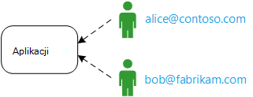
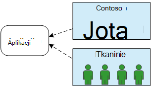
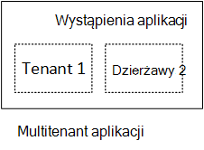
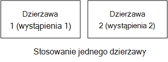
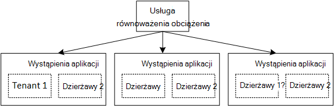

<properties
   pageTitle="Zarządzanie tożsamościami dla aplikacji multitenant | Microsoft Azure"
   description="Wprowadzenie do zarządzania tożsamości w aplikacjach multitenant"
   services=""
   documentationCenter="na"
   authors="MikeWasson"
   manager="roshar"
   editor=""
   tags=""/>

<tags
   ms.service="guidance"
   ms.devlang="dotnet"
   ms.topic="article"
   ms.tgt_pltfrm="na"
   ms.workload="na"
   ms.date="06/02/2016"
   ms.author="mwasson"/>

# Wprowadzenie do zarządzania tożsamością multitenant aplikacji platformy Microsoft Azure

[AZURE.INCLUDE [pnp-header](../../includes/guidance-pnp-header-include.md)]

Ten artykuł jest [częścią serii]. Istnieje także kompletnego [przykładowej aplikacji] dostarczonej z tej serii.

Załóżmy, że pisania Jednostka aplikacjom władz akredytacji bezpieczeństwa być przechowywane w chmurze. Oczywiście aplikacja ma użytkowników:

Jednak tych użytkowników należą do organizacji:

Przykład: Firma sprzedawanych subskrypcje jej stosowania władz akredytacji bezpieczeństwa. Contoso i Fabrikam Załóż aplikacji. Gdy Alicja (`alice@contoso`) znaków w aplikacji należy pamiętać, że Alicja część Contoso.

- Alicja, _należy_ mieć dostęp do danych firmy Contoso.
- Alicja _nie powinien_ mieć dostęp do danych Fabrikam.

Te wskazówki procedurach pokazano, sposób zarządzania tożsamością użytkowników w multitenant aplikacji przy użyciu [Usługi Azure Active Directory] [ AzureAD] (Azure AD) do obsługi logowania i uwierzytelniania.

## Co to jest multitenancy?

_Dzierżawy_ jest grupy użytkowników. W aplikacji władz akredytacji bezpieczeństwa dzierżawy jest abonenta lub klienta aplikacji. _Multitenancy_ jest architektura, gdzie kilka dzierżaw udostępnianie tego samego wystąpienia fizycznie aplikacji. Mimo że dzierżaw współużytkowanie zasobów fizycznie (na przykład maszyny wirtualne lub miejsce do magazynowania), każdy dzierżawy otrzymuje własne logiczne wystąpienie aplikacji.

Zazwyczaj dane aplikacji są udostępniane przez użytkowników w ramach dzierżawy, ale nie inne dzierżaw.

Porównanie tej architektury z architekturę pojedyncze dzierżawy, w których każdy dzierżawy nie dedykowane wystąpienie fizycznym. W architekturze pojedyncze dzierżawy można dodać dzierżaw Obracająca się nowych wystąpień aplikacji.

### Skalowanie multitenancy i poziomej

Aby osiągnąć skala w chmurze, są często Dodawanie większej ilości wystąpienia. To jest nazywany _Skalowanie w poziomie_ lub _Skalowanie zewnętrzne_. Należy rozważyć, czy aplikacji sieci web. Aby obsługiwać większy ruch, można dodać więcej serwera maszyny wirtualne i umieść je pod spód równoważenia obciążenia. Każdy maszyn wirtualnych uruchamia osobne wystąpienie fizycznie aplikacji sieci web.

Każde żądanie można kierowane do każdego wystąpienia. Razem system działa jako jedno wystąpienie logiczne. Możesz usunąć maszyny lub pokrętła się nowe Głosowa, bez wpływu na użytkowników. W tym architektura każdego wystąpienia fizycznie jest wiele dzierżawy i skalowanie, dodając kolejne wystąpienia. Jeśli jednego wystąpienia awarii, nie narusza dowolnego dzierżawy.

## Tożsamości w multitenant aplikacji

W aplikacji multitenant należy rozważyć użytkowników w kontekście dzierżaw.

**Uwierzytelnianie**

- Użytkownicy, zaloguj się do aplikacji przy użyciu poświadczeń organizacji. Ta osoba nie musisz tworzyć nowych profilów użytkowników dla aplikacji.
- Użytkownicy w tej samej organizacji są częścią tej samej dzierżawy.
- Gdy użytkownik zaloguje się, aplikacja zna dzierżawy, które należy użytkownik.

**Autoryzacja**

- Podczas uwierzytelniania akcje użytkownika (Powiedz, wyświetlanie zasobu), aplikacji należy wziąć pod uwagę dzierżawy użytkownika.
- Użytkownicy mogą można przypisywać ról w aplikacji, takich jak "Administrator" lub "Użytkownika standardowego". Przypisania roli powinny być zarządzane przez klienta, a nie przez dostawcę władz akredytacji bezpieczeństwa.

**Przykład.** Alicja, Pracownik u firmy Contoso, przechodzi do aplikacji w swojej przeglądarce i kliknięciu przycisku "Zaloguj". Osoba jest przekierowywana do ekranu logowania, w którym Anna wprowadza swojej firmy poświadczeń (nazwy użytkownika i hasła). W tym momencie użytkownik jest zalogowany jako aplikacja `alice@contoso.com`. Aplikacja również wie, że Alicja jest administrator dla tej aplikacji. Ponieważ użytkownik jest administratorem, Anna można wyświetlić listę wszystkich zasobów, które należą do firmy Contoso. Jednak osoba nie można wyświetlić zasobów firmy, ponieważ użytkownik jest administratorem tylko w swojej dzierżawy.

W tych wskazówek przyjrzymy specjalnie przy użyciu Azure AD dla Zarządzanie tożsamościami.

- Przyjęto założenie, że klient przechowuje ich profile użytkowników w Azure AD (łącznie z dzierżawami usługi Office 365 i Dynamics CRM)
- Z lokalnego Active Directory (AD) mogą używać [Azure AD Connect] [ ADConnect] zsynchronizować ich AD lokalnego z usługą Azure Active Directory.

Jeśli klientów z usługą Active Directory w wersji lokalnej nie można używać narzędzie Azure AD Connect (z powodu zasad INFORMATYCZNY firmy lub innych powodów), władz akredytacji bezpieczeństwa dostawcy można utworzyć Federację z klienta przez AD za pośrednictwem usługi Active Directory Federation Services (AD FS). Ta opcja jest opisany w [Federating z usług AD FS klienta].

Te wskazówki nie innych aspektów multitenancy, takich jak podział danych konfiguracji dla dzierżawy i tak dalej.

## Następne kroki

- Przeczytaj artykuł dalej w tej serii: [aplikacji o firma ankiet][tailpin]

<!-- Links -->
[ADConnect]: ../active-directory/active-directory-aadconnect.md
[AzureAD]: https://azure.microsoft.com/documentation/services/active-directory/
[częścią serii]: guidance-multitenant-identity.md
[Używanie federacyjnych z usług AD FS klienta]: guidance-multitenant-identity-adfs.md
[Przykładowa aplikacja]: https://github.com/Azure-Samples/guidance-identity-management-for-multitenant-apps
[tailpin]: guidance-multitenant-identity-tailspin.md
