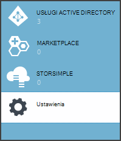
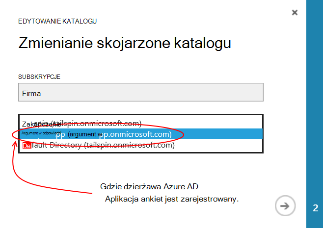
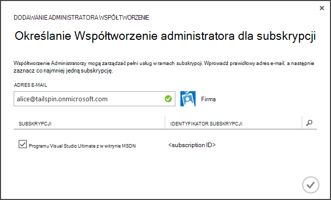
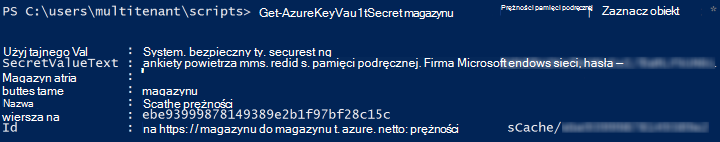

<properties
   pageTitle="Chronienie hasła aplikacji przy użyciu klucza magazynu | Microsoft Azure"
   description="Jak użyć usługi klucza magazynu do przechowywania hasła aplikacji"
   services=""
   documentationCenter="na"
   authors="MikeWasson"
   manager="roshar"
   editor=""
   tags=""/>

<tags
   ms.service="guidance"
   ms.devlang="dotnet"
   ms.topic="article"
   ms.tgt_pltfrm="na"
   ms.workload="na"
   ms.date="02/16/2016"
   ms.author="mwasson"/>

# <a name="using-azure-key-vault-to-protect-application-secrets"></a>Chronienie hasła aplikacji przy użyciu magazynu klucza Azure

[AZURE.INCLUDE [pnp-header](../../includes/guidance-pnp-header-include.md)]

Ten artykuł jest [częścią serii]. Istnieje także kompletnego [przykładowej aplikacji] dostarczonej z tej serii.

## <a name="overview"></a>Omówienie

Jest to powszechne mają ustawień aplikacji, które są poufne i muszą być chronione, takie jak:

- Parametry połączenia bazy danych
- Hasła
- Klucze szyfrowania

Ze względów bezpieczeństwa nigdy nie należy przechowywać te hasła w formancie źródła. Bardzo łatwo się pamięci &mdash; nawet wtedy, gdy repozytorium kodu źródłowego prywatne. I jej nie niemal przechowywanie hasła z ogólnego publicznej. Na większych projektów warto ograniczyć które deweloperów i operatorów można uzyskać dostęp do hasła produkcji. (Ustawienia w środowiskach badania i rozwój są różne).

Bezpieczniejsze rozwiązaniem jest przechowywanie tych hasła w [Azure klucza magazynu][KeyVault]. Klucza magazynu jest hostowana w chmurze Usługa zarządzania klucze szyfrowania i inne hasła. W tym artykule przedstawiono sposób użycia klucza magazynu do przechowywania ustawień konfiguracji możesz aplikacji.

W [Ankiet firma] [ Surveys] aplikacji, tajne są następujące ustawienia:

- Parametry połączenia bazy danych.
- Parametry połączenia Redis.
- Tajny klienta dla aplikacji sieci web.

Aby przechowywać hasła konfiguracji w magazynu klucza, aplikacji ankiet wykonuje dostawcy konfiguracji niestandardowej, który przechwytuje do ASP.NET Core 1.0 [konfiguracji systemu][configuration]. Niestandardowe dostawcy odczytuje ustawienia konfiguracji z magazynu klawisz podczas uruchamiania.

Aplikacja ankiet ładuje ustawienia konfiguracji w następujących miejscach:

- Plik appsettings.json
- [Przechowywanie hasła użytkownika] [ user-secrets] (środowisko projektowania tylko; do testowania)
- Środowisko macierzyste (ustawienia aplikacji w aplikacjach sieci web Azure)
- Kluczowe magazynu

Każdy z tych zastąpienia poprzedniej wersji, aby wszystkie ustawienia przechowywane w klucza magazynu pierwszeństwo.

> [AZURE.NOTE] Domyślnie dostawca konfiguracji magazynu klucza jest wyłączona. Nie są potrzebne do uruchamiania aplikacji lokalnie. Czy można włączyć we wdrożeniu produkcji.

> Dostawca magazynu klucza nie jest obecnie obsługiwane dla .NET Core, ponieważ wymaga [Microsoft.Azure.KeyVault] [ Microsoft.Azure.KeyVault] pakiet.

Podczas uruchamiania aplikacja odczytuje ustawienia z każdego dostawcy zarejestrowanych konfiguracji i używa ich do wypełnienia obiektu jednoznacznie określonym opcje. (Aby uzyskać więcej informacji, zobacz [Opcje przy użyciu i obiektów konfiguracji][options].)

## <a name="implementation"></a>Implementacja

[KeyVaultConfigurationProvider] [ KeyVaultConfigurationProvider] klasa jest dostawca konfiguracji, podłączana do ASP.NET Core 1.0 [system konfiguracji][configuration].

Aby użyć `KeyVaultConfigurationProvider`, połączenie `AddKeyVaultSecrets` metoda rozszerzenia klasy uruchamiania:

```csharp
    var builder = new ConfigurationBuilder()
        .SetBasePath(appEnv.ApplicationBasePath)
        .AddJsonFile("appsettings.json");

    if (env.IsDevelopment())
    {
        builder.AddUserSecrets();
    }
    builder.AddEnvironmentVariables();
    var config = builder.Build();

    // Add key vault configuration:
    builder.AddKeyVaultSecrets(config["AzureAd:ClientId"],
        config["KeyVault:Name"],
        config["AzureAd:Asymmetric:CertificateThumbprint"],
        Convert.ToBoolean(config["AzureAd:Asymmetric:ValidationRequired"]),
        loggerFactory);
```

Należy zauważyć, że `KeyVaultConfigurationProvider` wymaga niektóre ustawienia konfiguracji, które mają być przechowywane w jednym z innych źródeł konfiguracji.

Podczas uruchamiania aplikacji, `KeyVaultConfigurationProvider` wylicza wszystkie hasła klucza magazynu. Dla każdego tajny szuka znacznika o nazwie "ConfigKey". Wartość znacznika jest nazwę ustawienia konfiguracji.

> [AZURE.NOTE] [Znaczniki] [ key-tags] są opcjonalne metadanych przy użyciu klucza. Tagi są używane w tym miejscu, ponieważ klucza nazwy nie mogą zawierać znaków dwukropek (:).

```csharp
var kvClient = new KeyVaultClient(GetTokenAsync);
var secretsResponseList = await kvClient.GetSecretsAsync(_vault, MaxSecrets, token);
foreach (var secretItem in secretsResponseList.Value)
{
    //The actual config key is stored in a tag with the Key "ConfigKey"
    // because ':' is not supported in a shared secret name by Key Vault.
    if (secretItem.Tags != null && secretItem.Tags.ContainsKey(ConfigKey))
    {
        var secret = await kvClient.GetSecretAsync(secretItem.Id, token);
        Data.Add(secret.Tags[ConfigKey], secret.Value);
    }
}
```

> [AZURE.NOTE] Zobacz [KeyVaultConfigurationProvider.cs].

## <a name="setting-up-key-vault-in-the-surveys-app"></a>Konfigurowanie klucza magazynu w aplikacji ankiet

Wymagania wstępne dotyczące:

- Instalowanie [Azure poleceń cmdlet Menedżera zasobów][azure-rm-cmdlets].
- Konfigurowanie aplikacji ankiety, zgodnie z opisem w [uruchamiania aplikacji ankiet][readme].

Czynności wysokiego poziomu:

1. Konfigurowanie administrator w dzierżawie.
2. Konfigurowanie certyfikatu klienta.
3. Tworzenie magazynu kluczy.
4. Dodaj ustawienia konfiguracji do swojego klucza magazynu.
5. Usuń komentarze kod, który umożliwia klucza magazynu.
6. Aktualizowanie aplikacji hasła użytkownika.

### <a name="set-up-an-admin-user"></a>Konfigurowanie administrator

> [AZURE.NOTE] Aby utworzyć klucza magazynu, należy użyć konta, które można zarządzać subskrypcją Azure. Ponadto dowolnej aplikacji, która autoryzowane do odczytu z magazynu klucza muszą zarejestrowane w tej samej dzierżawy, jak to konto.

W tym kroku będzie należy upewnić się, że można tworzyć kluczowe magazynu podczas zalogowany jako użytkownik z dzierżawy gdzie jest zarejestrowana aplikacji ankiety.

Najpierw zmienić katalogu skojarzonego z subskrypcją usługi Azure.

1. Zaloguj się do [portalu zarządzania Azure][azure-management-portal]

2. Kliknij przycisk **Ustawienia**.

    

3. Wybierz subskrypcję Azure.

4. Kliknij przycisk **Edytuj katalogu** u dołu portalu.

    

5. W "Zmienić katalogu skojarzone" wybierz pozycję dzierżawy Azure AD, gdzie jest zarejestrowana aplikacji ankiety,

    

6. Kliknij przycisk strzałki i wypełnij okno dialogowe.

Tworzenie administrator w dzierżawie Azure AD, gdzie jest zarejestrowana aplikacji ankiety.

1. Logowanie do [portalu zarządzania Azure][azure-management-portal].

2. Wybierz pozycję dzierżawy Azure AD, gdzie jest zarejestrowana aplikacji.

3. Kliknij pozycję **Użytkownicy** > **Dodaj użytkownika**.

4. W oknie dialogowym **Dodawanie użytkownika** należy przypisać użytkownika do roli administratora globalnego.

Dodaj użytkownika administratora administrator Współtworzenie dla subskrypcji Azure.

1. Logowanie do [portalu zarządzania Azure][azure-management-portal].

2. Kliknij przycisk **Ustawienia** i wybierz subskrypcję Azure.

3. Kliknij pozycję **Administratorzy**

4. Kliknij przycisk **Dodaj** w dolnej części portalu.

5. Wprowadź adres e-mail użytkownika administratora, utworzonego wcześniej.

6. Zaznacz pole wyboru dla subskrypcji.

7. Kliknij przycisk znacznika wyboru, aby zakończyć okna dialogowego.




### <a name="set-up-a-client-certificate"></a>Konfigurowanie certyfikatu klienta

1. Uruchamianie skryptu programu PowerShell [/Scripts/Setup-KeyVault.ps1] [ Setup-KeyVault] w następujący sposób:
    ```
    .\Setup-KeyVault.ps1 -Subject <<subject>>
    ```
    Aby uzyskać `Subject` parametr, wpisz dowolną nazwę, na przykład "surveysapp". Skrypt generuje certyfikat z podpisem własnym i zapisuje go w magazynie certyfikatów "bieżącego użytkownika na osobisty".

2. Dane wyjściowe skrypt to JSON fragment. Należy dodać to do manifest aplikacji aplikacji sieci web, w następujący sposób:

    1. Logowanie do [portalu zarządzania Azure] [ azure-management-portal] i przejdź do katalogu Azure AD.

    2. Kliknij pozycję **aplikacje**.

    3. Wybierz aplikację, ankiet.

    4.  Kliknij pozycję **Zarządzaj pojawiają** i wybierz pozycję **Pobierz pojawiają**.

    5.  Otwórz plik manifestu JSON w edytorze tekstów. Wklej dane wyjściowe skrypt do `keyCredentials` właściwości. Powinna wyglądać podobnie do następującej:
    ```
            "keyCredentials": [
                {
                  "type": "AsymmetricX509Cert",
                  "usage": "Verify",
                  "keyId": "29d4f7db-0539-455e-b708-....",
                  "customKeyIdentifier": "ZEPpP/+KJe2fVDBNaPNOTDoJMac=",
                  "value": "MIIDAjCCAeqgAwIBAgIQFxeRiU59eL.....
                }
              ],
    ```          
    6.  Zapisz zmiany w pliku JSON.

    7.  Wróć do portalu. Kliknij pozycję **Zarządzaj pojawiają** > **Przekazać pojawiają** i przekaż plik JSON.

3. Dodawanie tego samego fragmentu JSON do manifest aplikacji sieci Web interfejsu API (Surveys.WebAPI).

4. Uruchom następujące polecenie, aby uzyskać odcisku palca certyfikatu.
    ```
    certutil -store -user my [subject]
    ```
    miejsce, w którym `[subject]` jest wartością określonego tematu w skrypt programu PowerShell. Odcisku palca znajduje się w obszarze "Certyfikatu Hash(sha1)". Usuń wszystkie spacje między szesnastkowej liczby.

Później użyjesz odcisku palca.

### <a name="create-a-key-vault"></a>Tworzenie klucza magazynu

1. Uruchamianie skryptu programu PowerShell [/Scripts/Setup-KeyVault.ps1] [ Setup-KeyVault] w następujący sposób:

    ```
    .\Setup-KeyVault.ps1 -KeyVaultName <<key vault name>> -ResourceGroupName <<resource group name>> -Location <<location>>
    ```

    Gdy zostanie wyświetlony monit o poświadczenia, zaloguj się jako użytkownik Azure AD utworzony wcześniej. Skrypt tworzy nową grupę zasobów i nowego magazynu klucza w ramach danej grupy zasobów.

    Uwaga: parametru - lokalizacji za pomocą następującego polecenia programu PowerShell w celu uzyskania listy prawidłowych regionów:

    ```
    Get-AzureRmResourceProvider -ProviderNamespace "microsoft.keyvault" | Where-Object { $_.ResourceTypes.ResourceTypeName -eq "vaults" } | Select-Object -ExpandProperty Locations
    ```

2. Ponownie uruchom SetupKeyVault.ps z następujących parametrów:

    ```
    .\Setup-KeyVault.ps1 -KeyVaultName <<key vault name>> -ApplicationIds @("<<web app client ID>>", "<<web API client ID>>")
    ```

    gdzie

    - Nazwa klucza magazynu = Nazwa nadana klucza magazynu w poprzednim kroku.
    - Identyfikator klienta aplikacji Web = identyfikator klienta dla aplikacji sieci web ankiety.
    - Identyfikator klienta interfejsu api w sieci Web = identyfikator klienta na podstawie Surveys.WebAPI.

    Przykład:
    ```
    .\Setup-KeyVault.ps1 -KeyVaultName tailspinkv -ApplicationIds @("f84df9d1-91cc-4603-b662-302db51f1031", "8871a4c2-2a23-4650-8b46-0625ff3928a6")
    ```

    > [AZURE.NOTE] Możesz wyświetlić klienta identyfikatory z [portalu zarządzania Azure][azure-management-portal]. Zaznacz dzierżawy Azure AD, wybierz aplikację, a następnie kliknij przycisk **Konfiguruj**.

    Ten skrypt zezwala aplikacji sieci web i interfejs API sieci web do pobierania hasła z usługi klucza magazynu. Zobacz [Rozpoczynanie pracy z magazynu klucza Azure] [ authorize-app] uzyskać więcej informacji.

### <a name="add-configuration-settings-to-your-key-vault"></a>Dodawanie ustawienia konfiguracji do swojego klucza magazynu

1. Uruchamianie SetupKeyVault.ps w następujący sposób:

    ```
    .\Setup-KeyVault.ps1 -KeyVaultName <<key vault name> -KeyName RedisCache -KeyValue "<<Redis DNS name>>.redis.cache.windows.net,password=<<Redis access key>>,ssl=true" -ConfigName "Redis:Configuration"
    ```
    gdzie

    - Nazwa klucza magazynu = Nazwa nadana klucza magazynu w poprzednim kroku.
    - Redis nazwy DNS = nazwa DNS wystąpienia pamięci podręcznej Redis.
    - Klawisz dostępu redis = klawisz dostępu dla wystąpienia Redis pamięci podręcznej.

    To polecenie dodaje hasło do swojego klucza magazynu. Hasło jest pary nazwa wartość plus znacznika:

    -   Nazwa klucza nie jest używana przez aplikację, ale musi być unikatowa w magazynu klucza.
    -   Wartość jest wartością opcji konfiguracji, w tym przypadku Redis parametry połączenia.
    -   znacznik "ConfigKey" przechowuje nazwę klucza konfiguracji.

2. W tym momencie jest dobrym pomysłem, aby sprawdzić, czy pomyślnie przechowywane hasła do klucza magazynu. Uruchom następujące polecenia programu PowerShell:

    ```
    Get-AzureKeyVaultSecret <<key vault name>> RedisCache | Select-Object *
    ```
    Wynik powinien wskazywać wartość tajne oraz niektóre metadane:

    

3. Uruchom SetupKeyVault.ps ponownie, aby dodać parametry połączenia bazy danych:

    ```
    .\Setup-KeyVault.ps1 -KeyVaultName <<key vault name> -KeyName ConnectionString -KeyValue <<DB connection string>> -ConfigName "Data:SurveysConnectionString"
    ```

    miejsce, w którym `<<DB connection string>>` jest wartością parametry połączenia bazy danych.

    Do testowania z lokalnej bazy danych, skopiuj parametry połączenia z pliku Tailspin.Surveys.Web/appsettings.json. Jeśli możesz to zrobić, upewnij się zmienić podwójny ukośnik odwrotny ("\\\\") do jednej ukośnik odwrotny. Podwójny ukośnik odwrotny jest znaku anulowania w pliku JSON.

    Przykład:

    ```
    .\Setup-KeyVault.ps1 -KeyVaultName mykeyvault -KeyName ConnectionString -KeyValue "Server=(localdb)\MSSQLLocalDB;Database=Tailspin.SurveysDB;Trusted_Connection=True;MultipleActiveResultSets=true" -ConfigName "Data:SurveysConnectionString"
    ```

### <a name="uncomment-the-code-that-enables-key-vault"></a>Usuń komentarze kod, który umożliwia klucza magazynu

1. Otwórz rozwiązanie Tailspin.Surveys.

2. W [Tailspin.Surveys.Web/Startup.cs][web-startup], znajdź następujący blok kodu i usuń go komentarze.

    ```csharp
    //#if DNX451
    //            _configuration = builder.Build();
    //            builder.AddKeyVaultSecrets(_configuration["AzureAd:ClientId"],
    //                _configuration["KeyVault:Name"],
    //                _configuration["AzureAd:Asymmetric:CertificateThumbprint"],
    //                Convert.ToBoolean(_configuration["AzureAd:Asymmetric:ValidationRequired"]),
    //                loggerFactory);
    //#endif
    ```

3. W [Tailspin.Surveys.WebAPI/Startup.cs][web-api-startup], znajdź następujący blok kodu i usuń go komentarze.

    ```csharp
    //#if DNX451
    //            var config = builder.Build();
    //            builder.AddKeyVaultSecrets(config["AzureAd:ClientId"],
    //                config["KeyVault:Name"],
    //                config["AzureAd:Asymmetric:CertificateThumbprint"],
    //                Convert.ToBoolean(config["AzureAd:Asymmetric:ValidationRequired"]),
    //                loggerFactory);
    //#endif
    ```

4. W [Tailspin.Surveys.Web/Startup.cs][web-startup], zlokalizuj kod, który rejestruje `ICredentialService`. Usuń komentarze wiersza, która korzysta z `CertificateCredentialService`i komentarz się wiersza, która korzysta z `ClientCredentialService`:

    ```csharp
    // Uncomment this:
    services.AddSingleton<ICredentialService, CertificateCredentialService>();
    // Comment out this:
    //services.AddSingleton<ICredentialService, ClientCredentialService>();
    ```

    Ta zmiana umożliwia aplikacji sieci web za pomocą [klienta potwierdzenia] [ client-assertion] uzyskanie tokeny dostępu OAuth. Z potwierdzenia klienta nie jest wymagane hasło klienta OAuth. Można też kliknąć można przechowywać tajny klienta w klucza magazynu. Jednak klucza magazynu i klienta potwierdzenia, że oba za pomocą klienta certyfikatu, więc jeśli włączysz klucza magazynu, zaleca się włączenie także potwierdzenia klienta.

### <a name="update-the-user-secrets"></a>Aktualizowanie hasła użytkownika

W Eksploratorze rozwiązań projektu Tailspin.Surveys.Web kliknij prawym przyciskiem myszy i wybierz pozycję **Zarządzaj hasła użytkownika**. W pliku secrets.json usunąć istniejące JSON i Wklej w następujących czynności:

    ```
    {
      "AzureAd": {
        "ClientId": "[Surveys web app client ID]",
        "PostLogoutRedirectUri": "https://localhost:44300/",
        "WebApiResourceId": "[App ID URI of your Surveys.WebAPI application]",
        "Asymmetric": {
          "CertificateThumbprint": "[certificate thumbprint. Example: 105b2ff3bc842c53582661716db1b7cdc6b43ec9]",
          "StoreName": "My",
          "StoreLocation": "CurrentUser",
          "ValidationRequired": "false"
        }
      },
      "KeyVault": {
        "Name": "[key vault name]"
      }
    }
    ```

Zamień wpisy w [nawiasów kwadratowych] prawidłowe wartości.

- `AzureAd:ClientId`: Identyfikator klienta aplikacji ankiety.
- `AzureAd:WebApiResourceId`: Aplikacja identyfikator URI określony podczas tworzenia aplikacji Surveys.WebAPI w Azure AD.
- `Asymmetric:CertificateThumbprint`: Odcisk palca certyfikatu uzyskanego wcześniej, podczas tworzenia certyfikat klienta.
- `KeyVault:Name`: Nazwa Twojej klucza magazynu.

> [AZURE.NOTE] `Asymmetric:ValidationRequired`jest wartość FAŁSZ, ponieważ certyfikat, który został utworzony wcześniej nie podpisany przez główny urząd certyfikacji (CA). W produkcji, za pomocą certyfikatu, który został podpisany przez główny urząd certyfikacji i ustawić `ValidationRequired` na PRAWDA.

Zapisz plik secrets.json zaktualizowane.

Następnie w oknie Eksplorator rozwiązań projektu Tailspin.Surveys.WebApi kliknij prawym przyciskiem myszy i wybierz pozycję **Zarządzaj hasła użytkownika**. Usuwanie istniejącej JSON i Wklej w następujących czynności:

```
{
  "AzureAd": {
    "ClientId": "[Surveys.WebAPI client ID]",
    "WebApiResourceId": "https://tailspin5.onmicrosoft.com/surveys.webapi",
    "Asymmetric": {
      "CertificateThumbprint": "[certificate thumbprint]",
      "StoreName": "My",
      "StoreLocation": "CurrentUser",
      "ValidationRequired": "false"
    }
  },
  "KeyVault": {
    "Name": "[key vault name]"
  }
}
```

Zamień wpisy w [w nawiasach kwadratowych] i Zapisz plik secrets.json.

> [AZURE.NOTE] Dla sieci web interfejsu API upewnij się użyć identyfikator klienta na podstawie Surveys.WebAPI nie aplikacji ankiety.


<!-- Links -->
[authorize-app]: ../key-vault/key-vault-get-started.md/#authorize
[azure-management-portal]: https://manage.windowsazure.com/
[azure-rm-cmdlets]: https://msdn.microsoft.com/library/mt125356.aspx
[client-assertion]: guidance-multitenant-identity-client-assertion.md
[configuration]: https://docs.asp.net/en/latest/fundamentals/configuration.html
[KeyVault]: https://azure.microsoft.com/services/key-vault/
[KeyVaultConfigurationProvider]: https://github.com/Azure-Samples/guidance-identity-management-for-multitenant-apps/blob/master/src/Tailspin.Surveys.Configuration.KeyVault/KeyVaultConfigurationProvider.cs
[key-tags]: https://msdn.microsoft.com/library/azure/dn903623.aspx#BKMK_Keytags
[Microsoft.Azure.KeyVault]: https://www.nuget.org/packages/Microsoft.Azure.KeyVault/
[options]: https://docs.asp.net/en/latest/fundamentals/configuration.html#using-options-and-configuration-objects
[readme]: https://github.com/Azure-Samples/guidance-identity-management-for-multitenant-apps/blob/master/docs/running-the-app.md
[Setup-KeyVault]: https://github.com/Azure-Samples/guidance-identity-management-for-multitenant-apps/blob/master/scripts/Setup-KeyVault.ps1
[Surveys]: guidance-multitenant-identity-tailspin.md
[user-secrets]: http://go.microsoft.com/fwlink/?LinkID=532709
[web-startup]: https://github.com/Azure-Samples/guidance-identity-management-for-multitenant-apps/blob/master/src/Tailspin.Surveys.Web/Startup.cs
[web-api-startup]: https://github.com/Azure-Samples/guidance-identity-management-for-multitenant-apps/blob/master/src/Tailspin.Surveys.WebAPI/Startup.cs
[częścią serii]: guidance-multitenant-identity.md
[KeyVaultConfigurationProvider.cs]: https://github.com/Azure-Samples/guidance-identity-management-for-multitenant-apps/blob/master/src/Tailspin.Surveys.Configuration.KeyVault/KeyVaultConfigurationProvider.cs
[Przykładowa aplikacja]: https://github.com/Azure-Samples/guidance-identity-management-for-multitenant-apps
