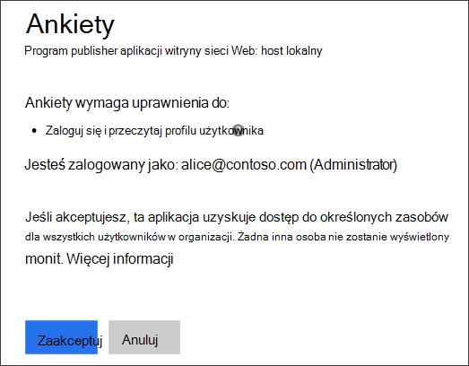
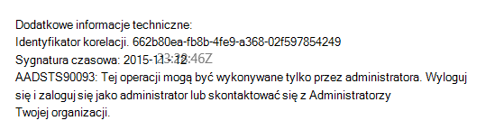
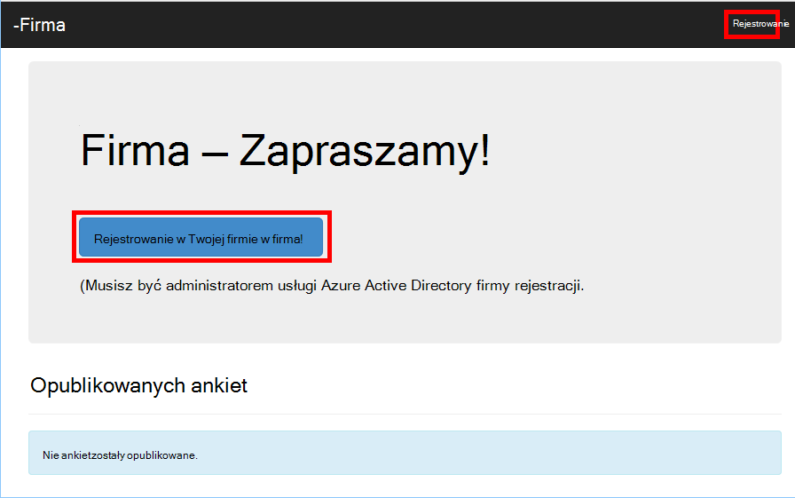
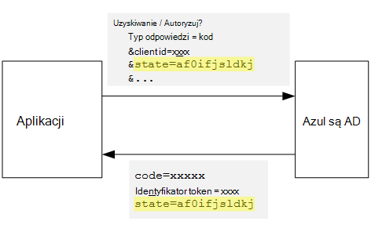
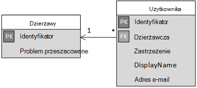

<properties
   pageTitle="Zapisów i dzierżawa ułatwiającej rozpoczęcie korzystania w aplikacjach multitenant | Microsoft Azure"
   description="Jak wbudowany dzierżaw w multitenant aplikacji"
   services=""
   documentationCenter="na"
   authors="MikeWasson"
   manager="roshar"
   editor=""
   tags=""/>

<tags
   ms.service="guidance"
   ms.devlang="dotnet"
   ms.topic="article"
   ms.tgt_pltfrm="na"
   ms.workload="na"
   ms.date="05/23/2016"
   ms.author="mwasson"/>

# <a name="sign-up-and-tenant-onboarding-in-a-multitenant-application"></a>Zapisów i dzierżawa ułatwiającej rozpoczęcie korzystania w multitenant aplikacji

[AZURE.INCLUDE [pnp-header](../../includes/guidance-pnp-header-include.md)]

Ten artykuł jest [częścią serii]. Istnieje także kompletnego [przykładowej aplikacji] dostarczonej z tej serii.

W tym artykule opisano, jak przeprowadzić _zapisów_ procesu w aplikacji wielu dzierżawy, dzięki czemu klienta, aby utworzyć konto organizacji dla aplikacji.
Istnieje kilka powodów do wykonania procesu rejestracji:

-   Zezwalaj administratorem AD do zezwolenia na całej organizacji klienta korzystania z aplikacji.
-   Zbieranie płatności kartą kredytową lub inne informacje klienta.
-   Wykonaj wszelkie wymagane przez aplikację skonfigurowanie dzierżawy jednorazowego.

## <a name="admin-consent-and-azure-ad-permissions"></a>Zgody administratora i uprawnień Azure AD

Aby można było uwierzytelnić z usługą Azure Active Directory, aplikacja musi mieć dostęp do katalogu użytkownika. Co najmniej aplikacji wymaga uprawnienia do odczytu profilu użytkownika. Użytkownik rejestruje, po raz pierwszy Azure AD wyświetla stronę zgody zawierającym są wymagane uprawnienia. Klikając przycisk **Akceptuj**, użytkownik udziela uprawnień do aplikacji.

Domyślnie otrzymaniem zezwolenia na poszczególnych użytkowników. Każdy użytkownik logujący się widzi stronie wyrażania zgody. Azure AD obsługuje także _zgody administratora_, które umożliwia administratorowi AD zgoda dla całej organizacji.

W przypadku przepływu zgody administratora, strona zgody informuje, że administrator AD jest udzielanie uprawnień w imieniu całej dzierżawy:



Po administrator klika przycisk **Akceptuj**, inni użytkownicy w tej samej dzierżawy zalogować się i Azure AD pominie ekranu zgody.

Tylko administrator AD można zgody administratora, ponieważ przyznaje ona uprawnień w imieniu całej organizacji. Jeżeli podejmie niebędący administratorami do uwierzytelnienia przepływu zgody administratora, Azure AD zostanie wyświetlony komunikat o błędzie:



Jeśli aplikacja wymaga dodatkowych uprawnień w dowolnym momencie, klienta musisz ponownie utworzyć konto i wyraża zgodę na zaktualizowane uprawnienia.  

## <a name="implementing-tenant-sign-up"></a>Implementacji dzierżawy zapisów

Dla [Ankiet firma] [ Tailspin] aplikacji, możemy zdefiniowane kilka wymagań w procesie tworzenia konta:

-   Dzierżawy musi utworzyć konto, aby użytkownicy mogli logować się.
-   Zapisów używa przepływu zgody administratora.
-   Zapisów dodaje dzierżawy użytkownika do bazy danych aplikacji.
-   Po zarejestrowaniu dzierżawy, aplikacja zawiera strony ułatwiającej rozpoczęcie korzystania.

W tej sekcji przedstawimy każde z naszych stosowania procesu rejestracji.
Ważne jest, aby zrozumieć tę "Utwórz konto" i "Zaloguj" jest koncepcja aplikacji. Podczas przepływ uwierzytelniania Azure AD założenia wiadomo, czy użytkownik jest w trakcie procesu rejestracji. Jest aplikacji do śledzenia kontekstu.

Gdy użytkownik anonimowy wizyty aplikacji ankiety, użytkownik jest wyświetlana dwa przyciski: jeden-do-logowanie się i jeden-do-"rejestracji firmy" (Utwórz konto).



Te przyciski wywołać akcje w klasie [AccountController] .

`SignIn` Akcji zwraca **ChallegeResult**, co powoduje, że pośredniczącym łączenie OpenID do przekierowywania do punktu końcowego uwierzytelniania. Jest to domyślne sposobów uwierzytelniania wyzwalacza programu ASP.NET Core 1.0.  

```csharp
[AllowAnonymous]
public IActionResult SignIn()
{
    return new ChallengeResult(
        OpenIdConnectDefaults.AuthenticationScheme,
        new AuthenticationProperties
        {
            IsPersistent = true,
            RedirectUri = Url.Action("SignInCallback", "Account")
        });
}
```

Teraz porównanie `SignUp` akcji:

```csharp
[AllowAnonymous]
public IActionResult SignUp()
{
    // Workaround for https://github.com/aspnet/Security/issues/546
    HttpContext.Items.Add("signup", "true");

    var state = new Dictionary<string, string> { { "signup", "true" }};
    return new ChallengeResult(
        OpenIdConnectDefaults.AuthenticationScheme,
        new AuthenticationProperties(state)
        {
            RedirectUri = Url.Action(nameof(SignUpCallback), "Account")
        });
}
```

Jak `SignIn`, `SignUp` akcji również zwraca `ChallengeResult`. Ale tym razem dodajemy fragmentu informacje o stanie `AuthenticationProperties` w `ChallengeResult`:

-   Tworzenie konta: flagę logiczną, wskazująca, że użytkownik rozpoczął procesu rejestracji.

Informacje o stanie w `AuthenticationProperties` są dodawane do łączenia OpenID [Stan] parametr, który przekazywanych podczas przepływ uwierzytelniania.



Po uwierzytelnia w Azure AD i przekierowaniem wrócić do aplikacji, biletów uwierzytelniania zawiera stan. Użyto ten fakt do upewnij się, że wartość "Zapisywanie" będzie nadal występował przez przepływ uwierzytelniania całego.

## <a name="adding-the-admin-consent-prompt"></a>Dodawanie wiersza zgody administratora

W Azure AD przepływu zgody administratora zostanie wywołana, dodając parametru "monit" w ciągu kwerendy w żądaniu uwierzytelnienia:

```
/authorize?prompt=admin_consent&...
```

Aplikacja ankiet dodaje monit podczas `RedirectToAuthenticationEndpoint` zdarzenia. To zdarzenie jest wywoływane bezpośrednio przed pośredniczącym przekierowuje do punktu końcowego uwierzytelniania.

```csharp
public override Task RedirectToAuthenticationEndpoint(RedirectContext context)
{
    if (context.IsSigningUp())
    {
        context.ProtocolMessage.Prompt = "admin_consent";
    }

    _logger.RedirectToIdentityProvider();
    return Task.FromResult(0);
}
```

> [AZURE.NOTE] Zobacz [SurveyAuthenticationEvents.cs].

Ustawianie` ProtocolMessage.Prompt` informuje pośredniczącym dodania parametru "monit" do żądania uwierzytelnienia.

Uwaga wierszu jest wymagany tylko podczas tworzenia konta. Zwykłe logowania nie powinna zawierać go. Aby odróżnić między nimi, możemy Sprawdź `signup` wartość w stanie uwierzytelniania. Z poniższej metody rozszerzenia sprawdza ten warunek:

```csharp
internal static bool IsSigningUp(this BaseControlContext context)
{
    Guard.ArgumentNotNull(context, nameof(context));

    string signupValue;
    object obj;
    // Check the HTTP context and convert to string
    if (context.HttpContext.Items.TryGetValue("signup", out obj))
    {
        signupValue = (string)obj;
    }
    else
    {
        // It's not in the HTTP context, so check the authentication ticket.  If it's not there, we aren't signing up.
        if ((context.AuthenticationTicket == null) ||
            (!context.AuthenticationTicket.Properties.Items.TryGetValue("signup", out signupValue)))
        {
            return false;
        }
    }

    // We have found the value, so see if it's valid
    bool isSigningUp;
    if (!bool.TryParse(signupValue, out isSigningUp))
    {
        // The value for signup is not a valid boolean, throw                
        throw new InvalidOperationException($"'{signupValue}' is an invalid boolean value");
    }

    return isSigningUp;
}
```

> [AZURE.NOTE] Zobacz [BaseControlContextExtensions.cs].

> [AZURE.NOTE] Uwaga: Kod zawiera obejścia znane błędów w ASP.NET Core 1.0 RC1. W `RedirectToAuthenticationEndpoint` zdarzenie, nie ma sposobu uzyskiwania właściwości uwierzytelniania, zawierający stan "Tworzenie konta". Aby obejść ten problem `AccountController.SignUp` metody także umieszczenie stan "Zapisywanie" do `HttpContext`. To działa, ponieważ `RedirectToAuthenticationEndpoint` nastąpi przed Przekieruj, więc nadal mamy tak samo `HttpContext`.

## <a name="registering-a-tenant"></a>Rejestrowanie dzierżawy

Aplikacja ankiet przechowuje pewne informacje o każdej dzierżawy i użytkownika w bazie danych aplikacji.



W tabeli dzierżawy IssuerValue jest wartością roszczenia wystawcy dla dzierżawy. W przypadku Azure AD jest `https://sts.windows.net/<tentantID>` i zwraca wartość unikatowa na dzierżawcę.

Gdy nowej dzierżawy zarejestrowaniu, aplikacja ankiet zapisuje rekord dzierżawy do bazy danych. W takim przypadku wewnątrz `AuthenticationValidated` zdarzenia. (Nie to zrobić przez to zdarzenie, ponieważ token Identyfikatora nie będzie sprawdzana poprawność jeszcze, więc nie można zaufać wartości oświadczeń. Zobacz [Uwierzytelnianie].

Poniżej przedstawiono odpowiedni kod z poziomu aplikacji ankiety:

```csharp
public override async Task AuthenticationValidated(AuthenticationValidatedContext context)
{
    var principal = context.AuthenticationTicket.Principal;
    var userId = principal.GetObjectIdentifierValue();
    var tenantManager = context.HttpContext.RequestServices.GetService<TenantManager>();
    var userManager = context.HttpContext.RequestServices.GetService<UserManager>();
    var issuerValue = principal.GetIssuerValue();
    _logger.AuthenticationValidated(userId, issuerValue);

    // Normalize the claims first.
    NormalizeClaims(principal);
    var tenant = await tenantManager.FindByIssuerValueAsync(issuerValue)
        .ConfigureAwait(false);

    if (context.IsSigningUp())
    {
        // Originally, we were checking to see if the tenant was non-null, however, this would not allow
        // permission changes to the application in AAD since a re-consent may be required.  Now we just don't
        // try to recreate the tenant.
        if (tenant == null)
        {
            tenant = await SignUpTenantAsync(context, tenantManager)
                .ConfigureAwait(false);
        }

        // In this case, we need to go ahead and set up the user signing us up.
        await CreateOrUpdateUserAsync(context.AuthenticationTicket, userManager, tenant)
            .ConfigureAwait(false);
    }
    else
    {
        if (tenant == null)
        {
            _logger.UnregisteredUserSignInAttempted(userId, issuerValue);
            throw new SecurityTokenValidationException($"Tenant {issuerValue} is not registered");
        }

        await CreateOrUpdateUserAsync(context.AuthenticationTicket, userManager, tenant)
            .ConfigureAwait(false);
    }
}
```

> [AZURE.NOTE] Zobacz [SurveyAuthenticationEvents.cs].

Ten kod wykonuje następujące czynności:

1.  Sprawdź, czy wartość wystawcy dzierżawy już jest w bazie danych. Jeśli nie podpisane dzierżawy, `FindByIssuerValueAsync` zwraca wartość null.
2.  Jeśli użytkownik jest tworzący konto:
  1.    Dodawanie dzierżawy do bazy danych (`SignUpTenantAsync`).
  2.    Dodawanie uwierzytelnionego użytkownika do bazy danych (`CreateOrUpdateUserAsync`).
3.  W przeciwnym razie należy wykonać logowania przepływu:
  1.    Jeśli nie można odnaleźć wystawcy dzierżawy w bazie danych, oznacza to, dzierżawy nie jest zarejestrowany, a klienta musi utworzyć konto. W takim przypadku zostać zgłoszony wyjątek powodować niepowodzenie uwierzytelnienia.
  2.    W przeciwnym razie utwórz rekord bazy danych dla tego użytkownika, jeśli nie już (`CreateOrUpdateUserAsync`).

Poniżej przedstawiono metodę [SignUpTenantAsync] , który zapewnia dzierżawy do bazy danych.

```csharp
private async Task<Tenant> SignUpTenantAsync(BaseControlContext context, TenantManager tenantManager)
{
    Guard.ArgumentNotNull(context, nameof(context));
    Guard.ArgumentNotNull(tenantManager, nameof(tenantManager));

    var principal = context.AuthenticationTicket.Principal;
    var issuerValue = principal.GetIssuerValue();
    var tenant = new Tenant
    {
        IssuerValue = issuerValue,
        Created = DateTimeOffset.UtcNow
    };

    try
    {
        await tenantManager.CreateAsync(tenant)
            .ConfigureAwait(false);
    }
    catch(Exception ex)
    {
        _logger.SignUpTenantFailed(principal.GetObjectIdentifierValue(), issuerValue, ex);
        throw;
    }

    return tenant;
}
```

Poniżej przedstawiono podsumowanie całego przepływu tworzenia konta w aplikacji ankiety:

1.  Użytkownik kliknie przycisk **Utwórz konto** .
2.  `AccountController.SignUp` Akcji zwraca wynik challege.  Stan uwierzytelniania zawiera wartość "Tworzenie konta".
3.  W `RedirectToAuthenticationEndpoint` zdarzenie, Dodaj `admin_consent` wiersza.
4.  Łączenie OpenID pośredniczącym przekierowuje do Azure AD i uwierzytelnia użytkownika.
5.  W `AuthenticationValidated` zdarzenie, odszukaj stan "Tworzenie konta".
6.  Dodawanie dzierżawy do bazy danych.

## <a name="next-steps"></a>Następne kroki

- Przeczytaj artykuł dalej w tej serii: [ról aplikacji w aplikacjach multitenant][app roles]


<!-- Links -->
[app roles]: guidance-multitenant-identity-app-roles.md
[Tailspin]: guidance-multitenant-identity-tailspin.md
[częścią serii]: guidance-multitenant-identity.md
[AccountController]: https://github.com/Azure-Samples/guidance-identity-management-for-multitenant-apps/blob/master/src/Tailspin.Surveys.Web/Controllers/AccountController.cs
[Województwo]: http://openid.net/specs/openid-connect-core-1_0.html#AuthRequest
[SurveyAuthenticationEvents.cs]: https://github.com/Azure-Samples/guidance-identity-management-for-multitenant-apps/blob/master/src/Tailspin.Surveys.Web/Security/SurveyAuthenticationEvents.cs
[BaseControlContextExtensions.cs]: https://github.com/Azure-Samples/guidance-identity-management-for-multitenant-apps/blob/master/src/Tailspin.Surveys.Web/Security/BaseControlContextExtensions.cs
[Uwierzytelnianie]: guidance-multitenant-identity-authenticate.md
[SignUpTenantAsync]: https://github.com/Azure-Samples/guidance-identity-management-for-multitenant-apps/blob/master/src/Tailspin.Surveys.Web/Security/SurveyAuthenticationEvents.cs
[Przykładowa aplikacja]: https://github.com/Azure-Samples/guidance-identity-management-for-multitenant-apps
