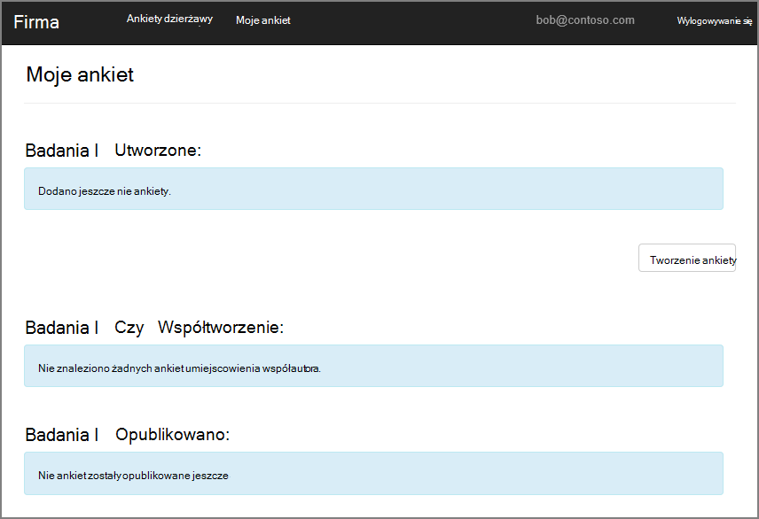
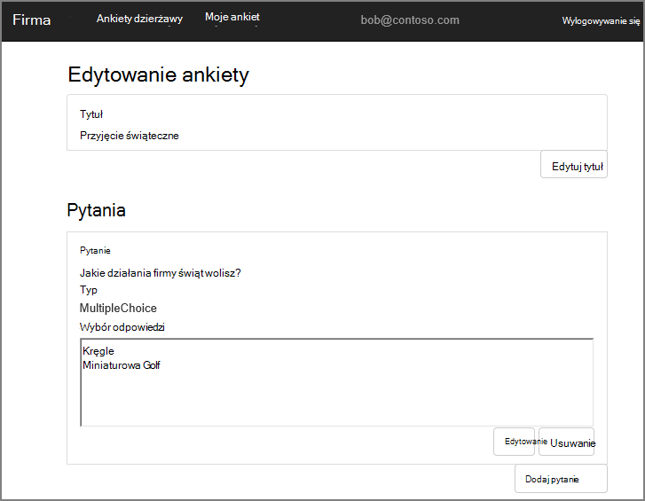
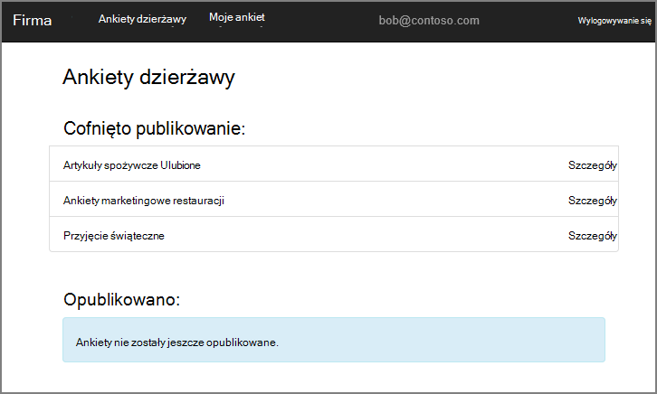
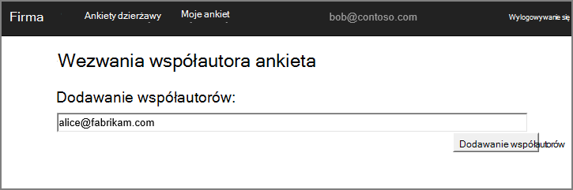
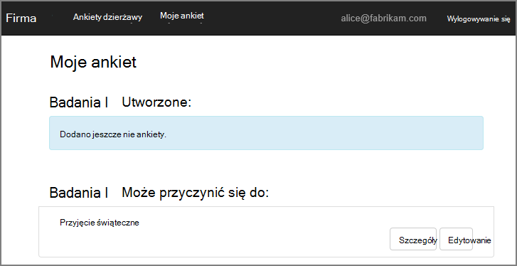
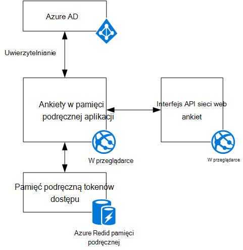

<properties
   pageTitle="Informacje o aplikacji ankiet firma | Microsoft Azure"
   description="Omówienie aplikacji ankiet firma"
   services=""
   documentationCenter="na"
   authors="MikeWasson"
   manager="roshar"
   editor=""
   tags=""/>

<tags
   ms.service="guidance"
   ms.devlang="dotnet"
   ms.topic="article"
   ms.tgt_pltfrm="na"
   ms.workload="na"
   ms.date="05/23/2016"
   ms.author="mwasson"/>

# Informacje o aplikacji firma ankiet

[AZURE.INCLUDE [pnp-header](../../includes/guidance-pnp-header-include.md)]

Ten artykuł jest [częścią serii]. Istnieje także kompletnego [przykładowej aplikacji] dostarczonej z tej serii.

Firma jest fikcyjny firmy, która jest opracowywania aplikacji władz akredytacji bezpieczeństwa, o nazwie ankiety. Ta aplikacja umożliwia organizacjom tworzenie i publikowanie online ankiety.

- Organizacja mogą tworzyć konta dla aplikacji.
- Po podpisaniu organizacji użytkownicy mogli logować się do aplikacji przy użyciu poświadczeń organizacji.
- Użytkowników można tworzyć, edytować i publikować ankiety.

> [AZURE.NOTE] Aby rozpocząć pracę z aplikacją, zobacz [Uruchamianie aplikacji ankiety].

## Użytkownicy mogą tworzyć, edytować i wyświetlać ankiet

Żaden uwierzytelniony użytkownik można wyświetlić wszystkie ankiety, które dana osoba utworzyła lub współautora uprawnieniami do i tworzyć nowe ankiety. Zwróć uwagę, że użytkownik jest zalogowany przy użyciu tożsamości organizacyjnej `bob@contoso.com`.

Na tym zrzucie ekranu przedstawia stronę Edytowanie ankiety:

Użytkownicy mogą także wyświetlać ankiety, wszelkie utworzone przez innych użytkowników w ramach tej samej dzierżawy.

## Właściciele ankiety można zaprosić uczestników

Gdy użytkownik tworzy ankiety, można zaprosić inne osoby być współautorami na ankietę. Współautorzy mogą edytować ankiety, ale nie można usunąć ani publikować.  

Użytkownik może dodać współautorzy z innych dzierżaw umożliwiające współużytkowanie zasobów między dzierżawy. W tym zrzucie ekranu, Robert (`bob@contoso.com`) jest dodanie Alicja (`alice@fabrikam.com`) jako współautora ankietę, utworzony przez Roberta.

Po zalogowaniu się Alicja widzi ankiety wymienione w obszarze "Mogą współtworzyć ankiet".

Zauważ, że Alicja zaloguje się do swojej dzierżawy, nie jako gość dzierżawy Contoso. Alicja ma uprawnienia współautora tylko dla tej ankiety &mdash; osoba nie można wyświetlić inne badania z dzierżawy Contoso.

## Architektura

Aplikacja ankiet składa się z frontonu sieci web i interfejsu API sieci web wewnętrznej bazie danych. Obie są wykonywane przy użyciu [programu ASP.NET Core 1.0].

Aplikacja sieci web używa usługi Azure Active Directory (Azure AD) do uwierzytelniania użytkowników. Aplikacja sieci web również połączeń Azure AD uzyskać tokeny dostępu OAuth 2 interfejs API sieci Web. Tokeny dostępu w pamięci podręcznej w pamięci podręcznej Azure Redis. Pamięć podręczną umożliwia wielu wystąpień udostępnianie samej pamięci podręcznej tokenów (na przykład w przypadku farmy serwerów).

## Następne kroki

- Przeczytaj artykuł dalej w tej serii: [Uwierzytelnianie w multitenant aplikacji, za pomocą usługi Azure Active Directory i łączenie OpenID][authentication]

<!-- Links -->

[authentication]: guidance-multitenant-identity-authenticate.md
[częścią serii]: guidance-multitenant-identity.md
[Uruchamianie aplikacji ankiet]: https://github.com/Azure-Samples/guidance-identity-management-for-multitenant-apps/blob/master/docs/running-the-app.md
[Podstawowe ASP.NET 1.0]: https://docs.asp.net/en/latest/
[Przykładowa aplikacja]: https://github.com/Azure-Samples/guidance-identity-management-for-multitenant-apps
