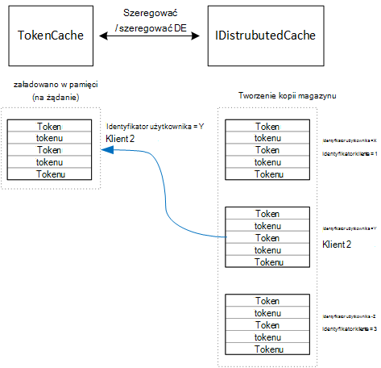

<properties
   pageTitle="Buforowanie tokeny dostęp w aplikacji multitenant | Microsoft Azure"
   description="Buforowanie tokeny dostępu używanych do wywoływania wewnętrznej bazy danych interfejs API sieci Web"
   services=""
   documentationCenter="na"
   authors="MikeWasson"
   manager="roshar"
   editor=""
   tags=""/>

<tags
   ms.service="guidance"
   ms.devlang="dotnet"
   ms.topic="article"
   ms.tgt_pltfrm="na"
   ms.workload="na"
   ms.date="02/16/2016"
   ms.author="mwasson"/>


# <a name="caching-access-tokens-in-a-multitenant-application"></a>Buforowanie tokeny dostępu w aplikacji multitenant

[AZURE.INCLUDE [pnp-header](../../includes/guidance-pnp-header-include.md)]

Ten artykuł jest [częścią serii]. Istnieje także kompletnego [przykładowej aplikacji] dostarczonej z tej serii.

Jest stosunkowo drogich uzyskiwania dostępu OAuth tokenu, ponieważ wymaga żądania HTTP token punktu końcowego. Dlatego warto tokeny pamięci podręcznej, o ile to możliwe. [Azure AD Authentication Library] [ ADAL] (ADAL) automatycznie umieszcza w pamięci podręcznej tokenów uzyskanego z Azure AD, w tym tokeny odświeżania.

ADAL zawiera Domyślna implementacja pamięci podręcznej tokenów. Jednak token pamięci podręcznej jest przeznaczony dla aplikacji klientami i się _nie_ odpowiednie dla aplikacji sieci web:

-   To wystąpienie statyczne i bezpieczeństwo wątków.
-   Nie Skaluj do dużej liczby użytkowników, ponieważ tokeny wszystkim użytkownikom przejdź do samej słownika.
-   Nie można udostępnić na serwerach sieci web w farmie.

Zamiast tego wykonała niestandardowe tokenu pamięci podręcznej, który pochodzi od ADAL `TokenCache` klasy ale nadaje się do środowiska serwera, a także pożądane stopnia izolacji między tokenów dla różnych użytkowników.

`TokenCache` Klasy przechowuje słownika tokeny indeksowane przez wystawcy, zasobów, identyfikator klienta i użytkownika. Niestandardowe pamięci podręcznej tokenów należy zapisać ten słownik do sklepu kopii, na przykład Redis pamięci podręcznej.

W aplikacji ankiet firma `DistributedTokenCache` klasy wykonuje token pamięci podręcznej. Ta implementacja używa [IDistributedCache] [ distributed-cache] abstrakcji programu ASP.NET Core 1.0. W ten sposób wszelkie `IDistributedCache` implementacji może być używany jako magazynu kopii.

-   Domyślnie aplikacja ankiet korzysta z pamięci podręcznej Redis.
-   Dla jednego wystąpienia serwera, można użyć programu ASP.NET Core 1.0 [w pamięci podręcznej][in-memory-cache]. (To również jest dobrym rozwiązaniem do uruchamiania aplikacji lokalnie w czasie projektowania.)

> [AZURE.NOTE] Pamięć podręczną Redis nie jest obecnie obsługiwane w podstawowych .NET.

`DistributedTokenCache`jako pary klucz wartość w magazynie kopii są magazynowane dane pamięci podręcznej. Klucz jest identyfikator użytkownika oraz identyfikator klienta, więc magazynu kopii przechowywane dane osobnych pamięci podręcznej dla każdej unikatowych kombinacji użytkownika/klienta.



Magazyn kopii jest podzielona przez użytkownika. Dla każdego żądania HTTP tokenów dla tego użytkownika są odczytywane z magazynu kopii i ładowane do `TokenCache` słownika. Jeśli Redis służy do przechowywania kopii każde wystąpienie serwera w przypadku farmy serwerów odczytuje i zapisuje w tym samym pamięci podręcznej, a także tej metody wielu użytkowników.

## <a name="encrypting-cached-tokens"></a>Zaszyfrowanie tokeny pamięci podręcznej

Tokeny są poufne dane, ponieważ są udzielić dostępu do zasobów dla użytkowników. (Ponadto, w odróżnieniu od hasła użytkownika, nie można po prostu przechowywać skrótu tokenu.) Dlatego jest krytyczne ochrony tokenów przed ich wykorzystaniem. Pamięci podręcznej Redis jest chroniony hasłem, ale jeśli ktoś otrzymuje hasło, ich można pobrać wszystkie tokeny dostępu pamięci podręcznej. Z tego powodu `DistributedTokenCache` są szyfrowane wszystkie zasoby, które zapisuje w magazynie kopii. Szyfrowanie odbywa się za pomocą programu ASP.NET Core 1.0 [Ochrona danych] [ data-protection] interfejsów API.

> [AZURE.NOTE] Po zainstalowaniu do witryny sieci Web Azure kluczy szyfrowania kopii zapasowej do magazynu sieci i zsynchronizowane na wszystkich komputerach (zobacz [Key Management][key-management]). Domyślnie klucze nie są szyfrowane podczas uruchamiania w Azure witryn sieci Web, ale można [włączyć szyfrowanie za pomocą certyfikat X.509][x509-cert-encryption].


## <a name="distributedtokencache-implementation"></a>Implementacja DistributedTokenCache

[DistributedTokenCache] [ DistributedTokenCache] klasa pochodzi z ADAL [TokenCache] [ tokencache-class] zajęć.

W Konstruktorze `DistributedTokenCache` klasy tworzy klucz dla bieżącego użytkownika i załadowanie pamięci podręcznej ze sklepu kopii:

```csharp
public DistributedTokenCache(
    ClaimsPrincipal claimsPrincipal,
    IDistributedCache distributedCache,
    ILoggerFactory loggerFactory,
    IDataProtectionProvider dataProtectionProvider)
    : base()
{
    _claimsPrincipal = claimsPrincipal;
    _cacheKey = BuildCacheKey(_claimsPrincipal);
    _distributedCache = distributedCache;
    _logger = loggerFactory.CreateLogger<DistributedTokenCache>();
    _protector = dataProtectionProvider.CreateProtector(typeof(DistributedTokenCache).FullName);
    AfterAccess = AfterAccessNotification;
    LoadFromCache();
}
```

Klucz zostanie utworzony przez połączenie identyfikator użytkownika i identyfikator klienta. Oba te są pobierane z roszczeń znaleziony w użytkownika `ClaimsPrincipal`:

```csharp
private static string BuildCacheKey(ClaimsPrincipal claimsPrincipal)
{
    string clientId = claimsPrincipal.FindFirstValue("aud", true);
    return string.Format(
        "UserId:{0}::ClientId:{1}",
        claimsPrincipal.GetObjectIdentifierValue(),
        clientId);
}
```

Aby załadować dane pamięci podręcznej, przeczytaj seryjnych obiektów blob z magazynu kopii, a połączenie `TokenCache.Deserialize` do konwertowania obiektów blob w pamięci podręcznej danych.

```csharp
private void LoadFromCache()
{
    byte[] cacheData = _distributedCache.Get(_cacheKey);
    if (cacheData != null)
    {
        this.Deserialize(_protector.Unprotect(cacheData));
    }
}
```

Gdy ADAL dostęp do pamięci podręcznej, uruchamiana `AfterAccess` zdarzenia. Jeśli dane pamięci podręcznej zostały zmienione, `HasStateChanged` właściwość ma wartość true. W takim przypadku zaktualizuj magazynie kopii w celu odzwierciedlenia zmian, a następnie ustaw `HasStateChanged` do FAŁSZ.

```csharp
public void AfterAccessNotification(TokenCacheNotificationArgs args)
{
    if (this.HasStateChanged)
    {
        try
        {
            if (this.Count > 0)
            {
                _distributedCache.Set(_cacheKey, _protector.Protect(this.Serialize()));
            }
            else
            {
                // There are no tokens for this user/client, so remove the item from the cache.
                _distributedCache.Remove(_cacheKey);
            }
            this.HasStateChanged = false;
        }
        catch (Exception exp)
        {
            _logger.WriteToCacheFailed(exp);
            throw;
        }
    }
}
```

TokenCache wysyła dwa inne zdarzenia:

- `BeforeWrite`. O nazwie bezpośrednio przed ADAL zapisuje w pamięci podręcznej. Umożliwia to wdrożenie strategii współbieżności
- `BeforeAccess`. O nazwie bezpośrednio przed ADAL odczytuje z pamięci podręcznej. W tym miejscu można załadować ponownie pamięć podręczną, aby pobrać najnowszą wersję.

W naszym przypadku firma Microsoft zdecydowała nie obsługiwać tych dwóch zdarzeń.

- Aby uzyskać współbieżności ostatniego zapisu wins. Przycisk OK, jest tak, ponieważ tokeny są przechowywane niezależnie dla każdego użytkownika + klienta, więc konflikt tylko się stanie, jeśli użytkownik miał dwa równoczesne sesji.
- Czytanie, możemy Załaduj pamięci podręcznej na każde żądanie. Żądania są krótko. Zmodyfikowany pamięci podręcznej otrzymuje w tym okresie, następnego żądania wpłynie na nową wartość.

## <a name="next-steps"></a>Następne kroki

- Przeczytaj artykuł dalej w tej serii: [Federating z usług AD FS klienta multitenant aplikacji Azure][adfs]

<!-- links -->
[ADAL]: https://msdn.microsoft.com/library/azure/jj573266.aspx
[adfs]: guidance-multitenant-identity-adfs.md
[data-protection]: https://docs.asp.net/en/latest/security/data-protection/index.html
[distributed-cache]: https://docs.asp.net/en/latest/fundamentals/distributed-cache.html
[DistributedTokenCache]: https://github.com/Azure-Samples/guidance-identity-management-for-multitenant-apps/blob/master/src/Tailspin.Surveys.TokenStorage/DistributedTokenCache.cs
[key-management]: https://docs.asp.net/en/latest/security/data-protection/configuration/default-settings.html
[in-memory-cache]: https://docs.asp.net/en/latest/fundamentals/caching.html
[tokencache-class]: https://msdn.microsoft.com/library/azure/microsoft.identitymodel.clients.activedirectory.tokencache.aspx
[x509-cert-encryption]: https://docs.asp.net/en/latest/security/data-protection/implementation/key-encryption-at-rest.html#x-509-certificate
[częścią serii]: guidance-multitenant-identity.md
[Przykładowa aplikacja]: https://github.com/Azure-Samples/guidance-identity-management-for-multitenant-apps
