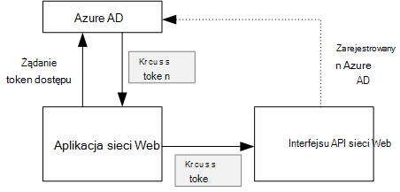
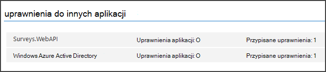

<properties
   pageTitle="Zabezpieczanie wewnętrznej bazy danych interfejsu API sieci web w aplikacji multitenant | Microsoft Azure"
   description="Zabezpieczania wewnętrznej bazy danych interfejsu API sieci web"
   services=""
   documentationCenter="na"
   authors="MikeWasson"
   manager="roshar"
   editor=""
   tags=""/>

<tags
   ms.service="guidance"
   ms.devlang="dotnet"
   ms.topic="article"
   ms.tgt_pltfrm="na"
   ms.workload="na"
   ms.date="06/02/2016"
   ms.author="mwasson"/>

# <a name="securing-a-backend-web-api-in-a-multitenant-application"></a>Zabezpieczanie wewnętrznej bazy danych interfejsu API sieci web w aplikacji multitenant

[AZURE.INCLUDE [pnp-header](../../includes/guidance-pnp-header-include.md)]

Ten artykuł jest [częścią serii]. Istnieje także kompletnego [przykładowej aplikacji] dostarczonej z tej serii.

Aplikacja [Ankiet firma] używa wewnętrznej bazy danych sieci web interfejsu API do zarządzania OBSŁUGIWAŁ operacje na ankiety. Na przykład gdy użytkownik kliknie "Moje ankiet", aplikacji sieci web wysyła żądania HTTP do interfejsu API sieci web:

```
GET /users/{userId}/surveys
```

Interfejsu API sieci web zwraca obiekt JSON:

```
{
  "Published":[],
  "Own":[
    {"Id":1,"Title":"Survey 1"},
    {"Id":3,"Title":"Survey 3"},
    ],
  "Contribute": [{"Id":8,"Title":"My survey"}]
}
```

Interfejsu API sieci web nie jest możliwe anonimowe żądania, więc aplikacji sieci web musi zostać uwierzytelniony tokeny okaziciela OAuth 2.

> [AZURE.NOTE] Jest to scenariusz do serwera. Aplikacja nie powoduje żadnych wywołań AJAX API w kliencie przeglądarki.

Istnieją dwie metody głównym, które możesz wykonać:

- Delegowani tożsamość użytkownika. Uwierzytelnianie aplikacji sieci web przy użyciu tożsamości użytkownika.
- Tożsamość aplikacji. Uwierzytelnianie aplikacji sieci web przy użyciu Identyfikatora klienta, za pomocą przepływu poświadczeń klienta uwierzytelnianie OAuth2.

Aplikacja firma wykonuje tożsamość użytkownika delegowanych. Oto główne różnice:

**Tożsamość użytkownika delegowanego**

- Token okaziciela wysyłane do interfejsu API sieci web zawiera tożsamość użytkownika.
- Interfejsu API sieci web sprawia, że decyzje dotyczące autoryzacji na podstawie tożsamości użytkownika.
- Aplikacja sieci web musi obsługiwać 403 błędy (Dostęp zabroniony) z sieci web API, jeśli użytkownik nie jest autoryzowany ma wykonywać akcję.
- Zazwyczaj aplikacji sieci web nadal służy do kilku decyzji autoryzacji, które mają wpływ na interfejsu użytkownika, takie jak Pokazywanie lub ukrywanie elementów interfejsu użytkownika).
- Interfejs API sieci web potencjalnie mogą być używane przez klientów niezaufanych, takich jak aplikację JavaScript lub klientami.

**Tożsamość aplikacji**

- Interfejsu API sieci web nie uzyskuje informacje o użytkowniku.
- Interfejsu API sieci web nie można wykonać dowolną aplikację na podstawie tożsamości użytkownika. Wszystkie decyzje autoryzacji są wykonywane przez aplikację sieci web.  
- Interfejs API sieci web nie można używać przez niezaufanych klienta (JavaScript lub klientami aplikacji).
- Tej metody może być nieco łatwiej wdrożenia, ponieważ istnieje logiczny nie autoryzacji w interfejsie API sieci Web.

W obu rozwiązaniem aplikacji sieci web, należy najpierw uzyskać token dostępu, który jest poświadczenia wymagane do wywołania interfejsu API sieci web.

- Dla tożsamości użytkownika delegowanego token musi pochodzić z protokołu IDP, może wydawać tokenu w imieniu użytkownika.

- Poświadczenia klienta aplikacji może uzyskać token z protokołu IDP lub udostępniać własny serwer token. (Ale nie pisanie token serwera od podstaw; Wykorzystaj ramy dokładne testowanie, takich jak [IdentityServer3].) Jeśli uwierzytelniania użytkownika z usługą Azure Active Directory, jest zalecane uzyskiwania token dostępu z Azure AD, nawet w przypadku przepływu poświadczeń klienta.

Pozostałe w tym artykule założono, że uwierzytelnia aplikacji z usługą Azure Active Directory.



## <a name="register-the-web-api-in-azure-ad"></a>Rejestrowanie interfejsu API sieci web w Azure AD

Aby Azure AD ogłaszania token okaziciela dla interfejsu API sieci web musisz skonfigurować kilka rzeczy, w Azure AD.

1. [Zarejestruj się w sieci web interfejsu API w Azure AD].

2. Dodawanie identyfikator klienta aplikacji sieci web do oczywiste aplikacji interfejsu API sieci web, w `knownClientApplications` właściwości. Zobacz [Aktualizowanie manifesty aplikacji].

3. [Nadaj uprawnienia aplikacji sieci web, aby nawiązać połączenie interfejsu API sieci web].

  W portalu zarządzania Azure można ustawić dwa typy uprawnień: "Uprawnienia aplikacji" dla tożsamości aplikacji (przepływ poświadczeń klienta) lub "Delegowane uprawnień" dla tożsamości użytkownika delegowanej.

  

## <a name="getting-an-access-token"></a>Wprowadzenie token dostępu

Przed nawiązywania połączeń z interfejsu API sieci web, aplikacji sieci web otrzymuje dostęp token z usługi Azure Active Directory. W aplikacji .NET za pomocą [Azure AD uwierzytelniania biblioteki (ADAL) dla środowiska .NET][ADAL].

W procesie OAuth 2 autoryzacji kod aplikacji wymienia kod autoryzacji token dostępu. Poniższy kod korzysta ADAL, aby uzyskać token dostępu. Kod, jaki jest wywoływana podczas `AuthorizationCodeReceived` zdarzenia.

```csharp
// The OpenID Connect middleware sends this event when it gets the authorization code.   
public override async Task AuthorizationCodeReceived(AuthorizationCodeReceivedContext context)
{
    string authorizationCode = context.ProtocolMessage.Code;
    string authority = "https://login.microsoftonline.com/" + tenantID
    string resourceID = "https://tailspin.onmicrosoft.com/surveys.webapi" // App ID URI
    ClientCredential credential = new ClientCredential(clientId, clientSecret);

    AuthenticationContext authContext = new AuthenticationContext(authority, tokenCache);
    AuthenticationResult authResult = await authContext.AcquireTokenByAuthorizationCodeAsync(
        authorizationCode, new Uri(redirectUri), credential, resourceID);

    // If successful, the token is in authResult.AccessToken
}
```

Poniżej przedstawiono różne parametry, które są potrzebne:

- `authority`. Pochodny od Identyfikatora dzierżawy zalogowania użytkownika. (Nie identyfikator dzierżawy dostawcy władz akredytacji bezpieczeństwa)  
- `authorizationCode`. Kod auth powrocie z protokołu IDP.
- `clientId`. Identyfikator aplikacji sieci web klienta.
- `clientSecret`. Tajny klienta aplikacji sieci web.
- `redirectUri`. Przekieruj połączenie URI ustawionego dla OpenID. Jest to miejsce, w którym protokołu IDP wywołuje przy użyciu tokenu.
- `resourceID`. Aplikacja identyfikator identyfikator URI web API, której został utworzony podczas rejestrowania interfejsu API sieci web w Azure AD
- `tokenCache`. Obiekt buforowanie tokeny dostępu. Zobacz [Token pamięci podręcznej].

Jeśli `AcquireTokenByAuthorizationCodeAsync` zakończyło się powodzeniem, ADAL buforowanie tokenu. Później możesz uzyskać tokenu z pamięci podręcznej, dzwoniąc AcquireTokenSilentAsync:

```csharp
AuthenticationContext authContext = new AuthenticationContext(authority, tokenCache);
var result = await authContext.AcquireTokenSilentAsync(resourceID, credential, new UserIdentifier(userId, UserIdentifierType.UniqueId));
```

miejsce, w którym `userId` jest identyfikator obiektu użytkownika, który znajduje się w `http://schemas.microsoft.com/identity/claims/objectidentifier` rościć sobie.

## <a name="using-the-access-token-to-call-the-web-api"></a>Nawiązywanie połączenia interfejsu API sieci web przy użyciu token dostępu

Po umieszczeniu token, wyślij go w nagłówku autoryzacji żądania HTTP do interfejsu API sieci web.

```
Authorization: Bearer xxxxxxxxxx
```

Z poniższej metody rozszerzenia z poziomu aplikacji ankiet ustawia nagłówek autoryzacji żądania HTTP, za pomocą klasy **HttpClient** .

```csharp
public static async Task<HttpResponseMessage> SendRequestWithBearerTokenAsync(this HttpClient httpClient, HttpMethod method, string path, object requestBody, string accessToken, CancellationToken ct)
{
    var request = new HttpRequestMessage(method, path);
    if (requestBody != null)
    {
        var json = JsonConvert.SerializeObject(requestBody, Formatting.None);
        var content = new StringContent(json, Encoding.UTF8, "application/json");
        request.Content = content;
    }

    request.Headers.Authorization = new AuthenticationHeaderValue("Bearer", accessToken);
    request.Headers.Accept.Add(new MediaTypeWithQualityHeaderValue("application/json"));

    var response = await httpClient.SendAsync(request, ct);
    return response;
}
```

> [AZURE.NOTE] Zobacz [HttpClientExtensions.cs].

## <a name="authenticating-in-the-web-api"></a>Uwierzytelnianie w interfejsu API sieci web

Interfejsu API sieci web ma przeprowadzać uwierzytelniania token okaziciela. W ASP.NET Core 1.0, można użyć [Microsoft.AspNet.Authentication.JwtBearer] [ JwtBearer] pakiet. Ten pakiet zawiera oprogramowanie pośrednie, które umożliwia aplikacji odbierać połączenia OpenID tokeny okaziciela.

Rejestrowanie pośredniczącym w sieci web interfejsu API `Startup` zajęć.

```csharp
app.UseJwtBearerAuthentication(options =>
{
    options.Audience = "[app ID URI]";
    options.Authority = "https://login.microsoftonline.com/common/";
    options.TokenValidationParameters = new TokenValidationParameters
    {
        //Instead of validating against a fixed set of known issuers, we perform custom multi-tenant validation logic
        ValidateIssuer = false,
    };
    options.Events = new SurveysJwtBearerEvents();
});
```

> [AZURE.NOTE] Zobacz [Startup.cs].

- **Grupy odbiorców**. Ustaw tę opcję, aby adres URL identyfikator aplikacji sieci web interfejs API, który został utworzony podczas rejestrowania interfejsu API sieci web z usługą Azure Active Directory.
- **Urząd**. W przypadku multitenant aplikacji można ustawić `https://login.microsoftonline.com/common/`.
- **TokenValidationParameters**. W przypadku aplikacji multitenant ustaw **ValidateIssuer** ma wartość FAŁSZ. Oznacza to, że aplikacja będzie sprawdzać poprawność wystawcy.
- **Zdarzenia** jest klasa pochodzi z **JwtBearerEvents**.

### <a name="issuer-validation"></a>Sprawdzanie poprawności wystawcy

Sprawdź poprawność wystawcy tokenów w zdarzeniu **JwtBearerEvents.ValidatedToken** . Wystawcy zostanie wysłany roszczeń "firmy".

W aplikacji ankiet interfejsu API sieci web nie obsługują [tworzenia konta dzierżawy]. Dlatego po prostu sprawdza Jeśli wystawcy jest już bazy danych aplikacji. W przeciwnym razie go generuje wyjątek, co powoduje niepowodzenie uwierzytelnienia.

```csharp
public override async Task ValidatedToken(ValidatedTokenContext context)
{
    var principal = context.AuthenticationTicket.Principal;
    var tenantManager = context.HttpContext.RequestServices.GetService<TenantManager>();
    var userManager = context.HttpContext.RequestServices.GetService<UserManager>();
    var issuerValue = principal.GetIssuerValue();
    var tenant = await tenantManager.FindByIssuerValueAsync(issuerValue);

    if (tenant == null)
    {
        // the caller was not from a trusted issuer - throw to block the authentication flow
        throw new SecurityTokenValidationException();
    }
}
```

> [AZURE.NOTE] Zobacz [SurveysJwtBearerEvents.cs].

Za pomocą zdarzenia **ValidatedToken** zrobić [przekształcania oświadczeń]. Pamiętaj, że roszczeń pochodzą bezpośrednio z Azure AD, więc jeśli aplikacji sieci web zarejestrowano dowolnych przekształceń roszczeń, te nie są uwzględniane w token okaziciela że otrzyma interfejsu API sieci web.

## <a name="authorization"></a>Autoryzacja

Ogólne omówienie autoryzacji, zobacz [Autoryzacja oparta na rolach i opartych na zasobach][Authorization]. 

Pośredniczącym JwtBearer obsługuje odpowiedzi autoryzacji. Na przykład aby ograniczyć akcję kontroler dla uwierzytelnionych użytkowników, użyj atrribute **[Autoryzuj]** i określ **JwtBearerDefaults.AuthenticationScheme** jako schemat uwierzytelniania:

```csharp
[Authorize(ActiveAuthenticationSchemes = JwtBearerDefaults.AuthenticationScheme)]
```

Zwraca kodu stanu 401, jeśli użytkownik nie jest uwierzytelniony.

Aby ograniczyć akcji kontroler przez zasady authorizaton, określ nazwę zasady atrybutu **[Autoryzuj]** :

```csharp
[Authorize(Policy = PolicyNames.RequireSurveyCreator)]
```

Zwraca kodu stanu 401, jeśli użytkownik nie jest uwierzytelniony i 403 Jeśli użytkownik jest uwierzytelniony, ale nie masz uprawnienia. Zarejestruj się zasad podczas uruchamiania:

```csharp
public void ConfigureServices(IServiceCollection services)
{
    services.AddAuthorization(options =>
    {
        options.AddPolicy(PolicyNames.RequireSurveyCreator,
            policy =>
            {
                policy.AddRequirements(new SurveyCreatorRequirement());
                policy.AddAuthenticationSchemes(JwtBearerDefaults.AuthenticationScheme);
            });
    });
}
```

## <a name="next-steps"></a>Następne kroki

- Przeczytaj artykuł dalej w tej serii: [buforowanie tokeny dostępu w aplikacji multitenant][token cache]

<!-- links -->
[ADAL]: https://msdn.microsoft.com/library/azure/jj573266.aspx
[JwtBearer]: https://www.nuget.org/packages/Microsoft.AspNet.Authentication.JwtBearer
[częścią serii]: guidance-multitenant-identity.md
[Firma ankiet]: guidance-multitenant-identity-tailspin.md
[IdentityServer3]: https://github.com/IdentityServer/IdentityServer3
[Rejestrowanie interfejsu API sieci web w Azure AD]: https://github.com/Azure-Samples/guidance-identity-management-for-multitenant-apps/blob/master/docs/running-the-app.md#register-the-surveys-web-api
[Aktualizowanie manifesty aplikacji]: https://github.com/Azure-Samples/guidance-identity-management-for-multitenant-apps/blob/master/docs/running-the-app.md#update-the-application-manifests
[Nadaj uprawnienia aplikacji sieci web, aby nawiązać połączenie interfejsu API sieci web]: https://github.com/Azure-Samples/guidance-identity-management-for-multitenant-apps/blob/master/docs/running-the-app.md#give-the-web-app-permissions-to-call-the-web-api
[Buforowanie tokenu]: guidance-multitenant-identity-token-cache.md
[HttpClientExtensions.cs]: https://github.com/Azure-Samples/guidance-identity-management-for-multitenant-apps/blob/master/src/Tailspin.Surveys.Common/HttpClientExtensions.cs
[Startup.CS]: https://github.com/Azure-Samples/guidance-identity-management-for-multitenant-apps/blob/master/src/Tailspin.Surveys.WebAPI/Startup.cs
[dzierżawy zapisów]: guidance-multitenant-identity-signup.md
[SurveysJwtBearerEvents.cs]: https://github.com/Azure-Samples/guidance-identity-management-for-multitenant-apps/blob/master/src/Tailspin.Surveys.WebAPI/SurveyJwtBearerEvents.cs
[Transformacja oświadczeń]: guidance-multitenant-identity-claims.md#claims-transformations
[Authorization]: guidance-multitenant-identity-authorize.md
[Przykładowa aplikacja]: https://github.com/Azure-Samples/guidance-identity-management-for-multitenant-apps
[token cache]: guidance-multitenant-identity-token-cache.md
