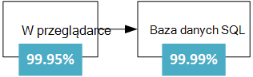
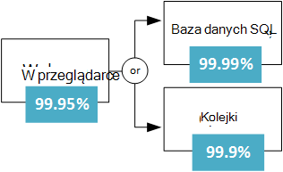
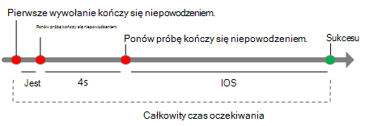
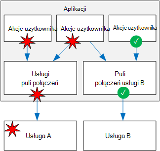

<properties
   pageTitle="Projektowanie aplikacji mechanizm | Microsoft Azure"
   description="Sposoby tworzenia mechanizm aplikacji w Azure, wysoka odzyskiwania dostępności i awarii."
   services=""
   documentationCenter="na"
   authors="MikeWasson"
   manager="christb"
   editor=""
   tags=""/>

<tags
   ms.service="guidance"
   ms.devlang="na"
   ms.topic="article"
   ms.tgt_pltfrm="na"
   ms.workload="na"
   ms.date="08/18/2016"
   ms.author="mwasson"/>
   
# Projektowanie mechanizm aplikacji dla Azure

W układzie rozłożone stanie błędy. Sprzęt może się nie powieść. Sieci może zawierać błędy przejściowych. Sporadycznie całej usługi lub regionu mogą wystąpić przerwy w pracy, ale nawet te muszą być planowane dla. 

Tworzenie niezawodne aplikacji w chmurze różni się od konstruowania niezawodne aplikacji ustawienie przedsiębiorstwa.  Gdy ze względów historycznych może zakupiono sprzętu wysokiej klasy rozbudowy, w środowisku chmury użytkownik musi skalowania zamiast w górę. Koszty środowiska chmury są zachowywane niskim za pomocą sprzętu towaru. Zamiast skupianie uwagi na zapobieganie błędów i optymalizowania "Średni czas między awariami", w tym nowym środowisku fokus jest przenoszony "oznacza raz, aby przywrócić". Celem jest zminimalizować awarii.

Ten artykuł zawiera omówienie sposobu tworzenia mechanizm aplikacji Microsoft Azure. Rozpoczyna się z definicją terminów *elastyczność* i związanych z nimi pojęć. Następnie opisuje proces uzyskania elastyczność przy użyciu podejście strukturalnych w całej aplikacji projektowanie i wdrażanie, wdrażania i operacji.

## Co to jest elastyczność?

**Elastyczność** jest możliwość odzyskiwanie z błędów i nadal działać. Nie jest o *można uniknąć* błędów, ale *odpowiadać* na awarie w taki sposób, aby uniknąć utraty danych lub przestoje. Celem elastyczność jest zwracana aplikacji do pełnej funkcjonalności po awarii.

Dwóch ważnych aspektów elastyczność są wysokiej dostępności i awarii.

- **Wysoka dostępność** (HA) jest możliwość stosowania działanie w trybie prawidłowy, bez znacznej przestoje. Przez "Państwo prawidłowy," Firma Microsoft oznacza aplikacja jest odpowiada, a użytkownicy mogą połączyć się z aplikacją i interaktywnie.  

- **Odzyskiwanie** (DR) jest możliwość odzyskiwanie z rzadkich, ale głównych zdarzeń: nie zmiennych, skali wide błędów, takich jak działaniu usługi, który ma wpływ na całym regionie. Odzyskiwanie zawiera tworzenia kopii zapasowych i archiwizacji i może obejmować ręcznego interwencji, takie jak przywracanie z kopii zapasowej bazy danych. 

Jednym ze sposobów wziąć pod uwagę HA i DR jest wpływ błąd przekroczenia funkcji projektowania HA będzie przetwarzał zaczyna się DR. Na przykład wprowadzenie kilku maszyny wirtualne za równoważenia obciążenia zapewni dostępność jednego maszyn wirtualnych kończy się niepowodzeniem, ale nie w przypadku, gdy są one wszystkie się nie powieść, w tym samym czasie. 

Podczas projektowania aplikacji mechanizm masz opis wymagań dotyczących dostępności. Ile kosztuje przestoje jest do przyjęcia? Częściowo jest funkcja kosztu. Ile będzie kosztować firmy w potencjalnych przestoje? Ile należy możesz inwestycji w wysoce udostępnianie aplikacji? Należy zdefiniować znaczenie dla aplikacji, które mają być dostępne. Na przykład jest aplikacji "w dół", jeśli klienta przesłaniem zamówienia, ale system nie może przetworzyć go w normalny okres?

Inna nazwa typowych jest **ciągłości** (BC), która jest możliwość wykonywania funkcje podstawowe firm podczas i po awarii. BC obejmuje cała operacja jej działalności, w tym pomieszczeń, osoby, komunikacji, transportu, a IT. W tym artykule firma Microsoft po prostu jest ograniczony do aplikacje w chmurze, ale planowania odporność musi odbywać się w kontekście ogólnego wymagania BC. 

## Proces uzyskanie elastyczności

Elastyczność nie jest dodatek. Musi być przeznaczona do systemu i wprowadzane do zastosowania w praktyce. Poniżej przedstawiono ogólne modelu do obserwowania:

1.  **Definiowanie** wymagań dotyczących dostępności, w zależności od potrzeb biznesowych

2.  **Projektowanie** stosowania elastyczność. Zacznij architektura znajdujący się sprawdzone wskazówki i identyfikowanie punktów możliwe niepowodzenie w danej architektury.

3.  **Wdrożenie** strategii wykrywanie i odzyskiwanie z błędy. 

4.  **Test** implementacji symulowanie błędów i powodujące wymuszonego praca awaryjna. 

5.  **Wdrażanie** aplikacji do produkcji przy użyciu wiarygodnych, powtarzalnych procesów. 

6.  **Monitorowanie** aplikacji w celu wykrycia błędów. Monitorowanie systemu, można ocenić kondycji aplikacji i odpowiadanie na przypadki, w razie potrzeby. 

7.  **Odpowiadanie** , jeśli istnieją zdarzeń wymagających interwencji ręcznego.

W dalszej części tego artykułu omówimy każdy z tych kroków bardziej szczegółowo.

## Definiowanie wymagań dotyczących elastyczności

Planowanie elastyczność zaczyna się od potrzeb biznesowych. Poniżej przedstawiono kilka metod dla Myślę o elastyczność w tych terminów.

### Których przedstawiany przez obciążenie pracą

Wiele rozwiązań chmury się składać z wielu zadań aplikacji. "Obciążenie", w tym kontekście oznacza osobne możliwości lub komputerowych zadania, które mogą być w logiczny sposób oddzielone od innych zadań, w odniesieniu do wymagań miejsca do magazynowania logiki i danych biznesowych. Na przykład aplikacji elektronicznego mogą zawierać następujące obciążenia:

- Przeglądanie i przeszukiwanie katalogu produktów.

- Tworzenie i śledzenie zamówień.

- Wyświetlanie zalecenia.

Obciążenie może być różne wymagania dotyczące dostępności, skalowalność, spójności danych, odzyskiwanie i tak dalej. Ponownie są decyzji biznesowych.

Również wziąć pod uwagę upodobania. Czy istnieją określonych okresów krytycznych po systemu muszą być dostępne? Na przykład usługa przechowywanie podatek nie można zainstalować w dół bezpośrednio przed terminem zgłoszenia; klip wideo strumieniowego przesyłania usługi musi pozostać w górę podczas zdarzeń duży sports; i tak dalej. Okresach krytyczne może być zbędne wdrożeń w kilku regionach, aby aplikacja może nie działać na Jeśli jeden region nie powiodła się. Jednak wdrażania wielu region jest bardziej drogich, dlatego czasie mniej ważnych, może uruchomić aplikację w jednym regionie.  

### RTO i RPO

Dwie ważne metryki brać pod uwagę są celem czasu odzyskiwania i odzyskiwania punktów cel:

- **Cel czasu odzyskiwania** (RTO) jest maksymalny dopuszczalne czas aplikacji mogą być niedostępne po zdarzenia. Jeśli usługi RTO jest 90 minut, należy przywrócić stosowania stan uruchomiony w ciągu 90 minut od początku awarii. Jeśli masz bardzo niskie RTO może przechowywać wdrożeniu drugiego stale uruchomiony w stanie wstrzymania do ochrony przed regionalne awarii.

- **Odzyskiwanie punktu cel** (RPO) jest maksymalny czas trwania utracie danych, która jest do przyjęcia podczas awarii. Na przykład przechowywania danych w jednej bazie danych, z replikacja nie do innych baz danych i wykonywać kopie zapasowe co godzinę, może spowodować utratę maksymalnie godzinę danych. 

RTO i RPO są wymagań. Innej jednostki metryczne typowych jest **międzyczasie odzyskać** (MTTR), czyli Średni czas potrzebny do przywrócić aplikację po awarii. MTTR jest empiryczne faktów o systemie. Jeśli MTTR przekracza RTO, następnie awarii w systemie spowoduje zakłócenia firm do przyjęcia, ponieważ nie będzie możliwe przywrócenie systemu w określonych RTO. 

### Systemy

Platformy Azure, [Umowa dotycząca poziomu usług] [ sla] (SLA) w tym artykule opisano zobowiązań firmy Microsoft łączności i czas pracy. Jeśli umowa dotycząca poziomu usług dla określonej usługi jest 99,9%, oznacza to, że należy się spodziewać usługi w celu udostępnienia 99,9% czasu.

> [AZURE.NOTE] Umowa dotycząca poziomu usług Azure także przepisy w celu uzyskania kredytowej usługi, jeśli umowa dotycząca poziomu usług nie jest spełniony, wraz z określonym definicji "dostępność" dla każdej usługi. Element SLA działa jako wymuszania zasad. 

Należy zdefiniować własne docelowej zwiększany dla każdego obciążenie pracą w rozwiązaniu. Umowa dotycząca poziomu usług umożliwia powodu o architektury, i czy architektura spełnia wymagania. Na przykład jeśli obciążenie pracą wymaga przestojów 99,99%, ale zależy od usługi z SLA 99,9%, tej usługi nie mogą być jednego miejsca awarii w systemie. Jeden zadośćuczynienia jest ma alternatywnych ścieżki na wypadek awarii usługi lub inne środki, aby przywrócić awarii w tej usłudze. 

W poniższej tabeli przedstawiono potencjalne przestoje skumulowanego dla różnych poziomów Umowa dotycząca poziomu usług. 

| UMOWA DOTYCZĄCA POZIOMU USŁUG     | Przestoje w tygodniu | Przestoje na miesiąc | Przestoje na rok |
|---------|-------------------|--------------------|-------------------|
| 99%     | 1.68 godzin        | 7,2 godzin          | 3.65 dni         |
| 99,9%   | 10,1 minut      | 43,2 minut       | 8.76 godzin        |
| 99,95%  | 5 minut         | 21,6 minut       | 4.38 godzin        |
| 99,99%  | 1.01 minut      | 4,32 minut       | 52.56 minut     |
| 99,999% | 6 sekund         | 25,9 sekund       | 5.26 minut      |

Oczywiście większą dostępność jest lepsza, wszystkie inne niezmienionych. Ale jak możesz dążyć do więcej 9s, koszt i złożoność w celu uzyskania tego poziomu dostępności rozwoju. Czas pracy 99,99% przekłada się na około 5 minut przestoje sumy na miesiąc. Warto go dodatkowe złożoności i kosztu do osiągnięcia pięć 9s? Odpowiedź zależy od wymagań biznesowych. 

Poniżej przedstawiono niektóre inne zagadnienia podczas definiowania Umowa dotycząca poziomu usług:

- Uzyskanie cztery 9 osoby (99,99%), prawdopodobnie nie używasz na ręczne, aby naprawić błędy. Aplikacja musisz samodzielnie diagnozowania i sam usunąć błędów. 

- Poza cztery 9 firmy jest trudne do wykrywania dostawie wystarczająco szybko się spotkać Umowa dotycząca poziomu usług.

- Pomyśl o okno czasu, które jest porównywać usługi Umowa dotycząca poziomu usług. Im mniejszy okna, tym większy dopuszczalnych. Prawdopodobnie nie zrozumiałe Aby zdefiniować usługi Umowa dotycząca poziomu usług w odniesieniu do co godzinę lub codziennie czas pracy. 

### Systemy złożone

Należy rozważyć, czy aplikacji sieci web programu aplikacji usługi zapisuje do bazy danych SQL Azure. Podczas pisania tego dokumentu te usługi Azure jest zwiększany następujące czynności:

- Aplikacje sieci Web aplikacji usługi = 99,95%

- Baza danych SQL = 99,99%

Co to jest maksymalny przestoje, jakich można oczekiwać dla tej aplikacji? Jeśli którejkolwiek z tych usług nie powiedzie się, całej aplikacji zakończy się niepowodzeniem. Na ogół nie zależy prawdopodobieństwo awaria każdej usługi, więc złożone Umowa dotycząca poziomu usług dla tej aplikacji jest 99,95% x 99,99% = 99.94%. Która jest mniejsza niż poszczególnych poziomu, który nie jest zaskakująco, ponieważ aplikacji, która korzysta z wielu usług ma więcej potencjalnych punktów awarii. 

Z drugiej strony możesz poprawić złożone Umowa dotycząca poziomu usług, tworząc niezależnych ścieżek alternatywnych. Jeśli na przykład baza danych SQL jest niedostępne, należy umieścić transakcji w kolejce, w celu późniejszego przetworzenia.

Z tego projektu aplikacja jest nadal dostępne, nawet jeśli nie można połączyć z bazą danych. Jednak go kończy się niepowodzeniem, jeśli baza danych i kolejki się nie powieść, w tym samym czasie. Oczekiwany procent czasu dla jednoczesnego błąd jest 0,0001 x 0,001, więc jest złożone Umowa dotycząca poziomu usług dla tej Scalonej ścieżki  

- Kolejka bazy danych lub = 1,0 &minus; (0,0001 &times; 0,001) = 99.99999%

Suma SLA złożone jest:

- Sieci Web app i (bazy danych lub kolejki) = % 99,95 &times; 99.99999% = ~99.95%

Ale ma wady i zalety tego rozwiązania. Logika aplikacji jest bardziej złożone, realizujesz kolejki i mogą wystąpić problemy zgodności danych brać pod uwagę.

**Umowa dotycząca poziomu usług w przypadku wdrożeń wielu region**. Inną techniką HA jest wdrożyć aplikację w więcej niż jeden region, a za pomocą Menedżera ruch Azure kończy się niepowodzeniem nad, jeśli aplikacji nie powiedzie się w jednym regionie. Wdrożenie dwóch regionów złożone Umowa dotycząca poziomu usług jest obliczana w następujący sposób. 

Niech *N* być złożone Umowa dotycząca poziomu usług dla aplikacji wdrożony w jednym regionie. Oczekiwany ryzyko, że aplikacja nie powiedzie się w obu regionów w tym samym czasie jest (1 &minus; N) &times; (1 &minus; N). W związku z tym,

- Połączone Umowa dotycząca poziomu usług dla obu regionów = 1 &minus; (1 &minus; N) (1 &minus; N) = N + (1 &minus; N) N

Na koniec musi współczynnika [Umowa dotycząca poziomu usług dla Menedżera ruch][tm-sla]. Od kiedy został zapisany w tym artykule Umowa dotycząca poziomu usług dla SLA Menedżer ruchu będzie 99,99%.

- Złożone SLA = 99,99% &times; (połączone Umowa dotycząca poziomu usług dla obu regionów)

Dalsze szczegóły jest awarii nie natychmiastowa, co może spowodować w niektórych przestoje w trybie awaryjnym. Zobacz [Menedżer ruchu punktu końcowego monitorowania i pracy awaryjnej][tm-failover].

Obliczona liczba Umowa dotycząca poziomu usług jest przydatne według planu bazowego, ale go nie Opisz wszystko na temat dostępności. Często aplikacja pogarsza bezpiecznie po ścieżki niekrytyczne kończy się niepowodzeniem. Należy rozważyć aplikację, która zawiera wykaz książek. Jeśli aplikacji nie można pobrać obrazu miniatury dla okładki, jego pokazuje obraz zastępczy. W takim przypadku nie można uzyskać obraz nie powoduje zmniejszenia przestojów aplikacji, mimo że wpływa na środowisko użytkownika.  

## Projektowanie dla elastyczności

W fazie projektowania należy przeprowadzić analizę tryb błąd (FMA). Celem FMA jest identyfikowanie możliwych punktów awarii i określić, jak aplikacja będzie odpowiadać na tych błędów.

- Jak aplikacja wykryje tego typu awarii?

- Jak aplikacja będzie odpowiadać na tego typu awarii?

- Jak będzie logowania i monitorowanie tego typu awarii? 

Aby uzyskać więcej informacji o procesie FMA z określonym zalecenia dotyczące Azure, zobacz [Azure elastyczność wskazówki: analiza tryb błędu][fma].

### Przykład identyfikowanie Tryby awaryjne i wykrywania strategii

**Punkt awarii:** Nawiązywanie połączenia z usługą zewnętrznej strony sieci web i interfejsu API.

| Trybu awaryjnego | Wykrywanie strategii |
|--------------|--------------------|
| Usługa jest niedostępna | HTTP 5xx |
| Ograniczanie | HTTP 429 (zbyt wiele żądań) | 
| Uwierzytelnianie | HTTP 401 (autoryzacji) | 
| Powolnych odpowiedzi | Limit czasu żądania |

## Strategie elastyczności

Ta sekcja zawiera ankietę niektóre typowe strategii elastyczność. Większość z tych nie są ograniczone do określonej technologii. Opisy w tej sekcji są przeznaczone do podsumowania ogólne ideą każdego metoda z łączami do bibliografii.

### Spróbuj ponownie przejściowych błędy

Błędy przejściowych może być spowodowany tymczasowej utraty połączenia sieciowego, połączenie z bazą danych porzucone lub przekroczenie limitu czasu, gdy usługa jest zajęty. Często awarii przejściowych można rozwiązać, klikając ponowienie. Dla wielu usług Azure klienta SDK wykonuje automatyczne ponowne próby, w sposób, który jest niewidoczny rozmówcy; zobacz [Ponów próbę wskazówki określonych usług][retry-service-specific guidance].

Całkowity czas oczekiwania zapewnia każdej próbie ponów próbę. Ponadto za dużo żądań zakończonych niepowodzeniem mogą powodować gardło, jak oczekujących żądań zebrać w kolejce. Te zablokowane żądania może przytrzymaj krytycznego zasobów, takich jak pamięci, wątków, połączenia z bazą danych i tak dalej, co może spowodować błędy kaskadowych. Aby tego uniknąć, zwiększyć opóźnienie między każdej próbie ponów próbę i ograniczyć całkowita liczba żądań nie powiodło się.

Aby uzyskać więcej informacji, zobacz [Ponów próbę wzorca][retry-pattern].

### Równoważenia obciążenia w jego wystąpieniach

Dla skalowalność aplikacji chmury powinno być możliwe skalowania, dodając kolejne wystąpienia. Tej metody również odporność, ponieważ nieprawidłowe wystąpienia odbywa się poza obrotu.  

Na przykład:

- Umieść dwa lub więcej maszyny wirtualne za usługi równoważenia obciążenia. Usługi równoważenia obciążenia rozdziela ruch do wszystkich maszyny wirtualne. Zobacz [Uruchamianie wielu maszyn wirtualnych Azure skalowalność i dostępność][ra-multi-vm].

- Możliwość skalowania Azure aplikacji usługi aplikacji do wielu wystąpień. Usługa aplikacji automatycznie załadować sald w jego wystąpieniach. Zobacz [aplikacji sieci web podstawowe][ra-basic-web].

- Używanie [Menedżera ruch Azure] [ tm] do dystrybucji ruchu zestawu punktów końcowych.

### Skopiowanych danych

Replikacja danych jest ogólne strategii obsługi błędów innych niż zmiennych w magazynie danych. Wiele technologie magazynowania umożliwiają replikacji wbudowanych, takich jak bazy danych SQL Azure, DocumentDB i Apache Cassandra.  

Należy rozważyć odczytu i zapisu ścieżek. W zależności od technologii miejsca do magazynowania może być wiele repliki zapisywalny dysk, lub replice zapisywalny dysk pojedynczej i wielu repliki tylko do odczytu. 

Dostępność najwyższe repliki można umieścić w wielu regionów. Jednak zwiększa opóźnienie replikacji danych. Zazwyczaj replikacji między różnymi regionami odbywa się sposób asynchroniczny, co oznacza model ewentualne spójności i utracie danych, jeśli replice nie powiedzie się. 

### Obniżyć bezpiecznie

Jeśli usługi kończy się niepowodzeniem, a nie ścieżki pracy awaryjnej, aplikacji można zmniejszyć poprawnie, w sposób zapewniający nadal środowisko użytkownika przyjęcia. Na przykład:

- Umieszczenie elementu pracy w kolejce do wykonania później. 

- Szacowana wartość zwracana 

- Używanie danych lokalnie. 

- Wyświetlany jest komunikat o błędzie, gdy użytkownik. (Ta opcja jest lepsza niż w przypadku stop aplikacji odpowiadać na żądania).

### Ograniczenia dużą liczbą użytkowników

Czasami małą liczbę użytkowników tworzenie nadmierne obciążenie. Które mogą mieć wpływ na innych użytkowników, zmniejszenie dostępności aplikacji.

W przypadku pojedynczego klienta nadmierną liczbę żądania, aplikacji mogą ograniczyć klienta przez pewien okres. W okresie ograniczania aplikacji odmawia niektóre lub wszystkie żądania od klienta (w zależności od konkretnej strategii ograniczania). Próg dla ograniczania może zależeć warstwa usług klienta. 

Ograniczanie nie oznacza, że klient niekoniecznie działał złośliwie. Po prostu oznacza, że klient przekracza ich przydział usługi.  W niektórych przypadkach klient może być spójne przekracza ich przydział lub w przeciwnym razie działają nieprawidłowo. W takim przypadku możesz przejść dalej i blokowanie użytkownika. Zazwyczaj jest to blokując klucz interfejsu API lub zakresu adresów IP.

Aby uzyskać więcej informacji, zobacz [Ograniczanie wzorca][throttling-pattern].

### Używanie rozmieszczenie  

Wzór rozmieszczenie może uniemożliwić aplikacji wielokrotnie próbuje operację, która prawdopodobnie nie powiedzie się. Odpowiednio jest fizycznie rozmieszczenie, przełącznik, który przerwania przepływu bieżąca po nadmiernie obwodu.

Rozmieszczenie zawijany połączenia z usługą. Ma trzy stany:

- **Zamknięty**. Jest to normalny stan. Rozmieszczenie wysyła żądania usługi, a licznik śledzi liczbę ostatnio używanych błędy. Jeśli licznik awarii przekroczy próg w danym okresie, rozmieszczenie przełącza się na otwarta. 

- **Otwórz**. W tym stanie rozmieszczenie natychmiast kończy się niepowodzeniem, wszystkie żądania, bez wywoływania usługi. Aplikacja powinna używać ścieżką łagodzenia, takich jak Odczyt danych z replice lub po prostu zwraca komunikat o błędzie do użytkownika. Rozmieszczenie powoduje przejście do Otwórz, zostanie uruchomiony czasomierza. Po wygaśnięciu czasomierza, rozmieszczenie powoduje przejście do stanu połówkowej Otwórz.

- **Otwórz połówkowej**. W tym stanie rozmieszczenie umożliwia ograniczoną liczbą żądania przejdź za pośrednictwem usługi. Jeśli są poprawne usługę to przyjmuje się, że można odzyskać i rozmieszczenie przełączy się ponownie do zamknięta. W przeciwnym razie zostanie zmieniona otwarta. Stan Otwórz połowa zapobiega nieoczekiwanie inundated żądaniami odzyskiwanie usługi.

Aby uzyskać więcej informacji, zobacz [Wzorca rozmieszczenie][circuit-breaker-pattern].

### Wygładzanie tych najwyższych wartościach w ruchu za pomocą bilansowania obciążenia

Aplikacje mogą występować przerwa tych najwyższych wartościach w ruchu, które można zasypać usług do wewnętrznej bazy danych. Jeśli usługa wewnętrznej bazy danych nie odpowiada żądania wystarczająco szybko, może powodować żądania w kolejce (kopii zapasowych) lub spowodować, że usługa ograniczania aplikacji.

Aby tego uniknąć, można użyć kolejki jako buforu. Po nowego elementu pracy, zamiast od razu, wywołujących usługę wewnętrznej bazy danych aplikacji kolejek elementu pracy, aby uruchomić asynchroniczne. Kolejka pełnić rolę buforu, który wygładza się wartości w Załaduj. 

Aby uzyskać więcej informacji, zobacz [opartych na kolejkach wzorca bilansowania obciążenia][load-leveling-pattern].

### Wyodrębniać krytycznych zasobów 

Błędy w jednego podsystemu może czasami kaskadowych program powodujące błędy w innych miejscach w aplikacji. To może się zdarzyć, jeśli błąd powoduje, że niektóre zasoby, takie jak wątki lub sockets nie chcesz, aby uzyskać oddzielić terminowe prowadzące do wyczerpania zasobów. 

Aby tego uniknąć, można podzielić systemu w odizolowanych grupy tak, aby nie powoduje błąd w jedną partycją wyłączenia całego systemu. Ta metoda jest czasami nazywana deseniu przegrody.

Przykłady:

- Dzielenia bazy danych — na przykład przez dzierżawy — i przypisz puli osobne wystąpienia serwera sieci web dla każdego partycją.  
- Za pomocą pul oddzielnego wątku wykrywać połączenia do różnych usług. Ułatwia to zapobieganie kaskadowych błędy, jeśli jedna z usług nie powiedzie się. Na przykład, zobacz Netflix [biblioteki Hystrix][hystrix].

- Za pomocą [kontenerów] [ containers] ograniczania zasobów dostępnych dla określonego podsystemu. 

### Stosowanie kompensacyjnych transakcje 

Kompensacyjnych transakcja jest transakcji, która cofa skutków transakcja złożonym.

W systemie rozłożone może być trudno silnych uzgodnione transakcji. Transakcje kompensacyjnych służą do osiągnięcia spójności za pomocą serii mniejsze, poszczególne transakcje, które można cofnąć na poszczególnych etapach.

Na przykład zarezerwować wycieczki, klienta może być rezerwowanie samochodu, pokoju hotel i lotów. Jeśli dowolny z tych czynności nie powiedzie się, cały kończy się niepowodzeniem. Zamiast próbuje użyć jednej transakcji rozproszonej dla całej operacji, można zdefiniować kompensacyjnych transakcji dla każdego kroku. Na przykład aby cofnąć rezerwacji samochód, anulować rezerwację. Aby wykonać całą operację, koordynator wykonuje każdy krok. Jeśli dowolny krok kończy się niepowodzeniem, koordynator dotyczy kompensacyjnych transakcje, aby cofnąć wszystkie kroki, które zostały wykonane. 

Aby uzyskać więcej informacji, zobacz [Wyrównywania wzorca transakcji][compensating-transaction-pattern]. 

## Sprawdzanie występowania elastyczności

Na ogół nie można przetestować elastyczność w taki sam sposób, testowanie funkcji aplikacji (za pomocą polecenia testy jednostek i tak dalej). Zamiast tego należy przetestować sposób wykonywania obciążenie pracą zakończenia do końca w warunkach błąd, które zgodnie z definicją nie występują cały czas.

Testowanie jest częścią iterację. Przetestuj aplikację, zmierzyć wyniku, analizowanie i rozwiązać wszelkie błędy, które wynik i powtórz proces.

**Testowanie uruchomienie błędów**. Testowanie elastyczność systemu błędy, przez powodujące rzeczywisty błędy lub symulowania je. Oto kilka typowych scenariuszy błąd, aby przetestować:

- Zamknij wystąpienia maszyn wirtualnych.

- Ulec awarii procesów.

- Wygasa certyfikaty.

- Zmienianie klawiszy dostępu.

- Zamknij usługę DNS na kontrolerach domeny.

- Ogranicz dostępne zasoby systemowe, takie jak pamięć RAM lub liczba wątków.

- Odinstaluj dysków.

- Ponownie wdróż maszyny.

Zmierz razy odzyskiwania i upewnij się, że dostosować do własnych potrzeb biznesowych. Testowanie połączenia Tryby awaryjne, a także. Upewnij się, że błędy nie kaskadowych i są obsługiwane w sposób odizolowane.

Jest to kolejny powód, dlaczego ważne jest, aby przeanalizować punkty możliwe niepowodzenie fazie projektowania. Wyniki takiej analizy powinny być wartości wejściowych w planie testów.

**Testowanie ładowania**. Ładowanie test aplikacji przy użyciu narzędzia, takiego jak [Program Visual Studio Team Services] [ vsts] lub [Apache JMeter] [ jmeter] testów obciążenia ma kluczowe znaczenie dla identyfikację błędów, wykonywanych tylko obciążeniu, takich jak wewnętrzną bazę danych jest przerasta lub ograniczania usługi. Przeprowadź test dla obciążenia Alokacja maksymalna, przy użyciu danych produkcyjnych lub syntetyczne dane, które są jak najbliżej danych produkcyjnych, jak to możliwe. Celem jest, aby zobaczyć, jak aplikacja działa w warunkach rzeczywistych.   

## Mechanizm wdrażania

Po wdrożeniu aplikacji do produkcji aktualizacje są możliwe źródła błędów. W przypadku najgorszego nieprawidłowe aktualizacji może spowodować przestoje. Aby tego uniknąć, procesu wdrażania muszą być przewidywalne i powtarzalnych. Wdrożenie obejmuje inicjowania obsługi administracyjnej Azure zasobów, wdrożeniem kodu aplikacji i stosowania ustawienia konfiguracji. Aktualizacja może obejmować wszystkie trzy lub podzbiór. 

Punkt ważnych są podatne na błąd ręcznego wdrożenia. Dlatego zalecane ma mieć automatyczny, proces idempotent, który można uruchomić na żądanie i uruchom ponownie, jeśli coś nie powiedzie się. 

- Korzystanie z szablonów Menedżera zasobów, aby zautomatyzować inicjowania obsługi administracyjnej Azure zasobów.

- Używanie [Konfiguracji stan potrzeby automatyzacji Azure] [ dsc] (DSC), aby skonfigurować maszyny wirtualne.

- Zautomatyzowany proces wdrażania za pomocą kodu aplikacji.

Dwa pojęcia wdrażania związanych z mechanizm są *infrastruktury jako kod* i *niezmienne infrastruktury*.

- **Infrastruktura jako kod** jest sesji ćwiczeń sposób obsługi administracyjnej i skonfigurować infrastrukturę za pomocą kodu. Infrastruktura jako kod może korzystać z podejście deklaracyjnych lub metody konieczne (lub obu tych sposobów). Przykład podejście deklaracyjnych są szablony Menedżera zasobów. Skryptów programu PowerShell są przykładem metody konieczne.

- **Infrastruktura niezmienne** jest zasada nie powinny modyfikacji infrastruktury po wdrożeniu do produkcji. W przeciwnym razie możesz przejść do stanu, w którym spontanicznych zmiany zostały zastosowane, dlatego wiadomo dokładnie wprowadzone zmiany i trudne do przyczyny informacje o systemie. 

Następne pytanie przedstawiono sposób wdrożeniem aktualizacji aplikacji. Zalecamy technik, takich jak wdrożenie niebieskozieloną lub wersjach Mozga, której Umieszczaj aktualizacje w wysoce kontrolowane sposób, aby zminimalizować możliwe skutki z nieprawidłowe wdrożenia.

- [Wdrożenie niebieskozieloną] [ blue-green] to technika miejsce, w którym wdrożenia aktualizacji w środowisku produkcyjnym osobnych z poziomu aplikacji live. Po sprawdzeniu wdrażanie przełączanie routingu ruchu zaktualizowanej wersji. Na przykład Azure aplikacji usług sieci Web umożliwia to z [tymczasowej gniazda][staging-slots]. 

- [Mozga wersjach] [ canary-release] są podobne do wdrożenia niebieskozieloną. Zamiast przechodzenia cały ruch do zaktualizowanej wersji, wdrożeniem aktualizacji niewielką użytkowników, przekierowując część ruch do nowego wdrożenia. Jeśli występuje problem, kopii i powrócić do starego wdrożenia. W przeciwnym razie skierować ruch więcej do nowej wersji, dopóki nie zostanie dostarczona 100% ruchu.

Niezależnie od metody trwa, upewnij się, że możesz przywrócić ostatnią znaną dobrą wdrażania, w przypadku, gdy nie działa nowa wersja. Ponadto jeśli wystąpią błędy, musi być można odróżnić od Dzienniki aplikacji, jaka wersja powodowanych komunikat o błędzie. 

## Monitorowania i diagnostyczne

Monitorowania i diagnostyczne mają kluczowe znaczenie dla ochrony. Jeśli coś nie powiedzie się, należy wiedzieć, że nie powiodło się i potrzebujesz spostrzeżeń przyczynę błędu. 

Monitorowanie dużych Rozproszony system stanowi stanowiło problem. Pomyśl o aplikację działającą na kilka dozen maszyny wirtualne — nie jest praktyczne Zaloguj się do każdej Głosowa, po jednym naraz i przejrzyj pliki dziennika, próba rozwiązania problemu. Ponadto liczba wystąpień maszyn wirtualnych prawdopodobnie nie jest statyczne. Maszyny wirtualne uzyskiwanie dodane i usuwać skale aplikacji i zmniejszanie i od czasu do czasu wystąpienia może zakończyć się niepowodzeniem i muszą być reprovisioned. Ponadto aplikacja typowe chmury mogą używać wielu magazynów (Azure miejscem do magazynowania, baza danych SQL, DocumentDB, Redis pamięci podręcznej), a jednego działania użytkownika może obejmować wiele podsystemów. 

Proces monitorowania i diagnostyki można traktować jako potok z kilku różnych etapów:

- **Oprzyrządowania**. Dane dotyczące monitorowania i diagnostyki pochodzi z różnych źródeł, takich jak dzienniki aplikacji, dzienniki serwera sieci web, liczniki wydajności systemu operacyjnego, dzienniki bazy danych i diagnostyki wbudowane platformie Azure. Najbardziej Azure usługi mają narzędzie diagnostyczne, które umożliwiają ustalanie przyczyny problemów z.

- **Zbieranie i miejsca do magazynowania**. Oprzyrządowania nieprzetworzonych danych może być przechowywane w różnych miejscach i z różnych formatów (dzienników aplikacji, liczniki wydajności, dzienniki programu IIS). Te różnych źródeł są zbierane, skonsolidowane, a następnie umieść do magazynu zaufanego.

- **Analiza i diagnostyki**. Po konsolidacji danych można ją analizować, w celu rozwiązania problemów z i przedstawiają ogólny przegląd zdrowia aplikacji.

- **Wizualizacja i alerty**. Na tym etapie telemetrycznego dane są prezentowane w taki sposób, operatora szybko można wykrywanie trendów lub problemów. Przykład uwzględnić pulpitów nawigacyjnych lub alertów wysyłanych pocztą e-mail.  

Monitorowanie jest inne niż wykrywanie awarii. Na przykład aplikacja może wykryć zmiennych błędu i spróbuj ponownie, uzyskując brak przestojów. Jednak go należy również dziennik ponawiania operacji, można monitorować częstotliwość błędów, aby można było uzyskiwać ogólny obraz kondycji aplikacji. 

Dzienniki aplikacji są ważne źródło danych diagnostyki. Poniżej wymieniono niektóre najważniejsze wskazówki dotyczące rejestrowania aplikacji:

- Zaloguj się produkcji. W przeciwnym razie zostaną utracone wgląd w czasie bardzo, gdy będzie potrzebny najczęściej.

- Dziennik zdarzeń na granicach usługi. Zawiera identyfikator korelacji, która przepływa granicami usługi. Jeśli transakcji X przepływał przez wiele usług i jedną z nich kończy się niepowodzeniem, identyfikator korelacji pomoże Ci witryna Pinpoint — Dlaczego nie można transakcji.

- Użyj semantyczny rejestrowania, nazywany strukturalnych, rejestrowanie. Dzienniki niestrukturalne nieczytelny zautomatyzować zużycie i analizy danych dziennika, który jest wymagany w chmurze skali.

- Za pomocą rejestrowania asynchroniczne. W przeciwnym razie system rejestrowania mogą powodować aplikacji kończy się niepowodzeniem, powodując żądania do tworzenia kopii zapasowych, zgodnie z ich zablokować oczekujące na pisanie rejestrowania zdarzeń.

- Rejestrowanie aplikacji nie jest taki sam, jak inspekcja. Inspekcja można przeprowadzić zgodności z przepisami ze względu na lub. Jako takie rekordy inspekcji musi zostać zakończone, a nie jest acceptible, aby usunąć dowolny podczas przetwarzania transakcji. Jeśli aplikacja wymaga inspekcji, to powinny być zachowywane innych niż rejestrowanie diagnostyczne. 

Aby uzyskać więcej informacji dotyczących monitorowania i diagnostyki, zobacz [wskazówki na temat monitorowania i diagnostyczne][monitoring-guidance].

## Ręczne błąd odpowiedzi

Poprzednich sekcjach się na automatyczne odzyskiwanie strategii, które są niezbędne do wysokiej dostępności. Jednak czasami ręczne jest potrzebny.

- **Alerty**. Monitorowanie aplikacji dla znaki ostrzegawcze, które mogą wymagać interwencji aktywnej. Na przykład jeśli widzisz SQL Database lub DocumentDB spójne ogranicza aplikacji, może być konieczne zwiększyć wydajność bazy danych lub optymalizowanie zapytań. W tym przykładzie mimo że aplikacja może obsługiwać błędy ograniczania przejrzysty, usługi telemetrycznego powinna nadal podnieść alert, dlatego możesz organizować.  

- **Ręczne przejęcie awaryjne**. Niektóre systemy nie może się nie powieść nad automatycznie, a wymaga ręcznego trybie awaryjnym. 

- **Testowanie gotowość do działania**. Jeśli aplikacji nie powiedzie się nad pomocniczej regionu, należy wykonać testu gotowość do działania przed niepowodzenie podstawowego regionu. Test należy sprawdzić, czy podstawowy obszar jest prawidłowy i chcesz ponownie odbierać danych.

- **Sprawdzanie spójności danych**. W przypadku awarii w magazynie danych, czasami może występować niespójności danych sklepu stał się dostępny, zwłaszcza jeśli została replikowane dane. 

- **Przywracanie z kopii zapasowej**. Na przykład jeśli baza danych SQL wystąpi awaria regionalne, możesz go geo Przywracanie bazy danych z najnowszej kopii zapasowej.

Dokument i przetestuj swojego planu odzyskiwania danych. Dołącz pisemnej procedury wykonywania jakichkolwiek czynności ręcznie, takich jak ręczne przejęcie awaryjne, przywracanie danych z kopii zapasowej i tak dalej. 

## Podsumowanie

W tym artykule elementu elastyczność z perspektywy kompleksowy wyróżnianie niektórych unikatowe wyzwania chmury. Dotyczy to Rozproszony charakter chmury obliczeniowej, użyj towarów sprzętu i występowania błędów sieci transience.

Oto główne punkty zachować w tym artykule:

- Elastyczność prowadzi do większą dostępność i dolnym międzyczasie, aby naprawić błędy. 

- Osiągnięcie elastyczność w chmurze wymaga innego zestawu technik z tradycyjnych lokalnego rozwiązania. 

- Elastyczność nie wystąpić przypadkowo. Musi być zaprojektowane i wbudowane od początku.

- Elastyczność dotykającego każdą część cyklu życia aplikacji z planowania i kodowania do operacji.

- Testowanie i monitorowanie!

## Następne kroki

- [Lista kontrolna elastyczność] [ resiliency-checklist] zawiera zalecenia, które pomogą Ci zaplanować dla różnych Tryby awaryjne, które mogą wystąpić.

- [Analiza tryb błędu] [ fma] (FMA) jest procesem tworzenia elastyczność do systemu, identyfikując możliwe niepowodzenie punktów. Jako punktu startowego procesu FMA ten artykuł zawiera wykaz potencjalnych Tryby awaryjne i ich czynniki. 

- Można znaleźć dodatkowe zasoby tutaj: [wskazówki techniczne elastyczność Azure](../resiliency/resiliency-technical-guidance.md) 

<!-- links -->

[blue-green]: http://martinfowler.com/bliki/BlueGreenDeployment.html
[canary-release]: http://martinfowler.com/bliki/CanaryRelease.html
[circuit-breaker-pattern]: https://msdn.microsoft.com/library/dn589784.aspx
[compensating-transaction-pattern]: https://msdn.microsoft.com/library/dn589804.aspx
[containers]: https://en.wikipedia.org/wiki/Operating-system-level_virtualization
[dsc]: https://azure.microsoft.com/documentation/articles/automation-dsc-overview/
[fma]: guidance-resiliency-failure-mode-analysis.md
[hystrix]: http://techblog.netflix.com/2012/11/hystrix.html
[jmeter]: http://jmeter.apache.org/
[load-leveling-pattern]: https://msdn.microsoft.com/library/dn589783.aspx
[monitoring-guidance]: https://azure.microsoft.com/documentation/articles/best-practices-monitoring/
[ra-basic-web]: https://azure.microsoft.com/documentation/articles/guidance-web-apps-basic/
[ra-multi-vm]: https://azure.microsoft.com/documentation/articles/guidance-compute-multi-vm/
[resiliency-checklist]: guidance-resiliency-checklist.md
[retry-pattern]: https://msdn.microsoft.com/library/dn589788.aspx
[retry-service-specific guidance]: https://azure.microsoft.com/documentation/articles/best-practices-retry-service-specific/
[sla]: https://azure.microsoft.com/support/legal/sla/
[staging-slots]: https://azure.microsoft.com/documentation/articles/guidance-web-apps-basic/
[throttling-pattern]: https://msdn.microsoft.com/library/dn589798.aspx
[tm]: https://azure.microsoft.com/services/traffic-manager/
[tm-failover]: https://azure.microsoft.com/documentation/articles/traffic-manager-monitoring/
[tm-sla]: https://azure.microsoft.com/support/legal/sla/traffic-manager/v1_0/
[vsts]: https://www.visualstudio.com/features/vso-cloud-load-testing-vs.aspx
