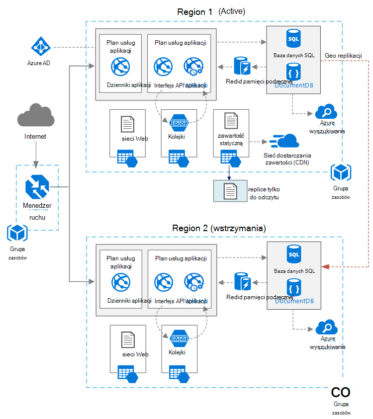

<properties
   pageTitle="Aplikacja sieci Web o wysokiej dostępności | Architektura informacyjna Azure | Microsoft Azure"
   description="Zalecane architektura dla aplikacji sieci web o wysokiej dostępności, w programie Microsoft Azure."
   services="app-service,app-service\web,sql-database" 
   documentationCenter="na"
   authors="MikeWasson"
   manager="roshar"
   editor=""
   tags=""/>

<tags
   ms.service="guidance"
   ms.devlang="na"
   ms.topic="article"
   ms.tgt_pltfrm="na"
   ms.workload="na"
   ms.date="06/27/2016"
   ms.author="mwasson"/>

# <a name="azure-reference-architecture-web-application-with-high-availability"></a>Architektura Azure odwołania: aplikacja sieci Web o wysokiej dostępności

[AZURE.INCLUDE [pnp-RA-branding](../../includes/guidance-pnp-header-include.md)]

W tym artykule przedstawiono architekturę zalecane dla aplikacji sieci web o wysokiej dostępności uruchomionych Microsoft Azure. Architektura opiera się na [Architektura Azure odwołania: zwiększanie skalowalność w aplikacji sieci web][guidance-web-apps-scalability].

## <a name="architecture-diagram"></a>Diagram architektury



Ta architektura opiera się na wskazano [zwiększanie skalowalność w aplikacji sieci web][guidance-web-apps-scalability]. Dostępne są następujące główne różnice:

- **Regiony głównego i pomocniczego**. Ta architektura używa dwóch regionów w celu osiągnięcia wyższego poziomu dostępności. Aplikacja zostanie wdrożony w poszczególnych regionach. Podczas normalnego działania ruch sieciowy jest przekierowywane do obszaru podstawowego. Jednak jeśli która staje się niedostępna, ruch jest kierowane do obszaru pomocniczą. Aby uzyskać szczegółowe informacje o pracy awaryjnej zobacz [Zarządzanie pracy awaryjnej](#managing-failover-and-failback).

- **Azure Menedżer ruchu**. [Menedżer ruchu] [ traffic-manager] kieruje przychodzących wezwań do obszaru podstawowego. Jeśli aplikacja działająca tego regionu jest niedostępny, ruch Menedżer nie może przez pomocniczy region. 

- **Geo replikacja** bazy danych SQL i DocumentDB.

## <a name="recommendations"></a>Zalecenia

### <a name="regional-pairing"></a>Kojarzenie regionalnych

Każdego regionu Azure wraz z innego regionu w tym samym geograficznych. Ogólnie wybierz regionów z tej samej pary regionalnego (na przykład wschodniego USA 2 i centralnej Stany Zjednoczone). Korzyści wynikające w ten sposób:

- W przypadku awarii szeroki priorytety są przypisywane odzyskiwania co najmniej jeden region z każdej pary.
- Aktualizacje planowane systemu Azure wdrażania iloczynów regionów po kolei, aby zminimalizować przestoje możliwe.
- W większości przypadków pary znajdują się w tym samym geograficzne, aby spełnić wymagania dotyczące siedziby danych.

Jednak upewnij się, że dla obu regionów obsługuje wszystkie wymagane dla aplikacji usługi Azure. Zobacz [usługi według regionów][services-by-region]. Aby uzyskać więcej informacji na temat pary regionalne zobacz [firm ciągłości i awarii odzyskiwania (BCDR): regiony sparowane Azure][regional-pairs].

### <a name="resource-groups"></a>Grupy zasobów

Należy rozważyć, czy umieszczania podstawowego region, pomocniczy regionu i Menedżer ruchu w osobnych [grup zasobów][resource groups]. Umożliwia zarządzanie zasobami wdrożony każdego regionu jako pojedynczą kolekcję &mdash; wdrażanie ich oddzielnie, Usuń wdrażanie i tak dalej. 

### <a name="traffic-manager"></a>Menedżer ruchu

**Routing.** Menedżer ruchu obsługuje kilka [algorytmy routingu][tm-routing]. W scenariuszu opisane w tym artykule za pomocą _priorytet_ routingu (dawniej nazywanych routingu _pracy awaryjnej_ ). Za pomocą tych ustawień, Menedżer ruchu wysyła wszystkie żądania podstawowego regionu, chyba że punkt końcowy dla danego regionu stanie się niedostępny. W tym momencie go automatycznie przełącza do obszaru pomocniczy. Zobacz [Konfigurowanie pracy awaryjnej metody routingu][tm-configure-failover].

**Sonda kondycji.** Menedżer ruchu używa protokołu HTTP (lub HTTPS) sondy monitorowanie dostępność każdego punktu końcowego. Sonda daje Menedżer ruchu test przebiegu fail awarii pomocniczej region. Działa przez wysłanie żądania do określonej ścieżki adresu URL. W przypadku odpowiedzi-200 w limicie czasu, sondy zakończy się niepowodzeniem. Po czterech żądania nie powiodło się Menedżer ruchu oznacza punkt końcowy o obniżonej wydajności, a nie na drugi punkt końcowy. Aby uzyskać szczegółowe informacje, zobacz [Menedżer ruchu punktu końcowego monitorowania i pracy awaryjnej][tm-monitoring].

Zgodnie z zaleceniami dotyczącymi utworzyć punkt końcowy sondy kondycji opisujący ogólny stan aplikacji i używać tego punktu końcowego do sondy kondycji. Punkt końcowy należy sprawdzić krytyczne zależności, takich jak aplikacje aplikacji usługi, kolejki miejsca do magazynowania i baza danych SQL. W przeciwnym razie sondy może raport "prawidłowy" punkt końcowy, gdy krytycznych części aplikacji są faktyczną kończy się niepowodzeniem. 

Aby sprawdzić niższy priorytet usług z drugiej strony, nie używaj sondy kondycji. Na przykład jeśli awarii usługi poczty e-mail, aplikacji można przełączyć się z dostawcą drugiego lub po prostu później wysyłać wiadomości e-mail. Aplikacja prawdopodobnie nie powinny się nie powieść nad w takiej sytuacji. Aby uzyskać więcej informacji, zobacz [Kondycja punktu końcowego monitorowania wzorca][health-endpoint-monitoring-pattern].
  
### <a name="sql-database"></a>Baza danych SQL

[Aktywne] replikacji Geo[ sql-replication] tworzenie czytelne pomocniczym w innym regionie. Program może zawierać do czterech pomocnicze czytelne. Jeśli podstawową bazą danych nie powiedzie się, lub po prostu musi być do trybu offline, możesz pracy awaryjnej do dowolnego pomocniczej baz danych. Replikacja Geo Active można skonfigurować dla każdej bazy danych w każdej puli elastyczne bazy danych.

### <a name="documentdb"></a>DocumentDB

DocumentDB obsługuje geo replikacji między różnymi regionami. Jeden region jest oznaczony jako zapisywalny dysk, a inne są repliki tylko do odczytu. 

W przypadku awarii regionalnych może się nie powieść, od podstaw, wybierając inny region na obszar zapisu. SDK automatycznie wysyłane przez klienta DocumentDB do bieżącego obszaru zapisu zapisu żądania, więc nie musisz zaktualizować konfiguracji klienta po przełączeniu. Aby uzyskać więcej informacji, zobacz [dane Rozłóż globalnie z DocumentDB][docdb-geo]. 

> [AZURE.NOTE] Wszystkie repliki należą do tej samej grupy zasobów.

### <a name="storage"></a>Miejsca do magazynowania

Do przechowywania Azure za pomocą [magazynowania zbędne geo odczytu] [ ra-grs] (Pomoc Zdalna GRS). Z miejscem do magazynowania GRS pomoc Zdalna dane są replikowane do obszaru pomocniczy. Masz dostęp tylko do odczytu do danych w regionie pomocniczych w za pośrednictwem oddzielnych punktu końcowego. Jeśli istnieje regionalne awarii lub awarii, zespołu magazyn Azure może określić przeprowadzić geo awarię na pomocniczym region. Istnieje akcja klienta wymagane do tego przełączania awaryjnego.

Do przechowywania kolejki tworzenie kopii zapasowej kolejki w regionie pomocniczą. Podczas awaryjnym przeniesieniu aplikacji można używać kolejki kopii zapasowej, aż podstawowy obszar ponownie stanie się dostępna. W ten sposób aplikacji może nadal przetwarzać nowego żądania. 

## <a name="availability-considerations"></a>Zagadnienia dotyczące dostępności

Architektura wielu region zapewnia większą dostępność niż wdrażanie jeden z regionów. Jeśli awaria regionalne wpływa na podstawowy obszar, po wymuszeniu przejęcia do obszaru pomocniczej. Ta architektura pomaga Jeśli poszczególnych podsystemu aplikacji nie powiedzie się.  
     
Istnieje kilka rozwiązań ogólne do osiągnięcia wysokiej dostępności w centrach danych:      
- Aktywne/pasywne z stałej gotowości. Ruch prowadzi do jednego regionu, podczas innych czeka w stanie wstrzymania. Aplikacja jest wdrożonym i uruchomiona w regionie pomocniczy. Mogą zaczynać mniejsza liczba wystąpienie w centrum danych pomocniczej, a następnie skalowania stosownie do potrzeb. 

- Aktywne/pasywne z zimnej wstrzymania. Takie same, ale aplikacja nie jest wdrożona do momentu pojawienia się do przełączania awaryjnego. Tej metody koszty mniejszy, aby uruchomić, ale ogólnie ma już przestoje podczas awarii. 

- Aktywny/aktywny. Dla obu regionów są aktywne, i żądania są obciążenia zbilansowane między nimi. Jeśli jednym centrum danych jest niedostępny, jest przyjmowana poza obrotu. 

W tym artykule omówiono aktywne/pasywne z stałej gotowości za pomocą [Menedżera ruch Azure] [ traffic-manager] do rozsyłania ruchu w regionie. 

### <a name="traffic-manager"></a>Menedżer ruchu

Menedżer ruchu automatycznie przełącza Jeśli podstawowy obszar staje się niedostępna. Gdy Menedżer ruchu przez nie powiedzie się, to rozłożonym w czasie, gdy klienci nie mogą uzyskać dostępu aplikacji, która może potrwać kilka minut. Dwa czynniki wpływać na całkowity czas trwania:

- Sonda kondycji musi wykrywa, że centrum danych podstawowych ma stają się niedostępne.

- Serwery DNS, musisz zaktualizować pamięci podręcznej rekordy DNS dotyczące adresu IP, która jest zależna od DNS time to live (TTL). Domyślny czas TTL jest 300 sekund (5 minut), ale można skonfigurować tę wartość, podczas tworzenia profilu Menedżer ruchu.

Aby uzyskać szczegółowe informacje, zobacz [Temat monitorowania Menedżer ruchu][tm-monitoring]. 

Menedżer ruchu jest punktem możliwe niepowodzenie w systemie. Jeśli usługa nie powiedzie się, klienci nie mają dostępu aplikacji podczas przestoje. Przejrzyj [SLA Menedżer ruchu][tm-sla]i sprawdź, czy za pomocą Menedżera ruch tylko spełnia wymagań firm wysokiej dostępności. W przeciwnym razie należy rozważyć dodanie innego rozwiązania do zarządzania ruch jako awarii. Jeśli usługa Menedżer ruchu Azure kończy się niepowodzeniem, zmień rekordy CNAME w systemie DNS, aby wskazywały inne usługi zarządzania ruch. (Należy ręcznie wykonać ten krok, a aplikacja jest niedostępna, dopóki zmiany DNS są przenoszone). 

### <a name="sql-database"></a>Baza danych SQL

Odzyskiwania punktów cel (RPO) i odzyskiwania szacowany czas (Wstaw) bazy danych SQL opisane [tutaj][sql-rpo]. 

### <a name="storage"></a>Miejsca do magazynowania

Magazyn GRS pomoc Zdalna oferuje trwałe miejsca do magazynowania, ale ważne jest, aby zrozumieć, co może wystąpić podczas awarii: 

- W przypadku wystąpienia awarii miejsca do magazynowania będzie rozłożonym w czasie, gdy nie masz dostęp do danych zapisu. Punkt końcowy pomocniczą można nadal odczyt podczas awarii.

- Jeśli regionalne awarii lub danych wpływa na pozycję podstawowy, a nie można odzyskać dane za pomocą tego, Magazyn Azure zespołu mogą określać przeprowadzić geo awarię na pomocniczym region. 

- Replikacja danych do obszaru pomocniczej odbywa się asynchroniczne. W związku z tym jeśli odbywa się geo trybie awaryjnym, utratę danych jest możliwe, jeśli nie można odzyskać danych z podstawowego regionu.

- Błędy przejściowych, takich jak awaria sieci, nie spowoduje trybie awaryjnym miejsca do magazynowania. Projektowanie mechanizm na przejściowych awarie aplikacji. Możliwe czynniki:

    - Odczyt pomocniczej.

    - Tymczasowo Przełącz się do innego konta miejsca do magazynowania dla nowych operacji zapisu (na przykład do wiadomości w kolejce). 

    - Skopiuj dane z pomocniczej z innym kontem miejsca do magazynowania.

    - Podaj zmniejszonej funkcjonalności, dopóki systemu ponownie nie powiedzie się.

Aby uzyskać więcej informacji, zobacz, [co należy zrobić, jeśli wystąpi awaria magazyn Azure][storage-outage].

## <a name="managing-failover-and-failback"></a>Zarządzanie awaryjnego i powrotu

### <a name="traffic-manager"></a>Menedżer ruchu

Menedżer ruchu automatycznie przełącza Jeśli podstawowy obszar staje się niedostępna. Domyślnie go również automatycznie nie powiedzie się, po podstawowy obszar znów będzie dostępny.

Jednak zaleca się wykonywanie powrotu ręcznego, zamiast automatycznie awarii ponownie. Przed niepowodzeniem ponownie, sprawdź, czy wszystkie podsystemów aplikacji są prawidłowy. W przeciwnym razie możesz utworzyć sytuacji, gdy aplikacja przerzucony i z powrotem między centrami danych. 

Aby uniemożliwić automatyczne awarii, ręcznie obniża priorytet podstawowy obszar po zdarzenie pracy awaryjnej. Załóżmy na przykład, podstawowy obszar jest priorytet 1 i pomocniczej jest priorytet 2. Po przełączeniu Ustaw obszar podstawowy priorytet 3, aby uniemożliwić automatyczne awarii. Gdy zechcesz przełączenia, przywrócić priorytet 1.

Następujące polecenia zaktualizuj priorytet.

**Programu PowerShell** 

```bat
$endpoint = Get-AzureRmTrafficManagerEndpoint -Name <endpoint> -ProfileName <profile> -ResourceGroupName <resource-group> -Type AzureEndpoints
$endpoint.Priority = 3
Set-AzureRmTrafficManagerEndpoint -TrafficManagerEndpoint $endpoint
```

Aby uzyskać więcej informacji, zobacz [Polecenia cmdlet Menedżer ruchu Azure][tm-ps].

**Polecenie Azure**

```bat
azure network traffic-manager endpoint set --name <endpoint> --profile-name <profile> --resource-group <resource-group> --type AzureEndpoints --priority 3
```    

### <a name="sql-database"></a>Baza danych SQL

Jeśli podstawową bazą danych nie powiedzie się, należy wykonać ręcznego awarię na pomocniczej bazy danych. Zobacz [Przywracanie bazy danych SQL Azure lub przełączanie awaryjne do pomocniczym][sql-failover]. Aż po wymuszeniu przejęcia pomocniczego bazy danych jest tylko do odczytu. 


<!-- links -->

[azure-sql-db]: https://azure.microsoft.com/en-us/documentation/services/sql-database/
[docdb-geo]: ../documentdb/documentdb-distribute-data-globally.md
[guidance-web-apps-scalability]: guidance-web-apps-scalability.md
[health-endpoint-monitoring-pattern]: https://msdn.microsoft.com/library/dn589789.aspx
[ra-grs]: ../storage/storage-redundancy.md#read-access-geo-redundant-storage
[regional-pairs]: ../best-practices-availability-paired-regions.md
[resource groups]: ../resource-group-overview.md
[services-by-region]: https://azure.microsoft.com/en-us/regions/#services
[sql-failover]: ../sql-database/sql-database-disaster-recovery.md
[sql-replication]: ../sql-database/sql-database-geo-replication-overview.md
[sql-rpo]: ../sql-database/sql-database-business-continuity.md#sql-database-business-continuity-features
[storage-outage]: ../storage/storage-disaster-recovery-guidance.md
[tm-configure-failover]: ../traffic-manager/traffic-manager-configure-failover-routing-method.md
[tm-monitoring]: ../traffic-manager/traffic-manager-monitoring.md
[tm-ps]: https://msdn.microsoft.com/en-us/library/mt125941.aspx
[tm-routing]: ../traffic-manager/traffic-manager-routing-methods.md
[tm-sla]: https://azure.microsoft.com/en-us/support/legal/sla/traffic-manager/v1_0/
[traffic-manager]: https://azure.microsoft.com/en-us/services/traffic-manager/
