<properties
    pageTitle="Zarządzanie klastrów Hadoop w za pomocą portalu Azure HDInsight | Microsoft Azure"
    description="Dowiedz się, jak administrowanie usługą HDInsight. Tworzenie klaster HDInsight, otwórz konsolę JavaScript interakcyjnych i Otwórz konsolę polecenie Hadoop."
    services="hdinsight"
    documentationCenter=""
    tags="azure-portal"
    authors="mumian"
    manager="jhubbard"
    editor="cgronlun"/>

<tags
    ms.service="hdinsight"
    ms.workload="big-data"
    ms.tgt_pltfrm="na"
    ms.devlang="na"
    ms.topic="article"
    ms.date="09/14/2016"
    ms.author="jgao"/>

# Zarządzanie klastrów Hadoop w HDInsight za pomocą portalu Azure

[AZURE.INCLUDE [selector](../../includes/hdinsight-portal-management-selector.md)]

Za pomocą [Azure portal][azure-portal], tworzenie klastrów Hadoop w Azure HDInsight, Zmień hasło użytkownika Hadoop i Włącz protokół RDP (Remote Desktop) w celu uzyskiwania dostępu do konsoli poleceń Hadoop w klastrze.

Informacje w tym artykule dotyczą tylko klastrów opartych na okno HDInsight. Aby uzyskać informacje dotyczące zarządzania systemem Linux klastrów kliknij selektor tabulatorów powyżej.

Klikaj selektor tabulatorów informacje na temat tworzenia Hadoop klastrów w HDInsight przy użyciu innych narzędzi. 

**Wymagania wstępne**

Przed rozpoczęciem tego artykułu, musisz mieć następujące czynności:

- **Azure subskrypcji**. Zobacz [Azure pobrać bezpłatną wersję próbną](https://azure.microsoft.com/documentation/videos/get-azure-free-trial-for-testing-hadoop-in-hdinsight/).
- **Magazyn azure konta** — HDInsight klaster używa kontenerem magazyn obiektów Blob platformy Azure jako domyślnego systemu plików. Aby uzyskać więcej informacji na temat sposobu magazyn obiektów Blob platformy Azure oferuje płynną obsługę z klastrów HDInsight, zobacz [Magazyn obiektów Blob platformy Azure korzystanie z usługi HDInsight](hdinsight-hadoop-use-blob-storage.md). Aby uzyskać szczegółowe informacje na temat tworzenia konta usługi Azure miejsca do magazynowania zobacz [jak utworzyć konto miejsca do magazynowania](../storage/storage-create-storage-account.md).

##Otwórz Portal usługi

1. Zaloguj się do [https://portal.azure.com](https://portal.azure.com).
2. Po otwarciu portalu, możesz wykonać następujące czynności:

    - Kliknij przycisk **Nowy** z menu po lewej stronie, aby utworzyć nowy klaster:
    
        
    - Kliknij pozycję **Klastrów HDInsight** z menu po lewej stronie.
    
        

    Jeśli **Usługa HDInsight** nie jest wyświetlany w menu po lewej stronie, kliknij przycisk **Przeglądaj**. 

    

##Tworzenie klastrów

Aby uzyskać instrukcje dotyczące tworzenia za pomocą portalu zobacz [Tworzenie HDInsight klastrów](hdinsight-provision-clusters.md#create-using-the-preview-portal).

Usługa HDInsight współdziała z składniki szeroki zakres Hadoop. Aby uzyskać listę elementów, które zostały zweryfikowane i obsługiwane zobacz [która wersja programu Hadoop w Azure HDInsight](hdinsight-component-versioning.md). Usługa HDInsight można dostosowywać, stosując jedną z następujących opcji:

- Za pomocą akcji skrypt do uruchamiania skryptów niestandardowych, które można dostosować klastrze do zmiany konfiguracji klaster albo zainstalować składniki niestandardowe, takie jak Giraph lub Solr. Aby uzyskać więcej informacji zobacz [Dostosowywanie HDInsight klaster przy użyciu akcji skryptów](hdinsight-hadoop-customize-cluster.md).
- Podczas tworzenia klaster za pomocą parametrów dostosowywania klaster w HDInsight .NET SDK lub Azure programu PowerShell. Te zmiany w konfiguracji następnie są zachowywane za pośrednictwem ważności klaster i nie dotyczy reimages węzeł klaster wykonywanych platformy Azure okresowo obsługi. Aby uzyskać więcej informacji na temat korzystania z parametrów dostosowywania klaster zobacz [Tworzenie HDInsight klastrów](hdinsight-provision-clusters.md).
- Niektóre składniki natywne języka Java, takich jak Mahout i usuwania kaskadowego, można uruchamiać w klastrze jako pliki JAR. Te pliki JAR można rozdzielana magazyn obiektów Blob platformy Azure i przesłane do klastrów HDInsight poprzez mechanizmy przesyłania zadania Hadoop. Aby uzyskać więcej informacji zobacz [Przesyłanie Hadoop programowy zadania](hdinsight-submit-hadoop-jobs-programmatically.md).

    >[AZURE.NOTE] Jeśli masz problemy wdrażania plików JAR do klastrów HDInsight lub nawiązywania połączeń z plików JAR na klastrów HDInsight kontakt z [Pomocą techniczną firmy Microsoft](https://azure.microsoft.com/support/options/).

    > Kaskadowe nie jest obsługiwana przez HDInsight, a nie kwalifikuje się do programu Microsoft Support. Dla list obsługiwane składniki, zobacz [Co nowego w wersji klaster dostarczony przez HDInsight?](hdinsight-component-versioning.md).

Instalacja programów niestandardowych w klastrze przy użyciu Podłączanie pulpitu zdalnego nie jest obsługiwana. Jak zostaną utracone, jeśli musisz ponownie utworzyć klastrów należy unikać przechowywania pliki na dyskach węzła głównego. Zaleca się przechowywanie plików na magazyn obiektów Blob platformy Azure. Magazyn obiektów blob jest trwałe.

##Listy i Pokaż klastrów

1. Zaloguj się do [https://portal.azure.com](https://portal.azure.com).
2. Kliknij pozycję **Klastrów HDInsight** z menu po lewej stronie.
3. Kliknij nazwę klaster. Jeśli lista klaster jest długa, możesz użyć filtru w górnej części strony.
4. Kliknij dwukrotnie klaster z listy, aby wyświetlić szczegóły.

    **Menu i podstawowe informacje dotyczące**:

    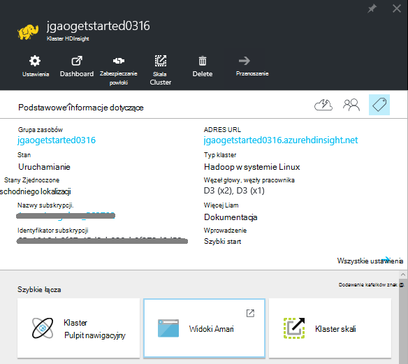
    
    - Dostosowywanie menu, kliknij prawym przyciskiem myszy w dowolnym miejscu w menu, a następnie kliknij przycisk **Dostosuj**.
    - **Ustawienia** i **Wszystkie**: jest wyświetlana karta **Ustawienia** dla klastrów, dzięki czemu można uzyskać dostęp do informacji o grupie szczegółowe konfiguracji.
    - **Pulpit nawigacyjny**, **Klaster pulpitu nawigacyjnego** i **adres URL: są wszystkie sposoby uzyskiwania dostępu klaster pulpitu nawigacyjnego, czyli Ambari Web dla klastrów opartych na systemie Linux. - **Bezpiecznego powłoki **: Pokazuje z instrukcjami, aby połączyć się z klastrem przy użyciu połączenia Secure Shell (SSH).
    - **Klaster skali**: umożliwia zmianę liczby węzłów pracownika dla tego klaster.
    - **Usuwanie**: usuwa klaster.
    - **Szybki Start ()**: Wyświetla informacje, które mogą pomóc rozpocząć korzystanie z usługi HDInsight.
    - **Użytkownicy ()**: umożliwia ustawianie uprawnień do _portalu zarządzania_ tym klastrem dla innych użytkowników w subskrypcji usługi Azure.
    
        > [AZURE.IMPORTANT] To _tylko_ ma wpływ na dostęp i uprawnienia, aby ten klaster w portalu Azure, a nie ma wpływu na kto może nawiązać połączenia lub przesyłać zadania do klastrów HDInsight.
    - **Znaczniki ()**: znaczników umożliwia określenie par klucz wartość do definiowania niestandardowych taksonomii usług w chmurze. Na przykład może utworzyć klucz o nazwie __programu project__, a następnie użyj wartości wspólne dla wszystkich usług skojarzone z określonym projektem.
    - **Widoki Ambari**: łącza do Ambari w sieci Web.
    
    > [AZURE.IMPORTANT] Aby zarządzać usług udostępnianych przez klaster HDInsight, należy użyć Ambari sieci Web lub interfejsu API usługi REST Ambari. Aby uzyskać więcej informacji na temat korzystania z Ambari zobacz [Zarządzanie HDInsight klastrów przy użyciu Ambari](hdinsight-hadoop-manage-ambari.md).

    **Zastosowania**:
    
    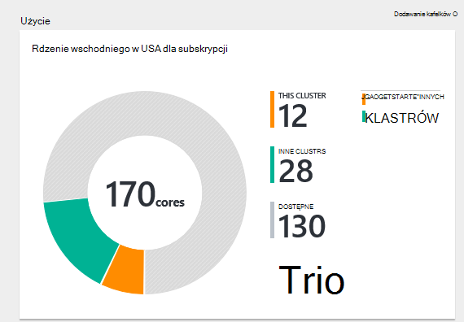
    
5. Kliknij przycisk **Ustawienia**.

    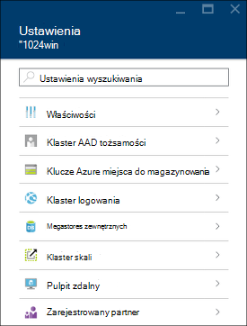

    - **Właściwości**: wyświetlanie właściwości klaster.
    - **Klaster AAD tożsamości**: 
    - **Klucze miejsca do magazynowania Azure**: wyświetlanie domyślnego konta miejsca do magazynowania i klucza. Konto miejsca do magazynowania jest konfiguracji podczas procesu tworzenia klaster.
    - **Klaster logowania**: Zmienianie klaster HTTP nazwę użytkownika i hasło.
    - **Metastores zewnętrzne**: wyświetlanie metastores gałąź i Oozie. Metastores można skonfigurować tylko w trakcie procesu tworzenia klaster.
    - **Klaster skali**: Zwiększ i Zmniejsz liczbę węzłach pracownika.
    - **Pulpit zdalny**: Włączanie i wyłączanie dostępu pulpitu zdalnego (RDP) i konfigurowanie RDP nazwa użytkownika.  Nazwa użytkownika RDP musi być inne niż HTTP nazwę użytkownika.
    - **Zarejestrowany partner**:
    
    > [AZURE.NOTE] To jest Lista ogólna dostępnych ustawień; nie wszystkie będzie obecne dla wszystkich typów klaster.

6. Kliknij pozycję **Właściwości**:

    Właściwości listy następujące czynności:
    
    - **Nazwa hosta**: Nazwa klaster.
    - **Klaster adresu URL**.
    - **Stan**: obejmują przerwane zaakceptowane, ClusterStorageProvisioned, AzureVMConfiguration, HDInsightConfiguration, operacyjne, uruchomiony, błąd, usuwanie, usunięte, upłynął limit czasu, DeleteQueued, DeleteTimedout, DeleteError, PatchQueued, CertRolloverQueued, ResizeQueued, ClusterCustomization
    - **Region**: Azure lokalizacji. Aby uzyskać listę obsługiwanych lokalizacje Azure zobacz Lista rozwijana **Region** na [HDInsight ceny](https://azure.microsoft.com/pricing/details/hdinsight/).
    - **Dane utworzone**.
    - **System operacyjny**: **Windows** i **Linux oraz**.
    - **Typ**: Hadoop, HBase, burza, wzmóc. 
    - **Wersja**. Zobacz [wersji HDInsight](hdinsight-component-versioning.md)
    - **Subskrypcja**: Nazwa subskrypcji.
    - **Identyfikator subskrypcji**.
    - **Podstawowego źródła danych**. Konto magazyn obiektów Blob platformy Azure używane jako domyślny system plików usługi Hadoop.
    - **Węzły pracownik ceny warstwy**.
    - **Cennik poziomu węzła głowy**.

##Usuwanie klastrów

Usuń klaster nie spowoduje usunięcia domyślne konto miejsca do magazynowania lub kont połączonych miejsca do magazynowania. Możesz ponownie utworzyć klaster przy użyciu tych samych kont miejsca do magazynowania i tym samym metastores.

1. Zaloguj się do [portalu][azure-portal].
2. Kliknij pozycję **Przeglądaj wszystkie** z menu po lewej stronie, kliknij przycisk **HDInsight klastrów**, kliknij swoją nazwę klaster.
3. Kliknij przycisk **Usuń** w górnym menu, a następnie postępuj zgodnie z instrukcjami.

Zobacz też [Wstrzymaj i zamknij klastrów](#pauseshut-down-clusters).

##Skala klastrów
Klaster skalowania funkcji umożliwia zmianę liczby węzłów pracownik używane przez klaster, na którym działa usługa Azure HDInsight bez konieczności ponownego tworzenia klaster.

>[AZURE.NOTE] Tylko klastrów z usługi HDInsight wersji 3.1.3 lub wyższej są obsługiwane. Jeśli masz pewności co do wersji klaster, można sprawdzić na stronie właściwości.  Zobacz [listę i Pokaż klastrów](#list-and-show-clusters).

Wpływ zmian liczby węzłów danych dla każdego typu klaster obsługiwanych przez HDInsight:

- Hadoop

    Bezproblemowa można zwiększyć liczby węzłów pracownika w klastrze Hadoop, który jest uruchomiony bez wpływania zadania Oczekiwanie lub nie działa. Nowe zadania można również przesyłać w trakcie tej operacji. Błędy w operacji skalowania bezpiecznie są obsługiwane, tak aby klaster zawsze pozostanie w stanie działać.

    Podczas skalowania klastrze Hadoop w dół poprzez zmniejszenie liczby węzłów danych są ponownie uruchamiane niektóre z tych usług w klastrze. Spowoduje to wszystko działa i zaległe zadania kończy się niepowodzeniem po zakończeniu operacji skalowania. Można jednak Prześlij ponownie zadania po wykonaniu operacji.

- HBase

    Bezproblemowa można dodawać lub usunąć węzły klaster HBase, gdy jest uruchomiony. Serwery regionalne są automatycznie zbilansowane w ciągu kilku minut wykonywania operacji skalowania. Jednak można też ręcznie saldo serwery regionalne, logując się do headnode klastrze i uruchomione następujące polecenia w oknie wiersza polecenia:

        >pushd %HBASE_HOME%\bin
        >hbase shell
        >balancer

    Aby uzyskać więcej informacji na temat korzystania z powłoki HBase Zobacz]
- Burza

    Można bezproblemowo dodawać i usuwać węzłów danych do klaster burza, gdy jest uruchomiony. Ale po pomyślnym zakończeniu operacji skalowania, będzie konieczne wyrównać topologii.

    Ponowne równoważenie można zrobić na dwa sposoby:

    * Burza interfejs użytkownika sieci web
    * Narzędzie interfejsu wiersza polecenia (polecenie)

    Można znaleźć w [dokumentacji Burza Apache](http://storm.apache.org/documentation/Understanding-the-parallelism-of-a-Storm-topology.html) uzyskać więcej szczegółowych informacji.

    Interfejs użytkownika sieci web Burza jest dostępna w klastrze HDInsight:

    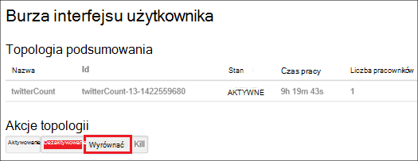

    Oto przykład jak wyrównać topologii Burza przy użyciu polecenia polecenie:

        ## Reconfigure the topology "mytopology" to use 5 worker processes,
        ## the spout "blue-spout" to use 3 executors, and
        ## the bolt "yellow-bolt" to use 10 executors

        $ storm rebalance mytopology -n 5 -e blue-spout=3 -e yellow-bolt=10

**Aby przeskalować klastrów**

1. Zaloguj się do [portalu][azure-portal].
2. Kliknij pozycję **Przeglądaj wszystkie** z menu po lewej stronie, kliknij przycisk **HDInsight klastrów**, kliknij swoją nazwę klaster.
3. W górnym menu kliknij polecenie **Ustawienia** , a następnie kliknij **Klaster Skala**.
4. Wprowadź **numer pracownika węzły**. Limit liczby węzła zmienia się między Azure subskrypcji. Możesz również skontaktować się rozliczeń pomocy technicznej, aby zwiększyć limit.  Informacje o kosztach zostaną zastosowane zmiany wprowadzone przez użytkownika liczby węzłów.

    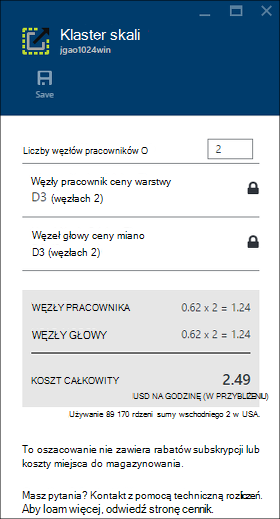

##Wstrzymaj i zamknij klastrów

Większość zadań Hadoop to zadań, które są tylko uruchomiono od czasu do czasu. W przypadku większości klastrów Hadoop jest duży okresów czasu, który nie jest używany klaster przetwarzania. Z usługi HDInsight dane są przechowywane w magazynie Azure, więc można bezpiecznie usunąć klaster, gdy nie jest używany.
Możesz również są naliczane dla klastrów HDInsight nawet wtedy, gdy nie jest używany. Ponieważ opłaty za klaster są wielokrotnie większe niż opłaty za miejsca do magazynowania, warto ekonomicznych usuwanie klastrów, gdy nie są one używane.

Istnieje wiele sposobów zostanie procesu:

- Factory Azure danych użytkownika. Zobacz [Azure HDInsight powiązanych z](../data-factory/data-factory-compute-linked-services.md) i [Przekształcenie i analizowania przy użyciu Factory danych Azure](../data-factory/data-factory-data-transformation-activities.md) usługi HDInsight połączone na żądanie i samodzielnie zdefiniowanym.
- Za pomocą programu PowerShell Azure.  Zobacz [Analiza danych opóźnień lotów](hdinsight-analyze-flight-delay-data.md).
- Za pomocą interfejsu wiersza polecenia Azure. Zobacz [Zarządzanie HDInsight klastrów za pomocą interfejsu wiersza polecenia Azure](hdinsight-administer-use-command-line.md).
- Za pomocą usługi HDInsight .NET SDK. Zobacz [Hadoop przesyłanie zadania](hdinsight-submit-hadoop-jobs-programmatically.md).

Aby uzyskać informacje cennik zobacz [HDInsight ceny](https://azure.microsoft.com/pricing/details/hdinsight/). Aby usunąć klaster z portalu, zobacz [Usuwanie klastrów](#delete-clusters)

##Zmienianie nazwy użytkownika z klaster

Klaster HDInsight mogą być dwa konta użytkownika. Konto użytkownika usługi HDInsight klaster zostanie utworzony w trakcie procesu tworzenia. Można także tworzyć konta użytkownika RDP do uzyskiwania dostępu do klaster za pośrednictwem RDP. Zobacz [Włączanie pulpitu zdalnego](#connect-to-hdinsight-clusters-by-using-rdp).

**Aby zmienić nazwę użytkownika klaster HDInsight i hasło**

1. Zaloguj się do [portalu][azure-portal].
2. Kliknij pozycję **Przeglądaj wszystkie** z menu po lewej stronie, kliknij przycisk **HDInsight klastrów**, kliknij swoją nazwę klaster.
3. W górnym menu kliknij polecenie **Ustawienia** , a następnie kliknij **Klaster logowania**.
4. Włączenie **logowania klaster** musi kliknij przycisk **Wyłącz**, a następnie kliknij **Włącz** zanim będzie można zmienić nazwy użytkownika i hasła.
4. Zmienianie **Klaster nazwa logowania** i **Hasło logowania klaster**, a następnie kliknij przycisk **Zapisz**.

    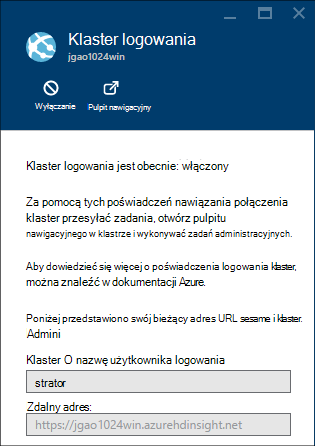

##Udzielanie i revoke programu access

Usługa HDInsight klastrów są następujące usługi sieci web HTTP (wszystkie te usługi mają RESTful punkty końcowe):

- ODBC
- JDBC
- Ambari
- Oozie
- Templeton

Domyślnie te usługi uzyskują dostęp. Możesz można revoke i udzielanie dostępu z portalu Azure.

>[AZURE.NOTE] Przez udzielanie i odwoływanie dostępu, możesz przywrócić klaster nazwa użytkownika i hasło.

**Udzielanie i revoke HTTP sieci web usługi programu access**

1. Zaloguj się do [portalu][azure-portal].
2. Kliknij pozycję **Przeglądaj wszystkie** z menu po lewej stronie, kliknij przycisk **HDInsight klastrów**, kliknij swoją nazwę klaster.
3. W górnym menu kliknij polecenie **Ustawienia** , a następnie kliknij **Klaster logowania**.
4. Włączenie **logowania klaster** musi kliknij przycisk **Wyłącz**, a następnie kliknij **Włącz** zanim będzie można zmienić nazwy użytkownika i hasła.
6. **Klaster logowania użytkownika** i **Hasło logowania klaster**wprowadź nową nazwę użytkownika i hasło (odpowiednio) dla klaster.
7. Kliknij przycisk **ZAPISZ**.

    

##Znajdowanie domyślne konto miejsca do magazynowania

Każdy klaster HDInsight ma domyślne konto miejsca do magazynowania. Domyślne konto miejsca do magazynowania i kluczy dla klastrów pojawi się w obszarze **Ustawienia**/**Właściwości**/**Azure miejsca do magazynowania klawiszy**. Zobacz [listę i Pokaż klastrów](#list-and-show-clusters).

    
##Znajdowanie grup zasobów 

W trybie Menedżera zasobów Azure każdy klaster HDInsight jest tworzona z grupą Azure zasobów. Grupa zasobów Azure, której należy klaster pojawia się w:

- Lista klaster zawiera kolumnę **Grupa zasobów** .
- Klaster **podstawowe** kafelków.  

Zobacz [listę i Pokaż klastrów](#list-and-show-clusters).
   
##Otwieranie konsoli kwerendy HDInsight

Konsola kwerendy HDInsight zawiera następujące funkcje:

- **Galeria wprowadzenie**: Aby użyć Galerii, zobacz [Informacje Hadoop przy użyciu galerii Azure HDInsight wprowadzenie wprowadzenie](hdinsight-learn-hadoop-use-sample-gallery.md).
- **Edytor gałęzi**: Graficznym interfejs sieci web dla przesyłania zadań gałęzi.  Zobacz [uruchomić gałęzi zapytań za pomocą konsoli kwerendy](hdinsight-hadoop-use-hive-query-console.md).

    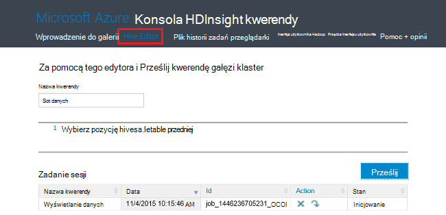

- **Historię zatrudnienia**: Monitor Hadoop zadania.  

    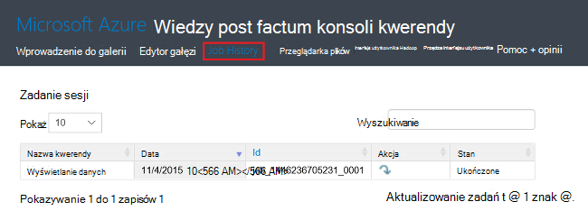

    Kliknij **Nazwę zapytania** , aby wyświetlić szczegóły, w tym właściwości zadania, **Zadanie kwerendy**i ** wynik zadania. Do pracy, można pobrać zarówno kwerendy, jak i dane wyjściowe.

- **Przeglądarka plików**: Przeglądanie kont połączonych miejsca do magazynowania i domyślne konto miejsca do magazynowania.

    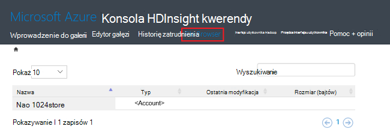

    Na zrzut ekranu **<Account>** typ wskazuje element to konto Azure miejsca do magazynowania.  Kliknij nazwę konta, aby przeglądać pliki.
    
- **Interfejs użytkownika Hadoop**.

    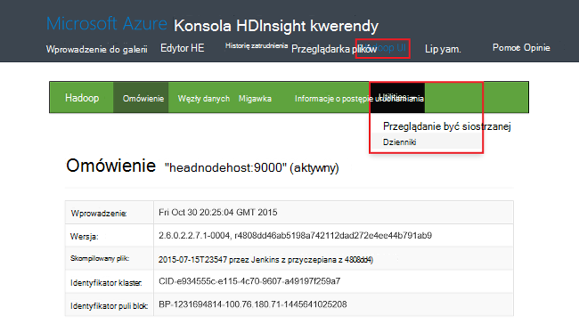
    
    Z **Hadoop interfejsu użytkownika*, można przeglądać pliki i sprawdź dzienniki. 

- **Przędza interfejsu użytkownika**.

    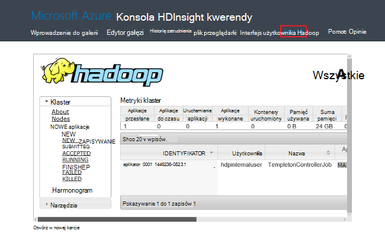

##Uruchamianie kwerend gałęzi

Aby wykonane zadania gałęzi z portalu, kliknij przycisk **Gałęzi Edytor** w konsoli HDInsight kwerendy. Zobacz [Konsola Otwórz kwerendę HDInsight](#open-hdinsight-query-console).

##Monitorowanie zadań

Monitorowanie zadań z poziomu portalu, kliknij przycisk **Historia zadania** w konsoli HDInsight kwerendy. Zobacz [Konsola Otwórz kwerendę HDInsight](#open-hdinsight-query-console).

##Przeglądanie plików

Aby przeglądać pliki przechowywane w domyślne konto miejsca do magazynowania i kont połączonych miejsca do magazynowania, kliknij **Przeglądarka plików** w konsoli HDInsight kwerendy. Zobacz [Konsola Otwórz kwerendę HDInsight](#open-hdinsight-query-console).

Za pomocą narzędzia **przeglądać systemu plików** z **Hadoop interfejsu użytkownika** konsoli HDInsight.  Zobacz [Konsola Otwórz kwerendę HDInsight](#open-hdinsight-query-console).

##Monitorowanie użycia klaster

W sekcji __zastosowania__ karta klaster HDInsight Wyświetla informacje dotyczące liczby rdzeni dostępne do subskrypcji do użytku z usługi HDInsight, jak również liczby rdzeni przydzielonych ten klaster i jak są przydzielane dla węzłów w tym klastrze. Zobacz [listę i Pokaż klastrów](#list-and-show-clusters).

> [AZURE.IMPORTANT] Monitorowanie usług udostępnianych przez klaster HDInsight, należy użyć Ambari sieci Web lub interfejsu API usługi REST Ambari. Aby uzyskać więcej informacji na temat korzystania z Ambari zobacz [Zarządzanie HDInsight klastrów przy użyciu Ambari](hdinsight-hadoop-manage-ambari.md)

##Otwórz Hadoop interfejsu użytkownika

Monitorowanie klaster, przeglądać systemu plików i sprawdź dzienniki, kliknij **Hadoop interfejsu użytkownika** konsoli HDInsight kwerendy. Zobacz [Konsola Otwórz kwerendę HDInsight](#open-hdinsight-query-console).

##Otwórz przędzy interfejsu użytkownika

W obsłudze interfejs użytkownika przędzy, kliknij **Przędzy interfejsu użytkownika** konsoli HDInsight kwerendy. Zobacz [Konsola Otwórz kwerendę HDInsight](#open-hdinsight-query-console).

##Nawiązywanie połączenia przy użyciu RDP klastrów

Poświadczenia dla klastrów, podana podczas jej tworzenia udzielić dostępu do usług w klastrze, ale nie klaster za pośrednictwem pulpitu zdalnego. Pulpit zdalny dostęp można włączyć obsługę klastrze lub po zainicjowano obsługę administracyjną klastrze. Aby uzyskać instrukcje dotyczące włączania pulpitu zdalnego podczas tworzenia zobacz [Tworzenie HDInsight klaster](hdinsight-provision-clusters.md).

**Aby włączyć Pulpit zdalny**

1. Zaloguj się do [portalu][azure-portal].
2. Kliknij pozycję **Przeglądaj wszystkie** z menu po lewej stronie, kliknij przycisk **HDInsight klastrów**, kliknij swoją nazwę klaster.
3. W górnym menu kliknij polecenie **Ustawienia** , a następnie kliknij **Pulpit zdalny**.
4. Wprowadź **Wygasa**, **Remote Desktop nazwy użytkownika** i **Hasła pulpitu zdalnego**, a następnie kliknij polecenie **Włącz**.

    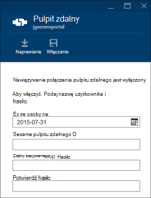

    Domyślne wartości wygasa jest tygodnia.
> [AZURE.NOTE] Aby włączyć Pulpit zdalny w klastrze umożliwia także HDInsight .NET SDK. Użyj metody **EnableRdp** obiektu klienta HDInsight w następujący sposób: **klienta. EnableRdp (NazwaKlastra, lokalizację, "rdpuser", "rdppassword", DateTime.Now.AddDays(6))**. Podobnie Aby wyłączyć pulpitu zdalnego w klastrze, można skorzystać **klienta. DisableRdp (NazwaKlastra, lokalizacji)**. Aby uzyskać więcej informacji na temat tych metod zobacz [Usługa HDInsight .NET SDK odwołania](http://go.microsoft.com/fwlink/?LinkId=529017). Dotyczy tylko dla klastrów HDInsight z systemem Windows.

**Aby połączyć się z klastrem przy użyciu RDP**

1. Zaloguj się do [portalu][azure-portal].
2. Kliknij pozycję **Przeglądaj wszystkie** z menu po lewej stronie, kliknij przycisk **HDInsight klastrów**, kliknij swoją nazwę klaster.
3. W górnym menu kliknij polecenie **Ustawienia** , a następnie kliknij **Pulpit zdalny**.
4. Kliknij pozycję **Połącz** , a następnie postępuj zgodnie z instrukcjami. Jeśli łączenie jest wyłączona, należy go najpierw włączyć. Upewnij się, za pomocą pulpitu zdalnego nazwy użytkownika i hasła.  Nie można używać klaster poświadczeń użytkownika.

##Otwórz wiersz polecenia Hadoop

Aby połączyć się z klastrem przy użyciu pulpitu zdalnego i za pomocą wiersza polecenia Hadoop, musisz najpierw włączyć pulpitu zdalnego dostępu do klaster zgodnie z opisem w poprzedniej sekcji.

**Aby otworzyć wiersz polecenia Hadoop**

1. Nawiązywanie połączenia z klastrem przy użyciu pulpitu zdalnego.
8. Na komputerze kliknij dwukrotnie **wiersza polecenia Hadoop**.

    ![HDI. HadoopCommandLine][image-hadoopcommandline]

    Aby uzyskać więcej informacji o poleceniach Hadoop zobacz [informacje dotyczące poleceń Hadoop](http://hadoop.apache.org/docs/current/hadoop-project-dist/hadoop-common/CommandsManual.html).

Poprzedniego ekranu Nazwa folderu zawiera numer wersji Hadoop osadzony. Numer wersji można zmienić w zależności od używanej wersji programu składniki Hadoop zainstalowane w klastrze. Aby odwołać się do tych folderów, można używać zmiennych środowiska Hadoop. Na przykład:

    cd %hadoop_home%
    cd %hive_home%
    cd %hbase_home%
    cd %pig_home%
    cd %sqoop_home%
    cd %hcatalog_home%
    
##Następne kroki
W tym artykule zapewne wiesz, jak utworzyć klaster HDInsight za pomocą portalu i sposobu otwierania narzędzia wiersza polecenia Hadoop. Aby uzyskać więcej informacji, zobacz następujące artykuły:

* [Administrowanie przy użyciu programu PowerShell Azure HDInsight](hdinsight-administer-use-powershell.md)
* [Administrowanie przy użyciu polecenie Azure HDInsight](hdinsight-administer-use-command-line.md)
* [Tworzenie klastrów HDInsight](hdinsight-provision-clusters.md)
* [Przesyłanie zadań Hadoop programowy](hdinsight-submit-hadoop-jobs-programmatically.md)
* [Rozpoczynanie pracy z usługa Azure HDInsight](hdinsight-hadoop-linux-tutorial-get-started.md)
* [Która wersja programu Hadoop znajduje się w Azure HDInsight?](hdinsight-component-versioning.md)

[azure-portal]: https://portal.azure.com
[image-hadoopcommandline]: ./media/hdinsight-administer-use-management-portal/hdinsight-hadoop-command-line.png "Wiersz polecenia Hadoop"
