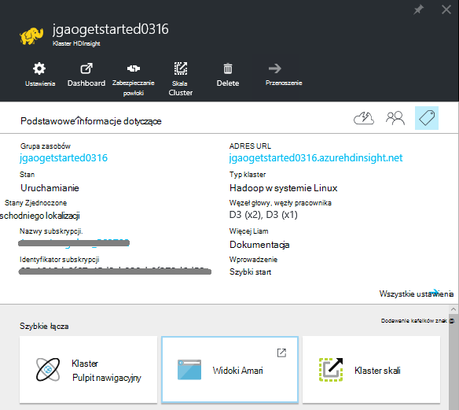
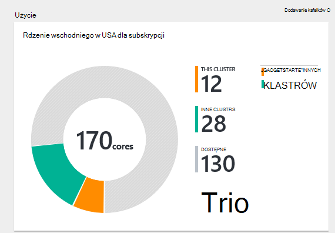
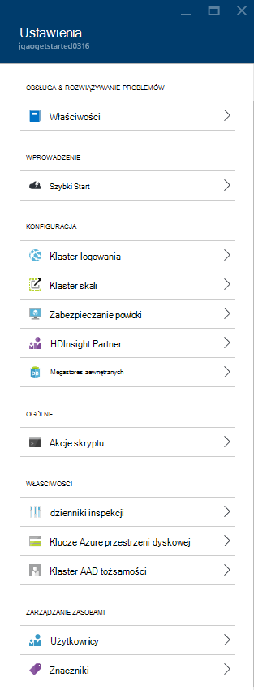
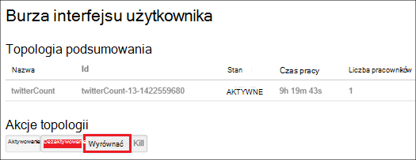
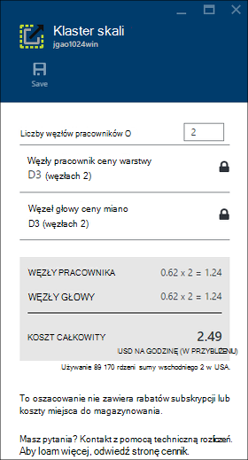
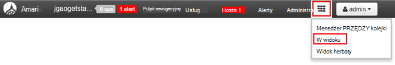

<properties
    pageTitle="Zarządzanie systemem Linux Hadoop klastrów w za pomocą portalu Azure HDInsight | Microsoft Azure"
    description="Dowiedz się, jak tworzyć i zarządzać nimi za pomocą portalu Azure klastrów HDInsight systemem Linux."
    services="hdinsight"
    documentationCenter=""
    authors="mumian"
    manager="jhubbard"
    editor="cgronlun"
    tags="azure-portal"/>

<tags
    ms.service="hdinsight"
    ms.workload="big-data"
    ms.tgt_pltfrm="na"
    ms.devlang="na"
    ms.topic="article"
    ms.date="08/10/2016"
    ms.author="jgao"/>

#Zarządzanie klastrów Hadoop w HDInsight za pomocą portalu Azure

[AZURE.INCLUDE [selector](../../includes/hdinsight-portal-management-selector.md)]

Za pomocą [Azure portal][azure-portal], możesz zarządzać systemem Linux klastrów w Azure HDInsight. Informacje na temat tworzenia Hadoop klastrów w HDInsight przy użyciu innych narzędzi za pomocą selektor tabulatorów. 

**Wymagania wstępne**

Przed rozpoczęciem tego artykułu, musisz mieć następujące czynności:

- **Azure subskrypcji**. Zobacz [Azure pobrać bezpłatną wersję próbną](https://azure.microsoft.com/documentation/videos/get-azure-free-trial-for-testing-hadoop-in-hdinsight/).

##Otwórz Portal usługi

1. Zaloguj się do [https://portal.azure.com](https://portal.azure.com).
2. Po otwarciu portalu, możesz wykonać następujące czynności:

    - Kliknij przycisk **Nowy** z menu po lewej stronie, aby utworzyć nowy klaster:
    
        
    - Kliknij pozycję **Klastrów HDInsight** z menu po lewej stronie, aby wyświetlić listę istniejących klastrów
    
        

        Jeśli **Usługa HDInsight** nie jest wyświetlany w menu po lewej stronie, kliknij przycisk **Przeglądaj**, a następnie kliknij **Klastrów HDInsight**.

        

##Tworzenie klastrów

[AZURE.INCLUDE [delete-cluster-warning](../../includes/hdinsight-delete-cluster-warning.md)]

Usługa HDInsight współdziała z składniki szeroki zakres Hadoop. Aby uzyskać listę elementów, które zostały zweryfikowane i obsługiwane zobacz [która wersja programu Hadoop w Azure HDInsight](hdinsight-component-versioning.md). Dla klastrów ogólnych informacji o tworzeniu zobacz [Tworzenie Hadoop klastrów w HDInsight](hdinsight-hadoop-provision-linux-clusters.md). 

##Listy i Pokaż klastrów

1. Zaloguj się do [https://portal.azure.com](https://portal.azure.com).
2. Kliknij pozycję **Klastrów HDInsight** z menu po lewej stronie, aby wyświetlić listę istniejących klastrów.
3. Kliknij nazwę klaster. Jeśli lista klaster jest długa, możesz użyć filtru w górnej części strony.
4. Kliknij dwukrotnie klaster z listy, aby wyświetlić szczegóły.

    **Menu i podstawowe informacje dotyczące**:

    
    
    - **Ustawienia** i **Wszystkie**: jest wyświetlana karta **Ustawienia** dla klastrów, dzięki czemu można uzyskać dostęp do informacji o grupie szczegółowe konfiguracji.
    - **Pulpit nawigacyjny**, **Pulpit nawigacyjny klaster** i ** adresu URL: są wszystkie sposoby uzyskiwania dostępu klaster pulpitu nawigacyjnego, czyli Ambari Web dla klastrów systemem Linux.
    - **Zabezpieczanie powłoki**: Pokazuje z instrukcjami, aby połączyć się z klastrem przy użyciu połączenia Secure Shell (SSH).
    - **Klaster skali**: umożliwia zmianę liczby węzłów pracownika dla tego klaster.
    - **Usuwanie**: usuwa klaster.
    - **Szybki Start ()**: Wyświetla informacje, które mogą pomóc rozpocząć korzystanie z usługi HDInsight.
    - **Użytkownicy ()**: umożliwia ustawianie uprawnień do _portalu zarządzania_ tym klastrem dla innych użytkowników w subskrypcji usługi Azure.
    
        > [AZURE.IMPORTANT] To _tylko_ ma wpływ na dostęp i uprawnienia, aby ten klaster w portalu Azure, a nie ma wpływu na kto może nawiązać połączenia lub przesyłać zadania do klastrów HDInsight.
    - **Znaczniki ()**: znaczników umożliwia określenie par klucz wartość do definiowania niestandardowych taksonomii usług w chmurze. Na przykład może utworzyć klucz o nazwie __projektu__, a następnie użyj wartości wspólne dla wszystkich usług skojarzonych z określonego projektu.
    - **Widoki Ambari**: łącza do Ambari w sieci Web.
    
    > [AZURE.IMPORTANT] Aby zarządzać usług udostępnianych przez klaster HDInsight, należy użyć Ambari sieci Web lub interfejsu API usługi REST Ambari. Aby uzyskać więcej informacji na temat korzystania z Ambari zobacz [Zarządzanie HDInsight klastrów przy użyciu Ambari](hdinsight-hadoop-manage-ambari.md).

    **Zastosowania**:
    
    
    
5. Kliknij przycisk **Ustawienia**.

    

    - **Dzienniki inspekcji**:
    - **Szybki Start**: Wyświetla informacje, które mogą pomóc rozpocząć korzystanie z usługi HDInsight.
    - **Klaster skali**: Zwiększ i Zmniejsz liczbę węzłach pracownika.
    - **Zabezpieczanie powłoki**: Pokazuje z instrukcjami, aby połączyć się z klastrem przy użyciu połączenia Secure Shell (SSH).
    - **Usługa HDInsight partnera**: Dodawanie i usuwanie bieżącego partnera HDInsight.
    - **Metastores zewnętrzne**: wyświetlanie metastores gałąź i Oozie. Metastores można skonfigurować tylko w trakcie procesu tworzenia klaster.
    - **Akcje skryptu**: uruchamianie urodzinową skryptów w klastrze.
    - **Właściwości**: wyświetlanie właściwości klaster.
    - **Klucze miejsca do magazynowania Azure**: wyświetlanie domyślnego konta miejsca do magazynowania i klucza. Konto miejsca do magazynowania jest konfiguracji podczas procesu tworzenia klaster.
    - **Klaster AAD tożsamości**: 
    - **Użytkownicy**: umożliwia ustawianie uprawnień do _portalu zarządzania_ tym klastrem dla innych użytkowników w subskrypcji usługi Azure.
    - **Znaczniki**: znaczników umożliwia określenie par klucz wartość do definiowania niestandardowych taksonomii usług w chmurze. Na przykład może utworzyć klucz o nazwie __projektu__, a następnie użyj wartości wspólne dla wszystkich usług skojarzonych z określonego projektu.
    
    > [AZURE.NOTE] To jest Lista ogólna dostępnych ustawień; nie wszystkie będzie obecne dla wszystkich typów klaster.

6. Kliknij pozycję **Właściwości**:

    Dostępne są następujące właściwości:
    
    - **Nazwa hosta**: Nazwa klaster.
    - **Klaster adresu URL**.
    - **Stan**: obejmują przerwane zaakceptowane, ClusterStorageProvisioned, AzureVMConfiguration, HDInsightConfiguration, operacyjne, uruchomiony, błąd, usuwanie, usunięte, upłynął limit czasu, DeleteQueued, DeleteTimedout, DeleteError, PatchQueued, CertRolloverQueued, ResizeQueued, ClusterCustomization
    - **Region**: Azure lokalizacji. Aby uzyskać listę obsługiwanych lokalizacje Azure zobacz Lista rozwijana **Region** na [HDInsight ceny](https://azure.microsoft.com/pricing/details/hdinsight/).
    - **Dane utworzone**.
    - **System operacyjny**: **Windows** i **Linux oraz**.
    - **Typ**: Hadoop, HBase, burza, wzmóc. 
    - **Wersja**. Zobacz [wersji HDInsight](hdinsight-component-versioning.md)
    - **Subskrypcja**: Nazwa subskrypcji.
    - **Identyfikator subskrypcji**.
    - **Domyślne źródło danych**: system plików klastrze domyślne.
    - **Węzły pracownik ceny warstwy**.
    - **Cennik poziomu węzła głowy**.

##Usuwanie klastrów

Usuń klaster nie spowoduje usunięcia domyślne konto miejsca do magazynowania lub kont połączonych miejsca do magazynowania. Możesz ponownie utworzyć klaster przy użyciu tych samych kont miejsca do magazynowania i tym samym metastores. Zaleca się, aby używać nowego domyślnego kontenera obiektów Blob, gdy ponownie utworzyć klaster.

1. Zaloguj się do [portalu][azure-portal].
2. Kliknij pozycję **Przeglądaj wszystkie** z menu po lewej stronie, kliknij przycisk **HDInsight klastrów**, kliknij swoją nazwę klaster.
3. Kliknij przycisk **Usuń** w górnym menu, a następnie postępuj zgodnie z instrukcjami.

Zobacz też [Wstrzymaj i zamknij klastrów](#pauseshut-down-clusters).

##Skala klastrów
Klaster skalowania funkcji umożliwia zmianę liczby węzłów pracownik używane przez klaster, na którym działa usługa Azure HDInsight bez konieczności ponownego tworzenia klaster.

>[AZURE.NOTE] Tylko klastrów z usługi HDInsight wersji 3.1.3 lub wyższej są obsługiwane. Jeśli masz pewności co do wersji klaster, można sprawdzić na stronie właściwości.  Zobacz [listę i Pokaż klastrów](#list-and-show-clusters).

Wpływ zmian liczby węzłów danych dla każdego typu klaster obsługiwanych przez HDInsight:

- Hadoop

    Bezproblemowa można zwiększyć liczby węzłów pracownika w klastrze Hadoop, który jest uruchomiony bez wpływania zadania Oczekiwanie lub nie działa. Nowe zadania można również przesyłać w trakcie tej operacji. Błędy w operacji skalowania bezpiecznie są obsługiwane, tak aby klaster zawsze pozostanie w stanie działać.

    Podczas skalowania klastrze Hadoop w dół poprzez zmniejszenie liczby węzłów danych są ponownie uruchamiane niektóre z tych usług w klastrze. Spowoduje to wszystko działa i zaległe zadania kończy się niepowodzeniem po zakończeniu operacji skalowania. Można jednak Prześlij ponownie zadania po wykonaniu operacji.

- HBase

    Bezproblemowa można dodawać lub usunąć węzły klaster HBase, gdy jest uruchomiony. Serwery regionalne są automatycznie zbilansowane w ciągu kilku minut wykonywania operacji skalowania. Jednak można też ręcznie saldo serwery regionalne, logując się do headnode klastrze i uruchomione następujące polecenia w oknie wiersza polecenia:

        >pushd %HBASE_HOME%\bin
        >hbase shell
        >balancer

    Aby uzyskać więcej informacji na temat korzystania z powłoki HBase Zobacz]
- Burza

    Można bezproblemowo dodawać i usuwać węzłów danych do klaster burza, gdy jest uruchomiony. Ale po pomyślnym zakończeniu operacji skalowania, będzie konieczne wyrównać topologii.

    Ponowne równoważenie można zrobić na dwa sposoby:

    * Interfejs użytkownika sieci web Burza
    * Narzędzie interfejsu wiersza polecenia (polecenie)

    Można znaleźć w [dokumentacji Burza Apache](http://storm.apache.org/documentation/Understanding-the-parallelism-of-a-Storm-topology.html) uzyskać więcej szczegółowych informacji.

    Interfejs użytkownika sieci web Burza jest dostępna w klastrze HDInsight:

    

    Oto przykład jak wyrównać topologii Burza przy użyciu polecenia polecenie:

        ## Reconfigure the topology "mytopology" to use 5 worker processes,
        ## the spout "blue-spout" to use 3 executors, and
        ## the bolt "yellow-bolt" to use 10 executors

        $ storm rebalance mytopology -n 5 -e blue-spout=3 -e yellow-bolt=10

**Aby przeskalować klastrów**

1. Zaloguj się do [portalu][azure-portal].
2. Kliknij pozycję **Przeglądaj wszystkie** z menu po lewej stronie, kliknij przycisk **HDInsight klastrów**, kliknij swoją nazwę klaster.
3. W górnym menu kliknij polecenie **Ustawienia** , a następnie kliknij **Klaster Skala**.
4. Wprowadź **numer pracownika węzły**. Limit liczby węzła zmienia się między Azure subskrypcji. Możesz również skontaktować się rozliczeń pomocy technicznej, aby zwiększyć limit.  Informacje o kosztach zostaną zastosowane zmiany wprowadzone przez użytkownika liczby węzłów.

    

##Wstrzymaj i zamknij klastrów

Większość zadań Hadoop to zadań, które są tylko uruchomiono od czasu do czasu. W przypadku większości klastrów Hadoop jest duży okresów czasu, który nie jest używany klaster przetwarzania. Z usługi HDInsight dane są przechowywane w magazynie Azure, więc można bezpiecznie usunąć klaster, gdy nie jest używany.
Możesz również są naliczane dla klastrów HDInsight nawet wtedy, gdy nie jest używany. Ponieważ opłaty za klaster są wielokrotnie większe niż opłaty za miejsca do magazynowania, warto ekonomicznych usuwanie klastrów, gdy nie są one używane.

Istnieje wiele sposobów zostanie procesu:

- Factory Azure danych użytkownika. Zobacz [Tworzenie na żądanie systemem Linux Hadoop klastrów w przy użyciu Factory danych Azure HDInsight](hdinsight-hadoop-create-linux-clusters-adf.md) do tworzenia usług HDInsight połączone na żądanie.
- Za pomocą programu PowerShell Azure.  Zobacz [Analiza danych opóźnień lotów](hdinsight-analyze-flight-delay-data.md).
- Za pomocą interfejsu wiersza polecenia Azure. Zobacz [Zarządzanie HDInsight klastrów za pomocą interfejsu wiersza polecenia Azure](hdinsight-administer-use-command-line.md).
- Za pomocą usługi HDInsight .NET SDK. Zobacz [Hadoop przesyłanie zadania](hdinsight-submit-hadoop-jobs-programmatically.md).

Aby uzyskać informacje cennik zobacz [HDInsight ceny](https://azure.microsoft.com/pricing/details/hdinsight/). Aby usunąć klaster z portalu, zobacz [Usuwanie klastrów](#delete-clusters)

##Zmienianie hasła

Klaster HDInsight mogą być dwa konta użytkownika. Usługa HDInsight klaster (alias konta użytkownika Konto użytkownika HTTP) i SSH konta użytkownika są tworzone w trakcie procesu tworzenia. Czy w sieci web Ambari interfejs użytkownika do zmiany klaster nazwa użytkownika konta użytkownika i hasło, a akcje skrypt, aby zmienić konto użytkownika SSH

###Zmienianie hasła użytkownika klaster

Interfejs sieci Web Ambari umożliwia zmianę klaster hasła użytkownika. Aby zalogować się do Ambari, należy użyć istniejącej klaster nazwy użytkownika i hasła.

> [AZURE.NOTE] Jeśli zmienisz hasło użytkownika (administratora) klaster, może to powodować skrypt, które akcje uruchomiono przed tym klastrem kończy się niepowodzeniem. Jeśli masz akcji trwałe skrypt tego węzły pracownik docelowej, te może zakończyć się niepowodzeniem po dodaniu, że węzły do klastrów do zmiany rozmiaru operacji. Aby uzyskać więcej informacji o działaniach skrypt zobacz [klastrów Dostosowywanie HDInsight za pomocą skryptu akcje](hdinsight-hadoop-customize-cluster-linux.md).

1. Zaloguj się do Ambari interfejs sieci Web przy użyciu poświadczeń użytkownika klaster HDInsight. Domyślna nazwa użytkownika to **administratora**. Adres URL jest **https://&lt;HDInsight klaster nazwa > azurehdinsight.net**.
2. Kliknij pozycję **Administrator** w górnym menu, a następnie kliknij "Zarządzanie Ambari". 
3. Z menu po lewej stronie kliknij pozycję **Użytkownicy**.
4. Kliknij pozycję **Administrator**.
5. Kliknij przycisk **Zmień hasło**.

Następnie Ambari zmienia hasło na wszystkich węzłach w klastrze.

###Zmienianie hasła użytkownika SSH

1. Przy użyciu edytora tekstu, Zapisz poniższe dane jako plik o nazwie __changepassword.sh__.

    > [AZURE.IMPORTANT] Należy użyć edytora używający wysuwu wiersza jako koniec wiersza. Jeśli w edytorze używane CRLF, skrypt nie będzie działać.
    
        #! /bin/bash
        USER=$1
        PASS=$2

        usermod --password $(echo $PASS | openssl passwd -1 -stdin) $USER

2. Przekaż plik do lokalizacji przechowywania, które są dostępne z usługi HDInsight za pomocą adresu HTTP lub HTTPS. Na przykład pliku publicznego przechowywać takiej jak OneDrive lub obiektów Blob platformy Azure przestrzeni dyskowej. Zapisz identyfikator URI (adres HTTP lub HTTPS,) do pliku, jak jest to potrzebne w następnym kroku.

3. Z portalu Azure wybierz klaster HDInsight, a następnie wybierz pozycję __wszystkie ustawienia__. Karta __Ustawienia__ zaznacz __Akcje skryptu__.

4. Karta __Akcje skryptu__ zaznacz __Przesyłanie nowych__. Gdy pojawi się karta __Akcja skrypt przesyłania__ , wprowadź następujące informacje.

  	| Pole | Wartość |
  	| ----- | ----- |
  	| Nazwa | Zmienianie ssh hasła |
  	| Skrypt imprezie identyfikator URI | Identyfikator URI pliku changepassword.sh |
  	| Węzły (głowy, pracownik, Nimbus, kierownik, Zookeeper, itp.) | ✓ dla wszystkich typów węzłów na liście |
  	| Parametry | Wprowadź nazwę użytkownika SSH, a następnie nowe hasło. Należy jednej spacji między nazwę użytkownika i hasło.
  	| Utrzymują ta akcja skrypt... | Nie zaznaczaj tego pola wyboru.

5. Wybierz pozycję __Utwórz__ , aby zastosować skrypt. Po zakończeniu skrypt można połączyć się z klastrem przy użyciu SSH przy użyciu nowego hasła.

##Udzielanie i revoke programu access

Usługa HDInsight klastrów są następujące usługi sieci web HTTP (wszystkie te usługi mają RESTful punkty końcowe):

- ODBC
- JDBC
- Ambari
- Oozie
- Templeton

Domyślnie te usługi uzyskują dostęp. Możesz można revoke i udzielanie dostępu za pomocą [Interfejsu wiersza polecenia Azure](hdinsight-administer-use-command-line.md#enabledisable-http-access-for-a-cluster) i [Azure programu PowerShell](hdinsight-administer-use-powershell.md#grantrevoke-access).

##Znajdowanie Identyfikatora subskrypcji

**Aby znaleźć subskrypcji Azure identyfikatory**

1. Zaloguj się do [portalu][azure-portal].
2. Z menu po lewej stronie kliknij pozycję **Przeglądaj wszystkie** , a następnie kliknij pozycję **Subskrypcje**. Każdej subskrypcji ma nazwę oraz identyfikatora

Każdy klaster jest związany Azure subskrypcji. Identyfikator subskrypcji jest wyświetlana w klastrze **podstawowe** kafelków. Zobacz [listę i Pokaż klastrów](#list-and-show-clusters).

##Znajdowanie grup zasobów 

W trybie ARM każdy klaster HDInsight jest tworzona z grupą Azure zasobów. Grupa zasobów Azure, której należy klaster zostanie wyświetlony w:

- Lista klaster zawiera kolumnę **Grupa zasobów** .
- Klaster **podstawowe** kafelków.  

Zobacz [listę i Pokaż klastrów](#list-and-show-clusters).

##Znajdowanie domyślne konto miejsca do magazynowania

Każdy klaster HDInsight ma domyślne konto miejsca do magazynowania. Domyślne konto miejsca do magazynowania i kluczy dla klastrów pojawi się w obszarze **Ustawienia**/**Właściwości**/**Azure miejsca do magazynowania klawiszy**. Zobacz [listę i Pokaż klastrów](#list-and-show-clusters).

##Uruchamianie kwerend gałęzi

Nie można uruchomić zadania gałęzi bezpośrednio z poziomu portalu Azure, ale można użyć widoku gałęzi na Ambari interfejs sieci Web.

**Uruchamianie kwerend gałęzi przy użyciu widoku gałęzi Ambari**

1. Zaloguj się do Ambari interfejs sieci Web przy użyciu poświadczeń użytkownika klaster HDInsight. Nazwa użytkownika defaut jest **Administrator**. Adres URL jest **https://&lt;HDInsight klaster nazwa > azurehdinsight.net**.
2. Otwórz widok gałęzi, jak pokazano w poniższej zrzut ekranu:  

    
3. Kliknij **kwerendę** w górnym menu.
4. Wprowadź zapytanie gałąź w **Edytorze zapytań**, a następnie kliknij polecenie **Wykonaj**.

##Monitorowanie zadań

Zobacz [Zarządzanie HDInsight klastrów przy użyciu Interfejsu sieci Web Ambari](hdinsight-hadoop-manage-ambari.md#monitoring).

##Przeglądanie plików

Azure portal można przeglądać zawartość pojemnika domyślnego.

1. Zaloguj się do [https://portal.azure.com](https://portal.azure.com).
2. Kliknij pozycję **Klastrów HDInsight** z menu po lewej stronie, aby wyświetlić listę istniejących klastrów.
3. Kliknij nazwę klaster. Jeśli lista klaster jest długa, możesz użyć filtru w górnej części strony.
4. Kliknij przycisk **Ustawienia**.
5. Karta **Ustawienia** kliknij **Klawisze miejsca do magazynowania Azure**.
6. Kliknij nazwę konta magazynu domyślnego.
7. Kliknij Kafelek **obiektów blob** .
8. Kliknij nazwę kontenera domyślnego.

##Monitorowanie użycia klaster

W sekcji __zastosowania__ karta klaster HDInsight Wyświetla informacje dotyczące liczby rdzeni dostępne do subskrypcji do użytku z usługi HDInsight, jak również liczby rdzeni przydzielonych ten klaster i jak są przydzielane dla węzłów w tym klastrze. Zobacz [listę i Pokaż klastrów](#list-and-show-clusters).

> [AZURE.IMPORTANT] Monitorowanie usług udostępnianych przez klaster HDInsight, należy użyć Ambari sieci Web lub interfejsu API usługi REST Ambari. Aby uzyskać więcej informacji na temat korzystania z Ambari zobacz [Zarządzanie HDInsight klastrów przy użyciu Ambari](hdinsight-hadoop-manage-ambari.md)

##Nawiązywanie połączenia z klastrem

Zobacz [Używanie gałęzi z Hadoop w HDInsight z SSH](hdinsight-hadoop-use-hive-ssh.md#ssh).
    
##Następne kroki
W tym artykule zapewne wiesz, jak utworzyć klaster HDInsight za pomocą portalu i sposobu otwierania narzędzia wiersza polecenia Hadoop. Aby uzyskać więcej informacji, zobacz następujące artykuły:

* [Administrowanie przy użyciu programu PowerShell Azure HDInsight](hdinsight-administer-use-powershell.md)
* [Administrowanie przy użyciu polecenie Azure HDInsight](hdinsight-administer-use-command-line.md)
* [Tworzenie klastrów HDInsight](hdinsight-provision-clusters.md)
* [Używanie gałąź w HDInsight](hdinsight-use-hive.md)
* [Używanie świnka w HDInsight](hdinsight-use-pig.md)
* [Używanie Sqoop w HDInsight](hdinsight-use-sqoop.md)
* [Rozpoczynanie pracy z usługa Azure HDInsight](hdinsight-hadoop-linux-tutorial-get-started.md)
* [Która wersja programu Hadoop znajduje się w Azure HDInsight?](hdinsight-component-versioning.md)

[azure-portal]: https://portal.azure.com
[image-hadoopcommandline]: ./media/hdinsight-administer-use-portal-linux/hdinsight-hadoop-command-line.png "Wiersz polecenia Hadoop"
