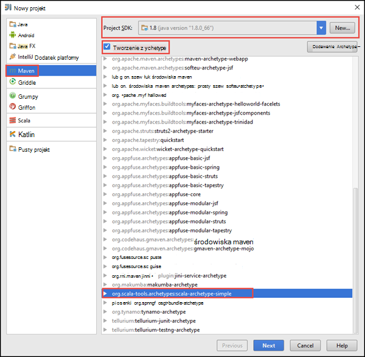

<properties
    pageTitle="Tworzenie autonomicznego scala uruchamiania aplikacji na klastrów HDInsight Spark | Microsoft Azure"
    description="Dowiedz się, jak tworzyć autonomiczne Spark aplikacji do uruchamiania w iskrowym HDInsight klastrów."
    services="hdinsight"
    documentationCenter=""
    authors="nitinme"
    manager="jhubbard"
    editor="cgronlun"
    tags="azure-portal"/>

<tags
    ms.service="hdinsight"
    ms.workload="big-data"
    ms.tgt_pltfrm="na"
    ms.devlang="na"
    ms.topic="article"
    ms.date="10/28/2016"
    ms.author="nitinme"/>

# Tworzenie autonomicznych Scala aplikację do uruchamiania w klastrze Apache Spark na HDInsight Linux

Ten artykuł zawiera instrukcje krok po kroku dotyczące tworzenia aplikacji Spark autonomicznego napisana Scala środowiska Maven za pomocą IntelliJ ogólny obraz. Artykuł Apache środowiska Maven została użyta jako system kompilacji i zaczyna się od istniejącego archetype środowiska Maven dla Scala dostarczony przez IntelliJ ogólny obraz.  Na najwyższym poziomie tworzenia Scala aplikacji w IntelliJ ogólny obraz będzie obejmować następujące czynności:

* Używanie środowiska Maven jako system kompilacji.
* Plik modelu obiektów programu Project (POM) aktualizacji rozwiązywać Spark modułu zależności.
* Napisz aplikacji Scala.
* Generowanie pliku słoik, który może być przesyłany do klastrów HDInsight Spark.
* Uruchom aplikację w klastrze Spark przy użyciu Livy.

>[AZURE.NOTE] Usługa HDInsight zawiera również narzędzie dodatek IntelliJ POMYSŁU do uprościć proces tworzenia i przesyłania aplikacji z klastrem HDInsight Spark w systemie Linux. Aby uzyskać więcej informacji zobacz [Używanie HDInsight narzędzia wtyczki uzyskać ogólny obraz IntelliJ do tworzenia i przesyłania Spark aplikacji](hdinsight-apache-spark-intellij-tool-plugin.md).

**Wymagania wstępne**

* Subskrypcję usługi Azure. Zobacz [Azure pobrać bezpłatną wersję próbną](https://azure.microsoft.com/documentation/videos/get-azure-free-trial-for-testing-hadoop-in-hdinsight/).
* Klaster Apache Spark na HDInsight Linux. Aby uzyskać instrukcje zobacz [Tworzenie Spark Apache klastrów w Azure HDInsight](hdinsight-apache-spark-jupyter-spark-sql.md).
* Oracle Java Development kit. [Tutaj](http://www.oracle.com/technetwork/java/javase/downloads/jdk8-downloads-2133151.html)możesz go zainstalować.
* Java IDE. W tym artykule używa POMYSŁU IntelliJ 15.0.1. [Tutaj](https://www.jetbrains.com/idea/download/)możesz go zainstalować.

## Zainstaluj wtyczkę Scala uzyskać ogólny obraz IntelliJ

Jeśli instalacji IntelliJ ogólny obraz nie monituje o włączenie dodatku Scala, uruchamianie IntelliJ POMYSŁU i przechodzenie przez następujące kroki, aby zainstalować wtyczkę:

1. Rozpoczynanie IntelliJ ogólny obraz i na ekranie powitalnym kliknij przycisk **Konfiguruj** , a następnie kliknij **wtyczki**.

    

2. Na następnym ekranie kliknij pozycję **JetBrains Zainstaluj wtyczkę** w lewym dolnym rogu. W otwartym oknie dialogowym **Przeglądaj wtyczek JetBrains** wyszukiwanie Scala, a następnie kliknij przycisk **Zainstaluj**.

    

3. Po pomyślnym zainstalowaniu wtyczkę kliknij **przycisk Uruchom ponownie POMYSŁU IntelliJ** ponowne IDE.

## Tworzenie projektu Scala autonomicznego

1. Uruchom IntelliJ POMYSŁU i tworzenie nowego projektu. W oknie dialogowym projektu nowej wybrać następujące opcje, a następnie kliknij przycisk **Dalej**.

    

    * Wybierz pozycję **środowiska Maven** jako typu projektu.
    * Określ **zestaw SDK programu Project**. Kliknij przycisk Nowy, a następnie przejdź do katalogu instalacji języka Java zwykle `C:\Program Files\Java\jdk1.8.0_66`.
    * Wybierz opcję **Utwórz z archetype** .
    * Na liście archetypes zaznacz **org.scala tools.archetypes:scala-archetype prosty**. To utworzyć strukturę katalogów prawy i Pobierz zależności niezbędnych ustawień domyślnych napisać Scala program.

2. Podaj odpowiednie wartości dla **Identyfikator grupy**, **ArtifactId**i **wersji**. Kliknij przycisk **Dalej**.

3. W następnym okno dialogowe, w którym możesz określić katalogu macierzystego środowiska Maven oraz inne ustawienia użytkownika, zaakceptuj ustawienia domyślne, a następnie kliknij przycisk **Dalej**.

4. W oknie dialogowym ostatniej Określ nazwę projektu i lokalizację, a następnie kliknij przycisk **Zakończ**.

5. Usuwanie pliku **MySpec.Scala** **src\test\scala\com\microsoft\spark\example**. Nie ma potrzeby to dla aplikacji.

6. W razie potrzeby zmień nazwy plików źródła i badania domyślne. W okienku po lewej stronie w IntelliJ ogólny obraz przejdź do **src\main\scala\com.microsoft.spark.example**. Kliknij prawym przyciskiem myszy **App.scala**, kliknij przycisk **Refactor**, kliknij przycisk Zmień nazwę pliku, a w oknie dialogowym podaj nową nazwę dla aplikacji, a następnie kliknij **Refactor**.

      

7. W obszarze kolejne kroki zostanie zaktualizowany pom.xml, aby zdefiniować zależności dla aplikacji Spark Scala. Dla tych zależności do pobrania i rozwiązać automatycznie możesz odpowiednio skonfigurować środowiska Maven.

    

    1. W menu **plik** kliknij pozycję **Ustawienia**.
    2. W oknie dialogowym **Ustawienia** przejdź do **utworzenia wykonywania wdrożenia** > **Narzędzia do tworzenia** > **środowiska Maven** > **Importowanie**.
    3. Wybierz opcję, aby **środowiska Maven importu projektów automatycznie**.
    4. Kliknij przycisk **Zastosuj**, a następnie kliknij **przycisk OK**.

8. Aktualizowanie Scala plik źródłowy, aby dołączyć kodu aplikacji. Otwieranie i zastąpić istniejący kod przykładowy następujący kod i zapisać zmiany. Kod odczytuje dane z HVAC.csv (dostępne na wszystkich klastrów HDInsight Spark) pobiera wiersze, które masz tylko jedną cyfrę w kolumnie szóstym i zapisuje dane wyjściowe **/HVACOut** w kontenerze domyślnego miejsca do magazynowania dla klaster.

        package com.microsoft.spark.example

        import org.apache.spark.SparkConf
        import org.apache.spark.SparkContext

        /**
          * Test IO to wasb
          */
        object WasbIOTest {
          def main (arg: Array[String]): Unit = {
            val conf = new SparkConf().setAppName("WASBIOTest")
            val sc = new SparkContext(conf)

            val rdd = sc.textFile("wasbs:///HdiSamples/HdiSamples/SensorSampleData/hvac/HVAC.csv")

            //find the rows which have only one digit in the 7th column in the CSV
            val rdd1 = rdd.filter(s => s.split(",")(6).length() == 1)

            rdd1.saveAsTextFile("wasbs:///HVACout")
          }
        }

9. Aktualizowanie pom.xml.

    1.  W ramach `<project>\<properties>` Dodaj następujący:

            <scala.version>2.10.4</scala.version>
            <scala.compat.version>2.10.4</scala.compat.version>
            <scala.binary.version>2.10</scala.binary.version>

    2. W ramach `<project>\<dependencies>` Dodaj następujący:

            <dependency>
              <groupId>org.apache.spark</groupId>
              <artifactId>spark-core_${scala.binary.version}</artifactId>
              <version>1.4.1</version>
            </dependency>

    Zapisz wprowadzone zmiany pom.xml.

10. Utwórz plik .jar. Ogólny obraz IntelliJ umożliwia tworzenie SŁOIK jako struktura projektu. Wykonaj następujące czynności.

    1. W menu **plik** kliknij polecenie **Struktury projektu**.
    2. W oknie dialogowym **Struktury projektu** kliknij **artefakty** , a następnie kliknij znak plus. W wyświetlonym oknie dialogowym kliknij pozycję **JAR**, a następnie kliknij **z modułów z zależnościami**.

        

    3. W oknie dialogowym **Tworzenie JAR z modułów** , kliknij wielokropek ( ) przed **Główne zajęć**.

    4. W oknie dialogowym **Wybierz klasy główne** zaznacz klasy, która pojawia się jako domyślny, a następnie kliknij **przycisk OK**.

        

    5. W oknie dialogowym **Tworzenie JAR z modułów** upewnij się, że wybrano opcję, aby **wyodrębnić do miejsca docelowego SŁOIK** , a następnie kliknij **przycisk OK**. Spowoduje to utworzenie pojedynczego SŁOIK z wszystkie zależności.

        

    6. Na karcie Układ wyjście zawiera listę wszystkich słoików, które są częścią projektu środowiska Maven. Możesz zaznaczyć i usunąć te, na którym aplikacja Scala ma nie bezpośrednia zależność. Aplikacja jest tworzone w tym miejscu, można usunąć wszystkie znaki oprócz ostatniego jedną (**SparkSimpleApp skompilować dane wyjściowe**). Wybierz pozycję słoików, aby usunąć, a następnie kliknij ikonę **Usuń** .

        

        Upewnij się, że jest zaznaczone pole **Tworzenie na rozpoczynanie** , co zapewnia utworzony słoju, każdorazowo projektu budowy lub zaktualizowane. Kliknij przycisk **Zastosuj** , a następnie **przycisk OK**.

    7. Na pasku menu kliknij przycisk **Konstruuj**, a następnie kliknij **Wprowadź projektu**. Możesz również kliknąć **Tworzenie artefakty** tworzenie słoju. Słoik wynik jest tworzona w obszarze **\out\artifacts**.

        

## Uruchamianie aplikacji w klastrze Spark

Aby uruchomić aplikację w klastrze, wykonaj następujące czynności:

* **Kopiowanie słoik aplikacji do Azure magazyn obiektów blob** skojarzone z klastrem. Za pomocą [**AzCopy**](../storage/storage-use-azcopy.md), narzędzie wiersza polecenia, aby to zrobić. Istnieje wiele innych klientów, a także umożliwia przekazywanie danych. Można znaleźć więcej informacji na temat ich na [przekazywanie danych dla zadań Hadoop w HDInsight](hdinsight-upload-data.md).

* **Używanie Livy, aby przesłać zadanie aplikacji zdalnie** do klastrów Spark. Klastrów Spark na HDInsight zawiera Livy, który umożliwia uzyskanie dostępu do punktów końcowych pozostałych zdalnie przesyłać Spark zadania. Aby uzyskać więcej informacji zobacz [zadania przesyłanie Spark zdalnie przy użyciu Livy z klastrów Spark na HDInsight](hdinsight-apache-spark-livy-rest-interface.md).

## Zobacz też

* [Omówienie: Apache Spark na usługa Azure HDInsight](hdinsight-apache-spark-overview.md)

### Scenariusze

* [Spark usługi BI: Analiza danych interakcyjnych przy użyciu Spark w HDInsight z narzędzi analizy Biznesowej](hdinsight-apache-spark-use-bi-tools.md)

* [Spark z komputera nauki: używanie Spark w HDInsight do analizy temperatury konstrukcyjnych Instalacja grzewczo-Wentylacyjna danych](hdinsight-apache-spark-ipython-notebook-machine-learning.md)

* [Spark z komputera nauki: używanie Spark w HDInsight do przewidywania żywność wyników inspekcji](hdinsight-apache-spark-machine-learning-mllib-ipython.md)

* [Spark Streaming: Używanie Spark w HDInsight do tworzenia aplikacji strumieniowych w czasie rzeczywistym](hdinsight-apache-spark-eventhub-streaming.md)

* [Analiza dziennika witryny sieci Web przy użyciu Spark w HDInsight](hdinsight-apache-spark-custom-library-website-log-analysis.md)

### Tworzenie i uruchamianie aplikacji

* [Zdalne uruchamianie zadania w klastrze Spark przy użyciu Livy](hdinsight-apache-spark-livy-rest-interface.md)

### Narzędzia i rozszerzenia

* [Tworzenie i przesyłanie Spark Scala aplikacji za pomocą dodatku Narzędzia HDInsight uzyskać ogólny obraz IntelliJ](hdinsight-apache-spark-intellij-tool-plugin.md)

* [Zdalne debugowanie aplikacji Spark za pomocą wtyczki narzędzia HDInsight uzyskać ogólny obraz IntelliJ](hdinsight-apache-spark-intellij-tool-plugin-debug-jobs-remotely.md)

* [Notesy Zeppelin za pomocą klaster Spark na HDInsight](hdinsight-apache-spark-use-zeppelin-notebook.md)

* [Jądra dostępne dla notesu Jupyter w klastrze Spark dla HDInsight](hdinsight-apache-spark-jupyter-notebook-kernels.md)

* [Korzystanie z notesów Jupyter pakietów zewnętrznych](hdinsight-apache-spark-jupyter-notebook-use-external-packages.md)

* [Zainstaluj Jupyter na komputerze i łączenie się z klastrem HDInsight Spark](hdinsight-apache-spark-jupyter-notebook-install-locally.md)

### Zarządzanie zasobami

* [Zarządzanie zasobami dla klastrów Apache Spark w Azure HDInsight](hdinsight-apache-spark-resource-manager.md)

* [Śledzenie i debugowania zadań uruchomionych iskry Apache klaster w HDInsight](hdinsight-apache-spark-job-debugging.md)
