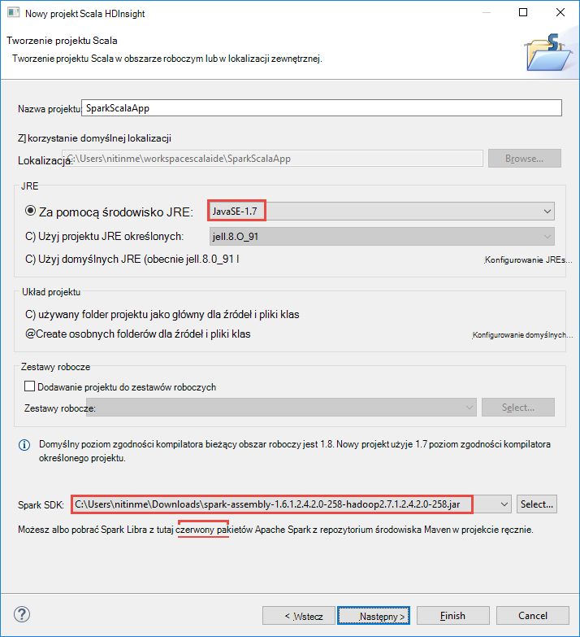

 <properties
    pageTitle="Tworzenie aplikacji Spark Scala przy użyciu narzędzia HDInsight w Azure narzędzi dla Zaćmienie | Microsoft Azure"
    description="Dowiedz się, jak tworzyć autonomiczne Spark aplikacji do uruchamiania w iskrowym HDInsight klastrów."
    services="hdinsight"
    documentationCenter=""
    authors="nitinme"
    manager="jhubbard"
    editor="cgronlun"
    tags="azure-portal"/>

<tags
    ms.service="hdinsight"
    ms.workload="big-data"
    ms.tgt_pltfrm="na"
    ms.devlang="na"
    ms.topic="article"
    ms.date="08/30/2016"
    ms.author="nitinme"/>

# Korzystanie z narzędzi HDInsight Azure zestaw narzędzi dla Zaćmienie, aby utworzyć Spark aplikacje do klaster HDInsight Spark Linux

Ten artykuł zawiera instrukcje krok po kroku dotyczące tworzenia aplikacji Spark napisana Scala i przesłaniem go do iskry HDInsight klaster przy użyciu narzędzia HDInsight w Azure zestaw narzędzi dla Zaćmienie. Za pomocą narzędzia na kilka sposobów:

* Można opracowywać i złożyć wniosek Scala Spark w klastrze HDInsight Spark
* Aby uzyskać dostęp do zasobów klaster HDInsight Spark platformy Azure
* Aby utworzyć i wykonać aplikacji Scala Spark lokalnie

>[AZURE.IMPORTANT] To narzędzie może służyć do tworzenia i przesyłania aplikacji tylko w przypadku klaster HDInsight Spark w systemie Linux.

##Wymagania wstępne

* Subskrypcję usługi Azure. Zobacz [Azure pobrać bezpłatną wersję próbną](https://azure.microsoft.com/documentation/videos/get-azure-free-trial-for-testing-hadoop-in-hdinsight/).

* Klaster Apache Spark na HDInsight Linux. Aby uzyskać instrukcje zobacz [Tworzenie Spark Apache klastrów w Azure HDInsight](hdinsight-apache-spark-jupyter-spark-sql.md).

* Oracle Java Development kit wersji 7 i w wersji 8. 
    * **Java SDK 7** jest używana do kompilowania projektów Spark, ponieważ klastrów HDInsight obsługuje Java wersji 7. Java SDK 7 można pobrać [tutaj](http://www.oracle.com/technetwork/java/javase/downloads/jdk7-downloads-1880260.html).
    * **Java SDK 8** jest używana do obsługi IDE Zaćmienie. Możesz pobrać ją [tutaj](http://www.oracle.com/technetwork/java/javase/downloads/jdk8-downloads-2133151.html).

* Zaćmienie IDE. W tym artykule używa się Zaćmienie. [Tutaj](https://www.eclipse.org/downloads/)możesz go zainstalować.

* Scala IDE dla programu Eclipse. 
    * **Jeśli masz zainstalowaną IDE Zaćmienie**, możesz dodać wtyczkę Scala IDE, przechodząc do **pomocy** -> **Instalowanie nowego oprogramowania**i dodanie [http://download.scala-ide.org/sdk/lithium/e44/scala211/stable/site](http://download.scala-ide.org/sdk/lithium/e44/scala211/stable/site) jako źródło, aby pobrać dodatek Scala dla programu Eclipse. 
    * **Jeśli nie masz IDE Zaćmienie zainstalowany**, możesz zainstalować Scala IDE bezpośrednio w [tym miejscu](http://scala-ide.org/download/sdk.html). Można pobrać plik zip z tego łącza, wyodrębnij ją, przejdź do folderu **/eclipse** , a następnie uruchom plik **eclipse.exe** stamtąd.
    
    >[AZURE.NOTE] Kroki opisane w tym dokumencie są oparte na temat korzystania ze zainstalowany dodatek Scala Zaćmienie IDE.

* Spark SDK. Możesz pobrać ją [tutaj](http://go.microsoft.com/fwlink/?LinkID=723585&clcid=0x409).

* Zainstaluj clipse e (fx) z [https://www.eclipse.org/efxclipse/install.html](https://www.eclipse.org/efxclipse/install.html).

## Instalowanie narzędzi HDInsight w Azure zestaw narzędzi dla programu Eclipse

Usługa HDInsight narzędzia Zaćmienie jest dostępna w ramach tego zestawu narzędzi Azure dla programu Eclipse. Aby uzyskać instrukcje dotyczące instalowania narzędzi Azure zobacz [Instalowanie narzędzi Azure dla programu Eclipse](../azure-toolkit-for-eclipse-installation.md).

## Zaloguj się do subskrypcji usługi Azure

1. Uruchamianie IDE Zaćmienie i Otwórz Eksploratora Azure. W menu **okno** w IDE kliknij pozycję **Pokaż widok** , a **następnie kliknij**. W otwartym oknie dialogowym Rozwiń **Azure**, kliknij pozycję **Eksplorator Azure**, a następnie kliknij **przycisk OK**.

    

2. Kliknij prawym przyciskiem myszy węzeł **Azure** w **Eksploratorze Azure**, a następnie kliknij pozycję **Zarządzaj subskrypcjami**.

3. W oknie dialogowym **Zarządzaj subskrypcjami** kliknij przycisk **Zaloguj** i wprowadź poświadczenia Azure.

    

4. Po zalogowaniu się okno dialogowe **Zarządzaj subskrypcjami** zawiera listę wszystkich subskrypcji Azure skojarzone z poświadczeniami. Kliknij przycisk **Zamknij** w oknie dialogowym.

5. Na karcie Eksplorator Azure rozwiń **HDInsight** , aby wyświetlić klastrów HDInsight Spark w obszarze subskrypcji.

    

6. Nazwa węzła umożliwia przeglądanie zasobów (np. konta miejsca do magazynowania) skojarzone z klastrem można rozwinąć.

    

## Konfigurowanie projektu Spark Scala klaster HDInsight Spark

1. W obszarze roboczym IDE Zaćmienie kliknij kartę **plik**, kliknij pozycję **Nowy**, a następnie kliknij **Projekt**. 

2. W kreatorze **Nowego projektu** rozwiń **HDInsight**, wybierz pozycję **Spark na HDInsight (Scala)**, a następnie kliknij przycisk **Dalej**.

    

3. W oknie dialogowym **Nowy projekt Scala HDInsight** wprowadź/wybierz wartości jak pokazano na poniższej ilustracji, a następnie kliknij przycisk **Dalej**.

    

    * Wprowadź nazwę projektu.
    * W oknie dialogowym **JRE** upewnij się, że **Używanie środowisko JRE** jest ustawiona na **JavaSE 1.7**.
    * Upewnij się, że Spark SDK jest ustawiona do lokalizacji, w której został pobrany zestawu SDK. Łącze do lokalizacji pobierania jest dołączany do [wymagania wstępne dotyczące](#prerequisites) wcześniej w tym temacie. Można również pobrać zestawu SDK za pomocą łącza zawarte w tym oknie dialogowym, jak pokazano na ilustracji powyżej.    

4. W następnym oknie dialogowym kliknij kartę **bibliotek** , a następnie kliknij dwukrotnie **Bibliotekę System JRE [JavaSE 1.7]**.

    

5. W oknie dialogowym **Edytowanie biblioteki** upewnij się, że **Środowisko** jest ustawiona na **JavaSE-1.7(jdk1.7.0_79)**. Jeśli nie jest dostępny jako opcja, wykonaj poniższe czynności.

    1. Wybierz opcję **Alternatywny JRE** i czy **JavaSE-1.7(jdk1.7.0_79)** jest dostępna.
    2. Jeśli nie, kliknij przycisk **JREs zainstalowany** .

          

    3. W oknie dialogowym **JREs zainstalowane** kliknij przycisk **Dodaj**.

            

    4. W oknie dialogowym **JRE typ** wybierz pozycję **Standardowy maszyn wirtualnych**, a następnie kliknij **Dalej**

            

    5. W oknie dialogowym **Definiowanie JRE** kliknij katalogu, a następnie przejdź do lokalizacji dla instalacji JDK 7 i wybierz folder główny dla **jdk1.7.0_79**.

            

    6. Kliknij przycisk **Zakończ**. W oknie dialogowym **JREs zainstalowany** wybierz nowo dodany JRE, a następnie kliknij **przycisk OK**.

           

    7. Nowo dodany JRE powinny być wymienione w **Środowisku wykonanie**. Kliknij przycisk **Zakończ**.

           

6. Ponownie na karcie **bibliotek** kliknij dwukrotnie **Scala biblioteki kontenera [2.11.8]**. W oknie dialogowym **Edytowanie biblioteki** wybierz **Stały biblioteki Scala kontenera: 2.10.6**. 

    

    Dopiero po zamknięciu okna dialogowego Ustawienia projektu, kliknij przycisk **Zakończ** .

## Tworzenie aplikacji Scala dla klastrów HDInsight Spark

1. W otwartych już IDE Zaćmienie, korzystając z **Eksploratora pakietu**rozwiń węzeł projektu, który został utworzony wcześniej, kliknij prawym przyciskiem myszy **src**, wskaż polecenie **Nowy**, a następnie kliknij **inne**.

2. W oknie dialogowym **Wybieranie kreatora** rozwiń **Scala kreatorów**, kliknij **Obiekt Scala**, a następnie kliknij przycisk **Dalej**.

    

3. W oknie dialogowym **Tworzenie nowego pliku** wprowadź nazwę obiektu, a następnie kliknij przycisk **Zakończ**.

    

4. Wklej następujący kod w edytorze tekstów.

        import org.apache.spark.SparkConf
        import org.apache.spark.SparkContext
    
        object MyClusterApp{
          def main (arg: Array[String]): Unit = {
            val conf = new SparkConf().setAppName("MyClusterApp")
            val sc = new SparkContext(conf)
        
            val rdd = sc.textFile("wasbs:///HdiSamples/HdiSamples/SensorSampleData/hvac/HVAC.csv")
        
            //find the rows which have only one digit in the 7th column in the CSV
            val rdd1 =  rdd.filter(s => s.split(",")(6).length() == 1)
        
            rdd1.saveAsTextFile("wasbs:///HVACOut")
          }     
        }

5. Uruchom aplikację w klastrze HDInsight Spark.

    1. Korzystając z **Eksploratora pakietu**kliknij prawym przyciskiem myszy nazwę projektu, a następnie wybierz **Przesyłanie Spark aplikacjom HDInsight**.      

    2. W oknie dialogowym **Przesyłania Spark** Podaj następujące wartości.

        * W polu **Nazwa klaster**wybierz klaster HDInsight Spark, na którym chcesz uruchomić aplikację.

        * Należy wybierać struktura projektu Zaćmienie albo wybierz jedną z dysku twardego.

        * Przed polu tekstowym **Nazwa klasy główne** wprowadź nazwę obiektu określonego w kodzie (patrz rysunek poniżej).

            

        * Ponieważ kod aplikacji, w tym przykładzie nie wymagają argumenty wiersza polecenia lub odwołanie słoików lub pliki, pozostałych pól tekstowych można pozostawić puste.

        * Kliknij przycisk **Prześlij**.

    3. Na karcie **Przesyłania Spark** powinna rozpoczynać się wyświetlania postępu. Możesz wyłączyć aplikację, klikając pozycję czerwony przycisk w oknie "Spark przesyłania". Możesz także wyświetlić dzienniki dla tej aplikacji określone uruchomić, klikając ikonę kuli ziemskiej (oznaczane niebieskiego pola na obrazie).

        

    W następnej sekcji możesz Dowiedz się, jak przejść do tego zadania wyjściowy przy użyciu narzędzia HDInsight w Azure narzędzi dla Zaćmienie.

## Uzyskiwanie dostępu i zarządzanie nimi przy użyciu narzędzia HDInsight w Azure narzędzi dla Zaćmienie klastrów HDInsight Spark

Można wykonywać różnych operacji za pomocą narzędzi HDInsight.

### Dostęp do kontenera miejsca do magazynowania dla klastrów

1. Korzystając z Eksploratora Azure rozwiń węzeł główny **HDInsight** , aby wyświetlić listę klastrów HDInsight Spark, które są dostępne.

3. Rozwiń nazwę klaster, aby wyświetlić konta miejsca do magazynowania i domyślnego kontenera miejsca do magazynowania dla klaster.

    

4. Kliknij nazwę kontenera magazynu skojarzone z klastrem. W prawym okienku powinna być widoczna w folderze o nazwie **HVACOut**. Kliknij dwukrotnie, aby otworzyć folder, a zostanie wyświetlona **część -*** plików. Otwórz jedną z tych plików, aby wyświetlić dane wyjściowe aplikacji.

### Dostęp do serwera Historia Spark

1. Korzystając z **Eksploratora Azure**kliknij prawym przyciskiem myszy nazwę klaster Spark, a następnie wybierz pozycję **Otwórz interfejsu użytkownika Historia Spark**. Po wyświetleniu monitu wprowadź poświadczenia administratora klaster. Należy wcześniej tych podczas inicjowania obsługi administracyjnej klaster.

2. Na pulpicie nawigacyjnym Spark Historia serwera, można wyszukać aplikację możesz po prostu na koniec uruchomiony przy użyciu nazwy aplikacji. W kodzie powyżej, można ustawić przy użyciu nazwy aplikacji `val conf = new SparkConf().setAppName("MyClusterApp")`. W związku z tym nazwy aplikacji Spark był **MyClusterApp**.

### Uruchamianie portalu Ambari

Korzystając z **Eksploratora Azure**kliknij prawym przyciskiem myszy nazwę klaster Spark, a następnie wybierz pozycję **Otwórz klaster portalu zarządzania (Ambari)**. Po wyświetleniu monitu wprowadź poświadczenia administratora klaster. Należy wcześniej tych podczas inicjowania obsługi administracyjnej klaster.

### Zarządzanie subskrypcjami Azure

Domyślnie narzędzia HDInsight w Azure zestaw narzędzi dla Zaćmienie lista klastrów Spark z Azure subskrypcji. W razie potrzeby można określić subskrypcji, dla których chcesz uzyskać dostęp z klastrem. Korzystając z **Eksploratora Azure**kliknij prawym przyciskiem myszy węzeł główny **Azure** , a następnie kliknij **Zarządzaj subskrypcjami**. W oknie dialogowym wyczyść pola wyboru przed subskrypcję, do której użytkownik chce uzyskać dostęp do, a następnie kliknij przycisk **Zamknij**. Możesz również kliknąć **Wyloguj** Aby wylogować się z subskrypcji usługi Azure.

## Uruchom aplikację Spark Scala lokalnie

Za pomocą narzędzia HDInsight Azure zestaw narzędzi dla Zaćmienie przy uruchamianiu aplikacji Spark Scala lokalnie w miejscu pracy. Zazwyczaj takie aplikacje nie potrzebujesz dostępu do zasobów klaster, takich jak kontenera magazynu i można uruchomić, a testowanych lokalnie.

### Wymagania wstępne

Podczas uruchamiania aplikacji lokalnej Spark Scala na komputerze z systemem Windows, może zostać wyświetlony wyjątków, zgodnie z opisem w [iskrowym 2356](https://issues.apache.org/jira/browse/SPARK-2356) występuje ze względu na Brak **WinUtils.exe** na systemu operacyjnego Windows. Aby obejść ten błąd, należy [pobrać plik wykonywalny z tego miejsca](http://public-repo-1.hortonworks.com/hdp-win-alpha/winutils.exe) do lokalizacji, takiej jak **C:\WinUtils\bin**. Następnie należy dodać zmiennej środowiska **HADOOP_HOME** i ustaw wartość zmiennej **C\WinUtils**.

### Uruchamianie aplikacji lokalnej Spark Scala  

1. Uruchom Zaćmienie i tworzenie nowego projektu. W oknie dialogowym projektu nowej wybrać następujące opcje, a następnie kliknij przycisk **Dalej**.

    

    * W okienku po lewej stronie wybierz **HDInsight**.
    * W okienku po prawej stronie wybierz **Spark HDInsight lokalne uruchamianie próbki (Scala)**.
    * Kliknij przycisk **Dalej**.

2. Aby zapewnić szczegóły projektu, wykonaj kroki od 3 do 6, jak pokazano w sekcji wcześniejszych [Konfigurowanie projektu aplikacji Spark Scala klaster HDInsight Spark](#set-up-a-spark-scala-application-project-for-an-hdinsight-spark cluster).

3. Szablon dodaje przykładowy kod (**LogQuery**) w folderze **src** , który może zostać uruchomiony lokalnie na komputerze.

    

4.  Kliknij prawym przyciskiem myszy na pasku aplikacji **LogQuery** , wskaż polecenie **Uruchom jako**, a następnie kliknij **1 Scala aplikacji**. Zostaną wyświetlone informacje w następujący sposób, na karcie **konsoli** u dołu.

    

## Opinie i znane problemy

Aktualnie wyświetlana Spark Wyświetla bezpośrednio nie jest obsługiwane i pracujemy obecnie nad którą.

Jeśli masz jakieś sugestie lub opinii lub wystąpienia problemów podczas korzystania z tego narzędzia, zachęcamy upuść nam wiadomości e-mail w hdivstool w programie microsoft kropka com.

## Zobacz też

* [Omówienie: Apache Spark na usługa Azure HDInsight](hdinsight-apache-spark-overview.md)

### Scenariusze

* [Spark usługi BI: Analiza danych interakcyjnych przy użyciu Spark w HDInsight z narzędzi analizy Biznesowej](hdinsight-apache-spark-use-bi-tools.md)

* [Spark z komputera nauki: używanie Spark w HDInsight do analizy temperatury konstrukcyjnych Instalacja grzewczo-Wentylacyjna danych](hdinsight-apache-spark-ipython-notebook-machine-learning.md)

* [Spark z komputera nauki: używanie Spark w HDInsight do przewidywania żywność wyników inspekcji](hdinsight-apache-spark-machine-learning-mllib-ipython.md)

* [Spark Streaming: Używanie Spark w HDInsight do tworzenia aplikacji strumieniowych w czasie rzeczywistym](hdinsight-apache-spark-eventhub-streaming.md)

* [Analiza dziennika witryny sieci Web przy użyciu Spark w HDInsight](hdinsight-apache-spark-custom-library-website-log-analysis.md)

### Tworzenie i uruchamianie aplikacji

* [Tworzenie autonomiczną aplikację za pomocą Scala](hdinsight-apache-spark-create-standalone-application.md)

* [Zdalne uruchamianie zadania w klastrze Spark przy użyciu Livy](hdinsight-apache-spark-livy-rest-interface.md)

### Narzędzia i rozszerzenia

* [Korzystanie z narzędzi HDInsight platformy Azure zestaw narzędzi dla IntelliJ, do tworzenia i przesyłania Spark Scala aplikacji](hdinsight-apache-spark-intellij-tool-plugin.md)

* [Korzystanie z narzędzi HDInsight w Azure zestaw narzędzi dla IntelliJ debugowania wzmóc aplikacji zdalnie](hdinsight-apache-spark-intellij-tool-plugin-debug-jobs-remotely.md)

* [Notesy Zeppelin za pomocą klaster Spark na HDInsight](hdinsight-apache-spark-use-zeppelin-notebook.md)

* [Jądra dostępne dla notesu Jupyter w klastrze Spark dla HDInsight](hdinsight-apache-spark-jupyter-notebook-kernels.md)

* [Korzystanie z notesów Jupyter pakietów zewnętrznych](hdinsight-apache-spark-jupyter-notebook-use-external-packages.md)

* [Zainstaluj Jupyter na komputerze i łączenie się z klastrem HDInsight Spark](hdinsight-apache-spark-jupyter-notebook-install-locally.md)

### Zarządzanie zasobami

* [Zarządzanie zasobami dla klastrów Apache Spark w Azure HDInsight](hdinsight-apache-spark-resource-manager.md)

* [Śledzenie i debugowania zadań uruchomionych iskry Apache klaster w HDInsight](hdinsight-apache-spark-job-debugging.md)
