<properties 
    pageTitle="Za pomocą koncentratorów zdarzenia Azure Spark Apache w HDInsight podczas przesyłania strumieniowego | Microsoft Azure" 
    description="Instrukcje krok po kroku dotyczące wysyłania danych strumienia do koncentratora zdarzenia Azure, a następnie odbierają te zdarzenia w iskrowym za pomocą aplikacji scala" 
    services="hdinsight" 
    documentationCenter="" 
    authors="nitinme" 
    manager="jhubbard" 
    editor="cgronlun"
    tags="azure-portal"/>

<tags 
    ms.service="hdinsight" 
    ms.workload="big-data" 
    ms.tgt_pltfrm="na" 
    ms.devlang="na" 
    ms.topic="article" 
    ms.date="09/30/2016" 
    ms.author="nitinme"/>

# Spark Streaming: Wydarzenia z Azure zdarzenia koncentratory z klastrem Apache Spark na HDInsight Linux procesu

Przesyłanie strumieniowe Spark rozszerza podstawową Spark interfejsu API do tworzenia aplikacji przetwarzanie strumienia skalowalna wysokiej przepustowości, odporność na uszkodzenia. Dane można wchłonięte z wielu źródeł. W tym artykule stosujemy koncentratory zdarzenia Azure aby mogły zjeść tej ostatniej danych. Koncentratory zdarzenie jest systemem wysoce skalowalna spożyciu tego pobrania mogą miliony zdarzeń na sekundę. 

W tym samouczku dowiesz umożliwiające utworzenie Centrum zdarzeń Azure, jak mogły zjeść tej ostatniej wiadomości do koncentratora wydarzenia przy użyciu aplikacji konsoli w języku Java i pobieranie ich równolegle za pomocą aplikacji Spark napisana Scala. Ta aplikacja używa danych strumieniowo za pośrednictwem koncentratory zdarzeń i przekierowuje go do różnych wyjściowe (Blob miejsca do magazynowania Azure, tabelę programu Hive i tabeli SQL).

> [AZURE.NOTE] Postępuj zgodnie z instrukcjami w tym artykule, musisz użyć obie wersje Azure portal. Tworzenie Centrum zdarzeń będzie korzystać z [portal Azure klasyczny](https://manage.windowsazure.com). Aby pracować z klastrem HDInsight Spark, należy użyć [Azure Portal](https://portal.azure.com/).  

**Wymagania wstępne dotyczące:**

Użytkownik musi mieć następujące czynności:

- Subskrypcję usługi Azure. Zobacz [Azure pobrać bezpłatną wersję próbną](https://azure.microsoft.com/documentation/videos/get-azure-free-trial-for-testing-hadoop-in-hdinsight/).
- Klaster Apache Spark. Aby uzyskać instrukcje zobacz [Tworzenie Spark Apache klastrów w Azure HDInsight](hdinsight-apache-spark-jupyter-spark-sql.md).
- Oracle Java Development kit. [Tutaj](http://www.oracle.com/technetwork/java/javase/downloads/jdk8-downloads-2133151.html)możesz go zainstalować.
- Java IDE. W tym artykule używa POMYSŁU IntelliJ 15.0.1. [Tutaj](https://www.jetbrains.com/idea/download/)możesz go zainstalować.
- Sterownik JDBC firmy Microsoft dla programu SQL Server wersji 4.1 lub nowszy. Jest to wymagane jest zapisanie danych zdarzenia do bazy danych programu SQL Server. [Tutaj](https://msdn.microsoft.com/sqlserver/aa937724.aspx)możesz go zainstalować.
- Baza danych Azure SQL. Aby uzyskać instrukcje zobacz [Tworzenie bazy danych SQL w minutach](../sql-database/sql-database-get-started.md).

## Do czego służy tego rozwiązania?

Oto sposób przepływu strumieniowe:

1. Tworzenie Centrum zdarzeń Azure wysyłanej strumienia zdarzeń.

2. Uruchamianie lokalne autonomiczną aplikację, która generuje zdarzenia i umieszcza go Centrum zdarzeń Azure. Przykładowa aplikacja, w tym jest opublikowany w [https://github.com/hdinsight/spark-streaming-data-persistence-examples](https://github.com/hdinsight/spark-streaming-data-persistence-examples).

2. Uruchom aplikację przesyłanie strumieniowe zdalnie w klastrze Spark odczytuje przesyłanie strumieniowe zdarzenia z Centrum zdarzeń Azure i umieszcza go w różnych lokalizacjach (obiektów Blob platformy Azure, tabelę programu Hive i tabeli bazy danych SQL). 

## Tworzenie Centrum Azure zdarzenia

1. [Azure Portal](https://manage.windowsazure.com), wybierz pozycję **Nowy** > **Bus usługi** > **Centrum zdarzenia** > **Utworzyć niestandardowe**.

2. Na ekranie **Dodaj nowe Centrum zdarzeń** wprowadź **Nazwę Centrum wydarzenia**, wybierz **Region** do tworzenia Centrum i utworzyć nowy obszar nazw lub wybierz istniejący. Kliknij **strzałkę** , aby kontynuować.

    ![strona kreatora 1] (./media/hdinsight-apache-spark-eventhub-streaming/hdispark.streaming.create.event.hub.png "Tworzenie Centrum Azure zdarzenia")

    > [AZURE.NOTE] Należy wybrać tej samej **lokalizacji** jako klaster Apache Spark w HDInsight w celu zmniejszenia czasu oczekiwania i koszty.

3. Na ekranie **Konfigurowanie Centrum zdarzeń** wprowadź wartości **ile.liczb partycją** i **Przechowywania wiadomości** , a następnie kliknij znacznik wyboru. W tym przykładzie za pomocą partition liczba 10 i przechowywania wiadomości, 1. Uwaga statystykę partition, ponieważ ta wartość będzie potrzebna później.

    ![strona kreatora 2] (./media/hdinsight-apache-spark-eventhub-streaming/hdispark.streaming.create.event.hub2.png "Określanie dni rozmiar i przechowywania partition koncentratora zdarzenia")

4. Kliknij pozycję Centrum zdarzenia, utworzone przez Ciebie, kliknij przycisk **Konfiguruj**, a następnie utwórz dwie zasady dostępu dla Centrum zdarzenia.

    <table>
    <tr><th>Nazwa</th><th>Uprawnienia</th></tr>
    <tr><td>mysendpolicy</td><td>Wyślij</td></tr>
    <tr><td>myreceivepolicy</td><td>Odsłuchać</td></tr>
    </table>

    Po utworzeniu uprawnienia, wybierz ikonę **Zapisz** u dołu strony. Spowoduje to utworzenie zasady dostępu udostępnione, które są używane do wysyłania (**mysendpolicy**) i odsłuchiwanie tego Centrum zdarzeń (**myreceivepolicy**).

    ![zasady] (./media/hdinsight-apache-spark-eventhub-streaming/hdispark.streaming.event.hub.policies.png "Tworzenie wydarzenia Centrum zasad")

    
5. Na tej samej stronie weź pod uwagę kluczy zasad podstawą dwie zasady. Zapisz te klawisze, ponieważ będą używane później.

    ![klucze zasad] (./media/hdinsight-apache-spark-eventhub-streaming/hdispark.streaming.event.hub.policy.keys.png "Zapisywanie klawiszy zasad")

6. Na stronie **pulpitu nawigacyjnego** kliknij pozycję **Informacje o połączeniu** od dołu, aby pobrać i zapisać parametry połączenia dla Centrum zdarzeń za pomocą dwóch zasad.

    ![klucze zasad] (./media/hdinsight-apache-spark-eventhub-streaming/hdispark.streaming.event.hub.policy.connection.strings.png "Zapisywanie zasad parametry połączenia")

## Wysyłanie wiadomości do koncentratora zdarzeń za pomocą aplikacji Scala

W tej sekcji umożliwiają autonomicznej aplikacji lokalnej Scala wysyłanie strumienia zdarzeń do koncentratora zdarzenia Azure, który został utworzony w poprzednim kroku. Ta aplikacja jest dostępny na GitHub w [https://github.com/hdinsight/eventhubs-sample-event-producer](https://github.com/hdinsight/eventhubs-sample-event-producer). Opisane tu czynności przyjęto założenie, że masz już forked tego repozytorium GitHub.

1. Otwórz aplikację, **EventhubsSampleEventProducer**w IntelliJ ogólny obraz.
    
2. Tworzenie projektu. Z menu **Tworzenie** kliknij pozycję **Wprowadź projekt**. Słoik wynik jest tworzona w obszarze **\out\artifacts**.

>[AZURE.TIP] Za pomocą opcji dostępnych w IntelliJ ogólny obraz bezpośrednio z repozytorium GitHub Tworzenie projektu. Aby dowiedzieć się, jak używać tej metody, należy skorzystać z instrukcji w następnej sekcji orientacji. Należy zauważyć, że wiele czynności opisane w następnej sekcji nie będą stosowane dla aplikacji Scala, które są tworzone w tym kroku. Na przykład:

> * Nie musisz zaktualizować POM do uwzględnienia w wersji Spark. Jest tak, ponieważ istnieje nie zależności w iskrowym tworzenia tej aplikacji
> * Nie musisz dodać kilka słoików współzależności do biblioteki programu project. Jest tak, ponieważ te słoików nie są wymagane dla tego projektu.

## Aktualizowanie Scala streaming aplikacji do odbierania zdarzeń

Przykładową aplikację Scala odbierać zdarzenia i przekazać go do różnych miejsc docelowych jest dostępna w [https://github.com/hdinsight/spark-streaming-data-persistence-examples](https://github.com/hdinsight/spark-streaming-data-persistence-examples). Wykonaj poniższe czynności, aby zaktualizować aplikacji i tworzenie słoik dane wyjściowe.

1. Uruchamianie IntelliJ ogólny obraz i na ekranie uruchamiania wybierz, **zapoznaj się z kontroli wersji** , a następnie kliknij **cyfra**.
        
    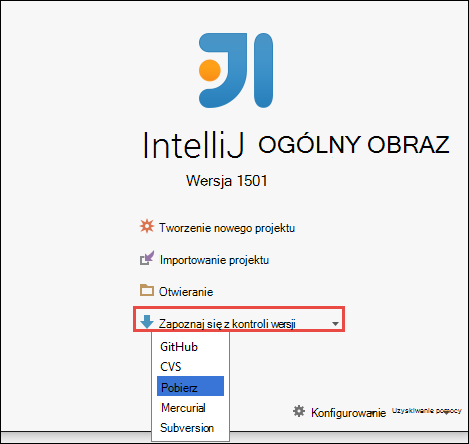

2. W oknie dialogowym **Repozytorium klonowanie** Podaj adres URL do repozytorium cyfra klonowanie z, określ katalog na klonowanie do, a następnie kliknij **klonowanie**.

    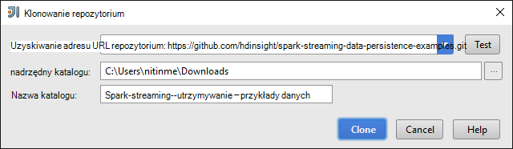

    
3. Postępuj zgodnie z instrukcjami do projektu jest całkowicie sklonowany. Naciśnij klawisze **Alt + 1** , aby otworzyć **Widok projektu**. Czy podobne do następujących.

    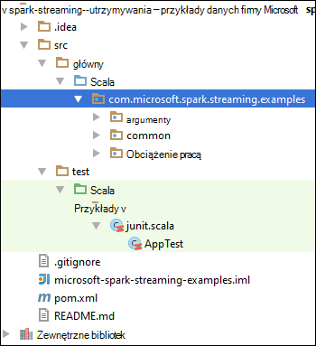
    
4. Upewnij się, że kod aplikacji jest skompilowany z Java8. Aby zapewnić, kliknij kartę **plik**, kliknij pozycję **Struktura projektu**i na karcie **Projekt** upewnij się, że poziom języka projektu jest ustawiony na **8 - Lambdas, adnotacje typ itp**.

    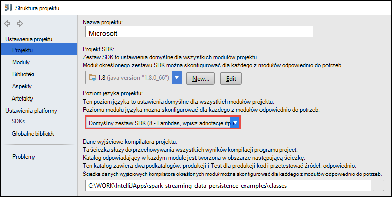

5. Otwórz **pom.xml** i upewnij się, że wersję Spark jest poprawny. W obszarze <properties> węzeł, odszukaj poniższy fragment i sprawdzić wersję Spark.

        <scala.version>2.10.4</scala.version>
        <scala.compat.version>2.10.4</scala.compat.version>
        <scala.binary.version>2.10</scala.binary.version>
        <spark.version>1.6.2</spark.version>
    
5. Aplikacja wymaga dwóch słoików zależności:

    * **EventHub słoik odbiorcy**. Jest to wymagane dla Spark do odbierania wiadomości z Centrum zdarzenia. Aby użyć tego słoik, zaktualizuj **pom.xml** , aby dodać następujące dane w obszarze `<dependencies>`.

            <dependency>
              <groupId>com.microsoft.azure</groupId>
              <artifactId>spark-streaming-eventhubs_2.10</artifactId>
              <version>1.6.0</version>
            </dependency> 

    * **Słoik sterownika JDBC**. Jest to wymagane do pisania wiadomości odbierane z Centrum zdarzeń do bazy danych programu Azure SQL. Możesz pobrać wersji 4.1 lub nowszy tego pliku słoik [tutaj](https://msdn.microsoft.com/sqlserver/aa937724.aspx). Dodawanie odwołania do tego słoik w bibliotece programu project. Wykonaj następujące czynności:

        1. W oknie POMYSŁU IntelliJ miejsce, w którym masz aplikację otworzyć, kliknij kartę **plik**kliknij pozycję **Struktura projektu**, a następnie kliknij **bibliotek**. 
        
        2. Kliknij ikonę Dodaj (), kliknij pozycję **Java**, a następnie przejdź do lokalizacji, w którego został pobrany słoik sterownika JDBC. Postępuj zgodnie z instrukcjami, aby dodać plik słoik do biblioteki programu project.

            ![Dodawanie brakujących zależności] (./media/hdinsight-apache-spark-eventhub-streaming/add-missing-dependency-jars.png "Dodawanie brakujących słoików współzależności")

        3. Kliknij przycisk **Zastosuj**.

6. Utwórz plik słoik docelowy. Wykonaj następujące czynności.
    1. W oknie dialogowym **Struktury projektu** kliknij **artefakty** , a następnie kliknij znak plus. W wyświetlonym oknie dialogowym kliknij pozycję **JAR**, a następnie kliknij **z modułów z zależnościami**.

        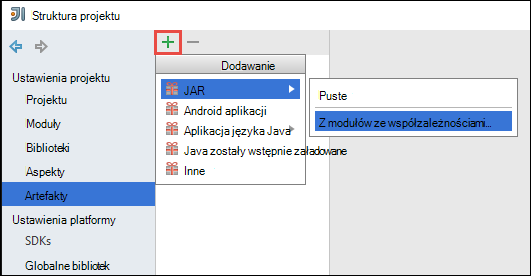

    1. W oknie dialogowym **Tworzenie JAR z modułów** , kliknij wielokropek () przed **Główne zajęć**.

    1. W oknie dialogowym **Wybierz klasy głównego** wybierz dowolną dostępne klasy, a następnie kliknij **przycisk OK**.

        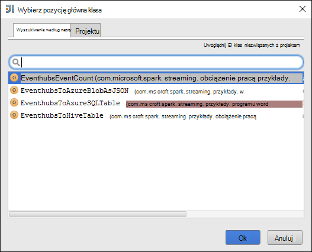

    1. W oknie dialogowym **Tworzenie JAR z modułów** upewnij się, że wybrano opcję, aby **wyodrębnić do miejsca docelowego SŁOIK** , a następnie kliknij **przycisk OK**. Spowoduje to utworzenie pojedynczego SŁOIK z wszystkie zależności.

        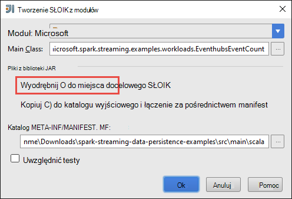

    1. Karta **Układ wynik** zawiera listę wszystkich słoików, które są częścią projektu środowiska Maven. Możesz zaznaczyć i usunąć te, na którym aplikacja Scala ma nie bezpośrednia zależność. Aplikacja jest tworzone w tym miejscu, można usunąć wszystkie znaki oprócz ostatniego jedną (**microsoft — spark-streaming — przykłady skompilować dane wyjściowe**). Wybierz pozycję słoików, aby usunąć, a następnie kliknij ikonę **Usuń** ().

        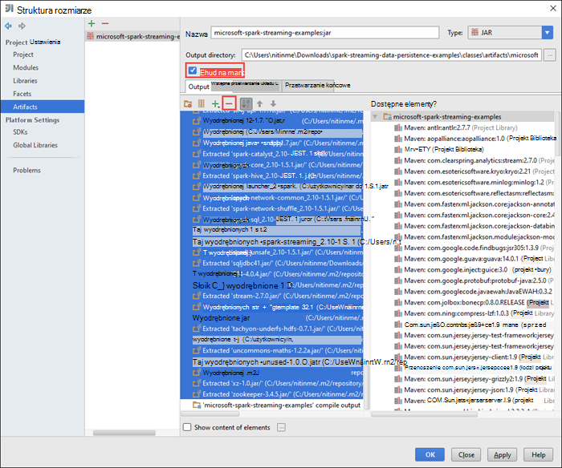

        Upewnij się, że jest zaznaczone pole **Tworzenie na rozpoczynanie** , co zapewnia utworzony słoju, każdorazowo projektu budowy lub zaktualizowane. Kliknij przycisk **Zastosuj** , a następnie **przycisk OK**.

    1. Na karcie **Układ dane wyjściowe** , prawo u dołu okna **Dostępnych elementów** masz słoik SQL JDBC, wcześniej dodany do biblioteki programu project. Na karcie **Układ dane wyjściowe** , należy dodać to. Kliknij prawym przyciskiem myszy plik słoik, a następnie kliknij **Wyodrębnić do głównego dane wyjściowe**.

        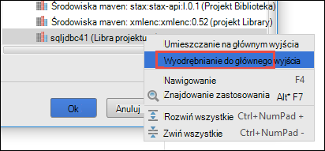  

        Karta **Układ dane wyjściowe** powinna wyglądać podobnie to.

        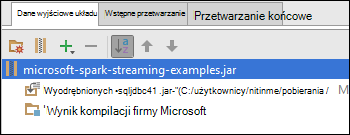     

        W oknie dialogowym **Struktury projektu** kliknij przycisk **Zastosuj** , a następnie kliknij **przycisk OK**. 

    1. Na pasku menu kliknij przycisk **Konstruuj**, a następnie kliknij **Wprowadź projektu**. Możesz również kliknąć **Tworzenie artefakty** tworzenie słoju. Słoik wynik jest tworzona w obszarze **\out\artifacts**.

        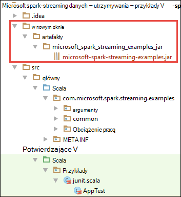

## Zdalne uruchamianie aplikacji w klastrze Spark przy użyciu Livy

Aby uruchomić przesyłanie strumieniowe aplikację zdalnie w klastrze Spark użyjemy Livy. Szczegółowe omówienie dotyczące korzystania z klastrem HDInsight Spark Livy zobacz [Przesyłanie zadania zdalnie z klastrem Apache Spark na Azure HDInsight](hdinsight-apache-spark-livy-rest-interface.md). Przed rozpoczęciem uruchamiania zdalnego zadania na przy użyciu Spark zdarzenia strumienia kilka rzeczy, które należy wykonać:

1. Uruchom lokalne autonomiczną aplikację do generowania zdarzeń i wysyłane do Centrum wydarzenie. Aby to zrobić, użyj następującego polecenia:

        java -cp EventhubsSampleEventProducer.jar com.microsoft.eventhubs.client.example.EventhubsClientDriver --eventhubs-namespace "mysbnamespace" --eventhubs-name "myeventhub" --policy-name "mysendpolicy" --policy-key "<policy key>" --message-length 32 --thread-count 32 --message-count -1

2. Kopiowanie słoik przesyłanie strumieniowe (**microsoft — spark-streaming-examples.jar**) z magazynem obiektów Blob platformy Azure skojarzone z klastrem. Dzięki temu słoju są dostępne dla Livy. Za pomocą [**AzCopy**](../storage/storage-use-azcopy.md), narzędzie wiersza polecenia, aby to zrobić. Istnieje wiele innych klientów, które umożliwiają przekazywanie danych. Można znaleźć więcej informacji na temat ich na [przekazywanie danych dla zadań Hadoop w HDInsight](hdinsight-upload-data.md).

3. ZWINIĘCIE zainstalować na komputerze, której używasz tych aplikacji. Firma Microsoft korzysta z ZWINIĘCIE wywołać punkty końcowe Livy zdalne uruchamianie zadania.

### Uruchamianie aplikacji do odbierania zdarzeń do magazyn obiektów Blob platformy Azure jako tekst

Otwórz wiersz polecenia, przejdź do katalogu, w którym zainstalowano ZWINIĘCIE i uruchom następujące polecenie (Zamień nazwy użytkownika i hasła i klaster nazwa):

    curl -k --user "admin:mypassword1!" -v -H "Content-Type: application/json" -X POST --data @C:\Temp\inputBlob.txt "https://mysparkcluster.azurehdinsight.net/livy/batches"

Parametry w pliku **inputBlob.txt** są definiowane następująco:

    { "file":"wasbs:///example/jars/microsoft-spark-streaming-examples.jar", "className":"com.microsoft.spark.streaming.examples.workloads.EventhubsEventCount", "args":["--eventhubs-namespace", "mysbnamespace", "--eventhubs-name", "myeventhub", "--policy-name", "myreceivepolicy", "--policy-key", "<put-your-key-here>", "--consumer-group", "$default", "--partition-count", 10, "--batch-interval-in-seconds", 20, "--checkpoint-directory", "/EventCheckpoint", "--event-count-folder", "/EventCount/EventCount10"], "numExecutors":20, "executorMemory":"1G", "executorCores":1, "driverMemory":"2G" }

Pozwól nam zrozumieć, co to są parametrów w pliku wejściowego:

* **plik** jest ścieżką do pliku słoik aplikacji na konto Azure magazynowania skojarzone z klastrem.
* **Nazwa_klasy** jest nazwą klasy w słoju.
* **argumenty** są na liście argumentów wymagane w klasie
* **numExecutors** jest liczba rdzeni używane przez Spark, aby uruchomić aplikację przesyłanie strumieniowe. Zawsze należy co najmniej dwa razy liczbę partycje Centrum zdarzenia.
* **executorMemory**, **executorCores** **driverMemory** są parametrami można przypisywać do przesyłania strumieniowego aplikacji wymaganych zasobów.

>[AZURE.NOTE] Nie musisz tworzyć foldery dane wyjściowe (EventCheckpoint, EventCount-EventCount10), które są używane jako parametrów. Przesyłanie strumieniowe aplikacji utworzy je.
    
Po uruchomieniu polecenia powinny zostać wyświetlone wyniki podobne do następujących:

    < HTTP/1.1 201 Created
    < Content-Type: application/json; charset=UTF-8
    < Location: /18
    < Server: Microsoft-IIS/8.5
    < X-Powered-By: ARR/2.5
    < X-Powered-By: ASP.NET
    < Date: Tue, 01 Dec 2015 05:39:10 GMT
    < Content-Length: 37
    <
    {"id":1,"state":"starting","log":[]}* Connection #0 to host mysparkcluster.azurehdinsight.net left intact

Zanotuj identyfikator partii w ostatnim wierszu wynik (w tym przykładzie jest "1"). Aby sprawdzić, czy aplikacja zostanie pomyślnie uruchomiona, może przeglądać konta magazynu platformy Azure skojarzone z klastrem i powinien zostać wyświetlony folder **/EventCount/EventCount10** utworzono. Ten folder powinien zawierać obiektów blob, które znajdują się liczba zdarzeń przetwarzane w terminie określonym przez parametr **partii interwał w sekundach**.

Aplikacja będzie nadal działać, dopóki nie zamknij go. Aby to zrobić, użyj następującego polecenia:

    curl -k --user "admin:mypassword1!" -v -X DELETE "https://mysparkcluster.azurehdinsight.net/livy/batches/1"

### Uruchamianie aplikacji do odbierania zdarzeń do magazyn obiektów Blob platformy Azure jako JSON

Otwórz wiersz polecenia, przejdź do katalogu, w którym zainstalowano ZWINIĘCIE i uruchom poniższe polecenie w (Zamień nazwy użytkownika i hasła i klaster nazwa):

    curl -k --user "admin:mypassword1!" -v -H "Content-Type: application/json" -X POST --data @C:\Temp\inputJSON.txt "https://mysparkcluster.azurehdinsight.net/livy/batches"

Parametry w pliku **inputJSON.txt** są definiowane następująco:

    { "file":"wasbs:///example/jars/microsoft-spark-streaming-examples.jar", "className":"com.microsoft.spark.streaming.examples.workloads.EventhubsToAzureBlobAsJSON", "args":["--eventhubs-namespace", "mysbnamespace", "--eventhubs-name", "myeventhub", "--policy-name", "myreceivepolicy", "--policy-key", "<put-your-key-here>", "--consumer-group", "$default", "--partition-count", 10, "--batch-interval-in-seconds", 20, "--checkpoint-directory", "/EventCheckpoint", "--event-count-folder", "/EventCount/EventCount10", "--event-store-folder", "/EventStore10"], "numExecutors":20, "executorMemory":"1G", "executorCores":1, "driverMemory":"2G" }

Parametry są podobne do określonych danych wyjściowych tekstu w poprzednim kroku. Ponownie nie musisz tworzyć foldery dane wyjściowe (EventCheckpoint, EventCount-EventCount10), które są używane jako parametrów. Przesyłanie strumieniowe aplikacji utworzy je.

 Po uruchomieniu polecenia może przeglądać konta magazynu platformy Azure skojarzone z klastrem i powinien zostać wyświetlony folder **/EventStore10** utworzono. Otwórz dowolny plik prefiksem **części** i możesz powinna być widoczna zdarzeń przetwarzane w formacie JSON.

### Uruchamianie aplikacji do odbierania zdarzeń do tabeli gałęzi

Aby uruchomić aplikację, która umożliwia strumieniowe przesyłanie zdarzeń do tabeli gałęzi konieczne pewne dodatkowe składniki. Są to:

* datanucleus-interfejsu api-jdo-3.2.6.jar
* datanucleus-rdbms-3.2.9.jar
* datanucleus-core-3.2.10.jar
* gałąź site.xml

Pliki **.jar** są dostępne w klastrze HDInsight Spark w `/usr/hdp/current/spark-client/lib`. **Gałąź site.xml** jest dostępna w `/usr/hdp/current/spark-client/conf`.

Za pomocą [WinScp](http://winscp.net/eng/download.php) kopiować te pliki z klastrem na komputer lokalny. Następnie za pomocą narzędzia kopiować te pliki do konta magazynu skojarzone z klastrem. Aby uzyskać więcej informacji na temat przekazywania plików na koncie miejsca do magazynowania zobacz [przekazywanie danych dla zadań Hadoop w HDInsight](hdinsight-upload-data.md).

Po skopiowaniu nad plikami z kontem Azure miejsca do magazynowania, otwórz wiersz polecenia, przejdź do katalogu, w którym zainstalowano ZWINIĘCIE i uruchom następujące polecenie (Zamień nazwy użytkownika i hasła i klaster nazwa):

    curl -k --user "admin:mypassword1!" -v -H "Content-Type: application/json" -X POST --data @C:\Temp\inputHive.txt "https://mysparkcluster.azurehdinsight.net/livy/batches"

Parametry w pliku **inputHive.txt** są definiowane następująco:

    { "file":"wasbs:///example/jars/microsoft-spark-streaming-examples.jar", "className":"com.microsoft.spark.streaming.examples.workloads.EventhubsToHiveTable", "args":["--eventhubs-namespace", "mysbnamespace", "--eventhubs-name", "myeventhub", "--policy-name", "myreceivepolicy", "--policy-key", "<put-your-key-here>", "--consumer-group", "$default", "--partition-count", 10, "--batch-interval-in-seconds", 20, "--checkpoint-directory", "/EventCheckpoint", "--event-count-folder", "/EventCount/EventCount10", "--event-hive-table", "EventHiveTable10" ], "jars":["wasbs:///example/jars/datanucleus-api-jdo-3.2.6.jar", "wasbs:///example/jars/datanucleus-rdbms-3.2.9.jar", "wasbs:///example/jars/datanucleus-core-3.2.10.jar"], "files":["wasbs:///example/jars/hive-site.xml"], "numExecutors":20, "executorMemory":"1G", "executorCores":1, "driverMemory":"2G" }

Parametry są podobne do określonych danych wyjściowych tekstu w poprzednich krokach. Ponownie, nie musisz tworzyć foldery wynikowe (EventCheckpoint, EventCount-EventCount10) lub dane wyjściowe tabelę programu Hive (EventHiveTable10), które są używane jako parametry. Przesyłanie strumieniowe aplikacji utworzy je. Zauważ, że opcja **słoików** i **plików** zawiera ścieżki do plików .jar i site.xml gałęzi skopiowanego z tym kontem miejsca do magazynowania.

Aby sprawdzić tabelę programu hive została pomyślnie utworzona, można SSH do klaster i uruchamianie kwerend gałęzi. Aby uzyskać instrukcje zobacz [Używanie gałęzi z Hadoop w HDInsight z SSH](hdinsight-hadoop-use-hive-ssh.md). Po nawiązaniu połączenia przy użyciu SSH, możesz uruchomić następujące polecenie, aby sprawdzić, czy jest utworzone tabelę programu Hive, **EventHiveTable10**.

    show tables;

Powinien zostać wyświetlony wynik podobny do następującego:

    OK
    eventhivetable10
    hivesampletable

Można również uruchomić kwerendę WYBIERAJĄCĄ, aby wyświetlić zawartość tabeli.

    SELECT * FROM eventhivetable10 LIMIT 10;

Powinny zostać wyświetlone wyniki podobne do następujących:

    ZN90apUSQODDTx7n6Toh6jDbuPngqT4c
    sor2M7xsFwmaRW8W8NDwMneFNMrOVkW1
    o2HcsU735ejSi2bGEcbUSB4btCFmI1lW
    TLuibq4rbj0T9st9eEzIWJwNGtMWYoYS
    HKCpPlWFWAJILwR69MAq863nCWYzDEw6
    Mvx0GQOPYvPR7ezBEpIHYKTKiEhYammQ
    85dRppSBSbZgThLr1s0GMgKqynDUqudr
    5LAWkNqorLj3ZN9a2mfWr9rZqeXKN4pF
    ulf9wSFNjD7BZXCyunozecov9QpEIYmJ
    vWzM3nvOja8DhYcwn0n5eTfOItZ966pa
    Time taken: 4.434 seconds, Fetched: 10 row(s)

### Uruchamianie aplikacji do odbierania zdarzeń do tabeli bazy danych programu Azure SQL

Przed uruchomieniem tego kroku, upewnij się, że masz bazy danych programu Azure SQL utworzone. Konieczne będzie wartości dla nazwy bazy danych, nazwa serwera bazy danych i poświadczenia administratora bazy danych jako parametrów. Nie należy jednak tworzenie tabel bazy danych. Przesyłanie strumieniowe aplikacji tworzy, który dla Ciebie.

Otwórz wiersz polecenia, przejdź do katalogu, w którym zainstalowano ZWINIĘCIE i uruchom następujące polecenie:

    curl -k --user "admin:mypassword1!" -v -H "Content-Type: application/json" -X POST --data @C:\Temp\inputSQL.txt "https://mysparkcluster.azurehdinsight.net/livy/batches"

Parametry w pliku **inputSQL.txt** są definiowane następująco:

    { "file":"wasbs:///example/jars/microsoft-spark-streaming-examples.jar", "className":"com.microsoft.spark.streaming.examples.workloads.EventhubsToAzureSQLTable", "args":["--eventhubs-namespace", "mysbnamespace", "--eventhubs-name", "myeventhub", "--policy-name", "myreceivepolicy", "--policy-key", "<put-your-key-here>", "--consumer-group", "$default", "--partition-count", 10, "--batch-interval-in-seconds", 20, "--checkpoint-directory", "/EventCheckpoint", "--event-count-folder", "/EventCount/EventCount10", "--sql-server-fqdn", "<database-server-name>.database.windows.net", "--sql-database-name", "mysparkdatabase", "--database-username", "sparkdbadmin", "--database-password", "<put-password-here>", "--event-sql-table", "EventContent" ], "numExecutors":20, "executorMemory":"1G", "executorCores":1, "driverMemory":"2G" }

Aby sprawdzić, czy aplikacja zostanie pomyślnie uruchomiona, umożliwia nawiązanie połączenia z bazą danych Azure SQL za pomocą programu SQL Server Management Studio. Aby uzyskać instrukcje, jak to zrobić zobacz [Nawiązywanie połączenia z bazą danych SQL z programu SQL Server Management Studio](../sql-database/sql-database-connect-query-ssms.md). Po nawiązaniu połączenia z bazą danych, można przejść do tabeli **EventContent** , który został utworzony przez aplikację przesyłanie strumieniowe. Można uruchomić kwerendę szybkie uzyskiwanie danych z tabeli. Uruchom następujące zapytanie:

    SELECT * FROM EventCount

Powinien zostać wyświetlony wynik podobny do następującego:

    00046b0f-2552-4980-9c3f-8bba5647c8ee
    000b7530-12f9-4081-8e19-90acd26f9c0c
    000bc521-9c1b-4a42-ab08-dc1893b83f3b
    00123a2a-e00d-496a-9104-108920955718
    0017c68f-7a4e-452d-97ad-5cb1fe5ba81b
    001KsmqL2gfu5ZcuQuTqTxQvVyGCqPp9
    001vIZgOStka4DXtud0e3tX7XbfMnZrN
    00220586-3e1a-4d2d-a89b-05c5892e541a
    0029e309-9e54-4e1b-84be-cd04e6fce5ec
    003333cf-874f-4045-9da3-9f98c2b4ea49
    0043c07e-8d73-420a-9af7-1fcb94575356
    004a11a9-0c2c-4bc0-a7d5-2e0ebd947ab9

    
## Zobacz też

* [Omówienie: Apache Spark na usługa Azure HDInsight](hdinsight-apache-spark-overview.md)

### Scenariusze

* [Spark usługi BI: Analiza danych interakcyjnych przy użyciu Spark w HDInsight z narzędzi analizy Biznesowej](hdinsight-apache-spark-use-bi-tools.md)

* [Spark z komputera nauki: używanie Spark w HDInsight do analizy temperatury konstrukcyjnych Instalacja grzewczo-Wentylacyjna danych](hdinsight-apache-spark-ipython-notebook-machine-learning.md)

* [Spark z komputera nauki: używanie Spark w HDInsight do przewidywania żywność wyników inspekcji](hdinsight-apache-spark-machine-learning-mllib-ipython.md)

* [Analiza dziennika witryny sieci Web przy użyciu Spark w HDInsight](hdinsight-apache-spark-custom-library-website-log-analysis.md)

### Tworzenie i uruchamianie aplikacji

* [Tworzenie autonomiczną aplikację za pomocą Scala](hdinsight-apache-spark-create-standalone-application.md)

* [Zdalne uruchamianie zadania w klastrze Spark przy użyciu Livy](hdinsight-apache-spark-livy-rest-interface.md)

### Narzędzia i rozszerzenia

* [Tworzenie i przesyłanie Spark Scala aplikacji za pomocą dodatku Narzędzia HDInsight uzyskać ogólny obraz IntelliJ](hdinsight-apache-spark-intellij-tool-plugin.md)

* [Zdalne debugowanie aplikacji Spark za pomocą wtyczki narzędzia HDInsight uzyskać ogólny obraz IntelliJ](hdinsight-apache-spark-intellij-tool-plugin-debug-jobs-remotely.md)

* [Notesy Zeppelin za pomocą klaster Spark na HDInsight](hdinsight-apache-spark-use-zeppelin-notebook.md)

* [Jądra dostępne dla notesu Jupyter w klastrze Spark dla HDInsight](hdinsight-apache-spark-jupyter-notebook-kernels.md)

* [Korzystanie z notesów Jupyter pakietów zewnętrznych](hdinsight-apache-spark-jupyter-notebook-use-external-packages.md)

* [Zainstaluj Jupyter na komputerze i łączenie się z klastrem HDInsight Spark](hdinsight-apache-spark-jupyter-notebook-install-locally.md)

### Zarządzanie zasobami

* [Zarządzanie zasobami dla klastrów Apache Spark w Azure HDInsight](hdinsight-apache-spark-resource-manager.md)

* [Śledzenie i debugowania zadań uruchomionych iskry Apache klaster w HDInsight](hdinsight-apache-spark-job-debugging.md)

[hdinsight-versions]: hdinsight-component-versioning.md
[hdinsight-upload-data]: hdinsight-upload-data.md
[hdinsight-storage]: hdinsight-hadoop-use-blob-storage.md

[azure-purchase-options]: http://azure.microsoft.com/pricing/purchase-options/
[azure-member-offers]: http://azure.microsoft.com/pricing/member-offers/
[azure-free-trial]: http://azure.microsoft.com/pricing/free-trial/
[azure-management-portal]: https://manage.windowsazure.com/
[azure-create-storageaccount]: ../storage-create-storage-account/ 
