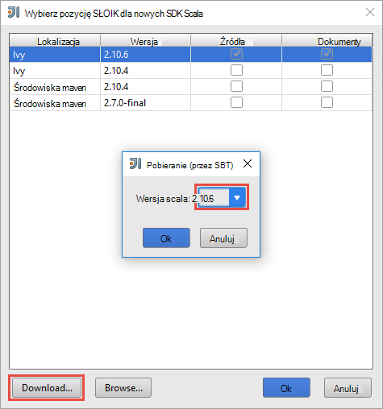
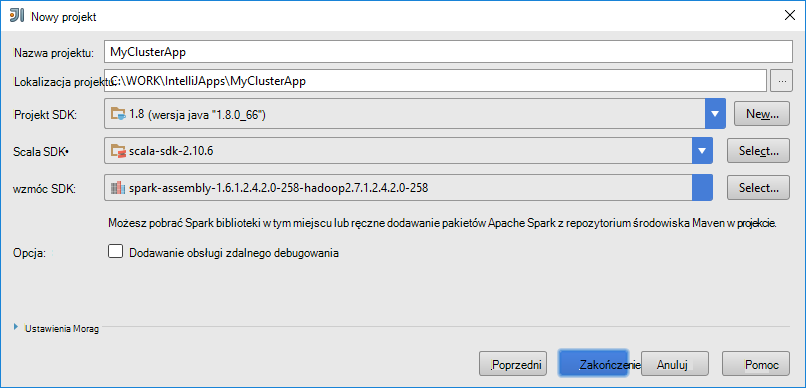
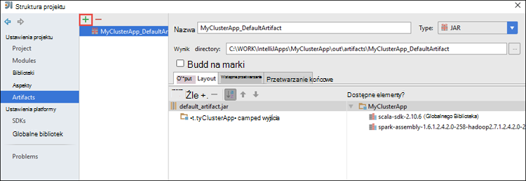
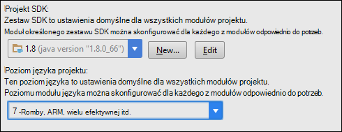
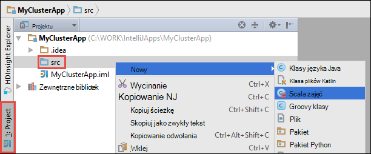

 <properties
    pageTitle="Debugowanie zdalne aplikacje na klastrów HDInsight Spark za pomocą narzędzia HDInsight w Azure zestaw narzędzi dla IntelliJ | Microsoft Azure"
    description="Dowiedz się, jak za pomocą narzędzi HDInsight w Azure zestaw narzędzi dla IntelliJ zdalnie debugowania aplikacje na klastrów HDInsight Spark."
    services="hdinsight"
    documentationCenter=""
    authors="nitinme"
    manager="jhubbard"
    editor="cgronlun"
    tags="azure-portal"/>

<tags
    ms.service="hdinsight"
    ms.workload="big-data"
    ms.tgt_pltfrm="na"
    ms.devlang="na"
    ms.topic="article"
    ms.date="09/09/2016"
    ms.author="nitinme"/>

# Aplikacje Spark zdalnie w klastrze HDInsight Spark Linux za pomocą narzędzia HDInsight w Azure zestaw narzędzi dla IntelliJ

Ten artykuł zawiera instrukcje krok po kroku dotyczące sposobu za pomocą narzędzi HDInsight w Azure zestaw narzędzi dla IntelliJ można przesłać zadanie Spark w klastrze HDInsight Spark i następnie Debuguj je zdalnie z komputera stacjonarnego. W tym celu należy wykonać następujące czynności wysokiego poziomu:

1. Tworzenie witryny do witryny lub punkt do witryny Azure wirtualnej sieci. Kroki opisane w tym dokumencie przyjęto założenie, że korzystasz z sieci witryny do witryny.

2. Utwórz klaster Spark w HDInsight Azure, będącej częścią wirtualnej sieci Azure witryny do witryny.

3. Sprawdź łączność między headnode klaster i pulpitu.

4. Tworzenie aplikacji Scala w IntelliJ POMYSŁU i skonfiguruj go zdalne debugowanie.

5. Uruchom i debugowania aplikacji.

##Wymagania wstępne

* Subskrypcję usługi Azure. Zobacz [Azure pobrać bezpłatną wersję próbną](https://azure.microsoft.com/documentation/videos/get-azure-free-trial-for-testing-hadoop-in-hdinsight/).

* Klaster Apache Spark na HDInsight Linux. Aby uzyskać instrukcje zobacz [Tworzenie Spark Apache klastrów w Azure HDInsight](hdinsight-apache-spark-jupyter-spark-sql.md).
 
* Oracle Java Development kit. [Tutaj](http://www.oracle.com/technetwork/java/javase/downloads/jdk8-downloads-2133151.html)możesz go zainstalować.
 
* IntelliJ ogólny obraz. W tym artykule korzysta wersji 15.0.1. [Tutaj](https://www.jetbrains.com/idea/download/)możesz go zainstalować.
 
* Narzędzia HDInsight w Azure zestaw narzędzi dla IntelliJ. Narzędzia HDInsight do IntelliJ są dostępne jako część zestaw narzędzi Azure dla IntelliJ. Aby uzyskać instrukcje dotyczące instalowania narzędzi Azure zobacz [Instalowanie narzędzi Azure dla IntelliJ](../azure-toolkit-for-intellij-installation.md).

* Logowanie do subskrypcji usługi Azure z IntelliJ ogólny obraz. Postępuj zgodnie z instrukcjami [poniżej](hdinsight-apache-spark-intellij-tool-plugin.md#log-into-your-azure-subscription).
 
* Podczas korzystania z aplikacji Spark Scala zdalne debugowanie na komputerze z systemem Windows, może zostać wyświetlony wyjątków, zgodnie z opisem w [iskrowym 2356](https://issues.apache.org/jira/browse/SPARK-2356) występuje ze względu na brak WinUtils.exe w systemie Windows. Aby obejść ten błąd, należy [pobrać plik wykonywalny z tego miejsca](http://public-repo-1.hortonworks.com/hdp-win-alpha/winutils.exe) do lokalizacji, takiej jak **C:\WinUtils\bin**. Następnie należy dodać zmiennej środowiska **HADOOP_HOME** i ustaw wartość zmiennej **C\WinUtils**.

## Krok 1: Tworzenie Azure wirtualnej sieci

Postępuj zgodnie z instrukcjami z poniższych łączy do tworzenie wirtualnych sieci Azure, a następnie sprawdź łączność między pulpit i Azure wirtualnej sieci.

* [Tworzenie VNet się przez połączenie VPN witryny do witryny za pomocą Azure Portal](../vpn-gateway/vpn-gateway-howto-site-to-site-resource-manager-portal.md)
* [Tworzenie VNet się przez połączenie VPN witryny do witryny przy użyciu programu PowerShell](../vpn-gateway/vpn-gateway-create-site-to-site-rm-powershell.md)
* [Konfigurowanie połączenia punkt do witryny z wirtualnej sieci przy użyciu programu PowerShell](../vpn-gateway/vpn-gateway-howto-point-to-site-rm-ps.md)

## Krok 2: Tworzenie klaster HDInsight Spark

Należy również utworzyć klaster Apache Spark na HDInsight Azure, będącej częścią wirtualnej sieci Azure utworzone przez Ciebie. Użyj dostępnych informacji na [podstawie Linux oraz tworzenie klastrów w HDInsight](hdinsight-hadoop-provision-linux-clusters.md). W ramach opcjonalnym zaznacz wirtualną sieć Azure utworzony w poprzednim kroku.

## Krok 3: Sprawdź łączność między headnode klaster i pulpitu

1. Uzyskiwanie adresu IP headnode. Otwieranie Ambari interfejsu użytkownika dla klaster. Karta klaster kliknij **pulpitu nawigacyjnego**.

    

2. Interfejs użytkownika Ambari w prawym górnym rogu kliknij **Hosts**.

    

3. Należy wyświetlić listę headnodes, pracownik węzłów i węzłów zookeeper. Headnodes mają **hn*** prefiks. Kliknij pierwszą headnode.

    

4. W dolnej części strony, która zostanie otwarta w polu **Podsumowanie** skopiuj adres IP headnode i nazwa hosta.

    

5. Zawiera adres IP i nazwa hosta headnode do pliku **hosts** na komputerze, z której chcesz uruchomić i zdalne debugowanie zadania Spark. Pozwoli na komunikowanie się za pomocą headnode przy użyciu adresu IP, a także nazwa hosta.

    1. Otwórz notes z podwyższonym poziomem uprawnień. W menu Plik kliknij polecenie **Otwórz** , a następnie przejdź do lokalizacji pliku hosts. Na komputerze z systemem Windows jest `C:\Windows\System32\Drivers\etc\hosts`.

    2. Dodaj następującą wartość do pliku **hosts** .

            # For headnode0
            192.xxx.xx.xx hn0-nitinp
            192.xxx.xx.xx hn0-nitinp.lhwwghjkpqejawpqbwcdyp3.gx.internal.cloudapp.net

            # For headnode1
            192.xxx.xx.xx hn1-nitinp
            192.xxx.xx.xx hn1-nitinp.lhwwghjkpqejawpqbwcdyp3.gx.internal.cloudapp.net

5. Na komputerze, którą połączenia wirtualnej sieci Azure, jest używana przez klaster HDInsight upewnij się, że możesz ping obu headnodes przy użyciu adresu IP, a także nazwa hosta.

6. SSH do headnode klaster zgodnie z instrukcjami zawartymi w [Nawiązywanie połączenia z klastrem HDInsight przy użyciu SSH](hdinsight-hadoop-linux-use-ssh-windows.md#connect-to-a-linux-based-hdinsight-cluster). Z headnode klaster Zbadaj adres IP komputera stacjonarnego. Należy przetestować łączność obu przypisane do komputera, jedną dla połączenia sieciowego, a drugi — wirtualnej sieci Azure, że komputer jest połączony z adresami IP.

7. Powtórz te kroki dla innych headnode także. 

## Krok 4: Tworzenie aplikacji Spark Scala przy użyciu narzędzia HDInsight w Azure narzędzi dla IntelliJ i skonfiguruj go zdalne debugowanie

1. Uruchom IntelliJ POMYSŁU i tworzenie nowego projektu. W oknie dialogowym projektu nowej wybrać następujące opcje, a następnie kliknij przycisk **Dalej**.

    

    * W okienku po lewej stronie wybierz **HDInsight**.
    * W okienku po prawej stronie wybierz **Spark na HDInsight (Scala)**.
    * Kliknij przycisk **Dalej**.

2. W następnym oknie podać szczegóły projektu.

    * Podaj nazwę projektu i lokalizacja projektu.
    * Dla **Projektu SDK**upewnij się, że podane wersję Java większa niż 7.
    * Dla **Scala SDK**kliknij przycisk **Utwórz**, kliknij przycisk **Pobierz**, a następnie wybierz wersję Scala korzystać. **Upewnij się, że nie używasz wersji 2.11.x**. W tym przykładzie użyto wersji **2.10.6**.

        

    * Dla **Zestawu SDK Spark**pobieranie i używanie SDK [tutaj](http://go.microsoft.com/fwlink/?LinkID=723585&clcid=0x409). Można również zignorować to i użyć [środowiska Maven Spark repozytorium](http://mvnrepository.com/search?q=spark) , jednak upewnij się, że masz zainstalowany opracowywaniu aplikacji Spark repozytorium prawo środowiska maven. (Na przykład konieczne upewnij się, że masz części Spark Streaming zainstalowany, jeśli korzystasz z Spark Streaming; Również należy upewnij się, że korzystasz z repozytorium oznaczony jako Scala 2.10 — nie stosować repozytorium oznaczony jako Scala 2.11.)

        

    * Kliknij przycisk **Zakończ**.

3. Projekt Spark automatycznie utworzy Struktura. Aby zobaczyć artefakt, wykonaj następujące kroki.

    1. W menu **plik** kliknij polecenie **Struktury projektu**.
    2. W oknie dialogowym **Struktury projektu** kliknij przycisk **artefakty** , aby wyświetlić artefaktu domyślny, który jest tworzony.

        

    Możesz również tworzyć własne artefaktu bly klikając **+** , wyróżnioną ikoną na ilustracji powyżej.

4. W oknie dialogowym **Struktury projektu** kliknij pozycję **Projekt**. Jeśli **Zestaw SDK programu Project** jest ustawiona na 1.8, upewnij się, że **poziom języka projektu** , jest ustawiony na **7 - romby, itp wielu efektywnej ARM,**.

    

4. Dodawanie bibliotek do projektu. Aby dodać bibliotekę, kliknij prawym przyciskiem myszy nazwę projektu w drzewie projektu, a następnie kliknij **Otwórz ustawienia modułu**. W oknie dialogowym **Struktury projektu** w okienku po lewej stronie kliknij **bibliotek**kliknij pozycję (+) symbol, a następnie kliknij pozycję **Ze środowiska Maven**. 

     

    W oknie dialogowym **Pobieranie biblioteki z repozytorium środowiska Maven** wyszukiwania i dodaj następujące biblioteki.

    * `org.scalatest:scalatest_2.10:2.2.1`
    * `org.apache.hadoop:hadoop-azure:2.7.1`

5. Kopiowanie `yarn-site.xml` i `core-site.xml` z headnode klaster i dodać je do projektu. Aby skopiować pliki, należy użyć następujących poleceń. Za pomocą [programów Cygwin](https://cygwin.com/install.html) do uruchom następujące polecenie `scp` poleceń, aby skopiować pliki z headnodes klaster.

        scp <ssh user name>@<headnode IP address or host name>://etc/hadoop/conf/core-site.xml .

    Ponieważ już dodano adres IP headnode klaster i nazwy hostów źródeł hostów plików na komputerze, firma Microsoft korzysta z poleceń **połączenia** w następujący sposób.

        scp sshuser@hn0-nitinp:/etc/hadoop/conf/core-site.xml .
        scp sshuser@hn0-nitinp:/etc/hadoop/conf/yarn-site.xml .

    Dodawanie plików do projektu, kopiując je w folderze **/src** w swojej drzewa projektu, na przykład `<your project directory>\src`.

6. Aktualizacja `core-site.xml` Aby wprowadzić następujące zmiany.

    1. `core-site.xml`zawiera zaszyfrowany klucz konto miejsca do magazynowania, związane z klastrem. W `core-site.xml` że zostało dodane do projektu, Zamień zaszyfrowany klucz klucz rzeczywistego magazynu skojarzone z kontem miejsca do magazynowania domyślne. Zobacz [Zarządzanie klawiszy dostępu do miejsca do magazynowania](../storage/storage-create-storage-account.md#manage-your-storage-account).

            <property>
                <name>fs.azure.account.key.hdistoragecentral.blob.core.windows.net</name>
                <value>access-key-associated-with-the-account</value>
            </property>

    2. Usuń następujące pozycje z `core-site.xml`.

            <property>
                <name>fs.azure.account.keyprovider.hdistoragecentral.blob.core.windows.net</name>
                <value>org.apache.hadoop.fs.azure.ShellDecryptionKeyProvider</value>
            </property>

            <property>
                <name>fs.azure.shellkeyprovider.script</name>
                <value>/usr/lib/python2.7/dist-packages/hdinsight_common/decrypt.sh</value>
            </property>

            <property>
                <name>net.topology.script.file.name</name>
                <value>/etc/hadoop/conf/topology_script.py</value>
            </property>

    3. Zapisz plik.

7. Dodawanie klasy główne aplikacji. Korzystając z **Eksploratora projektu**kliknij prawym przyciskiem myszy **src**, wskaż polecenie **Nowy**, a następnie kliknij **Scala zajęć**.

    

8. W oknie dialogowym **Tworzenie nowej klasy Scala** Podaj nazwę, wybierz **Typ** **obiektu**, a następnie kliknij **przycisk OK**.

    

9. W `MyClusterAppMain.scala` plików, wklej następujący kod. Kod ten tworzy Spark kontekst i uruchomiony `executeJob` metody `SparkSample` obiektu.

        import org.apache.spark.{SparkConf, SparkContext}

        object SparkSampleMain {
          def main (arg: Array[String]): Unit = {
            val conf = new SparkConf().setAppName("SparkSample")
                                      .set("spark.hadoop.validateOutputSpecs", "false")
            val sc = new SparkContext(conf)
        
            SparkSample.executeJob(sc,
                                   "wasbs:///HdiSamples/HdiSamples/SensorSampleData/hvac/HVAC.csv",
                                   "wasbs:///HVACOut")
          }
        }

10. Powtórz kroki 8 i 9 powyżej, aby dodać nowy obiekt Scala o nazwie `SparkSample`. Do tej klasy Dodaj następujący kod. Kod odczytuje dane z HVAC.csv (dostępne na wszystkich klastrów HDInsight Spark) pobiera wiersze, które masz tylko jedną cyfrę w siódmym kolumny w pliku CSV i zapisuje dane wyjściowe **/HVACOut** w kontenerze domyślnego miejsca do magazynowania dla klaster.

        import org.apache.spark.SparkContext
    
        object SparkSample {
          def executeJob (sc: SparkContext, input: String, output: String): Unit = {
            val rdd = sc.textFile(input)
        
            //find the rows which have only one digit in the 7th column in the CSV
            val rdd1 =  rdd.filter(s => s.split(",")(6).length() == 1)
        
            val s = sc.parallelize(rdd.take(5)).cartesian(rdd).count()
            println(s)
        
            rdd1.saveAsTextFile(output)
            //rdd1.collect().foreach(println)
          }
        
        }

11. Powtórz kroki 8 i 9 powyżej, aby dodać nową klasy o nazwie `RemoteClusterDebugging`. Ta klasa zawiera struktura testów Spark używany na potrzeby debugowania aplikacji. Dodaj następujący kod do `RemoteClusterDebugging` zajęć.

        import org.apache.spark.{SparkConf, SparkContext}
        import org.scalatest.FunSuite
        
        class RemoteClusterDebugging extends FunSuite {
        
          test("Remote run") {
            val conf = new SparkConf().setAppName("SparkSample")
                                      .setMaster("yarn-client")
                                      .set("spark.yarn.am.extraJavaOptions", "-Dhdp.version=2.4")
                                      .set("spark.yarn.jar", "wasbs:///hdp/apps/2.4.2.0-258/spark-assembly-1.6.1.2.4.2.0-258-hadoop2.7.1.2.4.2.0-258.jar")
                                      .setJars(Seq("""C:\WORK\IntelliJApps\MyClusterApp\out\artifacts\MyClusterApp_DefaultArtifact\default_artifact.jar"""))
                                      .set("spark.hadoop.validateOutputSpecs", "false")
            val sc = new SparkContext(conf)
        
            SparkSample.executeJob(sc,
              "wasbs:///HdiSamples/HdiSamples/SensorSampleData/hvac/HVAC.csv",
              "wasbs:///HVACOut")
          }
        }

    Kilka ważnych uwag poniżej:
    
    * Aby uzyskać `.set("spark.yarn.jar", "wasbs:///hdp/apps/2.4.2.0-258/spark-assembly-1.6.1.2.4.2.0-258-hadoop2.7.1.2.4.2.0-258.jar")`, upewnij się, zestawu Spark SŁOIK jest dostępna w magazynie klaster w określonej ścieżce.
    * Aby uzyskać `setJars`, określ lokalizację, w której zostanie utworzony słoik artefaktu. Zazwyczaj jest `<Your IntelliJ project directory>\out\<project name>_DefaultArtifact\default_artifact.jar`. 

11. W `RemoteClusterDebugging` klasy, kliknij prawym przyciskiem myszy `test` słów kluczowych i wybierz pozycję **Utwórz konfigurację RemoteClusterDebugging**.

    

12. W oknie dialogowym podaj nazwę dla konfiguracji, a następnie wybierz **Typ Test** nazwą **Test**. Pozostaw wszystkie inne wartości jako domyślne, kliknij przycisk **Zastosuj**, a następnie kliknij **przycisk OK**.

    

13. Powinien zostać wyświetlony konfiguracji **Zdalnego uruchamianie** listy rozwijanej na pasku menu. 

    

## Krok 5: Uruchamianie aplikacji w trybie debugowania

1. W projekcie IntelliJ POMYSŁU, otwórz `SparkSample.scala` i tworzenie przerwania obok "val rdd1". W menu podręcznym związane z tworzeniem przerwania zaznacz **wiersz w funkcji executeJob**.

    

2. Kliknij przycisk **Uruchom debugowanie** konfiguracji **Zdalnego uruchamianie** listy rozwijanej uruchomienia aplikacji.

    

3. Podczas wykonywania programu osiągnie przerwania, powinny być widoczne na karcie **debugowania** w dolnym okienku.

    

4. Kliknij pozycję (**+**) ikonę, aby dodać zegarka, jak pokazano na poniższej ilustracji. 

    

    Tutaj, ponieważ aplikacja uniemożliwia przed zmiennej `rdd1` został utworzony przy użyciu tego Obejrzyj może wyświetlać, co to są najpierw 5 wierszy w zmiennej `rdd`. Naciśnij klawisz **ENTER**.

    

    Co widać na powyższym obrazie to, że w czasie wykonywania można zbadać terrabytes danych i debugowania jak usługi wraz z postępem aplikacji. Na przykład w wynikach pokazano na ilustracji powyżej można zobaczyć, że pierwszy wiersz danych wyjściowych jest nagłówkiem. W zależności od tego, możesz zmienić swój kod aplikacji, aby pominąć wiersz nagłówka, w razie potrzeby.

5. Można teraz kliknij ikonę **Programu Życiorys** kontynuowanie uruchomieniem aplikacji.

    

6. Jeśli aplikacja zakończy się pomyślnie, powinny być widoczne wyniki podobne do następujących.

    

 

## Zobacz też

* [Omówienie: Apache Spark na usługa Azure HDInsight](hdinsight-apache-spark-overview.md)

### Scenariusze

* [Spark usługi BI: Analiza danych interakcyjnych przy użyciu Spark w HDInsight z narzędzi analizy Biznesowej](hdinsight-apache-spark-use-bi-tools.md)

* [Spark z komputera nauki: używanie Spark w HDInsight do analizy temperatury konstrukcyjnych Instalacja grzewczo-Wentylacyjna danych](hdinsight-apache-spark-ipython-notebook-machine-learning.md)

* [Spark z komputera nauki: używanie Spark w HDInsight do przewidywania żywność wyników inspekcji](hdinsight-apache-spark-machine-learning-mllib-ipython.md)

* [Spark Streaming: Używanie Spark w HDInsight do tworzenia aplikacji strumieniowych w czasie rzeczywistym](hdinsight-apache-spark-eventhub-streaming.md)

* [Analiza dziennika witryny sieci Web przy użyciu Spark w HDInsight](hdinsight-apache-spark-custom-library-website-log-analysis.md)

### Tworzenie i uruchamianie aplikacji

* [Tworzenie autonomiczną aplikację za pomocą Scala](hdinsight-apache-spark-create-standalone-application.md)

* [Zdalne uruchamianie zadania w klastrze Spark przy użyciu Livy](hdinsight-apache-spark-livy-rest-interface.md)

### Narzędzia i rozszerzenia

* [Korzystanie z narzędzi HDInsight platformy Azure zestaw narzędzi dla IntelliJ, do tworzenia i przesyłania Spark Scala aplikacji](hdinsight-apache-spark-intellij-tool-plugin.md)

* [Korzystanie z narzędzi HDInsight Azure zestaw narzędzi dla Zaćmienie, tworzenie Spark aplikacji](hdinsight-apache-spark-eclipse-tool-plugin.md)

* [Notesy Zeppelin za pomocą klaster Spark na HDInsight](hdinsight-apache-spark-use-zeppelin-notebook.md)

* [Jądra dostępne dla notesu Jupyter w klastrze Spark dla HDInsight](hdinsight-apache-spark-jupyter-notebook-kernels.md)

* [Korzystanie z notesów Jupyter pakietów zewnętrznych](hdinsight-apache-spark-jupyter-notebook-use-external-packages.md)

* [Zainstaluj Jupyter na komputerze i łączenie się z klastrem HDInsight Spark](hdinsight-apache-spark-jupyter-notebook-install-locally.md)

### Zarządzanie zasobami

* [Zarządzanie zasobami dla klastrów Apache Spark w Azure HDInsight](hdinsight-apache-spark-resource-manager.md)

* [Śledzenie i debugowania zadań uruchomionych iskry Apache klaster w HDInsight](hdinsight-apache-spark-job-debugging.md)
