 <properties
    pageTitle="Tworzenie aplikacji Spark Scala przy użyciu narzędzia HDInsight w Azure narzędzi dla IntelliJ | Microsoft Azure"
    description="Dowiedz się, jak tworzyć autonomiczne Spark aplikacji do uruchamiania w iskrowym HDInsight klastrów."
    services="hdinsight"
    documentationCenter=""
    authors="nitinme"
    manager="jhubbard"
    editor="cgronlun"
    tags="azure-portal"/>

<tags
    ms.service="hdinsight"
    ms.workload="big-data"
    ms.tgt_pltfrm="na"
    ms.devlang="na"
    ms.topic="article"
    ms.date="09/09/2016"
    ms.author="nitinme"/>

# Korzystanie z narzędzi HDInsight Azure zestaw narzędzi dla IntelliJ, aby utworzyć Spark aplikacje do klaster HDInsight Spark Linux

Ten artykuł zawiera instrukcje krok po kroku dotyczące tworzenia aplikacji Spark napisana Scala i przesłaniem go do iskry HDInsight klaster przy użyciu narzędzia HDInsight w Azure narzędzi dla IntelliJ.  Za pomocą narzędzia na kilka sposobów:

* Można opracowywać i złożyć wniosek Scala Spark w klastrze HDInsight Spark
* Aby uzyskać dostęp do zasobów klaster HDInsight Spark platformy Azure
* Aby utworzyć i wykonać aplikacji Scala Spark lokalnie

Możesz również wykonać wideo [w tym miejscu](https://mix.office.com/watch/1nqkqjt5xonza) ułatwiające rozpoczęcie pracy.

>[AZURE.IMPORTANT] To narzędzie może służyć do tworzenia i przesyłania aplikacji tylko w przypadku klaster HDInsight Spark w systemie Linux.

##Wymagania wstępne

* Subskrypcję usługi Azure. Zobacz [Azure pobrać bezpłatną wersję próbną](https://azure.microsoft.com/documentation/videos/get-azure-free-trial-for-testing-hadoop-in-hdinsight/).

* Klaster Apache Spark na HDInsight Linux. Aby uzyskać instrukcje zobacz [Tworzenie Spark Apache klastrów w Azure HDInsight](hdinsight-apache-spark-jupyter-spark-sql.md).

* Oracle Java Development kit. [Tutaj](http://www.oracle.com/technetwork/java/javase/downloads/jdk8-downloads-2133151.html)możesz go zainstalować.

* IntelliJ ogólny obraz. W tym artykule korzysta wersji 15.0.1. [Tutaj](https://www.jetbrains.com/idea/download/)możesz go zainstalować.

## Instalowanie narzędzia HDInsight w Azure zestaw narzędzi dla IntelliJ

Usługa HDInsight narzędzia IntelliJ jest dostępna w ramach zestaw narzędzi Azure dla IntelliJ. Aby uzyskać instrukcje dotyczące instalowania narzędzi Azure zobacz [Instalowanie narzędzi Azure dla IntelliJ](../azure-toolkit-for-intellij-installation.md).

## Zaloguj się do subskrypcji usługi Azure

1. Uruchamianie IntelliJ IDE i Otwórz Eksploratora Azure. W menu **Widok** w IDE kliknij **Narzędzie systemu Windows** , a następnie kliknij pozycję **Eksplorator Azure**.

    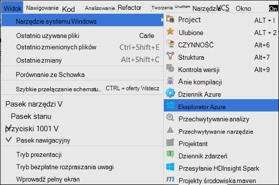

2. Kliknij prawym przyciskiem myszy węzeł **Azure** w **Eksploratorze Azure**, a następnie kliknij pozycję **Zarządzaj subskrypcjami**.

3. W oknie dialogowym **Zarządzaj subskrypcjami** kliknij przycisk **Zaloguj** i wprowadź poświadczenia Azure.

    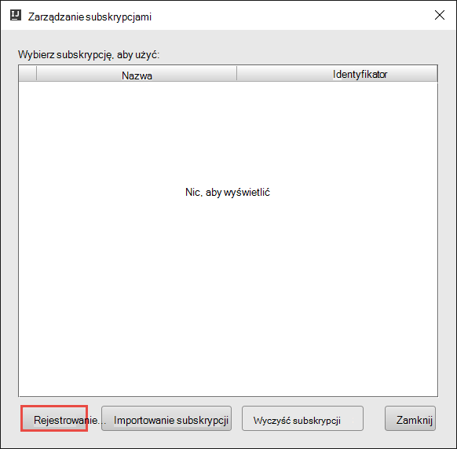

4. Po zalogowaniu się okno dialogowe **Zarządzaj subskrypcjami** zawiera listę wszystkich subskrypcji Azure skojarzone z poświadczeniami. Kliknij przycisk **Zamknij** w oknie dialogowym.

5. Na karcie **Eksplorator Azure** rozwiń **HDInsight** , aby wyświetlić klastrów HDInsight Spark w obszarze subskrypcji.

    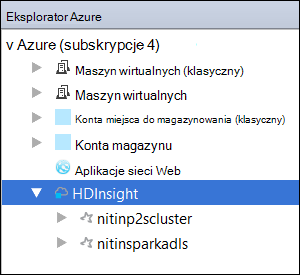

6. Nazwa węzła umożliwia przeglądanie zasobów (np. konta miejsca do magazynowania) skojarzone z klastrem można rozwinąć.

    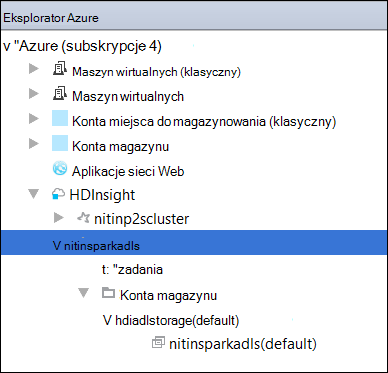

## Uruchom aplikację Spark Scala na klastrze HDInsight Spark

1. Uruchom IntelliJ POMYSŁU i tworzenie nowego projektu. W oknie dialogowym projektu nowej wybrać następujące opcje, a następnie kliknij przycisk **Dalej**.

    

    * W okienku po lewej stronie wybierz **HDInsight**.
    * W okienku po prawej stronie wybierz **Spark na HDInsight (Scala)**.
    * Kliknij przycisk **Dalej**.

2. W następnym oknie podać szczegóły projektu.

    * Podaj nazwę projektu i lokalizacja projektu.
    * Dla **Projektu SDK**upewnij się, że podane wersję Java większa niż 7.
    * Dla **Scala SDK**kliknij przycisk **Utwórz**, kliknij przycisk **Pobierz**, a następnie wybierz wersję Scala korzystać. **Upewnij się, że nie używasz wersji 2.11.x**. W tym przykładzie użyto wersji **2.10.6**.

        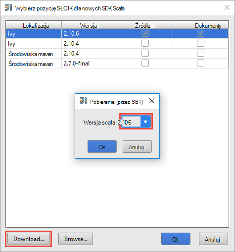

    * Dla **Zestawu SDK Spark**pobieranie i używanie SDK [tutaj](http://go.microsoft.com/fwlink/?LinkID=723585&clcid=0x409). Można również zignorować to i użyć [środowiska Maven Spark repozytorium](http://mvnrepository.com/search?q=spark) , jednak upewnij się, że masz zainstalowany opracowywaniu aplikacji Spark repozytorium prawo środowiska maven. (Na przykład konieczne upewnij się, że masz części Spark Streaming zainstalowany, jeśli korzystasz z Spark Streaming; Również należy upewnij się, że korzystasz z repozytorium oznaczony jako Scala 2.10 — nie stosować repozytorium oznaczony jako Scala 2.11.)

        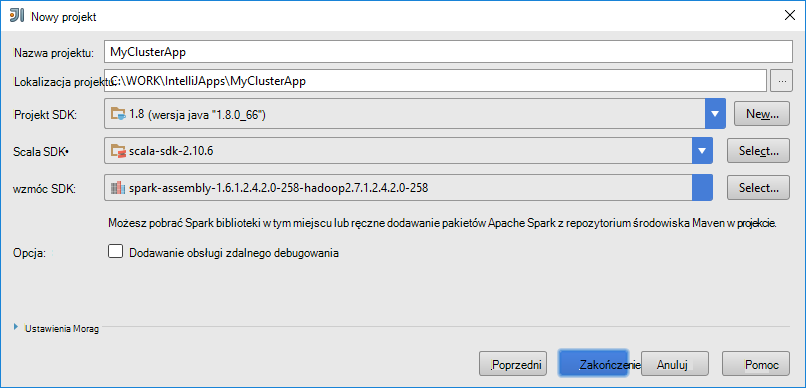

    * Kliknij przycisk **Zakończ**.

3. Projekt Spark automatycznie utworzy Struktura. Aby zobaczyć artefakt, wykonaj następujące kroki.

    1. W menu **plik** kliknij polecenie **Struktury projektu**.
    2. W oknie dialogowym **Struktury projektu** kliknij przycisk **artefakty** , aby wyświetlić artefaktu domyślny, który jest tworzony.

        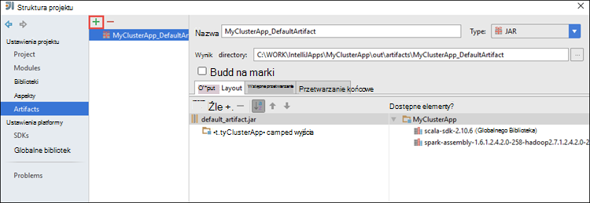

    Możesz również tworzyć własne artefaktu bly klikając **+** , wyróżnioną ikoną na ilustracji powyżej.

4. W oknie dialogowym **Struktury projektu** kliknij pozycję **Projekt**. Jeśli **Zestaw SDK programu Project** jest ustawiona na 1.8, upewnij się, że **poziom języka projektu** , jest ustawiony na **7 - romby, itp wielu efektywnej ARM,**.

    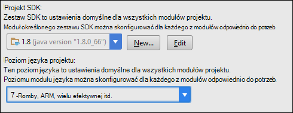

5. Dodawanie kodu źródłowego aplikacji.

    1. Korzystając z **Eksploratora projektu**kliknij prawym przyciskiem myszy **src**, wskaż polecenie **Nowy**, a następnie kliknij **Scala zajęć**.

        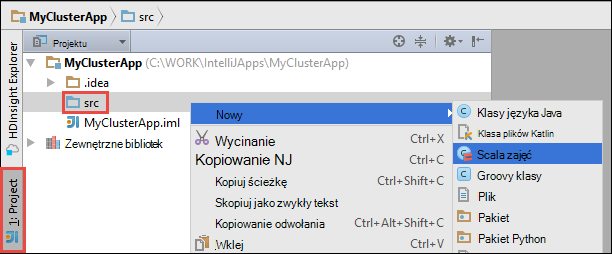

    2. W oknie dialogowym **Tworzenie nowej klasy Scala** Podaj nazwę, wybierz **Typ** **obiektu**, a następnie kliknij **przycisk OK**.

        

    3. W pliku **MyClusterApp.scala** Wklej następujący kod. Kod odczytuje dane z HVAC.csv (dostępne na wszystkich klastrów HDInsight Spark) pobiera wiersze, które masz tylko jedną cyfrę w siódmym kolumny w pliku CSV i zapisuje dane wyjściowe **/HVACOut** w kontenerze domyślnego miejsca do magazynowania dla klaster.

            import org.apache.spark.SparkConf
            import org.apache.spark.SparkContext

            object MyClusterApp{
              def main (arg: Array[String]): Unit = {
                val conf = new SparkConf().setAppName("MyClusterApp")
                val sc = new SparkContext(conf)

                val rdd = sc.textFile("wasbs:///HdiSamples/HdiSamples/SensorSampleData/hvac/HVAC.csv")

                //find the rows which have only one digit in the 7th column in the CSV
                val rdd1 =  rdd.filter(s => s.split(",")(6).length() == 1)

                rdd1.saveAsTextFile("wasbs:///HVACOut")
              }

            }

5. Uruchom aplikację w klastrze HDInsight Spark.

    1. Korzystając z **Eksploratora projektu**kliknij prawym przyciskiem myszy nazwę projektu, a następnie wybierz **Przesyłanie Spark aplikacjom HDInsight**.

        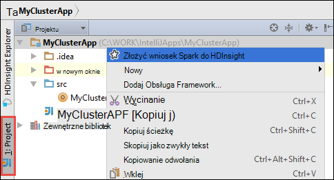

    2. Wyświetli monit o wprowadzenie poświadczeń Azure subskrypcji. W oknie dialogowym **Przesyłania Spark** Podaj następujące wartości.

        * Dla **klastrów Spark (tylko Linux)**wybierz klaster HDInsight Spark, na którym chcesz uruchomić aplikację.

        * Potrzebujesz wybierz struktura z programu project IntelliJ lub wybierz jedną z dysku twardego.

        * Przed polu tekstowym **Nazwa klasy główne** kliknij przycisk wielokropka ( ), wybierz pozycję główna klasa w kodzie źródła aplikacji, a następnie kliknij **przycisk OK**.

            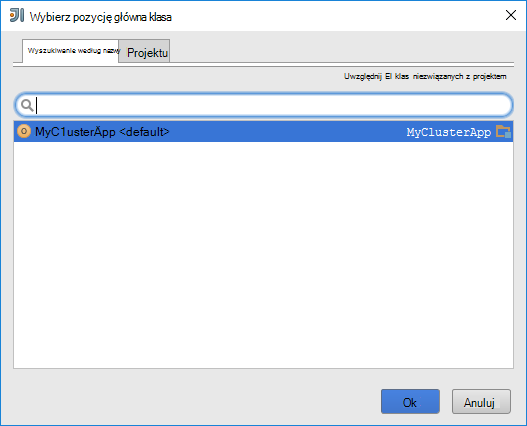

        * Ponieważ kod aplikacji, w tym przykładzie nie wymagają argumenty wiersza polecenia lub odwołanie słoików lub pliki, pozostałych pól tekstowych można pozostawić puste.

        * Po zapewnieniu wszystkie dane wejściowe, okno dialogowe powinien wyglądać w następujący sposób.

            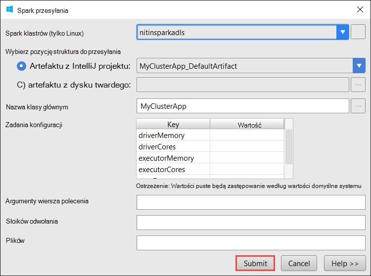

        * Kliknij przycisk **Prześlij**.

    3. Na karcie **Przesyłania Spark** w dolnej części okna powinny zacząć wyświetlania postępu. Możesz też wyłączyć aplikację, klikając pozycję czerwony przycisk w oknie "Spark przesyłania".

        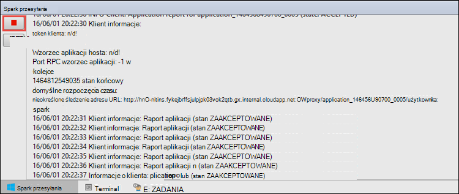

    W następnej sekcji możesz Dowiedz się, jak przejść do tego zadania wyjściowy przy użyciu narzędzia HDInsight w Azure narzędzi dla IntelliJ.

## Uzyskiwanie dostępu i zarządzanie nimi przy użyciu narzędzia HDInsight w Azure narzędzi dla IntelliJ klastrów HDInsight Spark

Można wykonywać różnych operacji za pomocą narzędzia HDInsight, które są częścią Azure zestaw narzędzi dla IntelliJ.

### Dostęp do widoku zadania bezpośrednio na karcie Narzędzia HDInsight

1. Korzystając z **Eksploratora Azure**rozwiń pozycję **HDInsight**, rozwiń nazwę klaster Spark, a następnie kliknij **zadania**.

2. W okienku po prawej stronie karty **Widok zadania Spark** Wyświetla wszystkie aplikacje, które zostały uruchomione w klastrze. Kliknij nazwę aplikacji, dla której chcesz wyświetlić więcej szczegółów.

    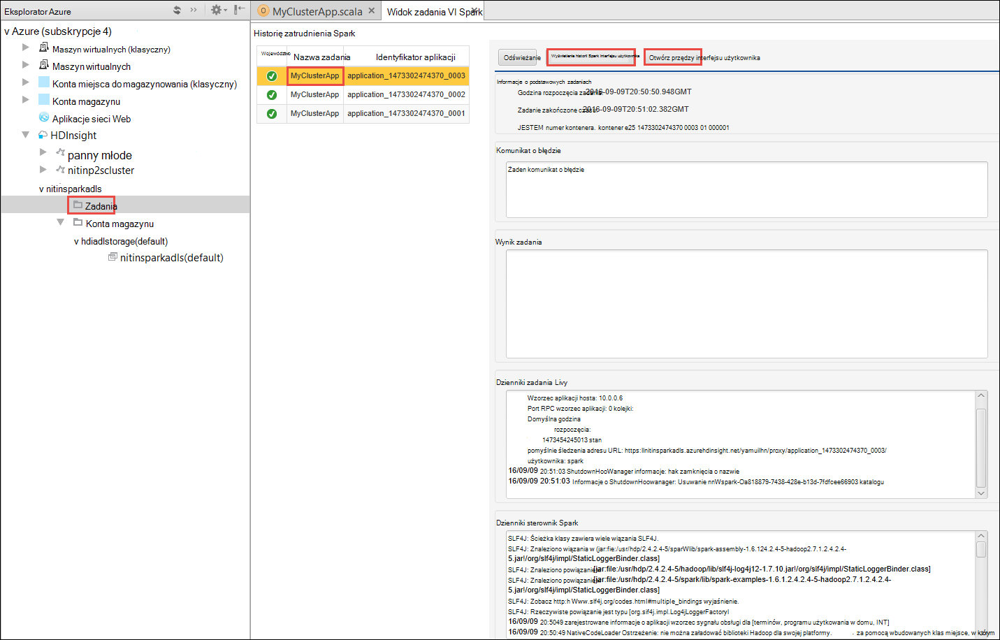

3. Pola **Komunikat o błędzie**, **Wynik zadania** **Dzienniki zadania Livy**i **Spark sterownik dzienniki** są wypełnione, oparte na pasku aplikacji, które można wybrać.

4. Za pomocą odpowiednich przycisków w górnej części ekranu, można otworzyć **Interfejsu użytkownika Historia Spark** i **PRZĘDZY interfejsu użytkownika** (na poziomie aplikacji).

### Dostęp do serwera Historia Spark

1. Korzystając z **Eksploratora Azure**rozwiń **HDInsight**, kliknij prawym przyciskiem myszy nazwę klaster Spark, a następnie wybierz **Otwórz Spark Historia elementy interfejsu użytkownika**. Po wyświetleniu monitu wprowadź poświadczenia administratora klaster. Należy wcześniej tych podczas inicjowania obsługi administracyjnej klaster.

2. Na pulpicie nawigacyjnym Spark Historia serwera, można wyszukać aplikację możesz po prostu na koniec uruchomiony przy użyciu nazwy aplikacji. W kodzie powyżej, można ustawić przy użyciu nazwy aplikacji `val conf = new SparkConf().setAppName("MyClusterApp")`. W związku z tym nazwy aplikacji Spark był **MyClusterApp**.

### Uruchamianie portalu Ambari

Korzystając z **Eksploratora Azure**rozwiń **HDInsight**, kliknij prawym przyciskiem myszy nazwę klaster Spark, a następnie wybierz **Otwórz klaster portalu zarządzania (Ambari)**. Po wyświetleniu monitu wprowadź poświadczenia administratora klaster. Należy wcześniej tych podczas inicjowania obsługi administracyjnej klaster.

### Zarządzanie subskrypcjami Azure

Domyślnie narzędzia HDInsight zawiera listę klastrów Spark z Azure subskrypcji. W razie potrzeby można określić subskrypcji, dla których chcesz uzyskać dostęp z klastrem. Korzystając z **Eksploratora Azure**kliknij prawym przyciskiem myszy węzeł główny **Azure** , a następnie kliknij **Zarządzaj subskrypcjami**. W oknie dialogowym wyczyść pola wyboru przed subskrypcję, do której użytkownik chce uzyskać dostęp do, a następnie kliknij przycisk **Zamknij**. Możesz również kliknąć **Wyloguj** Aby wylogować się z subskrypcji usługi Azure.

## Uruchom aplikację Spark Scala lokalnie

Za pomocą narzędzia HDInsight platformy Azure zestaw narzędzi dla IntelliJ przy uruchamianiu aplikacji Spark Scala lokalnie w miejscu pracy. Zazwyczaj takie aplikacje nie potrzebujesz dostępu do zasobów klaster, takich jak kontenera magazynu i można uruchomić, a testowanych lokalnie.

### Wymagania wstępne

Podczas uruchamiania aplikacji lokalnej Spark Scala na komputerze z systemem Windows, może zostać wyświetlony wyjątków, zgodnie z opisem w [iskrowym 2356](https://issues.apache.org/jira/browse/SPARK-2356) występuje ze względu na brak WinUtils.exe w systemie Windows. Aby obejść ten błąd, należy [pobrać plik wykonywalny z tego miejsca](http://public-repo-1.hortonworks.com/hdp-win-alpha/winutils.exe) do lokalizacji, takiej jak **C:\WinUtils\bin**. Następnie należy dodać zmiennej środowiska **HADOOP_HOME** i ustaw wartość zmiennej **C\WinUtils**.

### Uruchamianie aplikacji lokalnej Spark Scala  

1. Uruchom IntelliJ POMYSŁU i tworzenie nowego projektu. W oknie dialogowym projektu nowej wybrać następujące opcje, a następnie kliknij przycisk **Dalej**.

    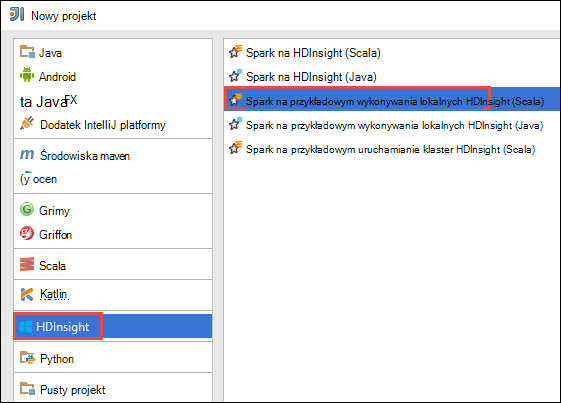

    * W okienku po lewej stronie wybierz **HDInsight**.
    * W okienku po prawej stronie wybierz **Spark HDInsight lokalne uruchamianie próbki (Scala)**.
    * Kliknij przycisk **Dalej**.

2. W następnym oknie podać szczegóły projektu.

    * Podaj nazwę projektu i lokalizacja projektu.
    * Dla **Projektu SDK**upewnij się, że podane wersję Java większa niż 7.
    * Dla **Scala SDK**kliknij przycisk **Utwórz**, kliknij przycisk **Pobierz**, a następnie wybierz wersję Scala korzystać. **Upewnij się, że nie używasz wersji 2.11.x**. W tym przykładzie użyto wersji **2.10.6**.

        

    * Dla **Zestawu SDK Spark**pobieranie i używanie SDK [tutaj](http://go.microsoft.com/fwlink/?LinkID=723585&clcid=0x409). Można również zignorować to i użyć [środowiska Maven Spark repozytorium](http://mvnrepository.com/search?q=spark) , jednak upewnij się, że masz zainstalowany opracowywaniu aplikacji Spark repozytorium prawo środowiska maven. (Na przykład konieczne upewnij się, że masz części Spark Streaming zainstalowany, jeśli korzystasz z Spark Streaming; Również należy upewnij się, że korzystasz z repozytorium oznaczony jako Scala 2.10 — nie stosować repozytorium oznaczony jako Scala 2.11.)

        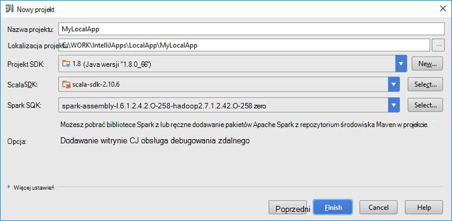

    * Kliknij przycisk **Zakończ**.

3. Szablon dodaje przykładowy kod (**LogQuery**) w folderze **src** , który może zostać uruchomiony lokalnie na komputerze.

    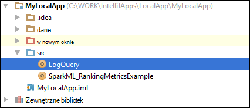

4.  Kliknij prawym przyciskiem myszy na pasku aplikacji **LogQuery** , a następnie kliknij polecenie **"Uruchom"LogQuery""**. Zostaną wyświetlone informacje w następujący sposób, na karcie **Uruchom** u dołu.

    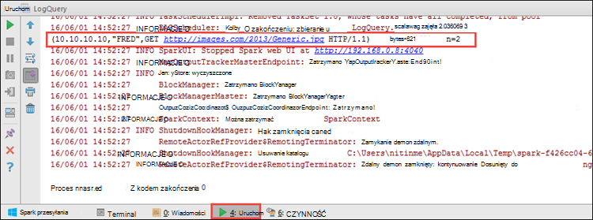

## Konwertowanie istniejących aplikacji IntelliJ ogólny obraz za pomocą narzędzi HDInsight w Azure narzędzi dla IntelliJ

Możesz także przekonwertować istniejące aplikacje Spark Scala utworzone w IntelliJ ROZWIĄZANIEM jest prawdopodobnie niezgodne z narzędzia HDInsight w Azure zestaw narzędzi dla IntelliJ. Pozwoli korzystać z narzędzia do przedstawiania zgłoszeń do klastrów HDInsight Spark. Można to zrobić, wykonując następujące czynności:

1. Dla istniejących Scala Spark wnioski utworzone za pomocą IntelliJ DOWIEDZIEĆ się, otwórz plik .iml skojarzone.
2. Na poziomie głównym zostanie wyświetlony element **moduł, w** następujący sposób:

        <module org.jetbrains.idea.maven.project.MavenProjectsManager.isMavenModule="true" type="JAVA_MODULE" version="4">

3. Edytuj element, aby dodać `UniqueKey="HDInsightTool"` dzięki czemu element **modułu** wygląda następująco:

        <module org.jetbrains.idea.maven.project.MavenProjectsManager.isMavenModule="true" type="JAVA_MODULE" version="4" UniqueKey="HDInsightTool">

4. Zapisz zmiany. Aplikacja teraz powinny być zgodne z narzędzia HDInsight w Azure zestaw narzędzi dla IntelliJ. Można to sprawdzić, klikając prawym przyciskiem myszy nazwę projektu w oknie Eksploratora projektu. Menu podręczne teraz powinny mieć możliwość **Przesyłanie Spark**aplikacji do HDInsight.

## Rozwiązywanie problemów

### Błąd "Użyj większy rozmiar stosu" lokalnego uruchamianie

W iskrowym 1.6 Jeśli korzystasz z SDK Java 32-bitowej cyklu lokalnych, mogą wystąpić następujące błędy:

    Exception in thread "main" java.lang.IllegalArgumentException: System memory 259522560 must be at least 4.718592E8. Please use a larger heap size.
        at org.apache.spark.memory.UnifiedMemoryManager$.getMaxMemory(UnifiedMemoryManager.scala:193)
        at org.apache.spark.memory.UnifiedMemoryManager$.apply(UnifiedMemoryManager.scala:175)
        at org.apache.spark.SparkEnv$.create(SparkEnv.scala:354)
        at org.apache.spark.SparkEnv$.createDriverEnv(SparkEnv.scala:193)
        at org.apache.spark.SparkContext.createSparkEnv(SparkContext.scala:288)
        at org.apache.spark.SparkContext.<init>(SparkContext.scala:457)
        at LogQuery$.main(LogQuery.scala:53)
        at LogQuery.main(LogQuery.scala)
        at sun.reflect.NativeMethodAccessorImpl.invoke0(Native Method)
        at sun.reflect.NativeMethodAccessorImpl.invoke(NativeMethodAccessorImpl.java:57)
        at sun.reflect.DelegatingMethodAccessorImpl.invoke(DelegatingMethodAccessorImpl.java:43)
        at java.lang.reflect.Method.invoke(Method.java:606)
        at com.intellij.rt.execution.application.AppMain.main(AppMain.java:144)

Jest tak, ponieważ rozmiar stosu nie jest wystarczająco duży Spark uruchomić, ponieważ Spark wymaga co najmniej 471MB (można uzyskać więcej szczegółowych informacji [SPARK 12081](https://issues.apache.org/jira/browse/SPARK-12081) Jeśli chcesz). Proste rozwiązanie polega na używanie SDK Java 64-bitowej. Możesz również zmienić ustawienia maszyny wirtualnej Java w IntelliJ, dodając do następujących opcji:

    -Xms128m -Xmx512m -XX:MaxPermSize=300m -ea

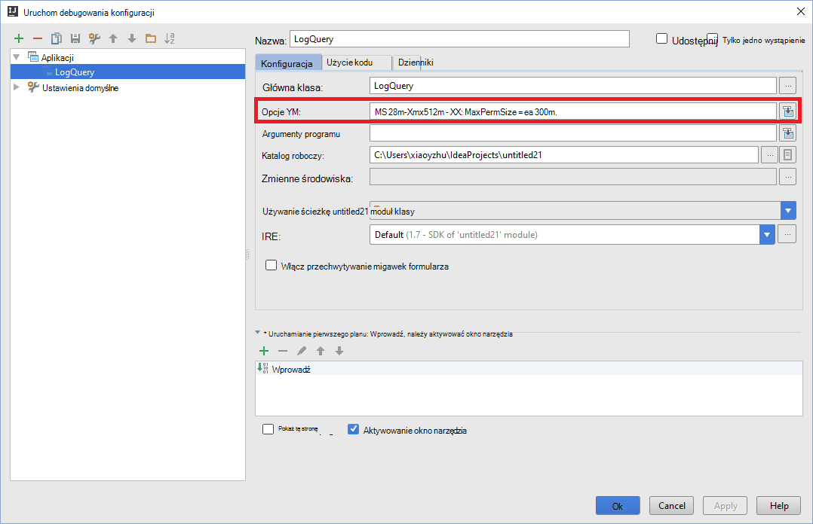

## Opinie i znane problemy

Aktualnie wyświetlana Spark Wyświetla bezpośrednio nie jest obsługiwane i pracujemy obecnie nad którą.

Jeśli masz jakieś sugestie lub opinie lub wystąpienia problemów podczas korzystania z tego narzędzia, zachęcamy upuść nam wiadomości e-mail w hdivstool w programie microsoft kropka com.

## Zobacz też

* [Omówienie: Apache Spark na usługa Azure HDInsight](hdinsight-apache-spark-overview.md)

### Scenariusze

* [Spark usługi BI: Analiza danych interakcyjnych przy użyciu Spark w HDInsight z narzędzi analizy Biznesowej](hdinsight-apache-spark-use-bi-tools.md)

* [Spark z komputera nauki: używanie Spark w HDInsight do analizy temperatury konstrukcyjnych Instalacja grzewczo-Wentylacyjna danych](hdinsight-apache-spark-ipython-notebook-machine-learning.md)

* [Spark z komputera nauki: używanie Spark w HDInsight do przewidywania żywność wyników inspekcji](hdinsight-apache-spark-machine-learning-mllib-ipython.md)

* [Spark Streaming: Używanie Spark w HDInsight do tworzenia aplikacji strumieniowych w czasie rzeczywistym](hdinsight-apache-spark-eventhub-streaming.md)

* [Analiza dziennika witryny sieci Web przy użyciu Spark w HDInsight](hdinsight-apache-spark-custom-library-website-log-analysis.md)

### Tworzenie i uruchamianie aplikacji

* [Tworzenie autonomiczną aplikację za pomocą Scala](hdinsight-apache-spark-create-standalone-application.md)

* [Zdalne uruchamianie zadania w klastrze Spark przy użyciu Livy](hdinsight-apache-spark-livy-rest-interface.md)

### Narzędzia i rozszerzenia

* [Korzystanie z narzędzi HDInsight w Azure zestaw narzędzi dla IntelliJ debugowania wzmóc aplikacji zdalnie](hdinsight-apache-spark-intellij-tool-plugin-debug-jobs-remotely.md)

* [Korzystanie z narzędzi HDInsight Azure zestaw narzędzi dla Zaćmienie, tworzenie Spark aplikacji](hdinsight-apache-spark-eclipse-tool-plugin.md)

* [Notesy Zeppelin za pomocą klaster Spark na HDInsight](hdinsight-apache-spark-use-zeppelin-notebook.md)

* [Jądra dostępne dla notesu Jupyter w klastrze Spark dla HDInsight](hdinsight-apache-spark-jupyter-notebook-kernels.md)

* [Korzystanie z notesów Jupyter pakietów zewnętrznych](hdinsight-apache-spark-jupyter-notebook-use-external-packages.md)

* [Zainstaluj Jupyter na komputerze i łączenie się z klastrem HDInsight Spark](hdinsight-apache-spark-jupyter-notebook-install-locally.md)

### Zarządzanie zasobami

* [Zarządzanie zasobami dla klastrów Apache Spark w Azure HDInsight](hdinsight-apache-spark-resource-manager.md)

* [Śledzenie i debugowania zadań uruchomionych iskry Apache klaster w HDInsight](hdinsight-apache-spark-job-debugging.md)
