<properties 
    pageTitle="Śledzenie i debugowania zadań uruchamianych w iskrowym Apache klaster w HDInsight | Microsoft Azure" 
    description="Śledzenie i debugowanie zadania uruchamiania w klastrze Spark w Azure HDInsight przy użyciu PRZĘDZY interfejsu użytkownika, Spark interfejsu użytkownika i Historia Spark serwera" 
    services="hdinsight" 
    documentationCenter="" 
    authors="nitinme" 
    manager="jhubbard" 
    editor="cgronlun"
    tags="azure-portal"/>

<tags 
    ms.service="hdinsight" 
    ms.workload="big-data" 
    ms.tgt_pltfrm="na" 
    ms.devlang="na" 
    ms.topic="article" 
    ms.date="08/25/2016" 
    ms.author="nitinme"/>

# Śledzenie i debugowania zadania uruchamiania w klastrze Apache Spark w HDInsight Linux

W tym artykule dowiesz się, jak śledzenie i debugowanie Spark zadań przy użyciu interfejsu użytkownika PRZĘDZY, Spark interfejsu użytkownika i serwer Historia Spark. W tym artykule firma Microsoft rozpocznie zadanie Spark używaniem notesu dostępne z klastrem Spark **komputera nauki: przewidywanych analizy danych inspekcji żywność przy użyciu MLLib**. Umożliwia poniższe czynności, aby śledzić aplikacji przesłania za pomocą jakiejkolwiek innej metody, jak również, na przykład **Przesyłanie spark**.

##Wymagania wstępne

Użytkownik musi mieć następujące czynności:

- Subskrypcję usługi Azure. Zobacz [Azure pobrać bezpłatną wersję próbną](https://azure.microsoft.com/documentation/videos/get-azure-free-trial-for-testing-hadoop-in-hdinsight/).
- Klaster Apache Spark na HDInsight Linux. Aby uzyskać instrukcje zobacz [Tworzenie Spark Apache klastrów w Azure HDInsight](hdinsight-apache-spark-jupyter-spark-sql.md).
- Możesz Nierozpoczęte uruchomiony notesu, **[komputera nauki: przewidywanych analizy danych inspekcji żywność przy użyciu MLLib](hdinsight-apache-spark-machine-learning-mllib-ipython.md)**. Aby uzyskać instrukcje na temat uruchamiania tego notesu wykonaj łącze.  

## Śledzenie aplikacji w Interfejsie użytkownika PRZĘDZY

1. Uruchamianie PRZĘDZY interfejsu użytkownika. Z karta klaster kliknij pozycję **Pulpit nawigacyjny klaster**, a następnie kliknij **PRZĘDZY**.

    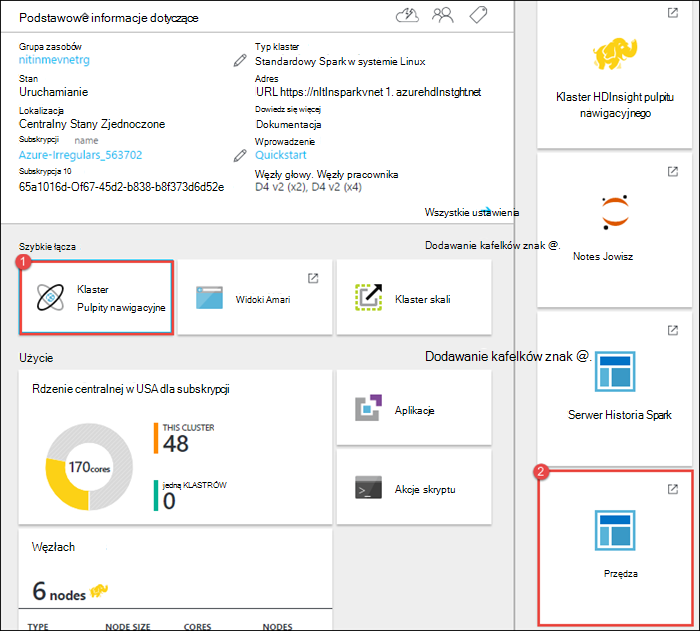

    >[AZURE.TIP] Także możesz również uruchomić interfejsu użytkownika PRZĘDZY z interfejsu użytkownika Ambari. Uruchamianie interfejsu użytkownika Ambari z karta klaster, kliknij pozycję **Pulpit nawigacyjny klaster**, a następnie kliknij przycisk **HDInsight klaster z pulpitu nawigacyjnego**. Z Ambari interfejsu użytkownika kliknij pozycję **PRZĘDZY**, kliknij przycisk **Szybkie łącza**, kliknij pozycję Menedżer zasobów aktywna, a następnie kliknij **ResourceManager interfejsu użytkownika**.  

3. Ponieważ pracę zadania Spark przy użyciu Jupyter notesów, aplikacja ma nazwę **remotesparkmagics** (jest to nazwa we wszystkich aplikacjach, które są uruchamiane w notesach). Kliknij identyfikator aplikacji przed nazwę aplikacji, aby uzyskać więcej informacji o zadaniu. Spowoduje to otwarcie widoku aplikacji.

    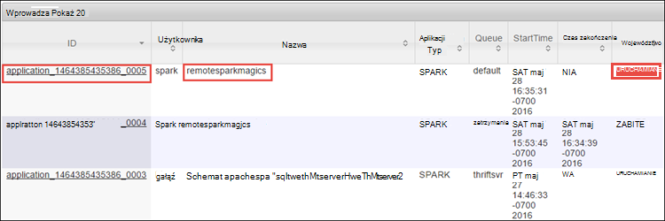

    Dla tych aplikacji, które są uruchomione w notesach Jupyter stanu jest zawsze **uruchomiony** dopiero po zamknięciu notesu.

4. W widoku aplikacji można Przechodzenie do szczegółów w przypadku Dowiedz się, kontenerów skojarzone z aplikacji i dzienniki (stdout i stderr). Możesz również uruchomić Spark interfejsu użytkownika, klikając pozycję powiązanie odpowiadające **Śledzenia adres URL**, tak jak pokazano poniżej. 

    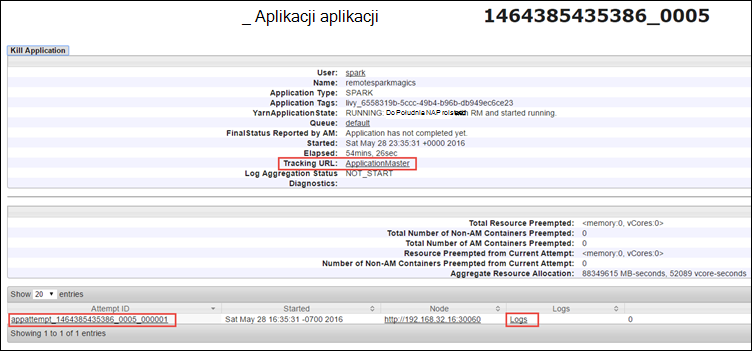

## Śledzenie aplikację w iskrowym interfejsu użytkownika

W Interfejsie Spark można Przechodzenie do szczegółów w zadań Spark, które są zduplikowanego przez aplikację, którą rozpoczęto wcześniej.

1. Aby uruchomić Spark interfejsu użytkownika, a w widoku aplikacji kliknij łącze przed adres **URL śledzenia**przedstawione powyżej przechwycony ekran. Można zobaczyć wszystkie zadania Spark, które są uruchomione przez aplikację uruchomiony w notesie Jupyter.

    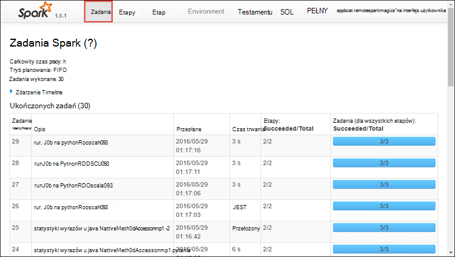

2. Kliknij kartę **testamentu** do przetwarzania i przechowywania informacji dotyczących poszczególnych program. Można także pobrać stos połączenie, klikając łącze **Wątku zrzutu** .

    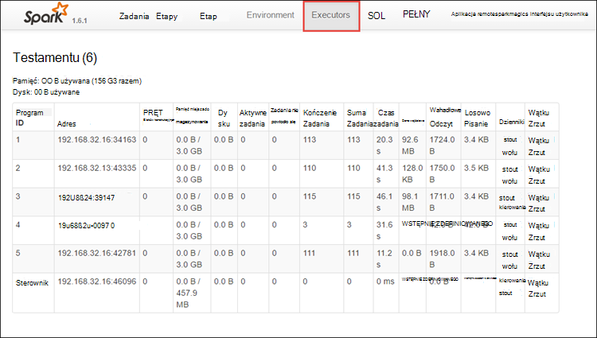
 
3. Kliknij kartę **etapy** , aby wyświetlić etapów skojarzone z aplikacją.

    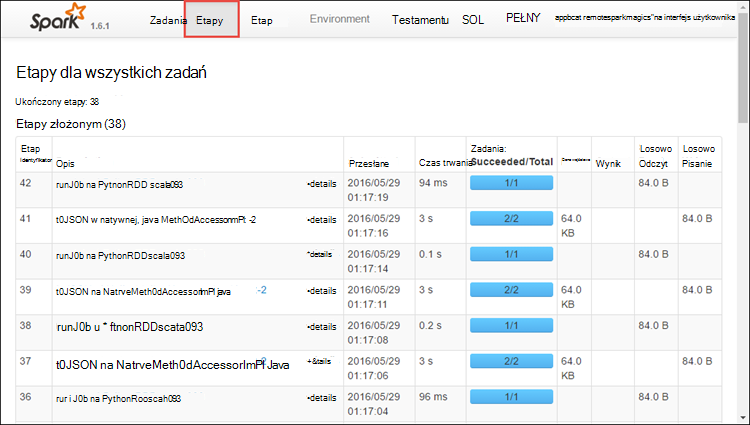

    Każdy z etapów może zawierać wiele zadań, dla których można wyświetlić statystyki wykonanie, takich jak pokazano poniżej.

    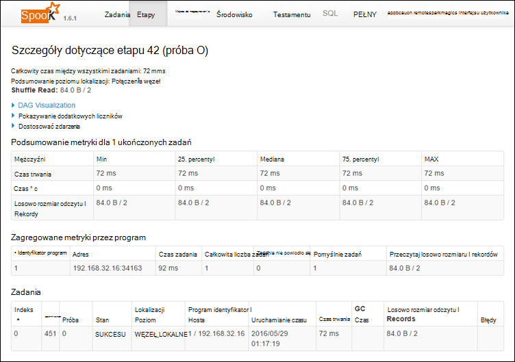 

4. Na stronie Szczegóły etapu można uruchomić AG wizualizacji. Rozwijanie łącza **AG wizualizacji** w górnej części strony, tak jak pokazano poniżej.

    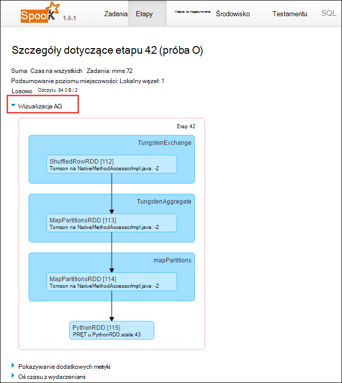

    AG lub bezpośredni wykresu Aclyic reprezentuje poszczególne etapy w aplikacji. Każdy niebieskiego pola na wykresie reprezentuje operacji Spark wywołać z poziomu aplikacji.

5. Na stronie Szczegóły etap możesz uruchomić aplikację widok osi czasu. Rozwijanie łącza **Oś czasu z wydarzeniami** w górnej części strony, tak jak pokazano poniżej.

    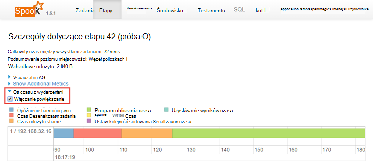

    Spowoduje to wyświetlenie wydarzeń Spark w formularzu osi czasu. Widok osi czasu jest dostępny na trzech poziomach wielu zadań w ramach danego zadania, a w ramach etapu. Obraz powyżej przechwytuje widok osi czasu dla danego etapu.

    >[AZURE.TIP] Zaznacz pole wyboru **Włącz powiększanie** , w widoku osi czasu można przewijać lewy i prawy.

6. Inne karty w Interfejsie użytkownika Spark dostarczyć przydatnych informacji o tym wystąpieniu Spark.

    * Karta miejsca do magazynowania — Jeśli aplikacja tworzy RDDs możesz znaleźć informacji na temat tych na karcie miejsca do magazynowania.
    * Karta środowisko — ta karta zawiera wiele przydatnych informacji na temat wystąpienia Spark takich jak 
        * Scala wersji
        * Katalog dziennika zdarzeń skojarzone z klastrem
        * Liczby rdzeni program aplikacji
        * Itd.

## Znajdowanie informacji o ukończonych zadań przy użyciu serwera Historia Spark

Po zakończeniu zadania na serwerze Historia Spark jest zachowywane informacji o zadaniu.

1. Uruchamianie serwera Historia Spark, karta klaster, kliknij pozycję **Pulpit nawigacyjny klaster**, a następnie kliknij przycisk **Spark Historia serwera**.

    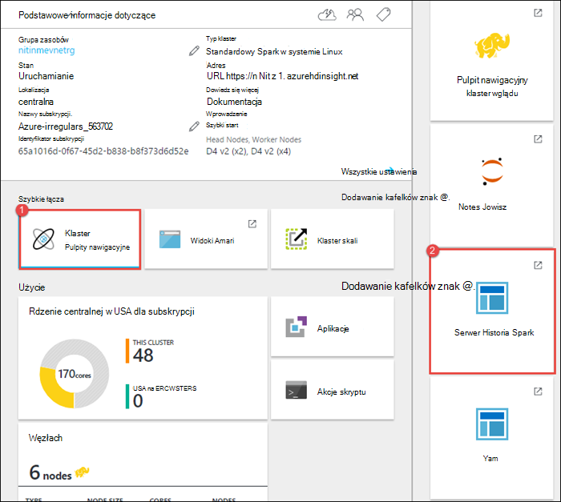

    >[AZURE.TIP] Alternatywnie możesz również uruchomić interfejs użytkownika serwera Historia Spark z Ambari interfejsu użytkownika. Uruchamianie interfejsu użytkownika Ambari z karta klaster, kliknij pozycję **Pulpit nawigacyjny klaster**, a następnie kliknij przycisk **HDInsight klaster z pulpitu nawigacyjnego**. Z Ambari interfejsu użytkownika kliknij pozycję **Spark**, kliknij przycisk **Szybkie łącza**, a następnie kliknij **Interfejs użytkownika serwera historii Spark**.

2. Zostaną wyświetlone wszystkie aplikacje wykonanych na liście. Kliknij identyfikator aplikacji, aby przechodzić do aplikacji, aby uzyskać więcej informacji.

    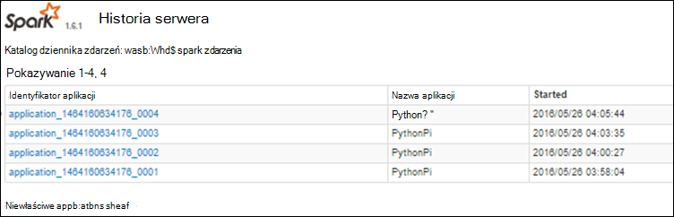
    

## Zobacz też

* [Omówienie: Apache Spark na usługa Azure HDInsight](hdinsight-apache-spark-overview.md)

### Scenariusze

* [Spark usługi BI: Analiza danych interakcyjnych przy użyciu Spark w HDInsight z narzędzi analizy Biznesowej](hdinsight-apache-spark-use-bi-tools.md)

* [Spark z komputera nauki: używanie Spark w HDInsight do analizy temperatury konstrukcyjnych Instalacja grzewczo-Wentylacyjna danych](hdinsight-apache-spark-ipython-notebook-machine-learning.md)

* [Spark z komputera nauki: używanie Spark w HDInsight do przewidywania żywność wyników inspekcji](hdinsight-apache-spark-machine-learning-mllib-ipython.md)

* [Spark Streaming: Używanie Spark w HDInsight do tworzenia aplikacji strumieniowych w czasie rzeczywistym](hdinsight-apache-spark-eventhub-streaming.md)

* [Analiza dziennika witryny sieci Web przy użyciu Spark w HDInsight](hdinsight-apache-spark-custom-library-website-log-analysis.md)

### Tworzenie i uruchamianie aplikacji

* [Tworzenie autonomiczną aplikację za pomocą Scala](hdinsight-apache-spark-create-standalone-application.md)

* [Zdalne uruchamianie zadania w klastrze Spark przy użyciu Livy](hdinsight-apache-spark-livy-rest-interface.md)

### Narzędzia i rozszerzenia

* [Tworzenie i przesyłanie Spark Scala aplikacji za pomocą dodatku Narzędzia HDInsight uzyskać ogólny obraz IntelliJ](hdinsight-apache-spark-intellij-tool-plugin.md)

* [Zdalne debugowanie aplikacji Spark za pomocą wtyczki narzędzia HDInsight uzyskać ogólny obraz IntelliJ](hdinsight-apache-spark-intellij-tool-plugin-debug-jobs-remotely.md)

* [Notesy Zeppelin za pomocą klaster Spark na HDInsight](hdinsight-apache-spark-use-zeppelin-notebook.md)

* [Jądra dostępne dla notesu Jupyter w klastrze Spark dla HDInsight](hdinsight-apache-spark-jupyter-notebook-kernels.md)

* [Korzystanie z notesów Jupyter pakietów zewnętrznych](hdinsight-apache-spark-jupyter-notebook-use-external-packages.md)

* [Zainstaluj Jupyter na komputerze i łączenie się z klastrem HDInsight Spark](hdinsight-apache-spark-jupyter-notebook-install-locally.md)

### Zarządzanie zasobami

* [Zarządzanie zasobami dla klastrów Apache Spark w Azure HDInsight](hdinsight-apache-spark-resource-manager.md)
