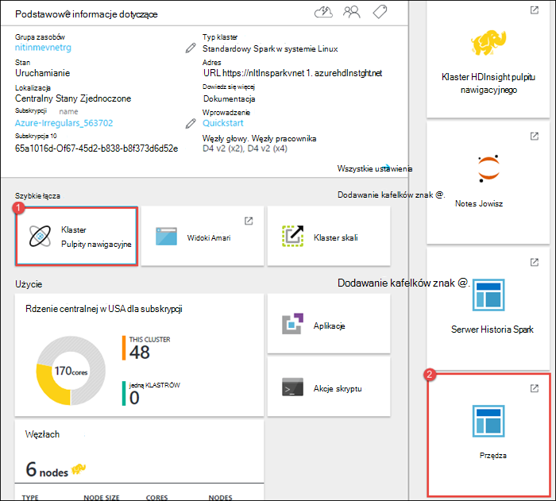
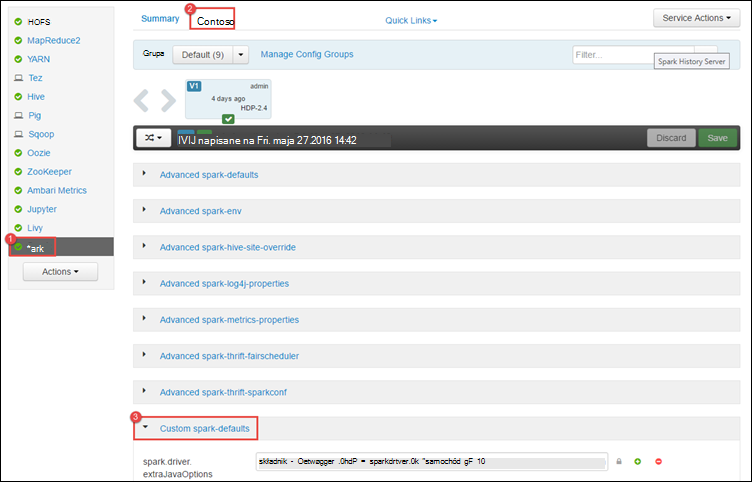
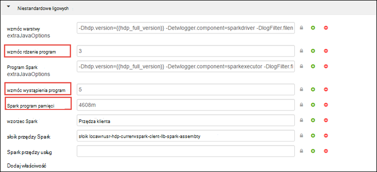
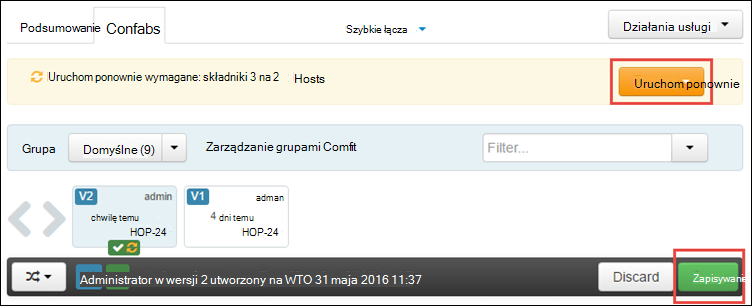
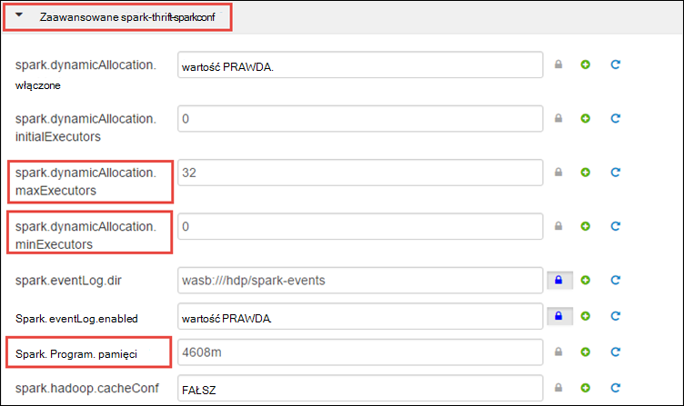
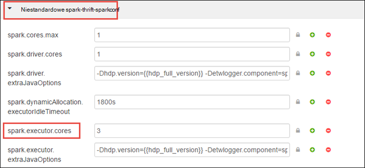
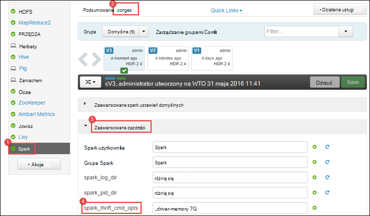
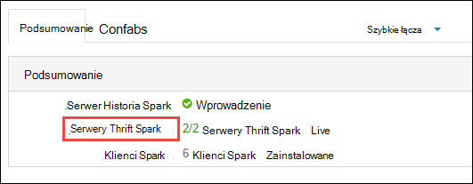
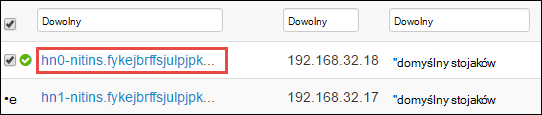
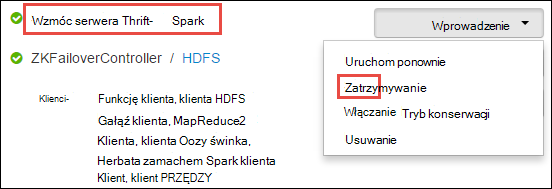

<properties 
    pageTitle="Używanie Menedżera zasobów przydzielić zasoby do klastrów Apache Spark w HDInsight | Microsoft Azure" 
    description="Dowiedz się, jak za pomocą Menedżera zasobów dla klastrów Spark na HDInsight w celu zwiększenia wydajności." 
    services="hdinsight" 
    documentationCenter="" 
    authors="nitinme" 
    manager="jhubbard" 
    editor="cgronlun"
    tags="azure-portal"/>

<tags 
    ms.service="hdinsight" 
    ms.workload="big-data" 
    ms.tgt_pltfrm="na" 
    ms.devlang="na" 
    ms.topic="article" 
    ms.date="08/25/2016" 
    ms.author="nitinme"/>

# Zarządzanie zasobami klaster Apache Spark na HDInsight Linux

W tym artykule przedstawiono sposoby uzyskać dostęp do interfejsów, takich jak Ambari interfejsu użytkownika, przędza interfejsu użytkownika, a na serwerze Historia Spark skojarzone z klaster Spark. Możesz także informacje dotyczące sposobu dostosować konfiguracji klaster umożliwiające uzyskanie optymalnej wydajności.

**Wymagania wstępne dotyczące:**

Użytkownik musi mieć następujące czynności:

- Subskrypcję usługi Azure. Zobacz [Azure pobrać bezpłatną wersję próbną](https://azure.microsoft.com/documentation/videos/get-azure-free-trial-for-testing-hadoop-in-hdinsight/).
- Klaster Apache Spark na HDInsight Linux. Aby uzyskać instrukcje zobacz [Tworzenie Spark Apache klastrów w Azure HDInsight](hdinsight-apache-spark-jupyter-spark-sql.md).

## Jak uruchomić Ambari interfejs sieci Web?

1. [Azure Portal](https://portal.azure.com/), z startboard kliknij Kafelek klaster Spark (jeśli przypięte go do startboard). Możesz również przejść do klaster w obszarze **Przeglądaj wszystkie** > **HDInsight klastrów**. 
 
2. Karta klaster Spark kliknij **pulpitu nawigacyjnego**. Po wyświetleniu monitu wprowadź poświadczenia administratora klaster Spark.

    ![Uruchamianie Ambari] (./media/hdinsight-apache-spark-resource-manager/hdispark.cluster.launch.dashboard.png "Uruchamianie Menedżera zasobów")

3. Należy uruchomić interfejs sieci Web Ambari, tak jak pokazano poniżej.

    ![Ambari interfejs użytkownika sieci Web] (./media/hdinsight-apache-spark-resource-manager/ambari-web-ui.png "Ambari interfejs użytkownika sieci Web")   

## Jak uruchomić na serwerze Historia Spark?

1. [Azure Portal](https://portal.azure.com/), z startboard kliknij Kafelek klaster Spark (jeśli przypięte go do startboard).

2. Karta klaster w obszarze **Szybkie łącza**kliknij **Klaster pulpitu nawigacyjnego**. Karta **Pulpit nawigacyjny klaster** kliknij **Spark Historia serwer**.

    ![Serwer Historia Spark] (./media/hdinsight-apache-spark-resource-manager/launch-history-server.png "Serwer Historia Spark")

    Po wyświetleniu monitu wprowadź poświadczenia administratora klaster Spark.

## Jak uruchomić przędzy interfejsu użytkownika?

Interfejs użytkownika PRZĘDZY służy do monitorowania aplikacji, które są obecnie uruchomione w klastrze Spark. 

1. Z karta klaster kliknij pozycję **Pulpit nawigacyjny klaster**, a następnie kliknij **PRZĘDZY**.

    

    >[AZURE.TIP] Także możesz również uruchomić interfejsu użytkownika PRZĘDZY z interfejsu użytkownika Ambari. Uruchamianie interfejsu użytkownika Ambari z karta klaster, kliknij pozycję **Pulpit nawigacyjny klaster**, a następnie kliknij przycisk **HDInsight klaster z pulpitu nawigacyjnego**. Z Ambari interfejsu użytkownika kliknij pozycję **PRZĘDZY**, kliknij przycisk **Szybkie łącza**, kliknij pozycję Menedżer zasobów aktywne, a następnie kliknij **ResourceManager interfejsu użytkownika**.

## Co to jest Konfiguracja klaster optymalne do uruchamiania Spark aplikacji?

Są trzy kluczowe parametry, które mogą być używane w iskrowym konfiguracji, w zależności od wymagania dotyczące aplikacji `spark.executor.instances`, `spark.executor.cores`, i `spark.executor.memory`. Program jest procesem uruchomione dla aplikacji Spark. Działa na węzeł pracownika, a odpowiada do wykonywania zadań dla aplikacji. Domyślny numer testamentu i rozmiarów program dla każdego klaster jest obliczana na podstawie liczby węzłów pracownika i rozmiaru węzła pracownika. Są one przechowywane w `spark-defaults.conf` w węzłach głowy. 

Parametry konfiguracji trzy można skonfigurować na poziomie klaster (dla wszystkich aplikacji, które są uruchamiane w klastrze) lub można określić dla każdej poszczególnych aplikacji.

### Zmienianie parametrów przy użyciu interfejsu użytkownika Ambari

1. W interfejsie użytkownika Ambari kliknij **Spark**, kliknij pozycję **podawać**, a następnie rozwiń **niestandardowe spark domyślne**.

    

2. Warto mieć 4 Spark aplikacje są uruchamiane jednocześnie w klastrze jest domyślne wartości. Możesz zmiany tych wartości przy użyciu interfejsu użytkownika, jak pokazano poniżej.

    

3. Kliknij przycisk **Zapisz** , aby zapisać zmiany konfiguracji. W górnej części strony wyświetli monit o ponowne uruchomienie wszystkich usług. Kliknij przycisk **Uruchom**.

    

### Zmienianie parametrów aplikacji uruchomionej w notesie Jupyter

W przypadku aplikacji działających w notesie Jupyter, można użyć `%%configure` magiczną do wprowadzania zmian w konfiguracji. Najlepiej, jeśli musisz wprowadzić takie zmiany na początku aplikacji, przed uruchomieniem pierwszej komórki kodu. Dzięki temu zastosowana konfiguracja do sesji Livy, gdy zostanie utworzony. Jeśli chcesz zmienić konfigurację na późniejszym etapie w aplikacji, należy użyć `-f` parametru. Jednak w ten sposób wszystkie informacje o postępie w aplikacji, zostaną utracone.

Wstawkę kodu poniżej przedstawiono sposób zmieniania konfiguracji aplikacji działa w Jupyter.

    %%configure 
    {"executorMemory": "3072M", "executorCores": 4, “numExecutors”:10}

Parametry konfiguracji należy przekazać w postaci ciągu JSON i należy przejść do następnego wiersza po magiczną, jak pokazano w przykładzie kolumna. 

### Zmiana, która przesyłanie spark parametry przesłane przy użyciu aplikacji

Przykładem sposobu zmieniania parametry konfiguracji dla aplikacji partii, która jest przesyłany przy użyciu następującego polecenia jest `spark-submit`.

    spark-submit --class <the application class to execute> --executor-memory 3072M --executor-cores 4 –-num-executors 10 <location of application jar file> <application parameters>

### Zmienianie parametrów wniosku, przy użyciu zwinięcie

Przykładem sposobu zmieniania parametry konfiguracji dla aplikacji partii, która jest przesyłany przy użyciu zwinięcie jest następującego polecenia.

    curl -k -v -H 'Content-Type: application/json' -X POST -d '{"file":"<location of application jar file>", "className":"<the application class to execute>", "args":[<application parameters>], "numExecutors":10, "executorMemory":"2G", "executorCores":5' localhost:8998/batches

### Jak zmienić tych parametrów na serwerze Thrift Spark?

Serwer Thrift Spark zapewnia dostęp JDBC lub ODBC do klastrów Spark i jest używany do zapytania Spark SQL usługi. Narzędzia, takich jak usługi Power BI, Tableau itp. za pomocą protokołu ODBC komunikować się z serwerem Thrift Spark do wykonywania kwerend Spark SQL jako aplikacja Spark. Po utworzeniu klastrze Spark dwa wystąpienia serwera Thrift Spark są uruchamiane, w każdej węzła głównego. Każdy serwer Thrift Spark jest widoczny jako aplikacja Spark w Interfejsie użytkownika PRZĘDZY. 

Serwer Thrift Spark używa Spark program dynamicznej alokacji i w związku z tym `spark.executor.instances` nie jest używane. Zamiast tego używa serwera Thrift Spark `spark.dynamicAllocation.minExecutors` i `spark.dynamicAllocation.maxExecutors` do określenia liczby program. Parametry konfiguracji `spark.executor.cores` i `spark.executor.memory` jest używana, aby zmienić rozmiar program. Te parametry można zmienić, tak jak pokazano poniżej.

* Rozwiń kategorię **Zaawansowane sparkconf do thrift spark** , aby zaktualizować parametry `spark.dynamicAllocation.minExecutors`, `spark.dynamicAllocation.maxExecutors`, i `spark.executor.memory`.

     

* Rozwiń kategorię **niestandardowe spark-thrift-sparkconf** , aby zaktualizować parametr `spark.executor.cores`.

    

### Jak zmienić pamięci sterownika serwera Thrift Spark?

Pamięć sterownika Spark Thrift serwera jest skonfigurowany do 25% rozmiar pamięci RAM węzła głównego, pod warunkiem, że całkowity rozmiar pamięci RAM węzła głównego jest większa niż 14 GB. Interfejs użytkownika Ambari służy do zmiany konfiguracji pamięci sterownik, tak jak pokazano poniżej.

* W interfejsie użytkownika Ambari kliknij **Spark**, kliknij **podawać**, rozwiń pozycję **Zaawansowane spark Koperta**i podać wartość dla **spark_thrift_cmd_opts**.

    

## BI nie jest używany z klastrem Spark. Jak ponownie wykonać zasobów?

Ponieważ firma Microsoft korzysta z przydzielania Spark tylko zasoby, które są używane przez serwer thrift są zasobów dla aplikacji dwa wzorce. Aby odzyskać te zasoby można zatrzymać usług serwera Thrift uruchamiania w klastrze.

1. Interfejs użytkownika Ambari w okienku po lewej stronie kliknij **Spark**.

2. Na następnej stronie kliknij pozycję **Serwery Thrift Spark**.

    

3. Powinien zostać wyświetlony dwóch headnodes, na których działa serwer Thrift Spark. Kliknij jeden z headnodes.

    

4. Następna strona zawiera listę wszystkich usług uruchomionych dla tego headnode. Na liście kliknij przycisk listy rozwijanej obok Spark Thrift serwera, a następnie kliknij **zatrzymać**.

    

5. Powtórz te czynności na innych headnode także.

## Moje notesy Jupyter nie działają zgodnie z oczekiwaniami. Jak można uruchomić ponownie usługę?

1. Uruchamianie Ambari interfejs sieci Web, jak pokazano powyżej. W okienku nawigacji po lewej stronie kliknij pozycję **Jupyter**, kliknij pozycję **Usługa akcje**, a następnie kliknij **Uruchom ponownie wszystkie**. To uruchomi usługę Jupyter wszystkich headnodes.

    ![Uruchom ponownie Jupyter] (./media/hdinsight-apache-spark-resource-manager/restart-jupyter.png "Uruchom ponownie Jupyter")

    

## Zobacz też

* [Omówienie: Apache Spark na usługa Azure HDInsight](hdinsight-apache-spark-overview.md)

### Scenariusze

* [Spark usługi BI: Analiza danych interakcyjnych przy użyciu Spark w HDInsight z narzędzi analizy Biznesowej](hdinsight-apache-spark-use-bi-tools.md)

* [Spark z komputera nauki: używanie Spark w HDInsight do analizy temperatury konstrukcyjnych Instalacja grzewczo-Wentylacyjna danych](hdinsight-apache-spark-ipython-notebook-machine-learning.md)

* [Spark z komputera nauki: używanie Spark w HDInsight do przewidywania żywność wyników inspekcji](hdinsight-apache-spark-machine-learning-mllib-ipython.md)

* [Spark Streaming: Używanie Spark w HDInsight do tworzenia aplikacji strumieniowych w czasie rzeczywistym](hdinsight-apache-spark-eventhub-streaming.md)

* [Analiza dziennika witryny sieci Web przy użyciu Spark w HDInsight](hdinsight-apache-spark-custom-library-website-log-analysis.md)

### Tworzenie i uruchamianie aplikacji

* [Tworzenie autonomiczną aplikację za pomocą Scala](hdinsight-apache-spark-create-standalone-application.md)

* [Zdalne uruchamianie zadania w klastrze Spark przy użyciu Livy](hdinsight-apache-spark-livy-rest-interface.md)

### Narzędzia i rozszerzenia

* [Tworzenie i przesyłanie Spark Scala aplikacji za pomocą dodatku Narzędzia HDInsight uzyskać ogólny obraz IntelliJ](hdinsight-apache-spark-intellij-tool-plugin.md)

* [Zdalne debugowanie aplikacji Spark za pomocą wtyczki narzędzia HDInsight uzyskać ogólny obraz IntelliJ](hdinsight-apache-spark-intellij-tool-plugin-debug-jobs-remotely.md)

* [Notesy Zeppelin za pomocą klaster Spark na HDInsight](hdinsight-apache-spark-use-zeppelin-notebook.md)

* [Jądra dostępne dla notesu Jupyter w klastrze Spark dla HDInsight](hdinsight-apache-spark-jupyter-notebook-kernels.md)

* [Korzystanie z notesów Jupyter pakietów zewnętrznych](hdinsight-apache-spark-jupyter-notebook-use-external-packages.md)

* [Zainstaluj Jupyter na komputerze i łączenie się z klastrem HDInsight Spark](hdinsight-apache-spark-jupyter-notebook-install-locally.md)

### Zarządzanie zasobami

* [Śledzenie i debugowania zadań uruchomionych iskry Apache klaster w HDInsight](hdinsight-apache-spark-job-debugging.md)

[hdinsight-versions]: hdinsight-component-versioning.md
[hdinsight-upload-data]: hdinsight-upload-data.md
[hdinsight-storage]: hdinsight-hadoop-use-blob-storage.md

[azure-purchase-options]: http://azure.microsoft.com/pricing/purchase-options/
[azure-member-offers]: http://azure.microsoft.com/pricing/member-offers/
[azure-free-trial]: http://azure.microsoft.com/pricing/free-trial/
[azure-management-portal]: https://manage.windowsazure.com/
[azure-create-storageaccount]: storage-create-storage-account.md 
